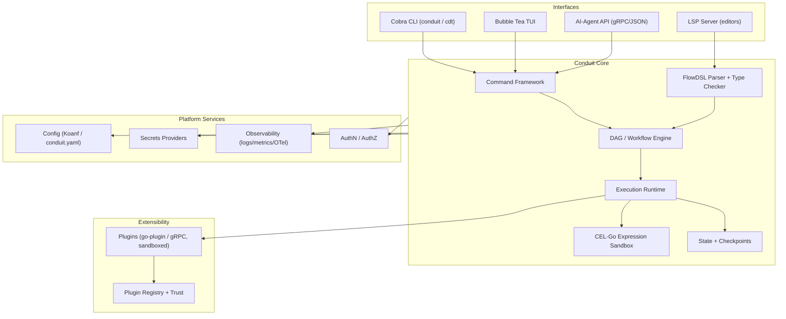

# Conduit — Executive Summary

> Document ID: `00-executive-summary`
> Status: Draft (v0.1.0)
> Owner: Principal Product Architect
> Last updated: 2026-07-02

Related documents:
- [Product Vision](01-product-vision.md)
- [Product Requirements (PRD)](02-prd.md)
- [Functional Requirements](03-functional-requirements.md)
- [Non-Functional Requirements](04-non-functional-requirements.md)
- [Security Requirements](05-security-requirements.md)
- [Platform Architecture](10-platform-architecture.md)

---

## 1. TL;DR

**Conduit** is an enterprise-grade, Go-based CLI and automation platform that unifies three things teams currently stitch together from incompatible tools: a **fast, ergonomic command-line application framework**, a **declarative workflow/DAG engine** (via **FlowDSL**, `*.flow` files), and a **programmable execution runtime** with first-class support for plugins, secrets, observability, and AI agents.

- Binary: `conduit` (alias `cdt`)
- Go module: `github.com/conduit-io/conduit`
- Language/toolchain: Go 1.24+
- Versioning: SemVer 2.0.0
- Core stack: **Cobra** (CLI), **Koanf** (config, `conduit.yaml`), **CEL-Go** (expressions), **HashiCorp go-plugin/gRPC** (plugins), **Bubble Tea** (TUI), **LSP + tree-sitter-flow** (editor tooling).

The 12-month goal is a General Availability (GA) release that a platform engineering team can adopt as the *single* substrate for internal CLIs, CI/CD glue, operational runbooks, and agent-driven automation — replacing an ad-hoc mix of Make/just/Taskfile, bespoke Cobra apps, YAML pipelines, and one-off Python scripts.

---

## 2. Problem

Modern platform, DevOps, SRE, and AI-agent teams operate a sprawling, fragmented automation estate:

1. **CLI proliferation without a framework.** Internal tools are built as one-off Cobra/Click/oclif apps. Each reinvents config loading, completion, auth, secret handling, logging, and plugin loading. There is no shared contract, so tools drift in UX and security posture.

2. **Workflow logic trapped in CI YAML.** Business-critical orchestration (deploys, migrations, data pipelines, incident runbooks) lives in GitHub Actions / GitLab CI YAML that is **not runnable locally**, hard to test, and coupled to a vendor. "Works in CI, breaks on my machine" is structural, not accidental.

3. **The Make/just/Taskfile ceiling.** Task runners are great for simple targets but lack typed inputs, real DAG semantics with data passing, structured state, retries/compensation, secrets integration, and observability. Teams outgrow them and fall back to shell.

4. **Heavyweight orchestrators are overkill for the 80% case.** Temporal, Airflow, and Dagger solve durable/distributed orchestration but demand servers, SDKs, and operational overhead disproportionate to "run these ten steps reliably with good UX."

5. **AI agents need a safe, structured tool surface.** Agent builders want to expose operational capabilities to LLMs, but shelling out to arbitrary commands is unsafe and unstructured. There is no standard, sandboxed, machine-consumable contract for "here are the actions this system can take, with typed inputs, permissions, and audit."

**The gap:** there is no single tool that is *as fast and ergonomic as a native CLI*, *as declarative and testable as a workflow engine*, *as extensible as a plugin platform*, and *as safe and structured as an agent tool API* — while remaining a **single static binary** with no server to operate.

---

## 3. Vision

> **Conduit is the connective tissue between humans, machines, and AI agents — one declarative platform to define, run, and observe automation, from a laptop to a fleet.**

Conduit lets a team **declare** what should happen in FlowDSL, **run** it identically everywhere (local, CI, server, agent), and **observe** it with structured, exportable telemetry — all from a single signed binary with a trustworthy plugin ecosystem.

See the full vision, personas, and positioning in [Product Vision](01-product-vision.md).

---

## 4. Differentiators

| # | Differentiator | Why it matters |
|---|----------------|----------------|
| D1 | **Single binary, no server** | Runs on a laptop, in CI, and on a box identically. No control plane to operate for the common case. |
| D2 | **FlowDSL: declarative + testable DAGs** | Typed inputs, real dependency graph, data passing, retries, and compensation — expressible in `*.flow` files that are unit-testable. |
| D3 | **CLI framework + workflow engine unified** | The same command definitions power an interactive CLI, a workflow step, and an agent tool. Define once, expose three ways. |
| D4 | **First-class AI-agent API** | Every command/flow is discoverable and invocable as a structured, permissioned, sandboxed tool with JSON schemas and audit — safe for LLM orchestration. |
| D5 | **Enterprise security by default** | SLSA provenance, SBOMs, sigstore/cosign signing, sandboxed plugins (go-plugin/gRPC), CEL sandbox limits, audit logging, least-privilege secrets. See [Security Requirements](05-security-requirements.md). |
| D6 | **Best-in-class editor experience** | LSP server + `tree-sitter-flow` grammar deliver completion, diagnostics, hovers, and go-to-definition for FlowDSL in any editor. |
| D7 | **Sub-50ms cold start** | Native Go, lazy plugin loading, precomputed completion — instant enough to feel like a native shell builtin. |
| D8 | **Portable everywhere** | Windows/macOS/Linux on amd64/arm64, with consistent behavior and shell completion (bash/zsh/fish/PowerShell). |

---

## 5. Target Users

Conduit targets four primary buyer/user segments (detailed personas in [Product Vision](01-product-vision.md)):

- **Platform Engineers** building internal developer platforms and golden paths. Conduit is their framework for shipping consistent internal CLIs and paved-road workflows.
- **DevOps Engineers** owning CI/CD and release automation. Conduit gives them locally-runnable, testable pipelines that are portable across CI vendors.
- **SREs** maintaining operational runbooks and incident response. Conduit turns tribal shell knowledge into versioned, auditable, safe-to-run flows with dry-run and compensation.
- **AI-Agent Builders** exposing operational capabilities to LLM agents. Conduit is the structured, sandboxed, auditable tool surface that makes agent automation safe.

Secondary: application developers wanting a batteries-included CLI framework; security/compliance teams who benefit from the built-in provenance and audit.

---

## 6. Business Case

**Cost of the status quo.** A mid-size platform org typically maintains 15–40 bespoke internal CLIs and hundreds of CI YAML files. Conservatively, each bespoke CLI carries recurring maintenance for config/auth/completion/plugin scaffolding, and CI-only workflows impose a "debug in CI" tax measured in engineer-hours per incident.

**Value levers.**
1. **Consolidation** — one framework replaces N bespoke scaffolds; shared UX, security, and observability.
2. **Shift-left** — locally runnable workflows cut the CI feedback loop from minutes to seconds and reduce failed pipeline runs.
3. **Reduced incident MTTR** — versioned, dry-runnable runbooks reduce operator error and speed recovery.
4. **Safe AI leverage** — a structured agent API unlocks automation that would otherwise be too risky to hand to an LLM.
5. **Supply-chain assurance** — built-in SLSA/SBOM/signing reduces compliance effort for regulated adopters.

**Monetization hypothesis (directional).** Open-source core (Apache-2.0) for adoption; commercial value in a hosted control plane for fleet state, shared secrets brokering, an audited plugin registry, RBAC/SSO, and enterprise support. This document does not commit pricing; it establishes the wedge (developer adoption via the free binary) and the expansion path (team/enterprise governance).

**Success is measured, not asserted** — see §9.

---

## 7. Scope

### In scope (12-month horizon)
- Command framework (Cobra-based) with typed flags/args, subcommands, hooks, shell completion.
- **FlowDSL** language: parser, type checker, `*.flow` files, imports/modules.
- DAG/workflow engine: dependency resolution, parallelism, data passing, retries, timeouts, compensation, dry-run.
- Execution runtime: local execution, structured logging, cancellation, resource limits.
- State: run state, checkpoints, local persistence, pluggable state backends.
- Plugins: HashiCorp go-plugin (gRPC) with a trust/verification model and sandboxing.
- Config: `conduit.yaml` via Koanf with layered overrides and env binding.
- Secrets: pluggable providers, redaction, least-privilege injection.
- Expressions: CEL-Go with sandbox limits.
- Observability: structured logs, metrics, OpenTelemetry traces.
- Editor tooling: LSP server + `tree-sitter-flow` grammar.
- TUI: Bubble Tea run/inspect experience.
- **AI-agent API**: tool discovery + typed, sandboxed, audited invocation.
- Supply-chain: SLSA provenance, SBOM, cosign signing, reproducible builds.

### Out of scope (this horizon)
- A fully managed, multi-tenant SaaS control plane (design hooks only).
- Distributed/durable execution across a cluster with exactly-once guarantees (single-node durable execution only).
- A general-purpose programming language (FlowDSL is a domain-specific orchestration DSL, not Turing-complete by design intent).
- Non-Go plugin SDKs beyond the gRPC contract (any language can implement the gRPC protocol, but only Go gets a first-party SDK initially).

Detailed MoSCoW and phase boundaries are in the [PRD](02-prd.md).

---

## 8. High-Level Architecture Snapshot

Key architectural properties:
- **Define-once, expose-many:** command definitions and flows are the single source of truth surfaced to CLI, TUI, LSP, and the agent API.
- **Isolation boundaries:** plugins run out-of-process over gRPC; CEL expressions run in a resource-bounded sandbox; secrets are injected least-privilege and redacted in all outputs.
- **Everything is observable:** every run emits structured logs, metrics, and OTel traces with a stable run/step identity.

Full detail lives in [Platform Architecture](10-platform-architecture.md).

---

## 9. Success Metrics

| Category | Metric | 12-month target | Measurement |
|----------|--------|-----------------|-------------|
| Performance | Cold-start latency (`conduit --version`) | p50 < 50ms | Benchmark harness in CI across OS/arch |
| Performance | Completion latency | p95 < 100ms | Instrumented completion path |
| Adoption | GitHub stars / registry pulls | Directional growth curve | Repo + registry telemetry |
| Adoption | Internal flows authored | ≥ 500 `*.flow` files across pilot orgs | Registry / usage opt-in |
| Reliability | Flow run success rate (non-user-error) | ≥ 99.9% | Runtime telemetry (opt-in) |
| Reliability | Crash-free session rate | ≥ 99.95% | Panic/telemetry reporting |
| Security | % releases with SLSA provenance + SBOM + signature | 100% | Release pipeline gate |
| Security | Mean time to patch critical CVE | < 72h | Security process SLA |
| Developer UX | Time-to-first-flow (new user) | < 15 min | Onboarding study |
| Ecosystem | Verified plugins in registry | ≥ 25 | Registry catalog |
| AI | Flows invoked via agent API (pilot) | ≥ 20% of runs in agent pilots | Agent API telemetry |

Full OKRs and KPIs in the [PRD](02-prd.md).

---

## 10. Risks Summary

| ID | Risk | Likelihood | Impact | Mitigation |
|----|------|-----------|--------|------------|
| R1 | **Scope sprawl** (CLI + workflow + agent + editor is broad) | High | High | Strict MoSCoW; phase gates (MVP/Beta/GA); keep FlowDSL non-Turing-complete. |
| R2 | **DSL adoption friction** — teams resist learning a new language | Med | High | Excellent LSP/tree-sitter tooling; import shell/existing scripts; generous escape hatches. |
| R3 | **Plugin security** — third-party plugins as attack surface | Med | High | go-plugin/gRPC isolation, signing/trust model, sandbox limits. See [Security Requirements](05-security-requirements.md). |
| R4 | **Performance regressions** erode the "instant CLI" promise | Med | Med | Startup/latency budgets enforced in CI; lazy loading. See [NFRs](04-non-functional-requirements.md). |
| R5 | **Crowded market** (Dagger, Temporal, Taskfile, GH Actions) | High | Med | Sharp positioning on the unified, single-binary, agent-native wedge. See [Product Vision](01-product-vision.md). |
| R6 | **CEL/DSL sandbox escape** or resource exhaustion | Low | High | CEL cost limits, timeouts, memory bounds, input validation. See [Security Requirements](05-security-requirements.md). |
| R7 | **Cross-platform parity** gaps (esp. Windows/PowerShell) | Med | Med | CI matrix across OS/arch; PowerShell completion tests. See [NFRs](04-non-functional-requirements.md). |
| R8 | **Maintainer bandwidth** for ecosystem + support | Med | Med | Prioritize first-party SDK + docs; community governance model. |

---

## 11. 12-Month Outcome

By the end of the 12-month horizon, Conduit will have:

1. **Shipped GA** of the `conduit` binary for Windows/macOS/Linux on amd64/arm64, meeting all NFR budgets (startup < 50ms, completion p95 < 100ms).
2. **Stabilized FlowDSL 1.0** with a published grammar (`tree-sitter-flow`), LSP server, and a compatibility promise under SemVer.
3. **Delivered the plugin platform** with a signed, verifiable registry and ≥ 25 verified plugins.
4. **Proven the agent-native thesis** in at least three pilot deployments where LLM agents safely invoke Conduit flows as structured tools.
5. **Established supply-chain trust**: 100% of releases carry SLSA provenance, SBOMs, and cosign signatures, with a documented compliance mapping (SOC 2 / ISO 27001 / NIST 800-53).
6. **Demonstrated consolidation ROI** in pilot orgs by retiring a measurable set of bespoke CLIs and CI-only workflows in favor of Conduit flows.

The result is a single, trustworthy, fast platform that teams reach for whenever they need to *connect* humans, machines, and agents to their systems — the conduit through which automation flows.
