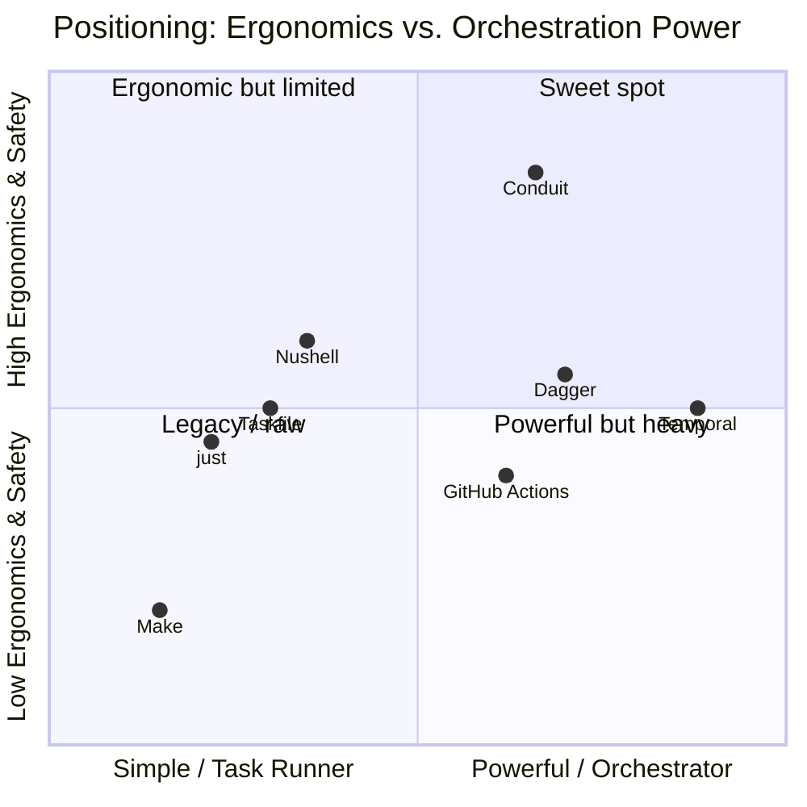

# Conduit — Product Vision

> Document ID: `01-product-vision`
> Status: Draft (v0.1.0)
> Owner: Principal Product Architect
> Last updated: 2026-07-02

Related documents:
- [Executive Summary](00-executive-summary.md)
- [Product Requirements (PRD)](02-prd.md)
- [Functional Requirements](03-functional-requirements.md)
- [Non-Functional Requirements](04-non-functional-requirements.md)
- [Security Requirements](05-security-requirements.md)
- [Platform Architecture](10-platform-architecture.md)

---

## 1. Vision Statement

> **Conduit is the connective tissue between humans, machines, and AI agents — one declarative platform to define, run, and observe automation, from a laptop to a fleet.**

Every organization runs on automation, but that automation is scattered across bespoke CLIs, CI YAML, shell scripts, and heavyweight orchestrators. Conduit unifies them behind a single, fast, signed binary (`conduit`, alias `cdt`) and a declarative language (**FlowDSL**, `*.flow`), so that what you define once runs identically for a human at a terminal, a pipeline in CI, and an LLM agent taking action.

Conduit is opinionated about the boundaries that matter — isolation, provenance, least privilege, observability — and unopinionated about the work you do inside them. It is the *conduit* through which automation flows safely.

---

## 2. North Star

**North-star metric:** *Weekly Active Flows* — the number of distinct `*.flow` definitions successfully executed at least once per week across all surfaces (CLI, CI, TUI, agent).

This metric captures the thesis directly: value accrues when real, versioned automation is authored *and* run repeatedly and everywhere. It resists vanity (a star is not a run) and rewards the behaviors we care about: authoring durable flows, running them locally and in CI, and exposing them to agents.

Supporting guardrail metrics: startup latency (must stay < 50ms), flow success rate (≥ 99.9% non-user-error), and time-to-first-flow (< 15 min). See [Non-Functional Requirements](04-non-functional-requirements.md) and the KPIs in the [PRD](02-prd.md).

---

## 3. Personas

Each persona is described by role, context, jobs-to-be-done (JTBD), pains, and how Conduit serves them. JTBD are written in the canonical form: *"When \<situation\>, I want to \<motivation\>, so I can \<expected outcome\>."*

### Persona 1 — Priya, the Platform Engineer

- **Role:** Senior Platform Engineer on an internal developer platform (IDP) team.
- **Context:** Owns "golden paths" for ~300 developers. Ships internal CLIs and paved-road workflows. Cares about consistency, governance, and low support burden.
- **JTBD:**
  - When a new service needs a scaffolding CLI, I want to compose it from shared building blocks, so I can ship consistent UX without reinventing config/auth/completion.
  - When a golden-path workflow changes, I want to version and distribute it centrally, so I can guarantee every team runs the approved process.
- **Pains:** Each team's tool drifts; no shared security posture; onboarding new tools is slow; hard to enforce standards.
- **How Conduit helps:** A single framework for CLIs and flows; centrally distributable `*.flow` modules; built-in config/secrets/observability/auth; a plugin model for shared capabilities. Priya is a *primary* persona.

### Persona 2 — Dan, the DevOps Engineer

- **Role:** DevOps/Release Engineer owning CI/CD.
- **Context:** Maintains hundreds of pipeline YAML files across GitHub Actions and one legacy Jenkins install. Constantly firefighting "green in CI, red locally."
- **JTBD:**
  - When I write release automation, I want it to run identically on my laptop and in CI, so I can debug in seconds instead of pushing commits to test.
  - When we switch or add a CI vendor, I want my automation to be portable, so I can avoid a rewrite.
- **Pains:** Vendor lock-in; untestable YAML; slow feedback loops; secret handling reimplemented per pipeline.
- **How Conduit helps:** Flows are locally runnable and testable; CI becomes a thin invoker of `conduit run`; secrets and observability are consistent; retries/timeouts/compensation are declarative. Dan is a *primary* persona.

### Persona 3 — Sam, the Site Reliability Engineer

- **Role:** SRE on an on-call rotation.
- **Context:** Owns operational runbooks: failovers, cache flushes, data backfills, incident mitigations. Much knowledge is tribal shell lore.
- **JTBD:**
  - When I'm paged at 3am, I want to run a vetted runbook with a dry-run first, so I can act quickly without fear of making it worse.
  - When a runbook step fails midway, I want automatic compensation/rollback, so I can leave the system in a known state.
- **Pains:** Copy-paste shell from wikis; no dry-run; no rollback; no audit of who ran what; risky manual steps.
- **How Conduit helps:** Versioned, reviewed flows; `--dry-run` and plan preview; compensation steps; full audit logging; safe secrets injection; TUI to watch execution. Sam is a *primary* persona.

### Persona 4 — Mira, the AI-Agent Builder

- **Role:** ML/Platform engineer building LLM agents for internal automation.
- **Context:** Wants agents to take real operational actions (open PRs, scale services, run reports) safely.
- **JTBD:**
  - When my agent needs to act on infrastructure, I want to expose a curated set of typed, permissioned tools, so I can let the LLM act without handing it a raw shell.
  - When an agent invokes a tool, I want typed inputs/outputs, sandboxing, and an audit trail, so I can trust and review its behavior.
- **Pains:** Shelling out is unsafe/unstructured; no standard tool schema; no per-tool permissions; no audit; prompt-injection risk.
- **How Conduit helps:** Every command/flow is discoverable and invocable via the AI-agent API with JSON schemas, per-tool permissions, CEL/plugin sandboxing, and audit. Mira is a *primary* persona.

### Persona 5 — Alex, the Application Developer

- **Role:** Backend developer shipping a product CLI.
- **Context:** Needs a batteries-included CLI framework and occasional local task automation.
- **JTBD:**
  - When I build a product CLI, I want completion, config, and plugins out of the box, so I can focus on my domain logic.
  - When I automate local dev tasks, I want something better than a Makefile with typed inputs and good errors.
- **Pains:** Reinventing CLI plumbing; brittle Makefiles; poor error messages.
- **How Conduit helps:** Cobra-based framework with typed flags, completion, config, and plugins; FlowDSL for local tasks. Alex is a *secondary* persona (adoption on-ramp).

### Persona 6 — Nadia, the Security & Compliance Lead

- **Role:** AppSec/Compliance lead for a regulated org.
- **Context:** Must attest to supply-chain integrity, least privilege, and auditability.
- **JTBD:**
  - When we adopt a new tool, I want provenance, SBOMs, and signatures, so I can satisfy SOC 2 / ISO 27001 controls.
  - When automation touches secrets, I want least-privilege injection and redacted logs, so I can prevent leakage.
- **Pains:** Unsigned binaries; opaque dependencies; secrets in logs; no audit.
- **How Conduit helps:** SLSA provenance, SBOMs, cosign signing, plugin trust, audit logging, secret redaction, compliance mapping. See [Security Requirements](05-security-requirements.md). Nadia is a *secondary/influencer* persona.

---

## 4. Value Propositions

| Segment | Core value proposition |
|---------|------------------------|
| Platform Engineers | "Ship consistent internal CLIs and paved-road workflows from one framework — governed, secure, observable by default." |
| DevOps Engineers | "Write automation once; run it identically on your laptop and in any CI — no vendor lock-in, testable, fast feedback." |
| SREs | "Turn tribal shell knowledge into versioned, dry-runnable, auto-rollback runbooks with full audit." |
| AI-Agent Builders | "Give your agents a safe, typed, permissioned, audited set of tools instead of a raw shell." |
| App Developers | "A batteries-included CLI framework and a better-than-Make task runner in one binary." |
| Security/Compliance | "Provenance, SBOMs, signatures, least-privilege secrets, and audit — built in, not bolted on." |

---

## 5. Competitive Landscape

Conduit deliberately overlaps several categories; the wedge is that it unifies them behind one binary with an agent-native, security-first stance.

| Tool | Category | Strengths | Gaps Conduit exploits |
|------|----------|-----------|-----------------------|
| **Cobra apps** (bespoke) | CLI framework | Ubiquitous, flexible | No shared workflow engine, config, secrets, agent API; each app reinvents plumbing. Conduit *is* built on Cobra but adds the platform. |
| **Make** | Task runner | Universal, simple | No typed inputs, weak DAG data-passing, cryptic syntax, no secrets/observability. |
| **just** | Task runner | Clean syntax, ergonomic | No real DAG/data-passing, no state/retries/observability, no plugins/agent API. |
| **Taskfile** | Task runner (YAML) | Declarative, cross-platform | YAML ceiling: limited typing, no compensation, no plugin sandbox, no agent API. |
| **Nushell** | Shell | Structured data pipelines | It's a shell, not an automation platform; no DAG engine, plugin trust model, or agent tool API. |
| **GitHub Actions** | CI/CD | Ecosystem, hosted runners | Not runnable locally, vendor-coupled, YAML-only, no first-class agent tool surface. |
| **Dagger** | CI/CD as code | Portable, containerized, SDKs | Requires a container runtime/engine; heavier mental model; not a CLI framework or agent API. |
| **Temporal** | Durable orchestration | Exactly-once, durable, scalable | Requires a server + SDK + workers; overkill for the 80% single-node case; not a CLI/DSL/agent surface. |

**Positioning statement:** *For platform, DevOps, SRE, and AI-agent teams who are drowning in bespoke CLIs and untestable CI YAML, Conduit is a single-binary automation platform that unifies a fast CLI framework, a declarative testable workflow engine, and a safe agent tool API — unlike task runners (too limited) and orchestrators (too heavy), it delivers the ergonomics of `just` with the power approaching Temporal, secure and observable by default, with no server to operate.*

---

## 6. Product Principles

1. **Single binary, no server for the common case.** Operational simplicity is a feature. A laptop and CI must run the same code with zero infrastructure.
2. **Declarative first, imperative when needed.** FlowDSL declares intent; escape hatches (shell, plugins) handle the messy 20%.
3. **Define once, expose many.** A command/flow is simultaneously a CLI command, a workflow step, a TUI action, and an agent tool.
4. **Safe by default.** Least privilege, sandboxing, signed artifacts, and audit are defaults, not opt-ins. See [Security Requirements](05-security-requirements.md).
5. **Fast is a feature.** Sub-50ms startup and tight latency budgets are non-negotiable; performance is enforced in CI. See [NFRs](04-non-functional-requirements.md).
6. **Observable everything.** Every run has stable identity and emits structured logs, metrics, and traces.
7. **Editor-grade tooling.** A language deserves an LSP and grammar; FlowDSL ships with `tree-sitter-flow` and an LSP from day one.
8. **Portable and consistent.** Behavior is identical across Windows/macOS/Linux and amd64/arm64.
9. **Agent-native, human-friendly.** The same contract serves humans and LLMs; neither is an afterthought.
10. **Backward compatibility is a promise.** SemVer 2.0.0 governs the CLI, FlowDSL, plugin protocol, and config schema.

---

## 7. Non-Goals

Conduit deliberately will **not**:

- **Become a general-purpose programming language.** FlowDSL is a scoped orchestration DSL. Business logic belongs in plugins or invoked programs. (RFC 2119: the DSL **MUST NOT** grow Turing-complete general computation as a design goal.)
- **Replace container build systems.** Conduit orchestrates; it does not aim to replace Docker/BuildKit/Dagger for image builds (it can invoke them).
- **Provide multi-tenant SaaS orchestration in this horizon.** Distributed, exactly-once, cluster-scale durable execution is out of scope for GA (design hooks only). See scope in [Executive Summary](00-executive-summary.md).
- **Be a secrets manager.** Conduit *integrates* with secret managers (Vault, cloud KMS, etc.) via providers; it does not store secrets at rest as a primary store.
- **Ship a proprietary editor.** Editor support is delivered via open LSP + tree-sitter, not a bespoke IDE.
- **Lock users in.** Open-source core, open plugin protocol, open grammar; portability is a principle, not a threat.

---

## 8. Vision Realized — A Day in the Life

> Sam (SRE) is paged. She opens a terminal and runs `cdt run runbooks/failover.flow --region eu-west-1 --dry-run`. Conduit prints the resolved DAG and the exact actions. Satisfied, she reruns without `--dry-run`; the Bubble Tea TUI shows each step, live logs, and a green checkmark trail. A step fails; Conduit runs its declared compensation, leaving the system consistent, and writes an audit record.
>
> Meanwhile, Mira's incident-triage agent, given the *same* `failover.flow` as a permissioned tool via the agent API, gathers diagnostics in parallel — sandboxed, typed, audited. Priya authored the flow as a governed golden path; Dan wired it into CI so the runbook is smoke-tested on every change; Nadia signed off because every release ships with provenance, an SBOM, and a signature.

One flow. Five personas. One conduit.
