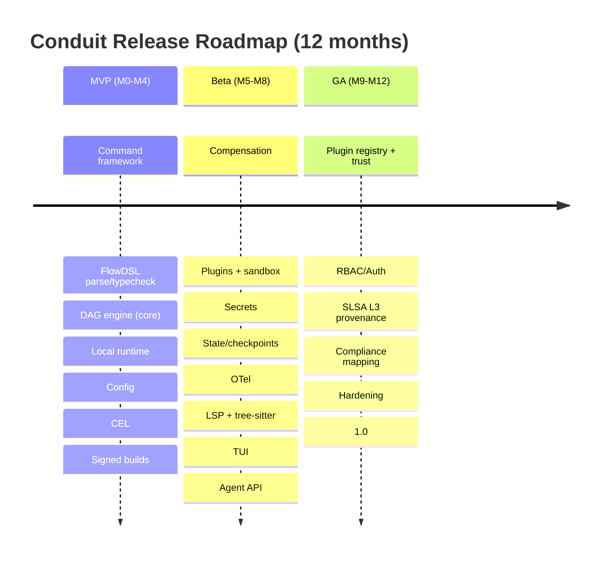

# Conduit — Product Requirements Document (PRD)

> Document ID: `02-prd`
> Status: Draft (v0.1.0)
> Owner: Technical Program Manager
> Last updated: 2026-07-02

Related documents:
- [Executive Summary](00-executive-summary.md)
- [Product Vision](01-product-vision.md)
- [Functional Requirements](03-functional-requirements.md)
- [Non-Functional Requirements](04-non-functional-requirements.md)
- [Security Requirements](05-security-requirements.md)
- [Platform Architecture](10-platform-architecture.md)

---

## 1. Purpose & Context

This PRD defines *what* Conduit must deliver and *why*, translating the [Product Vision](01-product-vision.md) into goals, OKRs, epics, user stories, prioritized features, acceptance criteria, and release phases. Detailed *how* lives in the [Functional](03-functional-requirements.md), [Non-Functional](04-non-functional-requirements.md), and [Security](05-security-requirements.md) requirement documents.

Canonical facts: binary `conduit` (alias `cdt`); Go module `github.com/conduit-io/conduit`; Go 1.24+; DSL **FlowDSL** (`*.flow`); config `conduit.yaml` (Koanf); CLI Cobra; expressions CEL-Go; plugins HashiCorp go-plugin (gRPC); TUI Bubble Tea; LSP + `tree-sitter-flow`; SemVer 2.0.0; RFC 2119 keywords.

---

## 2. Goals & Objectives

### 2.1 Business goals
- **G1.** Establish Conduit as the default automation substrate for platform/DevOps/SRE/agent teams.
- **G2.** Drive open-source adoption as the wedge for future commercial governance offerings.
- **G3.** Reduce customers' automation maintenance cost and CI feedback latency measurably.
- **G4.** Set a new bar for supply-chain trust in developer tooling.

### 2.2 Product objectives
- **O1.** Ship a fast (< 50ms start), portable, single-binary platform GA within 12 months.
- **O2.** Deliver FlowDSL 1.0 with editor-grade tooling (LSP + tree-sitter).
- **O3.** Ship a secure, sandboxed plugin platform with a signed registry.
- **O4.** Prove the agent-native thesis with pilot deployments.
- **O5.** Achieve 100% signed/provenanced releases with a documented compliance mapping.

---

## 3. OKRs (12-month)

**Objective A — Nail the core developer experience.**
- KR-A1: Time-to-first-flow < 15 minutes (onboarding study, n ≥ 20).
- KR-A2: p50 cold start < 50ms; completion p95 < 100ms (CI benchmark).
- KR-A3: ≥ 500 distinct `*.flow` files authored across pilots.

**Objective B — Deliver a trustworthy extensibility ecosystem.**
- KR-B1: ≥ 25 verified plugins in the registry.
- KR-B2: 100% of registry plugins signed and provenance-verified.
- KR-B3: Zero unsandboxed plugin execution paths (audited).

**Objective C — Prove the agent-native thesis.**
- KR-C1: ≥ 3 pilot deployments invoking flows via the agent API.
- KR-C2: ≥ 20% of runs in agent pilots originate from the agent API.
- KR-C3: 100% of agent invocations produce audit records with typed I/O.

**Objective D — Earn enterprise trust.**
- KR-D1: 100% of GA releases carry SLSA provenance + SBOM + cosign signature.
- KR-D2: Mean time to patch critical CVE < 72h.
- KR-D3: Published compliance mapping to SOC 2 / ISO 27001 / NIST 800-53.

---

## 4. Epics

| Epic ID | Epic | Outcome |
|---------|------|---------|
| E1 | Command Framework | Cobra-based CLI with typed flags/args, subcommands, hooks, completion. |
| E2 | FlowDSL Language | Parser, type checker, modules, `*.flow`. |
| E3 | DAG / Workflow Engine | Dependency resolution, parallelism, data passing, retries, compensation, dry-run. |
| E4 | Execution Runtime | Local execution, cancellation, resource limits, structured logging. |
| E5 | State & Checkpoints | Run state, checkpoints, pluggable backends. |
| E6 | Plugin Platform | go-plugin/gRPC, trust/signing, sandboxing, registry. |
| E7 | Config & Secrets | Koanf `conduit.yaml`, layered config, secret providers, redaction. |
| E8 | Expressions (CEL) | CEL-Go integration with sandbox limits. |
| E9 | Observability | Structured logs, metrics, OpenTelemetry traces. |
| E10 | Editor Tooling | LSP server + `tree-sitter-flow` grammar. |
| E11 | TUI | Bubble Tea run/inspect experience. |
| E12 | AI-Agent API | Tool discovery + typed, sandboxed, audited invocation. |
| E13 | AuthN/AuthZ | Identity, RBAC, per-command/tool permissions. |
| E14 | Supply-Chain & Release | SLSA, SBOM, cosign, reproducible builds, distribution. |
| E15 | Completion & Shell Integration | bash/zsh/fish/PowerShell completion. |

---

## 5. User Stories (by epic)

Format: *As a \<persona\>, I want \<capability\>, so that \<benefit\>.* Acceptance criteria (AC) are in §9; personas are in [Product Vision](01-product-vision.md).

### E1 Command Framework
- US-1.1 As Alex, I want to declare typed flags/args, so that invalid input is rejected with clear errors.
- US-1.2 As Priya, I want to compose subcommands from shared modules, so that internal CLIs are consistent.
- US-1.3 As Alex, I want pre/post hooks, so that I can enforce cross-cutting behavior (auth, telemetry).

### E2 FlowDSL
- US-2.1 As Dan, I want to define a workflow in a `*.flow` file, so that automation is declarative and reviewable.
- US-2.2 As Priya, I want to import shared flow modules, so that I can distribute golden paths.
- US-2.3 As Mira, I want typed inputs on flows, so that agents can call them with validated arguments.

### E3 DAG / Workflow Engine
- US-3.1 As Dan, I want steps to run in dependency order with parallelism, so that pipelines are fast and correct.
- US-3.2 As Sam, I want retries/timeouts per step, so that transient failures self-heal.
- US-3.3 As Sam, I want compensation/rollback steps, so that failures leave a consistent state.
- US-3.4 As Sam, I want `--dry-run`, so that I can preview actions before executing.

### E4 Execution Runtime
- US-4.1 As Dan, I want to cancel a running flow cleanly, so that I can abort safely.
- US-4.2 As Priya, I want resource limits per step, so that runaway steps can't exhaust the host.

### E5 State & Checkpoints
- US-5.1 As Dan, I want to resume a failed flow from the last checkpoint, so that I don't repeat expensive steps.
- US-5.2 As Priya, I want a pluggable state backend, so that state can live in a shared store.

### E6 Plugin Platform
- US-6.1 As Priya, I want to add capabilities via signed plugins, so that I can extend Conduit safely.
- US-6.2 As Nadia, I want plugins sandboxed and verified, so that third-party code can't compromise the host.

### E7 Config & Secrets
- US-7.1 As Dan, I want layered `conduit.yaml` config with env overrides, so that environments differ without code changes.
- US-7.2 As Nadia, I want secrets injected least-privilege and redacted in logs, so that they never leak.

### E8 Expressions
- US-8.1 As Dan, I want CEL expressions in flows for conditionals/templating, so that flows are dynamic yet safe.

### E9 Observability
- US-9.1 As Sam, I want structured logs and OTel traces per run/step, so that I can debug and audit.

### E10 Editor Tooling
- US-10.1 As Alex, I want completion/diagnostics/hover for `*.flow` in my editor, so that authoring is fast and correct.

### E11 TUI
- US-11.1 As Sam, I want a TUI to watch a run live, so that I can observe progress during an incident.

### E12 AI-Agent API
- US-12.1 As Mira, I want to discover flows/commands as typed tools, so that my agent knows what it can do.
- US-12.2 As Mira, I want per-tool permissions and audit, so that agent actions are safe and reviewable.

### E13 AuthN/AuthZ
- US-13.1 As Priya, I want RBAC on commands/flows, so that only authorized users/agents run sensitive actions.

### E14 Supply-Chain
- US-14.1 As Nadia, I want signed releases with SBOM and provenance, so that I can attest supply-chain integrity.

### E15 Completion
- US-15.1 As Alex, I want shell completion on all supported shells, so that the CLI feels native.

---

## 6. Use Cases

- **UC-1 Internal CLI scaffolding.** Priya composes a service CLI from shared command modules and distributes it.
- **UC-2 Portable release pipeline.** Dan authors `release.flow`, runs it locally, then invokes it from CI unchanged.
- **UC-3 Incident runbook.** Sam runs `failover.flow --dry-run`, then executes with live TUI and compensation on failure.
- **UC-4 Data backfill with checkpoints.** Dan resumes a long backfill from the last checkpoint after a transient failure.
- **UC-5 Agent-driven triage.** Mira's agent invokes diagnostic flows as typed, sandboxed, audited tools.
- **UC-6 Compliance attestation.** Nadia verifies a release's signature, SBOM, and provenance before rollout.

---

## 7. MoSCoW Feature Matrix

| Feature | Epic | Priority | Phase |
|---------|------|----------|-------|
| Typed flags/args, subcommands, hooks | E1 | Must | MVP |
| Shell completion (bash/zsh/fish/PowerShell) | E15 | Must | MVP |
| FlowDSL parse + type check + `*.flow` | E2 | Must | MVP |
| DAG resolution + parallelism + data passing | E3 | Must | MVP |
| Retries, timeouts | E3 | Must | MVP |
| `--dry-run` / plan preview | E3 | Must | MVP |
| Local execution runtime + cancellation | E4 | Must | MVP |
| Structured logging | E9 | Must | MVP |
| `conduit.yaml` via Koanf, layered config | E7 | Must | MVP |
| CEL expressions with sandbox limits | E8 | Must | MVP |
| Reproducible builds + cosign signing + SBOM | E14 | Must | MVP |
| Compensation / rollback steps | E3 | Should | Beta |
| Plugin platform (go-plugin/gRPC) + sandbox | E6 | Should | Beta |
| Secrets providers + redaction | E7 | Should | Beta |
| State backends + checkpoints/resume | E5 | Should | Beta |
| OpenTelemetry traces + metrics | E9 | Should | Beta |
| LSP server + `tree-sitter-flow` | E10 | Should | Beta |
| TUI (Bubble Tea) | E11 | Should | Beta |
| AI-Agent API (discovery + invocation) | E12 | Should | Beta |
| Signed plugin registry + trust model | E6 | Should | GA |
| RBAC / AuthN / AuthZ | E13 | Should | GA |
| SLSA provenance (build L3) | E14 | Must | GA |
| Compliance mapping (SOC2/ISO/NIST) | E14 | Could | GA |
| Distributed/durable multi-node execution | E4 | Won't (this horizon) | — |
| Non-Go first-party plugin SDKs | E6 | Won't (this horizon) | — |
| Managed multi-tenant SaaS control plane | — | Won't (this horizon) | — |

---

## 8. Personas × Scenarios Matrix

| Scenario \ Persona | Priya (Platform) | Dan (DevOps) | Sam (SRE) | Mira (Agent) | Nadia (Sec) |
|--------------------|:----------------:|:------------:|:---------:|:------------:|:-----------:|
| Author internal CLI | ✅ Primary | ○ | ○ | — | — |
| Portable CI pipeline | ○ | ✅ Primary | ○ | — | ○ |
| Incident runbook | ○ | ○ | ✅ Primary | ○ | ○ |
| Agent tool invocation | ○ | — | ○ | ✅ Primary | ○ |
| Supply-chain attestation | ○ | ○ | — | — | ✅ Primary |
| Secrets handling | ○ | ✅ | ✅ | ✅ | ✅ Primary |

Legend: ✅ Primary owner, ○ Beneficiary, — Not applicable.

---

## 9. Acceptance Criteria (representative)

Written in Given/When/Then. Full requirement-level ACs are in [Functional Requirements](03-functional-requirements.md).

- **AC-1.1 (US-1.1):** Given a command with a required typed int flag, when a non-integer is passed, then Conduit exits non-zero with a message naming the flag and expected type, and does not execute the command body.
- **AC-3.1 (US-3.1):** Given a flow with steps B and C depending on A, when run, then A completes before B and C start, and B and C may run concurrently; output artifacts of A are available to B and C.
- **AC-3.4 (US-3.4):** Given any flow, when run with `--dry-run`, then no side-effecting step executes, and Conduit prints the resolved DAG and the actions that *would* run.
- **AC-3.3 (US-3.3):** Given a step with a declared compensation and a downstream failure, when the failure occurs, then compensation steps for already-completed steps run in reverse dependency order, and the run is marked `compensated`.
- **AC-6.2 (US-6.2):** Given an unsigned or untrusted plugin, when loaded under default trust policy, then Conduit refuses to execute it and emits an audit event.
- **AC-7.2 (US-7.2):** Given a secret referenced by a step, when the step runs, then the secret value never appears in logs, traces, dry-run output, or error messages (verified by redaction tests).
- **AC-12.1 (US-12.1):** Given the agent API, when queried for tools, then each flow/command is returned with a JSON schema for inputs/outputs and its permission scope.
- **AC-14.1 (US-14.1):** Given a GA release artifact, when verified, then a valid cosign signature, SBOM, and SLSA provenance are present and validate against the published trust root.

---

## 10. Release Phases

### 10.1 MVP (Months 0–4) — "It runs, everywhere, fast."
Exit criteria: `conduit run` executes a `*.flow` DAG locally on all OS/arch targets; startup < 50ms; typed CLI + completion; `conduit.yaml` config; CEL with sandbox; signed builds + SBOM. FlowDSL syntax frozen for MVP subset.

### 10.2 Beta (Months 5–8) — "It's safe, extensible, observable, agent-ready."
Exit criteria: plugins load sandboxed over gRPC; secrets injected + redacted; checkpoints/resume; OTel traces; LSP + tree-sitter shipped; TUI usable; agent API exposes typed tools with audit; compensation works.

### 10.3 GA (Months 9–12) — "It's trustworthy and governed."
Exit criteria: signed plugin registry live with ≥ 25 verified plugins; RBAC enforced; SLSA build L3 provenance on all releases; compliance mapping published; all NFR budgets met; FlowDSL 1.0 with SemVer compatibility promise; docs complete.

---

## 11. Assumptions

- **A1.** Target adopters can distribute a single binary (no server) in their environments.
- **A2.** Go 1.24+ toolchain features (build info, PGO, etc.) are available in CI.
- **A3.** The 80% of orchestration needs are single-node; durable/distributed is a later phase.
- **A4.** Teams will accept a new DSL if tooling (LSP/grammar) and escape hatches are excellent.
- **A5.** sigstore/cosign, SLSA tooling, and OTel remain stable, adoptable dependencies.

---

## 12. Dependencies

| Dependency | Used for | Risk if unavailable |
|------------|----------|---------------------|
| Cobra | CLI framework | Core; would require re-platform |
| Koanf | Config | Medium; alternatives exist |
| CEL-Go | Expressions | Core; sandbox model depends on it |
| HashiCorp go-plugin | Plugin transport (gRPC) | Core to extensibility |
| Bubble Tea | TUI | Beta feature; degradable |
| tree-sitter + `tree-sitter-flow` | Editor grammar | Editor UX; degradable |
| sigstore/cosign | Signing | Security KR; mandatory for GA |
| SLSA tooling | Provenance | Security KR; mandatory for GA |
| OpenTelemetry | Traces/metrics | Observability; degradable to logs |

---

## 13. Out of Scope (this horizon)

- Distributed/durable multi-node execution with exactly-once semantics.
- Managed multi-tenant SaaS control plane.
- Non-Go first-party plugin SDKs (gRPC protocol remains language-agnostic).
- FlowDSL as a general-purpose language.
- Conduit as a primary secrets store (integration only).

See [Product Vision §7 Non-Goals](01-product-vision.md).

---

## 14. Open Questions

| ID | Question | Owner | Needed by |
|----|----------|-------|-----------|
| Q1 | Default plugin trust policy: deny-by-default vs. warn-on-unsigned? | Security | Beta |
| Q2 | State backend for GA: embedded (BoltDB-class) vs. pluggable-only? | Runtime | Beta |
| Q3 | Agent API transport: gRPC-only, or also HTTP/JSON + MCP-style shim? | Agent | Beta |
| Q4 | FlowDSL: how much CEL vs. native DSL constructs for control flow? | DSL | MVP |
| Q5 | Licensing of core (Apache-2.0 assumed) and registry terms. | Product/Legal | Beta |
| Q6 | Windows sandboxing parity for plugins (job objects vs. limited)? | Security | Beta |

---

## 15. KPIs

| KPI | Definition | Target |
|-----|------------|--------|
| Weekly Active Flows | Distinct `*.flow` run ≥ once/week (north star) | Growth curve |
| Time-to-first-flow | New user → first successful run | < 15 min |
| Cold-start p50 | `conduit --version` latency | < 50ms |
| Completion p95 | Completion request latency | < 100ms |
| Flow success rate | Non-user-error successful runs | ≥ 99.9% |
| Crash-free sessions | Sessions with no panic | ≥ 99.95% |
| Verified plugins | Count in registry | ≥ 25 |
| Signed releases | % with sig+SBOM+provenance | 100% |
| Agent-originated runs (pilots) | Share via agent API | ≥ 20% |
| MTTR (critical CVE) | Time to patched release | < 72h |

Cross-references: performance budgets in [NFRs](04-non-functional-requirements.md); security KPIs in [Security Requirements](05-security-requirements.md).
