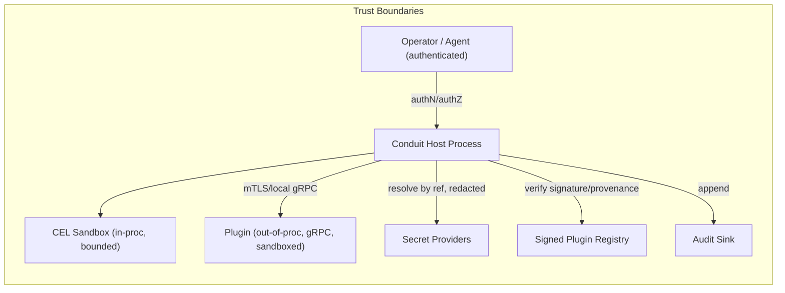

# Conduit — Security Requirements

> Document ID: `05-security-requirements`
> Status: Draft (v0.1.0)
> Owner: Principal Product Architect / Security Lead
> Last updated: 2026-07-02

Related documents:
- [Executive Summary](00-executive-summary.md)
- [Product Vision](01-product-vision.md)
- [Product Requirements (PRD)](02-prd.md)
- [Functional Requirements](03-functional-requirements.md)
- [Non-Functional Requirements](04-non-functional-requirements.md)
- [Platform Architecture](10-platform-architecture.md)

---

## 1. Conventions & Threat Model Summary

- Requirement IDs are `SEC-###`, stable and unique. RFC 2119 keywords are normative.
- Priority: `M` (MVP), `S` (Beta), `C` (GA+).
- Each requirement lists **Statement**, **Rationale**, **Acceptance Criteria (AC)**, and **Priority**.

### 1.1 Assets to protect
- Integrity of the `conduit` binary and its supply chain.
- Secrets consumed by flows/steps/plugins.
- The host environment executing flows (filesystem, network, processes).
- Operator/agent identity and authorization decisions.
- Audit records and their integrity.
- The FlowDSL/CEL evaluation boundary.

### 1.2 Primary threat actors & vectors
- **Malicious/compromised plugin** executing on the host.
- **Malicious `*.flow`/CEL input** attempting resource exhaustion, injection, or sandbox escape.
- **Supply-chain attacker** tampering with the binary, dependencies, or the plugin registry.
- **Prompt-injected AI agent** attempting out-of-scope actions via the agent API.
- **Insider / over-broad access** running privileged flows without authorization.
- **Network attacker** intercepting agent/registry/remote-state transport.

Supply-chain and sandbox requirements below map to SOC 2, ISO/IEC 27001:2022, and NIST SP 800-53 Rev.5 controls; see the mapping in §11.

---

## 2. Supply-Chain Security

### SEC-001 — Reproducible builds
- **Statement:** Release binaries **MUST** be byte-for-byte reproducible from tagged source with the pinned toolchain.
- **Rationale:** Detect tampering; enable independent verification.
- **AC:** Two independent CI builds of the same tag produce identical artifacts (also NFR-039).
- **Priority:** M

### SEC-002 — Software Bill of Materials (SBOM)
- **Statement:** Every release **MUST** publish an SBOM (SPDX or CycloneDX) enumerating all dependencies and versions.
- **Rationale:** Vulnerability management and compliance.
- **AC:** A machine-readable SBOM accompanies each release and validates against its schema.
- **Priority:** M

### SEC-003 — Artifact signing (cosign)
- **Statement:** All release artifacts (binaries, SBOMs, provenance, container images) **MUST** be signed with sigstore/cosign.
- **Rationale:** Authenticity and integrity.
- **AC:** `cosign verify` succeeds against the published identity/trust root for every artifact.
- **Priority:** M

### SEC-004 — SLSA provenance
- **Statement:** Releases **MUST** publish SLSA provenance attestations; GA **MUST** reach SLSA Build Level 3.
- **Rationale:** Verifiable build integrity and non-falsifiability.
- **AC:** Provenance attestation is present, signed, and verifiable; GA meets L3 criteria (hardened, isolated builder).
- **Priority:** M

### SEC-005 — Dependency pinning & verification
- **Statement:** Dependencies **MUST** be pinned with checksums (`go.sum`) and verified at build; unverified modules **MUST** fail the build.
- **Rationale:** Prevent dependency substitution.
- **AC:** Tampering with a dependency checksum fails the build.
- **Priority:** M

### SEC-006 — Continuous vulnerability scanning
- **Statement:** CI **MUST** run dependency and code vulnerability scanning (e.g., govulncheck, SCA); high/critical findings **MUST** block release.
- **Rationale:** Ship known-good.
- **AC:** A seeded vulnerable dependency blocks the release pipeline.
- **Priority:** M

### SEC-007 — CVE response SLA
- **Statement:** Critical vulnerabilities **MUST** be patched and released within 72h of a fix being available.
- **Rationale:** Bound exposure (KR-D2 in [PRD](02-prd.md)).
- **AC:** Security process documents and meets the SLA; tracked per incident.
- **Priority:** M

### SEC-008 — Verified release distribution
- **Statement:** Distribution channels (checksums file, install script, package managers) **MUST** enable end users to verify signatures/provenance before use.
- **Rationale:** Trust at the point of install.
- **AC:** Documented verification steps succeed for each channel.
- **Priority:** S

### SEC-009 — Hardened build pipeline
- **Statement:** The build/release pipeline **MUST** run with least privilege, ephemeral isolated runners, and no long-lived signing keys (keyless/OIDC signing).
- **Rationale:** Protect the builder (SLSA L3).
- **AC:** Pipeline uses ephemeral OIDC-based signing; no static signing secret exists.
- **Priority:** M

---

## 3. Plugin Sandboxing & Trust

### SEC-010 — Out-of-process isolation
- **Statement:** Plugins **MUST** execute out-of-process via go-plugin/gRPC; they **MUST NOT** share the host's memory space.
- **Rationale:** Contain faults and exploits (FR-058).
- **AC:** A plugin crash/exploit cannot corrupt host memory; host survives plugin crash.
- **Priority:** S

### SEC-011 — Plugin signature/provenance verification
- **Statement:** The host **MUST** verify a plugin's signature and provenance against the trust policy before loading; default policy **MUST** deny unsigned/untrusted plugins.
- **Rationale:** Prevent malicious plugins (FR-062).
- **AC:** An unsigned plugin is refused under default policy and audited.
- **Priority:** S

### SEC-012 — Least-privilege plugin sandbox
- **Statement:** Plugins **MUST** run with a restricted capability grant (filesystem paths, network egress, env vars) enforced by the host where the OS supports it (e.g., Linux namespaces/seccomp, Windows job objects/AppContainer).
- **Rationale:** Limit blast radius (FR-063).
- **AC:** A plugin cannot access resources outside its explicit grant; violations are denied and logged.
- **Priority:** S

### SEC-013 — Plugin resource limits
- **Statement:** Plugin invocations **MUST** enforce CPU/memory/time limits and terminate on breach.
- **Rationale:** Prevent DoS/hangs (FR-066).
- **AC:** A plugin exceeding limits is terminated; the step fails with a resource reason.
- **Priority:** S

### SEC-014 — Plugin trust policy configuration
- **Statement:** Operators **MUST** be able to configure trust (allowed publishers, key identities, allow/deny lists) via `conduit.yaml`.
- **Rationale:** Enterprise governance.
- **AC:** Only plugins matching the configured trust policy load.
- **Priority:** S

### SEC-015 — Registry integrity
- **Statement:** The plugin registry **MUST** serve signed metadata and artifacts; the client **MUST** verify integrity before install.
- **Rationale:** Prevent supply-chain injection via registry (FR-064).
- **AC:** Tampered registry content fails client-side verification.
- **Priority:** S

### SEC-016 — Plugin audit logging
- **Statement:** Plugin load and each invocation **MUST** emit audit records (publisher identity, version, artifact hash, capability, outcome).
- **Rationale:** Forensics/compliance (FR-067).
- **AC:** Each plugin action produces a complete audit record.
- **Priority:** S

---

## 4. Secrets Handling

### SEC-017 — Reference-only secrets in source
- **Statement:** FlowDSL/config **MUST** reference secrets by name; storing plaintext secrets in `*.flow`/`conduit.yaml` **MUST** be linted/blocked.
- **Rationale:** Prevent secrets in VCS (FR-026).
- **AC:** A detected inline secret triggers a lint error (blocking in CI mode).
- **Priority:** S

### SEC-018 — Least-privilege injection
- **Statement:** Secrets **MUST** be injected only into referencing steps/plugins, scoped to that process, and never broadcast globally.
- **Rationale:** Minimize exposure (FR-087).
- **AC:** A non-referencing step's environment contains no secret value.
- **Priority:** S

### SEC-019 — Universal redaction
- **Statement:** Secret values **MUST** be redacted across logs, traces, dry-run output, errors, run summaries, TUI, and audit records.
- **Rationale:** Prevent leakage (FR-088).
- **AC:** Redaction test corpus confirms zero secret values in any output channel.
- **Priority:** M

### SEC-020 — No plaintext secrets at rest
- **Statement:** Secrets **MUST NOT** be written to state/checkpoints/caches in plaintext; only references/handles persist.
- **Rationale:** Data-at-rest protection (FR-089).
- **AC:** State inspection reveals no plaintext secret values.
- **Priority:** S

### SEC-021 — In-memory hygiene
- **Statement:** Secret material **SHOULD** be minimized in memory, not logged on panic, and cleared when feasible.
- **Rationale:** Reduce residual exposure.
- **AC:** Panic/crash dumps do not contain secret values in tested paths.
- **Priority:** S

### SEC-022 — Runtime resolution for rotation
- **Statement:** Secrets **MUST** be resolved at execution time so rotation takes effect without editing flows (FR-090).
- **Rationale:** Operational security.
- **AC:** Rotating a secret changes the resolved value on the next run.
- **Priority:** S

### SEC-023 — Secret access auditing
- **Statement:** Each secret resolution **MUST** be audited by reference (never value), including consumer and outcome.
- **Rationale:** Compliance/forensics (FR-091).
- **AC:** Every secret access yields an audit record without the secret value.
- **Priority:** S

---

## 5. Authentication & Authorization

### SEC-024 — Operator/agent authentication
- **Statement:** Sensitive operations and the agent API **MUST** authenticate the calling principal (OS identity, token, or OIDC).
- **Rationale:** Attribution and gating (FR-092).
- **AC:** Unauthenticated sensitive calls are rejected.
- **Priority:** S

### SEC-025 — Role-based access control
- **Statement:** The system **MUST** enforce RBAC on commands, flows, and agent tools; default posture is deny where a policy is configured.
- **Rationale:** Least privilege (FR-093).
- **AC:** A principal lacking permission is denied with the permission-denied code and audit event.
- **Priority:** S

### SEC-026 — Per-tool permission scopes (agent)
- **Statement:** Each agent-exposed tool **MUST** carry a permission scope enforced on every invocation (FR-094/112).
- **Rationale:** Contain prompt-injected/misbehaving agents.
- **AC:** An out-of-scope agent invocation is denied and audited.
- **Priority:** S

### SEC-027 — Token lifecycle
- **Statement:** Auth tokens **MUST** be treated as secrets, support expiry/refresh, and be rejected when expired/revoked (FR-095).
- **Rationale:** Limit credential misuse.
- **AC:** Expired/revoked tokens are rejected; tokens never appear in logs.
- **Priority:** S

### SEC-028 — Privilege separation & elevation control
- **Statement:** The system **MUST NOT** silently escalate privilege; steps requiring elevated rights **MUST** declare it and be gated by policy.
- **Rationale:** Prevent unexpected privilege use.
- **AC:** An unelevated principal cannot run an elevation-requiring step without explicit grant.
- **Priority:** S

### SEC-029 — Authorization decision auditing
- **Statement:** Every allow/deny decision **MUST** be audited (principal, resource, decision, policy version) (FR-097).
- **Rationale:** Compliance/forensics.
- **AC:** Each authz decision produces an audit record.
- **Priority:** S

---

## 6. Transport Security

### SEC-030 — Encrypted external transport
- **Statement:** All network transport (agent API, registry, remote state, telemetry export) **MUST** use TLS 1.2+ (prefer 1.3) with certificate validation.
- **Rationale:** Confidentiality/integrity in transit.
- **AC:** Plaintext or invalid-certificate connections are refused for external endpoints.
- **Priority:** S

### SEC-031 — Mutual authentication for sensitive channels
- **Statement:** The agent API and remote state **SHOULD** support mTLS or equivalent mutual authentication.
- **Rationale:** Prevent impersonation.
- **AC:** A client without a valid mutual credential is rejected where mTLS is enabled.
- **Priority:** C

### SEC-032 — Local plugin channel protection
- **Statement:** The host↔plugin gRPC channel **MUST** be protected against local interception (loopback + per-launch mutual auth token as provided by go-plugin).
- **Rationale:** Prevent local channel hijack.
- **AC:** A third process cannot connect to a plugin's channel without the handshake secret.
- **Priority:** S

### SEC-033 — Secure defaults for transport
- **Statement:** Insecure transport options **MUST** be off by default and require explicit, warned opt-in (e.g., for local dev only).
- **Rationale:** Secure-by-default principle.
- **AC:** Enabling insecure transport requires an explicit flag and emits a warning + audit event.
- **Priority:** S

---

## 7. Input Validation (FlowDSL & CEL) & Injection Defense

### SEC-034 — Strict DSL parsing & validation
- **Statement:** FlowDSL parsing **MUST** reject malformed input safely with bounded resource use; parser **MUST** be fuzz-tested.
- **Rationale:** Prevent parser-based DoS/exploits.
- **AC:** Fuzzing the parser yields no crashes/hangs; malformed input errors gracefully.
- **Priority:** M

### SEC-035 — Type-safe expression environment
- **Statement:** The CEL environment **MUST** be typed and closed; unknown identifiers/functions **MUST** fail at compile time (FR-106).
- **Rationale:** Prevent unexpected evaluation.
- **AC:** Unknown identifier/function references fail compilation.
- **Priority:** M

### SEC-036 — CEL sandbox resource limits
- **Statement:** CEL evaluation **MUST** enforce cost, time, memory, and recursion/comprehension limits; over-budget expressions **MUST** abort (FR-107).
- **Rationale:** Prevent expression-based DoS.
- **AC:** A pathological expression is rejected/aborted within the configured cost budget.
- **Priority:** M

### SEC-037 — No side-effecting expressions
- **Statement:** CEL functions **MUST** be pure; no exposed function may perform I/O, spawn processes, or access ambient state (FR-108).
- **Rationale:** Determinism and safety.
- **AC:** No exposed CEL function can read files/network/env directly.
- **Priority:** M

### SEC-038 — Shell/command injection prevention
- **Statement:** Untrusted values **MUST NOT** be interpolated into shell strings; step invocations **MUST** pass arguments as an argv array by default.
- **Rationale:** Prevent command injection (FR-044).
- **AC:** A value containing shell metacharacters is passed literally as an argument, not interpreted.
- **Priority:** M

### SEC-039 — Path traversal & resource reference validation
- **Statement:** File/resource references (imports, artifacts, config paths) **MUST** be validated and confined to permitted roots; `..` traversal outside allowed roots **MUST** be rejected.
- **Rationale:** Prevent unauthorized file access.
- **AC:** An import/path escaping the allowed root is rejected.
- **Priority:** S

### SEC-040 — Agent input validation
- **Statement:** Agent-API payloads **MUST** be schema-validated before execution; oversized/malformed payloads **MUST** be rejected with bounded resource use (FR-111).
- **Rationale:** Defend the agent boundary against injection/DoS.
- **AC:** A schema-invalid or oversized agent payload is rejected pre-execution.
- **Priority:** S

### SEC-041 — Template/interpolation safety
- **Statement:** Any templating/interpolation in flows **MUST** escape/encode context-appropriately and **MUST NOT** enable code execution.
- **Rationale:** Prevent template injection.
- **AC:** Injected template markers in data do not alter control flow or execute code.
- **Priority:** S

---

## 8. Audit Logging

### SEC-042 — Comprehensive audit coverage
- **Statement:** The system **MUST** audit: authN/authZ decisions, secret access (by ref), plugin load/invoke, agent invocations, config changes, and privileged operations.
- **Rationale:** Compliance and incident response (FR-102).
- **AC:** Each listed event type produces a structured audit record.
- **Priority:** S

### SEC-043 — Audit record integrity
- **Statement:** Audit records **SHOULD** support tamper-evidence (append-only, hash-chaining, or signed export) and **MUST** be separable from operational logs.
- **Rationale:** Trustworthy forensics.
- **AC:** Audit stream is isolable; integrity mechanism detects tampering in tests.
- **Priority:** S

### SEC-044 — Audit completeness & non-repudiation
- **Statement:** Audit records **MUST** include principal, timestamp (RFC 3339 UTC), resource, action, outcome, and correlation IDs (run/step).
- **Rationale:** Attribution and correlation.
- **AC:** Sampled audit records contain all required fields.
- **Priority:** S

### SEC-045 — Audit export & retention
- **Statement:** The system **MUST** support exporting audit logs to an external sink and configurable retention.
- **Rationale:** SIEM integration and policy compliance.
- **AC:** Audit export to a configured sink succeeds; retention is enforced.
- **Priority:** S

### SEC-046 — No sensitive data in audit
- **Statement:** Audit records **MUST NOT** contain secret values or full sensitive payloads (use references/hashes).
- **Rationale:** Avoid audit becoming a leak vector.
- **AC:** Audit records contain hashes/refs, never plaintext secrets.
- **Priority:** M

---

## 9. Least Privilege & Secure Defaults

### SEC-047 — Least-privilege runtime
- **Statement:** Conduit **MUST** run with the minimum privileges required; it **MUST NOT** require root/admin for normal operation.
- **Rationale:** Reduce blast radius.
- **AC:** Full fixture suite runs as an unprivileged user.
- **Priority:** M

### SEC-048 — Deny-by-default policies
- **Statement:** Where a security policy is configured (plugins, RBAC, sandbox grants, network egress), the default **MUST** be deny; access is explicitly granted.
- **Rationale:** Fail closed.
- **AC:** Absent an explicit grant, the guarded action is denied.
- **Priority:** S

### SEC-049 — Secure default configuration
- **Statement:** Out-of-the-box defaults **MUST** be the secure choice (signing verification on, insecure transport off, redaction on, sandbox on where supported).
- **Rationale:** Safe without expert configuration.
- **AC:** A fresh install has secure defaults verified by a config audit test.
- **Priority:** M

### SEC-050 — Explicit, warned opt-out
- **Statement:** Disabling a security control **MUST** require explicit action, emit a warning, and produce an audit event.
- **Rationale:** Prevent silent weakening.
- **AC:** Disabling signature verification warns and audits.
- **Priority:** S

### SEC-051 — Minimal network posture
- **Statement:** Conduit **MUST NOT** make unsolicited network calls (no phone-home) by default; telemetry/update checks **MUST** be opt-in and documented.
- **Rationale:** Privacy and air-gap friendliness.
- **AC:** A default run on a monitored host makes no unexpected egress.
- **Priority:** M

### SEC-052 — Safe temporary file handling
- **Statement:** Temporary files **MUST** be created with restrictive permissions in secure locations and cleaned up.
- **Rationale:** Prevent local info leaks/races.
- **AC:** Temp artifacts are created 0600-equivalent and removed after use.
- **Priority:** S

---

## 10. Vulnerability Management & Disclosure

### SEC-053 — Security disclosure policy
- **Statement:** The project **MUST** publish a coordinated vulnerability disclosure policy and a security contact (`SECURITY.md`).
- **Rationale:** Responsible disclosure.
- **AC:** A discoverable policy and contact exist.
- **Priority:** M

### SEC-054 — Signed security advisories
- **Statement:** Security advisories **MUST** be published (e.g., GHSA) with affected versions, severity (CVSS), and remediation.
- **Rationale:** Downstream awareness.
- **AC:** A resolved vulnerability yields a published advisory.
- **Priority:** S

### SEC-055 — Regular security testing
- **Statement:** The project **MUST** perform periodic threat modeling, dependency review, and (pre-GA) an independent security assessment/pen test.
- **Rationale:** Proactive assurance.
- **AC:** Assessment reports exist; findings are tracked to closure before GA.
- **Priority:** S

---

## 11. Compliance Mapping (Informative)

The following maps representative SEC requirements to common control frameworks. This is guidance to accelerate audits, not a certification.

| Conduit control (SEC) | SOC 2 (TSC) | ISO/IEC 27001:2022 Annex A | NIST SP 800-53 Rev.5 |
|-----------------------|-------------|----------------------------|----------------------|
| SEC-001–009 Supply chain (repro build, SBOM, signing, SLSA, dep pinning, scanning) | CC7.1, CC8.1 (change/ops), CC3.2 (risk) | A.8.25, A.8.28, A.8.30, A.8.8 | SA-11, SA-15, SR-3, SR-4, SR-11, RA-5 |
| SEC-010–016 Plugin sandbox & trust | CC6.1, CC6.6, CC7.2 | A.8.19, A.8.31, A.8.7 | AC-4, AC-6, SC-7, SI-3, CM-7 |
| SEC-017–023 Secrets handling | CC6.1, CC6.3 | A.8.24, A.5.15, A.8.10 | IA-5, SC-12, SC-28, AC-6 |
| SEC-024–029 AuthN/AuthZ | CC6.1, CC6.2, CC6.3 | A.5.15, A.5.16, A.5.18, A.8.2 | AC-2, AC-3, AC-6, IA-2, IA-8 |
| SEC-030–033 Transport security | CC6.7 | A.8.24, A.5.14 | SC-8, SC-13, SC-23 |
| SEC-034–041 Input validation / injection | CC7.1, CC8.1 | A.8.28, A.8.26 | SI-10, SI-15, SC-18, CM-7 |
| SEC-042–046 Audit logging | CC7.2, CC7.3 | A.8.15, A.8.16 | AU-2, AU-3, AU-6, AU-9, AU-12 |
| SEC-047–052 Least privilege / secure defaults | CC6.1, CC6.6 | A.8.2, A.8.9, A.8.4 | AC-6, CM-6, CM-7, SC-2 |
| SEC-053–055 Vuln mgmt / disclosure | CC7.4, CC7.5 | A.5.7, A.6.8, A.8.8 | RA-5, IR-4, IR-6, CA-8 |

---

## 12. Security Requirement ↔ Functional Requirement Traceability

| SEC | Related FR ([Functional Requirements](03-functional-requirements.md)) |
|-----|--------------------------------------------------------------|
| SEC-010, 011, 012, 013, 016 | FR-058, FR-062, FR-063, FR-066, FR-067 |
| SEC-015 | FR-064 |
| SEC-017–023 | FR-026, FR-086–091 |
| SEC-024–029 | FR-092–097, FR-112 |
| SEC-032 | FR-058 |
| SEC-034–037 | FR-015, FR-024, FR-106, FR-107, FR-108 |
| SEC-038 | FR-044 |
| SEC-040 | FR-111 |
| SEC-042–046 | FR-102, FR-114 |
| SEC-001, 002, 003, 004 | (release pipeline; see NFR-039) |

---

## 13. Security Non-Goals (this horizon)

- Conduit is **not** a primary secrets store (integration only) — see [Product Vision §7](01-product-vision.md).
- Conduit does **not** guarantee sandbox escape resistance beyond OS-provided isolation primitives; defense-in-depth is layered, not absolute.
- Formal certification (SOC 2 Type II report, ISO 27001 certificate) of any hosted service is out of scope for the initial GA; the mapping in §11 is provided to accelerate future certification of adopters and of hosted offerings.

---

## 14. Summary

Conduit's security posture is **secure-by-default and defense-in-depth**: a verifiable supply chain (reproducible builds, SBOM, cosign, SLSA L3), out-of-process sandboxed and signed plugins, least-privilege redacted secrets, authenticated and RBAC-gated operations, encrypted transports, a bounded CEL/DSL evaluation boundary, and comprehensive tamper-evident audit. Every control fails closed, opt-outs are explicit and audited, and the design maps cleanly onto SOC 2, ISO 27001, and NIST 800-53 for enterprise adopters.
