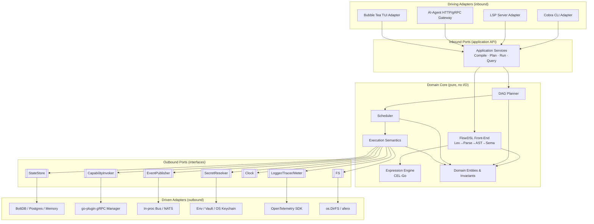
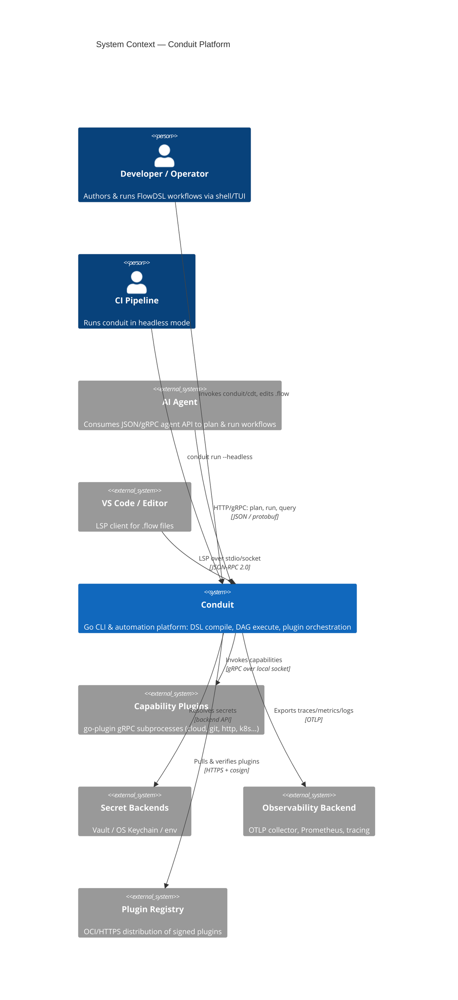
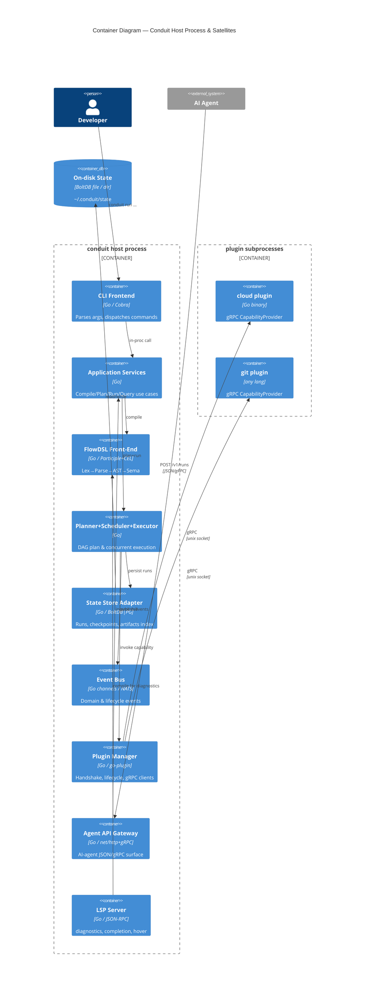
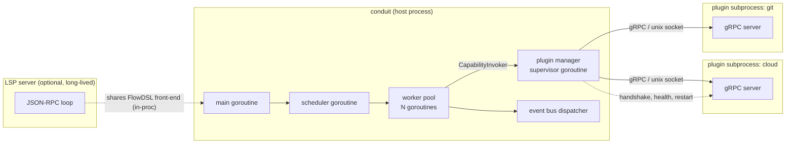
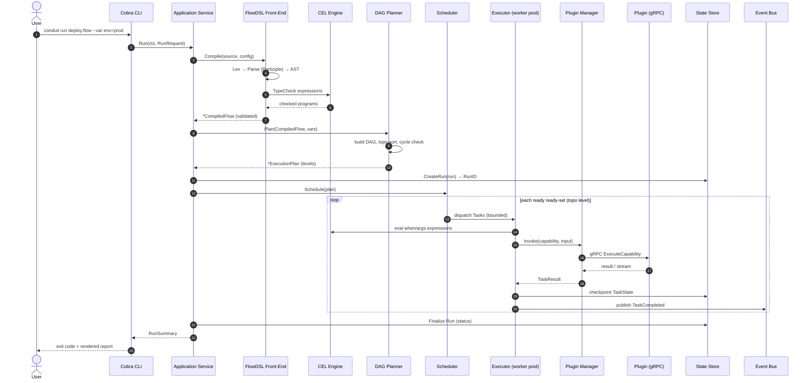
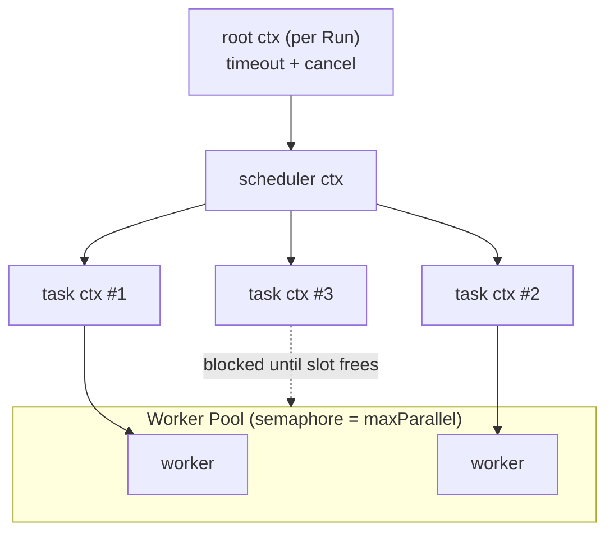
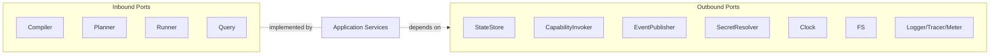
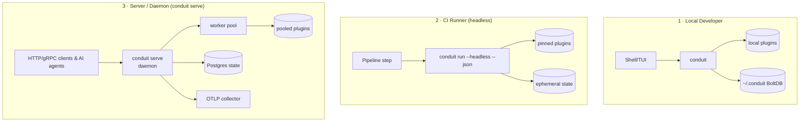

# 10 — Platform Architecture

> **Platform:** Conduit · **Binary:** `conduit` (alias `cdt`) · **Module:** `github.com/conduit-io/conduit`
> **Go:** 1.24+ · **Status:** Architecture Baseline v1.0 · **Owner:** Platform Architecture · **Date:** 2026-07-02

**Related documents:** [11 — Component Architecture](11-component-architecture.md) · [12 — Domain Model](12-domain-model.md) · [13 — Data Models](13-data-models.md) · [30 — Workflow DAG](30-workflow-dag.md) · [31 — Execution Runtime](31-execution-runtime.md) · [40 — Plugin Architecture](40-plugin-architecture.md) · [99 — ADRs](99-adrs.md)

---

## 1. Purpose & Scope

This document defines the **macro-architecture** of Conduit: its architectural style, the boundaries between the domain core and the outside world, the runtime process model, end-to-end data flow, the concurrency model, cross-cutting concerns, and supported deployment topologies. Component-level internals are specified in [11 — Component Architecture](11-component-architecture.md); the domain vocabulary in [12 — Domain Model](12-domain-model.md); concrete types and schemas in [13 — Data Models](13-data-models.md).

Conduit's guiding architectural principle: **the domain core (workflow planning, scheduling, execution semantics, expression evaluation) MUST NOT depend on any I/O, transport, or framework**. Everything that touches the outside world — Cobra, Koanf, gRPC, the filesystem, OpenTelemetry — is an **adapter** plugged into a **port**.

---

## 2. Architectural Style — Hexagonal + Layered

Conduit follows a **Ports & Adapters (Hexagonal)** architecture wrapped in a conventional **layered** dependency rule: *dependencies point inward*. The DSL front-end and the DAG/runtime core are pure; adapters are swappable.



### 2.1 Layer dependency rule

| Layer | May depend on | MUST NOT depend on |
|---|---|---|
| **Adapters** (driving/driven) | Application, Ports, external libs | Nothing forbidden — outermost ring |
| **Application** (use-case services) | Domain, Ports | Concrete adapters, Cobra, gRPC |
| **Domain** (entities, planner, scheduler, exec semantics) | Ports (interfaces only) | Application, adapters, I/O libs |
| **Ports** (interfaces) | Domain value objects only | Any concrete implementation |

Enforced in CI with an import-linter rule (`go-arch-lint` / `depguard`): `internal/domain/**` MUST NOT import `cobra`, `grpc`, `koanf`, `bbolt`, or `otel`.

---

## 3. C4 — Level 1: System Context



---

## 4. C4 — Level 2: Container Diagram

Containers here are **runtime deployable/loadable units**, not Go packages (those are in [11 — Component Architecture](11-component-architecture.md)).



---

## 5. Runtime Process Model

Conduit is a **single host process** that spawns and supervises **plugin subprocesses**, and can optionally embed a **long-lived LSP server** or **daemon**. There is exactly one authoritative runtime per invocation; plugins are isolated OS processes for fault + trust isolation.



**Process facts**

- **Host ↔ plugin transport:** gRPC over a Unix domain socket (Windows named pipe) negotiated by the HashiCorp go-plugin **handshake** (magic cookie + protocol version). No plugin ever listens on a TCP port by default.
- **Isolation:** each plugin is a separate OS process. A panicking or crashing plugin cannot corrupt host memory. The Plugin Manager supervises health and applies restart/backoff policy.
- **Lifecycle:** plugins are launched lazily on first capability use and torn down at host exit (or after an idle TTL in `serve` mode).
- **LSP:** `conduit lsp` runs the same in-process FlowDSL front-end used by `conduit run`, guaranteeing that editor diagnostics and runtime semantics never diverge.

---

## 6. End-to-End Data Flow: CLI → Parse → Plan → Execute



**Stage contracts**

1. **Compile** produces an immutable `*CompiledFlow` — no I/O, deterministic. Reusable by CLI, LSP, and the agent gateway.
2. **Plan** is pure graph math over the compiled flow: node/edge construction, cycle detection (fails fast on cycles), and topological levelization into ready-sets. See [30 — Workflow DAG](30-workflow-dag.md).
3. **Schedule/Execute** is the only stage with side effects. It is driven by the plan, bounded by a worker pool, and every state transition is checkpointed and emitted on the bus. See [31 — Execution Runtime](31-execution-runtime.md).

---

## 7. Concurrency Model

Conduit uses **structured concurrency** with a **bounded worker pool** and **`context.Context` propagation** for cancellation, deadlines, and value plumbing (RunID, TraceID, logger).



**Rules & primitives**

- **One root context per Run.** Cancellation (Ctrl-C, deadline, policy) propagates to every in-flight task and downward into plugin gRPC calls.
- **Worker pool = weighted semaphore** (`golang.org/x/sync/semaphore` or `errgroup.SetLimit`) sized by `maxParallel` (workflow-level, overridable per node). Ready-set tasks are dispatched only when a slot is free.
- **Fan-out/fan-in** across a topo level uses `errgroup.Group`; the first non-retryable error cancels the group per the workflow's `failurePolicy` (`fail-fast` vs `continue`).
- **No shared mutable domain state across goroutines.** Task results flow back through channels; the scheduler owns the DAG frontier. The State Store is the single writer boundary and is internally synchronized.
- **Plugin calls are cancelable:** the task context is passed to the gRPC client; cancellation aborts the RPC and signals the plugin.
- **Backpressure:** the event bus uses bounded channels; a slow subscriber applies backpressure rather than unbounded buffering (drop-oldest policy configurable for telemetry sinks).

Illustrative dispatch core:

```go
// internal/runtime/scheduler.go
func (s *Scheduler) Run(ctx context.Context, plan *domain.ExecutionPlan) error {
    g, ctx := errgroup.WithContext(ctx)
    g.SetLimit(s.maxParallel) // bounded worker pool

    for _, level := range plan.Levels { // topological ready-sets
        level := level
        for _, task := range level.Tasks {
            task := task
            if !s.dependenciesSatisfied(task) {
                continue
            }
            g.Go(func() error {
                tctx := s.taskContext(ctx, task) // injects RunID, span, logger, deadline
                return s.executeTask(tctx, task)  // failurePolicy decides cancel vs continue
            })
        }
        if err := g.Wait(); err != nil && s.failFast {
            return err // cancels ctx → aborts in-flight gRPC calls
        }
    }
    return nil
}
```

---

## 8. Cross-Cutting Concerns

Cross-cutting concerns are implemented as **outbound ports** and injected middleware, never scattered `if` statements in the domain.

| Concern | Port / Mechanism | Adapter | Detail doc |
|---|---|---|---|
| **Configuration** | `ConfigProvider` | Koanf (file + env + flag precedence) | [60 — Configuration](60-configuration.md) |
| **Logging** | `Logger` (structured) | `slog` → OTel bridge | [65 — Logging](65-logging.md) |
| **Tracing** | `Tracer` | OpenTelemetry SDK / OTLP | [64 — Observability](64-observability.md), [66 — Telemetry](66-telemetry.md) |
| **Metrics** | `Meter` | OTel metrics | [64 — Observability](64-observability.md) |
| **Events** | `EventPublisher` | in-proc bus / NATS | [67 — Event Model](67-event-model.md), [68 — Message Bus](68-message-bus.md) |
| **Secrets** | `SecretResolver` | Vault / keychain / env | [61 — Secrets](61-secrets-management.md) |
| **AuthN/AuthZ** | `Authenticator` / `Authorizer` | OIDC, RBAC policy | [62 — AuthN](62-authentication.md), [63 — AuthZ](63-authorization.md) |
| **Errors** | typed `ConduitError` + codes | wrap/annotate at boundaries | [70 — Error Handling](70-error-handling.md) |
| **Recovery** | checkpoint + resume | State Store | [71 — Recovery](71-recovery-strategy.md) |

Context propagation carries the cross-cutting handles:

```go
type execScope struct {
    RunID   domain.RunID
    Trace   trace.SpanContext
    Log     Logger
    Deadline time.Time
}
// stored via context.WithValue under an unexported key; retrieved by adapters at the boundary.
```

---

## 9. Ports & Adapters Catalog (Boundaries)

Inbound ports = the application's public use-case API. Outbound ports = interfaces the domain calls; adapters satisfy them. Concrete Go signatures are in [11 — Component Architecture](11-component-architecture.md) and [13 — Data Models](13-data-models.md).



| Port | Direction | Primary methods (see §13) | Default adapter |
|---|---|---|---|
| `Compiler` | in | `Compile(ctx, src) (*CompiledFlow, error)` | FlowDSL front-end |
| `Runner` | in | `Run(ctx, RunRequest) (RunSummary, error)` | Application service |
| `StateStore` | out | `CreateRun / SaveCheckpoint / LoadRun / ListRuns` | BoltDB |
| `CapabilityInvoker` | out | `Invoke(ctx, cap, input) (Output, error)` | go-plugin gRPC |
| `EventPublisher` | out | `Publish(ctx, Event)` | in-proc bus |
| `SecretResolver` | out | `Resolve(ctx, ref) (Secret, error)` | env/Vault |
| `Clock` | out | `Now() / After()` | wall clock (fake in tests) |

The `Clock` and `FS` ports exist specifically so the domain and runtime are **deterministically testable** without wall-clock or disk dependencies (see [72 — Testing Strategy](72-testing-strategy.md)).

---

## 10. Deployment Topologies

Conduit runs the same binary in three modes. Mode selection is by subcommand, not by build.



| Mode | Command | State backend | Concurrency | Interfaces | Typical use |
|---|---|---|---|---|---|
| **Local** | `conduit run` / `cdt` / TUI | BoltDB (`~/.conduit`) | single-run pool | Cobra, TUI, LSP | authoring, ad-hoc runs |
| **CI** | `conduit run --headless --json` | ephemeral/in-mem or artifact-exported | single-run pool | stdout JSON, exit codes | pipelines, gates |
| **Server** | `conduit serve` | Postgres (shared, multi-run) | multi-run scheduler, persistent plugin pool | HTTP+gRPC gateway, agent API, health | shared automation, AI-agent orchestration |

**`conduit serve` specifics**

- Long-lived daemon; plugins are kept warm in a pool with idle TTL instead of per-invocation spawn.
- Multi-run scheduler with fair-share across tenants; per-run root contexts and quotas.
- Exposes the AI-Agent API Gateway (`/v1/*` JSON + gRPC), health/readiness endpoints, and OTLP export.
- Horizontal scale: stateless daemons behind a load balancer sharing a Postgres state store; run leasing prevents double-execution.

---

## 11. Technology Decision Table

| Concern | Choice | Rationale | Alternatives considered | ADR |
|---|---|---|---|---|
| Language/runtime | **Go 1.24+** | Static binaries, first-class concurrency, strong stdlib, easy cross-compile for a CLI | Rust (steeper, slower iteration), Node (runtime dep) | ADR-0001 |
| CLI framework | **Cobra** | De-facto Go CLI standard, subcommands, completion generators, POSIX flags | urfave/cli, kong | ADR-0002 |
| Config | **Koanf** | Modular providers/parsers, clean precedence (defaults→file→env→flags), fewer globals than Viper | Viper (heavier, global state) | ADR-0003 |
| DSL parser | **Participle v2** | Struct-tag grammar → typed AST directly, good errors, pure Go | hand-written, ANTLR, goyacc | ADR-0004 |
| Expressions | **CEL-Go** | Sandboxed, non-Turing-complete, type-checked, fast, safe for untrusted expressions | Starlark, expr, Lua | ADR-0005 |
| Plugins | **HashiCorp go-plugin (gRPC)** | Process isolation, multi-language plugins, battle-tested handshake/versioning | Go `plugin` pkg (fragile, same-proc), WASM (immature FFI) | ADR-0006 |
| TUI | **Bubble Tea** (+ Lip Gloss/Bubbles) | Elm-architecture, testable, composable widgets | tview, termui | ADR-0007 |
| Editor support | **LSP + Tree-sitter** | Reuse compiler for diagnostics; Tree-sitter for incremental highlight | ad-hoc regex highlighting | ADR-0008 |
| State store | **BoltDB (local) / Postgres (server)** | Embedded zero-config local; durable shared server | SQLite, BadgerDB | ADR-0009 |
| Observability | **OpenTelemetry** | Vendor-neutral traces/metrics/logs, OTLP | vendor SDKs | ADR-0010 |
| Serialization (RPC) | **protobuf/gRPC** | Strong contract for plugin boundary, streaming | JSON-RPC (weaker typing) | ADR-0006 |

Full records: [99 — Architecture Decision Records](99-adrs.md).

---

## 12. Quality Attributes → Architecture Mapping

| Attribute (NFR) | Architectural mechanism |
|---|---|
| **Reliability** | Process-isolated plugins, checkpointing, resumable runs, supervised restarts |
| **Security** | Sandboxed CEL, signed plugins (cosign), least-privilege secret resolution, RBAC at the gateway |
| **Performance** | Bounded worker pool, topo-level parallelism, warm plugin pool in serve mode |
| **Testability** | Pure domain, `Clock`/`FS` ports, in-memory state adapter, compiler reused by tests |
| **Extensibility** | Capability plugins + inbound/outbound ports; no core recompile to add capabilities |
| **Portability** | Single static Go binary; same binary across local/CI/server |

See [04 — Non-Functional Requirements](04-non-functional-requirements.md) and [73 — Performance & Scalability](73-performance-scalability.md).

---

## 13. Cross-References

- Component internals & interfaces → [11 — Component Architecture](11-component-architecture.md)
- Domain vocabulary & entity lifecycles → [12 — Domain Model](12-domain-model.md)
- Struct/DTO/schema/protobuf definitions → [13 — Data Models](13-data-models.md)
- DAG construction & scheduling → [30 — Workflow DAG](30-workflow-dag.md) · [31 — Execution Runtime](31-execution-runtime.md)
- Plugin contract & lifecycle → [40 — Plugin Architecture](40-plugin-architecture.md)
- Security & threat model → [05 — Security Requirements](05-security-requirements.md) · [69 — Threat Model](69-threat-model.md)
