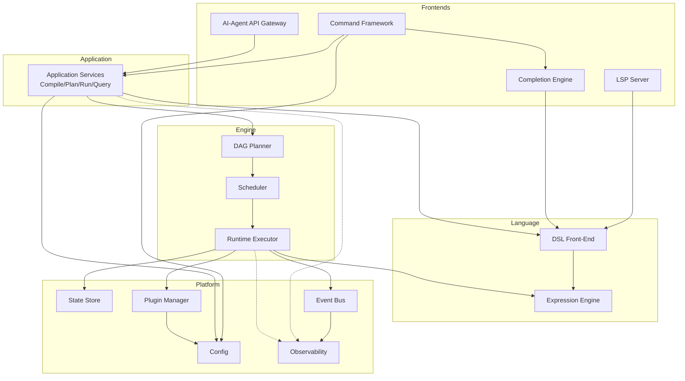
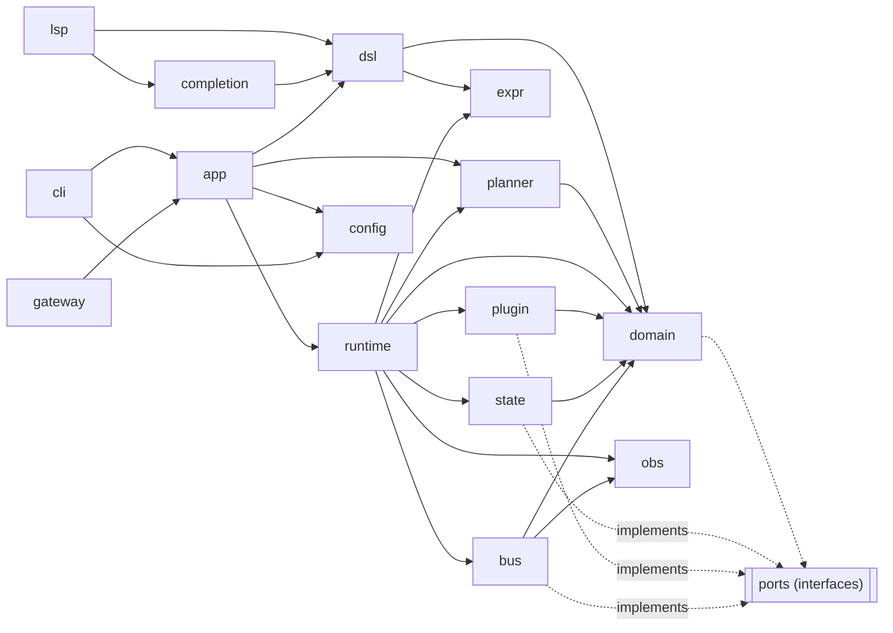

# 11 — Component Architecture

> **Platform:** Conduit · **Binary:** `conduit` (alias `cdt`) · **Module:** `github.com/conduit-io/conduit`
> **Go:** 1.24+ · **Status:** Architecture Baseline v1.0 · **Owner:** Platform Architecture · **Date:** 2026-07-02

**Related documents:** [10 — Platform Architecture](10-platform-architecture.md) · [12 — Domain Model](12-domain-model.md) · [13 — Data Models](13-data-models.md) · [40 — Plugin Architecture](40-plugin-architecture.md) · [56 — LSP Architecture](56-lsp-architecture.md) · [80 — Repository Structure](80-repository-structure.md)

---

## 1. Purpose

This document decomposes the Conduit host process into its **major software components**, specifying for each: its **responsibility**, the **key Go interfaces** it exposes and consumes, its **dependencies**, and its **extension points**. It concludes with a **component diagram**, a **dependency graph**, and a **package-to-component mapping**. The macro-architecture (ports/adapters, process model) is in [10 — Platform Architecture](10-platform-architecture.md).

Every component is a Go package (or package tree) under `internal/` or `pkg/`. Public, SDK-facing types live under `pkg/`; everything else is `internal/`.

---

## 2. Component Diagram



---

## 3. Components

Interface bodies below are **canonical signatures**; full struct/DTO definitions are in [13 — Data Models](13-data-models.md).

### 3.1 Command Framework

- **Responsibility:** Root command tree, flag/arg parsing, output rendering (human/JSON/TUI), exit-code mapping. Bridges Cobra to Application Services. Also hosts `conduit serve`, `conduit lsp`, `conduit plugin …`.
- **Depends on:** Application Services, Config, Completion Engine, Observability.
- **Key interfaces:**

```go
// internal/cli
type CommandFactory interface {
    Root(deps App) *cobra.Command
}

// Output rendering is an adapter behind an interface so JSON/TUI/plain are swappable.
type Renderer interface {
    RenderRunSummary(w io.Writer, s domain.RunSummary) error
    RenderError(w io.Writer, err error) int // returns process exit code
}
```

- **Extension points:** plugins/SDK register subcommands via `CommandProvider` ([42 — Command Metadata](42-command-metadata.md)); custom `Renderer` for new output formats.

### 3.2 Config

- **Responsibility:** Load and merge configuration with precedence `defaults → conduit.yaml → env (CONDUIT_*) → flags`. Typed access, validation, profiles.
- **Depends on:** Koanf, FS port.
- **Key interfaces:**

```go
// internal/config
type Provider interface {
    Load(ctx context.Context, sources ...Source) (*Config, error)
    Sub(prefix string) *koanf.Koanf
    Unmarshal(path string, out any) error
}
type Source interface{ Apply(k *koanf.Koanf) error } // file, env, flags, defaults
```

- **Extension points:** custom `Source` (e.g., remote config); plugin-contributed config schema fragments validated at load.

### 3.3 DSL Front-End

- **Responsibility:** Compile `.flow` source into an immutable, validated `*CompiledFlow`: **Lexer → Parser (Participle) → AST → Semantic Analysis**. Pure, deterministic, I/O-free. Shared by run, LSP, completion, and gateway.
- **Depends on:** Participle, Expression Engine (for expression type-checking), Domain.
- **Key interfaces:**

```go
// internal/dsl
type Compiler interface {
    Compile(ctx context.Context, src Source) (*CompiledFlow, Diagnostics, error)
    Parse(ctx context.Context, src Source) (*ast.Flow, Diagnostics, error) // no sema, for tooling
}

type Analyzer interface {
    Analyze(ctx context.Context, f *ast.Flow) (*CompiledFlow, Diagnostics)
}
```

- **Extension points:** pluggable `AnalysisPass` chain (sema rules); custom `Diagnostic` sinks. See [22 — Parser](22-parser-design.md), [24 — Semantic Analysis](24-semantic-analysis.md).

### 3.4 Expression Engine

- **Responsibility:** Compile and evaluate **CEL** expressions embedded in FlowDSL (`when:`, interpolations, guards). Type-check at compile time; evaluate against a runtime activation.
- **Depends on:** CEL-Go, Domain (variable/context types).
- **Key interfaces:**

```go
// internal/expr
type Engine interface {
    Compile(src string, env *Env) (Program, error) // type-checked
    NewEnv(decls ...Declaration) *Env
}
type Program interface {
    Eval(ctx context.Context, activation Activation) (Value, error)
}
```

- **Extension points:** custom CEL functions/overloads registered by plugins (`FunctionProvider`); custom variable declarations from context. See [25 — Expression Engine](25-expression-engine.md).

### 3.5 DAG Planner

- **Responsibility:** Transform a `*CompiledFlow` + input variables into an `*ExecutionPlan`: build nodes/edges, detect cycles, resolve dependencies, and topologically levelize into ready-sets. Pure.
- **Depends on:** Domain only.
- **Key interfaces:**

```go
// internal/planner
type Planner interface {
    Plan(ctx context.Context, f *domain.CompiledFlow, vars domain.Variables) (*domain.ExecutionPlan, error)
}
type GraphValidator interface {
    Validate(g *domain.DAG) error // cycle + orphan + unreachable checks
}
```

- **Extension points:** pluggable `PlanTransform` (e.g., inject retry/timeout defaults, apply policies). See [30 — Workflow DAG](30-workflow-dag.md).

### 3.6 Scheduler

- **Responsibility:** Drive the plan's ready-sets, enforce the bounded worker pool, honor `failurePolicy`, dependency gating, and cancellation. Owns the DAG frontier.
- **Depends on:** Runtime Executor, Domain, Clock port.
- **Key interfaces:**

```go
// internal/runtime
type Scheduler interface {
    Run(ctx context.Context, plan *domain.ExecutionPlan, exec TaskExecutor) (domain.RunResult, error)
}
type Dispatcher interface {
    Ready(g *domain.DAG) []domain.Task // frontier of dependency-satisfied tasks
}
```

- **Extension points:** `SchedulingPolicy` (fair-share, priority) — used by `conduit serve` multi-run mode.

### 3.7 Runtime Executor

- **Responsibility:** Execute a single Task: evaluate its `when`/args expressions, resolve secrets, invoke the capability via the Plugin Manager, apply retry/timeout, checkpoint state, and emit lifecycle events.
- **Depends on:** Plugin Manager (`CapabilityInvoker`), State Store, Event Bus, Expression Engine, Secret Resolver.
- **Key interfaces:**

```go
// internal/runtime
type TaskExecutor interface {
    Execute(ctx context.Context, t domain.Task, in domain.Activation) (domain.TaskResult, error)
}
type RetryPolicy interface {
    Next(attempt int, err error) (delay time.Duration, retry bool)
}
```

- **Extension points:** `TaskMiddleware` chain (logging, tracing, policy enforcement, dry-run). See [31 — Execution Runtime](31-execution-runtime.md).

### 3.8 State Store

- **Responsibility:** Durable persistence of Runs, Task/Step state, checkpoints, artifact index. Single-writer boundary; enables resume/recovery and history queries.
- **Depends on:** BoltDB (local) / Postgres (server), FS port.
- **Key interfaces:**

```go
// internal/state  (outbound port; adapters in internal/state/bolt, /pg, /mem)
type Store interface {
    CreateRun(ctx context.Context, r domain.Run) error
    SaveCheckpoint(ctx context.Context, cp domain.Checkpoint) error
    LoadRun(ctx context.Context, id domain.RunID) (domain.Run, error)
    ListRuns(ctx context.Context, q domain.RunQuery) ([]domain.RunSummary, error)
    UpdateTaskState(ctx context.Context, runID domain.RunID, ts domain.TaskState) error
}
```

- **Extension points:** new backends implement `Store`; migrations via versioned schema. See [32 — State Management](32-state-management.md).

### 3.9 Plugin Manager

- **Responsibility:** Discover, verify (signature), launch, handshake, health-check, and supervise plugin subprocesses; expose their capabilities behind `CapabilityInvoker`. Owns the go-plugin gRPC clients and the warm pool in serve mode.
- **Depends on:** HashiCorp go-plugin, gRPC, Config, Observability.
- **Key interfaces:**

```go
// internal/plugin
type Manager interface {
    Discover(ctx context.Context) ([]domain.PluginRef, error)
    Load(ctx context.Context, ref domain.PluginRef) (Handle, error)
    Invoke(ctx context.Context, cap domain.CapabilityID, in domain.CapabilityInput) (domain.CapabilityOutput, error)
    Shutdown(ctx context.Context) error
}
type Handle interface {
    Capabilities() []domain.Capability
    Health(ctx context.Context) error
    Kill()
}
```

- **Extension points:** *plugins themselves* are the primary extension mechanism; also `Verifier` (cosign/custom trust) and `Resolver` (registry/OCI). See [40 — Plugin Architecture](40-plugin-architecture.md), [41 — Extension SDK](41-extension-sdk.md).

### 3.10 Event Bus

- **Responsibility:** In-process (and optionally NATS) pub/sub for domain and lifecycle events (`RunStarted`, `TaskCompleted`, `RunFailed`…). Decouples emitters (Executor) from consumers (Observability, TUI, gateway streaming).
- **Depends on:** Domain events, Observability.
- **Key interfaces:**

```go
// internal/bus
type Publisher interface{ Publish(ctx context.Context, e domain.Event) error }
type Subscriber interface {
    Subscribe(topic domain.Topic, h Handler) (Unsubscribe, error)
}
type Handler func(ctx context.Context, e domain.Event) error
```

- **Extension points:** external transports (NATS adapter); durable/replayable subscriptions. See [67 — Event Model](67-event-model.md), [68 — Message Bus](68-message-bus.md).

### 3.11 Observability

- **Responsibility:** Structured logging (`slog`), tracing and metrics (OpenTelemetry), correlated by RunID/TraceID. Provided as ports so the domain stays clean.
- **Depends on:** OpenTelemetry SDK, `log/slog`.
- **Key interfaces:**

```go
// internal/obs
type Logger interface { With(kv ...any) Logger; Info(msg string, kv ...any); Error(err error, kv ...any) }
type Tracer interface { Start(ctx context.Context, name string) (context.Context, Span) }
type Meter  interface { Counter(name string) Counter; Histogram(name string) Histogram }
```

- **Extension points:** OTLP exporters, custom samplers, metric views. See [64 — Observability](64-observability.md), [65 — Logging](65-logging.md), [66 — Telemetry](66-telemetry.md).

### 3.12 LSP Server

- **Responsibility:** JSON-RPC 2.0 language server (`conduit lsp`): diagnostics, hover, go-to-def, completion, semantic tokens for `.flow`. Reuses the DSL Front-End so editor and runtime semantics match.
- **Depends on:** DSL Front-End, Completion Engine, Expression Engine.
- **Key interfaces:**

```go
// internal/lsp
type Server interface {
    Serve(ctx context.Context, conn jsonrpc2.Conn) error
}
type DocumentStore interface { // incremental sync
    Update(uri DocumentURI, changes []ContentChange) *dsl.CompiledFlow
    Get(uri DocumentURI) (Document, bool)
}
```

- **Extension points:** additional LSP capabilities/handlers; custom code actions. See [56 — LSP Architecture](56-lsp-architecture.md), [58 — Tree-sitter Grammar](58-tree-sitter-grammar.md).

### 3.13 Completion Engine

- **Responsibility:** Context-aware suggestions for both the **shell CLI** (Cobra completion for bash/zsh/fish/PowerShell) and the **DSL** (keywords, capability names, variables, CEL identifiers) consumed by the LSP.
- **Depends on:** DSL Front-End, Command Framework metadata, Plugin Manager (capability catalog).
- **Key interfaces:**

```go
// internal/completion
type Completer interface {
    Complete(ctx context.Context, req CompletionRequest) ([]CompletionItem, error)
}
type Source interface { // composable providers
    Suggest(ctx context.Context, cur Cursor) []CompletionItem
}
```

- **Extension points:** register `Source` providers (plugin capabilities auto-contribute). See [50 — Completion Engine](50-completion-engine.md) and [51–54] shell docs.

### 3.14 AI-Agent API Gateway

- **Responsibility:** Machine-facing surface for AI agents: JSON over HTTP and gRPC to **compile, plan, dry-run, run, and query** workflows; streams run events. Enforces authN/authZ, quotas, and returns agent-friendly structured errors. Primary interface of `conduit serve`.
- **Depends on:** Application Services, Event Bus (for streaming), AuthN/AuthZ, Observability.
- **Key interfaces:**

```go
// internal/gateway
type AgentAPI interface {
    Compile(ctx context.Context, req CompileRequest) (CompileResponse, error)
    Plan(ctx context.Context, req PlanRequest) (PlanResponse, error)
    Run(ctx context.Context, req RunRequest) (RunResponse, error)       // returns RunID
    StreamRun(ctx context.Context, id domain.RunID) (<-chan domain.Event, error)
    GetRun(ctx context.Context, id domain.RunID) (RunView, error)
}
```

- **Extension points:** API versioning (`/v1`, `/v2`), custom auth middleware, additional resource endpoints. JSON schemas in [13 — Data Models](13-data-models.md). See [83 — API Standards](83-api-standards-versioning.md).

---

## 4. Dependency Graph

Arrows mean *depends-on (compile-time import)*. The graph is acyclic and respects the inward dependency rule from [10 — Platform Architecture](10-platform-architecture.md).



**Cycle prevention:** `domain` imports **nothing** from `runtime`, `plugin`, `state`, or adapters — it only declares outbound-port interfaces. Enforced by `depguard` in CI (see [10 §2.1](10-platform-architecture.md)).

---

## 5. Package-to-Component Mapping

Aligned with [80 — Repository Structure](80-repository-structure.md).

| Component | Package(s) | Visibility |
|---|---|---|
| Command Framework | `internal/cli`, `cmd/conduit` | internal + main |
| Config | `internal/config` | internal |
| DSL Front-End | `internal/dsl` (`/lexer`, `/parser`, `/ast`, `/sema`) | internal |
| Expression Engine | `internal/expr` | internal |
| DAG Planner | `internal/planner` | internal |
| Scheduler | `internal/runtime` (scheduler) | internal |
| Runtime Executor | `internal/runtime` (executor) | internal |
| State Store | `internal/state`, `internal/state/{bolt,pg,mem}` | internal |
| Plugin Manager | `internal/plugin`, `internal/plugin/proto` | internal |
| Event Bus | `internal/bus` | internal |
| Observability | `internal/obs` | internal |
| LSP Server | `internal/lsp` | internal |
| Completion Engine | `internal/completion` | internal |
| AI-Agent API Gateway | `internal/gateway`, `api/agent/v1` | internal + api |
| Domain | `internal/domain` | internal |
| **Public SDK** | `pkg/sdk`, `pkg/plugin` | public |

Public SDK surfaces (`pkg/`) are the only packages under SemVer compatibility guarantees — see [44 — Public SDK](44-public-sdk.md) and [83 — API Standards](83-api-standards-versioning.md).

---

## 6. Cross-References

- Runtime process model & concurrency → [10 — Platform Architecture](10-platform-architecture.md)
- Entity definitions referenced above → [12 — Domain Model](12-domain-model.md)
- Concrete Go structs, JSON schemas, protobuf → [13 — Data Models](13-data-models.md)
- Plugin contract → [40 — Plugin Architecture](40-plugin-architecture.md) · SDK → [41](41-extension-sdk.md), [44](44-public-sdk.md)
