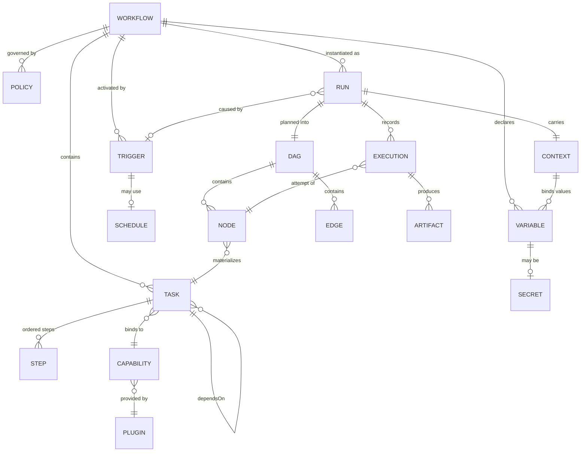
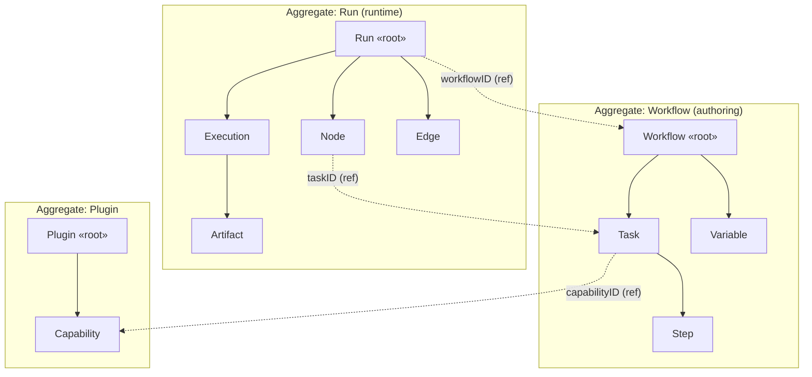
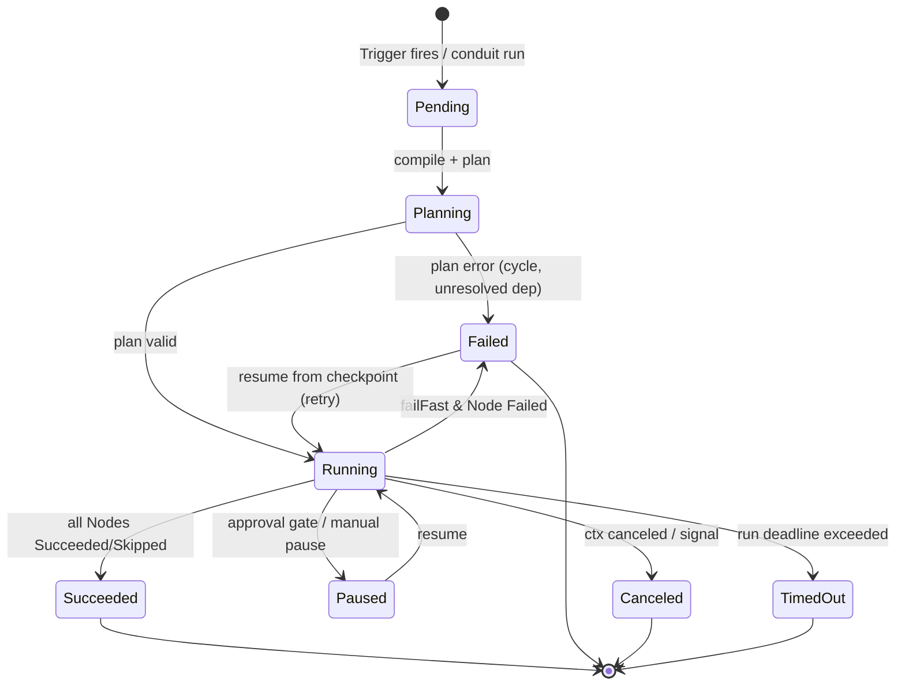
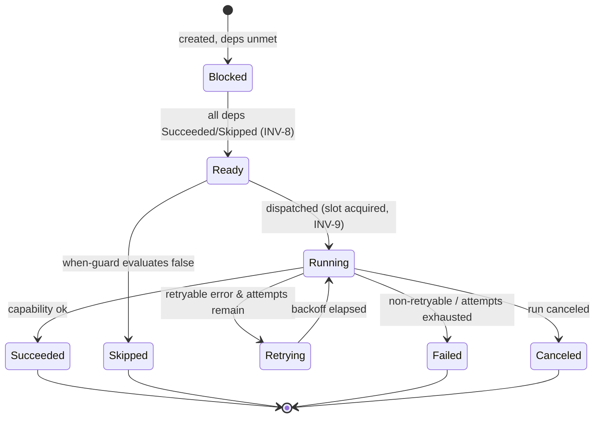
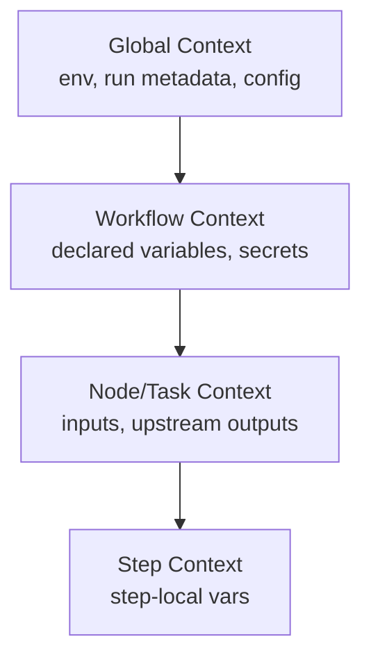

# 12 — Domain Model

> **Platform:** Conduit · **Binary:** `conduit` (alias `cdt`) · **Module:** `github.com/conduit-io/conduit`
> **Go:** 1.24+ · **Status:** Architecture Baseline v1.0 · **Owner:** Platform Architecture · **Date:** 2026-07-02

**Related documents:** [10 — Platform Architecture](10-platform-architecture.md) · [11 — Component Architecture](11-component-architecture.md) · [13 — Data Models](13-data-models.md) · [30 — Workflow DAG](30-workflow-dag.md) · [31 — Execution Runtime](31-execution-runtime.md) · [32 — State Management](32-state-management.md)

---

## 1. Purpose

This document establishes the **ubiquitous language** of Conduit and the **domain model** that the entire platform shares: entities, aggregates, value objects, invariants, relationships, and lifecycle state machines. It is the conceptual source of truth; the concrete Go struct and schema realizations are in [13 — Data Models](13-data-models.md).

We distinguish two conceptual phases that reuse the same vocabulary:

- **Authoring/Compile time** — the *definition* graph: `Workflow → Task → Step`, expressed in FlowDSL.
- **Run time** — the *execution* graph and history: `Run → Execution` over a **DAG** of `Node`/`Edge`, producing `Artifact`s.

---

## 2. Ubiquitous Language / Glossary

| Term | Definition |
|---|---|
| **Command** | A CLI verb (`conduit run`, `conduit plan`) exposed by the Command Framework. Distinct from workflow content. |
| **Workflow** | The top-level authored automation unit defined in a `.flow` file. Aggregate root at authoring time. Contains Tasks, variables, triggers, policies. |
| **Task** | A named unit of work within a Workflow that binds to a **Capability** and carries inputs, `when` guard, retry/timeout, and dependency edges. |
| **Step** | An ordered sub-action inside a Task (e.g., a shell line, a sub-capability call). Steps run sequentially within their Task. |
| **Node** | A vertex in the execution **DAG**. Each schedulable Task materializes to a Node at plan time. |
| **Edge** | A directed dependency between Nodes: `A → B` means B waits for A. Derived from `dependsOn` and data references. |
| **DAG** | Directed Acyclic Graph of Nodes/Edges produced by the Planner. Cycles are a compile/plan error. |
| **Run** | A single execution instance of a Workflow. Aggregate root at run time; has a unique `RunID` and a lifecycle. |
| **Execution** | The record of one Node's attempt(s) within a Run (a Task's runtime instance, including retries). |
| **Artifact** | A produced output (file, blob, structured value) referenced by content hash and associated with an Execution/Run. |
| **Plugin** | A go-plugin gRPC subprocess providing one or more Capabilities. |
| **Capability** | A named, versioned operation a Plugin exposes (e.g., `git.clone`, `cloud.deploy`) with a typed input/output schema. |
| **Context** | The evaluation environment (variables, secrets, run metadata) available to expressions and Tasks at a point in the graph. |
| **Variable** | A named, typed value (input, computed, or output) resolvable by CEL expressions. |
| **Secret** | A sensitive Variable resolved lazily from a backend, redacted in logs/state. |
| **Trigger** | The cause of a Run: manual, schedule, event, or webhook. |
| **Schedule** | A cron/interval specification that produces Triggers over time. |
| **Policy** | A governing rule applied to a Workflow/Run: failure policy, concurrency limit, retry defaults, authorization, approval gate. |

RFC 2119 keywords (MUST/SHOULD/MAY) per repository convention.

---

## 3. Entity-Relationship Diagram

---

## 4. Aggregates & Boundaries

Aggregates define **consistency and transactional boundaries**. External references cross aggregates by **ID only**.

| Aggregate | Root | Invariant scope | Referenced by ID |
|---|---|---|---|
| **Workflow** | `Workflow` | name unique per project; Tasks form a DAG; every `dependsOn` resolves | `Capability` (by ID) |
| **Run** | `Run` | one lifecycle; executions belong to exactly one Run; artifacts immutable | `Workflow`, `Task`, `Trigger` (by ID) |
| **Plugin** | `Plugin` | capabilities uniquely named+versioned within the plugin | — |

### 4.1 Value Objects (immutable, equality by value)

`RunID`, `WorkflowID`, `CapabilityID`, `NodeID`, `ArtifactRef` (content hash), `Version` (SemVer), `SecretRef`, `Duration`, `ExprSource`, `CronSpec`. Value objects have no lifecycle and are freely shared across goroutines.

---

## 5. Core Invariants

Invariants are enforced at compile (Sema/Planner) or runtime (Executor/State Store).

| # | Invariant | Enforced at |
|---|---|---|
| INV-1 | The Task dependency graph MUST be acyclic. | Planner (cycle detection) |
| INV-2 | Every `Task.dependsOn` MUST reference an existing Task in the same Workflow. | Semantic Analysis |
| INV-3 | Every `Task.capability` MUST resolve to a loaded Capability at plan time (or fail fast). | Planner + Plugin Manager |
| INV-4 | Every CEL expression MUST type-check against the declared Context. | Expression Engine (compile) |
| INV-5 | A Run's status transitions MUST follow the Run state machine (§6.1). | State Store (guarded writes) |
| INV-6 | An Artifact is immutable once recorded (content-addressed by hash). | State Store |
| INV-7 | A Secret MUST never be serialized in plaintext to state, logs, or events. | Secret Resolver + redaction |
| INV-8 | A Node becomes `Ready` only when all inbound Edge sources are `Succeeded` (or `Skipped` under policy). | Scheduler |
| INV-9 | `maxParallel` (Workflow/Policy) MUST NOT be exceeded by concurrently running Executions. | Scheduler (semaphore) |

---

## 6. Lifecycle State Machines

### 6.1 Run lifecycle

**Terminal states:** `Succeeded`, `Canceled`, `TimedOut`, and `Failed` (unless resumed). Only non-terminal→terminal transitions permitted per INV-5. Resume creates continuation executions against the persisted checkpoint (see [71 — Recovery](71-recovery-strategy.md)).

### 6.2 Task/Execution lifecycle

A Task's runtime instance is an **Execution**; each `Retrying → Running` cycle appends an attempt record (see `TaskState.Attempts` in [13 — Data Models](13-data-models.md)).

---

## 7. Context & Expression Scope

The **Context** is the resolved binding surface for CEL at a point in the graph. Its scope composes hierarchically:

- Later scopes **shadow** earlier ones by name.
- Upstream Task outputs enter a downstream Node's Context only along an Edge (INV-8), which is why data references also create Edges.
- Secrets appear in Context as `SecretRef` handles; their plaintext is materialized only at capability invocation and redacted everywhere else (INV-7).

Details of the CEL environment and declarations: [25 — Expression Engine](25-expression-engine.md).

---

## 8. Triggers, Schedules & Policies

| Trigger kind | Source | Produces |
|---|---|---|
| `manual` | `conduit run` / agent API | one Run |
| `schedule` | `Schedule` (`CronSpec`) | Runs over time |
| `event` | Event Bus / external event | Run per matching event |
| `webhook` | HTTP into `conduit serve` | Run per request (authorized) |

**Policy** attaches to Workflows/Runs and is evaluated by the Runtime/Scheduler:

- `failurePolicy`: `fail-fast` | `continue`
- `concurrency`: `maxParallel`, `maxConcurrentRuns` (serve mode)
- `retry`: default attempts/backoff (Task-overridable)
- `authorization`: required roles/scopes (see [63 — Authorization](63-authorization.md))
- `approval`: manual gate → drives `Running → Paused`

---

## 9. Mapping to Components

| Domain concept | Owning component ([11](11-component-architecture.md)) |
|---|---|
| Workflow/Task/Step (authoring) | DSL Front-End → `CompiledFlow` |
| Node/Edge/DAG | DAG Planner |
| Run/Execution lifecycle | Scheduler + Runtime Executor |
| Artifact, checkpoint, history | State Store |
| Capability/Plugin | Plugin Manager |
| Variable/Context evaluation | Expression Engine |
| Secret | Secret Resolver (port) |
| Trigger/Schedule | Command Framework / Gateway / scheduler (serve) |
| Policy | Runtime middleware + AuthZ |

---

## 10. Cross-References

- Concrete structs, JSON/protobuf schemas, on-disk state → [13 — Data Models](13-data-models.md)
- Graph construction & levelization → [30 — Workflow DAG](30-workflow-dag.md)
- Execution & retries → [31 — Execution Runtime](31-execution-runtime.md)
- Persistence & resume → [32 — State Management](32-state-management.md) · [71 — Recovery](71-recovery-strategy.md)
- Secrets & redaction → [61 — Secrets Management](61-secrets-management.md)
