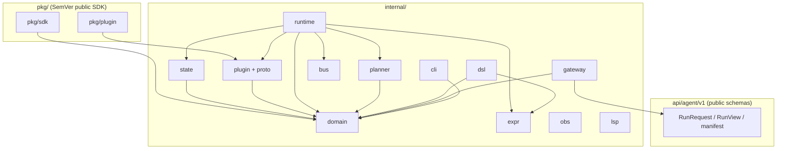
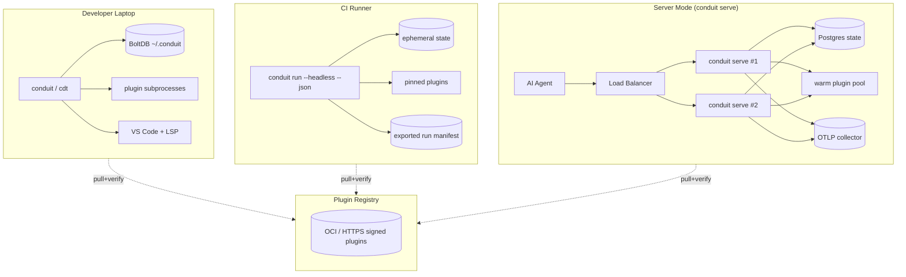

# 13 — Data Models

> **Platform:** Conduit · **Binary:** `conduit` (alias `cdt`) · **Module:** `github.com/conduit-io/conduit`
> **Go:** 1.24+ · **Status:** Architecture Baseline v1.0 · **Owner:** Platform Architecture · **Date:** 2026-07-02

**Related documents:** [10 — Platform Architecture](10-platform-architecture.md) · [11 — Component Architecture](11-component-architecture.md) · [12 — Domain Model](12-domain-model.md) · [32 — State Management](32-state-management.md) · [40 — Plugin Architecture](40-plugin-architecture.md) · [83 — API Standards](83-api-standards-versioning.md)

---

## 1. Purpose

This document provides the **concrete, implementable data models** for Conduit: Go struct definitions for domain entities and DTOs, the JSON schemas for the AI-Agent API and workflow run manifests, the on-disk state schema, the plugin manifest schema, and the protobuf definitions for the go-plugin gRPC contract. It realizes the conceptual model in [12 — Domain Model](12-domain-model.md).

All identifiers are `github.com/conduit-io/conduit`-relative. JSON field names are `snake_case`; Go fields are `PascalCase` with explicit tags. All schemas are versioned per [83 — API Standards](83-api-standards-versioning.md).

---

## 2. Go — Value Objects & IDs

```go
// package domain
package domain

type (
    RunID        string // e.g. "run_01J..." (ULID)
    WorkflowID   string
    TaskID       string
    NodeID       string
    ExecutionID  string
    CapabilityID string // "plugin.capability", e.g. "git.clone"
    PluginID     string
    Topic        string
)

// Version is a parsed SemVer 2.0.0 value object.
type Version struct {
    Major, Minor, Patch int
    Pre, Build          string
}

// ArtifactRef is a content-addressed reference (immutable, INV-6).
type ArtifactRef struct {
    Hash string `json:"hash"` // "sha256:..."
    Size int64  `json:"size"`
    Mime string `json:"mime,omitempty"`
}

// SecretRef is an opaque handle; plaintext never serialized (INV-7).
type SecretRef struct {
    Backend string `json:"backend"` // "env" | "vault" | "keychain"
    Key     string `json:"key"`
}

// ExprSource is unevaluated CEL source text.
type ExprSource string

// CronSpec is a validated cron/interval expression.
type CronSpec string
```

---

## 3. Go — Authoring Entities (Workflow / Task / Step)

These are the product of the DSL Front-End (`CompiledFlow`), immutable after compile.

```go
package domain

type CompiledFlow struct {
    Workflow  Workflow            `json:"workflow"`
    Checksum  string              `json:"checksum"`   // sha256 of source
    Compiler  Version             `json:"compiler"`
    Programs  map[string]struct{} `json:"-"`          // compiled CEL programs (in-memory)
}

type Workflow struct {
    ID          WorkflowID          `json:"id"`
    Name        string              `json:"name"`
    Version     Version             `json:"version"`
    Description string              `json:"description,omitempty"`
    Variables   []Variable          `json:"variables,omitempty"`
    Tasks       []Task              `json:"tasks"`
    Triggers    []Trigger           `json:"triggers,omitempty"`
    Policy      Policy              `json:"policy"`
    MaxParallel int                 `json:"max_parallel"` // 0 = unbounded→default
}

type Task struct {
    ID         TaskID        `json:"id"`
    Name       string        `json:"name"`
    Capability CapabilityID  `json:"capability"`
    Inputs     map[string]ExprSource `json:"inputs,omitempty"` // CEL-evaluated
    When       ExprSource    `json:"when,omitempty"`           // guard
    DependsOn  []TaskID      `json:"depends_on,omitempty"`
    Steps      []Step        `json:"steps,omitempty"`
    Retry      RetrySpec     `json:"retry"`
    Timeout    Duration      `json:"timeout,omitempty"`
}

type Step struct {
    ID     string                `json:"id"`
    Run    string                `json:"run,omitempty"`  // shell or sub-capability
    Inputs map[string]ExprSource `json:"inputs,omitempty"`
}

type Variable struct {
    Name    string     `json:"name"`
    Type    string     `json:"type"` // "string"|"int"|"bool"|"list"|"map"|"secret"
    Default any        `json:"default,omitempty"`
    Secret  *SecretRef `json:"secret,omitempty"`
    Required bool      `json:"required"`
}

type Duration string // "30s", "5m" (parsed via time.ParseDuration)

type RetrySpec struct {
    Attempts int      `json:"attempts"`
    Backoff  Duration `json:"backoff,omitempty"`
    Strategy string   `json:"strategy,omitempty"` // "fixed"|"exponential"
}

type Policy struct {
    Failure       string   `json:"failure"`        // "fail-fast"|"continue"
    MaxConcurrentRuns int  `json:"max_concurrent_runs,omitempty"`
    AuthRoles     []string `json:"auth_roles,omitempty"`
    Approval      bool     `json:"approval,omitempty"`
}

type Trigger struct {
    Kind     string   `json:"kind"` // "manual"|"schedule"|"event"|"webhook"
    Schedule CronSpec `json:"schedule,omitempty"`
    EventTopic Topic  `json:"event_topic,omitempty"`
}
```

---

## 4. Go — Execution Entities (DAG / Run / Execution)

```go
package domain

// --- Plan graph ---

type ExecutionPlan struct {
    RunID  RunID   `json:"run_id"`
    DAG    DAG     `json:"dag"`
    Levels []Level `json:"levels"` // topological ready-sets
}

type DAG struct {
    Nodes []Node `json:"nodes"`
    Edges []Edge `json:"edges"`
}

type Node struct {
    ID     NodeID `json:"id"`
    TaskID TaskID `json:"task_id"`
}

type Edge struct {
    From NodeID `json:"from"`
    To   NodeID `json:"to"`
}

type Level struct {
    Index int    `json:"index"`
    Tasks []Task `json:"tasks"`
}

// --- Run / Execution history ---

type Run struct {
    ID         RunID       `json:"id"`
    WorkflowID WorkflowID  `json:"workflow_id"`
    Status     RunStatus   `json:"status"`
    Trigger    string      `json:"trigger"`
    Variables  Variables   `json:"variables"`
    StartedAt  time.Time   `json:"started_at"`
    EndedAt    *time.Time  `json:"ended_at,omitempty"`
    Executions []Execution `json:"executions,omitempty"`
    Error      *ConduitError `json:"error,omitempty"`
}

type RunStatus string

const (
    RunPending   RunStatus = "pending"
    RunPlanning  RunStatus = "planning"
    RunRunning   RunStatus = "running"
    RunPaused    RunStatus = "paused"
    RunSucceeded RunStatus = "succeeded"
    RunFailed    RunStatus = "failed"
    RunCanceled  RunStatus = "canceled"
    RunTimedOut  RunStatus = "timed_out"
)

type Execution struct {
    ID        ExecutionID   `json:"id"`
    NodeID    NodeID        `json:"node_id"`
    TaskID    TaskID        `json:"task_id"`
    State     TaskState     `json:"state"`
    Artifacts []ArtifactRef `json:"artifacts,omitempty"`
}

type TaskState struct {
    Status   string     `json:"status"` // blocked|ready|running|retrying|succeeded|skipped|failed|canceled
    Attempts []Attempt  `json:"attempts,omitempty"`
    Output   any        `json:"output,omitempty"`
}

type Attempt struct {
    N         int           `json:"n"`
    StartedAt time.Time     `json:"started_at"`
    EndedAt   *time.Time    `json:"ended_at,omitempty"`
    Error     *ConduitError `json:"error,omitempty"`
}

type Variables map[string]any

type Activation struct { // CEL evaluation input
    Vars    Variables
    Secrets map[string]SecretRef
    Run     RunMeta
}
```

---

## 5. Go — DTOs & Ports Return Types

```go
package domain

type RunRequest struct {
    Source    string            `json:"source"`     // .flow contents or path
    Variables map[string]any    `json:"variables"`
    DryRun    bool              `json:"dry_run"`
    Headless  bool              `json:"headless"`
}

type RunSummary struct {
    RunID    RunID     `json:"run_id"`
    Status   RunStatus `json:"status"`
    Duration string    `json:"duration"`
    Tasks    struct{ Total, Succeeded, Failed, Skipped int } `json:"tasks"`
}

type ConduitError struct {
    Code    string `json:"code"`    // "CDT-PLAN-CYCLE", "CDT-EXEC-TIMEOUT"...
    Message string `json:"message"`
    Details map[string]any `json:"details,omitempty"`
}

type RunQuery struct {
    WorkflowID WorkflowID `json:"workflow_id,omitempty"`
    Status     RunStatus  `json:"status,omitempty"`
    Limit      int        `json:"limit,omitempty"`
}
```

---

## 6. JSON Schema — AI-Agent API

Endpoint set (`conduit serve`, `/v1`): `POST /v1/compile`, `POST /v1/plan`, `POST /v1/runs`, `GET /v1/runs/{id}`, `GET /v1/runs/{id}/events` (SSE stream). See [11 §3.14](11-component-architecture.md) and [83 — API Standards](83-api-standards-versioning.md).

### 6.1 `RunRequest` (request to `POST /v1/runs`)

```json
{
  "$schema": "https://json-schema.org/draft/2020-12/schema",
  "$id": "https://conduit-io.github.io/schemas/agent/v1/run-request.json",
  "title": "RunRequest",
  "type": "object",
  "required": ["source"],
  "properties": {
    "source":    { "type": "string", "description": "FlowDSL source or path reference" },
    "variables": { "type": "object", "additionalProperties": true },
    "dry_run":   { "type": "boolean", "default": false },
    "headless":  { "type": "boolean", "default": true }
  },
  "additionalProperties": false
}
```

### 6.2 `RunResponse` / `RunView`

```json
{
  "$schema": "https://json-schema.org/draft/2020-12/schema",
  "$id": "https://conduit-io.github.io/schemas/agent/v1/run-view.json",
  "title": "RunView",
  "type": "object",
  "required": ["run_id", "status"],
  "properties": {
    "run_id": { "type": "string" },
    "status": { "enum": ["pending","planning","running","paused","succeeded","failed","canceled","timed_out"] },
    "workflow_id": { "type": "string" },
    "started_at": { "type": "string", "format": "date-time" },
    "ended_at":   { "type": "string", "format": "date-time" },
    "executions": {
      "type": "array",
      "items": {
        "type": "object",
        "properties": {
          "task_id": { "type": "string" },
          "status":  { "type": "string" },
          "artifacts": { "type": "array", "items": { "$ref": "#/$defs/artifact" } }
        }
      }
    },
    "error": { "$ref": "#/$defs/error" }
  },
  "$defs": {
    "artifact": {
      "type": "object",
      "required": ["hash"],
      "properties": {
        "hash": { "type": "string", "pattern": "^sha256:[a-f0-9]{64}$" },
        "size": { "type": "integer" },
        "mime": { "type": "string" }
      }
    },
    "error": {
      "type": "object",
      "required": ["code","message"],
      "properties": {
        "code": { "type": "string" },
        "message": { "type": "string" },
        "details": { "type": "object", "additionalProperties": true }
      }
    }
  }
}
```

---

## 7. JSON Schema — Workflow Run Manifest

The **run manifest** is the portable, self-describing record exported from state (for CI artifacts, audits, agent replay).

```json
{
  "$schema": "https://json-schema.org/draft/2020-12/schema",
  "$id": "https://conduit-io.github.io/schemas/run-manifest/v1.json",
  "title": "RunManifest",
  "type": "object",
  "required": ["manifest_version", "run_id", "workflow", "status", "dag"],
  "properties": {
    "manifest_version": { "const": "1.0" },
    "run_id":   { "type": "string" },
    "trigger":  { "enum": ["manual","schedule","event","webhook"] },
    "workflow": {
      "type": "object",
      "required": ["id","name","version","checksum"],
      "properties": {
        "id": { "type": "string" },
        "name": { "type": "string" },
        "version": { "type": "string", "pattern": "^\\d+\\.\\d+\\.\\d+" },
        "checksum": { "type": "string" }
      }
    },
    "status": { "type": "string" },
    "started_at": { "type": "string", "format": "date-time" },
    "ended_at":   { "type": "string", "format": "date-time" },
    "dag": {
      "type": "object",
      "properties": {
        "nodes": { "type": "array", "items": { "type": "object",
          "properties": { "id": {"type":"string"}, "task_id": {"type":"string"} } } },
        "edges": { "type": "array", "items": { "type": "object",
          "properties": { "from": {"type":"string"}, "to": {"type":"string"} } } }
      }
    },
    "executions": { "type": "array", "items": { "type": "object" } }
  },
  "additionalProperties": false
}
```

---

## 8. On-Disk State Schema

Local state lives under `~/.conduit/` (BoltDB); server mode uses Postgres with an equivalent logical schema. See [32 — State Management](32-state-management.md).

### 8.1 BoltDB bucket layout (local)

```
~/.conduit/state.db
├── bucket: meta            key: "schema_version" → "1"
├── bucket: runs            key: <RunID>          → JSON(Run)          # header/status
├── bucket: executions      key: <RunID>/<NodeID> → JSON(Execution)
├── bucket: checkpoints     key: <RunID>/<seq>    → JSON(Checkpoint)   # resume points
├── bucket: artifacts       key: <hash>           → JSON(ArtifactMeta) # content index
├── bucket: idx_wf_runs     key: <WorkflowID>/<ts>→ <RunID>           # secondary index
└── bucket: idx_status      key: <status>/<ts>    → <RunID>
```

```go
// package domain
type Checkpoint struct {
    RunID     RunID       `json:"run_id"`
    Seq       int         `json:"seq"`
    Completed []NodeID    `json:"completed"`  // succeeded/skipped nodes
    States    map[NodeID]TaskState `json:"states"`
    Vars      Variables   `json:"vars"`       // computed variables so far
    CreatedAt time.Time   `json:"created_at"`
}
```

### 8.2 Postgres logical schema (server)

```sql
CREATE TABLE runs (
  run_id       TEXT PRIMARY KEY,
  workflow_id  TEXT NOT NULL,
  status       TEXT NOT NULL,
  trigger      TEXT,
  started_at   TIMESTAMPTZ NOT NULL,
  ended_at     TIMESTAMPTZ,
  manifest     JSONB NOT NULL
);
CREATE TABLE executions (
  run_id   TEXT REFERENCES runs(run_id),
  node_id  TEXT, task_id TEXT, status TEXT,
  attempts JSONB, output JSONB,
  PRIMARY KEY (run_id, node_id)
);
CREATE TABLE checkpoints (
  run_id TEXT REFERENCES runs(run_id), seq INT, data JSONB,
  PRIMARY KEY (run_id, seq)
);
CREATE INDEX idx_runs_wf ON runs(workflow_id, started_at DESC);
CREATE INDEX idx_runs_status ON runs(status);
```

---

## 9. Plugin Manifest Schema

Every plugin ships a `plugin.yaml` describing identity, capabilities, and trust metadata. Consumed by the Plugin Manager during discovery/verification ([40 — Plugin Architecture](40-plugin-architecture.md)).

```json
{
  "$schema": "https://json-schema.org/draft/2020-12/schema",
  "$id": "https://conduit-io.github.io/schemas/plugin-manifest/v1.json",
  "title": "PluginManifest",
  "type": "object",
  "required": ["api_version", "name", "version", "protocol", "capabilities"],
  "properties": {
    "api_version": { "const": "conduit.io/v1" },
    "name":    { "type": "string", "pattern": "^[a-z][a-z0-9_-]*$" },
    "version": { "type": "string", "pattern": "^\\d+\\.\\d+\\.\\d+" },
    "protocol": {
      "type": "object",
      "required": ["type", "version"],
      "properties": {
        "type":    { "const": "grpc" },
        "version": { "type": "integer", "minimum": 1 },
        "magic_cookie": { "type": "string" }
      }
    },
    "entrypoint": { "type": "string" },
    "signature": {
      "type": "object",
      "properties": { "cosign": { "type": "string" }, "cert": { "type": "string" } }
    },
    "capabilities": {
      "type": "array",
      "minItems": 1,
      "items": {
        "type": "object",
        "required": ["id", "version", "input_schema", "output_schema"],
        "properties": {
          "id":      { "type": "string", "pattern": "^[a-z][a-z0-9_]*\\.[a-z][a-z0-9_]*$" },
          "version": { "type": "string" },
          "summary": { "type": "string" },
          "input_schema":  { "type": "object" },
          "output_schema": { "type": "object" },
          "streaming": { "type": "boolean", "default": false }
        }
      }
    }
  },
  "additionalProperties": false
}
```

---

## 10. Protobuf — go-plugin gRPC Contract

The host↔plugin boundary is defined by protobuf (`internal/plugin/proto/plugin.proto`), served via HashiCorp go-plugin over gRPC on a local socket ([40 — Plugin Architecture](40-plugin-architecture.md)).

```protobuf
syntax = "proto3";
package conduit.plugin.v1;
option go_package = "github.com/conduit-io/conduit/internal/plugin/proto;proto";

import "google/protobuf/struct.proto";
import "google/protobuf/timestamp.proto";

// The service every capability plugin implements.
service CapabilityProvider {
  rpc Describe (DescribeRequest) returns (DescribeResponse);
  rpc Execute  (ExecuteRequest)  returns (ExecuteResponse);
  rpc ExecuteStream (ExecuteRequest) returns (stream ExecuteEvent); // streaming capabilities
  rpc Health   (HealthRequest)   returns (HealthResponse);
}

message DescribeRequest {}
message DescribeResponse {
  string name = 1;
  string version = 2;
  repeated CapabilitySpec capabilities = 3;
}

message CapabilitySpec {
  string id = 1;            // "git.clone"
  string version = 2;
  string summary = 3;
  google.protobuf.Struct input_schema = 4;   // JSON Schema as struct
  google.protobuf.Struct output_schema = 5;
  bool   streaming = 6;
}

message ExecuteRequest {
  string capability_id = 1;
  string run_id = 2;
  string node_id = 3;
  google.protobuf.Struct input = 4;          // resolved, secrets materialized
  map<string, string> metadata = 5;          // trace id, deadline hints
}

message ExecuteResponse {
  Status status = 1;
  google.protobuf.Struct output = 2;
  repeated Artifact artifacts = 3;
  Error error = 4;
}

message ExecuteEvent {
  oneof event {
    LogLine   log      = 1;
    Progress  progress = 2;
    ExecuteResponse result = 3; // terminal
  }
}

message Artifact {
  string hash = 1;   // "sha256:..."
  int64  size = 2;
  string mime = 3;
}

message LogLine { string level = 1; string message = 2; }
message Progress { double fraction = 1; string message = 2; }

message HealthRequest {}
message HealthResponse { bool healthy = 1; string detail = 2; }

enum Status { STATUS_UNSPECIFIED = 0; OK = 1; ERROR = 2; }
message Error { string code = 1; string message = 2; bool retryable = 3; }
```

Go handshake config (host + plugin share this):

```go
var Handshake = plugin.HandshakeConfig{
    ProtocolVersion:  1,
    MagicCookieKey:   "CONDUIT_PLUGIN",
    MagicCookieValue: "conduit.io/v1",
}
```

---

## 11. Component & Deployment Diagrams

### 11.1 Component (package) diagram



### 11.2 Deployment diagram



---

## 12. Cross-References

- Conceptual entities & invariants → [12 — Domain Model](12-domain-model.md)
- Components consuming these types → [11 — Component Architecture](11-component-architecture.md)
- Persistence, migrations, resume → [32 — State Management](32-state-management.md)
- Plugin contract & trust → [40 — Plugin Architecture](40-plugin-architecture.md)
- Schema versioning & compatibility → [83 — API Standards](83-api-standards-versioning.md)
