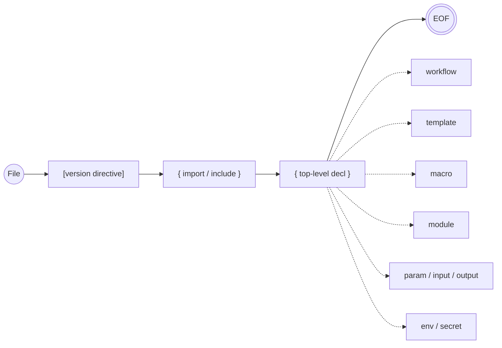

# 20 — FlowDSL Grammar Specification

> **Codename:** Conduit · **DSL:** FlowDSL (`*.flow`) · **Module:** `github.com/conduit-io/conduit`
> **Parser:** Participle v2 · **Expressions:** CEL-Go · **Go:** 1.24+
> **Status:** Language Baseline v1.0 · **Owner:** Language & Compiler · **Date:** 2026-07-02
> **Grammar Version:** `flow/1.0` (see [§11 Grammar Versioning](#11-grammar-versioning))

This document is the **authoritative, normative** grammar specification for **FlowDSL**, the declarative-with-expressions
workflow language of the Conduit platform. Requirement keywords **MUST/SHOULD/MAY** follow RFC 2119 / RFC 8174.

**Related documents**
- [21 — Lexer Design](21-lexer-design.md) — token kinds, stateful lexing, interpolation states.
- [22 — Parser Design](22-parser-design.md) — Participle v2 grammar structs & error-tolerant parsing.
- [23 — AST Design](23-ast-design.md) — node taxonomy, visitor, IR lowering, `conduit fmt`.
- [24 — Semantic Analysis](24-semantic-analysis.md) — name resolution, typing, diagnostics.
- [25 — Expression Engine](25-expression-engine.md) — CEL-Go embedding, function library, sandbox.

---

## 1. Design goals & language model

FlowDSL is a **declarative** workflow language with an **embedded expression sublanguage** (CEL). A `.flow` file
declares *what* the workflow is (tasks, steps, dependencies, data) while CEL expressions supply *computed* values,
guards, and interpolations. FlowDSL itself is intentionally **non-Turing-complete**: there are no user-defined
imperative control-flow constructs — iteration is expressed declaratively via `for_each`/`matrix`, and conditionals
via the `when` CEL guard.

| Goal | Consequence for the grammar |
|---|---|
| **Participle-friendly** | Grammar is **LL(k)** / **PEG**-shaped: each production is disambiguated by a leading keyword or a fixed token. No left recursion. |
| **Deterministic parse** | Every block opens with a **keyword head token** (`workflow`, `task`, `step`, …). This gives 1-token lookahead for block dispatch. |
| **Error-tolerant** | Block-structured with explicit `{ … }` delimiters so the parser can resynchronize at block boundaries for the LSP (see [22 §7](22-parser-design.md#7-error-tolerant-parsing-for-the-lsp)). |
| **Expression isolation** | CEL lives only inside `${{ … }}` interpolations and specific expression-typed fields (`when`, `for_each`, defaults). The FlowDSL lexer hands CEL a **raw substring**; CEL-Go parses/type-checks it separately. |
| **Stable & versioned** | A file MAY pin the grammar with a `flow` version directive; unknown future syntax degrades to a diagnostic, not a crash. |

### 1.1 Compilation pipeline

```mermaid
flowchart LR
  SRC["`.flow` source bytes"] --> LEX["Lexer<br/>(stateful, Participle)"]
  LEX -->|token stream| PAR["Parser<br/>(Participle v2)"]
  PAR -->|"parse tree → AST"| AST["AST<br/>(typed nodes + positions)"]
  AST --> SEMA["Semantic Analysis<br/>(name res · type check · deps)"]
  SEMA -->|"CEL sub-exprs"| CEL["CEL-Go<br/>compile + type-check"]
  CEL --> SEMA
  SEMA --> IR["Typed IR<br/>(lowered workflow model)"]
  IR --> PLAN["DAG Planner"]
  subgraph Diagnostics
    D["Diagnostic sink<br/>(severity · code · range · quickfix)"]
  end
  LEX -.-> D
  PAR -.-> D
  SEMA -.-> D
  CEL -.-> D
  PLAN -.-> D
  IR --> FMT["conduit fmt<br/>(pretty-printer)"]
```

Stages `LEX → PAR → AST` are covered by docs [21](21-lexer-design.md)/[22](22-parser-design.md)/[23](23-ast-design.md);
`SEMA` by [24](24-semantic-analysis.md); `CEL` by [25](25-expression-engine.md). The DAG Planner and Runtime are out of
scope here (see [30 — Workflow DAG](30-workflow-dag.md)).

---

## 2. Notation

The grammar is written in **EBNF** with the following conventions (ISO/IEC 14977-flavored, relaxed):

| Form | Meaning |
|---|---|
| `"literal"` | terminal literal text (keyword/punctuation) |
| `UPPER` | a lexical token class (defined in [§8](#8-lexical-grammar) and [21 Lexer Design](21-lexer-design.md)) |
| `a b` | concatenation (sequence) |
| `a \| b` | ordered alternation (PEG-style: first match wins) |
| `[ a ]` | optional (0 or 1) |
| `{ a }` | repetition (0 or more) |
| `( a )` | grouping |
| `a - b` | `a` but not `b` |
| `(* … *)` | comment on the grammar itself |

> **PEG note.** Alternations are **ordered**. Where two alternatives could both match a prefix, the earlier one is
> preferred; the grammar is authored so that the leading token of each alternative is disjoint, keeping it LL(1)-clean
> for Participle. See [22 §5 Ambiguity Resolution](22-parser-design.md#5-lookahead--ambiguity-resolution).

---

## 3. Grammar overview (railroad summary)



---

## 4. Compilation unit (file)

```ebnf
File          = [ VersionDirective ] , { ImportDecl | IncludeDecl } , { TopLevelDecl } , EOF ;

VersionDirective
              = "flow" , STRING ;                      (* e.g.  flow "1.0"  — see §11 *)

TopLevelDecl  = WorkflowDecl
              | TemplateDecl
              | MacroDecl
              | ModuleDecl
              | ParamDecl
              | InputDecl
              | OutputDecl
              | EnvDecl
              | SecretDecl ;
```

A file **MUST** contain at most one top-level `workflow`. `template`, `macro`, and library-style `.flow` files MAY
contain zero workflows and export reusable declarations (see [§7 Modules, imports & templates](#7-modules-imports--templates)).

---

## 5. Imports, includes & modules

```ebnf
ImportDecl    = "import" , ( ImportSingle | ImportGroup ) ;
ImportSingle  = ImportPath , [ "as" , IDENT ] , [ "exposing" , IdentList ] ;
ImportGroup   = "(" , { ImportSingle } , ")" ;
ImportPath    = STRING ;                                (* module ref: "std/strings", "./lib/deploy.flow" *)
IdentList     = "(" , IDENT , { "," , IDENT } , ")" ;

IncludeDecl   = "include" , STRING , [ "with" , Block ] ; (* textual/param-bound inclusion *)

ModuleDecl    = "module" , IDENT , Block ;              (* namespaced group of decls *)
```

- `import` binds an external module/library under a namespace (`as`) or selectively (`exposing`). Resolution rules are
  specified in [24 §3 Name resolution](24-semantic-analysis.md#3-name-resolution--scoping).
- `include` is closer to parameterized inclusion of another `.flow` fragment; `with { … }` supplies bindings.
- `module` groups declarations under a name to control the symbol namespace.

---

## 6. Workflow, task, step

```ebnf
WorkflowDecl  = "workflow" , [ IDENT ] , Block ;

(* Inside a WorkflowDecl block, the following statements are permitted. *)
WorkflowStmt  = MetaAssign
              | ParamDecl  | InputDecl | OutputDecl
              | EnvDecl    | SecretDecl
              | TaskDecl
              | OnErrorDecl | OnSuccessDecl
              | RetryDecl  | TimeoutDecl ;

TaskDecl      = "task" , IDENT , Block ;
TaskStmt      = MetaAssign
              | DependsOnDecl
              | WhenDecl
              | ForEachDecl | MatrixDecl
              | EnvDecl | SecretDecl
              | InputDecl | OutputDecl
              | RetryDecl | TimeoutDecl
              | OnErrorDecl | OnSuccessDecl
              | StepDecl ;

StepDecl      = "step" , [ IDENT ] , Block ;
StepStmt      = MetaAssign
              | UsesDecl
              | RunDecl
              | WhenDecl
              | EnvDecl | SecretDecl
              | InputDecl | OutputDecl
              | RetryDecl | TimeoutDecl
              | OnErrorDecl | OnSuccessDecl ;
```

`Block` is the generic brace-delimited statement group; the exact statement set permitted inside is validated by the
parser via typed union structs (see [22 §4](22-parser-design.md#4-grammar-to-ast-mapping)) and again by sema.

```ebnf
Block         = "{" , { Statement } , "}" ;
Statement     = WorkflowStmt | TaskStmt | StepStmt ;   (* narrowed by context in the AST structs *)
```

---

## 7. Declarations: data, actions, control

### 7.1 Parameters, inputs, outputs, typed variables

```ebnf
ParamDecl     = "param" , IDENT , [ ":" , TypeRef ] , [ "=" , Expr ] , [ Block ] ;
InputDecl     = "input"  , IDENT , [ ":" , TypeRef ] , [ "=" , Expr ] , [ Block ] ;
OutputDecl    = "output" , IDENT , [ ":" , TypeRef ] , "=" , Expr ;
VarDecl       = "var"    , IDENT , [ ":" , TypeRef ] , "=" , Expr ;

(* Optional trailing Block carries metadata: description, required, enum, validation. *)

TypeRef       = ScalarType
              | "list" , "<" , TypeRef , ">"
              | "map"  , "<" , ScalarType , "," , TypeRef , ">"
              | "object" , "{" , { FieldType } , "}"
              | IDENT ;                                 (* named/imported type *)
ScalarType    = "string" | "int" | "float" | "bool" | "duration" | "timestamp" | "any" | "null" ;
FieldType     = IDENT , ":" , TypeRef , [ "?" ] , [ "," ] ;
```

### 7.2 Environment & secrets

```ebnf
EnvDecl       = "env"    , ( EnvBinding | Block ) ;
SecretDecl    = "secret" , ( SecretBinding | Block ) ;
EnvBinding    = IDENT , "=" , Expr ;
SecretBinding = IDENT , "=" , SecretRef ;
SecretRef     = "ref" , "(" , STRING , ")" | Expr ;     (* resolved by Secrets Mgr, doc 61 *)
```

### 7.3 Dependencies, guards, iteration

```ebnf
DependsOnDecl = "depends_on" , ( IDENT | IdentList ) ;
WhenDecl      = "when" , EmbeddedExpr ;                 (* CEL guard, must type to bool *)

ForEachDecl   = "for_each" , EmbeddedExpr , [ "as" , IDENT , [ "," , IDENT ] ] , [ Block ] ;
                                                        (* as <value>[, <key/index>] *)
MatrixDecl    = "matrix" , Block ;                      (* block of IDENT = EmbeddedExpr(list) *)
MatrixAxis    = IDENT , "=" , EmbeddedExpr ;
```

### 7.4 Actions: `uses` and `run`

```ebnf
UsesDecl      = "uses" , ActionRef , [ "with" , Block ] ;
ActionRef     = STRING                                   (* "plugin://git/clone@v1" *)
              | IDENT , { "." , IDENT } , [ "@" , VERSION ] ;

RunDecl       = "run" , ( STRING | HEREDOC ) , [ "shell" , STRING ] ;
WithArg       = IDENT , "=" , Expr ;                     (* args inside `with` block *)
```

### 7.5 Reliability: retry, timeout, on_error/on_success

```ebnf
RetryDecl     = "retry" , ( INT | Block ) ;              (* count, or block: max, delay, backoff, when *)
TimeoutDecl   = "timeout" , ( DURATION | Expr ) ;
OnErrorDecl   = "on_error"   , Block ;
OnSuccessDecl = "on_success" , Block ;
```

### 7.6 Templates & macros

```ebnf
TemplateDecl  = "template" , IDENT , [ "(" , ParamSig , ")" ] , Block ;
MacroDecl     = "macro"    , IDENT , [ "(" , ParamSig , ")" ] , Block ;
ParamSig      = [ SigParam , { "," , SigParam } ] ;
SigParam      = IDENT , [ ":" , TypeRef ] , [ "=" , Expr ] ;

TemplateUse   = "uses" , "template" , IDENT , [ "with" , Block ] ;
```

A `template` expands to declarations (structural reuse); a `macro` expands to statements inline. Both are hygienic —
symbol capture rules are defined in [24 §3.4](24-semantic-analysis.md#3-name-resolution--scoping).

### 7.7 Generic assignments & metadata

```ebnf
MetaAssign    = IDENT , "=" , Value ;                    (* description = "…", parallel = true *)
Value         = Expr | InterpString | Literal | ListLit | MapLit ;
ListLit       = "[" , [ Value , { "," , Value } , [ "," ] ] , "]" ;
MapLit        = "{" , [ MapEntry , { "," , MapEntry } , [ "," ] ] , "}" ;
MapEntry      = ( IDENT | STRING ) , ":" , Value ;
```

---

## 8. Lexical grammar

The lexer is specified fully in [21 — Lexer Design](21-lexer-design.md). This section is the **normative token
reference** the grammar above relies upon.

### 8.1 Whitespace, comments, terminators

```ebnf
WS            = ( " " | "\t" | "\r" | "\n" )+ ;          (* insignificant except inside strings/heredocs *)
LineComment   = "#"  , { ANY - "\n" } , "\n"
              | "//" , { ANY - "\n" } , "\n" ;
BlockComment  = "/*" , { ANY } , "*/" ;                  (* non-nesting *)
```

FlowDSL is **brace-delimited and whitespace-insensitive** (no significant indentation). Newlines and commas between
statements are **optional separators**; see [21 §4 Whitespace policy](21-lexer-design.md#4-indentation--whitespace-policy).

### 8.2 Identifiers & keywords

```ebnf
IDENT         = ( LETTER | "_" ) , { LETTER | DIGIT | "_" } ;
LETTER        = ? Unicode letter (category L*) ? ;       (* Unicode identifiers permitted; see 21 §7 *)
```

**Reserved words** (keywords — MUST NOT be used as bare identifiers, see [§10](#10-reserved-words)):

```
workflow  task     step     module   template  macro
param     input    output   var      env       secret
depends_on when     for_each matrix   as        uses
run       with     shell    retry    timeout   on_error
on_success import   include  exposing ref       flow
true      false    null
```

Type keywords are **contextual** (only reserved after `:` in a `TypeRef`): `string int float bool duration timestamp
object list map any null`.

### 8.3 Literals

```ebnf
Literal       = STRING | RAWSTRING | INT | FLOAT | BOOL | DURATION | NULL ;

INT           = [ "-" ] , DIGIT , { DIGIT | "_" }
              | "0x" , HEXDIGIT , { HEXDIGIT }
              | "0o" , OCTDIGIT , { OCTDIGIT }
              | "0b" , ( "0" | "1" ) , { "0" | "1" } ;
FLOAT         = [ "-" ] , DIGIT , { DIGIT } , "." , DIGIT , { DIGIT } , [ Exp ]
              | [ "-" ] , DIGIT , { DIGIT } , Exp ;
Exp           = ( "e" | "E" ) , [ "+" | "-" ] , DIGIT , { DIGIT } ;
BOOL          = "true" | "false" ;
NULL          = "null" ;
DURATION      = DIGIT , { DIGIT } , DurUnit , { DIGIT , { DIGIT } , DurUnit } ; (* 1h30m, 500ms *)
DurUnit       = "ns" | "us" | "ms" | "s" | "m" | "h" | "d" ;
VERSION       = "v"? , DIGIT , { DIGIT } , { "." , DIGIT , { DIGIT } } , [ "-" , IDENT ] ;
```

### 8.4 Strings, interpolation & heredocs

```ebnf
STRING        = '"' , { StrChar | Interp } , '"' ;       (* interpolated, double-quoted *)
RAWSTRING     = "'" , { ANY - "'" } , "'" ;              (* raw, no interpolation, single-quoted *)
StrChar       = ( ANY - ( '"' | "\" | "$" ) ) | Escape | "$" - "${{" ;
Escape        = "\" , ( '"' | "\" | "n" | "t" | "r" | "u" HEX HEX HEX HEX | "$" ) ;

Interp        = "${{" , CEL_TEXT , "}}" ;                (* embedded CEL — see §9 *)

HEREDOC       = "<<" , [ "-" ] , TAG , "\n" , { HeredocLine } , TAG ;
                (* <<-TAG allows indented closer; interpolation active unless TAG is quoted *)
```

`InterpString` in the value grammar is any `STRING` (or heredoc) that contains one or more `Interp` fragments.

---

## 9. Formal specification of `${{ }}` interpolation & CEL embedding

### 9.1 Syntax & lexing contract

An **interpolation** is the exact token sequence `${{` … `}}`. The FlowDSL lexer switches to an `interp` lexer state on
`${{` and captures **raw bytes** until the matching `}}`, correctly skipping `}}` that occur inside CEL string literals.
It performs **no CEL parsing** — the captured substring (`CEL_TEXT`) is stored verbatim with its byte offset so CEL
diagnostics can be mapped back to source (see [21 §3 Interpolation states](21-lexer-design.md#3-interpolation-lexer-states)).

```ebnf
CEL_TEXT      = { ANY - "}}" | CelString } ;             (* balanced w.r.t. CEL string literals *)
CelString     = '"' , { ANY - '"' | '\"' } , '"'
              | "'" , { ANY - "'" | "\'" } , "'" ;
```

### 9.2 Semantic contract (normative)

1. **Where allowed.** `${{ … }}` MAY appear inside any `STRING`/`HEREDOC` value and is the *only* general interpolation
   form. Expression-typed fields (`when`, `for_each`, `matrix` axes, `param`/`input` defaults) accept a **bare**
   `EmbeddedExpr` (a CEL expression **without** the `${{ }}` wrapper) as well as a wrapped form.

   ```ebnf
   EmbeddedExpr = Interp | RawCel ;                      (* wrapped or bare CEL *)
   RawCel       = CEL_TEXT ;                             (* lexed to end of expression field *)
   ```

2. **Typing.** Each `${{ expr }}` in a string coerces its CEL result to `string`. A bare `EmbeddedExpr` keeps its CEL
   type; `when` MUST type to `bool`; `for_each` MUST type to `list<T>` or `map<K,V>`.

3. **Environment.** The CEL environment (available variables, functions, macros, cost limits) is constructed by the
   Expression Engine — see [25 — Expression Engine](25-expression-engine.md). FlowDSL exposes `params`, `inputs`,
   `env`, `secrets`, `matrix`, the loop variable, prior `output`s, and a `ctx` object.

4. **Isolation & security.** CEL runs in a **sandbox**: no I/O, bounded comprehensions, evaluation timeout, and a cost
   ceiling. See [25 §6 Cost limits & sandbox](25-expression-engine.md#6-cost-limits--sandbox).

### 9.3 Example

```flow
step deploy {
  env {
    IMAGE = "registry.example.com/app:${{ inputs.version }}"
    REPLICAS = "${{ env.PROD ? 5 : 1 }}"
  }
  when   ctx.branch == "main" && !inputs.dry_run     # bare CEL guard
  run    "kubectl set image deploy/app app=${{ env.IMAGE }} --replicas=${{ env.REPLICAS }}"
}
```

---

## 10. Reserved words

The following are **reserved** and MUST NOT be used as user identifiers (workflow/task/step/param names). Attempting to
do so is diagnostic `FLOW-E1002` (see [24 §7 Diagnostics model](24-semantic-analysis.md#7-diagnostics-model)).

| Category | Words |
|---|---|
| Block heads | `workflow` `task` `step` `module` `template` `macro` |
| Data | `param` `input` `output` `var` `env` `secret` |
| Control | `depends_on` `when` `for_each` `matrix` `as` |
| Actions | `uses` `run` `with` `shell` |
| Reliability | `retry` `timeout` `on_error` `on_success` |
| Linkage | `import` `include` `exposing` `ref` |
| Directive | `flow` |
| Literals | `true` `false` `null` |

Contextual type keywords (`string int float bool duration timestamp object list map any`) are reserved **only** in
`TypeRef` position and MAY otherwise be used as field/metadata identifiers.

---

## 11. Operator precedence

FlowDSL's own grammar has **no operators** — all operator expressions belong to the embedded CEL sublanguage. The table
below is the **CEL** precedence (highest to lowest), reproduced here for authoring reference; it is authoritative in
[25 — Expression Engine](25-expression-engine.md).

| Prec | Operators | Assoc |
|---:|---|---|
| 1 | `()` call, `[]` index, `.` select, `?.`* | left |
| 2 | unary `!` `-` | right |
| 3 | `*` `/` `%` | left |
| 4 | `+` `-` | left |
| 5 | `<` `<=` `>` `>=` `==` `!=` `in` | left |
| 6 | `&&` | left |
| 7 | `\|\|` | left |
| 8 | `? :` (ternary) | right |

\* Optional-chaining is provided via CEL macros/extensions where enabled; see [25 §4](25-expression-engine.md#4-custom-macros).

The only "operators" the FlowDSL grammar itself recognizes are the structural tokens `=` (binding), `:` (type), `,`
(separator), `@` (version), and `.` (namespace path) — none of which are expression operators.

---

## 12. Worked example programs

### 12.1 Minimal workflow

```flow
flow "1.0"

workflow hello {
  description = "Smallest useful FlowDSL program"

  task greet {
    step {
      run "echo Hello, Conduit"
    }
  }
}
```

### 12.2 Params, dependencies, guards, retries

```flow
flow "1.0"

import "std/strings" as str

param environment: string = "dev" {
  description = "Target environment"
  enum        = ["dev", "staging", "prod"]
}

input version: string {
  required = true
}

workflow deploy {
  env {
    PROD = environment == "prod"
  }

  task build {
    timeout 10m
    retry { max = 3, delay = 5s, backoff = "exponential" }
    step compile {
      uses "plugin://go/build@v1" with { target = "./cmd/app", output = "bin/app" }
    }
  }

  task publish {
    depends_on build
    when environment != "dev"
    step push {
      uses "plugin://oci/push@v2" with {
        image = "registry.example.com/app:${{ str.trim(inputs.version) }}"
      }
    }
    on_error {
      step notify { uses "plugin://slack/post@v1" with { channel = "#deploys", text = "publish failed" } }
    }
  }
}
```

### 12.3 Matrix, for_each, templates & heredoc

```flow
flow "1.0"

template smoke_test(url: string, timeout: duration = 30s) {
  step check {
    timeout timeout
    run <<-SH
      set -euo pipefail
      curl --fail --max-time ${{ int(timeout / 1s) }} "${{ url }}/healthz"
    SH
  }
}

workflow ci {
  task test {
    matrix {
      go   = ["1.24", "1.25"]
      os   = ["linux", "darwin"]
    }
    step run_tests {
      env { GOOS = "${{ matrix.os }}" }
      run "go test ./... -tags=go${{ matrix.go }}"
    }
  }

  task verify {
    depends_on test
    for_each ["https://a.example.com", "https://b.example.com"] as endpoint {
      uses template smoke_test with { url = endpoint }
    }
  }
}
```

---

## 13. Grammar versioning

FlowDSL grammar releases follow **SemVer 2.0.0** at the *language* level, exposed as the `flow "MAJOR.MINOR"` directive.

| Rule | Policy |
|---|---|
| **Directive** | `flow "1.0"` — optional; absence implies the toolchain's default (currently `1.0`). |
| **MAJOR bump** | Backward-incompatible removal/redefinition of a construct. Old files fail with `FLOW-E0001` (unsupported grammar). |
| **MINOR bump** | Additive, backward-compatible new syntax. A newer file MAY use features unknown to an older toolchain → `FLOW-W0002` (feature from newer grammar; degraded parse). |
| **Unknown block head** | Parser recovers to the next block boundary and emits `FLOW-W0003` rather than aborting (LSP-friendly; see [22 §7](22-parser-design.md#7-error-tolerant-parsing-for-the-lsp)). |
| **Deprecations** | Marked `FLOW-W0010` with a quickfix; removed no sooner than the next MAJOR. |

The toolchain records the active grammar version in the AST root (`File.GrammarVersion`, see
[23 §2 Node taxonomy](23-ast-design.md#2-node-taxonomy)) and threads it into semantic analysis so version-gated checks
apply.

---

## 14. Cross-references

- Tokenization details, stateful lexer, position tracking → [21 — Lexer Design](21-lexer-design.md)
- Participle structs, AST mapping, error recovery → [22 — Parser Design](22-parser-design.md)
- AST types, visitor, formatter → [23 — AST Design](23-ast-design.md)
- Name resolution, typing, dependency & cycle checks → [24 — Semantic Analysis](24-semantic-analysis.md)
- CEL environment, function library, sandbox → [25 — Expression Engine](25-expression-engine.md)
- Downstream DAG construction → [30 — Workflow DAG Design](30-workflow-dag.md)
- Sample `.flow` files → [91 — Sample DSL Files](91-sample-dsl-files.md)
