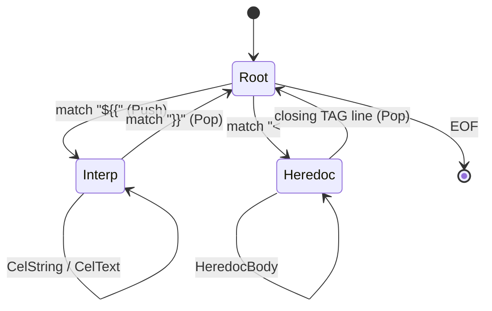

# 21 — FlowDSL Lexer Design

> **Codename:** Conduit · **DSL:** FlowDSL (`*.flow`) · **Module:** `github.com/conduit-io/conduit`
> **Lexer package:** `github.com/conduit-io/conduit/internal/flow/lexer`
> **Parser:** Participle v2 · **Go:** 1.24+
> **Status:** Language Baseline v1.0 · **Owner:** Language & Compiler · **Date:** 2026-07-02

The lexer (scanner) turns raw `.flow` bytes into a **token stream** consumed by the Participle v2 parser
([22 — Parser Design](22-parser-design.md)). It is a **stateful** lexer: the interpolation sublanguage `${{ … }}` and
heredocs require mode transitions. This document specifies the token model, the Participle lexer definition, state
machine, whitespace/position/Unicode policy, error recovery, and performance strategy.

**Related documents**
- [20 — Grammar Specification](20-dsl-grammar.md) — normative token reference ([§8](20-dsl-grammar.md#8-lexical-grammar)).
- [22 — Parser Design](22-parser-design.md) — how tokens feed grammar structs.
- [23 — AST Design](23-ast-design.md) — positions carried from tokens into AST nodes.
- [25 — Expression Engine](25-expression-engine.md) — consumer of raw `CEL_TEXT` captured here.

---

## 1. Token model

### 1.1 Token kinds enum

FlowDSL uses Participle v2's `lexer.Token`, whose `Type` is a `lexer.TokenType` (an `rune`/`int32` handle) mapped to a
symbolic name. We define a stable enum for internal tooling (LSP semantic tokens, syntax highlighting, tests).

```go
// Package lexer defines the FlowDSL token model and the Participle stateful lexer.
package lexer

// Kind is the semantic classification of a FlowDSL token.
// It mirrors the Participle rule names 1:1 and is used by the LSP semantic-token
// encoder and the tree-sitter parity tests.
type Kind uint8

const (
	KindInvalid Kind = iota

	// Trivia (elided before the parser, retained for the formatter/LSP).
	KindWhitespace
	KindLineComment
	KindBlockComment

	// Identifiers & keywords.
	KindIdent
	KindKeyword // resolved from Ident against the keyword set (see keywords.go)

	// Literals.
	KindString    // "..."  (may contain interpolation fragments)
	KindRawString // '...'  (no interpolation)
	KindInt
	KindFloat
	KindBool
	KindNull
	KindDuration // 1h30m, 500ms
	KindVersion  // v1.2.3, 1.0

	// Interpolation machinery.
	KindInterpOpen  // ${{
	KindInterpClose // }}
	KindCelText     // raw CEL source between ${{ and }}  (opaque to FlowDSL)

	// Heredoc machinery.
	KindHeredocStart // <<TAG or <<-TAG
	KindHeredocBody
	KindHeredocEnd

	// Punctuation / structural operators.
	KindLBrace   // {
	KindRBrace   // }
	KindLParen   // (
	KindRParen   // )
	KindLBracket // [
	KindRBracket // ]
	KindColon    // :
	KindComma    // ,
	KindEquals   // =
	KindDot      // .
	KindAt       // @
	KindQuestion // ?

	KindEOF
	KindError // synthetic token emitted by recovery (see §6)
)
```

### 1.2 Token struct & position

Participle's `lexer.Token` already carries a `lexer.Position`. We track **line, column, byte offset**, and derive rune
offset lazily. FlowDSL positions are **1-based line/column, 0-based byte offset**, UTF-8 aware.

```go
import "github.com/alecthomas/participle/v2/lexer"

// Pos is our thin wrapper over lexer.Position that additionally records the
// end offset, enabling range diagnostics without re-scanning.
type Pos struct {
	Filename  string
	Offset    int // byte offset of the token start (0-based)
	EndOffset int // byte offset one past the token end
	Line      int // 1-based
	Column    int // 1-based, counted in runes (not bytes) for editor parity
}

// Span converts to an LSP-style range consumed by the diagnostics model (doc 24 §7).
func (p Pos) Span() (startLine, startCol, endLine, endCol int) { /* ... */ }
```

Column counting uses **runes** to match editor cursor semantics; byte offsets are retained for O(1) slicing and for
mapping CEL diagnostics back into interpolations. See [§7 Unicode](#7-unicode-handling) and
[24 §7 Diagnostics](24-semantic-analysis.md#7-diagnostics-model).

---

## 2. Participle v2 stateful lexer definition

We use `lexer.MustStateful` (regex rules with explicit state transitions) rather than a hand-written scanner, so the
lexer stays declarative and the tree-sitter grammar ([58](58-tree-sitter-grammar.md)) can be kept in lockstep. The
critical states are `Root`, `Interp`, and `Heredoc`.

```go
package lexer

import "github.com/alecthomas/participle/v2/lexer"

// Def is the FlowDSL stateful lexer definition. States:
//   Root    — normal FlowDSL tokens.
//   Interp  — inside ${{ … }}: capture raw CEL until balanced }}.
//   Heredoc — inside a <<TAG body until the closing tag line.
var Def = lexer.MustStateful(lexer.Rules{
	"Root": {
		// --- trivia (elided later, see §4 & doc 22 §8) ---
		{Name: "Whitespace", Pattern: `[ \t\r\n]+`, Action: nil},
		{Name: "LineComment", Pattern: `(#|//)[^\n]*`, Action: nil},
		{Name: "BlockComment", Pattern: `/\*(?s:.*?)\*/`, Action: nil},

		// --- heredoc: push into Heredoc state, capturing the tag ---
		{Name: "HeredocStart", Pattern: `<<-?[A-Z_][A-Z0-9_]*`, Action: lexer.Push("Heredoc")},

		// --- string open: enter an inline scan that recognises ${{ ---
		//   The double-quoted string is scanned by a dedicated rule that yields
		//   String segments and delegates interpolation to Interp.
		{Name: "InterpOpen", Pattern: `\$\{\{`, Action: lexer.Push("Interp")},
		{Name: "String", Pattern: `"(\\.|[^"\\$]|\$(?:\{\{)?)*?"`, Action: nil},
		{Name: "RawString", Pattern: `'[^']*'`, Action: nil},

		// --- literals ---
		{Name: "Duration", Pattern: `\d+(\.\d+)?(ns|us|ms|s|m|h|d)([0-9]+(\.[0-9]+)?(ns|us|ms|s|m|h|d))*`},
		{Name: "Version", Pattern: `v?\d+(\.\d+){1,2}(-[A-Za-z0-9._-]+)?`},
		{Name: "Float", Pattern: `-?\d[\d_]*\.\d[\d_]*([eE][+-]?\d+)?|-?\d[\d_]*[eE][+-]?\d+`},
		{Name: "Int", Pattern: `-?(0x[0-9A-Fa-f]+|0o[0-7]+|0b[01]+|\d[\d_]*)`},

		// --- identifiers/keywords (Unicode-aware; see §7) ---
		{Name: "Ident", Pattern: `[\p{L}_][\p{L}\p{N}_]*`},

		// --- punctuation ---
		{Name: "LBrace", Pattern: `\{`},
		{Name: "RBrace", Pattern: `\}`},
		{Name: "LParen", Pattern: `\(`},
		{Name: "RParen", Pattern: `\)`},
		{Name: "LBracket", Pattern: `\[`},
		{Name: "RBracket", Pattern: `\]`},
		{Name: "Colon", Pattern: `:`},
		{Name: "Comma", Pattern: `,`},
		{Name: "Equals", Pattern: `=`},
		{Name: "At", Pattern: `@`},
		{Name: "Question", Pattern: `\?`},
		{Name: "Dot", Pattern: `\.`},
	},

	// Inside ${{ … }} we capture raw CEL. We must not close on a }} that is
	// inside a CEL string literal, hence explicit string sub-rules.
	"Interp": {
		{Name: "CelString", Pattern: `"(\\.|[^"\\])*"|'(\\.|[^'\\])*'`},
		{Name: "InterpClose", Pattern: `\}\}`, Action: lexer.Pop()},
		{Name: "CelText", Pattern: `(?:[^"'}]|\}(?!\}))+`}, // any run not starting a }} or string
	},

	"Heredoc": {
		// The closing tag is resolved at scan time by a custom elision pass
		// (§3.2) because Participle regex cannot back-reference the captured tag.
		{Name: "HeredocEnd", Pattern: `^\s*[A-Z_][A-Z0-9_]*\s*$`, Action: lexer.Pop()},
		{Name: "HeredocBody", Pattern: `[^\n]*\n`},
	},
})
```

> **Keyword resolution.** Participle regex lexers do not distinguish keywords from identifiers. We keep them all as
> `Ident` at the lexer level and resolve keywords in a thin post-lex pass (`keywords.go`) that rewrites the token type
> when the lexeme is in the reserved set from [20 §10](20-dsl-grammar.md#10-reserved-words). This keeps the regex table
> small and the keyword set data-driven.

```go
// keywords.go
var keywords = map[string]Kind{
	"workflow": KindKeyword, "task": KindKeyword, "step": KindKeyword,
	"module": KindKeyword, "template": KindKeyword, "macro": KindKeyword,
	"param": KindKeyword, "input": KindKeyword, "output": KindKeyword, "var": KindKeyword,
	"env": KindKeyword, "secret": KindKeyword,
	"depends_on": KindKeyword, "when": KindKeyword, "for_each": KindKeyword,
	"matrix": KindKeyword, "as": KindKeyword, "uses": KindKeyword, "run": KindKeyword,
	"with": KindKeyword, "shell": KindKeyword, "retry": KindKeyword, "timeout": KindKeyword,
	"on_error": KindKeyword, "on_success": KindKeyword,
	"import": KindKeyword, "include": KindKeyword, "exposing": KindKeyword,
	"ref": KindKeyword, "flow": KindKeyword,
	"true": KindBool, "false": KindBool, "null": KindNull,
}
```

---

## 3. Interpolation lexer states

### 3.1 State machine



Because `${{` may appear **inside** a double-quoted string, the `String` rule is deliberately written to *not* consume
`${{`; when the scanner hits `${{` mid-string it emits the string segment so far, then `InterpOpen` pushes the `Interp`
state. On `}}` it pops back and continues the surrounding string. The parser reassembles the alternating
`String | InterpOpen CelText InterpClose` fragments into a single `InterpString` AST node
(see [23 §2](23-ast-design.md#2-node-taxonomy)).

### 3.2 Balanced `}}` handling & heredoc tag matching

Two concerns exceed plain regex and are handled by a **post-lex normalization pass** wrapping `Def`:

1. **CEL string balancing.** The `Interp` state's `CelString` rule ensures a `}}` inside a CEL string (e.g.
   `${{ "a}}b" }}`) is consumed as string content, never as `InterpClose`.
2. **Heredoc tag back-reference.** Participle cannot back-reference the opening tag. The wrapper captures the tag from
   `HeredocStart`, then reclassifies `HeredocEnd` candidates: a body line is the terminator only when its trimmed text
   equals the captured tag (respecting the `<<-` indent-stripping variant). Non-matching lines stay `HeredocBody`.

```go
// stateful.go — the wrapper lexer implementing lexer.Definition.
type flowLexer struct{ inner lexer.Definition }

func New() lexer.Definition { return &flowLexer{inner: Def} }

func (l *flowLexer) Lex(fn string, r io.Reader) (lexer.Lexer, error) {
	inner, err := l.inner.Lex(fn, r)
	if err != nil {
		return nil, err
	}
	return &normalizer{inner: inner, symbols: l.inner.Symbols()}, nil
}

// normalizer resolves keywords, matches heredoc tags, and stitches
// interpolation fragments’ positions. It is a lexer.Lexer decorator.
type normalizer struct {
	inner       lexer.Lexer
	symbols     map[string]lexer.TokenType
	heredocTag  string
	stripIndent bool
}

func (n *normalizer) Next() (lexer.Token, error) {
	t, err := n.inner.Next()
	if err != nil {
		return t, err
	}
	switch n.symbols[t.Type] { // reverse lookup name via symbols
	case "Ident":
		if k, ok := keywords[t.Value]; ok && k == KindKeyword {
			t.Type = n.symbols["Keyword"] // reclassify
		}
	case "HeredocStart":
		n.heredocTag, n.stripIndent = parseHeredocTag(t.Value)
	case "HeredocBody":
		if n.isClosingTag(t.Value) {
			t.Type = n.symbols["HeredocEnd"]
		}
	}
	return t, nil
}
```

The raw `CelText` token(s) are handed **verbatim** (with byte offsets preserved) to the Expression Engine, which
compiles them via CEL-Go — see [25 §5 Compilation & caching](25-expression-engine.md#5-compilation--caching).

---

## 4. Indentation & whitespace policy

FlowDSL is **whitespace-insensitive and brace-delimited** (unlike YAML/Python). Rules:

- Whitespace and comments are **trivia**: matched by the lexer but **elided** before reaching the parser (Participle
  `elide` — see [22 §8 Elision](22-parser-design.md#8-elision--trivia)).
- Statement separators (`\n`, `,`) are **optional**; block structure comes from `{ … }`. This removes newline
  significance entirely and simplifies error recovery.
- Inside **strings** and **heredoc bodies**, whitespace is significant and preserved byte-for-byte.
- `<<-TAG` heredocs strip the **common leading indentation** of the closing tag line from every body line (Makefile/Ruby
  style), computed in the normalizer, not the lexer regex.
- Trivia tokens are retained in a side-channel for the formatter (`conduit fmt`) and LSP semantic tokens, so comments
  survive a round-trip (see [23 §6 Pretty-printer](23-ast-design.md#6-pretty-printer--formatter)).

---

## 5. Position tracking

Participle populates `lexer.Position{Filename, Offset, Line, Column}` for every token. We augment it:

- **Offset** — byte offset (0-based). Used for O(1) source slicing and CEL sub-span mapping.
- **EndOffset** — computed as `Offset + len(Value)`; carried in our `Pos` (see §1.2).
- **Line/Column** — 1-based; **Column is rune-counted** (Participle counts runes by default, matching LSP UTF-16?—see
  §7 note on encoding negotiation).
- **CEL sub-positions** — for a `CelText` token starting at byte `B`, a CEL diagnostic at CEL-offset `c` maps to source
  offset `B + c`, then to line/col via a cached newline index. This is how CEL type errors point at the right column
  inside `${{ … }}`.

```go
// newlineIndex enables O(log n) offset→(line,col) after a single O(n) scan,
// shared across the file for both FlowDSL and mapped-back CEL diagnostics.
type newlineIndex struct{ offsets []int }

func (x *newlineIndex) LineCol(byteOffset int) (line, col int) { /* binary search */ }
```

---

## 6. Error tokens & recovery

The lexer favors **never failing hard**; malformed input becomes a `KindError` token so the parser can resynchronize
(critical for the LSP, see [22 §7](22-parser-design.md#7-error-tolerant-parsing-for-the-lsp)).

Recovery cases:

| Situation | Behavior | Diagnostic |
|---|---|---|
| Unterminated `"string`  | Emit `KindError` spanning to EOL; resume at newline | `FLOW-E0101` |
| Unterminated `${{` | Emit `KindError` to EOF or next `}}`; close synthetically | `FLOW-E0102` |
| Unterminated heredoc | Emit `KindError`; treat EOF as terminator | `FLOW-E0103` |
| Stray character (e.g. `;`) | Emit `KindError`(1 rune); continue | `FLOW-E0104` |
| Invalid number (`0xZ`) | Emit `KindError`; continue | `FLOW-E0105` |

```go
// The normalizer never returns a Go error for lexical faults in tolerant mode;
// instead it yields an Error token and records a Diagnostic on the sink.
func (n *normalizer) emitError(t lexer.Token, code string, msg string) lexer.Token {
	n.diags.Add(diag.New(code, diag.Error, spanOf(t), msg)) // diag pkg: doc 24 §7
	t.Type = n.symbols["Error"]
	return t
}
```

In **strict mode** (batch `conduit run`) the first lexical error aborts; in **tolerant mode** (LSP, `conduit fmt`,
`conduit lint`) scanning continues so the maximum useful parse is produced.

---

## 7. Unicode handling

- **Encoding:** source MUST be UTF-8 (BOM tolerated and stripped). Invalid UTF-8 yields `FLOW-E0106` at the bad byte.
- **Identifiers:** `[\p{L}_][\p{L}\p{N}_]*` — full Unicode letters/digits allowed; identifiers are compared under
  **NFC normalization** to avoid look-alike duplicates (performed in the keyword/symbol pass, not the regex).
- **Column encoding:** internally rune-based. The LSP layer negotiates `positionEncoding` (`utf-16` default, `utf-8`
  preferred when the client supports it) and converts on the boundary; the lexer stays rune/byte-native.
- **Confusables:** an optional lint (`FLOW-W0107`) flags identifiers mixing scripts (e.g. Cyrillic `а` vs Latin `a`).
- **Normalization of string content** is *not* performed — string/heredoc bytes are preserved exactly for faithful
  shell execution.

---

## 8. Performance — near-zero-alloc scanning

The lexer sits on the hot path for the LSP (re-lexed on many keystrokes) and for large repos. Strategy:

1. **Slice, don't copy.** Token `Value`s reference sub-slices of the mmap'd/one-shot-read source buffer where possible;
   the normalizer avoids allocating new strings except when reclassifying keywords (interned).
2. **Keyword interning.** The keyword map returns pre-interned strings; identifiers that are keywords share one backing
   string, eliminating per-token allocation for the ~30 keywords that dominate real files.
3. **Reusable buffers.** The normalizer holds a `sync.Pool` of `[]lexer.Token` scratch slices for the interpolation
   fragment stitching, reset per file.
4. **Single newline scan.** The `newlineIndex` is built once per file and reused for all position conversions and CEL
   sub-mapping, rather than re-counting per diagnostic.
5. **Incremental re-lex (LSP).** On edit, only the changed line range plus any open string/heredoc/interp state is
   re-lexed; state at line boundaries is cached so unaffected regions are not re-scanned. Ties into the resilient
   parser in [22 §6](22-parser-design.md#6-incremental--resilient-parsing).
6. **Compiled regex table** is built once (`MustStateful` at package init), amortized across all files.

Target: **> 20 MB/s** single-threaded on typical `.flow` sources, with **< 1 alloc/token** average in steady state.

---

## 9. Token stream examples

### 9.1 Simple

Source:
```flow
task build { run "go build" }
```

Token stream (trivia elided):
```
Keyword("task")  Ident("build")  LBrace("{")
Keyword("run")   String("\"go build\"")
RBrace("}")      EOF
```

### 9.2 Interpolated string

Source:
```flow
env { IMG = "app:${{ inputs.version }}" }
```

Token stream:
```
Keyword("env") LBrace("{")
Ident("IMG") Equals("=")
String("\"app:")            # leading string segment (open quote retained by parser)
InterpOpen("${{")
CelText(" inputs.version ")
InterpClose("}}")
String("\"")                # trailing string segment (close quote)
RBrace("}") EOF
```

The parser merges the `String … InterpOpen CelText InterpClose … String` run into one `InterpString` node with parts
`["app:", <CEL inputs.version>]`.

### 9.3 Heredoc with `<<-` and interpolation

Source:
```flow
run <<-SH
  echo "${{ env.NAME }}"
SH
```

Token stream:
```
Keyword("run")
HeredocStart("<<-SH")
HeredocBody("  echo \"")         # up to the interpolation
InterpOpen("${{") CelText(" env.NAME ") InterpClose("}}")
HeredocBody("\"\n")
HeredocEnd("SH")                 # reclassified from HeredocBody by the normalizer
EOF
```

---

## 10. Cross-references

- Token → grammar consumption, elision, error-tolerant parse → [22 — Parser Design](22-parser-design.md)
- Where positions land in the tree → [23 — AST Design](23-ast-design.md)
- Diagnostics model (codes, severity, ranges) → [24 §7](24-semantic-analysis.md#7-diagnostics-model)
- Raw `CelText` compilation → [25 — Expression Engine](25-expression-engine.md)
- Normative token catalog → [20 §8 Lexical grammar](20-dsl-grammar.md#8-lexical-grammar)
- Editor parity → [58 — Tree-sitter Grammar](58-tree-sitter-grammar.md), [56 — LSP Architecture](56-lsp-architecture.md)
