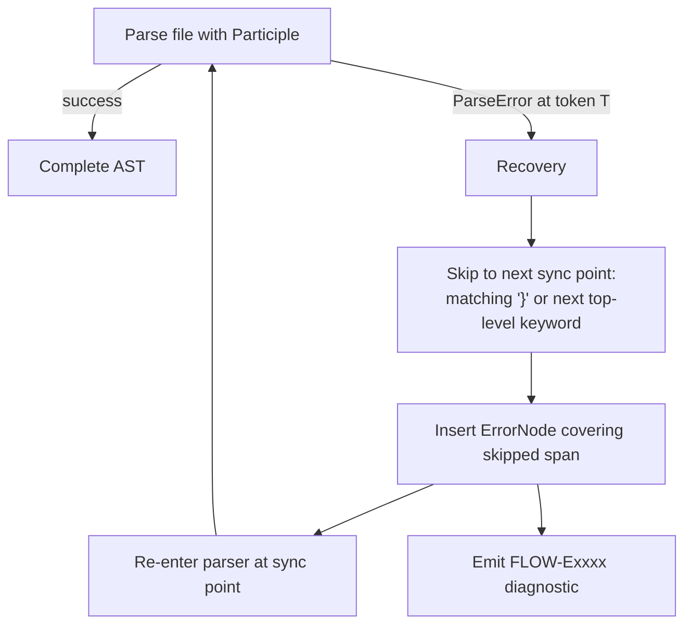

# 22 — FlowDSL Parser Design (Participle v2)

> **Codename:** Conduit · **DSL:** FlowDSL (`*.flow`) · **Module:** `github.com/conduit-io/conduit`
> **Parser package:** `github.com/conduit-io/conduit/internal/flow/parser`
> **Parser:** Participle v2 · **Go:** 1.24+
> **Status:** Language Baseline v1.0 · **Owner:** Language & Compiler · **Date:** 2026-07-02

This document specifies the FlowDSL parser: the Participle v2 **grammar structs** (with real struct tags), the
mapping from grammar to **AST**, **error handling & recovery** for partial/LSP parsing, **incremental/resilient**
strategy, **lookahead** and **ambiguity resolution**, position propagation, **custom capture/union types**, and
**elision** of trivia.

**Related documents**
- [20 — Grammar Specification](20-dsl-grammar.md) — the EBNF these structs implement.
- [21 — Lexer Design](21-lexer-design.md) — token stream feeding the parser.
- [23 — AST Design](23-ast-design.md) — the node types produced here (visitor, formatter).
- [24 — Semantic Analysis](24-semantic-analysis.md) — consumes the AST; shares the diagnostics model.

---

## 1. Why Participle v2

Participle v2 builds a recursive-descent parser directly from **annotated Go structs**, so the grammar *is* the AST
skeleton. Benefits for FlowDSL:

- Grammar and AST cannot drift — one source of truth.
- Built-in **positions** (`Pos lexer.Position`), **elision**, **union types**, and **custom capture** cover our needs.
- Deterministic recursive descent matches our LL/PEG design ([20 §1](20-dsl-grammar.md#1-design-goals--language-model)).

The trade-off — Participle is not natively error-recovering — is handled by our **resilient wrapper**
([§6](#6-incremental--resilient-parsing)/[§7](#7-error-tolerant-parsing-for-the-lsp)).

---

## 2. Parser construction

```go
package parser

import (
	"github.com/alecthomas/participle/v2"
	"github.com/conduit-io/conduit/internal/flow/ast"
	"github.com/conduit-io/conduit/internal/flow/lexer"
)

// build is done once; the parser is stateless & goroutine-safe for reuse.
var flowParser = participle.MustBuild[ast.File](
	participle.Lexer(lexer.New()),                 // stateful lexer from doc 21
	participle.Elide("Whitespace", "LineComment", "BlockComment"), // trivia (see §8)
	participle.Unquote("RawString"),               // strip single quotes on raw strings
	participle.UseLookahead(participle.MaxLookahead), // adaptive lookahead (see §5)
	participle.Union[ast.TopLevel](                // top-level decl union (see §4.2)
		&ast.WorkflowDecl{}, &ast.TemplateDecl{}, &ast.MacroDecl{},
		&ast.ModuleDecl{}, &ast.ParamDecl{}, &ast.InputDecl{},
		&ast.OutputDecl{}, &ast.EnvDecl{}, &ast.SecretDecl{},
	),
	participle.Union[ast.Stmt](                    // statement union inside blocks
		&ast.TaskDecl{}, &ast.StepDecl{}, &ast.UsesDecl{}, &ast.RunDecl{},
		&ast.DependsOnDecl{}, &ast.WhenDecl{}, &ast.ForEachDecl{}, &ast.MatrixDecl{},
		&ast.RetryDecl{}, &ast.TimeoutDecl{}, &ast.OnErrorDecl{}, &ast.OnSuccessDecl{},
		&ast.ParamDecl{}, &ast.InputDecl{}, &ast.OutputDecl{}, &ast.VarDecl{},
		&ast.EnvDecl{}, &ast.SecretDecl{}, &ast.MetaAssign{},
	),
)

// Parse (strict) — used by `conduit run`; returns on first hard error.
func Parse(filename string, src []byte) (*ast.File, error) {
	return flowParser.ParseBytes(filename, src)
}
```

---

## 3. Grammar structs (Participle tags)

The following mirror [20 §4–§7](20-dsl-grammar.md#4-compilation-unit-file). Positions are captured via the embedded
`Pos lexer.Position` and `EndPos lexer.Position` fields (Participle fills these automatically).

```go
package ast

import "github.com/alecthomas/participle/v2/lexer"

// File is the parse root (see grammar §4).
type File struct {
	Pos    lexer.Position
	EndPos lexer.Position

	Version *string     `parser:"( 'flow' @String )?"`              // §11 grammar version
	Imports []*Import   `parser:"( @@"`                             // import/include
	Includes []*Include `parser:"| @@ )*"`
	Decls   []TopLevel  `parser:"@@*"`                              // union, see §4.2
}

type WorkflowDecl struct {
	Pos    lexer.Position
	EndPos lexer.Position
	Name   *string `parser:"'workflow' @Ident?"`
	Body   []Stmt  `parser:"'{' @@* '}'"`
}

type TaskDecl struct {
	Pos    lexer.Position
	EndPos lexer.Position
	Name   string `parser:"'task' @Ident"`
	Body   []Stmt `parser:"'{' @@* '}'"`
}

type StepDecl struct {
	Pos    lexer.Position
	EndPos lexer.Position
	Name   *string `parser:"'step' @Ident?"`
	Body   []Stmt  `parser:"'{' @@* '}'"`
}

type UsesDecl struct {
	Pos      lexer.Position
	EndPos   lexer.Position
	Template bool      `parser:"'uses' @'template'?"`
	Ref      ActionRef `parser:"@@"`
	With     []*Arg    `parser:"( 'with' '{' @@* '}' )?"`
}

type RunDecl struct {
	Pos    lexer.Position
	EndPos lexer.Position
	Script StringOrHeredoc `parser:"'run' @@"`
	Shell  *string         `parser:"( 'shell' @String )?"`
}

type DependsOnDecl struct {
	Pos  lexer.Position
	On   []string `parser:"'depends_on' ( @Ident | '(' @Ident ( ',' @Ident )* ')' )"`
}

type WhenDecl struct {
	Pos  lexer.Position
	Cond EmbeddedExpr `parser:"'when' @@"` // CEL guard, see §4.3
}

type ForEachDecl struct {
	Pos     lexer.Position
	Iter    EmbeddedExpr `parser:"'for_each' @@"`
	ValVar  *string      `parser:"( 'as' @Ident"`
	KeyVar  *string      `parser:"( ',' @Ident )? )?"`
	Body    []Stmt       `parser:"( '{' @@* '}' )?"`
}

type RetryDecl struct {
	Pos   lexer.Position
	Count *int    `parser:"'retry' ( @Int"`
	Block []*Arg  `parser:"| '{' @@* '}' )"`
}

type ParamDecl struct {
	Pos     lexer.Position
	EndPos  lexer.Position
	Name    string   `parser:"'param' @Ident"`
	Type    *TypeRef `parser:"( ':' @@ )?"`
	Default *Expr    `parser:"( '=' @@ )?"`
	Meta    []*Arg   `parser:"( '{' @@* '}' )?"`
}

type MetaAssign struct {
	Pos   lexer.Position
	Key   string `parser:"@Ident"`
	Value Value  `parser:"'=' @@"`
}
```

> **Note on keyword literals.** Because the lexer reclassifies reserved words to a single `Keyword` token
> ([21 §2](21-lexer-design.md#2-participle-v2-stateful-lexer-definition)), grammar tags reference them by their literal
> value (`'task'`, `'when'`, …). Participle matches a literal against the token *value*, which is exactly the keyword
> text — so `'task'` matches only the keyword `task`, never an identifier named `task2`.

---

## 4. Grammar → AST mapping

### 4.1 One struct per production

Each EBNF production in [20](20-dsl-grammar.md) maps to exactly one Go struct or union interface. Repetition (`@@*`)
yields slices; optionality (`?`) yields pointers or `*T`. This gives a faithful concrete-syntax-shaped AST that
[23 — AST Design](23-ast-design.md) refines/lowers.

### 4.2 Union types (sum types)

FlowDSL has several "one-of" positions (top-level decl, block statement, value). Participle `Union[T]` models these as
a Go interface implemented by each variant:

```go
// TopLevel is the sum type for File.Decls.
type TopLevel interface{ topLevel() }

func (*WorkflowDecl) topLevel() {}
func (*TemplateDecl) topLevel() {}
func (*MacroDecl) topLevel()    {}
// … etc.

// Stmt is the sum type for block bodies (task/step/workflow statements).
type Stmt interface{ stmt() }

func (*TaskDecl) stmt()      {}
func (*StepDecl) stmt()      {}
func (*UsesDecl) stmt()      {}
func (*RunDecl) stmt()       {}
func (*WhenDecl) stmt()      {}
func (*MetaAssign) stmt()    {}
// … etc.
```

Union member **order matters** (PEG-ordered alternation). Members are listed leading-token-disjoint so the first-match
rule is unambiguous — see [§5](#5-lookahead--ambiguity-resolution).

Context validity (e.g. `uses` only inside a `step`) is **not** enforced by the grammar (all `Stmt`s parse anywhere); it
is validated in **semantic analysis** ([24 §4](24-semantic-analysis.md#4-structural--dependency-validation)) so that a
misplaced statement still parses and yields a precise diagnostic rather than a generic syntax error — better for the LSP.

### 4.3 Custom capture types (CEL & interpolation)

`EmbeddedExpr`, `StringOrHeredoc`, and `InterpString` need custom parsing of the raw `CelText`/segment tokens. Participle
supports this via the `participle.Capture` interface:

```go
// EmbeddedExpr holds the raw CEL source and (post-parse) the compiled program.
// It implements participle.Capture to grab either a wrapped ${{ … }} or a bare CEL run.
type EmbeddedExpr struct {
	Pos    lexer.Position
	Source string       // raw CEL text, byte-offset preserved (for CEL diagnostics)
	Prog   *CompiledCel // filled by the Expression Engine during sema (doc 25 §5)
}

func (e *EmbeddedExpr) Capture(tokens []lexer.Token) error {
	// Concatenate CelText tokens (dropping InterpOpen/Close), remembering the
	// start position so CEL error offsets map back to source (doc 21 §5).
	e.Pos = tokens[0].Pos
	for _, t := range tokens {
		switch t.Type {
		case tokInterpOpen, tokInterpClose:
			continue
		default:
			e.Source += t.Value
		}
	}
	return nil
}

// InterpString reassembles the String/Interp fragment run (doc 21 §3.1) into
// ordered parts: literal chunks and embedded CEL expressions.
type InterpString struct {
	Pos   lexer.Position
	Parts []InterpPart // Literal string | EmbeddedExpr, in source order
}

func (s *InterpString) Capture(tokens []lexer.Token) error { /* stitch parts */ }
```

`StringOrHeredoc` is a small union capturing either a `String`/`InterpString` or a heredoc body (with its `<<-` indent
policy applied).

---

## 5. Lookahead & ambiguity resolution

- **Adaptive lookahead.** We build with `participle.UseLookahead(participle.MaxLookahead)`; Participle back-tracks as
  needed. In practice FlowDSL is **LL(1)** for block dispatch because every statement/decl starts with a distinct
  keyword ([20 §6–§7](20-dsl-grammar.md#6-workflow-task-step)).
- **Disjoint union heads.** Union member ordering is chosen so leading tokens do not overlap. The one overlap —
  `uses` vs `uses template` — is resolved by putting the more specific `@'template'?` inside a single `UsesDecl` rather
  than two union members.
- **`param`/`input`/`output`/`var` vs `MetaAssign`.** These are disjoint: the former start with reserved keywords, the
  latter starts with a bare `Ident` followed by `=`. No backtracking required.
- **Bare vs wrapped CEL.** In expression-typed fields (`when`, `for_each`, defaults), the grammar accepts either
  `${{ … }}` or a bare CEL run; the `EmbeddedExpr.Capture` handles both, so the parser does not branch.
- **Value ambiguity** (`ListLit` `[` vs `MapLit` `{`) is resolved by the distinct opening bracket.

No production is left-recursive; no unbounded lookahead is required for the well-formed language.

---

## 6. Incremental & resilient parsing

The LSP re-parses on nearly every keystroke, so the parser must be **fast** and **never lose the whole tree** on a
local error.

### 6.1 Block-boundary resynchronization

FlowDSL's `{ … }` framing gives natural recovery points. Our **resilient parser** wraps Participle:



```go
// ParseResilient never returns nil; it returns the best-effort AST plus diagnostics.
// Used by the LSP, `conduit fmt`, and `conduit lint`.
func ParseResilient(filename string, src []byte, sink *diag.Sink) *ast.File {
	toks := lexer.LexAll(filename, src, sink) // tolerant lexer, doc 21 §6
	p := &resilient{toks: toks, sink: sink}
	return p.parseFile() // hand-driven outer loop that calls Participle per block
}
```

The outer loop parses **top-level declarations one at a time**. If Participle errors within one declaration, we:
1. record the diagnostic with the error token's range,
2. skip tokens to the next **synchronization token** (a balanced `}` at depth 0, or the next top-level head keyword),
3. splice an `ast.ErrorNode` (a `TopLevel`/`Stmt` implementer, see [23 §2](23-ast-design.md#2-node-taxonomy)) holding
   the skipped span, and
4. continue — so a broken `task` never discards a valid sibling `workflow`.

### 6.2 Incremental reuse

Combined with the incremental lexer ([21 §8](21-lexer-design.md#8-performance--near-zero-alloc-scanning)), unchanged
top-level declarations whose token ranges are untouched by an edit are **reused** from the prior AST (identity-preserved
subtrees), so typing inside one `step` re-parses only that declaration.

---

## 7. Error-tolerant parsing for the LSP

Requirements from [56 — LSP Architecture](56-lsp-architecture.md):

| Capability | Mechanism |
|---|---|
| **Always produce an AST** | `ParseResilient` inserts `ErrorNode`s; never returns nil. |
| **Precise ranges** | Every node carries `Pos`/`EndPos`; `ErrorNode` spans exactly the skipped tokens. |
| **Partial completion** | Completion works off the nearest well-formed enclosing node, even if a sibling is broken. |
| **"Expected X" hints** | Participle's `Expected` set is captured and mapped to `FLOW-Exxxx` codes with quickfixes. |
| **No cascading errors** | After one error per block we resync, suppressing follow-on noise. |
| **Missing-token insertion** | Common recoveries (missing `}`, missing `=`) synthesize the token and mark the node `Recovered=true` so downstream passes can soften severity. |

```go
type ErrorNode struct {
	Pos     lexer.Position
	EndPos  lexer.Position
	Skipped []lexer.Token // raw tokens consumed during recovery (for fmt round-trip)
	Diag    diag.Diagnostic
}
func (*ErrorNode) topLevel() {}
func (*ErrorNode) stmt()     {}
```

Diagnostics share the model in [24 §7](24-semantic-analysis.md#7-diagnostics-model): `{Code, Severity, Range, Message,
Quickfix}`. Syntax errors use the `FLOW-E01xx`/`FLOW-E02xx` ranges.

---

## 8. Elision & trivia

- Trivia tokens (`Whitespace`, `LineComment`, `BlockComment`) are **elided** in the parser build so grammar structs stay
  clean (`participle.Elide(...)`, see [§2](#2-parser-construction)).
- The **tolerant lexer** still records trivia in a side-channel keyed by byte offset so the formatter can reattach
  comments (leading/trailing) to the nearest node — see [23 §6 Pretty-printer](23-ast-design.md#6-pretty-printer--formatter).
- Statement separators (`\n`, `,`) are pure whitespace/trivia and carry no grammatical weight
  ([21 §4](21-lexer-design.md#4-indentation--whitespace-policy)).

---

## 9. Positions

Every AST struct embeds:

```go
Pos    lexer.Position // start of the node (first token)
EndPos lexer.Position // end (one past last token) — Participle fills when a field named EndPos exists
```

The AST layer exposes these via a `Node` interface (`Span() Range`) — see
[23 §3 Node positions](23-ast-design.md#3-node-positions--immutability). Positions flow unchanged from the lexer
([21 §5](21-lexer-design.md#5-position-tracking)); CEL sub-positions inside `EmbeddedExpr` are recovered by adding the
CEL-local offset to `EmbeddedExpr.Pos.Offset`.

---

## 10. Testing strategy (parser)

- **Golden AST tests** — `testdata/*.flow` ↔ `*.ast.json` snapshots.
- **Fuzzing** — `go test -fuzz` on `ParseResilient`; invariant: never panics, always returns non-nil, positions
  monotonic.
- **Round-trip** — `fmt(parse(src))` is idempotent for well-formed input (see [23 §6](23-ast-design.md#6-pretty-printer--formatter)).
- **Recovery corpus** — deliberately broken files assert exact `ErrorNode` spans and diagnostic codes.

See [72 — Testing Strategy](72-testing-strategy.md) for the platform-wide approach.

---

## 11. Cross-references

- Grammar (EBNF) → [20 — DSL Grammar](20-dsl-grammar.md)
- Token stream & lexer states → [21 — Lexer Design](21-lexer-design.md)
- AST node taxonomy, visitor, formatter → [23 — AST Design](23-ast-design.md)
- Semantic passes & diagnostics model → [24 — Semantic Analysis](24-semantic-analysis.md)
- CEL compilation of captured expressions → [25 — Expression Engine](25-expression-engine.md)
- LSP integration → [56 — LSP Architecture](56-lsp-architecture.md)
