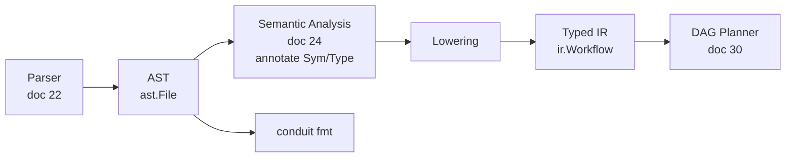
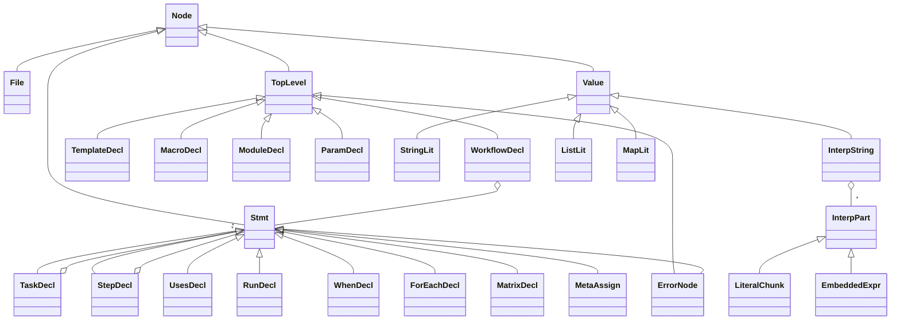

# 23 — FlowDSL AST Design

> **Codename:** Conduit · **DSL:** FlowDSL (`*.flow`) · **Module:** `github.com/conduit-io/conduit`
> **AST package:** `github.com/conduit-io/conduit/internal/flow/ast`
> **IR package:** `github.com/conduit-io/conduit/internal/flow/ir`
> **Status:** Language Baseline v1.0 · **Owner:** Language & Compiler · **Date:** 2026-07-02

This document defines the FlowDSL **Abstract Syntax Tree**: the full node taxonomy (Go type hierarchy), the
**visitor/walker** pattern, **node positions**, **immutability**, **AST → typed IR lowering**, the
**pretty-printer/formatter** (`conduit fmt`), and **source mapping** for diagnostics.

**Related documents**
- [20 — Grammar Specification](20-dsl-grammar.md) — EBNF the nodes correspond to.
- [21 — Lexer Design](21-lexer-design.md) — positions & trivia origins.
- [22 — Parser Design](22-parser-design.md) — how the AST is produced (Participle structs, unions, ErrorNode).
- [24 — Semantic Analysis](24-semantic-analysis.md) — consumes AST; annotates symbols/types.
- [25 — Expression Engine](25-expression-engine.md) — compiles `EmbeddedExpr` nodes.

---

## 1. Layers: concrete AST → typed IR

FlowDSL uses **two** trees:

| Layer | Package | Shape | Purpose |
|---|---|---|---|
| **AST** | `internal/flow/ast` | Concrete-syntax-shaped (mirrors grammar) | Parsing, formatting, LSP, diagnostics. Preserves source fidelity (comments via trivia). |
| **IR** | `internal/flow/ir` | Semantic, normalized, typed | Feeds the DAG planner. Templates/macros expanded, defaults applied, types resolved, `depends_on` linked. |

`conduit fmt`, the LSP, and syntax features work on the **AST**. `conduit run`/planning work on the **IR** produced by
lowering ([§5](#5-ast--typed-ir-lowering)).



---

## 2. Node taxonomy

All AST nodes implement the `Node` interface. The hierarchy groups into **declarations**, **statements**, **expressions
/values**, **types**, and **support** nodes.

```go
package ast

import "github.com/alecthomas/participle/v2/lexer"

// Node is the common interface for every AST node.
type Node interface {
	Span() Range           // source range (see §3)
	nodeType() nodeKind    // fast discriminant for the walker
}

// Range is a source span (byte + line/col), the currency of diagnostics (doc 24 §7).
type Range struct {
	Start Position
	End   Position
}
type Position struct {
	Filename string
	Offset   int // 0-based byte
	Line     int // 1-based
	Column   int // 1-based, rune-counted (doc 21 §7)
}
```

### 2.1 Root & linkage

```go
type File struct {
	Pos, EndPos     lexer.Position
	GrammarVersion  string        // from `flow "1.0"` directive (doc 20 §11); default filled by parser
	Imports         []*Import
	Includes        []*Include
	Decls           []TopLevel    // union (doc 22 §4.2)
	Trivia          *TriviaIndex  // comments/whitespace side-channel (for fmt, §6)
}

type Import struct {
	Pos, EndPos lexer.Position
	Path        string
	Alias       *string   // `as`
	Exposing    []string  // `exposing (...)`
}

type Include struct {
	Pos, EndPos lexer.Position
	Path        string
	With        []*Arg
}

type ModuleDecl struct {
	Pos, EndPos lexer.Position
	Name        string
	Decls       []TopLevel
}
```

### 2.2 Declarations (`TopLevel` / data)

```go
type WorkflowDecl struct { Pos, EndPos lexer.Position; Name *string; Body []Stmt }
type TemplateDecl struct { Pos, EndPos lexer.Position; Name string; Params []*SigParam; Body []Stmt }
type MacroDecl    struct { Pos, EndPos lexer.Position; Name string; Params []*SigParam; Body []Stmt }

type ParamDecl  struct { Pos, EndPos lexer.Position; Name string; Type *TypeRef; Default *Expr; Meta []*Arg
                         // Annotated by sema:
                         Sym *Symbol; ResolvedType Type }
type InputDecl  struct { Pos, EndPos lexer.Position; Name string; Type *TypeRef; Default *Expr; Meta []*Arg; Sym *Symbol }
type OutputDecl struct { Pos, EndPos lexer.Position; Name string; Type *TypeRef; Value Expr; Sym *Symbol }
type VarDecl    struct { Pos, EndPos lexer.Position; Name string; Type *TypeRef; Value Expr; Sym *Symbol }

type EnvDecl    struct { Pos, EndPos lexer.Position; Bindings []*Binding }
type SecretDecl struct { Pos, EndPos lexer.Position; Bindings []*Binding }
```

### 2.3 Statements (`Stmt`)

```go
type TaskDecl struct {
	Pos, EndPos lexer.Position
	Name        string
	Body        []Stmt
	Sym         *Symbol // sema
}
type StepDecl struct { Pos, EndPos lexer.Position; Name *string; Body []Stmt; Sym *Symbol }

type UsesDecl      struct { Pos, EndPos lexer.Position; Template bool; Ref ActionRef; With []*Arg }
type RunDecl       struct { Pos, EndPos lexer.Position; Script StringOrHeredoc; Shell *string }
type DependsOnDecl struct { Pos, EndPos lexer.Position; On []string; Resolved []*Symbol /* sema */ }
type WhenDecl      struct { Pos, EndPos lexer.Position; Cond EmbeddedExpr }
type ForEachDecl   struct { Pos, EndPos lexer.Position; Iter EmbeddedExpr; ValVar *string; KeyVar *string; Body []Stmt }
type MatrixDecl    struct { Pos, EndPos lexer.Position; Axes []*MatrixAxis }
type MatrixAxis    struct { Pos lexer.Position; Name string; Values EmbeddedExpr }
type RetryDecl     struct { Pos, EndPos lexer.Position; Count *int; Args []*Arg }
type TimeoutDecl   struct { Pos, EndPos lexer.Position; Value Value }
type OnErrorDecl   struct { Pos, EndPos lexer.Position; Body []Stmt }
type OnSuccessDecl struct { Pos, EndPos lexer.Position; Body []Stmt }
type MetaAssign    struct { Pos lexer.Position; Key string; Value Value }

// Recovery placeholder produced by the resilient parser (doc 22 §7).
type ErrorNode struct { Pos, EndPos lexer.Position; Skipped []lexer.Token; Diag DiagRef }
```

### 2.4 Expressions, values & interpolation

```go
// EmbeddedExpr wraps raw CEL source and, after sema, its compiled program.
type EmbeddedExpr struct {
	Pos    lexer.Position
	Source string        // raw CEL, byte-offset preserved (doc 22 §4.3)
	Prog   *CompiledCel  // filled by Expression Engine (doc 25 §5); nil until sema
	Type   Type          // CEL-inferred type mapped to FlowDSL type (doc 25 §3)
}

type Expr = EmbeddedExpr // FlowDSL expressions are CEL

// InterpString: ordered literal + embedded-expr parts (doc 21 §3.1, doc 22 §4.3).
type InterpString struct { Pos lexer.Position; Parts []InterpPart }
type InterpPart interface{ interpPart() }
type LiteralChunk struct { Pos lexer.Position; Text string }
func (*LiteralChunk) interpPart() {}
func (*EmbeddedExpr) interpPart() {}

// Value union: literal | interpolated string | list | map | expr.
type Value interface{ value() }
type StringLit struct { Pos lexer.Position; Value string }
type RawStringLit struct { Pos lexer.Position; Value string }
type IntLit    struct { Pos lexer.Position; Value int64 }
type FloatLit  struct { Pos lexer.Position; Value float64 }
type BoolLit   struct { Pos lexer.Position; Value bool }
type NullLit   struct { Pos lexer.Position }
type DurationLit struct { Pos lexer.Position; Value time.Duration }
type ListLit   struct { Pos, EndPos lexer.Position; Elems []Value }
type MapLit    struct { Pos, EndPos lexer.Position; Entries []*MapEntry }
type MapEntry  struct { Pos lexer.Position; Key string; Value Value }

type StringOrHeredoc struct { Pos lexer.Position; Interp *InterpString; Heredoc *Heredoc }
type Heredoc struct { Pos, EndPos lexer.Position; Tag string; StripIndent bool; Parts []InterpPart }
```

### 2.5 Types & support

```go
type TypeRef struct {
	Pos      lexer.Position
	Scalar   *string   // string|int|float|bool|duration|timestamp|any|null
	List     *TypeRef  // list<T>
	MapKey   *string   // map<K,V> key scalar
	MapVal   *TypeRef  // map<K,V> value
	Object   []*FieldType
	Named    *string   // user/imported type
}
type FieldType struct { Pos lexer.Position; Name string; Type *TypeRef; Optional bool }

type SigParam  struct { Pos lexer.Position; Name string; Type *TypeRef; Default *Expr }
type Arg       struct { Pos lexer.Position; Name string; Value Value }
type Binding   struct { Pos lexer.Position; Name string; Value Value }
type ActionRef struct { Pos lexer.Position; Str *string; Path []string; Version *string }
```

### 2.6 Taxonomy diagram



---

## 3. Node positions & immutability

- **Positions:** every node exposes `Span() Range`. `Pos`/`EndPos` come from Participle
  ([22 §9](22-parser-design.md#9-positions)); `Range` unifies them into the diagnostics currency.

```go
func (t *TaskDecl) Span() Range { return rangeOf(t.Pos, t.EndPos) }
```

- **Immutability:** the AST is treated as **immutable after parse**. Semantic annotations (`Sym`, `ResolvedType`,
  `Prog`) are written into dedicated *annotation fields* during sema, but structural fields (names, bodies, positions)
  are never mutated. This makes incremental reuse ([22 §6](22-parser-design.md#6-incremental--resilient-parsing)) sound
  and lets the LSP share subtrees across edits without defensive copies.
  - Annotations that would compromise reuse (anything derived from *other* files) are stored in a **side table** keyed
    by node identity rather than on the node, so a reused subtree carries no stale cross-file state.

---

## 4. Visitor / walker pattern

Two traversal facilities: a **Visitor** (double-dispatch, typed) and a lightweight **Walk** (callback).

```go
// Visitor is implemented by consumers that care about specific node types.
// Returning false from a Visit method prunes that subtree.
type Visitor interface {
	VisitFile(*File) bool
	VisitWorkflow(*WorkflowDecl) bool
	VisitTask(*TaskDecl) bool
	VisitStep(*StepDecl) bool
	VisitUses(*UsesDecl) bool
	VisitRun(*RunDecl) bool
	VisitWhen(*WhenDecl) bool
	VisitForEach(*ForEachDecl) bool
	VisitEmbeddedExpr(*EmbeddedExpr) bool
	VisitParam(*ParamDecl) bool
	// … one per concrete node; a BaseVisitor{return true} embeds for partial impls.
}

// Accept dispatches n to v and recurses into children unless pruned.
func Accept(n Node, v Visitor) { /* type switch → v.VisitX → recurse */ }

// Walk is the callback form for simple passes (linters, symbol collection).
// enter is called pre-order; if it returns false the subtree is skipped.
func Walk(n Node, enter func(Node) bool) { /* generic child iteration */ }

// Children returns direct child nodes; the single point of truth for traversal.
func Children(n Node) []Node
```

Every semantic pass ([24 §2](24-semantic-analysis.md#2-pass-pipeline)) and the formatter is expressed as a Visitor or a
`Walk`, so adding a node type requires updating exactly one `Children` switch.

---

## 5. AST → typed IR lowering

After semantic analysis succeeds, the AST is **lowered** into the normalized `ir` model consumed by the DAG planner
([30](30-workflow-dag.md)). Lowering performs:

1. **Template/macro expansion** — `uses template T with {…}` and macro invocations are inlined hygienically; expanded
   nodes retain a `SourceRef` back to the definition + call site for diagnostics ([§7](#7-source-mapping-for-diagnostics)).
2. **Default & type materialization** — `param`/`input` defaults applied; `ResolvedType` copied into IR fields.
3. **Env/secret flattening** — scoped env merged per step with precedence (step > task > workflow).
4. **Dependency linking** — `depends_on` names replaced by `*ir.Task` edges (already validated in sema
   [24 §4](24-semantic-analysis.md#4-structural--dependency-validation)).
5. **Iteration normalization** — `for_each`/`matrix` recorded as `Fanout` descriptors (not expanded; the planner
   expands at plan time using runtime values).
6. **Expression binding** — each `EmbeddedExpr.Prog` (compiled CEL, [25 §5](25-expression-engine.md#5-compilation--caching))
   is attached to the IR node.

```go
package ir

type Workflow struct {
	Name    string
	Params  map[string]*Param
	Inputs  map[string]*Input
	Outputs map[string]*Output
	Tasks   []*Task
	Src     ast.Range // provenance
}

type Task struct {
	Name      string
	DependsOn []*Task            // resolved edges
	When      *CompiledCel       // guard
	Fanout    *Fanout            // for_each/matrix, nil if none
	Steps     []*Step
	Retry     *RetryPolicy
	Timeout   time.Duration
	OnError   []*Step
	Src       ast.Range
}

// Lower converts a semantically-valid File into an ir.Workflow.
func Lower(f *ast.File, info *sema.Info) (*Workflow, error)
```

The IR is **flat and pointer-linked** (a DAG-ready graph), whereas the AST is a tree — the lowering is where FlowDSL's
declarative dependencies become explicit graph edges.

---

## 6. Pretty-printer / formatter (`conduit fmt`)

`conduit fmt` is a **canonicalizing formatter** built on the AST + trivia side-channel.

- **Comment preservation:** `TriviaIndex` (populated by the tolerant lexer, [21 §4](21-lexer-design.md#4-indentation--whitespace-policy))
  attaches leading/trailing comments to the nearest node by byte adjacency; the printer re-emits them.
- **Canonical style:** 2-space indent, one statement per line, aligned `=` within a block, normalized keyword casing,
  `${{ expr }}` spacing normalized, trailing-comma policy for multiline lists/maps.
- **Idempotence:** `fmt(fmt(x)) == fmt(x)`; and for well-formed input `parse(fmt(x)) ≅ parse(x)` (structural equality),
  verified in [22 §10](22-parser-design.md#10-testing-strategy-parser).
- **Error tolerance:** files containing `ErrorNode`s are formatted best-effort — the erroring span is emitted verbatim
  from `Skipped` tokens so `fmt` never corrupts unparseable regions.

```go
// Format renders an AST back to canonical FlowDSL source.
func Format(f *ast.File) ([]byte, error)

// Printer is a Visitor that writes to a width-aware buffer.
type Printer struct {
	w      *bytes.Buffer
	indent int
	trivia *TriviaIndex
}
func (p *Printer) VisitTask(t *TaskDecl) bool { /* emit leading comments, header, recurse */ }
```

---

## 7. Source mapping for diagnostics

Every downstream artifact keeps a path back to source so diagnostics ([24 §7](24-semantic-analysis.md#7-diagnostics-model))
and runtime errors point at the right span:

- **AST node → source:** `Node.Span()`.
- **CEL sub-expression → source:** `EmbeddedExpr.Pos.Offset + celLocalOffset` (mapping from
  [21 §5](21-lexer-design.md#5-position-tracking)). A CEL type error at CEL column 4 inside a `${{ }}` resolves to the
  exact source column.
- **Expanded template/macro node → source:** IR nodes carry `Src ast.Range` **and** an `ExpandedFrom` chain (call site
  → definition), so an error in expanded code shows both "here" and "expanded from template T at …".
- **IR → AST:** `ir.*` nodes retain `Src ast.Range` for runtime diagnostics surfaced by the execution runtime
  ([31](31-execution-runtime.md)).

---

## 8. Cross-references

- Grammar productions these nodes mirror → [20 — DSL Grammar](20-dsl-grammar.md)
- Positions & trivia origin → [21 — Lexer Design](21-lexer-design.md)
- Node production, unions, ErrorNode → [22 — Parser Design](22-parser-design.md)
- Symbols, types, diagnostics written onto nodes → [24 — Semantic Analysis](24-semantic-analysis.md)
- `EmbeddedExpr.Prog` compilation → [25 — Expression Engine](25-expression-engine.md)
- IR consumer → [30 — Workflow DAG Design](30-workflow-dag.md)
