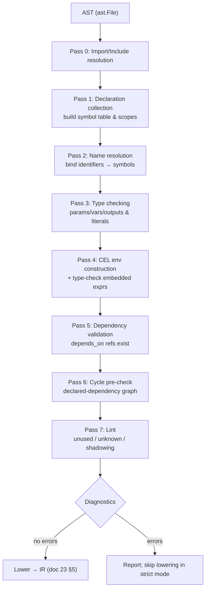

# 24 — FlowDSL Semantic Analysis Design

> **Codename:** Conduit · **DSL:** FlowDSL (`*.flow`) · **Module:** `github.com/conduit-io/conduit`
> **Sema package:** `github.com/conduit-io/conduit/internal/flow/sema`
> **Diagnostics package:** `github.com/conduit-io/conduit/internal/flow/diag`
> **Status:** Language Baseline v1.0 · **Owner:** Language & Compiler · **Date:** 2026-07-02

Semantic analysis runs after parsing ([22](22-parser-design.md)) and annotates/validates the AST ([23](23-ast-design.md))
before lowering to IR. It performs **name resolution & scoping**, builds the **symbol table**, runs the **type system**,
validates **dependencies**, constructs and type-checks the **CEL environment**, performs a **cycle pre-check**, emits
**unused/unknown warnings**, and produces a rich **diagnostics model** with quickfixes.

**Related documents**
- [20 — Grammar](20-dsl-grammar.md) · [21 — Lexer](21-lexer-design.md) · [22 — Parser](22-parser-design.md) · [23 — AST](23-ast-design.md)
- [25 — Expression Engine](25-expression-engine.md) — the CEL env this pipeline constructs & invokes.
- [30 — Workflow DAG](30-workflow-dag.md) — consumes the validated IR; full cycle detection lives at plan time.

---

## 1. Goals & error philosophy

- **Maximal validation before execution** — catch as many problems statically as possible.
- **Error-tolerant** — like the parser, sema runs to completion in tolerant mode (LSP/`conduit lint`), collecting *all*
  diagnostics rather than stopping at the first. Passes degrade gracefully around `ErrorNode`s
  ([22 §7](22-parser-design.md#7-error-tolerant-parsing-for-the-lsp)).
- **Deterministic diagnostics** — stable codes (`FLOW-Exxxx`/`FLOW-Wxxxx`) and stable ordering (by range) so editor
  output and CI output match.
- **Quickfix-oriented** — most diagnostics carry a machine-applicable fix for the LSP ([56](56-lsp-architecture.md)).

---

## 2. Pass pipeline

Semantic analysis is a **multi-pass** pipeline over the immutable AST. Each pass is a `Pass` that reads the AST and the
shared `Info` (symbol table, type map, diagnostics sink) and may annotate nodes' dedicated sema fields
([23 §2](23-ast-design.md#2-node-taxonomy)).



```go
package sema

// Pass is one stage of the pipeline. Passes are ordered and share Info.
type Pass interface {
	Name() string
	Run(f *ast.File, info *Info) // never returns error; records diagnostics into info.Diags
}

// Info is the mutable analysis context threaded through all passes.
type Info struct {
	GlobalScope *Scope
	Symbols     *SymbolTable
	Types       map[ast.Node]Type   // inferred/declared types (side table, doc 23 §3)
	CelEnv      *expr.Env           // built in Pass 4 (doc 25)
	Diags       *diag.Sink
	Imports     map[string]*Module  // resolved imports
	GrammarVer  string              // from File.GrammarVersion for version-gated checks
}

// Analyze runs the full pipeline.
func Analyze(f *ast.File, r Resolver) (*Info, error) {
	info := newInfo(f, r)
	for _, p := range pipeline { p.Run(f, info) }
	return info, info.Diags.FirstError()
}

var pipeline = []Pass{
	&importPass{}, &declPass{}, &nameResPass{}, &typePass{},
	&celPass{}, &depPass{}, &cyclePass{}, &lintPass{},
}
```

---

## 3. Name resolution & scoping

### 3.1 Scope hierarchy

FlowDSL scopes are lexical and nested:

```
File / Module scope
 └─ Workflow scope        (params, inputs, outputs, env, secrets, tasks)
     └─ Task scope        (task-local env/secrets/inputs, for_each vars, matrix vars, steps)
         └─ Step scope    (step-local env/secrets/inputs)
             └─ CEL scope (variables exposed to embedded expressions, doc 25 §2)
Template / Macro scope    (signature params; hygienic)
```

```go
// Scope is a lexical scope with a parent chain. Resolution walks parents.
type Scope struct {
	Kind    ScopeKind // File, Module, Workflow, Task, Step, Template, Macro
	Parent  *Scope
	Symbols map[string]*Symbol
	Node    ast.Node
}

func (s *Scope) Define(sym *Symbol) (prev *Symbol, ok bool) // false ⇒ redeclaration
func (s *Scope) Lookup(name string) (*Symbol, bool)         // walks Parent chain
func (s *Scope) LookupLocal(name string) (*Symbol, bool)
```

### 3.2 Symbol table & symbols

```go
type Symbol struct {
	Name     string
	Kind     SymbolKind // Param, Input, Output, Var, Env, Secret, Task, Step,
	                     // Template, Macro, Module, ImportedType, LoopVar, MatrixAxis
	Type     Type       // resolved type (Pass 3/4)
	Decl     ast.Node   // defining node (for go-to-definition)
	Scope    *Scope
	Used     bool       // for unused-warnings (Pass 7)
	Exported bool       // visible to importers (module/template/macro)
}

type SymbolTable struct {
	byScope map[*Scope]map[string]*Symbol
	all     []*Symbol // stable iteration for lint & LSP symbol provider
}
```

### 3.3 Resolution rules

- Identifiers in FlowDSL positions (`depends_on`, `as` loop vars, `matrix` axes) resolve against the enclosing scope
  chain. Unknown → `FLOW-E1001` (undefined symbol) with a "did-you-mean" quickfix (Levenshtein over in-scope names).
- Reserved words used as identifiers → `FLOW-E1002` ([20 §10](20-dsl-grammar.md#10-reserved-words)).
- Redeclaration in the same scope → `FLOW-E1003`; shadowing an outer symbol → `FLOW-W1004` (warning; allowed).
- Imported names resolve via `Info.Imports`; `import … exposing (a, b)` injects `a`,`b` into the current scope; `import
  … as ns` requires `ns.a` member access. Unknown import path → `FLOW-E1005`.

### 3.4 Hygiene for templates & macros

Template/macro bodies are analyzed in an **isolated scope** whose only externally-visible names are the signature
params. On expansion ([23 §5](23-ast-design.md#5-ast--typed-ir-lowering)) introduced symbols are **freshly renamed**
(gensym) to prevent capture of/by the call-site scope. Call-site arguments are resolved in the *caller* scope, bodies in
the *definition* scope — classic hygienic macro semantics.

---

## 4. Structural & dependency validation

### 4.1 Structural (context) validation

The parser accepts any `Stmt` in any block ([22 §4.2](22-parser-design.md#4-grammar-to-ast-mapping)); sema enforces
placement:

| Rule | Code |
|---|---|
| `uses`/`run` only inside a `step` | `FLOW-E1101` |
| `step` only inside a `task` | `FLOW-E1102` |
| `task` only inside a `workflow` | `FLOW-E1103` |
| `depends_on` only inside a `task` | `FLOW-E1104` |
| `matrix`/`for_each` only inside a `task` | `FLOW-E1105` |
| duplicate `when`/`timeout` in one block | `FLOW-E1106` |

### 4.2 Dependency reference validation

- Every name in a `task`'s `depends_on` **MUST** resolve to a sibling `task` symbol in the same workflow. Missing →
  `FLOW-E1110` with a did-you-mean quickfix. Self-dependency → `FLOW-E1111`.
- `DependsOnDecl.Resolved` is populated with the target `*Symbol` for lowering.

### 4.3 Cycle pre-check

A **declared-dependency** cycle check runs on the `depends_on` graph (before runtime data is known). This is a *static
pre-check*; the full data-flow cycle detection (including `output`→`input` references) is performed by the DAG planner
([30 — Workflow DAG](30-workflow-dag.md)).

```go
// cyclePass builds the task dependency graph and runs Tarjan SCC.
type cyclePass struct{}

func (cyclePass) Run(f *ast.File, info *Info) {
	g := buildDepGraph(f, info)          // nodes = tasks, edges = depends_on
	for _, scc := range tarjanSCC(g) {   // any SCC of size >1 (or self-loop) is a cycle
		if len(scc) > 1 || g.hasSelfLoop(scc[0]) {
			info.Diags.Add(diag.New("FLOW-E1120", diag.Error,
				spanOfCycle(scc), "dependency cycle: "+cyclePath(scc)))
		}
	}
}
```

---

## 5. Type system & type checking

FlowDSL has a small structural type system shared with CEL ([25 §3 type provider](25-expression-engine.md#3-type-provider--flowdsl-types)).

```go
type Kind uint8
const (
	KString Kind = iota; KInt; KFloat; KBool; KDuration; KTimestamp
	KList; KMap; KObject; KAny; KNull; KError
)

type Type struct {
	Kind   Kind
	Elem   *Type            // list<Elem>
	Key    *Type            // map<Key, Val>
	Val    *Type
	Fields map[string]*Type // object{...}
	Named  string
}

func (t Type) AssignableFrom(o Type) bool // structural + numeric widening (int→float), any↔T
func (t Type) String() string
```

Checks:

- `param`/`input`/`var`/`output` **declared** type (if any) MUST be `AssignableFrom` the type of its default/value
  expression → mismatch `FLOW-E1201`.
- `output = expr` infers the type from `expr` when undeclared.
- `enum` metadata values MUST match the declared scalar type → `FLOW-E1202`.
- `timeout` values MUST be `duration` (or a CEL expr typed `duration`) → `FLOW-E1203`.
- `matrix` axis values MUST be `list<scalar>` → `FLOW-E1204`.
- Literal-level checks: integer overflow, malformed duration, `null` assigned to a non-nullable declared type.

Numeric widening (`int`→`float`), `any` bidirectional compatibility, and `null` handling mirror CEL so FlowDSL and CEL
never disagree on a type.

---

## 6. CEL environment construction & expression type-checking (Pass 4)

Pass 4 bridges to the Expression Engine ([25](25-expression-engine.md)):

1. **Build the env per scope.** For each `EmbeddedExpr`, sema computes the set of visible variables (params, inputs,
   env, secrets, matrix axis vars, `for_each` loop var(s), prior task/step `output`s, and `ctx`) with their FlowDSL
   types, and constructs the CEL declarations via the type provider.
2. **Compile & type-check.** `expr.Compile(source, env)` parses + type-checks the CEL. Errors are mapped back to source
   using `EmbeddedExpr.Pos.Offset + celOffset` ([21 §5](21-lexer-design.md#5-position-tracking)) →
   `FLOW-E1301` (CEL syntax), `FLOW-E1302` (CEL type error), `FLOW-E1303` (unknown variable/function).
3. **Contextual type constraints.** `when` MUST type to `bool` (`FLOW-E1310`); `for_each` MUST type to `list`/`map`
   (`FLOW-E1311`); each `${{ }}` in a string coerces to `string`.
4. **Attach the program.** The compiled `*CompiledCel` is stored on `EmbeddedExpr.Prog` and the inferred type on
   `EmbeddedExpr.Type` for lowering and cost accounting.

```go
type celPass struct{}

func (celPass) Run(f *ast.File, info *Info) {
	ast.Walk(f, func(n ast.Node) bool {
		e, ok := n.(*ast.EmbeddedExpr)
		if !ok { return true }
		env := info.CelEnv.WithVars(visibleVars(n, info)) // scope-specific env (doc 25 §2)
		prog, typ, errs := expr.Compile(e.Source, env)
		for _, ce := range errs {
			info.Diags.Add(mapCelError(ce, e.Pos)) // remap CEL offset → source range
		}
		e.Prog, e.Type = prog, typ
		enforceContextType(n, typ, info) // when→bool, for_each→list/map
		return true
	})
}
```

---

## 7. Diagnostics model

A single diagnostics model is shared across lexer, parser, sema, and the expression engine.

```go
package diag

type Severity uint8
const ( Error Severity = iota; Warning; Info; Hint )

type Diagnostic struct {
	Code     string       // "FLOW-E1301", "FLOW-W1004" — stable, documented
	Severity Severity
	Range    ast.Range    // primary source span
	Message  string
	Related  []Related    // secondary spans ("previous declaration here", "expanded from…")
	Quickfix []Fix        // machine-applicable edits (LSP code actions)
	Source   string       // "flow-sema" | "flow-cel" | "flow-parse" | "flow-lex"
}

type Related struct { Range ast.Range; Message string }

type Fix struct {
	Title string
	Edits []TextEdit // { Range, NewText }
}

// Sink collects diagnostics; deterministic (sorted by range) on drain.
type Sink struct{ items []Diagnostic }
func (s *Sink) Add(d Diagnostic)
func (s *Sink) FirstError() error
func (s *Sink) Sorted() []Diagnostic
```

### 7.1 Diagnostic code ranges

| Range | Domain | Source |
|---|---|---|
| `FLOW-E00xx` / `W00xx` | grammar version / directives | parser |
| `FLOW-E01xx` / `E02xx` | lexical & syntax errors | lexer/parser |
| `FLOW-E10xx` | name resolution | sema |
| `FLOW-E11xx` | structural & dependency | sema |
| `FLOW-E12xx` | type checking | sema |
| `FLOW-E13xx` | CEL compile/type | expr engine |
| `FLOW-W1xxx` | lint warnings (unused, shadow, deprecated) | sema |

### 7.2 Quickfix hints (examples)

- `FLOW-E1001` undefined symbol → offer nearest in-scope names.
- `FLOW-E1110` unknown `depends_on` target → offer sibling task names + "create task stub".
- `FLOW-W1004` shadowing → offer rename.
- `FLOW-W0010` deprecated syntax → offer rewrite to the current form.

---

## 8. Lint pass (unused / unknown / warnings)

Pass 7 emits non-fatal quality diagnostics:

| Check | Code |
|---|---|
| Declared `param`/`input`/`var` never referenced | `FLOW-W1401` |
| `env`/`secret` binding never referenced | `FLOW-W1402` |
| `task`/`step` unreachable (nothing depends on it and it produces no output) | `FLOW-W1403` |
| Unknown metadata key on a block | `FLOW-W1404` |
| Shadowed outer symbol | `FLOW-W1004` |
| Deprecated construct for the active grammar version | `FLOW-W0010` |

`Symbol.Used` is set during name resolution / CEL var binding; anything left `false` and unexported triggers `W1401/2`.

---

## 9. Interfaces summary

```go
type Pass interface { Name() string; Run(*ast.File, *Info) }

type Scope interface {
	Define(*Symbol) (*Symbol, bool)
	Lookup(name string) (*Symbol, bool)
	LookupLocal(name string) (*Symbol, bool)
	Parent() Scope
}

type Symbol interface { // (concrete struct in §3.2; interface for pluggable providers)
	Ident() string
	SymKind() SymbolKind
	SymType() Type
	DeclNode() ast.Node
}

type Resolver interface { // supplied by the toolchain to resolve imports/includes
	ResolveModule(path string) (*ast.File, error)
	ResolveInclude(path string) (*ast.File, error)
}
```

---

## 10. Cross-references

- AST nodes annotated here → [23 — AST Design](23-ast-design.md)
- CEL env, functions, type provider, cost → [25 — Expression Engine](25-expression-engine.md)
- Full data-flow cycle detection at plan time → [30 — Workflow DAG Design](30-workflow-dag.md)
- Diagnostics surfaced in editors → [56 — LSP Architecture](56-lsp-architecture.md)
- Secret resolution → [61 — Secrets Management](61-secrets-management.md)
- Error handling strategy (platform) → [70 — Error Handling](70-error-handling.md)
