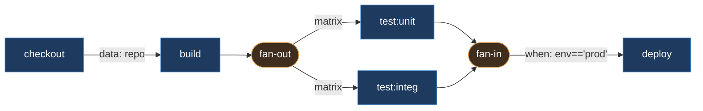
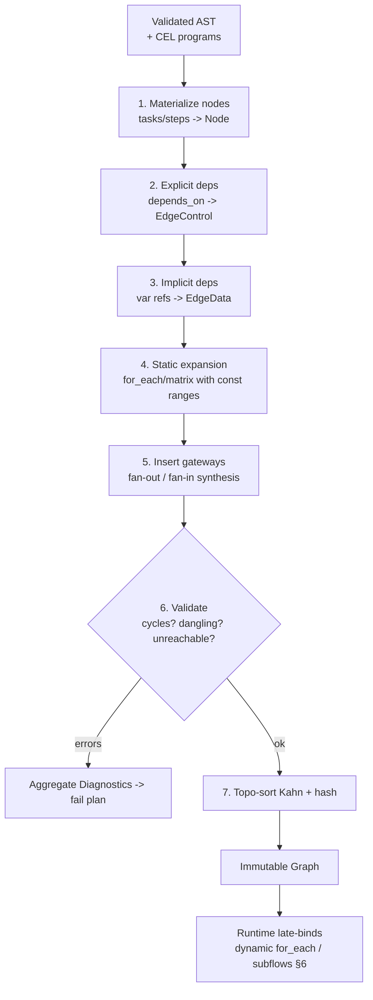
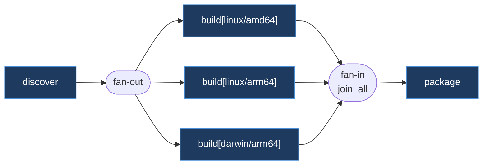
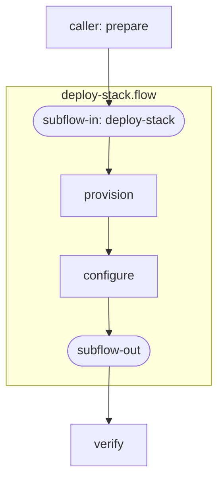

# 30 — Workflow DAG Design

> **Codename:** Conduit · **Module:** `github.com/conduit-io/conduit` · **Go:** 1.24+
> **Status:** Architecture & Design Baseline v1.0 · **Owner:** Execution Core
> **Related:** [DAG](30-workflow-dag.md) · [Runtime](31-execution-runtime.md) · [State](32-state-management.md) · [Recovery](71-recovery-strategy.md) · [Observability](64-observability.md)
> Upstream: [23 — AST Design](23-ast-design.md) · [24 — Semantic Analysis](24-semantic-analysis.md) · [25 — Expression Engine (CEL)](25-expression-engine.md)

This document specifies how Conduit lowers a validated FlowDSL AST into an executable **Directed Acyclic
Graph (DAG)**. The DAG is the contract between the *language front-end* (lexer → parser → AST → sema) and
the *execution runtime* ([31](31-execution-runtime.md)). Everything downstream — scheduling, retries,
checkpointing, replay — is defined in terms of the graph produced here.

RFC 2119 keywords (MUST/SHOULD/MAY) apply per **RFC 8174**.

---

## 1. Scope & Design Goals

| Goal | Rationale |
|---|---|
| **Deterministic planning** | The same `*.flow` + inputs MUST produce a byte-identical plan (stable node IDs) to enable deterministic replay ([31 §12](31-execution-runtime.md)) and content-addressed caching. |
| **Explicit + implicit deps** | Authors declare `depends_on`; the planner also *infers* edges from variable references so the DAG is correct even when authors forget. |
| **Static validation** | Cycles, undefined references, and unreachable nodes MUST be caught at plan time, before any side effect runs. |
| **Dynamic expansion** | `for_each` / `matrix` and subworkflows expand into subgraphs; expansion is late-bound where fan-out cardinality depends on runtime data. |
| **Conditional topology** | CEL `when` guards prune edges/nodes without invalidating the acyclic invariant. |
| **Separation of concerns** | The DAG package knows *nothing* about shells, plugins, or persistence. It is a pure data-structure + algorithms library. |

Package boundary:

```
internal/
  plan/            # this document
    graph.go       # Graph, Node, Edge types
    build.go       # AST -> Graph lowering
    deps.go        # depends_on + implicit dependency extraction
    toposort.go    # Kahn + Tarjan (cycle detection / SCC)
    expand.go      # for_each / matrix / subworkflow expansion
    guard.go       # CEL 'when' edge evaluation
    validate.go    # structural + semantic validation
```

---

## 2. DAG Model

### 2.1 Conceptual model

A Conduit plan is a graph `G = (V, E)` where:

- **Nodes (`V`)** are units of work: a **task** (`task`), a **step** inside a task, a **gateway**
  (fan-out/fan-in synthetic node), or a **subworkflow-boundary** node. Every node has a stable,
  content-addressed `NodeID`.
- **Edges (`E`)** are dependencies. Each edge carries a **kind**:
  - `EdgeControl` — pure ordering (`B` runs after `A`), from `depends_on`.
  - `EdgeData` — `B` consumes an output produced by `A` (inferred from variable references). Data edges
    also imply control ordering.
  - `EdgeConditional` — traversed only if the attached CEL `when` guard evaluates `true` at runtime.

The graph MUST be **acyclic**. Fan-out/fan-in, conditionals, and loops are all expressed *within* the
acyclic constraint (loops are unrolled into subgraphs, never back-edges).



### 2.2 Core Go types

```go
// Package plan lowers a validated FlowDSL AST into an executable DAG.
package plan

import (
	"time"

	"github.com/google/cel-go/cel"
)

// NodeID is a stable, deterministic identifier for a node in a plan.
// It is derived from the node's logical path (workflow/task/step) plus, for
// dynamically expanded nodes, its expansion key. See §7 for the hashing scheme.
type NodeID string

// NodeKind classifies the role of a node in the DAG.
type NodeKind uint8

const (
	KindTask        NodeKind = iota // a FlowDSL `task`
	KindStep                        // a step within a task
	KindGateway                     // synthetic fan-out / fan-in / join
	KindSubflowIn                   // subworkflow entry boundary
	KindSubflowOut                  // subworkflow exit boundary
)

// EdgeKind distinguishes control, data, and conditional dependencies.
type EdgeKind uint8

const (
	EdgeControl     EdgeKind = iota // explicit `depends_on` ordering
	EdgeData                        // inferred from variable reference (implies ordering)
	EdgeConditional                 // gated by a CEL `when` guard
)

// Node is a single unit of work or a synthetic control point in the plan.
type Node struct {
	ID       NodeID
	Kind     NodeKind
	Name     string            // authored name, e.g. "build" or "test:unit"
	Path     []string          // logical path: [workflow, task, step]
	Action   *ActionSpec       // nil for gateways / subflow boundaries
	When     *cel.Program      // compiled CEL guard for the node itself (may be nil)
	Timeout  time.Duration     // 0 => inherit from task/run defaults
	Retry    *RetrySpec        // nil => inherit
	Produces []string          // output variable names this node exports
	Consumes []string          // input variable references (drives EdgeData inference)
	Meta     map[string]string // labels/annotations propagated to spans & journal

	// Expansion provenance (nil for statically-authored nodes).
	Expansion *ExpansionInfo
}

// Edge is a directed dependency From -> To.
type Edge struct {
	From NodeID
	To   NodeID
	Kind EdgeKind
	// Guard is set only for EdgeConditional edges. Evaluated by the runtime
	// against the current variable scope; a false result prunes the edge and,
	// transitively, any node made unreachable by the pruning.
	Guard *cel.Program
	// Var names the specific output that induced a data edge (EdgeData only).
	Var string
}

// ActionSpec is an opaque descriptor the runtime resolves to a StepRunner.
// The plan package does not interpret it; see [31 §6].
type ActionSpec struct {
	Type   string            // "shell" | "plugin" | "builtin"
	Ref    string            // e.g. plugin name or builtin id
	Params map[string]any    // static params (template-expanded at run time)
	Env    map[string]string
}

// ExpansionInfo records how a node was generated from a for_each / matrix / subflow.
type ExpansionInfo struct {
	Source   NodeID            // the template node that was expanded
	Kind     string            // "for_each" | "matrix" | "subflow"
	Key      string            // stable key: the item value or matrix coordinate
	Bindings map[string]any    // loop variables bound for this instance
}
```

### 2.3 The Graph container

We store the graph as **adjacency lists** plus a node map. Adjacency lists give `O(V+E)` traversal
(Kahn/Tarjan) with cache-friendly iteration; a parallel reverse-adjacency list supports fan-in and
"predecessors complete?" checks in the scheduler ([31 §3](31-execution-runtime.md)).

```go
// Graph is an immutable, validated plan. Construction goes through Builder;
// once Build() returns, a Graph MUST NOT be mutated (enables safe concurrent reads).
type Graph struct {
	nodes map[NodeID]*Node
	out   map[NodeID][]Edge     // successors  (adjacency list)
	in    map[NodeID][]Edge     // predecessors (reverse adjacency)
	roots []NodeID              // in-degree 0 (control+data) — the initial ready-set
	order []NodeID              // cached topological order (§5)
	hash  [32]byte              // content hash of the whole plan (deterministic replay)
}

func (g *Graph) Node(id NodeID) (*Node, bool) { n, ok := g.nodes[id]; return n, ok }
func (g *Graph) Successors(id NodeID) []Edge  { return g.out[id] }
func (g *Graph) Predecessors(id NodeID) []Edge { return g.in[id] }
func (g *Graph) Roots() []NodeID              { return g.roots }
func (g *Graph) TopoOrder() []NodeID          { return g.order }
func (g *Graph) Hash() [32]byte               { return g.hash }
func (g *Graph) Len() int                     { return len(g.nodes) }
```

> **Invariant (I-1):** For every `EdgeData` edge `A→B`, `B.Consumes` references a name in `A.Produces`.
> **Invariant (I-2):** `roots` is exactly `{ v ∈ V : in[v] has no EdgeControl/EdgeData predecessor }`.
> **Invariant (I-3):** `order` is a valid topological ordering of `(V, EdgeControl ∪ EdgeData)`.

---

## 3. Building the DAG from the AST

The AST ([23](23-ast-design.md)) is a tree; the plan is a graph. Lowering happens in the
`plan.Builder`, which runs **after** semantic analysis ([24](24-semantic-analysis.md)) has already
resolved names, types, and CEL programs.

```go
type Builder struct {
	celEnv  *cel.Env          // shared environment from [25]
	nodes   map[NodeID]*Node
	edges   []Edge
	diags   []Diagnostic      // structural errors collected, reported together
}

// Build lowers a semantically-valid workflow AST into a Graph.
// It performs: (1) node materialization, (2) explicit dep wiring,
// (3) implicit data-dep inference, (4) expansion of static loops,
// (5) validation, (6) topo-ordering + hashing.
func (b *Builder) Build(wf *ast.Workflow, inputs Scope) (*Graph, error)
```

### 3.1 Planning pipeline



**Steps 1–3** are purely static. **Step 4** expands only loops whose ranges are compile-time constants;
data-dependent loops are deferred to the runtime (§6.3). This two-phase strategy keeps the *static core*
of every plan fully validated while still supporting data-driven fan-out.

### 3.2 Node materialization (step 1)

Each `task` becomes a `KindTask` node; if a task has ordered steps with their own dependencies, each step
becomes a `KindStep` node and the task node acts as a namespace prefix in `Path`. A task with a single
implicit step collapses to one node (author ergonomics; no synthetic step node).

```go
func (b *Builder) materialize(wf *ast.Workflow) {
	for _, t := range wf.Tasks {
		id := b.nodeID(wf.Name, t.Name, "")
		b.nodes[id] = &Node{
			ID: id, Kind: KindTask, Name: t.Name,
			Path:     []string{wf.Name, t.Name},
			Action:   lowerAction(t.Action),
			When:     t.WhenProgram,          // compiled by sema
			Timeout:  t.Timeout,
			Retry:    lowerRetry(t.Retry),
			Produces: t.Outputs,              // declared `outputs:`
			Consumes: referencedVars(t),      // §4.2
			Meta:     t.Labels,
		}
	}
}
```

---

## 4. Dependencies: explicit and implicit

### 4.1 Explicit `depends_on` → `EdgeControl`

```flow
task build {
  depends_on: [checkout]
  run: "go build ./..."
}
```

Each entry in `depends_on` yields one `EdgeControl` edge `checkout → build`. Unknown names are a
structural error (`DAG001: unknown dependency`).

### 4.2 Implicit data dependencies → `EdgeData`

Conduit infers edges from **variable references** so authors don't have to hand-maintain `depends_on`.
During sema, every `${{ tasks.X.outputs.Y }}` / `${{ steps.X.Y }}` reference is recorded. The builder
converts each such reference into an `EdgeData` edge from the *producer* of `Y` to the *consumer*.

```flow
task checkout { outputs: [sha] ; run: "git rev-parse HEAD > $CONDUIT_OUT/sha" }
task build    { run: "build --commit ${{ tasks.checkout.outputs.sha }}" }
# => implicit EdgeData: checkout --(sha)--> build   (no depends_on needed)
```

```go
// wireImplicit adds EdgeData edges by matching each node's Consumes against
// the global producer index. It is O(Σ|Consumes|) with a hashed producer index.
func (b *Builder) wireImplicit() {
	producers := map[string]NodeID{} // "task.output" -> producing node
	for id, n := range b.nodes {
		for _, out := range n.Produces {
			producers[n.Name+"."+out] = id
		}
	}
	for id, n := range b.nodes {
		for _, ref := range n.Consumes {
			if src, ok := producers[ref]; ok && src != id {
				b.edges = append(b.edges, Edge{
					From: src, To: id, Kind: EdgeData, Var: ref,
				})
			} else if !ok {
				b.diag("DAG002", "reference to unproduced output %q", ref)
			}
		}
	}
}
```

> **Deduplication.** If both an explicit `depends_on` and an implicit data reference connect the same
> pair, the builder keeps a single edge and *upgrades* it to `EdgeData` (data implies control). This
> preserves I-1 while avoiding duplicate predecessors in fan-in counting.

### 4.3 Conditional edges via CEL `when`

A `when:` on an edge target (or on a `depends_on` entry) produces an `EdgeConditional`. The guard is a
compiled CEL program ([25](25-expression-engine.md)) over the run scope (`inputs`, `tasks.*.outputs`,
`matrix.*`, `env`). At plan time the edge exists; at run time the scheduler evaluates the guard and prunes
the edge if it is `false`. Pruning that isolates a node marks it `Skipped` (not `Failed`) — see
[31 §5](31-execution-runtime.md) and the state machine in [32 §2](32-state-management.md).

```flow
task deploy {
  depends_on: [{ task: test, when: "inputs.env == 'prod' && tasks.test.outputs.pass" }]
  run: "conduit deploy"
}
```

Conditional edges never introduce cycles: they are a *subset* of the static edge set, evaluated at
runtime; the acyclic proof (§5) is computed over the union of all edges, so runtime pruning can only
*remove* reachability.

---

## 5. Topological Sort & Cycle Detection

Conduit uses **Kahn's algorithm** for the primary topological order (it naturally yields the initial
ready-set and detects cycles as a side effect) and **Tarjan's SCC** algorithm to produce a *diagnostic*
listing every strongly-connected component when a cycle is found — so the author sees the whole cycle, not
just one back-edge.

### 5.1 Kahn (ordering + fast cycle detection)

```go
// TopoSort returns a topological order over control+data edges, or a *CycleError.
// Complexity: O(V + E) time, O(V) auxiliary space.
func TopoSort(g *Graph) ([]NodeID, error) {
	indeg := make(map[NodeID]int, len(g.nodes))
	for id := range g.nodes {
		indeg[id] = 0
	}
	for _, es := range g.out {
		for _, e := range es {
			if e.Kind == EdgeConditional {
				continue // conditional edges do not constrain the static order
			}
			indeg[e.To]++
		}
	}

	// Deterministic ready queue: sort roots by NodeID so the order is stable.
	ready := sortedZeroIndegree(indeg)
	order := make([]NodeID, 0, len(g.nodes))
	for len(ready) > 0 {
		id := ready[0]
		ready = ready[1:]
		order = append(order, id)
		for _, e := range g.out[id] {
			if e.Kind == EdgeConditional {
				continue
			}
			indeg[e.To]--
			if indeg[e.To] == 0 {
				ready = insertSorted(ready, e.To) // keep determinism
			}
		}
	}
	if len(order) != len(g.nodes) {
		return nil, newCycleError(tarjanSCC(g)) // §5.2
	}
	return order, nil
}
```

Determinism note: ties in Kahn's frontier are broken by `NodeID` ordering. Since `NodeID`s are
content-addressed (§7), the topological order — and therefore span ordering and journal offsets — is
reproducible across machines. This is a prerequisite for deterministic replay
([31 §12](31-execution-runtime.md)).

### 5.2 Tarjan (cycle *reporting*)

```go
// tarjanSCC returns all strongly-connected components with size > 1 (the cycles).
// Complexity: O(V + E). Used only on the error path to build a rich diagnostic.
func tarjanSCC(g *Graph) [][]NodeID {
	var index int
	idx := map[NodeID]int{}
	low := map[NodeID]int{}
	onStk := map[NodeID]bool{}
	var stk []NodeID
	var sccs [][]NodeID

	var strongconnect func(v NodeID)
	strongconnect = func(v NodeID) {
		idx[v], low[v] = index, index
		index++
		stk = append(stk, v)
		onStk[v] = true
		for _, e := range g.out[v] {
			w := e.To
			if _, seen := idx[w]; !seen {
				strongconnect(w)
				low[v] = min(low[v], low[w])
			} else if onStk[w] {
				low[v] = min(low[v], idx[w])
			}
		}
		if low[v] == idx[v] {
			var comp []NodeID
			for {
				w := stk[len(stk)-1]
				stk = stk[:len(stk)-1]
				onStk[w] = false
				comp = append(comp, w)
				if w == v {
					break
				}
			}
			if len(comp) > 1 {
				sccs = append(sccs, comp)
			}
		}
	}
	for v := range g.nodes {
		if _, seen := idx[v]; !seen {
			strongconnect(v)
		}
	}
	return sccs
}
```

The resulting `CycleError` renders as:

```
DAG010: dependency cycle detected
  build → test → deploy → build
  (add/remove a depends_on edge to break the cycle)
```

---

## 6. Fan-out / Fan-in, Loops, Matrix & Subworkflows

### 6.1 Fan-out / fan-in with synthetic gateways

When a node has multiple successors (fan-out) or multiple predecessors (fan-in), the graph already
expresses the concurrency directly — the scheduler releases all ready successors in parallel and a fan-in
node simply waits until all its predecessors complete. We still **insert synthetic `KindGateway` nodes**
in two cases:

1. **Barrier semantics** — an explicit `join:` policy (`all` / `any` / `count(n)`) needs a node to carry
   the policy and aggregate outputs.
2. **`for_each` collection** — the fan-in gateway collects per-iteration outputs into an array output.

```go
// Join policy attached to a fan-in gateway node (Node.Action == nil, carried in Meta).
type JoinPolicy struct {
	Mode  string // "all" | "any" | "count"
	Count int    // for Mode=="count"
}
```

### 6.2 `for_each` / matrix expansion into dynamic subgraphs

A `for_each` task is a **template**. Expansion clones the template node once per item and rewires edges:

- inbound edges of the template become inbound edges of a fan-out gateway;
- one clone per item, keyed by a stable expansion key;
- clones feed a fan-in gateway that carries a `for_each` join policy and re-collects outputs.

```flow
task test {
  for_each: ${{ tasks.discover.outputs.suites }}   # data-dependent → runtime expansion
  run: "go test ${{ item }}"
}
```

`matrix` is the Cartesian product of several axes; each coordinate becomes a clone with all axis variables
bound in `Expansion.Bindings`.

```flow
task build {
  matrix:
    os:   [linux, darwin, windows]
    arch: [amd64, arm64]
  run: "GOOS=${{ matrix.os }} GOARCH=${{ matrix.arch }} go build"
}
# => 6 clones: build[linux/amd64], build[linux/arm64], ... build[windows/arm64]
```



```go
// expandMatrix produces one clone per Cartesian coordinate. Static ranges are
// expanded at build time; data-dependent for_each is expanded by the runtime
// via the same routine once the collection value is known (§6.3).
func expandMatrix(tmpl *Node, axes map[string][]any) []*Node {
	coords := cartesian(axes) // deterministic: axes iterated in sorted key order
	clones := make([]*Node, 0, len(coords))
	for _, c := range coords {
		key := coordKey(c) // e.g. "arch=amd64,os=linux" (sorted)
		n := tmpl.clone()
		n.ID = deriveID(tmpl.ID, key) // stable, hashed (§7)
		n.Expansion = &ExpansionInfo{
			Source: tmpl.ID, Kind: "matrix", Key: key, Bindings: c,
		}
		clones = append(clones, n)
	}
	return clones
}
```

### 6.3 Static vs. runtime (late-bound) expansion

| Loop source | When expanded | Why |
|---|---|---|
| Constant list / matrix of literals | **Build time** (step 4) | Cardinality known; fully validated in the static plan. |
| `for_each: ${{ tasks.X.outputs.Y }}` | **Runtime**, when `X` completes | Cardinality depends on data produced during the run. |

For runtime expansion the plan carries a **template node** flagged `Expansion.Kind == "for_each"` with an
empty clone set. When the producing node completes, the scheduler invokes `expand.Instantiate(template,
collection)` which returns a *sub-Graph* that is **spliced** into the live graph between the fan-out and
fan-in gateways. Splicing re-runs a *local* Kahn check over the inserted nodes only (the surrounding graph
is already acyclic and the spliced subgraph is a DAG by construction), so the incremental cost is
`O(V' + E')` in the size of the subgraph, not the whole plan.

```go
// Instantiate materializes a dynamic for_each into a spliceable subgraph.
func Instantiate(tmpl *Node, collection []any) (*SubGraph, error)

// SubGraph is a validated fragment the runtime splices between gateway nodes.
type SubGraph struct {
	Nodes []*Node
	Edges []Edge
	In    NodeID // fan-out gateway to attach to
	Out   NodeID // fan-in gateway to attach to
}
```

### 6.4 Subworkflows

A `use:` reference to another `*.flow` file (or a named subworkflow) lowers to a pair of boundary nodes
(`KindSubflowIn` / `KindSubflowOut`) that wrap the callee's own DAG. The callee is planned recursively;
its root nodes gain a control edge from `SubflowIn` and its sink nodes feed `SubflowOut`. Input mapping
becomes data edges into `SubflowIn`; output mapping becomes `Produces` on `SubflowOut`.

Recursion is bounded: the builder tracks the call stack of workflow identities and raises `DAG020:
subworkflow recursion` if a workflow (transitively) calls itself — this is the *only* way a cycle could
otherwise enter the model, so it is checked explicitly during recursive planning.



---

## 7. Deterministic Node IDs

`NodeID`s MUST be stable across runs and machines to support caching, replay, and journal correlation.

```go
// nodeID derives a stable ID as a truncated SHA-256 over the logical path plus
// expansion key. Because inputs are canonicalized (sorted keys, normalized
// whitespace), the same plan always yields the same IDs.
func (b *Builder) nodeID(parts ...string) NodeID {
	h := sha256.New()
	for _, p := range parts {
		io.WriteString(h, canonical(p))
		h.Write([]byte{0x1f}) // unit separator to avoid ambiguity
	}
	return NodeID("n_" + hex.EncodeToString(h.Sum(nil))[:20])
}
```

The whole-graph `Graph.hash` is computed by hashing nodes in topological order together with their edge
lists — giving a single content address for the entire plan. The runtime records this hash in the run
journal ([32 §4](32-state-management.md)); replay refuses to proceed if the recomputed plan hash differs.

---

## 8. DAG Validation

Validation runs as step 6 of the pipeline and aggregates *all* structural diagnostics before failing
(authors get every error at once, not one-per-recompile).

| Code | Check | Severity |
|---|---|---|
| `DAG001` | `depends_on` references an unknown task | error |
| `DAG002` | Variable reference to an unproduced output | error |
| `DAG010` | Dependency cycle (with full SCC listing) | error |
| `DAG011` | Node unreachable from any root (dead node) | warning |
| `DAG012` | Duplicate node name within a namespace | error |
| `DAG013` | `join: count(n)` with `n` > predecessor count | error |
| `DAG020` | Subworkflow recursion | error |
| `DAG030` | `when` guard references undefined scope var | error (from sema) |
| `DAG040` | Fan-out with zero items and no `allow_empty` | warning |

```go
type Diagnostic struct {
	Code     string
	Message  string
	Node     NodeID
	Pos      ast.Position // source span for editor squiggles / LSP [56]
	Severity Severity
}

// Validate returns a non-nil error if any Diagnostic has Severity == Error.
func Validate(g *Graph) ([]Diagnostic, error)
```

Reachability (`DAG011`) is computed by a BFS from `roots` over control+data edges: `O(V+E)`. Any node not
visited is unreachable. Conditional edges are treated as *present* for reachability (a node reachable only
through a `when` may still run), so `DAG011` fires only for structurally-orphaned nodes.

---

## 9. Complexity Summary

| Phase | Time | Space |
|---|---|---|
| Materialize nodes | `O(V)` | `O(V)` |
| Explicit deps | `O(E_explicit)` | `O(E)` |
| Implicit data deps (hashed producer index) | `O(Σ\|Consumes\| + V)` | `O(V + E)` |
| Static matrix/for_each expansion | `O(Π axis sizes)` per template | `O(clones)` |
| Kahn topo-sort + ready-set | `O(V + E)` | `O(V)` |
| Tarjan SCC (error path only) | `O(V + E)` | `O(V)` |
| Reachability / dead-node check | `O(V + E)` | `O(V)` |
| Runtime for_each splice | `O(V' + E')` (subgraph only) | `O(V' + E')` |
| Plan content hash | `O(V + E)` | `O(1)` streaming |

Overall static planning is **linear in the size of the graph**: `O(V + E)` dominated by the
expanded node/edge counts. Matrix expansion is the only super-linear term and is bounded by the product of
axis cardinalities, which is validated against a configurable `plan.max_nodes` ceiling to prevent
plan-explosion DoS.

---

## 10. Worked Example — CI/CD plan

```flow
workflow ci {
  inputs { env: string = "staging" }

  task checkout { outputs: [sha]; run: "git rev-parse HEAD > $CONDUIT_OUT/sha" }

  task build {
    matrix { os: [linux, darwin]; arch: [amd64, arm64] }
    run: "GOOS=${{matrix.os}} GOARCH=${{matrix.arch}} go build --commit ${{tasks.checkout.outputs.sha}}"
    outputs: [artifact]
  }

  task test  { for_each: ${{ tasks.discover.outputs.suites }}; run: "go test ${{item}}" }
  task discover { depends_on: [checkout]; outputs: [suites]; run: "list-suites" }

  task deploy {
    depends_on: [{ task: build, when: "inputs.env == 'prod'" }]
    run: "conduit deploy ${{ tasks.build.outputs.artifact }}"
  }
}
```

Resulting plan (conditional edge dashed, data edges solid):

```mermaid
flowchart TD
  classDef c fill:#1e3a5f,stroke:#4a90d9,color:#fff
  CO[checkout]:::c
  DS[discover]:::c
  FO([fan-out matrix])
  B1["build[linux/amd64]"]:::c
  B2["build[linux/arm64]"]:::c
  B3["build[darwin/amd64]"]:::c
  B4["build[darwin/arm64]"]:::c
  BJ(["fan-in: all"])
  TF([fan-out for_each])
  T1["test[item]"]:::c
  TJ(["fan-in: for_each"])
  DP[deploy]:::c

  CO -->|sha| FO
  FO --> B1 & B2 & B3 & B4
  B1 & B2 & B3 & B4 --> BJ
  CO --> DS
  DS -->|suites| TF
  TF --> T1 --> TJ
  BJ -.->|when env==prod| DP
```



---

## 11. Cross-References

- The `Graph` produced here is consumed verbatim by the **[Execution Runtime](31-execution-runtime.md)**;
  `Roots()` seeds the ready-set and `Successors()`/`Predecessors()` drive ready-set scheduling.
- Node/edge state transitions are persisted by **[State Management](32-state-management.md)**; the plan
  hash (§7) is the correlation key for the run journal.
- `when`/`for_each` expressions compile through the **[Expression Engine (CEL)](25-expression-engine.md)**.
- Structural diagnostics surface in editors via the **[LSP](56-lsp-architecture.md)** and **[Semantic
  Analysis](24-semantic-analysis.md)** layers.
- Cycle/plan-failure recovery semantics tie into the **[Recovery Strategy](71-recovery-strategy.md)**;
  planning spans/metrics are emitted per **[Observability](64-observability.md)**.
