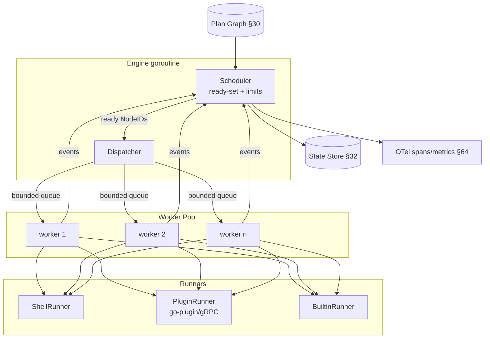
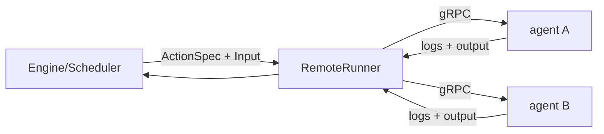

# 31 — Execution Runtime Design

> **Codename:** Conduit · **Module:** `github.com/conduit-io/conduit` · **Go:** 1.24+
> **Status:** Architecture & Design Baseline v1.0 · **Owner:** Execution Core
> **Related:** [DAG](30-workflow-dag.md) · [Runtime](31-execution-runtime.md) · [State](32-state-management.md) · [Recovery](71-recovery-strategy.md) · [Observability](64-observability.md)

This document specifies the **scheduler** and **executor** that turn a validated plan `Graph`
([30](30-workflow-dag.md)) into observable side effects. It defines the worker-pool model, ready-set
scheduling, concurrency limits, context/cancellation propagation, retries, idempotency, the step-executor
abstraction, log streaming, artifact passing, deadline handling, dry-run, live/watch mode, the remote
execution extension point, and deterministic replay.

RFC 2119 keywords apply per **RFC 8174**.

---

## 1. Runtime Topology



The **Engine** owns a single scheduler goroutine (the serialization point for all graph-state mutations —
no locks on the ready-set) and a pool of **workers**. Workers pull ready nodes from a bounded channel, run
them via a `StepRunner`, and post completion events back to the scheduler through a results channel. This
**single-writer** design makes ready-set updates, in-degree decrements, and conditional-edge pruning
race-free by construction.

---

## 2. Core Interfaces

```go
package runtime

import (
	"context"
	"io"
	"time"

	"github.com/conduit-io/conduit/internal/plan"
)

// Scheduler drives a plan to completion, releasing nodes as their dependencies
// are satisfied and respecting concurrency limits. It is the single writer of
// run/graph state; all mutation flows through its event loop.
type Scheduler interface {
	// Run executes the plan and blocks until the run reaches a terminal state
	// (Succeeded / Failed / Cancelled). ctx cancellation triggers graceful drain.
	Run(ctx context.Context, g *plan.Graph, opts RunOptions) (Result, error)
}

// Executor runs exactly one node: it selects a StepRunner, applies the retry
// policy, enforces the timeout/deadline, streams logs, and captures artifacts.
type Executor interface {
	Execute(ctx context.Context, n *plan.Node, in NodeInput) (NodeOutput, error)
}

// StepRunner is the pluggable backend that performs the actual work of a node.
// Implementations: ShellRunner, PluginRunner (go-plugin/gRPC), BuiltinRunner.
type StepRunner interface {
	// Kind reports the ActionSpec.Type this runner handles ("shell"|"plugin"|"builtin").
	Kind() string
	// Start begins execution and returns a Handle for streaming + awaiting.
	// It MUST honor ctx cancellation and MUST be safe to call concurrently.
	Start(ctx context.Context, spec plan.ActionSpec, in NodeInput) (Handle, error)
}

// Handle represents an in-flight step: streaming logs plus a terminal result.
type Handle interface {
	Logs() <-chan LogLine   // multiplexed stdout/stderr, closed on completion
	Wait() (NodeOutput, error)
	Signal(sig Signal) error // graceful (SIGTERM-equivalent) then hard kill
}

// RetryPolicy decides whether and when to re-attempt a failed node.
type RetryPolicy interface {
	// Next returns the delay before attempt n+1, or ok=false to stop retrying.
	Next(attempt int, err error) (delay time.Duration, ok bool)
}
```

Supporting value types:

```go
type NodeInput struct {
	Vars      Scope             // resolved inputs + upstream outputs
	Artifacts map[string]Artifact
	Env       map[string]string
	Bindings  map[string]any    // matrix / for_each loop vars (from ExpansionInfo)
}

type NodeOutput struct {
	Vars      map[string]any
	Artifacts map[string]Artifact
	ExitCode  int
	Attempts  int
}

type Result struct {
	State    RunState // §5
	Nodes    map[plan.NodeID]NodeResult
	Started  time.Time
	Finished time.Time
}
```

---

## 3. Ready-Set Scheduling

The scheduler maintains an in-degree counter per node (over control+data edges). A node is **ready** when
its remaining in-degree reaches zero *and* its own `When` guard (if any) evaluates true. Ready nodes are
pushed to the dispatch queue; when a node completes, the scheduler decrements successors and evaluates any
`EdgeConditional` guards, possibly pruning edges (which may make more nodes ready — or, if pruning
isolates a node, mark it `Skipped`).

```go
func (s *scheduler) loop(ctx context.Context) {
	s.seedReady(s.g.Roots())           // I-2 from §30
	for s.inflight > 0 || s.hasReady() {
		// 1. Dispatch as many ready nodes as limits allow (§4).
		for s.hasReady() && s.admit() {
			n := s.popReady()          // deterministic: min NodeID (fairness §11)
			s.dispatch(ctx, n)
			s.inflight++
		}
		// 2. Block on the next completion or cancellation.
		select {
		case <-ctx.Done():
			s.beginDrain(ctx.Err())    // §5.4 graceful cancel
		case r := <-s.results:
			s.inflight--
			s.onComplete(r)            // decrement successors, prune when-edges
		}
	}
	s.finalize()
}

// onComplete decrements successor in-degrees and evaluates conditional edges.
func (s *scheduler) onComplete(r NodeResult) {
	s.record(r)                        // -> State Store journal (§32)
	if r.State == NodeFailed && !r.Ignored {
		s.failFast(r)                  // policy: continue-on-error vs. halt (§5.3)
		return
	}
	for _, e := range s.g.Successors(r.ID) {
		if e.Kind == plan.EdgeConditional && !s.evalGuard(e.Guard) {
			s.pruneEdge(e)             // may cascade to Skipped nodes
			continue
		}
		if s.decr(e.To) == 0 && s.guardTrue(e.To) {
			s.pushReady(e.To)
		}
	}
	// Late-bound for_each: splice dynamic subgraph now that outputs exist (§30 6.3).
	if tmpl := s.pendingExpansion(r.ID); tmpl != nil {
		s.splice(plan.Instantiate(tmpl, r.Output.Vars[tmpl.forEachVar()]))
	}
}
```

Because the loop is single-threaded, `decr`, `pruneEdge`, and `splice` need no locking. The only
cross-goroutine communication is the `results` channel and the dispatch queue.

---

## 4. Concurrency Limits & Resource Pools

Conduit enforces limits at three tiers; a node may run only when it can acquire **all** applicable tokens.

| Tier | Limit | Mechanism |
|---|---|---|
| **Global** | `--max-concurrency` / `run.concurrency` | fixed-size worker pool + weighted semaphore |
| **Per-task** | `task.concurrency` (e.g. cap a fan-out) | per-template counting semaphore keyed by `Expansion.Source` |
| **Resource pool** | named pools, e.g. `pool: db(4)` | `golang.org/x/sync/semaphore` weighted, keyed by pool name |

```go
type Limiter struct {
	global *semaphore.Weighted           // size = worker count
	pools  map[string]*semaphore.Weighted
	perTpl map[plan.NodeID]*counting     // per for_each/matrix template
}

// admit tries to acquire all tokens a node needs; on partial failure it releases
// what it got and returns false (the node stays in the ready-set → no deadlock).
func (l *Limiter) admit(n *plan.Node) (release func(), ok bool) {
	acq := []func(){}
	undo := func() { for _, r := range acq { r() } }
	if !tryAcquire(l.global, 1, &acq) { undo(); return nil, false }
	for _, p := range n.Pools() {
		if !tryAcquire(l.pools[p.Name], p.Weight, &acq) { undo(); return nil, false }
	}
	return func() { undo() }, true
}
```

> **Deadlock avoidance.** Tokens are acquired *atomically* per admission attempt with `TryAcquire`; if any
> tier is exhausted the node yields its partial acquisitions and remains ready. Because the ready-set is
> non-empty only when at least one node *could* eventually run (the DAG is acyclic and roots need no
> tokens beyond global), the scheduler cannot livelock: workers draining in-flight nodes release tokens,
> re-triggering the dispatch loop.

Weighted semaphores let a heavy node request e.g. `pool: cpu(4)` on an 8-token pool, correctly excluding
two other 4-weight nodes while allowing four 1-weight nodes.

---

## 5. Run / Node Lifecycle & States

State machines and persistence are owned by [State Management](32-state-management.md); this section
defines the *runtime* transitions the scheduler drives.

```mermaid
sequenceDiagram
  autonumber
  participant CLI as conduit run
  participant ENG as Engine/Scheduler
  participant ST as State Store §32
  participant W as Worker
  participant R as StepRunner
  participant OBS as OTel §64

  CLI->>ENG: Run(ctx, graph, opts)
  ENG->>ST: append RunStarted(planHash)
  ENG->>OBS: start run span
  loop until terminal
    ENG->>ENG: compute ready-set + acquire limits §4
    ENG->>W: dispatch(node)
    W->>ST: append TaskStarted(node, attempt)
    W->>R: Start(ctx, action, input)
    R-->>W: Handle{Logs, Wait}
    R-->>W: stream LogLine* (→ ST journal + OBS)
    R-->>W: NodeOutput / error
    alt error && retryable
      W->>W: backoff+jitter §7 ; re-Start
    end
    W->>ENG: results<-NodeResult
    ENG->>ST: append TaskFinished(state, output)
    ENG->>ENG: decr successors / prune when-edges §3
  end
  ENG->>ST: append RunFinished(state)
  ENG->>OBS: end run span
  ENG-->>CLI: Result
```

### 5.1 Node terminal states
`Succeeded`, `Failed`, `Skipped` (guard false / pruned), `Cancelled`, `TimedOut`. Mapped to the persisted
step state machine in [32 §2](32-state-management.md).

### 5.2 Run terminal states
`Succeeded` (all reachable nodes Succeeded/Skipped), `Failed` (≥1 unignored failure under halt policy),
`Cancelled` (context cancelled / user `conduit cancel`).

### 5.3 Failure policy
`on_error: halt | continue`. Under `halt` the scheduler stops admitting new nodes, drains in-flight ones
(§5.4), and marks unstarted reachable nodes `Skipped(upstream_failed)`. Under `continue`, only the failed
node's downstream data-dependents are skipped; independent branches proceed.

### 5.4 Cancellation & graceful drain
On `ctx.Done()` or a cancel signal, the scheduler stops dispatch and calls `Handle.Signal(SIGTERM-equiv)`
on every in-flight node, then waits up to `run.grace_period` before `Signal(kill)`. All partial outputs
are journaled so a later resume ([32 §5](32-state-management.md)) can continue.

---

## 6. Step Executors (StepRunner backends)

```go
// Registry maps ActionSpec.Type -> StepRunner; resolved per node at dispatch.
type Registry struct{ runners map[string]StepRunner }
```

### 6.1 ShellRunner
Runs `run:` scripts via `os/exec` with a per-node working dir, injected `$CONDUIT_OUT` (artifact/output
capture dir), and env from `NodeInput.Env`. Uses process groups so `Signal` can terminate child trees
(`setpgid` on POSIX; Job Objects on Windows). Streams stdout/stderr line-buffered into `Handle.Logs()`.

### 6.2 PluginRunner (go-plugin / gRPC)
Delegates to a plugin over the go-plugin gRPC transport ([40](40-plugin-architecture.md)). The plugin
implements a `StepService` gRPC contract; logs stream as a server-side stream; cancellation propagates via
gRPC context cancellation. Plugin processes are pooled and health-checked; a crashed plugin surfaces as a
retryable `PluginUnavailable` error.

### 6.3 BuiltinRunner
In-process Go functions registered by ID (e.g. `builtin:http`, `builtin:approval`, `builtin:sleep`). No
process boundary — lowest overhead, used for control-flow primitives and hot-path actions.

All three honor the same `NodeInput`/`NodeOutput` contract, so the scheduler is oblivious to backend type.

---

## 7. Retries, Backoff & Jitter

```go
// ExpoBackoff implements RetryPolicy with exponential backoff, full jitter,
// a cap, and error-class awareness (only retryable errors are retried).
type ExpoBackoff struct {
	Max      int           // max attempts (0 => no retry)
	Base     time.Duration // e.g. 500ms
	Cap      time.Duration // e.g. 30s
	Retry    func(error) bool
	rng      *rand.Rand
}

func (e *ExpoBackoff) Next(attempt int, err error) (time.Duration, bool) {
	if attempt >= e.Max || (e.Retry != nil && !e.Retry(err)) {
		return 0, false
	}
	// exponential window, then AWS-style full jitter to avoid thundering herds.
	backoff := float64(e.Base) * math.Pow(2, float64(attempt))
	if backoff > float64(e.Cap) {
		backoff = float64(e.Cap)
	}
	return time.Duration(e.rng.Int63n(int64(backoff) + 1)), true
}
```

Retries are performed **inside the worker** (the scheduler sees only the final attempt), so retry sleeps do
not consume scheduler cycles but *do* continue to hold the node's concurrency tokens (intentional: a
retrying DB task should keep its `db` pool slot to avoid re-queuing storms). Each attempt is journaled with
its `attempt` index for observability and replay.

---

## 8. Idempotency

Side-effecting nodes SHOULD declare an `idempotency_key` (a CEL expression). Before executing, the runner
consults the state store: if a completed attempt with the same key and the same **plan hash** exists, the
prior `NodeOutput` is returned without re-execution. This makes at-least-once dispatch (retries, resume
after crash) behave as **effectively-once** for keyed nodes. Nodes without a key are at-least-once; see
[32 §6](32-state-management.md) for exactly-once vs. at-least-once guarantees and the write-then-ack
journal protocol.

---

## 9. Streaming Logs & Artifact Passing

**Logs.** `Handle.Logs()` yields `LogLine{NodeID, Stream, Ts, Text}`. The engine fans each line to (a) the
run journal ([32 §4](32-state-management.md)), (b) OTel log records ([65](65-logging.md)), and (c) live
consumers (`--watch`, TUI). Backpressure: the log channel is bounded; if a consumer stalls, the runner is
throttled (never dropped) to preserve completeness.

**Artifacts.** Each node writes to `$CONDUIT_OUT`; on success the executor scans declared `Produces` and
registers `Artifact{Name, URI, Digest, Size}` in the store. Downstream nodes receive matching artifacts in
`NodeInput.Artifacts`, resolved by the data edges from [30 §4.2](30-workflow-dag.md). Artifact bodies live
in a content-addressed store (local dir or pluggable remote/S3); the graph passes references, not bytes.

```go
type Artifact struct {
	Name   string
	URI    string   // cas://<sha256> or s3://... etc.
	Digest string   // sha256 for integrity + dedup
	Size   int64
}
```

---

## 10. Deadlines, Timeouts & Dry-Run

- **Per-node timeout** (`Node.Timeout`) → a derived `context.WithTimeout`; expiry yields `TimedOut`
  (retryable per policy). **Run deadline** (`--deadline`) caps the whole run; on expiry the scheduler
  drains (§5.4).
- Timeouts and the run deadline are reconciled: a node's effective deadline is `min(node timeout, run
  deadline − now)`.
- **Dry-run** (`--dry-run`): the scheduler executes the full planning + scheduling loop but swaps the
  `Registry` for a `NoopRunner` that logs the resolved command/plugin/params and returns synthetic
  success. This exercises expansion, guards, and limits without side effects — the primary tool for
  validating a plan's *runtime* shape (complementing static [DAG validation](30-workflow-dag.md#8-dag-validation)).

---

## 11. Backpressure & Fairness

- **Backpressure** flows from bounded channels: dispatch queue, per-node log channels, and the results
  channel are all bounded. When workers are saturated the dispatch loop simply stops popping ready nodes;
  no unbounded goroutine growth.
- **Fairness.** The ready-set is a priority structure ordered by (a) explicit `priority:` label, then (b)
  `NodeID` (deterministic tiebreak). To prevent starvation of low-priority branches under long fan-outs,
  the scheduler applies **aging**: a node's effective priority increases with time spent ready, so a
  wide matrix cannot indefinitely starve an independent critical-path task.

```go
// readyHeap orders by (−priority−age, NodeID). Deterministic under equal priority.
type readyHeap struct{ items []readyItem }
type readyItem struct {
	id       plan.NodeID
	priority int
	enqueued time.Time
}
```

---

## 12. Deterministic Replay

Given the same plan hash ([30 §7](30-workflow-dag.md)) and the same recorded external results, a run MUST
reproduce identically. This is enabled by:

1. **Deterministic scheduling** — ready-set tiebreaks and expansion ordering are content-addressed.
2. **Recorded nondeterminism** — the journal captures every external result (exit codes, plugin outputs,
   timestamps, `for_each` cardinalities, jitter seeds). Replay mode reads these instead of re-executing.
3. **Seeded jitter** — the retry RNG is seeded from `run_id`, recorded in the journal.

```go
type Mode int
const (
	ModeLive   Mode = iota // normal execution
	ModeReplay              // read recorded results; no side effects
	ModeDryRun             // plan/schedule only; NoopRunner
)
```

Replay drives the identical scheduler loop; the only substitution is a `ReplayRunner` that returns
journaled `NodeOutput`s in recorded order. This underpins post-mortem debugging and the resume path in
[Recovery](71-recovery-strategy.md).

---

## 13. Distributed / Remote Execution Extension Point

The `StepRunner` boundary is the seam for distributed execution. A `RemoteRunner` implements the same
interface but ships the `ActionSpec` + `NodeInput` to a remote executor pool (e.g. over gRPC to a fleet of
agents), streaming logs back and returning `NodeOutput`. Because scheduling, limits, retries, and state all
live in the Engine, the graph can be *scheduled centrally and executed anywhere* with no change to the
core. A future `RemoteScheduler` may shard the ready-set across engines using the state store as the
coordination log; the append-only journal ([32 §3](32-state-management.md)) is designed to support this.



---

## 14. Cross-References

- Consumes the plan `Graph` from **[Workflow DAG](30-workflow-dag.md)** (`Roots`, `Successors`,
  `Predecessors`, `Instantiate`).
- Persists every transition through **[State Management](32-state-management.md)**; idempotency,
  exactly-once, and resume are defined there.
- Failure/drain/resume behavior is governed by **[Recovery Strategy](71-recovery-strategy.md)**.
- Spans, metrics, and log records follow **[Observability](64-observability.md)** and
  **[Logging](65-logging.md)**.
- Plugin runners use the **[Plugin Architecture](40-plugin-architecture.md)** (go-plugin/gRPC).
