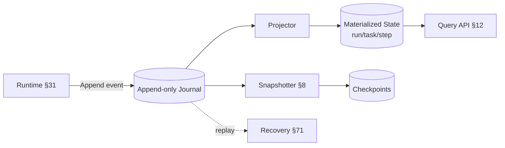
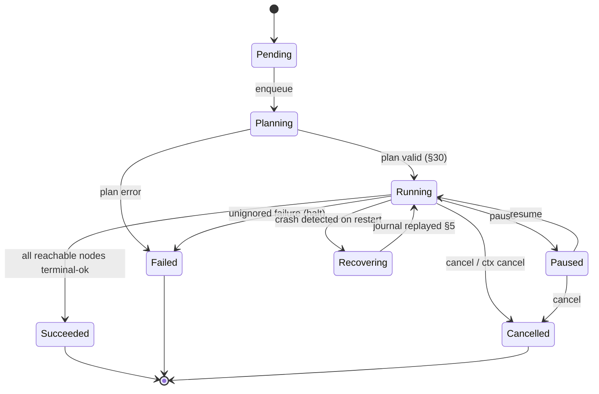
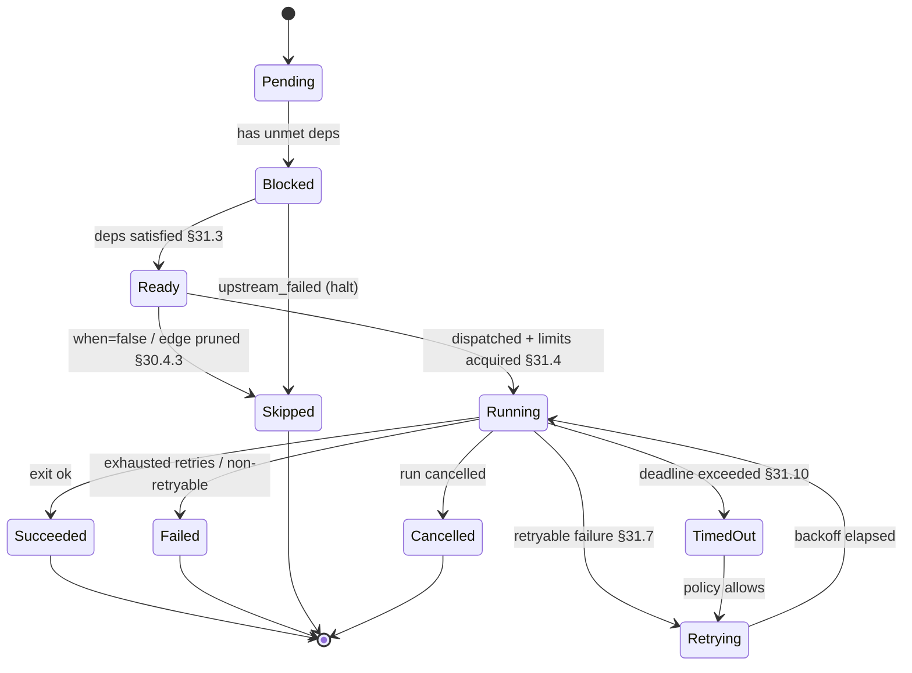
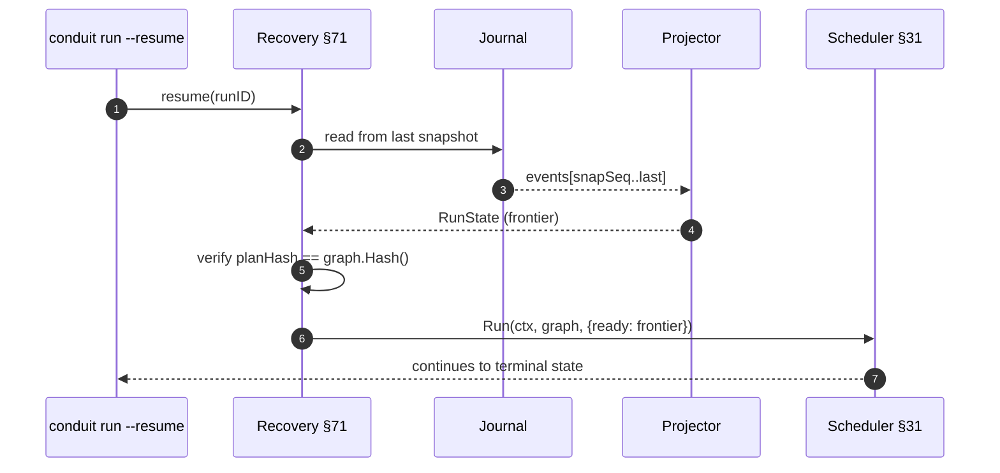

# 32 — State Management Design

> **Codename:** Conduit · **Module:** `github.com/conduit-io/conduit` · **Go:** 1.24+
> **Status:** Architecture & Design Baseline v1.0 · **Owner:** Execution Core
> **Related:** [DAG](30-workflow-dag.md) · [Runtime](31-execution-runtime.md) · [State](32-state-management.md) · [Recovery](71-recovery-strategy.md) · [Observability](64-observability.md)

This document specifies how Conduit persists and recovers execution state: the Run/Task/Step state
machines, the append-only event-sourced journal, persistence backends, checkpoint/resume, pause/cancel
semantics, delivery guarantees, concurrency & locking, snapshotting, retention/GC, the on-disk schema and
its migrations, and run-history querying.

RFC 2119 keywords apply per **RFC 8174**.

---

## 1. Model Overview

Conduit state is **event-sourced**: the source of truth is an append-only, ordered **run journal** of
immutable events. All queryable state (current run/task/step status, outputs, artifacts) is a
**materialized projection** of the journal. This gives us free auditability, crash-consistent recovery
(replay the journal), and a natural coordination log for distributed execution
([31 §13](31-execution-runtime.md)).



The three aggregates — **Run**, **Task**, **Step** — form a containment hierarchy (`Run 1..* Task 1..*
Step`). Each has its own state machine; a parent's state is a function of its children's.

---

## 2. State Machines

### 2.1 Run state machine



### 2.2 Task / Step state machine

Tasks and Steps share a state machine (a Task with one implicit step collapses; see
[30 §3.2](30-workflow-dag.md)).



Legal transitions are enforced in code; an illegal transition is a bug that fails the run loudly rather
than corrupting state.

```go
// transition returns the new state or an error if the transition is illegal.
func (m *StepMachine) transition(from, to StepState) error {
	if !stepTransitions[from][to] {
		return fmt.Errorf("illegal step transition %s -> %s", from, to)
	}
	return nil
}
```

---

## 3. Event-Sourced Journal

### 3.1 Event model

```go
package state

// EventType enumerates the append-only journal event kinds.
type EventType string

const (
	EvRunStarted    EventType = "run.started"
	EvRunFinished   EventType = "run.finished"
	EvRunPaused     EventType = "run.paused"
	EvRunResumed    EventType = "run.resumed"
	EvTaskStarted   EventType = "task.started"
	EvTaskFinished  EventType = "task.finished"
	EvStepAttempt   EventType = "step.attempt"    // one per retry attempt
	EvLog           EventType = "log"
	EvArtifact      EventType = "artifact"
	EvCheckpoint    EventType = "checkpoint"
	EvExpansion     EventType = "expansion"       // dynamic for_each cardinality
)

// Event is an immutable, ordered journal record. Seq is monotonic per run.
type Event struct {
	RunID   string          `json:"run"`
	Seq     uint64          `json:"seq"`      // monotonic; total order within a run
	Type    EventType       `json:"type"`
	Node    plan.NodeID     `json:"node,omitempty"`
	Attempt int             `json:"attempt,omitempty"`
	Ts      time.Time       `json:"ts"`
	Payload json.RawMessage `json:"payload"`  // type-specific body
	// Causal correlation for OTel (§64): trace/span the event was emitted under.
	TraceID string          `json:"trace,omitempty"`
	SpanID  string          `json:"span,omitempty"`
}
```

### 3.2 Journal interface

```go
// Journal is an append-only, totally-ordered event log per run.
type Journal interface {
	// Append persists e durably and returns its assigned Seq. It MUST be
	// atomic and fsync-durable before returning (write-then-ack, §6).
	Append(ctx context.Context, e Event) (seq uint64, err error)
	// Read streams events in Seq order from `after` (0 => from start).
	Read(ctx context.Context, runID string, after uint64) (iter.Seq2[Event, error])
	// LastSeq returns the highest committed Seq for a run (0 if none).
	LastSeq(ctx context.Context, runID string) (uint64, error)
}
```

### 3.3 Projector

```go
// Projector folds journal events into materialized run state. It is a pure
// left-fold: apply(state, event) -> state. Rebuilding from Seq 0 reconstructs
// the exact current state — the basis of crash recovery (§5).
type Projector interface {
	Apply(s *RunState, e Event) (*RunState, error)
	Rebuild(ctx context.Context, j Journal, runID string) (*RunState, error)
}
```

---

## 4. Persistence Backends

`Journal` + a `Store` (projection index) are pluggable. Three tiers ship in-box; a remote tier is an
extension point (mirrors the remote-execution seam in [31 §13](31-execution-runtime.md)).

| Backend | Journal impl | Use case | Durability |
|---|---|---|---|
| **In-memory** | ring/slice | ephemeral runs, dry-run, tests | none (lost on exit) |
| **BoltDB** (embedded) | bucket-per-run, key = `Seq` | default single-node | fsync per Append |
| **SQLite** (embedded) | `events` table, WAL mode | query-heavy history | WAL + fsync |
| **Remote** (pluggable) | gRPC to a state service | distributed/HA | backend-defined |

```go
// StateBackend bundles a Journal, a projection Store, and a Locker (§7).
type StateBackend interface {
	Journal() Journal
	Store() Store
	Locker() Locker
	Close() error
}
```

### 4.1 On-disk layout (BoltDB default)

```
<state_dir>/conduit.db                 (BoltDB file)
  bucket "meta"        key "schema"        -> uint32 schema version
  bucket "runs"        key <run_id>        -> RunHeader (json)
  bucket "journal:<run_id>"
                       key be64(seq)       -> Event (json/msgpack)
  bucket "snap:<run_id>"
                       key be64(seq)       -> Snapshot (§8)
  bucket "idx:status"  key <status>/<run>  -> nil     (secondary index §12)
  bucket "artifacts"   key <sha256>        -> Artifact meta (CAS in <state_dir>/cas/)
```

Keys are big-endian-encoded `Seq` so BoltDB's byte-ordered cursor yields events in journal order for
`O(events)` streaming reads.

---

## 5. Checkpoint & Resume

A **checkpoint** is a durable marker (`EvCheckpoint`) recording that all events up to some `Seq` are
consistently applied and it is safe to resume from there. On restart, the recovery path:

1. Finds runs in a non-terminal state (`Running`/`Paused`/`Recovering`).
2. Rebuilds `RunState` by folding the journal from the last **snapshot** (§8) forward (`Projector.Rebuild`).
3. Reconstructs the plan `Graph` and verifies `Graph.Hash()` matches the journaled `planHash`
   ([30 §7](30-workflow-dag.md)); a mismatch aborts resume (the `.flow` changed).
4. Re-derives the ready-set from completed nodes and hands control back to the scheduler in `ModeLive`,
   which continues from exactly the uncompleted frontier. In-flight-at-crash nodes are re-dispatched;
   idempotency keys ([31 §8](31-execution-runtime.md)) make keyed re-dispatch effectively-once.

```go
// Resume rebuilds state, validates the plan, and returns the frontier to run.
func Resume(ctx context.Context, be StateBackend, runID string, g *plan.Graph) (*ResumePoint, error) {
	st, err := be.Store().RebuildFromSnapshot(ctx, runID) // snapshot + tail replay
	if err != nil { return nil, err }
	if st.PlanHash != g.Hash() {
		return nil, ErrPlanDrift // §71 recovery hook
	}
	frontier := deriveFrontier(g, st) // uncompleted nodes with satisfied deps
	return &ResumePoint{State: st, Ready: frontier}, nil
}
```



---

## 6. Delivery Guarantees: Exactly-Once vs. At-Least-Once

- **Journal writes are exactly-once** within the store: `Append` is fsync-durable and idempotent on `Seq`
  (a re-append of an already-committed `Seq` is a no-op). This is the **write-then-ack** protocol — the
  runtime only advances a node's state after the corresponding event is committed.
- **Node *execution* is at-least-once** by default: a crash between "TaskStarted committed" and
  "TaskFinished committed" causes re-dispatch on resume. To make side effects **effectively-once**, nodes
  declare an `idempotency_key`; the runner short-circuits if a completed attempt for that key + plan hash
  already exists in the store ([31 §8](31-execution-runtime.md)).
- **Log/artifact events are at-least-once** and de-duplicated on read by `(Node, Attempt, Seq)`.

This split (exactly-once state, at-least-once effects + opt-in idempotency) is the standard,
crash-safe posture for workflow engines; true exactly-once side effects require cooperating,
idempotent downstream systems, which Conduit cannot guarantee unilaterally.

---

## 7. Concurrency & Locking

Within one engine, the scheduler is the single writer (see [31 §1](31-execution-runtime.md)), so the
journal needs no in-process locking on the write path. Across processes (a second `conduit` attaching to
the same run, or a resume racing a live run) we take a **run-scoped advisory lock**.

```go
// Locker guards a run against concurrent writers across processes.
type Locker interface {
	// Acquire takes an exclusive, fenced lock on runID. The returned token's
	// Fence monotonically increases so a stale holder's writes are rejected.
	Acquire(ctx context.Context, runID string) (Lock, error)
}
type Lock struct {
	RunID string
	Fence uint64      // fencing token; journal rejects Append below current fence
	Release func() error
}
```

BoltDB/SQLite use OS file locks; the remote backend uses a lease with a fencing token. Every `Append`
carries the holder's fence; the backend rejects appends from a stale fence, preventing split-brain if a
paused/crashed engine wakes up after another has taken over (a real hazard for [Recovery](71-recovery-strategy.md)).

---

## 8. Snapshotting

Rebuilding from `Seq 0` is `O(total events)`; for long runs (large fan-outs, many log events) that is slow.
The **Snapshotter** periodically writes a full `RunState` blob at a given `Seq`, so recovery folds only the
tail after the latest snapshot.

```go
type Snapshotter interface {
	// Snapshot serializes current RunState and records EvCheckpoint at seq.
	Snapshot(ctx context.Context, runID string, s *RunState, seq uint64) error
	// Latest returns the newest snapshot at or before `upto` (0 => any).
	Latest(ctx context.Context, runID string, upto uint64) (*Snapshot, uint64, error)
}
```

Policy: snapshot every `N` events or `T` seconds (whichever first), plus one on `pause` and on graceful
shutdown. Recovery cost becomes `O(snapshot size + tail events)`.

---

## 9. Pause / Cancel Semantics

- **Pause** (`conduit pause <run>`): scheduler stops admitting new nodes; in-flight nodes run to
  completion (pause is a *soft* stop — it does not kill work). `EvRunPaused` is journaled after the
  in-flight set drains to a clean checkpoint, guaranteeing resume starts from a consistent frontier.
- **Cancel** (`conduit cancel <run>`): scheduler stops admission and signals in-flight nodes
  (SIGTERM-equiv → grace → kill; see [31 §5.4](31-execution-runtime.md)). Partial outputs are journaled;
  the run enters terminal `Cancelled`.
- Both are driven by writing a control event other engines observe via the journal tail — the same
  mechanism a remote scheduler uses for coordination.

---

## 10. Garbage Collection & Retention

```go
type RetentionPolicy struct {
	MaxAge     time.Duration // delete terminal runs older than this
	MaxRuns    int           // keep at most N terminal runs (LRU by finish time)
	KeepFailed bool          // retain failed runs longer for triage
	CompactLogs bool         // drop verbose log events, keep step-level summary
}
```

GC only ever removes **terminal** runs (never `Running`/`Paused`). Deletion drops the run's journal,
snapshot, and secondary-index buckets, then unreferences its artifacts (CAS entries are refcounted and
swept separately). Log compaction can shrink a retained run by discarding `EvLog` events while keeping
`EvStepAttempt`/`EvTaskFinished` summaries, preserving auditability at lower cost.

---

## 11. State Schema & Migrations

The persisted schema is versioned in the `meta/schema` key. On open, the backend runs forward-only
migrations to the current version inside a single transaction; a failed migration rolls back and refuses to
open (fail-safe rather than corrupt).

```go
// Migration transforms the on-disk schema from V-1 to V. Migrations are
// forward-only, idempotent, and run in a single transaction.
type Migration interface {
	Version() uint32
	Up(tx Tx) error
}

// Migrator applies all pending migrations in order.
func (m *Migrator) Migrate(ctx context.Context, be StateBackend) error
```

Event payloads carry no schema version individually; instead the projector is **tolerant** (unknown fields
ignored, missing fields defaulted) so old journals replay under new code. Structural changes (renamed
buckets, new indexes) go through `Migration`.

### 11.1 Core structs

```go
type RunState struct {
	RunID    string
	Workflow string
	PlanHash [32]byte
	Status   RunStatus
	Started  time.Time
	Finished time.Time
	Inputs   map[string]any
	Nodes    map[plan.NodeID]*NodeState
	LastSeq  uint64            // highest applied event
}

type NodeState struct {
	ID        plan.NodeID
	Status    StepState
	Attempts  int
	Outputs   map[string]any
	Artifacts []Artifact
	Started   time.Time
	Finished  time.Time
	Error     string
}
```

---

## 12. Querying Run History

The `Store` exposes read-side queries served from the materialized projection + secondary indexes (BoltDB
`idx:*` buckets or SQLite tables), never by scanning journals.

```go
type Store interface {
	Get(ctx context.Context, runID string) (*RunState, error)
	List(ctx context.Context, f RunFilter) ([]RunHeader, error) // paged, indexed
	Timeline(ctx context.Context, runID string) (iter.Seq2[Event, error])
	Rebuild(ctx context.Context, runID string) (*RunState, error)
}

type RunFilter struct {
	Workflow string
	Status   []RunStatus
	Since    time.Time
	Limit    int
	Cursor   string // opaque pagination cursor
}
```

CLI surface: `conduit runs list --status failed --since 24h`, `conduit runs show <id>`,
`conduit runs timeline <id>` (renders the journal as an ordered event stream). SQLite backends additionally
allow ad-hoc SQL over an `events`/`runs` view for analytics.

---

## 13. Recovery Hooks

The state layer exposes hooks the **[Recovery Strategy](71-recovery-strategy.md)** binds to; state
management provides *mechanism*, recovery provides *policy*.

```go
// RecoveryHooks are invoked by the recovery controller (§71) during resume.
type RecoveryHooks interface {
	OnOrphanedRun(ctx context.Context, rs *RunState) (Decision, error) // resume | fail | discard
	OnPlanDrift(ctx context.Context, rs *RunState, cur [32]byte) (Decision, error)
	OnPartialNode(ctx context.Context, ns *NodeState) (Decision, error) // retry | skip | fail
	OnLockStolen(ctx context.Context, fence uint64) error               // yield to newer engine
}
```

- `OnOrphanedRun` — a `Running` run with no live engine (detected via lease expiry, §7).
- `OnPlanDrift` — journaled `planHash` ≠ current graph hash (the `.flow` changed since the run started).
- `OnPartialNode` — a node with `TaskStarted` but no `TaskFinished` at crash time.
- `OnLockStolen` — this engine's fence was superseded; it MUST stop writing immediately.

These tie recovery decisions to concrete state facts, keeping the recovery policy testable in isolation.

---

## 14. Complexity & Guarantees Summary

| Operation | Cost | Guarantee |
|---|---|---|
| `Append` | `O(1)` amortized + one fsync | durable, ordered, fenced |
| Rebuild (no snapshot) | `O(events)` | exact state reconstruction |
| Rebuild (with snapshot) | `O(snap + tail)` | same, faster recovery |
| `List` (indexed) | `O(page)` | no full scan |
| Resume | `O(snap + tail + frontier)` | continues from clean frontier |
| GC a run | `O(events + artifacts)` | terminal-only, refcounted CAS |

---

## 15. Cross-References

- Persists transitions driven by the **[Execution Runtime](31-execution-runtime.md)** (single-writer
  scheduler, idempotency, cancel/drain).
- Correlates against the plan hash and node IDs from **[Workflow DAG](30-workflow-dag.md)**.
- Supplies mechanism for the policy in **[Recovery Strategy](71-recovery-strategy.md)** via `RecoveryHooks`.
- Journal events carry trace/span IDs for **[Observability](64-observability.md)**; logs integrate with
  **[Logging](65-logging.md)**.
