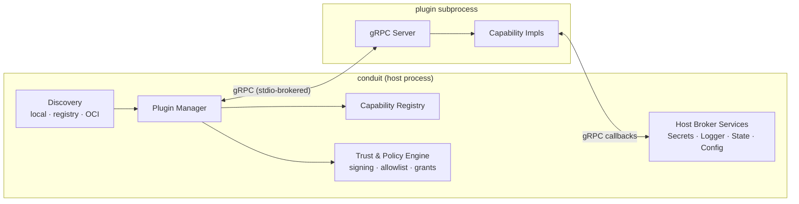
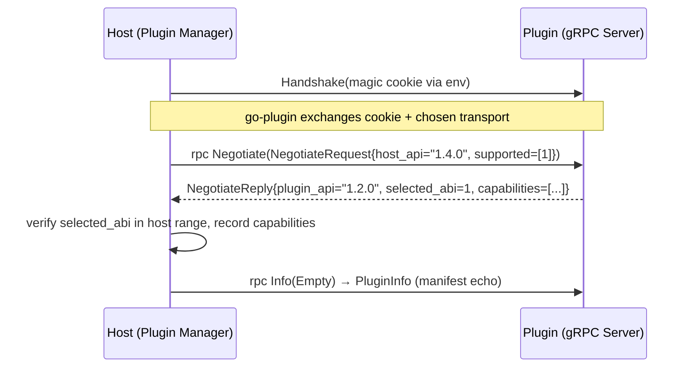
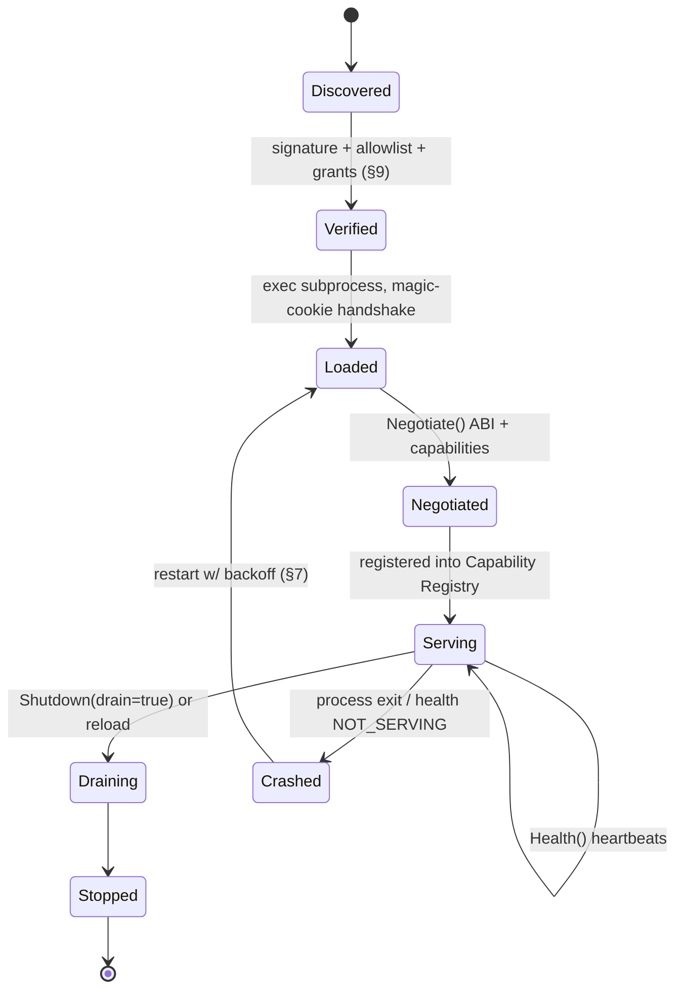
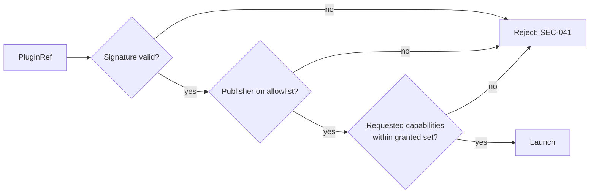
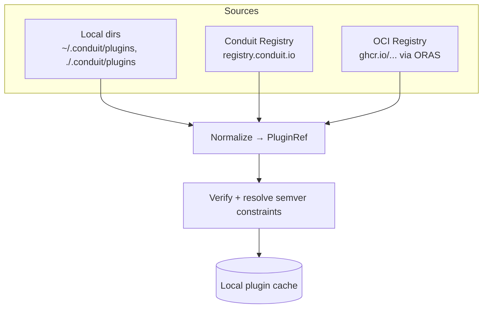
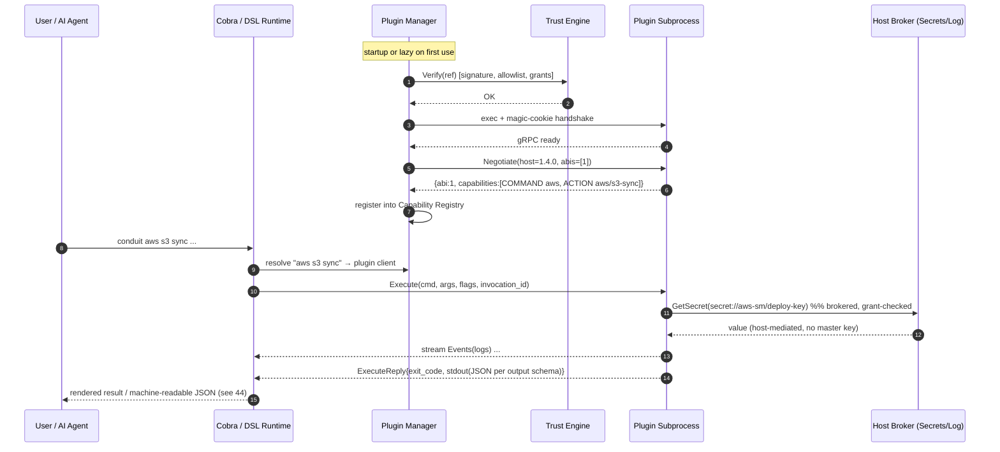

# 40 — Plugin Architecture

> **Codename:** Conduit · **Binary:** `conduit` (alias `cdt`) · **Module:** `github.com/conduit-io/conduit`
> **Status:** Architecture & Design Baseline v1.0 · **Owner:** Platform Architecture · **Date:** 2026-07-02
> **Scope:** The out-of-process plugin system that lets third parties extend Conduit safely.

**Related documents**
- [10 — Platform Architecture](10-platform-architecture.md) · [11 — Component Architecture](11-component-architecture.md)
- [41 — Extension SDK](41-extension-sdk.md) — the Go SDK used to *build* plugins described here
- [42 — Command Metadata Model](42-command-metadata.md) — metadata a plugin contributes for help/completion/AI
- [44 — Public SDK Design](44-public-sdk.md) — embedding Conduit itself
- [05 — Security Requirements](05-security-requirements.md) · [69 — Threat Model](69-threat-model.md) — `THREAT-###`/`SEC-###` referenced below
- [61 — Secrets Management](61-secrets-management.md) · [63 — Authorization](63-authorization.md) · [32 — State Management](32-state-management.md)

---

## 1. Goals & Non-Goals

**Goals**
- Extend Conduit **without recompiling the core** and without loading untrusted code into the host address space.
- One capability model that covers **commands, DSL actions (`uses`), completions, secret providers, state backends, and triggers**.
- **Strong isolation** (separate process), **explicit trust** (signing + allowlist + capability grants), and **crash containment**.
- A **versioned, negotiated protocol** so old hosts and new plugins interoperate within a major version.

**Non-Goals**
- In-process Go `plugin` package (`.so`) — rejected (`ADR-0041`) for portability, ABI fragility, and lack of isolation.
- Arbitrary network daemons — plugins are host-launched subprocesses, not long-lived services (though a plugin *may* proxy to one).

---

## 2. Technology Decision

Conduit uses **HashiCorp go-plugin over gRPC** (`ADR-0040`). Rationale:

| Requirement | How go-plugin/gRPC satisfies it |
|---|---|
| Process isolation | Each plugin is a child process; a crash cannot corrupt host memory. |
| Polyglot plugins | gRPC transport means plugins may be written in **any language** (see [41 §9](41-extension-sdk.md)). |
| Bidirectional streaming | gRPC server-streaming for logs/events; used for live workflow feedback. |
| Versioned handshake | go-plugin `HandshakeConfig` + our own protocol negotiation RPC. |
| Broker / nested services | go-plugin's gRPC broker lets host expose callbacks (secrets, logging) back to the plugin. |

---

## 3. Component Overview



- **Plugin Manager** — discovers, verifies, launches, health-checks, and shuts down plugins.
- **Capability Registry** — the merged view of everything plugins contribute; consumed by the Cobra tree, DSL resolver, completion engine, and AI API.
- **Host Broker Services** — gRPC services the *host* exposes to plugins over the go-plugin broker (secrets, structured logging, state, config).
- **Trust & Policy Engine** — enforces signature verification, allowlist, and per-capability grants (§9).

---

## 4. Handshake

go-plugin performs a two-layer handshake: a **magic-cookie handshake** (cheap mismatch guard) and then our **protocol negotiation RPC**.

### 4.1 Magic cookie & protocol version

```go
// internal/plugin/handshake.go
package plugin

import goplugin "github.com/hashicorp/go-plugin"

// Handshake is a UX/version guard: a wrong cookie means "this binary is not a
// Conduit plugin", producing a friendly error instead of a hang.
var Handshake = goplugin.HandshakeConfig{
    ProtocolVersion:  2, // go-plugin transport-level version; bump on breaking wire changes
    MagicCookieKey:   "CONDUIT_PLUGIN",
    MagicCookieValue: "c0nduit.plugin.v2",
}

// PluginSet maps the well-known dispenser name to its gRPC plugin impl.
// Every Conduit plugin implements exactly one dispenser: "conduit".
const DispenserName = "conduit"
```

### 4.2 Negotiated protocol version

The magic cookie is coarse. Fine-grained negotiation happens over gRPC immediately after connect, so a host can support a *range* of plugin ABI versions (§8).



---

## 5. Protobuf Service Definitions

The plugin exposes **one root service** (`Plugin`) plus **capability services** that are only served if the manifest declares them. The host exposes **broker services** back to the plugin.

```protobuf
// proto/conduit/plugin/v1/plugin.proto
syntax = "proto3";
package conduit.plugin.v1;
option go_package = "github.com/conduit-io/conduit/gen/plugin/v1;pluginv1";

import "google/protobuf/struct.proto";
import "google/protobuf/timestamp.proto";

// ---- Root service: every plugin serves this ----
service Plugin {
  rpc Negotiate (NegotiateRequest) returns (NegotiateReply);
  rpc Info      (InfoRequest)      returns (PluginInfo);
  rpc Health    (HealthRequest)    returns (HealthReply);
  rpc Shutdown  (ShutdownRequest)  returns (ShutdownReply);
  // Server-streaming log/event channel (see §10).
  rpc Events    (EventsRequest)    returns (stream Event);
}

message NegotiateRequest {
  string host_version    = 1; // conduit core semver, e.g. "1.4.0"
  repeated uint32 supported_abis = 2; // ABI major versions the host accepts
}
message NegotiateReply {
  string plugin_version  = 1;
  uint32 selected_abi    = 2;
  repeated Capability capabilities = 3;
}

message Capability {
  enum Kind {
    KIND_UNSPECIFIED    = 0;
    COMMAND             = 1; // contributes CLI subcommands
    ACTION              = 2; // contributes FlowDSL `uses:` actions
    COMPLETION          = 3; // dynamic shell/LSP completions
    SECRET_PROVIDER     = 4; // resolves secret:// URIs
    STATE_BACKEND       = 5; // persists workflow state
    TRIGGER             = 6; // event sources that start workflows
  }
  Kind   kind = 1;
  string id   = 2;  // e.g. "aws" (command), "aws/s3-sync" (action)
  string semver = 3;
  repeated string scopes = 4; // auth scopes this capability may request (see 63-authorization)
}

message PluginInfo {
  string name        = 1;
  string version     = 2;
  string description = 3;
  string publisher   = 4;
  Manifest manifest  = 5; // full manifest echo (schema in §11)
}
message InfoRequest {}
message Manifest { google.protobuf.Struct raw = 1; } // parsed manifest as struct

// ---- Health / lifecycle ----
message HealthRequest {}
message HealthReply {
  enum Status { UNKNOWN = 0; SERVING = 1; NOT_SERVING = 2; DRAINING = 3; }
  Status status = 1;
  string detail = 2;
}
message ShutdownRequest { bool drain = 1; }
message ShutdownReply {}

// ---- Streaming events / logs ----
message EventsRequest { string invocation_id = 1; }
message Event {
  google.protobuf.Timestamp ts = 1;
  enum Level { TRACE=0; DEBUG=1; INFO=2; WARN=3; ERROR=4; }
  Level  level = 2;
  string message = 3;
  map<string, string> fields = 4;
  string span_id = 5; // correlate with OTel (see 64-observability)
}
```

### 5.1 Capability services

```protobuf
// proto/conduit/plugin/v1/command.proto
service CommandService {
  rpc List    (Empty) returns (CommandList);       // metadata for help/completion/AI (see 42)
  rpc Execute (ExecuteRequest) returns (ExecuteReply);
}
message ExecuteRequest {
  string command_path = 1;        // e.g. "aws s3 sync"
  repeated string args = 2;
  map<string, string> flags = 3;
  string invocation_id = 4;       // ties to Events stream and host broker context
  bytes  stdin = 5;
}
message ExecuteReply {
  int32  exit_code = 1;
  bytes  stdout = 2;              // structured output honors declared output schema (see 42)
  bytes  stderr = 3;
}

// proto/conduit/plugin/v1/action.proto  (FlowDSL `uses:`)
service ActionService {
  rpc Describe (ActionRef) returns (ActionSpec);   // inputs/outputs schema for the DSL analyzer (see 24)
  rpc Run      (ActionRunRequest) returns (ActionRunReply);
}
message ActionRunRequest {
  string action_id = 1;
  google.protobuf.Struct with = 2;   // FlowDSL `with:` inputs (post CEL eval, see 25)
  string invocation_id = 3;
}
message ActionRunReply {
  google.protobuf.Struct outputs = 1; // bound into workflow state (see 32)
  bool   changed = 2;                 // idempotency signal
}

// proto/conduit/plugin/v1/providers.proto
service CompletionService  { rpc Complete (CompletionRequest) returns (CompletionReply); }
service SecretService      { rpc Resolve  (SecretRef)         returns (SecretValue); }
service StateService {
  rpc Get (StateKey) returns (StateValue);
  rpc Put (StatePut) returns (Empty);
  rpc Lock (LockRequest) returns (LockReply);
}
service TriggerService     { rpc Subscribe (TriggerConfig)    returns (stream TriggerEvent); }
message Empty {}
```

### 5.2 Host broker services (host → plugin callbacks)

```protobuf
// proto/conduit/host/v1/host.proto
package conduit.host.v1;
service HostServices {
  rpc GetSecret (SecretRequest) returns (SecretReply);      // brokered; enforces grants (see 61)
  rpc Log       (LogLine)       returns (Empty);
  rpc GetConfig (ConfigKey)     returns (ConfigValue);      // scoped config subtree (see 60)
  rpc EmitEvent (BusEvent)      returns (Empty);            // publish to internal bus (see 68)
}
```

The host serves `HostServices` over the go-plugin **gRPC broker**; the plugin dials back using a broker ID passed in the invocation context. This is how a plugin reads a secret **without ever seeing the master key** — the host mediates every access.

---

## 6. Plugin Lifecycle



1. **Discover** — enumerate candidate plugins from all sources (§10) → set of `PluginRef`.
2. **Verify** — Trust engine checks signature, allowlist, and requested capability grants (§9). Failure = never launched.
3. **Load** — `os/exec` the plugin with the handshake env; go-plugin negotiates transport.
4. **Handshake / Negotiate** — magic cookie then `Negotiate()`; host records `selected_abi` + `Capability` list.
5. **Serve** — capabilities registered into the Capability Registry; command tree, DSL resolver, completion engine now see them.
6. **Health** — periodic `Health()`; DRAINING/NOT_SERVING triggers recovery.
7. **Shutdown** — graceful `Shutdown(drain=true)` on host exit or `conduit plugin reload`; force-kill on timeout.

### 6.1 Manager skeleton

```go
// internal/plugin/manager.go
type Manager struct {
    trust   *TrustEngine
    disc    Discoverer
    reg     *CapabilityRegistry
    clients map[string]*managedClient // keyed by plugin name
    mu      sync.RWMutex
}

func (m *Manager) Load(ctx context.Context, ref PluginRef) error {
    if err := m.trust.Verify(ref); err != nil {
        return fmt.Errorf("trust check failed for %s: %w", ref.Name, err) // SEC-041
    }
    client := goplugin.NewClient(&goplugin.ClientConfig{
        HandshakeConfig:  Handshake,
        Plugins:          map[string]goplugin.Plugin{DispenserName: &GRPCPlugin{}},
        Cmd:              exec.Command(ref.Path, ref.Args...),
        AllowedProtocols: []goplugin.Protocol{goplugin.ProtocolGRPC},
        Managed:          true,
        Logger:           m.hclog(ref),
        // Sandboxing hooks (SysProcAttr, cgroup wrapper) applied here — see §9.4
        StartTimeout:     15 * time.Second,
    })
    rpcClient, err := client.Client()
    if err != nil { return err }
    raw, err := rpcClient.Dispense(DispenserName)
    if err != nil { return err }
    p := raw.(PluginClient)

    neg, err := p.Negotiate(ctx, &pluginv1.NegotiateRequest{
        HostVersion:   build.Version,
        SupportedAbis: SupportedABIs, // e.g. []uint32{1}
    })
    if err != nil { return err }
    if !abiSupported(neg.SelectedAbi) {
        return fmt.Errorf("plugin %s ABI %d unsupported", ref.Name, neg.SelectedAbi)
    }
    m.reg.Register(ref, neg.Capabilities, p)
    m.track(ref.Name, client, p) // starts health loop (§7)
    return nil
}
```

---

## 7. Health Checks & Crash Recovery

- **Heartbeat.** A supervisor goroutine calls `Health()` every `plugin.health.interval` (default `10s`, `NFR` latency-bounded). `NOT_SERVING` or `n` consecutive timeouts (default 3) mark the plugin unhealthy.
- **Process watch.** go-plugin's `Managed` clients expose exit; `client.Exited()` plus an `exec.Cmd.Wait` watcher detect crashes immediately, not just at the next heartbeat.
- **Restart policy.** Exponential backoff with jitter (`base=500ms`, `cap=30s`, `maxRestarts=5` per rolling 10 min). Exceeding the budget marks the plugin **quarantined** and surfaces `RISK`-tagged diagnostics.
- **In-flight calls.** A crash mid-`Execute`/`Run` returns a typed `PluginCrashError`; the runtime ([31](31-execution-runtime.md)) applies the step's retry/`on_error` policy. State writes are **transactional** ([32](32-state-management.md)) so a crash never leaves half-committed workflow state.
- **Circuit breaking.** Repeatedly failing capabilities are tripped open and excluded from the registry until manual `conduit plugin reload <name>`.

```go
func (m *Manager) supervise(name string, mc *managedClient) {
    t := time.NewTicker(m.cfg.HealthInterval)
    defer t.Stop()
    fails := 0
    for {
        select {
        case <-mc.done:
            m.onCrash(name, mc); return
        case <-t.C:
            h, err := mc.p.Health(mc.ctx, &pluginv1.HealthRequest{})
            if err != nil || h.Status == pluginv1.HealthReply_NOT_SERVING {
                if fails++; fails >= m.cfg.HealthFailThreshold {
                    m.recover(name, mc) // restart w/ backoff or quarantine
                    return
                }
                continue
            }
            fails = 0
        }
    }
}
```

---

## 8. Versioned Protocol & Negotiation

Three independent version axes, all **SemVer**:

| Axis | Meaning | Compatibility rule |
|---|---|---|
| **Transport `ProtocolVersion`** | go-plugin wire framing (`Handshake.ProtocolVersion`). | Exact match required; bump only on framing changes. |
| **ABI major** (`selected_abi`) | Shape of the protobuf service surface. | Host advertises a set; plugin selects one it supports. Additive (new fields, new optional RPCs) stays within a major. |
| **Plugin semver** | The plugin's own product version. | Reported for display, dependency resolution, and manifest constraints. |

**Rules**
- The host MUST accept any plugin whose `selected_abi` is in `SupportedABIs`.
- New RPCs/fields are added **backward-compatibly** within an ABI major (proto3 field-number discipline; never reuse/renumber).
- A breaking change bumps ABI major; the host may support **N and N-1** during a deprecation window (`83-api-standards-versioning`).
- Manifest `requires.conduit` gives a SemVer constraint on the host (e.g. `>=1.4.0 <2.0.0`); the manager refuses to load on mismatch.

---

## 9. Isolation, Sandboxing & Trust

Maps directly to `SEC-###` / `THREAT-###` in [05](05-security-requirements.md) and [69](69-threat-model.md).

### 9.1 Trust chain (before any code runs)



- **Signing (`SEC-040`).** Plugin artifacts are **Sigstore/cosign**-signed (or minisign for air-gapped). The manifest carries a signature over the binary digest + manifest. `conduit plugin verify` and load-time both check it. Counters `THREAT-` supply-chain tampering (STRIDE: Tampering).
- **Allowlist (`SEC-042`).** `conduit.yaml → plugins.allow` pins trusted publishers/digests. Anything else is refused (or requires `--allow-untrusted`, which is audit-logged).
- **Capability grants (`SEC-043`).** A manifest *declares* capabilities and *requests* scopes; the operator *grants* them (`plugins.grants`). A plugin that requests `SECRET_PROVIDER` or `state.write` but is not granted it is loaded with that capability **disabled**. Grants map onto auth scopes in [63](63-authorization.md).

### 9.2 Process isolation

- Separate process, no shared address space (containment of memory-safety and panic faults — STRIDE: Elevation of Privilege / Denial of Service).
- Dropped privileges: launched with a restricted `SysProcAttr` (Linux: new PID/mount namespaces where available, `NoNewPrivileges`; Windows: restricted token / Job Object). Optional cgroup/Job-Object **resource limits** (CPU, memory, wall-clock) enforce fair-use and bound runaway plugins (`NFR`).

### 9.3 Brokered access, not ambient authority

Plugins get **no** direct filesystem/network/secret access by default. They obtain resources only through **Host Broker Services** (§5.2), each grant-checked. Secrets are never handed the master key — the host resolves `secret://` refs on the plugin's behalf and returns only the specific value ([61](61-secrets-management.md)).

### 9.4 Sandbox wrapper

```go
// internal/plugin/sandbox_linux.go
func sandboxAttr(g Grants) *syscall.SysProcAttr {
    a := &syscall.SysProcAttr{Setpgid: true}
    a.Cloneflags = syscall.CLONE_NEWPID | syscall.CLONE_NEWNS
    if !g.Has("net") { a.Cloneflags |= syscall.CLONE_NEWNET } // no network unless granted
    a.AmbientCaps = nil                                       // drop all caps
    return a
}
```

### 9.5 Security controls summary

| Control | Threat mitigated | Ref |
|---|---|---|
| Cosign signature verification | Malicious/altered plugin | `SEC-040`, `THREAT-supply-chain` |
| Publisher/digest allowlist | Rogue plugin substitution | `SEC-042` |
| Capability grants + scopes | Over-privileged plugin | `SEC-043`, [63](63-authorization.md) |
| Process + namespace isolation | Host compromise, DoS | `SEC-044`, `NFR` |
| Brokered secrets/state/config | Secret exfiltration | `SEC-045`, [61](61-secrets-management.md) |
| Audit log of every load/grant | Repudiation | [65](65-logging.md) |

---

## 10. Discovery

The Discoverer produces `PluginRef`s from multiple sources, resolved in priority order and de-duplicated by name (highest-priority, then highest semver wins).



- **Local directory.** Executables matching `conduit-plugin-*` (or listed in a lockfile) under `plugins.paths`. Zero-config for development.
- **Conduit Registry.** `conduit plugin install cloud@^2.1` resolves against `registry.conduit.io`, downloads, verifies signature, caches.
- **OCI.** Plugins distributed as OCI artifacts (media type `application/vnd.conduit.plugin.v1+gzip`) pulled with **ORAS**; enables using existing container registries and their RBAC. Digest-pinned in `conduit.lock`.

`conduit plugin list|install|remove|verify|reload|grant` drive these. A `conduit.lock` pins resolved digests for reproducibility ([81](81-build-release-cicd.md)).

---

## 11. Plugin Manifest Schema

Every plugin ships `conduit-plugin.yaml` (embedded and echoed via `Info()`), validated against a JSON Schema at load time.

```yaml
# conduit-plugin.yaml
apiVersion: conduit.io/plugin/v1
kind: Plugin
metadata:
  name: aws
  version: 2.3.1                 # SemVer
  publisher: conduit-io
  description: AWS commands, actions, secret & state providers.
  homepage: https://github.com/conduit-io/plugin-aws
spec:
  abi: 1                          # plugin protocol ABI major
  requires:
    conduit: ">=1.4.0 <2.0.0"     # host SemVer constraint
  entrypoint: conduit-plugin-aws  # binary name
  capabilities:
    - kind: COMMAND
      id: aws
      scopes: [aws.read, aws.write]
    - kind: ACTION
      id: aws/s3-sync
    - kind: SECRET_PROVIDER
      id: aws-secretsmanager      # resolves secret://aws-sm/...
      scopes: [secrets.read]
    - kind: STATE_BACKEND
      id: aws-s3-state
      scopes: [state.read, state.write]
    - kind: TRIGGER
      id: aws/sqs
  signing:
    cosign: true
    certificateIdentity: https://github.com/conduit-io/plugin-aws/.github/workflows/release.yml
  resources:                      # optional sandbox limits (§9.2)
    memoryMiB: 512
    cpuMillis: 1000
    network: allow                # allow|deny per capability grant
```

```jsonc
// JSON Schema (excerpt) — full schema at schemas/plugin-manifest.v1.json
{
  "$id": "https://schemas.conduit.io/plugin-manifest.v1.json",
  "type": "object",
  "required": ["apiVersion", "kind", "metadata", "spec"],
  "properties": {
    "spec": {
      "type": "object",
      "required": ["abi", "entrypoint", "capabilities"],
      "properties": {
        "abi": { "type": "integer", "minimum": 1 },
        "requires": { "type": "object",
          "properties": { "conduit": { "type": "string" } } },
        "capabilities": { "type": "array", "minItems": 1,
          "items": { "$ref": "#/$defs/capability" } }
      }
    }
  }
}
```

---

## 12. End-to-End Sequence: Load + Invoke



---

## 13. Contribution Points Recap

| Capability | Host consumer | Cross-ref |
|---|---|---|
| `COMMAND` | Cobra command tree, help, completion, AI API | [42](42-command-metadata.md), [50](50-completion-engine.md) |
| `ACTION` (`uses:`) | FlowDSL semantic analysis + runtime | [24](24-semantic-analysis.md), [31](31-execution-runtime.md) |
| `COMPLETION` | Completion engine + LSP | [50](50-completion-engine.md), [56](56-lsp-architecture.md) |
| `SECRET_PROVIDER` | Secret resolver (`secret://`) | [61](61-secrets-management.md) |
| `STATE_BACKEND` | State store | [32](32-state-management.md) |
| `TRIGGER` | Event bus / workflow starters | [67](67-event-model.md), [68](68-message-bus.md) |

See [92 — Sample Plugin Implementations](92-sample-plugins.md) for full worked examples, and [41 — Extension SDK](41-extension-sdk.md) to build one.
