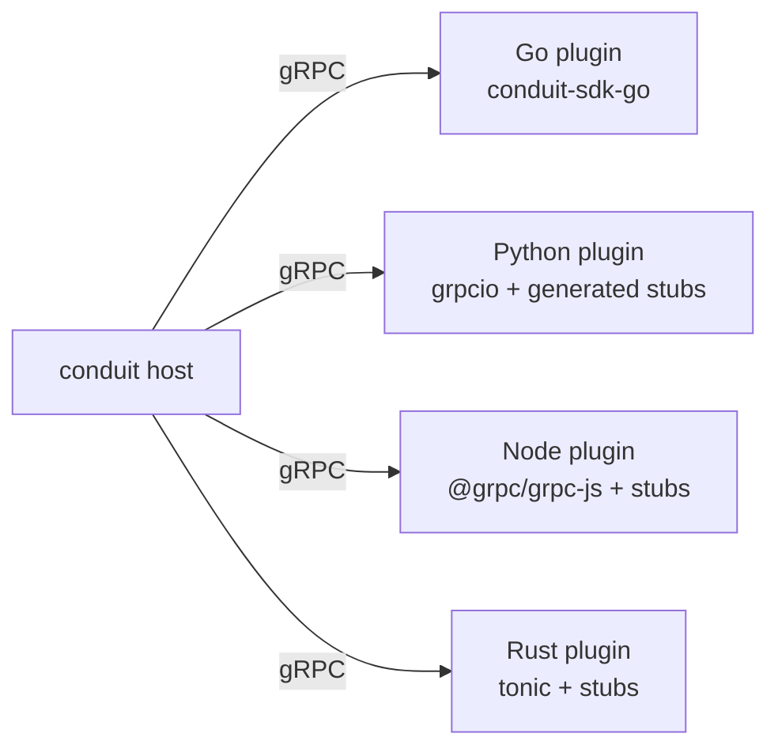
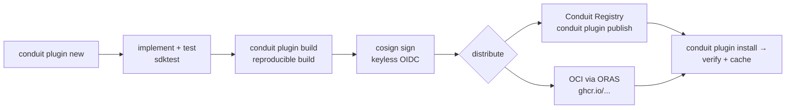

# 41 — Extension SDK (`conduit-sdk-go`)

> **Codename:** Conduit · **Binary:** `conduit` (alias `cdt`) · **Module:** `github.com/conduit-io/conduit`
> **Status:** Architecture & Design Baseline v1.0 · **Owner:** Platform Architecture · **Date:** 2026-07-02
> **Scope:** The developer-facing Go SDK for **building** plugins, plus the polyglot gRPC path.

**Related documents**
- [40 — Plugin Architecture](40-plugin-architecture.md) — the runtime/protocol this SDK targets
- [42 — Command Metadata Model](42-command-metadata.md) — the metadata structs the SDK surfaces
- [44 — Public SDK Design](44-public-sdk.md) — embedding Conduit (distinct from *extending* it)
- [72 — Testing Strategy](72-testing-strategy.md) · [83 — API Standards / Versioning](83-api-standards-versioning.md)
- [92 — Sample Plugin Implementations](92-sample-plugins.md)

---

## 1. What the SDK Is

`conduit-sdk-go` (module `github.com/conduit-io/conduit-sdk-go`) is a **separate, thin, stable** module that plugin authors depend on. It wraps the go-plugin/gRPC machinery from [40](40-plugin-architecture.md) so authors implement **plain Go interfaces** and never touch protobuf or process handshakes directly.

Design principles:
- **Small surface, strong stability.** The SDK follows a stricter compat policy than the core ([§8](#8-versioning--compatibility-guarantees)).
- **Interface-first.** Implement only the capabilities you need.
- **Batteries included for testing.** In-process harness so plugins are unit-testable without spawning subprocesses.

---

## 2. Package Layout

```
conduit-sdk-go/
├── go.mod                       // module github.com/conduit-io/conduit-sdk-go
├── sdk/
│   ├── plugin.go                // Plugin, Serve(), Registration
│   ├── command.go               // CommandProvider, Command, ExecContext
│   ├── action.go                // ActionProvider, Action (FlowDSL `uses:`)
│   ├── completion.go            // CompletionProvider
│   ├── secrets.go               // SecretProvider
│   ├── state.go                 // StateBackend
│   ├── trigger.go               // TriggerProvider
│   ├── meta/                    // re-exported command-metadata structs (see 42)
│   ├── hostapi/                 // Host services handed to plugins: Logger, Secrets, Config, State
│   └── version.go               // SDKVersion, ABI constant
├── sdktest/                     // in-process test harness (see §6)
│   └── harness.go
└── internal/
    └── transport/               // generated gRPC glue (hidden from authors)
```

Authors import `sdk` and (in tests) `sdktest`. Everything under `internal/` — the protobuf/go-plugin wiring from [40](40-plugin-architecture.md) — is invisible.

---

## 3. Base Interfaces

```go
// sdk/plugin.go
package sdk

import "context"

// Plugin is the root every plugin implements. Info powers the manifest echo,
// help, docs-gen, and the AI API.
type Plugin interface {
    Info(context.Context) (PluginInfo, error)
}

// Capability provider interfaces — implement any subset. The SDK detects which
// are implemented (type assertions) and advertises the matching capabilities
// during Negotiate (see 40 §4/§5).
type CommandProvider interface {
    Commands(context.Context) ([]Command, error)
    Execute(context.Context, *ExecContext) (*ExecResult, error)
}

type ActionProvider interface {
    Actions(context.Context) ([]ActionSpec, error)          // schema for DSL analyzer (see 24)
    RunAction(context.Context, *ActionContext) (*ActionResult, error)
}

type CompletionProvider interface {
    Complete(context.Context, *CompletionRequest) ([]Completion, error)
}

type SecretProvider interface {
    Resolve(context.Context, SecretRef) (SecretValue, error) // secret:// scheme (see 61)
}

type StateBackend interface {
    Get(context.Context, string) ([]byte, bool, error)
    Put(context.Context, string, []byte) error
    Lock(context.Context, string) (Unlock func() error, err error)
}

type TriggerProvider interface {
    Subscribe(context.Context, TriggerConfig, func(TriggerEvent) error) error
}
```

```go
// sdk/command.go
type Command struct {
    Meta meta.Command // full metadata model from doc 42 (help/completion/AI/docs)
}

// ExecContext is everything a command needs at runtime.
type ExecContext struct {
    Path  []string          // e.g. ["aws","s3","sync"]
    Args  []string
    Flags map[string]any
    Stdin []byte

    // Host access — brokered, grant-checked (see 40 §5.2 / §9.3)
    Log     hostapi.Logger
    Secrets hostapi.Secrets
    Config  hostapi.Config
    State   hostapi.State
}

type ExecResult struct {
    ExitCode int
    Stdout   []byte // SHOULD conform to the command's declared output schema (see 42)
    Stderr   []byte
}
```

### 3.1 Host API handed to plugins

```go
// sdk/hostapi/hostapi.go
package hostapi

type Logger interface {
    Debug(msg string, kv ...any)
    Info(msg string, kv ...any)
    Warn(msg string, kv ...any)
    Error(msg string, kv ...any)
    With(kv ...any) Logger // structured; forwarded to host logging/OTel (see 64, 65)
}

// Secrets never exposes the master key; the host resolves and returns only the
// requested value, subject to capability grants (see 40 §9, 61).
type Secrets interface {
    Get(ctx context.Context, ref string) (string, error) // ref = "secret://provider/key"
}

type Config interface {
    Get(ctx context.Context, key string) (any, bool, error) // scoped subtree only (see 60)
}

type State interface {
    Get(ctx context.Context, key string) ([]byte, bool, error)
    Put(ctx context.Context, key string, val []byte) error
}
```

Everything a plugin can touch outside its own process arrives through these interfaces — there is **no ambient authority** ([40 §9.3](40-plugin-architecture.md)).

---

## 4. `Serve` — the plugin `main`

```go
// sdk/plugin.go
// Serve wires the author's implementation into go-plugin/gRPC and blocks.
// It negotiates ABI, advertises capabilities, and starts the health server.
func Serve(p Plugin) {
    reg := detectCapabilities(p) // type-asserts CommandProvider, ActionProvider, ...
    transport.ServeGRPC(transport.Config{
        Handshake:    transport.Handshake, // mirrors host (see 40 §4.1)
        ABI:          ABI,                  // SDK-pinned ABI major
        Plugin:       p,
        Capabilities: reg,
    })
}
```

Author's `main.go` is three lines:

```go
package main

import "github.com/conduit-io/conduit-sdk-go/sdk"

func main() { sdk.Serve(&HelloPlugin{}) }
```

---

## 5. Scaffolding — `conduit plugin new`

```bash
$ conduit plugin new hello --caps action,command
```

Generates a ready-to-build, ready-to-test module:

```
hello/
├── go.mod                      // requires github.com/conduit-io/conduit-sdk-go
├── conduit-plugin.yaml         // manifest (see 40 §11), pre-filled from flags
├── main.go                     // sdk.Serve(&HelloPlugin{})
├── plugin.go                   // HelloPlugin + Info()
├── action.go                   // implements ActionProvider (from --caps)
├── command.go                  // implements CommandProvider
├── plugin_test.go              // sdktest harness scaffolding
├── .github/workflows/release.yml // cosign signing + OCI publish (see 40 §9/§10)
└── README.md
```

Flags: `--caps` (subset of `command,action,completion,secret,state,trigger`), `--publisher`, `--abi`. The generated `release.yml` wires **cosign keyless signing** and **ORAS** OCI publish so the plugin is distributable and trusted out of the box.

---

## 6. Testing Harness (in-process test server)

`sdktest` runs the plugin **in the same process** — no subprocess, no gRPC socket — using an in-memory host that records interactions. Fast, deterministic, debuggable.

```go
// sdktest/harness.go
package sdktest

// New returns a Harness wrapping the plugin with fake host services.
func New(t *testing.T, p sdk.Plugin, opts ...Option) *Harness

type Harness struct { /* ... */ }

func (h *Harness) Exec(path []string, args []string, flags map[string]any) (*sdk.ExecResult, error)
func (h *Harness) RunAction(id string, with map[string]any) (*sdk.ActionResult, error)
func (h *Harness) Complete(req sdk.CompletionRequest) ([]sdk.Completion, error)

// Fakes you configure/inspect:
func (h *Harness) WithSecret(ref, val string) *Harness  // seed brokered secrets
func (h *Harness) WithConfig(key string, v any) *Harness
func (h *Harness) Logs() []LogLine                       // assert on structured logs
func (h *Harness) State() map[string][]byte              // inspect state writes
```

Example test:

```go
func TestHelloAction(t *testing.T) {
    h := sdktest.New(t, &HelloPlugin{}).WithConfig("greeting", "Hi")
    res, err := h.RunAction("hello/greet", map[string]any{"name": "Ada"})
    require.NoError(t, err)
    require.Equal(t, "Hi, Ada!", res.Outputs["message"])
    require.True(t, res.Changed)
}
```

An **optional** conformance suite (`sdktest.Conformance(t, p)`) exercises the real subprocess + gRPC path to catch serialization issues — used in CI ([72](72-testing-strategy.md)).

---

## 7. Context, Logger & Secrets Access

At runtime the host injects the broker context; the SDK surfaces it as the `ExecContext.Log/Secrets/Config/State` fields and as the `hostapi` interfaces on `ActionContext`. Under the hood these are gRPC callbacks to **Host Broker Services** ([40 §5.2](40-plugin-architecture.md)):

- **Logger** → forwarded to host structured logging + OTel spans, correlated by `invocation_id` ([64](64-observability.md), [65](65-logging.md)).
- **Secrets** → host-mediated resolution of `secret://…`; grant-checked; master key never leaves the host ([61](61-secrets-management.md)).
- **Config** → read-only scoped subtree ([60](60-configuration.md)).
- **State** → transactional K/V for cross-step data ([32](32-state-management.md)).

The `context.Context` also carries deadlines/cancellation propagated from the host so a cancelled workflow tears down plugin work cleanly.

---

## 8. Versioning & Compatibility Guarantees

The SDK carries **two** versions:

| Version | Meaning | Policy |
|---|---|---|
| **SDK semver** (`sdk.SDKVersion`) | The `conduit-sdk-go` module release. | SemVer; **no breaking changes within a major**. Additive only. |
| **ABI major** (`sdk.ABI`) | Wire protocol major (matches [40 §8](40-plugin-architecture.md)). | Rarely bumped; host supports N and N-1. |

Guarantees ([83](83-api-standards-versioning.md)):
- Exported interfaces/structs in `sdk` and `sdktest` are **stable within a major**. New methods are added via **new optional interfaces**, never by widening existing ones.
- A plugin built against SDK `v1.x` runs on any host advertising the same ABI major, regardless of host minor/patch.
- Deprecations are marked `// Deprecated:` for one major before removal.

---

## 9. Non-Go Plugins (any language over gRPC)

Because the transport is **gRPC with a published `.proto`** ([40 §5](40-plugin-architecture.md)), plugins may be written in **any language** with a gRPC stack. The Go SDK is a convenience, not a requirement.

A non-Go plugin MUST:
1. Implement `conduit.plugin.v1.Plugin` (Negotiate/Info/Health/Shutdown/Events) plus the capability services it advertises.
2. Speak the go-plugin handshake: print the handshake line on stdout at startup:
   `1|2|tcp|127.0.0.1:1234|grpc` (core-protocol | app-protocol | net | addr | proto).
3. Honor the magic cookie env (`CONDUIT_PLUGIN=c0nduit.plugin.v2`).
4. Dial back **Host Broker Services** using the broker ID passed in metadata.

Reference stubs are generated from the same protos (`buf generate`) for Python, TypeScript/Node, and Rust; a minimal Python plugin lives in [92](92-sample-plugins.md). Signing, allowlist, and grants ([40 §9](40-plugin-architecture.md)) apply identically regardless of language.



---

## 10. Publishing Flow



1. `conduit plugin build` — reproducible build, embeds manifest, emits digest.
2. **Sign** — cosign keyless (Fulcio/Rekor) or minisign; signature covers binary digest + manifest ([40 §9.1](40-plugin-architecture.md)).
3. **Publish** — `conduit plugin publish` to the Conduit Registry, and/or `oras push` to any OCI registry.
4. **Install** — consumers `conduit plugin install aws@^2.1`; the manager verifies signature + allowlist + grants before first launch.

---

## 11. Full Example — a "hello" Action Plugin

A complete, buildable plugin contributing a FlowDSL action `hello/greet` and a `hello` command.

`conduit-plugin.yaml`:

```yaml
apiVersion: conduit.io/plugin/v1
kind: Plugin
metadata:
  name: hello
  version: 0.1.0
  publisher: acme
  description: Minimal example plugin.
spec:
  abi: 1
  requires: { conduit: ">=1.4.0 <2.0.0" }
  entrypoint: conduit-plugin-hello
  capabilities:
    - { kind: ACTION,  id: hello/greet }
    - { kind: COMMAND, id: hello }
```

`plugin.go`:

```go
package main

import (
    "context"
    "github.com/conduit-io/conduit-sdk-go/sdk"
)

type HelloPlugin struct{}

func (p *HelloPlugin) Info(context.Context) (sdk.PluginInfo, error) {
    return sdk.PluginInfo{Name: "hello", Version: "0.1.0", Publisher: "acme"}, nil
}
```

`action.go`:

```go
package main

import (
    "context"
    "fmt"
    "github.com/conduit-io/conduit-sdk-go/sdk"
    "github.com/conduit-io/conduit-sdk-go/sdk/meta"
)

// Advertise the action + its input/output schema for the DSL analyzer (see 24).
func (p *HelloPlugin) Actions(context.Context) ([]sdk.ActionSpec, error) {
    return []sdk.ActionSpec{{
        ID:      "hello/greet",
        Summary: "Greet someone by name.",
        Inputs: meta.Schema{Fields: []meta.Field{
            {Name: "name", Type: "string", Required: true},
        }},
        Outputs: meta.Schema{Fields: []meta.Field{
            {Name: "message", Type: "string"},
        }},
    }}, nil
}

func (p *HelloPlugin) RunAction(ctx context.Context, ac *sdk.ActionContext) (*sdk.ActionResult, error) {
    name, _ := ac.With["name"].(string)
    greeting := "Hello"
    if g, ok, _ := ac.Config.Get(ctx, "greeting"); ok { greeting, _ = g.(string) }
    ac.Log.Info("greeting user", "name", name)
    return &sdk.ActionResult{
        Outputs: map[string]any{"message": fmt.Sprintf("%s, %s!", greeting, name)},
        Changed: true,
    }, nil
}
```

`command.go`:

```go
package main

import (
    "context"
    "github.com/conduit-io/conduit-sdk-go/sdk"
    "github.com/conduit-io/conduit-sdk-go/sdk/meta"
)

func (p *HelloPlugin) Commands(context.Context) ([]sdk.Command, error) {
    return []sdk.Command{{Meta: meta.Command{
        Name:      "hello",
        Group:     "examples",
        Summary:   "Print a greeting.",
        Stability: meta.StabilityExperimental,
        Since:     "0.1.0",
        Flags: []meta.Flag{{
            Name: "name", Type: "string", Default: "world",
            Usage: "who to greet", Env: "HELLO_NAME",
        }},
        Examples: []meta.Example{{Command: "conduit hello --name Ada", Description: "Greet Ada"}},
        OutputSchema: `{"type":"object","properties":{"message":{"type":"string"}}}`,
        SideEffects:  meta.SideEffectNone, // pure/idempotent
    }}}, nil
}

func (p *HelloPlugin) Execute(ctx context.Context, ec *sdk.ExecContext) (*sdk.ExecResult, error) {
    name, _ := ec.Flags["name"].(string)
    return &sdk.ExecResult{
        ExitCode: 0,
        Stdout:   []byte(`{"message":"Hello, ` + name + `!"}`),
    }, nil
}
```

`main.go`:

```go
package main

import "github.com/conduit-io/conduit-sdk-go/sdk"

func main() { sdk.Serve(&HelloPlugin{}) }
```

Using it from FlowDSL:

```flow
# greet.flow
workflow "greet" {
  step "say-hi" {
    uses: "hello/greet"          # provided by the plugin above
    with: { name: "${ input.user }" }
  }
  step "echo" {
    run: "echo ${ steps.say-hi.outputs.message }"
  }
}
```

See [92 — Sample Plugin Implementations](92-sample-plugins.md) for larger examples (secret provider, state backend, trigger) and [40 — Plugin Architecture](40-plugin-architecture.md) for the runtime this SDK targets.
