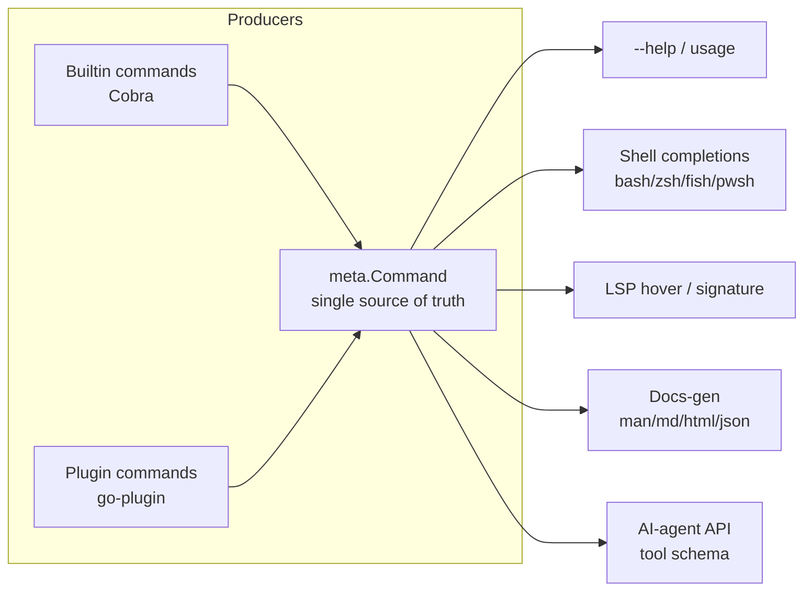

# 42 — Command Metadata Model

> **Codename:** Conduit · **Binary:** `conduit` (alias `cdt`) · **Module:** `github.com/conduit-io/conduit`
> **Status:** Architecture & Design Baseline v1.0 · **Owner:** Platform Architecture · **Date:** 2026-07-02
> **Scope:** The single, authoritative metadata model that every command (builtin **and** plugin) declares.

**Related documents**
- [40 — Plugin Architecture](40-plugin-architecture.md) · [41 — Extension SDK](41-extension-sdk.md) — plugins contribute this metadata
- [43 — Documentation Generation](43-documentation-generation.md) — consumes this model
- [44 — Public SDK Design](44-public-sdk.md) — exposes it to AI agents
- [50 — Completion Engine](50-completion-engine.md) · [56 — LSP Architecture](56-lsp-architecture.md) — consumers
- [63 — Authorization](63-authorization.md) — `auth scopes`; [83 — API Standards / Versioning](83-api-standards-versioning.md) — stability/since/deprecation

---

## 1. Why One Model

Help text, shell completion, the LSP, generated docs, and the AI-agent API historically drift apart because each is written by hand. Conduit fixes this with **one metadata struct that is the single source of truth**. Everything else is a *projection* of it.



Both builtins and plugins ([40](40-plugin-architecture.md)) feed the same registry, so a plugin command is a first-class citizen in help, completion, LSP, docs, and the AI API.

---

## 2. The Metadata Struct

```go
// pkg/meta/command.go  (re-exported by conduit-sdk-go/sdk/meta — see 41)
package meta

type Command struct {
    // Identity
    Name    string   `json:"name"`              // leaf name, e.g. "sync"
    Path    []string `json:"path,omitempty"`    // full path, e.g. ["s3","sync"]
    Aliases []string `json:"aliases,omitempty"`
    Group   string   `json:"group,omitempty"`   // help grouping, e.g. "storage"

    // Human docs
    Summary string `json:"summary"`             // one line
    Long    string `json:"long,omitempty"`      // multi-paragraph
    Examples []Example `json:"examples,omitempty"`

    // Contract
    Args  ArgsSchema `json:"args,omitempty"`
    Flags []Flag     `json:"flags,omitempty"`

    // Lifecycle & stability (see 83)
    Stability   Stability    `json:"stability"`          // experimental|beta|stable|deprecated
    Since       string       `json:"since,omitempty"`    // SemVer introduced
    Deprecation *Deprecation `json:"deprecation,omitempty"`

    // Machine contract
    OutputSchema string      `json:"outputSchema,omitempty"` // JSON Schema of --output=json
    SideEffects  SideEffect  `json:"sideEffects"`            // none|read|write|external
    Idempotent   bool        `json:"idempotent"`
    AuthScopes   []string    `json:"authScopes,omitempty"`   // required scopes (see 63)

    // AI/tooling hints
    Annotations map[string]string `json:"annotations,omitempty"` // conduit.ai/* keys (see §5)

    Source Source `json:"source"` // builtin | plugin:<name>
}

type Example struct {
    Description string `json:"description"`
    Command     string `json:"command"`
    Output      string `json:"output,omitempty"` // used for doctest validation (see 43)
}

type ArgsSchema struct {
    Min   int    `json:"min"`
    Max   int    `json:"max"`   // -1 = variadic
    Items []Arg  `json:"items,omitempty"`
}
type Arg struct {
    Name     string `json:"name"`
    Type     string `json:"type"`     // string|int|path|enum|...
    Summary  string `json:"summary,omitempty"`
    Required bool   `json:"required"`
    Enum     []string `json:"enum,omitempty"`
    Completion string `json:"completion,omitempty"` // completion func id (see 50)
}

type Flag struct {
    Name       string   `json:"name"`
    Shorthand  string   `json:"shorthand,omitempty"`
    Type       string   `json:"type"`               // string|bool|int|duration|stringSlice|enum
    Default    any      `json:"default,omitempty"`
    Enum       []string `json:"enum,omitempty"`
    Required   bool     `json:"required"`
    Env        string   `json:"env,omitempty"`      // backing env var (see 60)
    Usage      string   `json:"usage"`
    Completion string   `json:"completion,omitempty"`
    Hidden     bool     `json:"hidden,omitempty"`
    Deprecated string   `json:"deprecated,omitempty"`
}

type Stability string
const (
    StabilityExperimental Stability = "experimental"
    StabilityBeta         Stability = "beta"
    StabilityStable       Stability = "stable"
    StabilityDeprecated   Stability = "deprecated"
)

type Deprecation struct {
    Since       string `json:"since"`
    RemoveIn    string `json:"removeIn,omitempty"`
    Replacement string `json:"replacement,omitempty"`
    Message     string `json:"message,omitempty"`
}

type SideEffect string
const (
    SideEffectNone     SideEffect = "none"     // pure/read-only-local
    SideEffectRead     SideEffect = "read"     // reads external state
    SideEffectWrite    SideEffect = "write"    // mutates local/managed state
    SideEffectExternal SideEffect = "external" // mutates remote systems (cloud, git, ...)
)

type Source struct {
    Kind   string `json:"kind"`   // "builtin" | "plugin"
    Plugin string `json:"plugin,omitempty"`
}
```

---

## 3. Field Reference

| Field | Powers | Notes |
|---|---|---|
| `Name`/`Path`/`Aliases`/`Group` | help, completion, routing | `Group` clusters commands in `--help`. |
| `Summary`/`Long` | help, hover, docs | `Summary` ≤ 80 chars, imperative mood. |
| `Examples` | docs, AI, **doctests** | `Output` enables doctest validation ([43](43-documentation-generation.md)). |
| `Args`/`Flags` | completion, LSP signature, validation | `Type`/`Enum`/`Required`/`Env` drive both validation and completion. |
| `Stability`/`Since` | docs badges, deprecation gates | Enforced by API standards ([83](83-api-standards-versioning.md)). |
| `Deprecation` | runtime warning + docs | Emits a warning banner when invoked. |
| `OutputSchema` | AI API, `--output=json` validation | JSON Schema of structured output. |
| `SideEffects`/`Idempotent` | AI safety gating, dry-run | AI agents use these to decide auto-approval ([44](44-public-sdk.md)). |
| `AuthScopes` | authorization | Checked before execution ([63](63-authorization.md)). |
| `Annotations` | AI hints, custom tooling | Namespaced keys (§5). |

---

## 4. Cobra Integration

Builtin commands attach `meta.Command` to the Cobra command via annotations + a registry side-table; the metadata is authored once and Cobra fields are derived from it (not the reverse).

```go
// internal/cli/register.go
func Register(parent *cobra.Command, m meta.Command, run RunFunc) *cobra.Command {
    c := &cobra.Command{
        Use:     usage(m),          // derived from Name + Args
        Aliases: m.Aliases,
        Short:   m.Summary,
        Long:    m.Long,
        Example: renderExamples(m.Examples),
        GroupID: m.Group,
        Annotations: map[string]string{
            "conduit.meta/id":        strings.Join(m.Path, " "),
            "conduit.meta/stability": string(m.Stability),
            "conduit.meta/since":     m.Since,
            "conduit.meta/side":      string(m.SideEffects),
            "conduit.meta/scopes":    strings.Join(m.AuthScopes, ","),
            "conduit.ai/idempotent":  strconv.FormatBool(m.Idempotent),
        },
        RunE: adapt(run, m),
    }
    for _, f := range m.Flags {
        bindFlag(c.Flags(), f)                       // type, default, env, required
        _ = c.RegisterFlagCompletionFunc(f.Name, completer(f.Completion)) // see 50
    }
    metaRegistry.Put(m)                              // side-table: full struct by id
    return c
}
```

The `conduit.meta/*` and `conduit.ai/*` **annotations map** is the bridge: Cobra only stores strings, so the full struct lives in `metaRegistry`, keyed by command id, while annotations carry the frequently-needed scalars for cheap lookups (completion, help). Plugin commands populate the same registry via `CommandProvider.Commands()` ([41 §3](41-extension-sdk.md)).

### Annotation key namespace

| Key | Meaning |
|---|---|
| `conduit.meta/id` | space-joined command path |
| `conduit.meta/stability` | stability level |
| `conduit.meta/since` | introduced version |
| `conduit.meta/side` | side-effect class |
| `conduit.meta/scopes` | comma-joined auth scopes |
| `conduit.ai/idempotent` | `"true"`/`"false"` |
| `conduit.ai/confirm` | `"required"` if agent must confirm before running |
| `conduit.ai/output-schema-ref` | id into schema catalog |

---

## 5. Machine-Readable Annotations for AI Agents

AI agents consume commands as **tools**. The metadata maps directly to a tool schema, and the `conduit.ai/*` annotations + `SideEffects`/`Idempotent`/`AuthScopes` let an agent reason about **safety and confirmation** before acting ([44](44-public-sdk.md)).

```jsonc
// projection of one command to an AI tool descriptor
{
  "name": "s3.sync",
  "description": "Synchronize a local directory to an S3 bucket.",
  "parameters": {                       // from Args + Flags → JSON Schema
    "type": "object",
    "properties": {
      "source": { "type": "string" },
      "bucket": { "type": "string" },
      "delete": { "type": "boolean", "default": false }
    },
    "required": ["source", "bucket"]
  },
  "returns": { "$ref": "#/schemas/s3.sync.output" }, // from OutputSchema
  "safety": {
    "sideEffects": "external",          // agent should confirm
    "idempotent": true,
    "confirm": "required",
    "authScopes": ["aws.write"]
  },
  "stability": "stable",
  "since": "2.0.0",
  "source": { "kind": "plugin", "plugin": "aws" }
}
```

---

## 6. Export — `conduit meta dump`

The entire registry (builtins + all loaded plugins) exports as one JSON catalog — the substrate for docs-gen, completion generators, LSP, and the AI API.

```bash
$ conduit meta dump --format json          # full catalog to stdout
$ conduit meta dump --command "aws s3 sync" # one command
$ conduit meta dump --format json --ai      # AI-tool projection (as in §5)
```

```jsonc
// conduit meta dump (excerpt)
{
  "conduitVersion": "1.4.0",
  "generatedAt": "2026-07-02T00:00:00Z",
  "commands": [
    {
      "name": "sync", "path": ["aws","s3","sync"], "group": "storage",
      "summary": "Synchronize a local directory to an S3 bucket.",
      "flags": [
        { "name": "delete", "type": "bool", "default": false, "usage": "remove extraneous files" }
      ],
      "args": { "min": 2, "max": 2, "items": [
        { "name": "source", "type": "path", "required": true },
        { "name": "bucket", "type": "string", "required": true }
      ]},
      "stability": "stable", "since": "2.0.0",
      "outputSchema": "{\"type\":\"object\", ...}",
      "sideEffects": "external", "idempotent": true,
      "authScopes": ["aws.write"],
      "annotations": { "conduit.ai/confirm": "required" },
      "source": { "kind": "plugin", "plugin": "aws" }
    }
  ]
}
```

`conduit meta dump` is contract-tested in CI to guarantee schema stability ([72](72-testing-strategy.md), [83](83-api-standards-versioning.md)).

---

## 7. Downstream Consumers

| Consumer | Uses | Doc |
|---|---|---|
| `--help` / usage | Summary, Long, Flags, Examples, Group | this doc §4 |
| Completions | Args/Flags types, Enum, `Completion` ids | [50](50-completion-engine.md), [51](51-bash-completion.md)–[54](54-powershell-completion.md) |
| LSP hover/signature | Summary, Args, Flags, OutputSchema | [56](56-lsp-architecture.md) |
| Docs-gen | entire model | [43](43-documentation-generation.md) |
| AI-agent API | tool schema projection (§5) | [44](44-public-sdk.md) |
| Authorization | AuthScopes | [63](63-authorization.md) |

This model is the hub of Conduit's developer experience: author metadata once, and help, completion, LSP, docs, and the AI API stay in lockstep.
