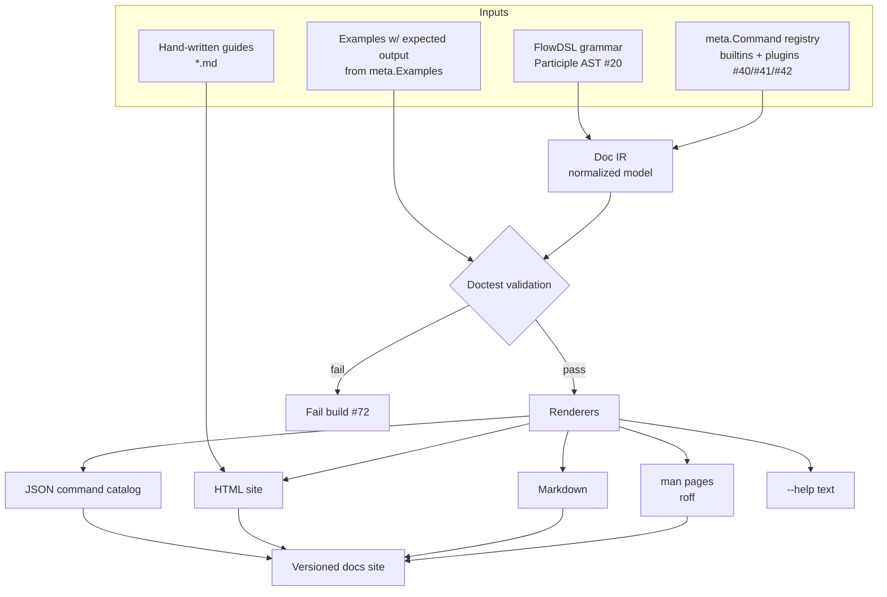

# 43 — Documentation Generation Framework

> **Codename:** Conduit · **Binary:** `conduit` (alias `cdt`) · **Module:** `github.com/conduit-io/conduit`
> **Status:** Architecture & Design Baseline v1.0 · **Owner:** Platform Architecture · **Date:** 2026-07-02
> **Scope:** How every documentation artifact is generated from a single source of truth.

**Related documents**
- [42 — Command Metadata Model](42-command-metadata.md) — the primary input
- [20 — DSL Grammar Specification](20-dsl-grammar.md) — the DSL reference input
- [40 — Plugin Architecture](40-plugin-architecture.md) · [41 — Extension SDK](41-extension-sdk.md) — plugin commands are documented identically
- [44 — Public SDK Design](44-public-sdk.md) · [81 — Build / Release / CI-CD](81-build-release-cicd.md) · [72 — Testing Strategy](72-testing-strategy.md)

---

## 1. Principle: Generate, Don't Author

All reference documentation is **generated** from two authoritative inputs so it can never drift from the implementation:

1. The **Command Metadata Model** ([42](42-command-metadata.md)) — commands, flags, args, examples, output schemas.
2. The **FlowDSL grammar** ([20](20-dsl-grammar.md), Participle v2) — DSL constructs, `uses:` actions, expression functions.

Hand-written prose (guides, tutorials) lives alongside but is kept minimal; anything describing a command or DSL construct is generated.

---

## 2. Pipeline



Entry point: `conduit docs gen`.

---

## 3. Intermediate Representation

Every renderer consumes one normalized **Doc IR**, so adding an output format never touches producers.

```go
// internal/docs/ir.go
type DocIR struct {
    Version   string            // conduit semver being documented
    Commands  []CommandDoc      // from meta registry (see 42)
    DSL       DSLReference      // from grammar (see 20)
    Guides    []Guide           // hand-written markdown, front-matter parsed
}

type CommandDoc struct {
    Meta     meta.Command       // full metadata
    Children []string           // subcommand ids
    Examples []ValidatedExample // doctest status attached
}

type DSLReference struct {
    Constructs []Construct       // workflow, step, uses, when, foreach, ...
    Functions  []CELFunction     // CEL builtins + registered fns (see 25)
    Actions    []meta.ActionSpec // plugin-contributed `uses:` (see 41)
}
```

---

## 4. Command Docs from Metadata

The generator walks the `meta.Command` registry ([42 §6](42-command-metadata.md), sourced via `conduit meta dump`) and renders per format. Builtin and plugin commands are indistinguishable in output except for a "provided by plugin `<name>`" badge.

- **`--help`** — Cobra renders live from the same metadata at runtime (help is generated, not a separate artifact).
- **man pages** — via Cobra's `doc.GenManTree` extended with Conduit sections (STABILITY, SINCE, AUTH SCOPES, OUTPUT SCHEMA, SIDE EFFECTS).
- **Markdown** — via `doc.GenMarkdownTree`, post-processed to add stability/since badges, example blocks, and cross-links.
- **JSON catalog** — direct serialization of the metadata registry (identical schema to `conduit meta dump`), consumed by the website search index and the AI API ([44](44-public-sdk.md)).

```go
// internal/docs/cobra_gen.go
func genMarkdown(root *cobra.Command, out string) error {
    return doc.GenMarkdownTreeCustom(root, out, frontMatter, linkHandler)
}
func genMan(root *cobra.Command, out string) error {
    hdr := &doc.GenManHeader{Title: "CONDUIT", Section: "1", Source: "Conduit " + build.Version}
    return doc.GenManTree(root, hdr, out)
}
```

---

## 5. DSL Reference from Grammar

The FlowDSL reference is generated from the **Participle v2 grammar** ([20](20-dsl-grammar.md), [22](22-parser-design.md)) plus doc-comment annotations on grammar structs, so the language reference tracks the parser exactly.

```go
// DSL grammar structs carry doc tags harvested by the generator.
type Step struct {
    Name string `parser:"'step' @String" doc:"Unique step identifier."`
    Uses string `parser:"('uses' ':' @String)?" doc:"Plugin action to invoke (see plugin docs)."`
    When string `parser:"('when' ':' @String)?" doc:"CEL guard; step runs only if true (see 25)."`
    // ...
}
```

The generator reflects over the grammar AST to produce:
- A construct reference (`workflow`, `step`, `uses`, `when`, `foreach`, `parallel`, ...).
- The **CEL function catalog** ([25](25-expression-engine.md)) — builtins plus host-registered functions.
- The **`uses:` action catalog** — merged from all installed plugins' `ActionSpec` ([41 §11](41-extension-sdk.md)), so third-party actions appear in the reference automatically.

---

## 6. Examples Extraction & Doctest Validation

Examples in `meta.Command.Examples` and in fenced ```` ```flow ```` blocks in guides are **executed and validated** in a sandbox during `conduit docs gen --validate` (and in CI). This guarantees documented commands actually work.

```go
// internal/docs/doctest.go
func validateExample(ex meta.Example) ValidatedExample {
    got, err := sandbox.Run(ex.Command)      // hermetic, network-mocked (see 72)
    switch {
    case err != nil:
        return ValidatedExample{Ex: ex, Status: Fail, Detail: err.Error()}
    case ex.Output != "" && !match(ex.Output, got):
        return ValidatedExample{Ex: ex, Status: Mismatch, Got: got}
    default:
        return ValidatedExample{Ex: ex, Status: Pass}
    }
}
```

- Examples with an expected `Output` are asserted (supports normalized/`...`-elided matching).
- FlowDSL examples are parsed + type-checked ([24](24-semantic-analysis.md)); a `# expect:` comment can assert results.
- Any failure fails the build ([72](72-testing-strategy.md), [81](81-build-release-cicd.md)), so stale docs are a CI error, not a surprise.

---

## 7. Renderers & Outputs

| Output | Renderer | Consumer |
|---|---|---|
| `--help` | Cobra (runtime) | terminal users |
| man pages (roff) | `doc.GenManTree` + custom sections | `man conduit-*`, packaging |
| Markdown | `doc.GenMarkdownTreeCustom` | repo docs, GitHub |
| HTML site | static-site build over Markdown IR | docs.conduit.io |
| JSON catalog | metadata serializer | site search, AI API ([44](44-public-sdk.md)) |
| DSL reference | grammar reflector | language docs, LSP hover ([56](56-lsp-architecture.md)) |

---

## 8. Versioned Docs

- Docs are generated **per release tag**; the HTML site keeps a version switcher (`v1.3`, `v1.4`, `latest`) — matching the SemVer policy in [83](83-api-standards-versioning.md).
- Each artifact embeds the `conduitVersion` it was generated from (visible in JSON catalog and man page footer).
- `Since`/`Deprecation` metadata ([42](42-command-metadata.md)) renders as badges and drives an automatically-generated **changelog of command surface changes** between versions (diffing two JSON catalogs).

```bash
$ conduit docs gen --version v1.4.0 --out ./site
$ conduit docs diff v1.3.0 v1.4.0        # surface changelog from JSON catalogs
```

---

## 9. CLI Surface

```bash
$ conduit docs gen                 # all formats to ./docs/_generated
$ conduit docs gen --format man    # man pages only
$ conduit docs gen --format json   # JSON command catalog
$ conduit docs gen --validate      # run doctests, fail on drift
$ conduit docs serve               # live-preview HTML site locally
$ conduit docs diff <v1> <v2>      # command-surface changelog
```

`conduit docs gen --validate` runs in CI on every PR; the release pipeline ([81](81-build-release-cicd.md)) publishes the versioned site and man pages. Because the inputs are the metadata model ([42](42-command-metadata.md)) and the grammar ([20](20-dsl-grammar.md)), **plugin-contributed commands and actions are documented automatically** with no extra authoring.
