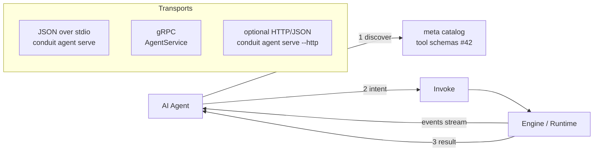

# 44 — Public SDK Design

> **Codename:** Conduit · **Binary:** `conduit` (alias `cdt`) · **Module:** `github.com/conduit-io/conduit`
> **Status:** Architecture & Design Baseline v1.0 · **Owner:** Platform Architecture · **Date:** 2026-07-02
> **Scope:** The public Go library API for **embedding/consuming** Conduit, and the machine-readable API for AI agents.

**Related documents**
- [41 — Extension SDK](41-extension-sdk.md) — building *plugins* (distinct from embedding the platform)
- [42 — Command Metadata Model](42-command-metadata.md) — the tool schema AI agents consume
- [40 — Plugin Architecture](40-plugin-architecture.md) · [20 — DSL Grammar](20-dsl-grammar.md) · [30 — Workflow DAG](30-workflow-dag.md) · [31 — Execution Runtime](31-execution-runtime.md)
- [67 — Event Model](67-event-model.md) · [63 — Authorization](63-authorization.md) · [83 — API Standards / Versioning](83-api-standards-versioning.md)

---

## 1. Two Audiences

| Audience | Wants | Surface |
|---|---|---|
| **Go programs** embedding Conduit | run workflows in-process, parse/validate FlowDSL, build commands | Go library API (`pkg/conduit`) — §2–§5 |
| **AI agents / external tools** | discover commands as tools, invoke with structured intents, get machine-readable + streaming results | Agent API: JSON-over-stdio + gRPC + optional HTTP — §6–§8 |

> **Not** the plugin SDK. Building plugins is [41](41-extension-sdk.md); this doc is about **calling into** Conduit.

---

## 2. Go Library API

Root package `github.com/conduit-io/conduit/pkg/conduit`. An `Engine` is the embeddable core; construct once, reuse.

```go
// pkg/conduit/engine.go
package conduit

type Engine struct { /* ... */ }

func New(opts ...Option) (*Engine, error)

type Option func(*config)
func WithConfigFile(path string) Option    // Koanf config (see 60)
func WithPlugins(dirs ...string) Option    // plugin discovery roots (see 40 §10)
func WithLogger(l Logger) Option           // structured logging (see 65)
func WithAuth(a Authorizer) Option         // scope checks (see 63)
func WithEventSink(s EventSink) Option      // stream runtime events (see 67)

func (e *Engine) Close() error             // graceful plugin shutdown (see 40 §6)
```

---

## 3. Running Workflows In-Process

```go
// pkg/conduit/run.go
func (e *Engine) LoadFlow(ctx context.Context, path string) (*Flow, error)
func (e *Engine) ParseFlowBytes(ctx context.Context, name string, src []byte) (*Flow, error)

type RunOptions struct {
    Inputs   map[string]any // bound to `input.*` in the DSL
    DryRun   bool           // plan only; no side effects
    MaxParallel int
}

func (e *Engine) Run(ctx context.Context, f *Flow, o RunOptions) (*RunResult, error)

type RunResult struct {
    Status   Status                 // succeeded|failed|cancelled
    Steps    map[string]StepResult  // per-step outputs (see 32)
    Outputs  map[string]any
    Duration time.Duration
}
```

Example:

```go
eng, err := conduit.New(conduit.WithConfigFile("conduit.yaml"))
if err != nil { log.Fatal(err) }
defer eng.Close()

flow, err := eng.LoadFlow(ctx, "deploy.flow")
if err != nil { log.Fatal(err) }

res, err := eng.Run(ctx, flow, conduit.RunOptions{
    Inputs: map[string]any{"env": "staging"},
})
if err != nil { log.Fatal(err) }
fmt.Printf("status=%s steps=%d\n", res.Status, len(res.Steps))
```

The engine drives the same DAG planner + runtime as the CLI ([30](30-workflow-dag.md), [31](31-execution-runtime.md)); plugins load through the same manager ([40](40-plugin-architecture.md)).

---

## 4. Parsing / Validating FlowDSL

Validation-only APIs (no execution) power IDE/CI checks and pre-flight in host programs.

```go
// pkg/conduit/dsl.go
func (e *Engine) Validate(ctx context.Context, src []byte) (*Diagnostics, error)

type Diagnostics struct {
    Errors   []Diagnostic
    Warnings []Diagnostic
}
type Diagnostic struct {
    Severity string // error|warning|info
    Message  string
    Line, Col int
    Code     string // e.g. "FLOW-UNRESOLVED-ACTION"
}
```

```go
diags, _ := eng.Validate(ctx, src)   // lex → parse → sema (see 21–24)
for _, d := range diags.Errors {
    fmt.Printf("%d:%d %s [%s]\n", d.Line, d.Col, d.Message, d.Code)
}
```

Backed by the language front-end ([21](21-lexer-design.md)–[25](25-expression-engine.md)); the same code path serves the LSP ([56](56-lsp-architecture.md)).

---

## 5. Building Commands Programmatically

Host programs can compose a Conduit command tree (e.g. to embed a subset in their own CLI) using the metadata model ([42](42-command-metadata.md)).

```go
// pkg/conduit/command.go
func (e *Engine) Commands() []meta.Command                 // full catalog (builtin + plugin)
func (e *Engine) Exec(ctx context.Context, argv []string, io IO) (int, error)

type IO struct { Stdin io.Reader; Stdout, Stderr io.Writer }
```

```go
code, _ := eng.Exec(ctx, []string{"aws", "s3", "sync", "./dist", "my-bucket"}, conduit.IO{
    Stdout: os.Stdout, Stderr: os.Stderr,
})
os.Exit(code)
```

---

## 6. AI-Agent-Consumable API

Agents treat Conduit as a **tool provider**. The API exposes three transports over one intent/result contract:



- **JSON over stdio** — `conduit agent serve` speaks newline-delimited JSON-RPC; ideal for local agent runners and subprocess tool use.
- **gRPC** — `AgentService` (below) for networked/streaming agents.
- **HTTP/JSON** — optional gateway (`--http :8080`) mapping the same messages for web agents.

All three share one schema. Agents first fetch the **tool catalog** (`conduit meta dump --ai`, [42 §5](42-command-metadata.md)) to learn available commands, their parameters (JSON Schema), output schemas, and **safety metadata** (`sideEffects`, `idempotent`, `confirm`, `authScopes`).

### 6.1 Intent / Result contract

```jsonc
// Structured intent (agent → conduit)
{
  "type": "invoke",
  "id": "req-42",
  "command": "aws s3 sync",          // or "flow.run"
  "args":  ["./dist", "my-bucket"],
  "flags": { "delete": true },
  "options": { "dryRun": false, "confirmed": true }, // confirmed satisfies confirm:required
  "stream": true
}
```

```jsonc
// Streaming events (conduit → agent), newline-delimited
{ "type": "event", "id": "req-42", "level": "info", "message": "uploading 12 objects" }
{ "type": "event", "id": "req-42", "level": "info", "message": "8/12 done", "fields": {"pct":"66"} }

// Terminal result (conduit → agent)
{
  "type": "result",
  "id": "req-42",
  "exitCode": 0,
  "output": { "uploaded": 12, "deleted": 3 },   // conforms to command's outputSchema (see 42)
  "outputSchemaRef": "aws.s3.sync.output",
  "durationMs": 4210
}
```

If a command is `confirm: required` and the intent lacks `"confirmed": true`, Conduit returns a `needs_confirmation` result describing the side effects instead of executing — letting the agent (or a human in the loop) approve first ([63](63-authorization.md)).

### 6.2 gRPC AgentService

```protobuf
// proto/conduit/agent/v1/agent.proto
package conduit.agent.v1;
import "google/protobuf/struct.proto";

service AgentService {
  rpc ListTools (ListToolsRequest) returns (ToolCatalog);          // tool schemas (see 42)
  rpc Invoke    (InvokeRequest)    returns (stream InvokeMessage); // events then result
  rpc Validate  (ValidateRequest)  returns (Diagnostics);          // FlowDSL check (§4)
}

message InvokeRequest {
  string command = 1;
  repeated string args = 2;
  google.protobuf.Struct flags = 3;
  bool dry_run = 4;
  bool confirmed = 5;
}
message InvokeMessage {
  oneof msg {
    Event  event  = 1;   // streamed progress/logs (mirrors 40 §5 Event)
    Result result = 2;   // terminal
  }
}
message Result {
  int32 exit_code = 1;
  google.protobuf.Struct output = 2;   // validated against outputSchema
  string output_schema_ref = 3;
  bool   needs_confirmation = 4;
  string confirmation_detail = 5;
}
```

---

## 7. Example — an AI Agent Invoking Conduit (Go)

```go
// An agent embedding the engine, using structured intents + streaming events.
eng, _ := conduit.New(conduit.WithConfigFile("conduit.yaml"))
defer eng.Close()

// 1. Discover tools (agent turns these into its function/tool schema — see 42 §5)
tools := eng.Commands()

// 2. Model decides to call aws s3 sync; we gate on safety metadata.
cmd := findTool(tools, "aws s3 sync")
if cmd.SideEffects == meta.SideEffectExternal && cmd.Annotations["conduit.ai/confirm"] == "required" {
    approve() // human-in-the-loop or policy check
}

// 3. Invoke with streaming events.
events := make(chan conduit.Event, 16)
go func() { for ev := range events { log.Printf("[%s] %s", ev.Level, ev.Message) } }()

code, _ := eng.Exec(ctx,
    []string{"aws", "s3", "sync", "./dist", "my-bucket", "--delete", "--output=json"},
    conduit.IO{Stdout: os.Stdout, Stderr: os.Stderr})

// Structured output is JSON conforming to the command's outputSchema (see 42),
// which the agent parses back into typed results.
_ = code
```

Equivalent over stdio (no Go embedding):

```bash
$ printf '%s\n' '{"type":"invoke","id":"1","command":"aws s3 sync","args":["./dist","b"],"flags":{"delete":true},"options":{"confirmed":true},"stream":true}' \
  | conduit agent serve
{"type":"event","id":"1","level":"info","message":"uploading 12 objects"}
{"type":"result","id":"1","exitCode":0,"output":{"uploaded":12,"deleted":3},"durationMs":4210}
```

---

## 8. Stable API Surface & SemVer Policy

The public SDK follows the platform's compatibility policy ([83](83-api-standards-versioning.md)):

- **Stable packages:** `pkg/conduit`, `pkg/meta`, and the `conduit.agent.v1` / `conduit.plugin.v1` protobufs are **public API**. Breaking changes require a major bump.
- **Additive within a major:** new options, methods (via new interfaces), fields, and RPCs only. Proto fields are never renumbered/removed within a major ([40 §8](40-plugin-architecture.md)).
- **Internal is internal:** anything under `internal/` is not covered; embedders must not depend on it.
- **Deprecation window:** `// Deprecated:` markers and `Deprecation` metadata precede removal by at least one major; a machine-readable surface changelog is generated ([43 §8](43-documentation-generation.md)).
- **Event/result schemas** are versioned by the transport package version and validated in contract tests ([72](72-testing-strategy.md)).

Together with the metadata model ([42](42-command-metadata.md)) and docs-gen ([43](43-documentation-generation.md)), this gives embedders and AI agents a **stable, discoverable, machine-readable** surface over the entire Conduit platform.
