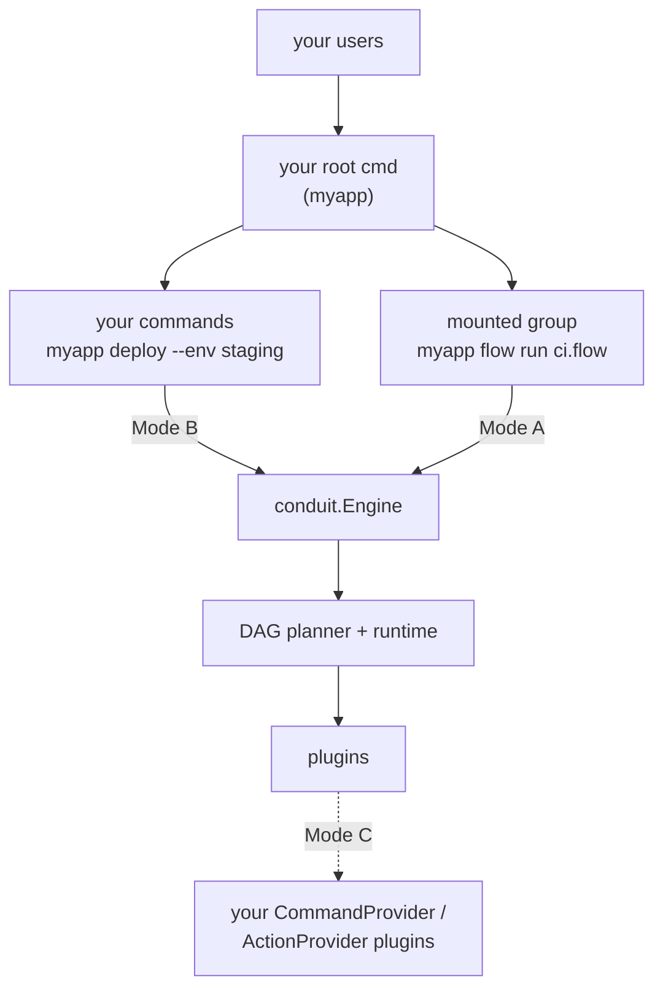

# 45 — Integration Guide (Embedding Conduit in Your Go CLI)

> **Codename:** Conduit · **Binary:** `conduit` (alias `cdt`) · **Module:** `github.com/conduit-io/conduit`
> **Status:** Architecture & Design Baseline v1.0 · **Owner:** Platform Architecture · **Date:** 2026-07-02
> **Scope:** A task-oriented guide for adding Conduit to an existing Go command-line application — wiring up **commands**, **command-line arguments/flags**, and **subcommands**, whether you build on **Cobra** or a bare `main()`.

**Related documents**
- [44 — Public SDK Design](44-public-sdk.md) — the `pkg/conduit` engine API this guide drives
- [41 — Extension SDK](41-extension-sdk.md) — building *plugins* (`CommandProvider`, `ActionProvider`)
- [40 — Plugin Architecture](40-plugin-architecture.md) · [42 — Command Metadata Model](42-command-metadata.md)
- [20 — DSL Grammar](20-dsl-grammar.md) · [30 — Workflow DAG](30-workflow-dag.md) · [31 — Execution Runtime](31-execution-runtime.md) · [60 — Configuration](60-configuration.md)

---

## 1. Which Integration Do You Want?

"Adding Conduit" means one of three things. Pick by what you want *your* users to type and who owns the command tree.

| Goal | Who owns argument parsing | Surface | Section |
|---|---|---|---|
| **A. Mount Conduit under your CLI** — expose `myapp flow run …`, `myapp flow validate …` as a subcommand group | Conduit (you delegate `argv`) | `engine.Exec` / a mounted `*cobra.Command` | [§4](#4-mode-a--mount-conduit-as-a-subcommand-group) |
| **B. Embed the engine** — your own commands parse flags, then run FlowDSL workflows in-process | **Your** CLI (Cobra/pflag/stdlib) | `engine.Run` / `engine.Validate` | [§5](#5-mode-b--embed-the-engine-behind-your-own-commands) |
| **C. Extend Conduit** — add *new* subcommands/actions to the `conduit` binary itself | Conduit (via plugin metadata) | `conduit-sdk-go` `CommandProvider` / `pkg/plugin` `ActionProvider` | [§6](#6-mode-c--contribute-commands--actions-via-plugins) |

You can combine them: most teams embed the engine (B) for their bespoke commands and mount the workflow verbs (A) so power users can run raw `.flow` files.



> **Implementation status.** The plugin contract (`pkg/plugin`, Mode C) ships today. The embedding engine (`pkg/conduit`, Modes A/B) is the documented Public SDK ([44](44-public-sdk.md)); the API shapes below are the design baseline. Track the surface against `pkg/conduit` as it lands, and treat this guide as the target contract.

---

## 2. Prerequisites & Install

- Go **1.24+** (the module targets `go 1.25`).
- Add the dependency:

```bash
go get github.com/conduit-io/conduit@latest
```

The two packages you import:

| Package | Use it for |
|---|---|
| `github.com/conduit-io/conduit/pkg/conduit` | Modes A & B — construct an `Engine`, run/validate FlowDSL, mount commands |
| `github.com/conduit-io/conduit/pkg/plugin` | Mode C — implement an `ActionProvider` served as a separate plugin binary |

> Everything under `internal/` (the live command tree, DAG, runtime, parser) is **not importable** by design — the `pkg/*` packages are the supported, semver-governed surface ([83](83-api-standards-versioning.md)).

Construct the engine **once** and reuse it; it owns the plugin manager and its subprocesses.

```go
eng, err := conduit.New(
    conduit.WithConfigFile("conduit.yaml"), // Koanf config — see 60
    conduit.WithPlugins("./plugins"),       // plugin discovery roots — see 40 §10
)
if err != nil { log.Fatal(err) }
defer eng.Close()                            // graceful plugin shutdown — see 40 §6
```

---

## 3. Concepts in 60 Seconds

Conduit does **not** replace your flag parser. It sits *behind* your commands and turns a `.flow` file (or in-memory source) into a validated DAG that it executes. Map the CLI vocabulary you already know onto Conduit's:

| Your CLI has… | Conduit calls it… | Where it appears in FlowDSL |
|---|---|---|
| Positional argument | Workflow **param** (or `argv` when you delegate) | `param name: string = "world"` → `${params.name}` |
| `--flag value` | Run **option** / param | `RunOptions{…}` or `--param key=value` on the CLI |
| Subcommand | A **workflow**, a mounted verb, or a plugin **command** | `workflow "ci" { … }` |
| Command handler body | The **DAG** of `task`s | `task build { run: "…" } / depends_on: […]` |

A minimal workflow (`examples/hello.flow`):

```hcl
workflow "hello" {
  description: "Greet the user"
  param name: string = "world"

  task greet   { run: "echo Hello, ${params.name}!" }
  task farewell {
    depends_on: [greet]
    uses: "builtin/print"
    with: { message: "Goodbye, ${params.name}." }
  }
}
```

---

## 4. Mode A — Mount Conduit as a Subcommand Group

Give your users the full workflow toolchain (`run`, `validate`, `fmt`, `graph`, …) namespaced under one of *your* verbs, without re-implementing any of it. Conduit owns argument parsing for everything below the mount point.

### 4.1 Delegating raw `argv` (framework-agnostic)

`engine.Exec` takes the argument vector *after* your verb and returns a process exit code. This works with **any** CLI library — or none.

```go
// pkg/conduit/command.go (per doc 44 §5)
//   func (e *Engine) Exec(ctx context.Context, argv []string, io conduit.IO) (int, error)

// In your CLI: `myapp flow <args...>` -> hand the tail to Conduit.
func runFlow(ctx context.Context, eng *conduit.Engine, args []string) int {
    code, err := eng.Exec(ctx, args, conduit.IO{
        Stdin:  os.Stdin,
        Stdout: os.Stdout,
        Stderr: os.Stderr,
    })
    if err != nil {
        fmt.Fprintln(os.Stderr, "flow:", err)
    }
    return code
}
```

Now `myapp flow run ci.flow --param branch=main --dry-run` behaves exactly like `conduit run …`: Conduit parses `run`, the positional `ci.flow`, the repeatable `--param key=value`, and `--dry-run`, then reports the DAG result and exit code. The supported flags are the CLI's own — see §7.

### 4.2 Mounting the `*cobra.Command` (if your CLI is Cobra)

If your app is already Cobra-based, attach Conduit's command tree as a child so it participates in **your** `--help`, completion, and grouping:

```go
root := &cobra.Command{Use: "myapp"}

// The engine hands back a ready-built subtree (root: "flow").
flowCmd := eng.CommandTree("flow") // *cobra.Command, per doc 44 §5 / 42
root.AddCommand(flowCmd)

// myapp flow run …  /  myapp flow validate …  /  myapp flow graph …
```

Because both builtin and plugin commands feed the **single metadata model** ([42](42-command-metadata.md)), a mounted plugin subcommand is a first-class citizen in your help text and completions — nothing to wire per command.

**When to choose Mode A:** you want the whole `.flow` authoring/execution experience under your brand and are happy for Conduit to define those subcommands' flags.

---

## 5. Mode B — Embed the Engine Behind Your Own Commands

This is the common case: **you** keep control of the command names, positional args, and flags (in Cobra, `pflag`, or the stdlib `flag` package), and call Conduit only to *execute* a workflow. Your flags become workflow inputs.

### 5.1 The engine call

```go
// pkg/conduit/run.go (per doc 44 §3)
type RunOptions struct {
    Inputs      map[string]any // bound to params in the DSL (${params.*})
    DryRun      bool           // plan only; no side effects
    MaxParallel int            // 0 = auto
}

func (e *Engine) LoadFlow(ctx context.Context, path string) (*conduit.Flow, error)
func (e *Engine) Run(ctx context.Context, f *conduit.Flow, o RunOptions) (*conduit.RunResult, error)
```

### 5.2 Wiring a Cobra command whose flags drive a workflow

Here your users type `myapp deploy --env staging --dry-run`. You own every token; Conduit just runs the DAG.

```go
func newDeployCmd(eng *conduit.Engine) *cobra.Command {
    var (
        env    string
        dryRun bool
    )
    cmd := &cobra.Command{
        Use:   "deploy",
        Short: "Deploy the service via the bundled workflow",
        Args:  cobra.NoArgs,
        RunE: func(cmd *cobra.Command, _ []string) error {
            ctx := cmd.Context()

            flow, err := eng.LoadFlow(ctx, "workflows/deploy.flow")
            if err != nil {
                return err
            }

            res, err := eng.Run(ctx, flow, conduit.RunOptions{
                // ── flags → workflow params ──
                Inputs: map[string]any{"env": env},
                DryRun: dryRun,
            })
            if err != nil {
                return err
            }

            fmt.Fprintf(cmd.OutOrStdout(),
                "deploy %s: %d step(s) in %s\n", res.Status, len(res.Steps), res.Duration)
            if res.Status == conduit.StatusFailed {
                return fmt.Errorf("deploy failed") // non-zero exit
            }
            return nil
        },
    }
    // ── your command-line arguments/flags ──
    cmd.Flags().StringVar(&env, "env", "dev", "target environment")
    cmd.Flags().BoolVar(&dryRun, "dry-run", false, "plan only; no side effects")
    return cmd
}
```

The matching `deploy.flow` declares the params your flags feed:

```hcl
workflow "deploy" {
  param env: string = "dev"

  task push {
    when: "params.env != \"dev\""       // CEL guard — see 25
    run:  "echo deploying to ${params.env}"
  }
}
```

### 5.3 Validate before you run (pre-flight / CI)

For lint-style checks or a `myapp flow check` command, use the execution-free path — same front-end that powers the LSP ([56](56-lsp-architecture.md)):

```go
diags, err := eng.Validate(ctx, src) // lex → parse → sema, no side effects
if err != nil { return err }
for _, d := range diags.Errors {
    fmt.Printf("%d:%d %s [%s]\n", d.Line, d.Col, d.Message, d.Code) // e.g. FLOW-UNRESOLVED-ACTION
}
if len(diags.Errors) > 0 {
    return fmt.Errorf("%d FlowDSL error(s)", len(diags.Errors))
}
```

### 5.4 Embedding workflows into your binary

To ship a self-contained CLI, embed the `.flow` files and parse from bytes so there's no runtime file dependency:

```go
//go:embed workflows/*.flow
var flows embed.FS

src, _ := flows.ReadFile("workflows/deploy.flow")
flow, err := eng.ParseFlowBytes(ctx, "deploy.flow", src)
```

**When to choose Mode B:** you want your own command names and flag UX and treat FlowDSL as an execution backend.

---

## 6. Mode C — Contribute Commands & Actions via Plugins

To add *new subcommands or DSL actions to the `conduit` binary itself* (rather than embedding it), ship a **plugin**: a separate executable Conduit discovers and dispenses over go-plugin/gRPC ([40](40-plugin-architecture.md)). Plugins are how you extend the command tree without forking core.

Two capabilities matter here (implement any subset — see [41 §3](41-extension-sdk.md)):

- **`CommandProvider`** → contributes **subcommands** (`myplugin foo …`) that appear in help, completion, and docs via the shared metadata model.
- **`ActionProvider`** → contributes DSL **actions** usable from a task's `uses:` field (e.g. `uses: "myplugin/notify"`).

### 6.1 A minimal action plugin (shipping API, `pkg/plugin`)

An action plugin lets workflows call your Go code: `task x { uses: "greeter/hello" with: { name: "Ada" } }`.

```go
package main

import "github.com/conduit-io/conduit/pkg/plugin"

type greeter struct{}

func (greeter) Describe() plugin.DescribeResult {
    return plugin.DescribeResult{
        Name:    "greeter",
        Version: "0.1.0",
        Actions: []string{"hello"},
    }
}

func (greeter) Invoke(action string, inputs map[string]string) (plugin.Result, error) {
    return plugin.Result{
        Outputs: map[string]string{"greeting": "Hello, " + inputs["name"]},
        Stdout:  "greeted " + inputs["name"],
    }, nil
}

func main() { plugin.Serve(greeter{}) } // injects the handshake; blocks serving RPC
```

Build it and drop the binary in a configured plugin dir; then:

```bash
conduit plugin list                 # discovers it
conduit plugin describe greeter     # greeter 0.1.0 → hello
```

`plugin.Serve` wires the handshake (`MagicCookieKey: CONDUIT_PLUGIN`) so a plugin binary can't be run as a normal process by accident, and adapts your `ActionProvider` onto the RPC transport for you.

### 6.2 Richer plugins (the `conduit-sdk-go` module)

For subcommands, completion, secrets, state, or triggers, depend on the dedicated SDK module `github.com/conduit-io/conduit-sdk-go` ([41](41-extension-sdk.md)) and implement plain interfaces (`CommandProvider`, `CompletionProvider`, …). It hides the protobuf/handshake wiring and ships an in-process test harness (`sdktest`) so plugins are unit-testable without spawning subprocesses.

**When to choose Mode C:** you're extending the `conduit` product for many workflows/users, not embedding it in one app.

---

## 7. Command-Line Arguments & Flags — Reference

When Conduit owns parsing (Mode A) the surface is the CLI's own. Match these when you re-expose them from your own commands (Mode B) so behavior stays consistent.

**Persistent (all commands):**

| Flag | Meaning |
|---|---|
| `--config <path>` | Config file (default `conduit.yaml`) |
| `-o, --output table\|json\|yaml` | Output format |
| `--no-input` | Never prompt; fail instead — **use in CI and for AI agents** |
| `-v, --verbose` | Increase verbosity (`-v`, `-vv`) |

**`run` command:**

| Flag / arg | Meaning |
|---|---|
| `<file.flow>` (positional) | Workflow file to execute |
| `-w, --workflow <name>` | Select a workflow when the file defines more than one |
| `-p, --param key=value` | Set a param; **repeatable** → maps to `RunOptions.Inputs` |
| `--dry-run` | Plan and print actions without executing → `RunOptions.DryRun` |
| `-c, --concurrency <n>` | Max concurrent tasks (`0` = auto) → `RunOptions.MaxParallel` |

Mapping cheat-sheet, CLI ↔ embedded engine:

| CLI | Engine (Mode B) |
|---|---|
| `--param env=staging` | `Inputs: map[string]any{"env": "staging"}` |
| `--dry-run` | `RunOptions{DryRun: true}` |
| `--concurrency 4` | `RunOptions{MaxParallel: 4}` |
| `-w deploy` | `LoadFlow` + select workflow `deploy` |

---

## 8. Configuration & Exit Codes

**Config.** The engine loads `conduit.yaml` (Koanf, [60](60-configuration.md)). Point at it with `WithConfigFile`, or let your users override with `--config` in Mode A. Config supplies plugin dirs, default concurrency, output format, and the state dir. Environment overrides follow the config precedence rules in [60](60-configuration.md).

**Exit codes.** In Mode A, propagate the code from `engine.Exec` straight to `os.Exit`. In Mode B, translate `RunResult.Status`:

```go
switch res.Status {
case conduit.StatusSucceeded: os.Exit(0)
case conduit.StatusFailed:    os.Exit(1)
case conduit.StatusCancelled: os.Exit(130)
}
```

The CLI uses distinct codes per failure class (usage, DSL error, run failure); mirror them if your tooling keys off exit status.

---

## 9. Making Your Integrated CLI AI-Agent-Ready

If agents will drive your CLI, keep two things intact and you inherit Conduit's agent story ([42](42-command-metadata.md), [44 §6](44-public-sdk.md)) for free:

1. **Preserve `--no-input`** on your embedding commands so a run never blocks on a prompt.
2. **Expose the metadata catalog.** Every command (builtin *and* plugin) declares `ai.sideEffect` / `ai.idempotent` annotations, projected into a machine-readable tool schema. Surface it so agents can discover your commands as tools:

```bash
conduit meta dump           # full command catalog as JSON (side-effect: none)
```

Annotate your own workflows/commands the same way (`ai.sideEffect`, `ai.idempotent`, `confirm`) so agents get accurate safety metadata before invoking them.

---

## 10. End-to-End Skeleton

A Cobra app that **embeds** the engine for its own `deploy` command (Mode B) *and* **mounts** the raw workflow tools under `flow` (Mode A):

```go
package main

import (
    "context"
    "fmt"
    "os"

    "github.com/spf13/cobra"
    "github.com/conduit-io/conduit/pkg/conduit"
)

func main() {
    eng, err := conduit.New(
        conduit.WithConfigFile("conduit.yaml"),
        conduit.WithPlugins("./plugins"),
    )
    if err != nil {
        fmt.Fprintln(os.Stderr, "init:", err)
        os.Exit(1)
    }
    defer eng.Close()

    root := &cobra.Command{Use: "myapp", SilenceUsage: true}

    // Mode B: your own command, your own flags → workflow inputs.
    root.AddCommand(newDeployCmd(eng)) // from §5.2

    // Mode A: full FlowDSL toolchain under `myapp flow …`.
    root.AddCommand(eng.CommandTree("flow"))

    if err := root.ExecuteContext(context.Background()); err != nil {
        fmt.Fprintln(os.Stderr, "error:", err)
        os.Exit(1)
    }
}
```

Your users now get:

```text
myapp deploy --env staging --dry-run     # Mode B: your flags drive deploy.flow
myapp flow run ci.flow -p branch=main    # Mode A: raw workflow execution
myapp flow validate ci.flow              # Mode A: pre-flight checks
```

---

## 11. Decision Summary

- Want the **workflow toolchain under your brand**, Conduit-owned flags → **Mode A** (`Exec` / `CommandTree`).
- Want **your own command names & flag UX**, FlowDSL as the engine → **Mode B** (`LoadFlow` + `Run` / `Validate`).
- Want to **extend `conduit` itself** with new subcommands or DSL actions → **Mode C** (`pkg/plugin` today, `conduit-sdk-go` for richer capabilities).

Most real integrations are **B + A**: embed for the paved-path commands, mount for the escape hatch. Keep the engine long-lived, keep `--no-input` honored, and let the metadata model carry help/completion/agent schemas so you never hand-maintain them.

---

## 12. Capability Cookbook — Simple → Very Complex

This section shows **what your users can type** once your app is integrated. Each command is declared once (a workflow's `param`s, or a command's metadata); the library handles parsing, type-checking, validation, defaulting, completion, and help for you. The examples below use a fictional `myapp` and show the *invocation surface* only — no wiring.

Every capability shown is backed by the argument model in [42](42-command-metadata.md) (typed/variadic args, typed flags, enums, required, env-backed, completion) and FlowDSL params in [20 §7](20-dsl-grammar.md) (`string int float bool duration timestamp list<T> map<K,V>`, with `required`/`enum`/`validation`).

### Level 0 — Bare command, all defaults

```bash
myapp greet
# → "Hello, world!"   (a param's default value supplies the missing input)
```

### Level 1 — A positional argument

```bash
myapp greet Ada
# → "Hello, Ada!"     (positional bound to a typed param)
```

### Level 2 — A named flag

```bash
myapp deploy --env staging
```

### Level 3 — Typed flags (bool · int · duration)

The library parses and **type-checks** each value; `90s` becomes a real duration, `5` an int, `--watch` a bool — bad values are rejected before anything runs.

```bash
myapp deploy --env staging --replicas 5 --timeout 90s --watch
myapp deploy --env staging --replicas five      # ✗ error: --replicas must be an int
```

### Level 4 — Repeatable & accumulating flags

Repeat a flag to build a list; `key=value` flags accumulate into a map. No custom parsing on your side.

```bash
myapp run pipeline.flow \
  --param branch=main \
  --region us-east-1 --region eu-west-1 \
  --label team=payments --label tier=critical
```

### Level 5 — Enum-constrained flags with validation

An `enum` flag is validated *and* tab-completed to its allowed set.

```bash
myapp deploy --env prod --strategy canary       # ✓
myapp deploy --env prod --strategy yolo         # ✗ error: must be one of rolling|canary|blue-green
```

### Level 6 — Required flags with environment-variable fallback

A flag can be satisfied by an env var, so the same command works interactively and in CI.

```bash
AWS_REGION=us-east-1 myapp s3 sync ./dist my-bucket   # ✓ --region supplied by $AWS_REGION
myapp s3 sync ./dist my-bucket                         # ✗ error: --region required (or set AWS_REGION)
```

### Level 7 — Variadic positional arguments

One trailing arg spec accepts any number of values (globs expand as usual).

```bash
myapp lint main.flow deploy.flow 'workflows/**/*.flow'
```

### Level 8 — Nested subcommand groups

Group related verbs arbitrarily deep; help, completion, and routing come from the shared metadata model — no per-level boilerplate.

```bash
myapp cloud storage sync ./dist my-bucket
myapp cloud dns record add --zone example.com --name api --type A --value 10.0.0.5
```

### Level 9 — Global (persistent) flags mixed with per-command flags

Persistent flags (`-v`, `-o`, `--config`, `--no-input`) compose with any subcommand's own flags in any position.

```bash
myapp -v -o json --config prod.yaml deploy --env prod --strategy blue-green --dry-run
```

### Level 10 — Machine-readable output negotiation

The same command renders as a table, JSON, or YAML — so scripts and agents get structured output for free.

```bash
myapp deploy --env prod -o json | jq .status
myapp meta dump -o json                 # full command catalog as a tool schema (side-effect: none)
```

### Level 11 — Aliases & shorthand flags

Short aliases and single-letter flags for the fast path.

```bash
myapp d -e prod -w rollback -p version=1.4.2
# 'd' → deploy, -e → --env, -w → --workflow, -p → --param
```

### Level 12 — Dynamic shell completion

Press `<TAB>` and the library completes the *right* thing per position — files, workflow names, enum members, even a plugin's action names:

```bash
myapp run <TAB>                 # → *.flow files in scope
myapp run ci.flow -w <TAB>      # → workflow names defined in ci.flow
myapp deploy --strategy <TAB>   # → rolling  canary  blue-green
```

### Level 13 — Conditional behavior driven by arguments

Arguments feed CEL guards, so one command adapts its work to the flags it's given — no branching code in your CLI.

```bash
myapp run ci.flow --param branch=main --param skip_lint=false
# branch=main enables the 'package' step; skip_lint=false keeps 'lint' in the DAG
```

### Level 14 — Matrix fan-out from a single invocation

A couple of flags expand into a full cross-product of parallel runs.

```bash
myapp test --matrix os=linux,macos,windows --matrix go=1.24,1.25
# one command → 6 parallel task sets (3 OSes × 2 Go versions)
```

### Level 15 — Safety gates for CI & AI agents

Side-effecting commands support `--dry-run`, an explicit `--confirm`, and `--no-input` (never prompt — fail instead). Agents read the same `sideEffects`/`idempotent`/`confirm` metadata before invoking.

```bash
myapp prod-migrate --dry-run          # plan only; shows what would change
myapp prod-migrate --confirm          # explicit go-ahead for a destructive action
myapp prod-migrate --no-input         # CI/agent mode: no prompts, ever
```

### Level 16 — The "very complex" invocation

Everything above, in one command — nested subcommand, variadic positionals, repeatable + typed + enum flags, env-supplied credentials, global verbosity/format, concurrency, and safety gates:

```bash
AWS_PROFILE=prod myapp -vv -o json cloud deploy service \
  ./build/api ./build/worker \
  --env prod \
  --strategy canary \
  --replicas 12 \
  --timeout 5m \
  --param feature_flags=payments-v2 \
  --param feature_flags=new-checkout \
  --label team=payments --label tier=critical \
  --concurrency 8 \
  --confirm \
  --dry-run
```

**What the library did with that line — for free:**

| Token(s) | Handled as |
|---|---|
| `cloud deploy service` | 3-level nested subcommand routing |
| `./build/api ./build/worker` | variadic positional args (1..N paths) |
| `--env prod` / `--strategy canary` | required flag + **enum-validated** flag |
| `--replicas 12` / `--timeout 5m` | **int** and **duration** flags, type-checked |
| `--param feature_flags=…` ×2 | **repeatable** flag → accumulated list |
| `--label team=… --label tier=…` | `key=value` flags → map |
| `AWS_PROFILE=prod` | **env-var-backed** flag, no `--profile` needed |
| `-vv` / `-o json` | **persistent** flags: verbosity + structured output |
| `--concurrency 8` | runtime fan-out control |
| `--confirm` / `--dry-run` | **safety gates** (agents read the same metadata) |

You declared the parameters once; the library gave you parsing, defaulting, type-checking, enum/required validation, env fallback, completion, help text, structured output, and an AI-consumable tool schema — the same guarantees at Level 0 and at Level 16.

---

## 13. Complete Worked Example — From Zero to a Parsing CLI

Here is an entire working program: a `greeter` CLI whose `deploy` command takes typed, validated command-line arguments and runs a workflow — plus the full FlowDSL toolchain mounted under `greeter flow`. It's one Go file and one `.flow` file. Copy it, `go run` it, and you have a real CLI.

> Same status note as [§1](#1-which-integration-do-you-want): this drives the documented `pkg/conduit` embedding API ([44](44-public-sdk.md)). The `pkg/plugin` path in [§6](#6-mode-c--contribute-commands--actions-via-plugins) compiles today.

### 13.1 Project layout

```text
greeter/
├── go.mod                 // module greeter   (go 1.24+)
├── main.go                // the whole CLI — below
└── workflows/
    └── deploy.flow        // the work the command runs
```

### 13.2 `workflows/deploy.flow`

Declare the inputs once, with types and defaults. This is the *only* place the parameters live.

```hcl
workflow "deploy" {
  description: "Deploy a service to an environment"

  param service:  string = "api"
  param env:      string = "dev"
  param replicas: int    = 1
  param dry:      bool   = false

  task plan {
    run: "echo planning ${params.service} → ${params.env} (${params.replicas} replicas)"
  }

  task apply {
    depends_on: [plan]
    when: "!params.dry"                 // --dry-run skips the real work, no code branch needed
    run:  "echo deploying ${params.service} to ${params.env}"
  }
}
```

### 13.3 `main.go`

The entire CLI. Note how little of this is *parsing* — you declare flags, and the library type-checks, defaults, validates, and completes them, then hands you clean values.

```go
package main

import (
	"context"
	"embed"
	"fmt"
	"os"

	"github.com/spf13/cobra"

	"github.com/conduit-io/conduit/pkg/conduit"
)

//go:embed workflows/*.flow
var flows embed.FS

func main() {
	// 1. One engine, reused for the process lifetime.
	eng, err := conduit.New(conduit.WithPlugins("./plugins"))
	if err != nil {
		fmt.Fprintln(os.Stderr, "init:", err)
		os.Exit(1)
	}
	defer eng.Close()

	root := &cobra.Command{
		Use:           "greeter",
		Short:         "Deploy services with Conduit-powered workflows",
		SilenceUsage:  true,
		SilenceErrors: true,
	}

	// 2. Your own command — you declare the flags, the library parses them.
	root.AddCommand(newDeployCmd(eng))

	// 3. Escape hatch: the full FlowDSL toolchain under `greeter flow …`.
	root.AddCommand(eng.CommandTree("flow"))

	if err := root.ExecuteContext(context.Background()); err != nil {
		fmt.Fprintln(os.Stderr, "error:", err)
		os.Exit(1)
	}
}

func newDeployCmd(eng *conduit.Engine) *cobra.Command {
	var (
		env      string
		replicas int
		dryRun   bool
	)

	cmd := &cobra.Command{
		Use:   "deploy <service>",
		Short: "Deploy a service to an environment",
		Args:  cobra.ExactArgs(1), // exactly one positional: the service name
		Example: `  greeter deploy api --env staging
  greeter deploy worker --env prod --replicas 5 --dry-run`,
		RunE: func(cmd *cobra.Command, args []string) error {
			ctx := cmd.Context()

			src, _ := flows.ReadFile("workflows/deploy.flow")
			flow, err := eng.ParseFlowBytes(ctx, "deploy.flow", src)
			if err != nil {
				return err
			}

			// Parsed command-line values → workflow inputs. That's the whole bridge.
			res, err := eng.Run(ctx, flow, conduit.RunOptions{
				Inputs: map[string]any{
					"service":  args[0],
					"env":      env,
					"replicas": replicas,
					"dry":      dryRun,
				},
			})
			if err != nil {
				return err
			}

			fmt.Fprintf(cmd.OutOrStdout(),
				"deploy %s: %d step(s) in %s\n", res.Status, len(res.Steps), res.Duration)
			if res.Status == conduit.StatusFailed {
				return fmt.Errorf("deploy failed")
			}
			return nil
		},
	}

	// Declare the flags. Types, defaults, and usage are all the library needs
	// to parse, validate, default, complete, and document them.
	cmd.Flags().StringVar(&env, "env", "dev", "target environment")
	cmd.Flags().IntVar(&replicas, "replicas", 1, "number of replicas")
	cmd.Flags().BoolVar(&dryRun, "dry-run", false, "plan only; no side effects")

	return cmd
}
```

### 13.4 Build & run

```bash
cd greeter
go mod init greeter
go get github.com/conduit-io/conduit@latest
go build -o greeter .
```

Now the parsing capabilities are live — with **zero** hand-written argument handling:

```bash
# Positional + a default flag
$ ./greeter deploy api
deploy succeeded: 2 step(s) in 8ms

# A named flag and a typed int flag
$ ./greeter deploy worker --env prod --replicas 5
deploy succeeded: 2 step(s) in 9ms

# The bool flag flips the workflow's behavior — no branching in your Go code
$ ./greeter deploy worker --env prod --dry-run
deploy succeeded: 1 step(s) in 3ms

# Type-checking you didn't write
$ ./greeter deploy worker --replicas five
Error: invalid argument "five" for "--replicas" flag: strconv.ParseInt: ...

# Arity checking you didn't write
$ ./greeter deploy
Error: accepts 1 arg(s), received 0

# Auto-generated help for every command and flag
$ ./greeter deploy --help
Deploy a service to an environment

Usage:
  greeter deploy <service> [flags]

Examples:
  greeter deploy api --env staging
  greeter deploy worker --env prod --replicas 5 --dry-run

Flags:
      --dry-run          plan only; no side effects
      --env string       target environment (default "dev")
  -h, --help             help for deploy
      --replicas int     number of replicas (default 1)

# And the whole FlowDSL toolchain came for free via the mounted group
$ ./greeter flow validate workflows/deploy.flow
$ ./greeter flow run workflows/deploy.flow --param env=staging
```

### 13.5 What you wrote vs. what you got

| You wrote | The library gave you |
|---|---|
| `cobra.ExactArgs(1)` | Positional **arity validation** with a clear error |
| Three `Flags().*Var(...)` lines | **Typed parsing**, defaults, `--flag=value`/`--flag value`, `--help` text |
| `Inputs: map[string]any{…}` | The **only** glue between parsed flags and the work |
| `eng.CommandTree("flow")` | An entire **subcommand tree** (`run`, `validate`, `fmt`, `graph`, …) with its own completion and help |
| *(nothing)* | Structured `-o json` output, shell completion, and an AI-agent tool schema ([42](42-command-metadata.md)) |

That's the whole point: you describe the shape of your commands and their arguments, and Conduit handles the parsing, validation, help, completion, and execution around them.
