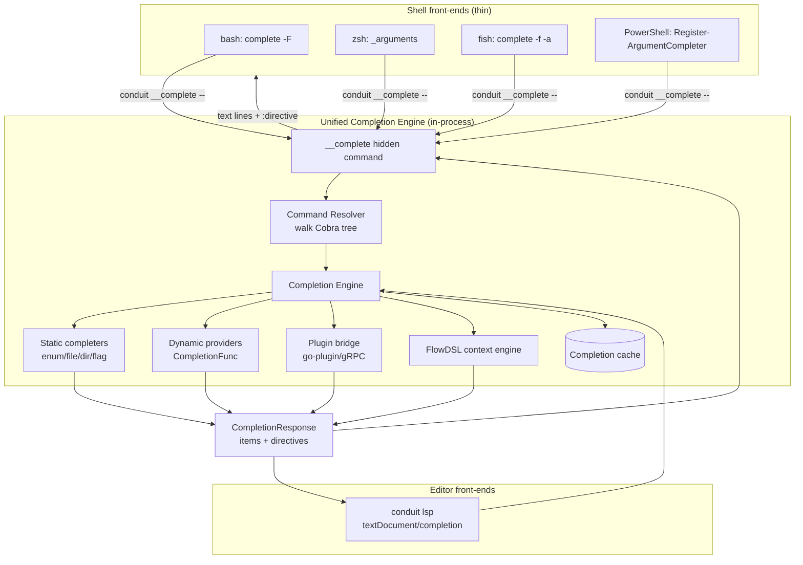

# Conduit — Unified Completion Engine Design

> Document ID: `50-completion-engine`
> Status: Draft (v0.1.0)
> Owner: Principal Developer-Experience Architect
> Last updated: 2026-07-02

Related documents:
- [Command Metadata Model](42-command-metadata.md)
- [Bash Completion](51-bash-completion.md) · [ZSH Completion](52-zsh-completion.md) · [Fish Completion](53-fish-completion.md) · [PowerShell Completion](54-powershell-completion.md)
- [IntelliSense Architecture](55-intellisense.md) · [LSP Architecture](56-lsp-architecture.md)
- [DSL Grammar](20-dsl-grammar.md) · [Semantic Analysis](24-semantic-analysis.md) · [Expression Engine (CEL)](25-expression-engine.md)
- [Plugin Architecture](40-plugin-architecture.md) · [Non-Functional Requirements](04-non-functional-requirements.md)

---

## 1. Purpose & Principles

Conduit exposes completion in five surfaces — **bash, zsh, fish, PowerShell**, and the **LSP** that
feeds IntelliSense in editors. The design goal is **one source of truth**: every completion, whether it
appears as a shell suggestion or an editor popup, is produced by the same in-process engine reading the
same **command metadata** ([42](42-command-metadata.md)) and the same **dynamic providers**.

Principles:

- **P1 — Single engine, many front-ends.** Shells and the LSP are thin transports. They never encode
  Conduit's command structure; they ask the binary.
- **P2 — Define-once.** A flag or argument declares its completer once (statically or as a provider);
  all surfaces inherit it. This mirrors the platform-wide *define-once, expose-many* property
  ([00 §8](00-executive-summary.md)).
- **P3 — Latency budget < 50 ms.** Completion must feel like a shell builtin. See [§7](#7-latency-budget--caching)
  and [NFR](04-non-functional-requirements.md).
- **P4 — Build on Cobra, extend for dynamic.** Cobra already ships a hidden `__complete`/`__completeNoDesc`
  command and per-shell generators; we extend it with dynamic providers, a plugin bridge, and a FlowDSL
  context engine rather than replacing it.
- **P5 — Graceful degradation.** If a dynamic provider errors or times out, we fall back to static
  completions and never block the shell.

---

## 2. Architecture Overview



The **command resolver** walks the Cobra command tree to locate the target command and the flag/arg
position being completed. The **completion engine** then dispatches to the appropriate completer set and
merges results into a single `CompletionResponse`. For shells the response is serialized as text lines
plus a trailing directive integer (Cobra's wire format); for the LSP it is mapped to
`CompletionItem[]` ([56 §9](56-lsp-architecture.md)).

---

## 3. Static vs Dynamic Completions

| | **Static** | **Dynamic** |
|---|---|---|
| Source | Declared at build time in command metadata | Computed at request time by a provider |
| Examples | subcommand names, flag names, fixed enums (`--format=json\|yaml\|table`) | remote resource names, env names, task IDs read from a `.flow` file, plugin resources |
| Cost | ~0 (already in memory) | provider-bound; must respect the [latency budget](#7-latency-budget--caching) |
| Cacheable | inherently | yes, with TTL/keying ([§7](#7-latency-budget--caching)) |
| Failure mode | cannot fail | falls back to static/empty; never blocks |

Static completions are derived directly from the Cobra tree and `CommandMeta`
([42](42-command-metadata.md)). Dynamic completions are registered via `RegisterFlagCompletionFunc` /
`ValidArgsFunction` (Cobra) wrapped by our provider interface ([§5](#5-go-interfaces)).

---

## 4. The `__complete` Hidden Command & Wire Protocol

Cobra registers a hidden `__complete` command that every shell script calls. Given the full command line
(with a trailing empty token when the cursor is after a space), it prints candidate completions followed
by a **directive** line.

```text
$ conduit __complete flow run --env prod ""
task:build	Build the project
task:test	Run tests
task:deploy	Deploy to an environment
:4
Completion ended with directive: ShellCompDirectiveNoFileComp
```

Wire format (one item per line): `VALUE\tDESCRIPTION`. The final line is `:<directive-bitmask>`.
**ActiveHelp** lines are emitted with a leading `_activeHelp_ ` marker and are shown to the user as
guidance rather than inserted.

Directives (bitmask), consumed by every shell adapter ([51](51-bash-completion.md)–[54](54-powershell-completion.md)):

| Directive | Value | Meaning |
|---|---|---|
| `ShellCompDirectiveError` | 1 | An error occurred; ignore completions |
| `ShellCompDirectiveNoSpace` | 2 | Do not add a trailing space (e.g. `key=`) |
| `ShellCompDirectiveNoFileComp` | 4 | Do not fall back to filename completion |
| `ShellCompDirectiveFilterFileExt` | 8 | Filter to given file extensions (e.g. `flow`) |
| `ShellCompDirectiveFilterDirs` | 16 | Complete directories only |
| `ShellCompDirectiveKeepOrder` | 32 | Preserve provider order (no shell re-sort) |

Our engine emits `FilterFileExt=flow` for arguments typed as a FlowDSL file path, and `NoFileComp` for
enum/dynamic flags.

### 4.1 Request/response types (internal)

```go
// package internal/completion

// Request is the normalized completion request, produced identically from a
// shell __complete invocation and from an LSP textDocument/completion call.
type Request struct {
    Args       []string          // resolved argv after the binary name
    ToComplete string            // the partial token under the cursor
    Flags      map[string]string // already-parsed flags on the line
    Directory  string            // cwd (shells) or workspace root (LSP)
    Source     Source            // ShellBash|ShellZsh|ShellFish|ShellPwsh|LSP
    Deadline   time.Time         // enforces the latency budget (§7)
}

type Item struct {
    Value      string
    Desc       string      // shown as description/tooltip
    Kind       ItemKind    // Command|Flag|Enum|File|Dir|Value|Snippet
    NoSpace    bool        // maps to per-item ShellCompDirectiveNoSpace
    SortText   string      // stable ordering hint (LSP + KeepOrder)
    InsertText string      // when different from Value (snippets)
}

type Response struct {
    Items      []Item
    Directive  Directive   // bitmask (§4)
    ActiveHelp string      // optional guidance line(s)
}
```

---

## 5. Go Interfaces

The engine is built around a small, testable interface set. Static and dynamic completers implement the
same `Completer`; the engine composes them.

```go
// package internal/completion

// Completer produces completion items for a single (command, flag|arg) site.
type Completer interface {
    Complete(ctx context.Context, req Request) (Response, error)
}

// Provider is a named, discoverable completer registered against metadata.
// Plugins contribute Providers over gRPC (§8); core registers them in-process.
type Provider interface {
    Completer
    ID() string          // stable id, e.g. "core.file", "plugin.aws.regions"
    Cacheable() bool     // opt into the response cache (§7)
    TTL() time.Duration  // cache lifetime when Cacheable
}

// Engine dispatches a Request to the right Completer(s) and merges results.
type Engine interface {
    // Resolve walks the Cobra tree + metadata to determine the completion site.
    Resolve(req Request) (Site, error)
    // Complete runs the site's completers under the deadline and merges output.
    Complete(ctx context.Context, req Request) (Response, error)
    Register(p Provider)
}

// Site is the resolved target of a completion request.
type Site struct {
    Cmd        *cobra.Command
    Flag       *pflag.Flag   // non-nil when completing a flag value
    ArgIndex   int           // positional arg index, -1 when completing a flag
    Completers []Completer   // ordered; first non-empty wins unless MergeAll
    MergeAll   bool
}
```

### 5.1 Built-in completers

```go
// EnumCompleter yields a fixed set (declared in CommandMeta), NoFileComp.
func EnumCompleter(values ...string) Completer

// FileCompleter defers to the shell's file completion, optionally filtered by ext.
func FileCompleter(exts ...string) Completer   // e.g. FileCompleter("flow")

// DirCompleter completes directories only (ShellCompDirectiveFilterDirs).
func DirCompleter() Completer

// FuncCompleter adapts a plain func into a Completer (dynamic).
func FuncCompleter(fn func(ctx context.Context, req Request) ([]Item, Directive, error)) Completer

// FlowCompleter is the FlowDSL context-aware completer (§9).
func FlowCompleter(front FrontEnd) Completer
```

Registration example (define-once, inherited by all shells + LSP):

```go
cmd.Flags().String("format", "table", "output format")
comp.Register(named("core.format", EnumCompleter("table", "json", "yaml")))
_ = cmd.RegisterFlagCompletionFunc("format", bridgeToCobra("core.format"))

cmd.Flags().String("env", "", "target environment")
comp.Register(named("plugin.env.names", pluginProvider("env", "names"))) // dynamic, cached
```

---

## 6. Merging & Ordering

The engine merges completer output deterministically:

1. Run each `Completer` at the site (parallel, bounded by the deadline).
2. Drop empty/errored results (log at debug; never surface to the shell).
3. De-duplicate by `Value`; keep the richest `Desc`.
4. Order: `KeepOrder` providers preserve their sequence; otherwise stable sort by `SortText` then
   `Value`. Descriptions are only emitted when the front-end supports them (`__completeNoDesc` variant
   suppresses them for shells that cannot render descriptions).
5. OR-reduce directives across completers (e.g. any `NoFileComp` wins).

---

## 7. Latency Budget & Caching

**Budget: p95 < 50 ms wall-clock** from shell keystroke to rendered list (see
[NFR](04-non-functional-requirements.md); the executive summary cites completion p95 < 100 ms end-to-end
including shell overhead — the engine's own budget is the stricter 50 ms).

Mechanisms:

- **Deadline propagation.** `Request.Deadline` (default 45 ms) is enforced via `context.WithDeadline`.
  Providers exceeding it are cancelled; the engine returns whatever static/completed items it has.
- **Response cache.** A process-local, TTL'd, keyed LRU:

```go
type cacheKey struct{ providerID, argHash, cwd string }

type CompletionCache interface {
    Get(k cacheKey) (Response, bool)
    Put(k cacheKey, r Response, ttl time.Duration)
}
```

  Because shell completion spawns a fresh `conduit __complete` process per keystroke, the cache is
  backed by an on-disk segment (`$XDG_CACHE_HOME/conduit/completion`) for expensive providers (e.g.
  remote resource lists), keyed by provider ID + normalized args + a short TTL. The LSP, being
  long-lived, uses the in-memory LRU.
- **Lazy plugin loading.** Plugins are only dialed when a plugin-backed provider is actually hit
  ([§8](#8-plugin-contributed-completions)); startup stays sub-50 ms.
- **Static fast path.** Subcommand/flag-name completion never touches providers or the cache.

---

## 8. Plugin-Contributed Completions

Plugins ([40](40-plugin-architecture.md)) contribute completions over the go-plugin/gRPC boundary. A
plugin declares completer IDs in its manifest; the host registers a `pluginProvider` that proxies
`Complete` calls to the plugin process.

```protobuf
// conduit.plugin.v1
service Completion {
  rpc Complete(CompleteRequest) returns (CompleteResponse);
}
message CompleteRequest {
  string provider_id = 1;
  repeated string args = 2;
  string to_complete  = 3;
  map<string,string> flags = 4;
  string cwd = 5;
  int64  deadline_unix_ms = 6;
}
message CompleteResponse {
  repeated CompletionItem items = 1;
  int32 directive = 2;          // Directive bitmask (§4)
  string active_help = 3;
}
```

```go
func pluginProvider(pluginName, providerID string) Provider {
    return &grpcProvider{
        id:        "plugin." + pluginName + "." + providerID,
        cacheable: true,
        ttl:       10 * time.Second, // resource lists change slowly
        dial:      pluginmgr.LazyDial(pluginName),
    }
}
```

Trust rules from [40](40-plugin-architecture.md) apply: only verified plugins may contribute completers;
a completer call runs under the same sandbox and deadline as any other plugin RPC and cannot block the
shell beyond the budget.

---

## 9. FlowDSL File Completion (Context-Aware)

Inside a `.flow` file (both via the LSP and via `conduit __complete` when completing a `.flow` path
argument's *contents* is **not** applicable — file-content completion is LSP-only), the engine consults
the **shared FlowDSL front-end** ([22](22-parser-design.md)/[24](24-semantic-analysis.md)) to produce
context-aware suggestions. This is the same front-end the LSP uses ([56](56-lsp-architecture.md)) and the
same CEL environment ([25](25-expression-engine.md)).

Context is derived from the cursor's AST node (error-tolerant parse) and the semantic scope:

| Cursor context | Completions offered | Source |
|---|---|---|
| After `needs:` / `depends_on:` | **task names** in the file | AST symbol table ([24](24-semantic-analysis.md)) |
| Inside a `task:` `uses:` value | **plugin actions** (`aws.s3.sync`, `git.clone`, …) | plugin registry ([40](40-plugin-architecture.md)) |
| Inside `with:` / `params:` block | **parameter names** for the selected action | plugin action schema ([42](42-command-metadata.md)) |
| Inside `${{ … }}` interpolation | **CEL variables & functions** in scope (`inputs.*`, `tasks.<id>.outputs.*`, `env.*`) | CEL env + scope model ([25](25-expression-engine.md)) |
| At a top-level key | **workflow keywords** (`inputs`, `tasks`, `on`, `env`, …) | grammar ([20](20-dsl-grammar.md)) |
| Enum-typed param value | declared enum values | action schema |

```go
// FlowCompleter uses the error-tolerant front-end shared with the LSP.
type FrontEnd interface {
    ParseTolerant(uri string, src []byte) (*ast.File, []Diagnostic)
    ScopeAt(f *ast.File, pos ast.Pos) *sema.Scope   // symbols visible at cursor
    CELEnvAt(f *ast.File, pos ast.Pos) *cel.Env      // CEL vars/funcs in scope
}
```

Because the front-end is error-tolerant, completion works while the file is mid-edit (unbalanced braces,
partial keys). See [55 §2](55-intellisense.md) for how this feeds the full IntelliSense feature set.

---

## 10. Testing

- **Golden `__complete` tests.** Table-driven: `(argv, toComplete) → (items, directive)`; run against a
  fixture command tree and fixture `.flow` files.
- **Latency benchmarks.** `go test -bench` asserts p95 < 50 ms for the static path and cached dynamic
  path; CI gate per [81](81-build-release-cicd.md).
- **Shell integration tests.** Each shell doc ([51](51-bash-completion.md)–[54](54-powershell-completion.md))
  ships an expect-style harness that drives a real shell and asserts rendered candidates.
- **Cross-surface parity.** A conformance suite asserts the LSP and the four shells produce the same
  candidate set for equivalent contexts.

---

## 11. Cross-References

- Metadata that declares completers: [42 — Command Metadata Model](42-command-metadata.md)
- Per-shell adapters: [51](51-bash-completion.md) · [52](52-zsh-completion.md) · [53](53-fish-completion.md) · [54](54-powershell-completion.md)
- Editor consumption: [55 — IntelliSense](55-intellisense.md) · [56 — LSP Architecture](56-lsp-architecture.md)
- Language inputs: [20](20-dsl-grammar.md) · [24](24-semantic-analysis.md) · [25](25-expression-engine.md)
- Plugin bridge & trust: [40 — Plugin Architecture](40-plugin-architecture.md)
