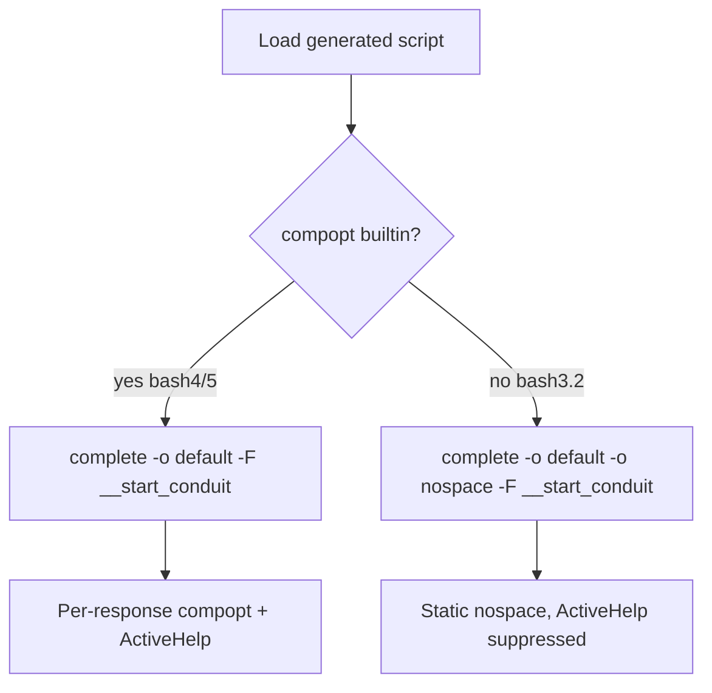
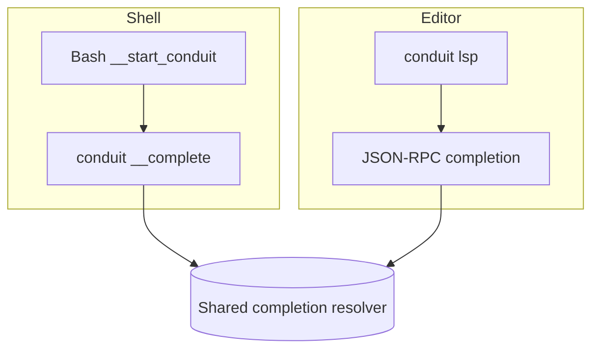

# Conduit — Bash Completion Architecture

> Document ID: `51-bash-completion`
> Status: Draft (v0.1.0)
> Owner: Principal Developer-Experience Architect
> Last updated: 2026-07-02

Related documents:
- [Completion Engine](50-completion-engine.md)
- [ZSH Completion](52-zsh-completion.md)
- [Fish Completion](53-fish-completion.md)
- [PowerShell Completion](54-powershell-completion.md)
- [IntelliSense](55-intellisense.md)
- [LSP Architecture](56-lsp-architecture.md)

---

## 1. Purpose & Scope

This document specifies how Conduit delivers **Bash** shell completion for the
`conduit` binary (alias `cdt`). It describes the structure of the script emitted
by `conduit completion bash`, how that script registers with Bash's programmable
completion facility, how it bridges into the shared completion protocol, and the
portability concerns between **bash 3.2** (the default `/bin/bash` on macOS) and
**bash 5.x** (modern Linux distributions and Homebrew).

Bash completion is a *thin front-end*. It contains **no knowledge** of Conduit's
command tree, flags, or FlowDSL (`*.flow`) semantics. All of that lives in the Go
binary and is exposed through the hidden Cobra command `conduit __complete`. This
document assumes familiarity with the wire protocol defined in
[50-completion-engine.md](50-completion-engine.md); it is summarized here only
where necessary for the Bash-specific mechanics.

---

## 2. Shared Protocol Recap

Every shell front-end — Bash included — calls the same hidden command:

```
conduit __complete -- <args...>
```

For shells that cannot render descriptions, the description-less variant is used:

```
conduit __completeNoDesc -- <args...>
```

The response is a newline-delimited stream on **stdout**:

```
VALUE\tDESCRIPTION
VALUE\tDESCRIPTION
_activeHelp_ Some contextual help text
:<directive-bitmask>
```

- Each candidate is `VALUE`, optionally followed by a TAB and a `DESCRIPTION`.
- Lines prefixed with the literal marker `_activeHelp_ ` are **ActiveHelp**:
  informational text shown to the user, never inserted into the command line.
- The **final** line always begins with `:` and encodes the directive bitmask.

Directive bitmask values (see [50](50-completion-engine.md)):

| Directive                    | Value | Bash effect |
|------------------------------|-------|-------------|
| `ShellCompDirectiveError`    | 1     | Abort; fall back to default (usually filename) completion |
| `ShellCompDirectiveNoSpace`  | 2     | `compopt -o nospace` — no trailing space after the single match |
| `ShellCompDirectiveNoFileComp` | 4   | Do **not** fall back to `_filedir` / filename completion |
| `ShellCompDirectiveFilterFileExt` | 8 | Candidates are extensions; restrict file completion to them (e.g. `*.flow`) |
| `ShellCompDirectiveFilterDirs` | 16  | Directory-only completion |
| `ShellCompDirectiveKeepOrder` | 32   | Preserve server-provided ordering (do not sort) |

**Latency budget:** the round-trip through `conduit __complete` must complete in
**< 50ms** so that TAB feels instantaneous. See §9.

```mermaid
sequenceDiagram
    participant U as User (Bash)
    participant C as complete -F
    participant F as __start_conduit
    participant B as conduit __complete
    U->>C: types `conduit flow ru<TAB>`
    C->>F: invoke completion function
    F->>B: conduit __complete -- flow ru
    B-->>F: run\tExecute a flow\n:4
    F->>F: parse candidates + directive 4
    F-->>U: COMPREPLY=(run); no _filedir fallback
```

---

## 3. Bash Programmable Completion Primer

Bash's completion system is driven by the builtin `complete`. When the user hits
TAB, Bash locates the completion **specification** registered for the current
command word and, if that spec names a function (`-F`), calls it. The function is
expected to populate the array variable `COMPREPLY` with candidate strings.

The shell exports several variables into the function's environment:

- `COMP_WORDS` — array of words on the current command line.
- `COMP_CWORD` — index into `COMP_WORDS` of the word being completed.
- `COMP_LINE` / `COMP_POINT` — the raw line and cursor offset (used for
  edge cases such as completing in the middle of a word).

Conduit registers a single dispatch function for both the primary binary and its
alias:

```bash
complete -o default -F __start_conduit conduit cdt
```

- `-F __start_conduit` names the shell function that produces completions.
- `-o default` tells Bash to fall back to filename completion **if the function
  returns no candidates** — Conduit selectively disables this at runtime via
  `compopt +o default` when the `NoFileComp` directive is present (see §5).
- Listing both `conduit` and `cdt` registers the alias to the same function.

---

## 4. Structure of the Generated Script

Running `conduit completion bash` writes a self-contained script to stdout. Its
top-level structure mirrors Cobra's generated output (Conduit builds on Cobra's
completion machinery) but is branded and annotated for Conduit:

1. A **bash-version guard** that detects bash < 4 and selects fallback code
   paths (§7).
2. `__conduit_debug` — a no-op-by-default trace helper gated on
   `$BASH_COMP_DEBUG_FILE`.
3. `__conduit_get_completion_results` — assembles the args, invokes
   `conduit __complete`, and captures stdout + the directive line.
4. `__conduit_process_completion_results` — parses the directive bitmask and
   applies each directive to `COMPREPLY` / `compopt`.
5. `__conduit_handle_completion_types` — chooses menu vs. single-word behavior.
6. `__start_conduit` — the entry point registered with `complete`.
7. The trailing `complete` registration line.

---

## 5. Annotated Generated Script

The following is a realistic, Conduit-branded rendition of the script produced by
`conduit completion bash`. Inline comments explain each region. (Whitespace and
debug plumbing trimmed slightly for readability; the shipped script is functionally
identical.)

```bash
# bash completion for conduit                                -*- shell-script -*-
# Generated by `conduit completion bash`. Do not edit by hand.

__conduit_debug()
{
    # Trace helper. Enabled only when BASH_COMP_DEBUG_FILE points at a writable
    # file, e.g. `export BASH_COMP_DEBUG_FILE=/tmp/conduit-comp.log`.
    if [[ -n ${BASH_COMP_DEBUG_FILE-} ]]; then
        echo "$*" >> "${BASH_COMP_DEBUG_FILE}"
    fi
}

# Ask the Conduit binary for completion candidates for the current line.
# Populates:
#   out       -> raw candidate lines (everything before the directive line)
#   directive -> integer bitmask from the trailing ":<n>" line
__conduit_get_completion_results() {
    local requestComp lastParam lastChar args

    # Rebuild the command line as arguments to `__complete`. We pass every word
    # *after* the binary name (COMP_WORDS[0]) so the Go side sees the same view.
    args=("${COMP_WORDS[@]:1}")
    requestComp="${words[0]} __complete ${args[*]}"

    lastParam=${COMP_WORDS[$COMP_CWORD]}
    lastChar=${lastParam:$((${#lastParam}-1)):1}
    __conduit_debug "lastParam=${lastParam}, lastChar=${lastChar}"

    # If the current word is empty (cursor after a space), append an empty
    # positional so the Go side knows a *new* argument is being started.
    if [[ -z ${COMP_WORDS[$COMP_CWORD]} ]]; then
        __conduit_debug "Adding extra empty parameter"
        requestComp="${requestComp} ''"
    fi

    __conduit_debug "Calling ${requestComp}"
    # eval is used deliberately: requestComp already has words correctly quoted.
    local completions
    completions=$(eval "${requestComp}" 2>/dev/null)
    local directive_line="${completions##*$'\n'}"   # last line
    out="${completions%$'\n'*}"                      # everything but last line

    # The directive line looks like ":4". Strip the leading colon.
    directive=${directive_line:1}
    # Defensive default if the binary produced no directive (e.g. crash).
    if [[ -z "${directive}" || "${directive}" == "${directive_line}" ]]; then
        directive=0
    fi
    __conduit_debug "directive=${directive}, out=${out}"
}

# Directive bitmask constants (kept in sync with the Go side / doc 50).
readonly __conduit_directive_error=1
readonly __conduit_directive_nospace=2
readonly __conduit_directive_nofilecomp=4
readonly __conduit_directive_filterfileext=8
readonly __conduit_directive_filterdirs=16
readonly __conduit_directive_keeporder=32

__conduit_process_completion_results() {
    local directive="${directive}"

    # 1 = Error: bail out and let bash do its default (filename) completion.
    if (( (directive & __conduit_directive_error) != 0 )); then
        __conduit_debug "Received error directive; falling back to default"
        return
    fi

    # 2 = NoSpace: suppress the trailing space after a unique match.
    if (( (directive & __conduit_directive_nospace) != 0 )); then
        if [[ $(type -t compopt) == builtin ]]; then
            compopt -o nospace
        fi
    fi

    # 4 = NoFileComp: turn OFF the `-o default` filename fallback for this call.
    if (( (directive & __conduit_directive_nofilecomp) != 0 )); then
        if [[ $(type -t compopt) == builtin ]]; then
            compopt +o default
        fi
    fi

    # Split candidate lines, dropping ActiveHelp and TAB descriptions.
    local -a candidates=()
    local activehelp=""
    local line value desc
    while IFS= read -r line; do
        [[ -z "${line}" ]] && continue
        if [[ "${line}" == _activeHelp_\ * ]]; then
            # ActiveHelp: accumulate for display, never insert into COMPREPLY.
            activehelp+="${line#_activeHelp_ }"$'\n'
            continue
        fi
        value="${line%%$'\t'*}"        # text before first TAB
        desc="${line#*$'\t'}"          # text after first TAB (may equal value)
        candidates+=("${value}")
    done <<< "${out}"

    # 8 = FilterFileExt: candidates are extensions (e.g. "flow"). Restrict file
    # completion to those globs instead of treating them as literal matches.
    if (( (directive & __conduit_directive_filterfileext) != 0 )); then
        local ext exts=()
        for ext in "${candidates[@]}"; do exts+=("*.${ext}"); done
        __conduit_filedir "${exts[@]}"     # e.g. *.flow only
        return
    fi

    # 16 = FilterDirs: complete directories only.
    if (( (directive & __conduit_directive_filterdirs) != 0 )); then
        __conduit_filedir -d
        return
    fi

    # Normal case: filter candidates by the word being typed and assign.
    local cur="${COMP_WORDS[$COMP_CWORD]}"
    COMPREPLY=($(compgen -W "${candidates[*]}" -- "${cur}"))

    # 32 = KeepOrder: compgen already sorts; if KeepOrder is set we deliberately
    # bypass compgen's sort by assigning the pre-filtered candidates verbatim.
    if (( (directive & __conduit_directive_keeporder) != 0 )); then
        COMPREPLY=()
        for value in "${candidates[@]}"; do
            [[ "${value}" == "${cur}"* ]] && COMPREPLY+=("${value}")
        done
    fi

    # Render any ActiveHelp beneath the candidate list (bash 4.4+ only, where we
    # can print without corrupting the prompt). See §6.
    if [[ -n "${activehelp}" && ${BASH_VERSINFO[0]} -ge 4 ]]; then
        __conduit_print_activehelp "${activehelp}"
    fi
}

# Portable file/dir completion wrapper: prefer the system `_filedir`, else fall
# back to compgen (bash 3.2 boxes without bash-completion installed).
__conduit_filedir() {
    if declare -F _filedir >/dev/null 2>&1; then
        _filedir "$@"
    else
        local cur="${COMP_WORDS[$COMP_CWORD]}"
        if [[ "$1" == -d ]]; then
            COMPREPLY=($(compgen -d -- "${cur}"))
        else
            COMPREPLY=($(compgen -f -- "${cur}"))
        fi
    fi
}

__start_conduit()
{
    # Entry point named in the `complete -F` registration below.
    local cur prev words cword
    COMPREPLY=()

    # `words` mirrors COMP_WORDS but survives bash 3.2 quirks; on modern bash we
    # could use _get_comp_words_by_ref, but we stay dependency-free here.
    words=("${COMP_WORDS[@]}")
    cword=$COMP_CWORD
    cur="${COMP_WORDS[$COMP_CWORD]}"

    local out directive
    __conduit_get_completion_results
    __conduit_process_completion_results
}

# Register the same dispatcher for the binary and its alias `cdt`.
# -o default : fall back to filename completion unless NoFileComp turns it off.
if [[ $(type -t compopt) = "builtin" ]]; then
    complete -o default -F __start_conduit conduit cdt
else
    # bash 3.2 without compopt: -o nospace can only be set statically. We accept
    # a slightly less precise experience (see §7).
    complete -o default -o nospace -F __start_conduit conduit cdt
fi
# ex: ts=4 sw=4 et filetype=sh
```

---

## 6. Focused Snippet — The `__complete` Call & Directive Loop

The two mechanisms that matter most are (a) issuing the call and slicing off the
directive line, and (b) walking the bitmask. Isolated and annotated:

```bash
# (a) Call the binary and split the response.
completions=$(conduit __complete -- "${COMP_WORDS[@]:1}" 2>/dev/null)

directive_line="${completions##*$'\n'}"   # ":4"  -> last physical line
out="${completions%$'\n'*}"               # candidate lines above it
directive=${directive_line:1}             # strip leading ':' -> "4"
[[ "${directive}" =~ ^[0-9]+$ ]] || directive=0   # guard against garbage

# (b) Apply directives by ANDing against known bit values.
(( directive & 1 )) && return                       # Error -> default completion
(( directive & 2 )) && compopt -o nospace           # NoSpace
(( directive & 4 )) && compopt +o default           # NoFileComp: kill file fallback
# 8 (FilterFileExt) and 16 (FilterDirs) are handled by branching into _filedir
# with the appropriate glob / -d flag, as shown in §5.
```

**ActiveHelp rendering.** Because Bash offers no native "info line" channel,
ActiveHelp is printed after computing `COMPREPLY`. On bash 4.4+ we emit it once,
avoiding COMPREPLY pollution:

```bash
__conduit_print_activehelp() {
    # $1 is newline-delimited help text already stripped of the marker.
    local IFS=$'\n' line
    # Only print when there is more than one candidate or none, so we don't
    # interfere with a unique-match auto-insert.
    printf '\n' >&2
    for line in $1; do printf '  \033[2m%s\033[0m\n' "${line}" >&2; done
    # Force bash to redraw the prompt + current line after our injected output.
    printf '%s' "${READLINE_LINE-}" >&2 2>/dev/null || true
}
```

Descriptions themselves are surfaced via the classic **two-column trick**: when
more than one candidate remains, Conduit pads each `VALUE` and appends its
`DESCRIPTION` so the menu shows `run    Execute a flow`. On unique matches only the
bare `VALUE` is inserted (never the description). Modern bash-completion 2.12+
`_comp_compgen` helpers can attach descriptions natively; Conduit uses them when
present and degrades to the padded two-column form otherwise.

---

## 7. bash 3.2 vs bash 5 Concerns

macOS still ships **bash 3.2.57** as `/bin/bash` (frozen for GPLv2 licensing
reasons). Users who have not installed a newer bash via Homebrew run the
completion script under a 15-year-old interpreter. The generated script therefore
avoids or guards the following:

| Feature | bash 3.2 | bash 5 | Conduit strategy |
|---------|----------|--------|------------------|
| `compopt` builtin | **absent** | present | Guard every `compopt` with `type -t compopt`; when absent, register `-o nospace` statically at `complete` time (§5 else-branch). |
| Associative arrays (`declare -A`) | **absent** | present | Never used. All lookups use plain indexed arrays and `case` statements. |
| `mapfile` / `readarray` | **absent** | present | Replaced with a `while IFS= read -r` loop feeding an indexed array (see `__conduit_process_completion_results`). |
| `${var,,}` / `${var^^}` case mod | **absent** | present | Avoided; use `tr` only if strictly needed. |
| `_filedir` / `_get_comp_words_by_ref` | requires bash-completion pkg | ditto | Wrapped in `__conduit_filedir` with a `compgen` fallback. |
| ActiveHelp redraw | fragile | reliable | Gated on `${BASH_VERSINFO[0]} -ge 4`. |

Detection is done once, near the top of the script:

```bash
# Capability probe. BASH_VERSINFO[0] is the major version integer.
__conduit_has_compopt=false
[[ $(type -t compopt) == builtin ]] && __conduit_has_compopt=true
```

The practical consequence on stock macOS bash 3.2: NoSpace becomes a static
completion option rather than a per-response one, and ActiveHelp is suppressed.
All candidate/directive logic (including FilterFileExt for `*.flow` and
FilterDirs) works unchanged because it relies only on `compgen`, `while read`, and
`case`, all of which exist in 3.2.

> **Recommendation:** advise macOS users to install a modern bash
> (`brew install bash`) *or* prefer zsh (macOS's default login shell since
> Catalina) — see [52-zsh-completion.md](52-zsh-completion.md).



---

## 8. Installation Flow

### 8.1 System-wide

If the `bash-completion` package is installed, its drop-in directory is loaded
automatically for every interactive shell:

```bash
# Linux (bash-completion v2, typical path):
conduit completion bash | sudo tee /etc/bash_completion.d/conduit >/dev/null

# Alternative dynamic dir advertised by pkg-config:
conduit completion bash | sudo tee \
  "$(pkg-config --variable=completionsdir bash-completion)/conduit" >/dev/null
```

### 8.2 Per-user

```bash
# Option A: dedicated file sourced by bash-completion's user hook.
conduit completion bash > ~/.bash_completion

# Option B: source directly from ~/.bashrc (works even without the
# bash-completion package; good for minimal/macOS setups).
mkdir -p ~/.config/conduit
conduit completion bash > ~/.config/conduit/conduit.bash
echo 'source ~/.config/conduit/conduit.bash' >> ~/.bashrc
```

### 8.3 One-off (current shell only)

```bash
source <(conduit completion bash)
```

> On macOS with Homebrew bash-completion@2, the correct system directory is
> `$(brew --prefix)/etc/bash_completion.d`, and `.bash_profile` must source
> `$(brew --prefix)/etc/profile.d/bash_completion.sh`.

```mermaid
flowchart LR
    G[conduit completion bash] -->|stdout| S[Generated script]
    S -->|system| D1[/etc/bash_completion.d/conduit/]
    S -->|per-user| D2[~/.bash_completion]
    S -->|ephemeral| D3[source <(...)]
    D1 & D2 & D3 --> R[complete -F __start_conduit conduit cdt]
```

---

## 9. Performance Considerations

Each TAB fires exactly one `conduit __complete` process. To stay under the **50ms**
budget:

- The completion code path in the Go binary short-circuits plugin loading, config
  file parsing, and network I/O; see [50-completion-engine.md](50-completion-engine.md) §"Cold path".
- The script issues a **single** subprocess invocation and does all parsing in
  pure bash builtins (`read`, parameter expansion, `case`) — no `awk`/`sed`/`grep`
  forks in the hot path.
- `eval`/`$( )` capture is unavoidable, but only one fork occurs per completion.

If a user reports sluggish completion, the first diagnostic is
`BASH_COMP_DEBUG_FILE`, which timestamps each stage.

---

## 10. Relationship to FlowDSL & the LSP

Bash completion covers **command, flag, and argument** completion for the CLI
surface. Rich, semantic completion *inside* `*.flow` files (symbols, step names,
type-aware suggestions) is the responsibility of the FlowDSL language server,
`conduit lsp`, and is documented in [56-lsp-architecture.md](56-lsp-architecture.md)
and [55-intellisense.md](55-intellisense.md). The two systems share the same
underlying resolver but expose it through different transports: `__complete` for
shells, and JSON-RPC for editors.



---

## 11. Testing

- **Golden tests:** the emitted script is snapshot-tested; any change to
  `conduit completion bash` output requires an approved golden update.
- **Behavioral tests:** a harness spawns `bash --norc` (both a bundled 3.2 and a
  5.x via container matrix), sources the script, drives synthetic `COMP_WORDS` /
  `COMP_CWORD`, and asserts `COMPREPLY` and `compopt` side-effects for each
  directive.
- **Latency test:** asserts p95 of `conduit __complete` < 50ms on the CI runner.

See [50-completion-engine.md](50-completion-engine.md) §Testing for the shared
directive conformance matrix used across all shells.

---
