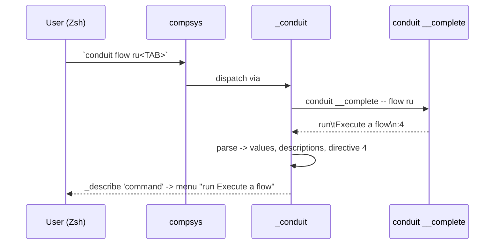
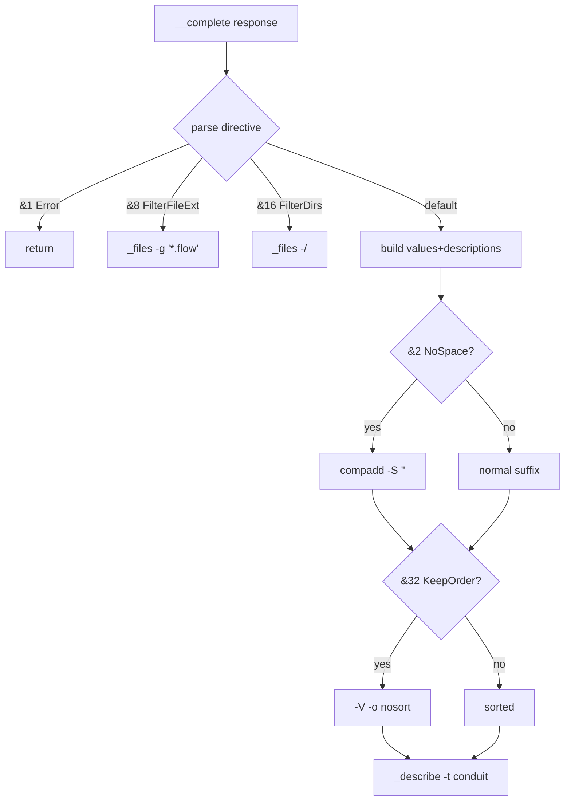
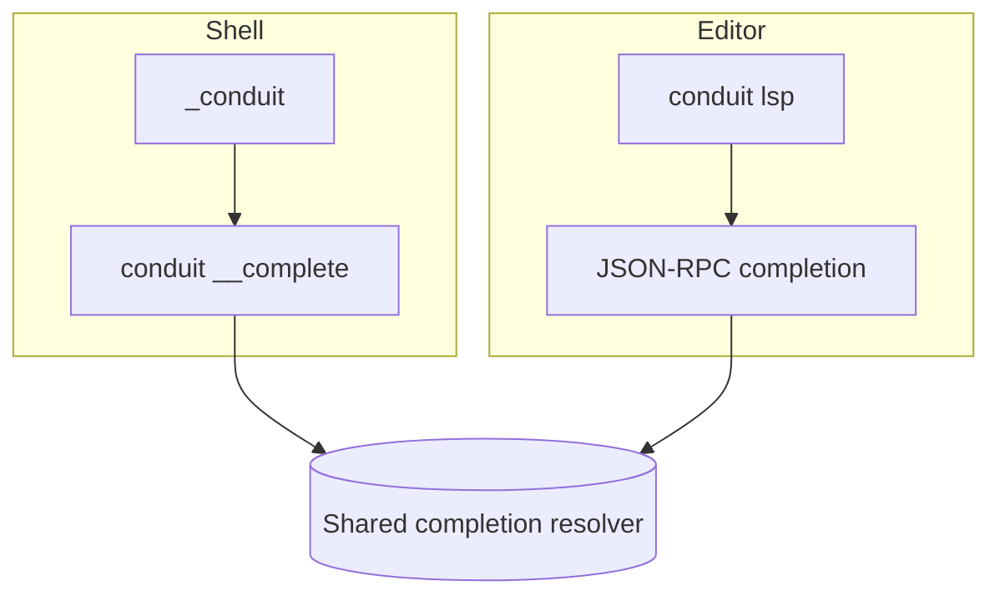

# Conduit — ZSH Completion Architecture

> Document ID: `52-zsh-completion`
> Status: Draft (v0.1.0)
> Owner: Principal Developer-Experience Architect
> Last updated: 2026-07-02

Related documents:
- [Completion Engine](50-completion-engine.md)
- [Bash Completion](51-bash-completion.md)
- [Fish Completion](53-fish-completion.md)
- [PowerShell Completion](54-powershell-completion.md)
- [IntelliSense](55-intellisense.md)
- [LSP Architecture](56-lsp-architecture.md)

---

## 1. Purpose & Scope

This document specifies **Zsh** completion for the `conduit` binary (alias `cdt`).
Zsh is the default login shell on macOS (since Catalina) and is popular on Linux,
so this front-end receives first-class attention. It describes the `#compdef`
header, the generated `_conduit` function, how Conduit bridges the shared
completion protocol into Zsh's rich completion system (`_arguments`, `compadd`,
`_describe`), how directives map onto Zsh primitives, and how the completion is
installed (including oh-my-zsh).

As with every shell, the Zsh script is a **thin front-end**: it holds no knowledge
of Conduit's command tree or FlowDSL semantics. It calls the hidden Cobra command
`conduit __complete` and renders the result. The wire protocol is defined in
[50-completion-engine.md](50-completion-engine.md); the shared line/directive
format is identical to the one Bash consumes in [51-bash-completion.md](51-bash-completion.md).

---

## 2. Shared Protocol Recap

Zsh calls the same hidden command as every other shell:

```
conduit __complete -- <args...>
```

Response stream on stdout:

```
VALUE\tDESCRIPTION
VALUE\tDESCRIPTION
_activeHelp_ Some contextual help text
:<directive-bitmask>
```

- `VALUE\tDESCRIPTION` — TAB-separated candidate and (optional) description.
- `_activeHelp_ ` prefix — informational text, never inserted.
- Final `:<n>` line — the directive bitmask.

Because Zsh **can** render descriptions natively, the `_conduit` function always
prefers the descriptive `__complete` variant and only falls back to
`__completeNoDesc` when the user has disabled descriptions via zstyle. Directive
bitmask (shared across all shells; see [50](50-completion-engine.md)):

| Directive                         | Value | Zsh effect |
|-----------------------------------|-------|------------|
| `ShellCompDirectiveError`         | 1     | Abort; return non-zero so Zsh tries the next matcher |
| `ShellCompDirectiveNoSpace`       | 2     | `compadd -S ''` (empty suffix — no space appended) |
| `ShellCompDirectiveNoFileComp`    | 4     | Do **not** call `_files` |
| `ShellCompDirectiveFilterFileExt` | 8     | `_files -g '*.flow'` (restrict to given globs) |
| `ShellCompDirectiveFilterDirs`    | 16    | `_files -/` (directories only) |
| `ShellCompDirectiveKeepOrder`     | 32    | `compadd -V`/`-o nosort` — preserve server order |

**Latency budget:** the `conduit __complete` round-trip must complete in **< 50ms**.



---

## 3. Zsh Completion System Primer

Zsh's completion system (`compsys`) is far richer than Bash's. Key primitives the
`_conduit` function uses:

- **`#compdef conduit cdt`** — the magic header comment. When a file named
  `_conduit` sits on `$fpath` and begins with this line, `compinit` autoloads it
  and binds it as the completer for both `conduit` and `cdt`.
- **`_arguments`** — high-level spec-driven completer for options/positionals. We
  use it lightly, mainly to let Zsh handle option/word state; the heavy lifting is
  delegated to `__complete`.
- **`compadd`** — the low-level primitive that adds matches to the current
  completion. Supports suffixes (`-S`), display strings (`-d`), grouping (`-J`/`-X`),
  and order preservation (`-V`/`-o nosort`).
- **`_describe`** — a convenience wrapper over `compadd` that pairs values with
  descriptions and renders them as a two-column menu, with automatic group tags.
- **`_files`** — file/directory completer, with `-g <glob>` and `-/` (dirs only).
- **`_message`** — prints an unselectable informational line (used for ActiveHelp).

Menu selection (arrow-key navigation of the candidate list) is enabled by the
user, not the script:

```zsh
zstyle ':completion:*' menu select
```

---

## 4. Structure of the Generated Script

`conduit completion zsh` writes a self-contained `_conduit` function. Its
structure mirrors Cobra's zsh output (Conduit builds on Cobra's machinery), rebranded
and annotated:

1. `#compdef conduit cdt` header.
2. `__conduit_debug` — trace helper gated on `$BASH_COMP_DEBUG_FILE`.
3. `_conduit` — the completer function:
   - assembles `words`/`CURRENT` into `__complete` args;
   - invokes the binary and splits candidates from the directive line;
   - parses each candidate into parallel `values` / `descriptions` arrays;
   - branches on the directive bitmask into `compadd` / `_describe` / `_files`;
   - emits ActiveHelp via `_message`.
4. Trailing autoload guard so the file also works when *sourced* directly.

---

## 5. Annotated Generated Script

A realistic, Conduit-branded rendition of `conduit completion zsh`. Inline comments
explain each region.

```zsh
#compdef conduit cdt
# zsh completion for conduit                                 -*- shell-script -*-
# Generated by `conduit completion zsh`. Do not edit by hand.

__conduit_debug() {
    # Trace helper: writes only when BASH_COMP_DEBUG_FILE is set (name shared
    # across all Conduit shell integrations for consistency).
    local file="${BASH_COMP_DEBUG_FILE}"
    if [[ -n ${file} ]]; then
        echo "$*" >> "${file}"
    fi
}

_conduit() {
    local shellCompDirectiveError=1
    local shellCompDirectiveNoSpace=2
    local shellCompDirectiveNoFileComp=4
    local shellCompDirectiveFilterFileExt=8
    local shellCompDirectiveFilterDirs=16
    local shellCompDirectiveKeepOrder=32

    local lastParam lastChar flagPrefix requestComp out directive
    local -a completions

    __conduit_debug "\n========= starting completion logic =========="
    __conduit_debug "CURRENT: ${CURRENT}, words[*]: ${words[*]}"

    # Build the request. `${words[1]}` is the binary; pass the rest as-is so the
    # Go side sees the identical command line. `${words[2,-1]}` = args after bin.
    lastParam=${words[-1]}
    lastChar=${lastParam[-1]}
    __conduit_debug "lastParam: ${lastParam}, lastChar: ${lastChar}"

    # When the cursor is after a trailing space, `words[-1]` is empty and Zsh
    # already reflects that, so no extra empty arg is needed (unlike bash).
    requestComp="${words[1]} __complete ${words[2,-1]}"

    # If completing a brand-new word (empty last param), tell the binary so it
    # returns the next-positional candidates rather than filtering the previous.
    if [[ "${lastParam}" == "" ]]; then
        __conduit_debug "Adding extra empty parameter"
        requestComp="${requestComp} \"\""
    fi

    __conduit_debug "Calling: ${requestComp}"
    # Capture stdout; eval because requestComp is a correctly-quoted word list.
    local response
    response=$(eval "${requestComp}" 2>/dev/null)

    # Split into lines. The LAST line is ":<directive>"; everything else is
    # candidate data (VALUE\tDESC or _activeHelp_ lines).
    local -a rawlines
    rawlines=("${(@f)response}")          # (f) = split on newlines
    local directive_line="${rawlines[-1]}"
    directive=${directive_line#:}          # strip leading ':'
    if [[ "${directive}" == "${directive_line}" || -z "${directive}" ]]; then
        directive=0                        # no valid directive -> treat as 0
    fi
    __conduit_debug "directive: ${directive}"

    # 1 = Error: return non-zero so compsys moves on to the next matcher.
    if (( (directive & shellCompDirectiveError) != 0 )); then
        __conduit_debug "Completion received error. Ignoring completions."
        return
    fi

    # Parse candidate lines into parallel arrays for _describe.
    local -a values descriptions
    local line value desc keepOrder
    local activehelp=""
    for line in "${rawlines[1,-2]}"; do    # all but the directive line
        [[ -z "${line}" ]] && continue
        if [[ "${line}" == _activeHelp_\ * ]]; then
            # ActiveHelp: strip marker, accumulate for _message (never a match).
            activehelp+="${line#_activeHelp_ }"$'\n'
            continue
        fi
        value="${line%%$'\t'*}"            # before first TAB
        if [[ "${line}" == *$'\t'* ]]; then
            desc="${line#*$'\t'}"          # after first TAB
        else
            desc=""
        fi
        values+=("${value}")
        # _describe expects "value:description"; escape any ':' in the value.
        descriptions+=("${value//:/\\:}:${desc}")
    done

    # 2 = NoSpace: append an empty suffix so no space follows the inserted match.
    local -a compadd_opts=()
    if (( (directive & shellCompDirectiveNoSpace) != 0 )); then
        compadd_opts+=(-S '')
    fi
    # 32 = KeepOrder: disable compsys sorting so server order is preserved.
    if (( (directive & shellCompDirectiveKeepOrder) != 0 )); then
        compadd_opts+=(-V unsorted -o nosort)
    fi

    # 8 = FilterFileExt: candidates are extensions; complete matching files only.
    if (( (directive & shellCompDirectiveFilterFileExt) != 0 )); then
        local -a globs
        for value in "${values[@]}"; do globs+=("*.${value}"); done
        _files -g "${(j: :)globs}"          # e.g. _files -g '*.flow'
        return
    fi

    # 16 = FilterDirs: complete directories only.
    if (( (directive & shellCompDirectiveFilterDirs) != 0 )); then
        _files -/
        return
    fi

    # Emit ActiveHelp as an unselectable message line above the menu.
    if [[ -n "${activehelp}" ]]; then
        _message -r "${activehelp%$'\n'}"
    fi

    # Normal path: hand values+descriptions to _describe for a two-column menu.
    # 4 = NoFileComp is implicit here: we simply never call _files as a fallback.
    if (( ${#values[@]} > 0 )); then
        _describe -t conduit "conduit" descriptions values "${compadd_opts[@]}"
    elif (( (directive & shellCompDirectiveNoFileComp) == 0 )); then
        # No candidates AND file completion allowed -> default to files.
        _files
    fi
}

# When the file is autoloaded by compinit, _conduit is defined but not yet run;
# compinit calls it. When the file is *sourced* directly (e.g. `source <(...)`),
# invoke it and register it so completion works immediately in the current shell.
if [ "$funcstack[1]" = "_conduit" ]; then
    _conduit
else
    compdef _conduit conduit cdt
fi
# ex: ts=4 sw=4 et filetype=zsh
```

---

## 6. Focused Snippet — The `__complete` Bridge into `compadd`/`_describe`

The core bridge takes the raw response and builds the parallel arrays Zsh needs.
Isolated and annotated:

```zsh
# Call the binary and split lines (f = split on newline, @ = keep empty fields).
response=$(conduit __complete -- ${words[2,-1]} 2>/dev/null)
local -a rawlines=("${(@f)response}")

# Peel off the trailing directive line ":<n>".
local directive=${rawlines[-1]#:}
[[ "${directive}" == <-> ]] || directive=0     # <-> = "any integer" guard

# Build parallel value/description arrays for _describe.
local -a values descriptions
local line value desc
for line in "${rawlines[1,-2]}"; do            # skip the directive line
    [[ "${line}" == _activeHelp_\ * ]] && continue   # handled separately
    value="${line%%$'\t'*}"                     # VALUE
    desc="${line#*$'\t'}"                        # DESCRIPTION (or whole line)
    [[ "${desc}" == "${line}" ]] && desc=""      # no TAB -> no description
    values+=("${value}")
    descriptions+=("${value//:/\\:}:${desc}")    # _describe "value:desc" syntax
done

# _describe pairs them and renders "value    description" with a group tag.
# compadd_opts carries -S '' (NoSpace) and/or -V/-o nosort (KeepOrder).
_describe -t conduit "conduit commands" descriptions values "${compadd_opts[@]}"
```

**Why `_describe` over raw `compadd -d`?** `_describe` handles the description
display array, column alignment, and group-tag registration for us, and it
respects the user's `menu select` and formatting zstyles automatically. When we
need finer control (e.g. mixing groups), we drop to `compadd -d display_array
-- values`, but the default path uses `_describe`.

**Grouping & tags.** The `-t conduit` tag lets users style Conduit's group
independently, e.g.:

```zsh
zstyle ':completion:*:*:conduit:*' group-name ''
zstyle ':completion:*:*:conduit:*' format '%F{yellow}-- %d --%f'
```

---

## 7. Directive Mapping Details

| Directive | Value | Implementation |
|-----------|-------|----------------|
| Error | 1 | `return` early (non-zero result); compsys falls through to next matcher. |
| NoSpace | 2 | Add `-S ''` to `compadd`/`_describe` opts so no space is appended after a unique match. |
| NoFileComp | 4 | Never invoke `_files` as a fallback when there are zero candidates. |
| FilterFileExt | 8 | Convert candidate extensions into globs and call `_files -g '*.flow'`. |
| FilterDirs | 16 | `_files -/` — directory-only completion. |
| KeepOrder | 32 | `compadd -V unsorted -o nosort` so server ordering (e.g. priority-ranked flows) survives compsys sorting. |

ActiveHelp is orthogonal to the bitmask: any `_activeHelp_` lines are rendered via
`_message -r` above the menu, regardless of directive.



---

## 8. Installation Flow

### 8.1 System / fpath drop-in

Zsh loads completion functions from directories on `$fpath`. The file **must** be
named `_conduit` (leading underscore) and begin with `#compdef`:

```zsh
# Write to the first writable fpath directory:
conduit completion zsh > "${fpath[1]}/_conduit"

# Or a well-known site directory (may require sudo):
conduit completion zsh | sudo tee /usr/local/share/zsh/site-functions/_conduit >/dev/null
```

`compinit` must run after the file is on `$fpath`. Most `~/.zshrc` already contain:

```zsh
autoload -U compinit
compinit
```

If you add a **new** fpath directory, prepend it *before* `compinit` runs:

```zsh
# ~/.zshrc
fpath=(~/.config/conduit/zsh $fpath)
autoload -U compinit && compinit
```

Then install into that directory:

```zsh
mkdir -p ~/.config/conduit/zsh
conduit completion zsh > ~/.config/conduit/zsh/_conduit
```

> **Cache note:** `compinit` caches function metadata in `~/.zcompdump`. After
> installing or updating `_conduit`, remove the dump (`rm -f ~/.zcompdump*`) and
> restart the shell, or run `compinit -D` once, so the new completer is picked up.

### 8.2 oh-my-zsh

oh-my-zsh runs its own `compinit`. The cleanest integration is a custom plugin:

```zsh
mkdir -p "${ZSH_CUSTOM:-$HOME/.oh-my-zsh/custom}/plugins/conduit"
conduit completion zsh > \
  "${ZSH_CUSTOM:-$HOME/.oh-my-zsh/custom}/plugins/conduit/_conduit"
# Then add `conduit` to plugins=(...) in ~/.zshrc and restart.
```

Because oh-my-zsh adds every `custom/plugins/*` directory to `$fpath` before
calling `compinit`, no manual `fpath` edit is required.

### 8.3 One-off (current shell only)

```zsh
source <(conduit completion zsh)
```

The trailing autoload guard in §5 detects the sourced case and registers via
`compdef` immediately.

```mermaid
flowchart LR
    G[conduit completion zsh] -->|stdout| F[_conduit file]
    F -->|fpath[1]| A[site-functions]
    F -->|oh-my-zsh| B[custom/plugins/conduit]
    F -->|ephemeral| C[source <(...)]
    A & B --> CI[compinit autoloads #compdef]
    C --> CD[compdef _conduit conduit cdt]
```

---

## 9. Performance Considerations

- One `conduit __complete` subprocess per TAB. The Go completion path skips
  plugin/config/network initialization to stay within the **50ms** budget; see
  [50-completion-engine.md](50-completion-engine.md).
- All parsing is done with Zsh parameter-expansion flags (`(@f)`, `%%`, `#`) —
  no external `awk`/`sed` forks.
- `_describe` is efficient for the candidate counts Conduit produces (tens to low
  hundreds); very large sets are paginated by compsys' menu, not by us.

Enable `BASH_COMP_DEBUG_FILE` to time each stage when diagnosing slow completion.

---

## 10. Relationship to FlowDSL & the LSP

Zsh completion covers the **CLI surface** (commands, flags, positional args such
as flow names and `*.flow` paths). Semantic completion *inside* `*.flow` documents
— step identifiers, symbol references, type-aware suggestions — is served by the
FlowDSL language server `conduit lsp` and covered in
[56-lsp-architecture.md](56-lsp-architecture.md) and
[55-intellisense.md](55-intellisense.md). Both transports share the same resolver;
only the delivery differs (`__complete` wire protocol vs. JSON-RPC).



---

## 11. Testing

- **Golden tests:** the emitted `_conduit` script is snapshot-tested; output
  changes require an approved golden update.
- **Behavioral tests:** a harness runs `zsh -f`, adds the script to `$fpath`,
  runs `compinit`, drives synthetic `words`/`CURRENT`, and asserts the resulting
  candidate list, descriptions, and directive-driven side effects (NoSpace,
  KeepOrder, FilterFileExt `*.flow`, FilterDirs).
- **Latency test:** asserts p95 of `conduit __complete` < 50ms.

The directive conformance matrix is shared with Bash and the other shells; see
[50-completion-engine.md](50-completion-engine.md) §Testing and
[51-bash-completion.md](51-bash-completion.md) for the protocol both fronts consume.

---
