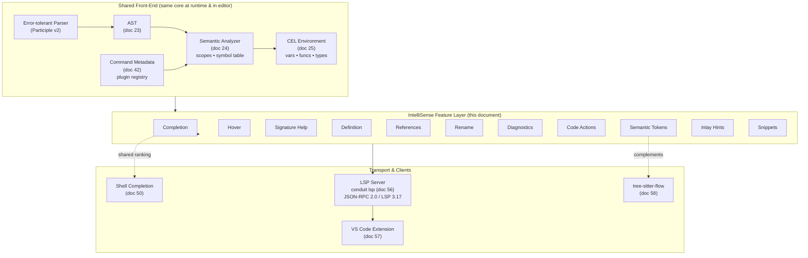

# Conduit — IntelliSense Architecture

> Document ID: `55-intellisense`
> Status: Draft (v0.1.0)
> Owner: Principal Developer-Experience Architect
> Last updated: 2026-07-02

Related documents:
- [Completion Engine](50-completion-engine.md)
- [LSP Architecture](56-lsp-architecture.md)
- [VS Code Extension](57-vscode-extension.md)
- [Semantic Analysis](24-semantic-analysis.md)
- [Expression Engine (CEL)](25-expression-engine.md)
- [Command Metadata](42-command-metadata.md)

---

## 1. Overview

**IntelliSense** in Conduit is the *feature layer* that turns editor interactions
(typing, hovering, invoking a command palette action) into rich language
assistance for both **FlowDSL** (`*.flow`) documents and the **`conduit` CLI**
itself (alias `cdt`). It is not a transport, and it is not a parser. It is the
set of language *features* — completion, hover, signature help, go-to-definition,
diagnostics, and so on — that sit **above** the LSP transport described in
[doc 56](56-lsp-architecture.md) and **reuse** the ranking machinery of the
[completion engine](50-completion-engine.md).

The single most important architectural point in this document, and one we will
repeat deliberately, is this:

> **Every IntelliSense feature is computed from one SHARED FRONT-END.**
> That front-end is the *error-tolerant parser* + *semantic analyzer*
> ([doc 24](24-semantic-analysis.md)) + *AST* ([doc 23](23-ast-design.md)) +
> *CEL environment* ([doc 25](25-expression-engine.md)) + *command metadata*
> ([doc 42](42-command-metadata.md)). **This is the same core that runs at
> runtime.** The editor and the runtime therefore *agree by construction*: a
> `.flow` file that the editor says is valid is a `.flow` file the runtime can
> execute, because both consult the same parse, the same symbol table, and the
> same CEL type-check.

The Participle v2 parser is run in an *error-tolerant* mode for editing (it does
not stop at the first syntax error), and the resulting partial AST is fed to the
semantic analyzer, which produces scopes, a symbol table, and a typed CEL
environment scoped to every position in the document. Features are thin
projections of that shared analysis result.



The completion engine (doc 50) is reused in two directions: the LSP
`textDocument/completion` feature and the shell completion that `conduit`
generates for bash/zsh/fish/pwsh. Both call the *same* candidate providers and
the *same* ranker, so CLI completion and editor completion stay at parity.

### 1.1 The `FrontEnd` seam

Every feature provider in this document is constructed against the same seam
that docs 50 and 56 use. It is deliberately small:

```go
// Package frontend exposes the shared analysis core reused by both the
// runtime and the IntelliSense feature layer. It is the single source of
// truth described throughout doc 55.
package frontend

import (
    "github.com/conduit-io/conduit/internal/ast"
    "github.com/conduit-io/conduit/internal/cel"
    "github.com/conduit-io/conduit/internal/metadata"
    "github.com/conduit-io/conduit/internal/sema"
)

// FrontEnd is the shared front-end. The same instance is used at runtime and
// in the editor, guaranteeing editor/runtime agreement.
type FrontEnd interface {
    // ParseTolerant parses source in error-tolerant mode, always returning a
    // (possibly partial) *ast.File plus any syntax diagnostics.
    ParseTolerant(uri string, src []byte) (*ast.File, []sema.Diagnostic)

    // Analyze runs semantic analysis over a parsed file: name resolution,
    // DAG construction, type checking, and CEL env construction.
    Analyze(file *ast.File) *sema.Result

    // ScopeAt returns the lexical scope (symbol table view) visible at pos.
    ScopeAt(res *sema.Result, pos ast.Position) *sema.Scope

    // CELEnvAt returns the CEL environment (typed vars + functions) that is
    // in effect for an interpolation at pos, e.g. inside a ${{ }} block.
    CELEnvAt(res *sema.Result, pos ast.Position) *cel.Env

    // Metadata is the command/plugin registry (doc 42).
    Metadata() *metadata.Registry
}
```

Read `ParseTolerant → Analyze → ScopeAt / CELEnvAt` as the four verbs every
feature uses. If you see a provider reaching outside these, it is a smell.

---

## 2. Completion

**What it does.** Offers context-aware candidate lists as the user types, in
both `.flow` files and the CLI.

**What feeds it.** It delegates ranking and fuzzy matching to the
[completion engine](50-completion-engine.md). The *candidates* come from the
shared front-end: the symbol table (task names, input names), the CEL env (vars
and functions), and the metadata registry (plugin actions and their params).
The engine decides *ordering*; the front-end decides *what is even valid here*.

**Contexts recognized in `.flow`:**

| Context | Trigger | Candidate source |
| --- | --- | --- |
| Task names after `needs:` | inside a `needs:` sequence | `sema` symbol table (tasks) |
| Plugin actions in `uses:` | after `uses:` | `metadata` registry |
| Action params in `with:` | keys under `with:` | schema of the resolved `uses:` action |
| CEL vars/functions | inside `${{ … }}` | `CELEnvAt(pos)` |
| Top-level keywords | column 0 of a block | static keyword set |
| Enum values | scalar with an enum schema | schema enum |

**Example (`.flow`).** Cursor at `|` completes sibling task names from the
symbol table:

```flow
tasks:
  build:
    uses: actions/go-build@v2
  test:
    needs: [bui|]        # -> completion offers: build
    uses: actions/go-test@v2
```

Inside an interpolation the CEL env drives it:

```flow
    with:
      artifact: ${{ tasks.build.outputs.| }}   # -> binary, coverage, ...
```

**CLI parity.** The same providers back shell completion. `conduit run <TAB>`
lists runnable flows; `conduit plugin add <TAB>` lists registry entries — all
via the doc 50 engine, so ranking behavior is identical to the editor.

```go
// CompletionProvider is the LSP-facing feature; it produces candidates and
// hands them to the doc 50 engine for ranking.
type CompletionProvider struct {
    fe     frontend.FrontEnd
    ranker completion.Ranker // doc 50
}

func (p *CompletionProvider) Complete(
    file *ast.File, res *sema.Result, pos ast.Position,
) []completion.Item {
    switch ctx := classifyContext(file, pos); ctx.Kind {
    case ctxNeeds:
        return p.ranker.Rank(ctx, p.fe.ScopeAt(res, pos).Tasks())
    case ctxUses:
        return p.ranker.Rank(ctx, p.fe.Metadata().Actions())
    case ctxCEL:
        env := p.fe.CELEnvAt(res, pos)
        return p.ranker.Rank(ctx, celCandidates(env))
    default:
        return p.ranker.Rank(ctx, keywordCandidates(ctx))
    }
}
```

---

## 3. Hover

**What it does.** On `textDocument/hover`, renders type, signature, and
documentation for the symbol under the cursor as **Markdown**.

**What feeds it.** The symbol table resolves the identifier at the position; the
CEL env supplies types for interpolation variables; the metadata registry
supplies plugin-action docs. All from the shared front-end.

**Targets:** a `task:` declaration, an `input:`, a plugin action (`uses:`), and
a CEL variable inside `${{ }}`.

**Example hover content** (for `tasks.build.outputs.binary`):

```markdown
**`tasks.build.outputs.binary`** · `string`

Output of task **build** (`actions/go-build@v2`).

> The path to the compiled binary, relative to the workspace root.

*Defined at* `build.flow:12`
```

```go
// HoverProvider pulls everything it needs from the shared front-end. Note the
// signature: it takes an *ast.File + *sema.Result + position — nothing else.
type HoverProvider struct{ fe frontend.FrontEnd }

func (h *HoverProvider) Hover(
    file *ast.File, res *sema.Result, pos ast.Position,
) (*lsp.Hover, bool) {
    node, ok := ast.NodeAt(file, pos)
    if !ok {
        return nil, false
    }
    switch n := node.(type) {
    case *ast.TaskRef:
        sym := h.fe.ScopeAt(res, pos).Resolve(n.Name)
        return markdownHover(taskDoc(sym)), sym != nil
    case *ast.CELIdent:
        env := h.fe.CELEnvAt(res, pos)
        t, found := env.TypeOf(n.Path())
        return markdownHover(celDoc(n.Path(), t)), found
    case *ast.UsesRef:
        act, found := h.fe.Metadata().Lookup(n.Ref)
        return markdownHover(actionDoc(act)), found
    }
    return nil, false
}
```

---

## 4. Signature help

**What it does.** On `textDocument/signatureHelp`, shows parameter lists with
the **active parameter** highlighted, both for plugin-action `with:` parameter
sets and for **CEL function calls** inside `${{ }}`.

**What feeds it.** Plugin-action parameters come from the metadata registry's
schema for the resolved `uses:` reference. CEL function overloads come from the
CEL environment. Active-parameter tracking is computed from the cursor offset
relative to the argument list / mapping keys.

**Example (CEL function inside interpolation):**

```flow
    with:
      tag: ${{ format("v%d.%d", major, mi|nor) }}
      #                                  ^ active parameter = 2 (minor)
```

Signature popup:

```
format(fmt: string, args: dyn...) -> string
                    ^^^^^^^^^^^^^ (active)
Formats a string using printf-style verbs.
```

For a plugin action, the parameters are the `with:` keys defined by the action
schema, with the active parameter being the key currently being edited and its
required/optional and type annotations pulled from the schema.

---

## 5. Go-to-definition

**What it does.** On `textDocument/definition`, jumps from a usage to its
declaration.

**What feeds it.** The semantic analyzer's symbol table stores a declaration
`ast.Range` for every symbol; the metadata registry stores a source location
(or schema URI) for every plugin action.

**Examples:**

- From `${{ tasks.build.outputs.x }}` → the `build:` task declaration. The CEL
  reference `tasks.build.*` is resolved through the CEL env back to the task
  symbol, whose `DeclRange` is returned.
- From a plugin action in `uses: actions/go-build@v2` → the action's schema
  definition (registry-resolved location).

```flow
tasks:
  build:                       # <- definition target
    uses: actions/go-build@v2
  publish:
    with:
      file: ${{ tasks.build.outputs.binary }}
      #             ^ go-to-definition lands on build:
```

```go
func (d *DefProvider) Definition(
    file *ast.File, res *sema.Result, pos ast.Position,
) ([]ast.Range, bool) {
    if ref, ok := ast.TaskRefAt(file, pos); ok {
        if sym := res.Symbols.Lookup(ref.Name); sym != nil {
            return []ast.Range{sym.DeclRange}, true
        }
    }
    if uses, ok := ast.UsesRefAt(file, pos); ok {
        if act, ok := d.fe.Metadata().Lookup(uses.Ref); ok {
            return []ast.Range{act.SchemaRange}, true
        }
    }
    return nil, false
}
```

---

## 6. Find references

**What it does.** On `textDocument/references`, lists every use of a task,
input, or CEL variable, optionally including its declaration.

**What feeds it.** The semantic analyzer's symbol table maintains, per symbol, a
back-index of every reference site (both structural references such as `needs:`
entries and interpolation references inside `${{ }}`). Finding references is a
lookup in that back-index — no re-scan needed.

**Example.** Requesting references on task `build` returns its declaration plus
every `needs: [build]` and every `${{ tasks.build.* }}` interpolation across the
document (and, when multi-file resolution is enabled, across imported flows).

```go
func (r *RefProvider) References(
    res *sema.Result, pos ast.Position, includeDecl bool,
) []ast.Range {
    sym := res.Symbols.At(pos)
    if sym == nil {
        return nil
    }
    out := append([]ast.Range(nil), sym.RefSites...)
    if includeDecl {
        out = append(out, sym.DeclRange)
    }
    return out
}
```

---

## 7. Rename

**What it does.** On `textDocument/rename`, performs a symbol-aware rename that
updates the declaration, all structural references, and all interpolation
references atomically. `textDocument/prepareRename` validates first.

**What feeds it.** The same symbol back-index as find-references. `prepareRename`
returns the exact editable range and rejects positions that are not renameable
symbols (e.g. a keyword, a string literal that is not an identifier, or an
unresolved reference).

**Behavior:**

1. `prepareRename` resolves the symbol at the cursor; if none, it returns an
   error so the client shows "cannot rename here".
2. `rename` validates the new name against FlowDSL identifier rules and checks
   for collisions in the target scope.
3. A `WorkspaceEdit` is emitted covering `DeclRange` + all `RefSites`, including
   the identifier *inside* `${{ tasks.<name>.… }}` interpolations.

```flow
# rename task build -> compile updates:
tasks:
  build:                                   # decl
  test:
    needs: [build]                         # structural ref
    with:
      out: ${{ tasks.build.outputs.bin }}  # interpolation ref
```

```go
func (r *RenameProvider) Prepare(
    res *sema.Result, pos ast.Position,
) (ast.Range, bool) {
    if sym := res.Symbols.At(pos); sym != nil && sym.Renameable {
        return sym.IdentRange, true
    }
    return ast.Range{}, false // -> "You cannot rename this element."
}
```

---

## 8. Diagnostics

**What it does.** Publishes problems via `textDocument/publishDiagnostics`
(push model). Diagnostics are recomputed on every change from the shared
front-end, so what the editor flags is exactly what the runtime would reject.

**What feeds it.** Parser (syntax), semantic analyzer (resolution, DAG, types),
metadata registry (unknown actions), and CEL (expression type/eval errors).

| Diagnostic | Source | Severity |
| --- | --- | --- |
| Parse / syntax error | parser | Error |
| Unknown task reference | sema | Error |
| Cyclic dependency (DAG cycle) | sema (DAG) | Error |
| Type error (input/output mismatch) | sema | Error |
| Unknown plugin action | metadata | Error |
| CEL type error | CEL env | Error |
| CEL eval error (constant fold) | CEL | Warning |
| Deprecated action version | metadata | Warning |
| Unused input | sema | Hint |

**Example — cyclic dependency:**

```flow
tasks:
  a:
    needs: [b]
  b:
    needs: [a]     # Error: cyclic dependency: a -> b -> a
```

```go
// Diagnostics are the union of every phase's findings — all from one pass.
func (s *Server) diagnose(uri string, src []byte) []lsp.Diagnostic {
    file, syn := s.fe.ParseTolerant(uri, src)
    res := s.fe.Analyze(file)
    return toLSP(append(append(syn, res.Diagnostics...), res.CELDiagnostics...))
}
```

Severity maps to `lsp.DiagnosticSeverity` (`Error=1`, `Warning=2`,
`Information=3`, `Hint=4`).

---

## 9. Code actions / quickfixes

**What it does.** On `textDocument/codeAction`, offers context-sensitive fixes,
typically wired to a diagnostic.

**What feeds it.** Diagnostics carry enough structured data (the offending
symbol, the DAG edge, the did-you-mean candidate from the symbol table's fuzzy
index) for the action to synthesize a `WorkspaceEdit`.

**Actions:**

- **Add missing `needs:`** — a task references `tasks.X.*` but does not declare
  `needs: [X]`; inserts the edge.
- **Import unknown plugin** — an unknown `uses:` matches a registry entry;
  offers to add the plugin to the manifest.
- **Convert literal to `${{ }}`** — wraps a scalar in an interpolation.
- **Fix typo'd task name (did-you-mean)** — replaces `buld` with `build` using
  the fuzzy suggestion attached to the "unknown task reference" diagnostic.
- **Extract value to input** — hoists a literal into the `inputs:` block and
  replaces it with `${{ inputs.<name> }}`.

**Example (did-you-mean):**

```flow
    needs: [buld]   # Error: unknown task 'buld'
                    #   💡 Quick fix: Change 'buld' to 'build'
```

```go
func (c *CodeActionProvider) forDiagnostic(
    d *sema.Diagnostic, res *sema.Result,
) []lsp.CodeAction {
    switch d.Code {
    case sema.ErrUnknownTask:
        if best, ok := res.Symbols.Fuzzy(d.Ident, 2); ok {
            return []lsp.CodeAction{replaceEdit("Change to '"+best+"'", d.Range, best)}
        }
    case sema.ErrMissingNeeds:
        return []lsp.CodeAction{insertNeeds(d.OwnerTask, d.Ident)}
    }
    return nil
}
```

---

## 10. Semantic tokens

**What it does.** Serves `textDocument/semanticTokens/full` and
`.../range` so LSP-token-capable clients get semantic (not just lexical)
highlighting.

**What feeds it.** The AST + symbol table classify each token by *meaning*
(is this identifier a variable read or a declaration? a deprecated action?),
which pure syntax highlighting cannot know.

**Token types:** `keyword`, `variable`, `function`, `parameter`, `namespace`,
`string`, `number`.
**Modifiers:** `declaration`, `readonly`, `deprecated`.

This **complements** the `tree-sitter-flow` grammar
([doc 58](58-tree-sitter-grammar.md)): tree-sitter provides fast, local,
edit-resilient *lexical* highlighting in every client, while LSP semantic tokens
add *semantic* overlays (e.g. marking a deprecated action `deprecated`, or a
task name at its declaration site `declaration`) for clients that support the
protocol.

```flow
tasks:            # keyword
  build:          # variable.declaration
    uses: actions/go-build@v2   # namespace + function; @v2 may be .deprecated
    with:
      out: ${{ tasks.build.outputs.bin }}  # tasks/build: variable.readonly
```

---

## 11. Inlay hints

**What it does.** Serves `textDocument/inlayHint` to render non-editable inline
annotations.

**What feeds it.** Types inferred by the semantic analyzer, the version resolved
by the metadata registry, and constant CEL values folded by the CEL env.

**Hints:**

- **Inferred input types** — appends `: string` / `: number` after an input
  whose type was inferred rather than declared.
- **Resolved plugin-action version** — shows the concrete version a floating
  ref resolved to, e.g. `@v2` → `(v2.3.1)`.
- **Evaluated constant CEL values** — shows the folded value of a constant
  expression.

```flow
inputs:
  retries          # : number   (inferred)
    default: 3
tasks:
  build:
    uses: actions/go-build@v2   # (v2.3.1)  <- resolved version
    with:
      tag: ${{ "v" + string(1 + 1) }}   # = "v2"  <- folded constant
```

---

## 12. Snippets

**What it does.** Ships FlowDSL scaffolding snippets, surfaced through
completion (`CompletionItemKind.Snippet`) and the client's snippet mechanism.

**What feeds it.** Static snippet definitions, plus tab-stop placeholders. Where
a placeholder is a task/action name, the surrounding completion context still
draws live candidates from the front-end.

**Snippets:** new workflow scaffold, task block, retry block, matrix.

**VS Code-style entries** (from the extension's `snippets/flow.json`):

```json
{
  "New workflow": {
    "prefix": "flow",
    "body": [
      "name: ${1:my-workflow}",
      "on: [${2:push}]",
      "tasks:",
      "  ${3:build}:",
      "    uses: ${4:actions/go-build@v2}",
      "    with:",
      "      $0"
    ],
    "description": "Scaffold a new Conduit workflow"
  },
  "Retry block": {
    "prefix": "retry",
    "body": [
      "retry:",
      "  max-attempts: ${1:3}",
      "  backoff: ${2:exponential}",
      "  delay: ${3:5s}"
    ],
    "description": "Add a retry policy to a task"
  }
}
```

Additional snippets `task` (a `uses:`/`with:`/`needs:` block) and `matrix`
(a `strategy.matrix` fan-out) follow the same pattern.

---

## 13. Feature matrix

Each IntelliSense feature maps to one or more LSP methods and draws from one or
more front-end data sources.

| Feature | LSP method(s) | Data source |
| --- | --- | --- |
| Completion | `textDocument/completion` | parser · sema · CEL · metadata (via doc 50 engine) |
| Hover | `textDocument/hover` | sema · CEL · metadata |
| Signature help | `textDocument/signatureHelp` | metadata (action schema) · CEL (functions) |
| Definition | `textDocument/definition` | sema symbol table · metadata (schema loc) |
| References | `textDocument/references` | sema symbol back-index |
| Rename | `textDocument/rename` + `textDocument/prepareRename` | sema symbol back-index |
| Diagnostics | `textDocument/publishDiagnostics` | parser · sema · CEL · metadata |
| Code actions | `textDocument/codeAction` | sema (fuzzy/DAG) · metadata (plugin registry) |
| Semantic tokens | `textDocument/semanticTokens/full` + `.../range` | AST · sema symbol table |
| Inlay hints | `textDocument/inlayHint` | sema (types) · metadata (versions) · CEL (folding) |
| Formatting | `textDocument/formatting` | parser (AST → canonical print) |
| Folding | `textDocument/foldingRange` | parser (AST block ranges) |

---

## 14. Cross-references

- **[Completion Engine (doc 50)](50-completion-engine.md)** — the ranking and
  fuzzy-matching engine that IntelliSense completion (§2) delegates to, and the
  shared basis for CLI shell completion parity.
- **[LSP Architecture (doc 56)](56-lsp-architecture.md)** — the JSON-RPC 2.0 /
  LSP 3.17 transport (`conduit lsp`) that dispatches the methods in the
  feature matrix (§13) to the providers in this document.
- **[VS Code Extension (doc 57)](57-vscode-extension.md)** — the primary client
  consuming these features, and the home of the snippet definitions (§12).
- **[Tree-sitter Grammar (doc 58)](58-tree-sitter-grammar.md)** — lexical
  highlighting that semantic tokens (§10) complement.
- **[Semantic Analysis (doc 24)](24-semantic-analysis.md)** — scopes, symbol
  table, DAG, and type checking; the backbone of nearly every feature.
- **[Expression Engine / CEL (doc 25)](25-expression-engine.md)** — the CEL-Go
  environment powering interpolation completion, hover, signature help, and
  CEL diagnostics.
- **[Command Metadata (doc 42)](42-command-metadata.md)** — the plugin/command
  registry backing `uses:` completion, action signature help, and version
  inlay hints.
- **[AST (doc 23)](23-ast-design.md)** — the node model traversed by every provider.
