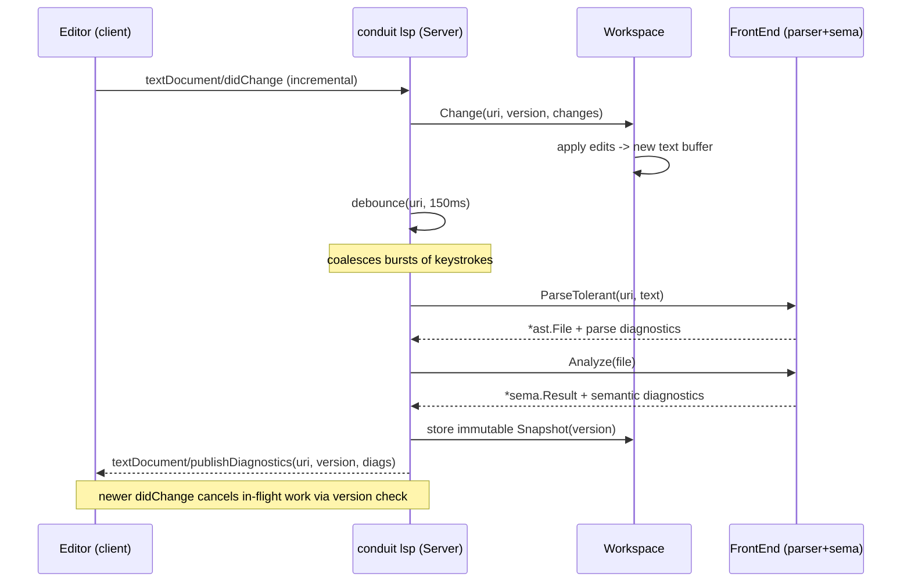

# Conduit — LSP Server Architecture

> Document ID: `56-lsp-architecture`
> Status: Draft (v0.1.0)
> Owner: Principal Developer-Experience Architect
> Last updated: 2026-07-02

Related documents:
- [IntelliSense Architecture](55-intellisense.md) · [Completion Engine](50-completion-engine.md)
- [VS Code Extension](57-vscode-extension.md) · [Tree-sitter Grammar](58-tree-sitter-grammar.md)
- [Parser Design](22-parser-design.md) · [AST Design](23-ast-design.md) · [Semantic Analysis](24-semantic-analysis.md) · [Expression Engine (CEL)](25-expression-engine.md)
- [Repository Structure](80-repository-structure.md) · [Command Metadata](42-command-metadata.md)

---

## 1. Purpose

`conduit lsp` is a **custom Language Server** for **FlowDSL** (`.flow`) implementing **JSON-RPC 2.0** and
the **Language Server Protocol 3.17**. It reuses Conduit's own **error-tolerant parser** and **semantic
analyzer** ([22](22-parser-design.md)/[24](24-semantic-analysis.md)) so that the editor and the runtime
agree on exactly one interpretation of a file. It powers IntelliSense ([55](55-intellisense.md)) in VS
Code ([57](57-vscode-extension.md)), Neovim, JetBrains, and any LSP client.

The server is a **subcommand of the main binary** (not a separate artifact), so it ships with every
install, versions in lockstep with the language, and shares the completion engine
([50](50-completion-engine.md)) and command metadata ([42](42-command-metadata.md)).

---

## 2. Transport & Lifecycle

Two transports, selected by flags:

- **stdio** (default): `conduit lsp` — used by VS Code, Neovim, most clients.
- **socket**: `conduit lsp --socket=127.0.0.1:7333` — for clients that prefer TCP, and for debugging.

```go
// package internal/lsp
func Run(ctx context.Context, opts Options) error {
    var stream jsonrpc2.Stream
    if opts.Socket != "" {
        conn, err := net.Dial("tcp", opts.Socket); /* ... */
        stream = jsonrpc2.NewHeaderStream(conn)
    } else {
        stream = jsonrpc2.NewHeaderStream(stdio.ReadWriteCloser()) // Content-Length framing
    }
    srv := NewServer(opts)
    conn := jsonrpc2.NewConn(stream)
    conn.Go(ctx, srv.Handler())   // dispatch loop
    <-conn.Done()
    return conn.Err()
}
```

Standard LSP lifecycle: `initialize` → `initialized` → (session) → `shutdown` → `exit`. Framing is
`Content-Length`-delimited JSON-RPC 2.0 messages.

---

## 3. Advertised Capabilities (LSP 3.17)

```jsonc
{
  "textDocumentSync": { "openClose": true, "change": 2 },      // 2 = Incremental
  "completionProvider": { "triggerCharacters": [".", ":", "$", "{", " "], "resolveProvider": true },
  "hoverProvider": true,
  "signatureHelpProvider": { "triggerCharacters": ["(", ","] },
  "definitionProvider": true,
  "referencesProvider": true,
  "documentSymbolProvider": true,
  "renameProvider": { "prepareProvider": true },
  "documentFormattingProvider": true,
  "codeActionProvider": { "codeActionKinds": ["quickfix", "refactor", "source"] },
  "semanticTokensProvider": {
    "legend": { "tokenTypes": ["keyword","variable","function","parameter","string","number","operator","namespace"],
                "tokenModifiers": ["declaration","readonly","deprecated"] },
    "full": true, "range": true
  },
  "inlayHintProvider": true,
  "foldingRangeProvider": true,
  "diagnosticProvider": { "interFileDependencies": true, "workspaceDiagnostics": false }
}
```

Feature-to-method mapping lives in [55 — IntelliSense](55-intellisense.md#feature-matrix).

---

## 4. Package Layout (`internal/lsp`)

Per [80 — Repository Structure](80-repository-structure.md):

```text
internal/lsp/
  server.go          // Server struct, handler dispatch, capabilities
  lifecycle.go       // initialize/initialized/shutdown/exit
  transport.go       // stdio/socket wiring, jsonrpc2 glue
  documents.go       // Workspace + Document model, incremental sync
  diagnostics.go     // publishDiagnostics, debounce, workspace roots
  completion.go      // textDocument/completion  -> completion engine (50)
  hover.go           // textDocument/hover
  signature.go       // textDocument/signatureHelp
  definition.go      // textDocument/definition, references, rename
  formatting.go      // textDocument/formatting
  semantictokens.go  // full + range token encoding
  inlayhints.go      // textDocument/inlayHint
  codeactions.go     // quickfixes from diagnostics
  convert.go         // AST<->LSP position/range mapping (UTF-16 offsets!)
  frontend.go        // shared front-end adapter (parser+sema+CEL)
```

The **front-end adapter** (`frontend.go`) is the single seam to the language core; it is the same
`FrontEnd` used by the completion engine ([50 §9](50-completion-engine.md)).

---

## 5. Core Interfaces

```go
// package internal/lsp

// Server holds the workspace, front-end, and the completion engine.
type Server struct {
    ws     *Workspace
    front  FrontEnd            // parser + sema + CEL (shared with completion)
    comp   completion.Engine   // shared with shells (doc 50)
    client Client              // reverse notifications (publishDiagnostics, ...)
    sem    *semaphore.Weighted // bounds concurrent CPU-heavy handlers
}

// Workspace is the in-memory model of all open + on-disk .flow files.
type Workspace interface {
    Open(uri string, version int, text string)
    Change(uri string, version int, changes []ContentChange) // incremental (§6)
    Close(uri string)
    Snapshot(uri string) (*Snapshot, bool)                   // immutable view
    Roots() []string
}

// Snapshot is an immutable, versioned parse+analysis of one document.
type Snapshot struct {
    URI     string
    Version int
    Text    []byte
    File    *ast.File            // error-tolerant AST (23)
    Sema    *sema.Result         // scopes, symbols, types (24)
    Diags   []Diagnostic
}

// FrontEnd is the shared language core seam (identical to completion.FrontEnd).
type FrontEnd interface {
    ParseTolerant(uri string, src []byte) (*ast.File, []Diagnostic)
    Analyze(f *ast.File) *sema.Result
    ScopeAt(*ast.File, ast.Pos) *sema.Scope
    CELEnvAt(*ast.File, ast.Pos) *cel.Env
}
```

---

## 6. Document Sync & Incremental Reparse

The server advertises **incremental** sync (`change: 2`). On `didChange`, only the changed ranges arrive.

```go
func (s *Server) didChange(ctx context.Context, p *DidChangeTextDocumentParams) error {
    s.ws.Change(p.TextDocument.URI, p.TextDocument.Version, toContentChanges(p.ContentChanges))
    s.scheduleDiagnostics(p.TextDocument.URI) // debounced (§7)
    return nil
}
```

**Position mapping.** LSP positions are UTF-16 code-unit offsets by default; the AST uses byte offsets.
`convert.go` maintains a line-index with UTF-16↔byte translation and is the *only* place that conversion
happens.

**Incremental reparse strategy.** FlowDSL files are small (typically < 2k lines); the pragmatic baseline
is a **full error-tolerant reparse per snapshot**, which comfortably fits the latency budget. The
front-end supports **node reuse**: unchanged top-level `task`/`workflow` blocks are carried over from the
previous AST when the edit is contained within a single block, avoiding re-analysis of the whole file.
Semantic analysis is memoized per top-level symbol and invalidated only for blocks touched by the edit.

---

## 7. Diagnostics (Push), Debounce & Concurrency

Diagnostics are **pushed** via `textDocument/publishDiagnostics` after a debounce window; the server also
implements the 3.17 **pull** `diagnostic` request for clients that prefer it.

```go
func (s *Server) scheduleDiagnostics(uri string) {
    s.debounce(uri, 150*time.Millisecond, func() {
        snap, ok := s.ws.Snapshot(uri); if !ok { return }
        // Snapshot already carries error-tolerant parse + sema diagnostics.
        s.client.PublishDiagnostics(PublishDiagnosticsParams{
            URI: uri, Version: snap.Version, Diagnostics: snap.Diags,
        })
    })
}
```

**Concurrency & cancellation.**

- Each request runs on its own goroutine; CPU-heavy handlers (completion, semantic tokens, formatting)
  acquire `s.sem` to bound parallelism.
- Handlers operate on **immutable `Snapshot`s**, so a newer edit never mutates an in-flight computation —
  it simply produces a newer snapshot.
- **`$/cancelRequest`** is honored: each request derives a `context.Context` cancelled on cancel
  notification or when a newer document version supersedes the work.

---

## 8. didChange → Diagnostics (Sequence)



---

## 9. Request Handlers (feed the same core)

Every handler resolves the target `Snapshot`, finds the AST node at the position, and consults sema/CEL.

- **completion** → delegates to the shared completion engine ([50 §9](50-completion-engine.md)); maps
  `completion.Item` → `CompletionItem` (with `insertText`, `kind`, `detail`, snippet format).
  `completionItem/resolve` lazily fills documentation.
- **hover** → renders the type/signature/doc of the symbol under the cursor (task, input, plugin action,
  CEL var) as Markdown.
- **signatureHelp** → for plugin action `with:` params and CEL function calls, shows parameter list and
  active parameter.
- **definition / references / rename** → use the sema symbol table: jump from a `${{ tasks.build.* }}`
  reference to the `task: build` declaration; rename updates all references (with `prepareRename`
  validating the identifier).
- **formatting** → canonical FlowDSL formatter (stable key ordering, indentation) shared with
  `conduit fmt`.
- **semanticTokens** → encodes tokens from the AST + sema (keywords, CEL vars, plugin namespaces) using
  the legend in [§3](#3-advertised-capabilities-lsp-317); complements the tree-sitter grammar
  ([58](58-tree-sitter-grammar.md)) for clients that use LSP tokens.
- **inlayHint** → inferred input types, resolved plugin-action version, evaluated-constant CEL values.
- **codeAction** → quickfixes attached to diagnostics (add missing `needs:`, import unknown plugin,
  convert string to `${{ }}`).

Detailed feature semantics and the LSP-method matrix are in [55 — IntelliSense](55-intellisense.md).

---

## 10. Performance

- **Budget:** completion/hover p95 < 50 ms on a warm snapshot; full-file diagnostics < 100 ms for a 1k-line
  file. Aligns with [NFR](04-non-functional-requirements.md).
- **Immutable snapshots + memoized sema** keep reparse cheap ([§6](#6-document-sync--incremental-reparse)).
- **Debounced diagnostics** ([§7](#7-diagnostics-push-debounce--concurrency)) prevent thrash during typing.
- **Bounded concurrency** via `semaphore` protects the host under many-file workspace scans.
- **Lazy plugin dial** for action-schema lookups mirrors the completion engine
  ([50 §8](50-completion-engine.md)).

---

## 11. Cross-References

- Consumes: [22 Parser](22-parser-design.md) · [23 AST](23-ast-design.md) · [24 Sema](24-semantic-analysis.md) · [25 CEL](25-expression-engine.md)
- Shares engine with: [50 Completion Engine](50-completion-engine.md)
- Surfaced by: [55 IntelliSense](55-intellisense.md) · [57 VS Code Extension](57-vscode-extension.md)
- Complemented by: [58 Tree-sitter Grammar](58-tree-sitter-grammar.md)
- Layout: [80 Repository Structure](80-repository-structure.md)
