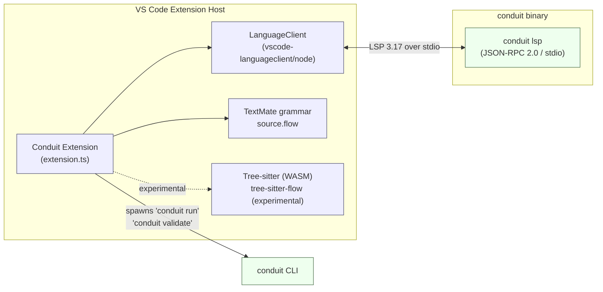
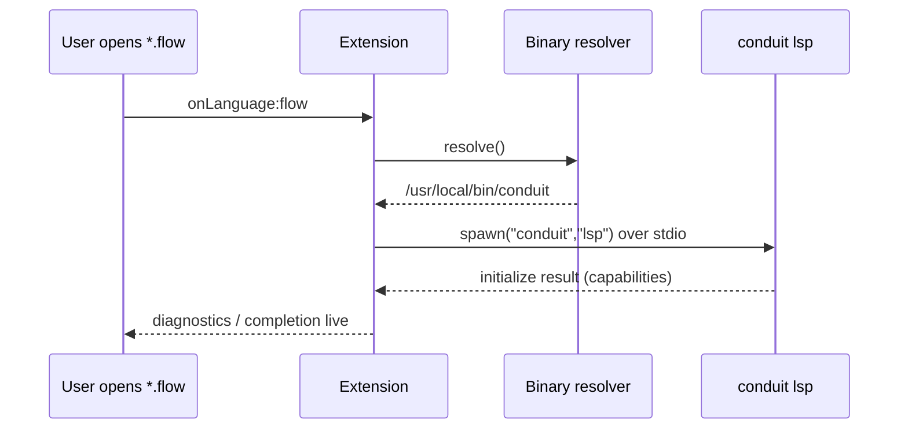

# Conduit — VS Code Extension Architecture

> Document ID: `57-vscode-extension`
> Status: Draft (v0.1.0)
> Owner: Principal Developer-Experience Architect
> Last updated: 2026-07-02

Related documents:
- [50-completion-engine.md](./50-completion-engine.md) — Completion engine internals
- [55-intellisense.md](./55-intellisense.md) — IntelliSense feature surface
- [56-lsp-architecture.md](./56-lsp-architecture.md) — `conduit lsp` server architecture
- [58-tree-sitter-grammar.md](./58-tree-sitter-grammar.md) — `tree-sitter-flow` grammar
- [20-dsl-grammar.md](./20-dsl-grammar.md) — FlowDSL grammar reference
- [25-expression-engine.md](./25-expression-engine.md) — Expression (CEL) engine

---

## 1. Overview

The Conduit VS Code extension is a **thin language client**. It provides no
language intelligence of its own — all completion, diagnostics, hover, go-to,
and rename features are served by the shipped `conduit` binary running in LSP
mode via `conduit lsp`. The extension's job is to:

1. Locate the `conduit` binary.
2. Launch `conduit lsp` and speak LSP 3.17 (JSON-RPC 2.0) over **stdio**.
3. Contribute editor metadata: the `flow` language, a TextMate grammar
   (`source.flow`), snippets, commands, tasks, and configuration.
4. Respect Workspace Trust so the platform never auto-executes untrusted flows.

FlowDSL files use the `.flow` extension and the MIME type
`application/vnd.conduit.flow`. Syntax highlighting ships as a TextMate grammar
today, with a richer Tree-sitter path (`tree-sitter-flow`, see
[58-tree-sitter-grammar.md](./58-tree-sitter-grammar.md)) available for editors
that support it and, experimentally, for VS Code via WASM.



The key design property: **the server is the product**. The same `conduit`
binary an operator runs in CI is the binary that powers IntelliSense. There is
no second implementation of FlowDSL semantics in TypeScript — this guarantees
the editor and the runtime never disagree. See
[56-lsp-architecture.md](./56-lsp-architecture.md).

---

## 2. Architecture: thin client, shipped-binary server

The extension bundles **no** language server of its own. At activation it
resolves the server command in priority order:

1. **`conduit.path` setting** — an explicit absolute path (or command name) to
   the binary. Highest priority; lets users pin a specific build.
2. **`PATH` lookup** — if `conduit` (or `cdt`) is discoverable on `PATH`.
3. **Bundled fallback** — a platform-specific `conduit` shipped inside the
   `.vsix` under `bin/<os>-<arch>/conduit[.exe]`, used only when the workspace
   is trusted and nothing else resolves.

Once resolved, the extension spawns `conduit lsp` with any extra
`conduit.lsp.args`, wiring stdin/stdout to the JSON-RPC transport. Because the
Go module is `github.com/conduit-io/conduit` and the LSP subcommand lives in the
same binary, version skew between client and server is naturally minimized:
users update one artifact.



---

## 3. Activation events

The extension activates lazily to keep VS Code startup fast:

```jsonc
"activationEvents": [
  "onLanguage:flow",
  "workspaceContains:**/*.flow",
  "onCommand:conduit.run",
  "onCommand:conduit.validate",
  "onCommand:conduit.restartServer",
  "onCommand:conduit.showDag"
]
```

- `onLanguage:flow` — a `.flow` document is opened.
- `workspaceContains:**/*.flow` — the folder holds FlowDSL, so tasks and the
  DAG view are available even before a file is opened.
- `onCommand:*` — invoking any Conduit command activates on demand.

> Note: modern VS Code can infer many activation events from `contributes`.
> We list them explicitly for clarity and for older host compatibility.

---

## 4. `contributes` surface

### 4.1 `languages`

```jsonc
{
  "id": "flow",
  "aliases": ["FlowDSL", "Conduit Flow", "flow"],
  "extensions": [".flow"],
  "mimetypes": ["application/vnd.conduit.flow"],
  "configuration": "./language-configuration.json"
}
```

`language-configuration.json` (jsonc) defines brackets, comments, and
auto-closing pairs:

```jsonc
{
  "comments": { "lineComment": "#", "blockComment": ["/*", "*/"] },
  "brackets": [["{", "}"], ["[", "]"], ["(", ")"]],
  "autoClosingPairs": [
    { "open": "{", "close": "}" },
    { "open": "[", "close": "]" },
    { "open": "(", "close": ")" },
    { "open": "\"", "close": "\"", "notIn": ["string"] },
    { "open": "${{", "close": " }}" }
  ],
  "surroundingPairs": [["{", "}"], ["[", "]"], ["(", ")"], ["\"", "\""]],
  "folding": { "markers": { "start": "^\\s*#region", "end": "^\\s*#endregion" } }
}
```

### 4.2 `grammars`

We contribute a TextMate grammar under scope `source.flow` for baseline
highlighting that works in every VS Code host, including the web:

```jsonc
{
  "language": "flow",
  "scopeName": "source.flow",
  "path": "./syntaxes/flow.tmLanguage.json",
  "embeddedLanguages": { "meta.embedded.expression.flow": "cel" }
}
```

For richer, incremental highlighting (folding, selection ranges, injected CEL),
the extension can optionally load the Tree-sitter grammar `tree-sitter-flow`
compiled to WASM. That path is experimental and documented in
[58-tree-sitter-grammar.md](./58-tree-sitter-grammar.md). The TextMate grammar
remains the always-on fallback.

### 4.3 `commands`

```jsonc
[
  { "command": "conduit.run",           "title": "Conduit: Run Flow" },
  { "command": "conduit.validate",      "title": "Conduit: Validate Flow" },
  { "command": "conduit.restartServer", "title": "Conduit: Restart Language Server" },
  { "command": "conduit.showDag",       "title": "Conduit: Show Flow DAG" }
]
```

### 4.4 `configuration`

```jsonc
{
  "title": "Conduit",
  "properties": {
    "conduit.path": {
      "type": "string", "default": "",
      "markdownDescription": "Path to the `conduit` binary. Empty = search PATH, then bundled fallback.",
      "scope": "machine-overridable"
    },
    "conduit.lsp.args": {
      "type": "array", "items": { "type": "string" }, "default": [],
      "description": "Extra arguments appended after `lsp`."
    },
    "conduit.trace.server": {
      "type": "string", "enum": ["off", "messages", "verbose"], "default": "off",
      "description": "Trace JSON-RPC traffic to the 'Conduit Language Server' output channel."
    },
    "conduit.telemetry.enabled": {
      "type": "boolean", "default": false,
      "markdownDescription": "Send anonymous usage telemetry. Also gated by VS Code `telemetry.telemetryLevel`."
    }
  }
}
```

### 4.5 `snippets`, `taskDefinitions`, and the debugger stub

```jsonc
"snippets": [{ "language": "flow", "path": "./snippets/flow.code-snippets" }],
"taskDefinitions": [
  {
    "type": "conduit",
    "required": ["flow"],
    "properties": {
      "flow":   { "type": "string", "description": "Path to the .flow file" },
      "target": { "type": "string", "description": "Named workflow/target to run" }
    }
  }
],
"debuggers": [
  {
    "type": "conduit-flow",
    "label": "Conduit Flow (experimental)",
    "languages": ["flow"],
    "configurationAttributes": {}
  }
]
```

A **TaskProvider** enumerates `.flow` files and surfaces each workflow as a
VS Code task (`conduit run <file> --target <name>`), so users get Run/Build
integration and problem-matcher diagnostics for free. The **debug adapter is a
stub** — the `contributes.debuggers` entry is a placeholder reserving the
`conduit-flow` debug type; no DAP server ships yet.

---

## 5. `extension.ts`

```typescript
import * as path from 'path';
import * as fs from 'fs';
import {
  ExtensionContext, commands, tasks, window, workspace, env, Uri,
} from 'vscode';
import {
  LanguageClient, LanguageClientOptions, ServerOptions, TransportKind,
} from 'vscode-languageclient/node';
import { ConduitTaskProvider } from './taskProvider';

let client: LanguageClient | undefined;

/** Resolve the `conduit` binary: setting -> PATH -> bundled fallback. */
function resolveServer(context: ExtensionContext): string {
  const configured = workspace.getConfiguration('conduit').get<string>('path');
  if (configured && configured.trim().length > 0) {
    return configured.trim();
  }
  const exe = process.platform === 'win32' ? 'conduit.exe' : 'conduit';
  // Only trust the bundled binary when the workspace is trusted (see §9).
  if (workspace.isTrusted) {
    const bundled = context.asAbsolutePath(
      path.join('bin', `${process.platform}-${process.arch}`, exe),
    );
    if (fs.existsSync(bundled)) return bundled;
  }
  // Fall through to bare command name; VS Code resolves it against PATH.
  return exe;
}

function buildClient(context: ExtensionContext): LanguageClient {
  const command = resolveServer(context);
  const extraArgs = workspace.getConfiguration('conduit').get<string[]>('lsp.args') ?? [];

  const serverOptions: ServerOptions = {
    command,
    args: ['lsp', ...extraArgs],
    transport: TransportKind.stdio,
    options: { env: { ...process.env, CONDUIT_LSP: '1' } },
  };

  const clientOptions: LanguageClientOptions = {
    documentSelector: [{ scheme: 'file', language: 'flow' }],
    synchronize: {
      fileEvents: workspace.createFileSystemWatcher('**/*.flow'),
    },
    outputChannelName: 'Conduit Language Server',
  };

  return new LanguageClient('conduit', 'Conduit Language Server',
    serverOptions, clientOptions);
}

export async function activate(context: ExtensionContext): Promise<void> {
  // In restricted (untrusted) workspaces we do NOT start a binary that can
  // execute code. Diagnostics/completion require running `conduit lsp`, so we
  // defer startup until the workspace is trusted.
  const start = async () => {
    if (client) return;
    client = buildClient(context);
    await client.start();
  };

  if (workspace.isTrusted) {
    await start();
  } else {
    context.subscriptions.push(
      workspace.onDidGrantWorkspaceTrust(() => void start()),
    );
    window.setStatusBarMessage('Conduit: language features disabled (untrusted workspace)', 5000);
  }

  // Task provider surfaces *.flow workflows as VS Code tasks (trusted only).
  context.subscriptions.push(
    tasks.registerTaskProvider('conduit', new ConduitTaskProvider(resolveServer(context))),
  );

  context.subscriptions.push(
    commands.registerCommand('conduit.restartServer', async () => {
      await client?.stop();
      client = undefined;
      await start();
    }),
    commands.registerCommand('conduit.validate', () =>
      commands.executeCommand('workbench.action.tasks.runTask', 'conduit: validate')),
    commands.registerCommand('conduit.run', () =>
      commands.executeCommand('workbench.action.tasks.runTask', 'conduit: run')),
    commands.registerCommand('conduit.showDag', async () => {
      const doc = window.activeTextEditor?.document;
      if (doc?.languageId === 'flow') {
        await env.openExternal(Uri.parse('conduit:dag?file=' + encodeURIComponent(doc.uri.fsPath)));
      }
    }),
  );
}

export function deactivate(): Thenable<void> | undefined {
  return client?.stop();
}
```

---

## 6. `package.json` contributes excerpt

```jsonc
{
  "name": "conduit",
  "displayName": "Conduit FlowDSL",
  "publisher": "conduit-io",
  "engines": { "vscode": "^1.90.0" },
  "categories": ["Programming Languages", "Snippets", "Linters"],
  "capabilities": {
    "untrustedWorkspaces": {
      "supported": "limited",
      "description": "Language features and task execution are disabled until the workspace is trusted."
    }
  },
  "main": "./dist/extension.js",
  "activationEvents": [
    "onLanguage:flow",
    "workspaceContains:**/*.flow"
  ],
  "contributes": {
    "languages": [{
      "id": "flow",
      "aliases": ["FlowDSL", "Conduit Flow"],
      "extensions": [".flow"],
      "mimetypes": ["application/vnd.conduit.flow"],
      "configuration": "./language-configuration.json"
    }],
    "grammars": [{
      "language": "flow",
      "scopeName": "source.flow",
      "path": "./syntaxes/flow.tmLanguage.json",
      "embeddedLanguages": { "meta.embedded.expression.flow": "cel" }
    }],
    "commands": [
      { "command": "conduit.run", "title": "Conduit: Run Flow" },
      { "command": "conduit.validate", "title": "Conduit: Validate Flow" },
      { "command": "conduit.restartServer", "title": "Conduit: Restart Language Server" },
      { "command": "conduit.showDag", "title": "Conduit: Show Flow DAG" }
    ],
    "configuration": {
      "title": "Conduit",
      "properties": {
        "conduit.path": { "type": "string", "default": "", "scope": "machine-overridable" },
        "conduit.lsp.args": { "type": "array", "items": { "type": "string" }, "default": [] },
        "conduit.trace.server": { "type": "string", "enum": ["off", "messages", "verbose"], "default": "off" },
        "conduit.telemetry.enabled": { "type": "boolean", "default": false }
      }
    },
    "snippets": [{ "language": "flow", "path": "./snippets/flow.code-snippets" }],
    "taskDefinitions": [{
      "type": "conduit",
      "required": ["flow"],
      "properties": {
        "flow": { "type": "string" },
        "target": { "type": "string" }
      }
    }],
    "debuggers": [{
      "type": "conduit-flow",
      "label": "Conduit Flow (experimental)",
      "languages": ["flow"]
    }]
  },
  "scripts": {
    "esbuild": "esbuild ./src/extension.ts --bundle --outfile=dist/extension.js --external:vscode --format=cjs --platform=node",
    "vscode:prepublish": "npm run esbuild -- --minify"
  }
}
```

---

## 7. Packaging & publishing

The extension is bundled with **esbuild** into a single `dist/extension.js`
(external: `vscode`). Only the built output, grammars, snippets, and
platform binaries ship in the `.vsix`.

`.vscodeignore` keeps sources out of the package:

```gitignore
src/**
**/*.ts
**/*.map
node_modules/**
tsconfig.json
.eslintrc*
esbuild.js
!dist/**
!bin/**
```

Publish pipeline:

```bash
# Compile
npm run esbuild -- --minify

# Package
npx vsce package -o conduit.vsix

# Publish to the VS Code Marketplace
npx vsce publish

# Mirror to Open VSX (for VSCodium / Gitpod / Theia / Cursor)
npx ovsx publish conduit.vsix -p "$OVSX_TOKEN"
```

Because we ship per-platform binaries, we build **platform-specific VSIXs**
(`vsce package --target win32-x64`, `linux-x64`, `darwin-arm64`, …) so users
only download the binary for their OS.

---

## 8. Settings & telemetry opt-in

Telemetry is **off by default** and doubly gated:

1. The user must set `conduit.telemetry.enabled: true`, **and**
2. VS Code's global `telemetry.telemetryLevel` must be `all` or `usage`.

```typescript
import { env, workspace, TelemetryLevel } from 'vscode';

function telemetryAllowed(): boolean {
  const own = workspace.getConfiguration('conduit').get<boolean>('telemetry.enabled', false);
  const host = env.isTelemetryEnabled; // honors telemetry.telemetryLevel
  return own && host;
}
```

We use `vscode.env.createTelemetryLogger` where possible so VS Code's own
sanitizers strip PII and the master switch is always respected. When either gate
is off, no network calls are made.

---

## 9. Workspace Trust & restricted mode

Running `conduit lsp` (and certainly `conduit run`) can execute arbitrary
workflow logic. Opening a random repository must **never** trigger execution.

Design rules:

- Declare limited support:

  ```jsonc
  "capabilities": {
    "untrustedWorkspaces": {
      "supported": "limited",
      "description": "Language features and task execution require workspace trust."
    }
  }
  ```

- In **restricted mode** we do **not** start the language client (see
  `activate()` in §5). We register a `onDidGrantWorkspaceTrust` handler and
  spin up the client only once trust is granted.
- The **bundled binary fallback** is only used in trusted workspaces
  (`resolveServer` checks `workspace.isTrusted`). An explicit `conduit.path`
  from machine/user settings is still honored, but execution features stay
  gated.
- **Run / Validate commands and the TaskProvider** short-circuit with a
  user-facing notice in untrusted workspaces rather than spawning a process.

This preserves the "clone and browse safely" guarantee while giving full
IntelliSense the moment a user trusts the folder.

---

## 10. Neovim & JetBrains via generic LSP

`conduit lsp` speaks standard LSP 3.17, so any client works. The extension in
this document is the VS Code integration; other editors point their generic LSP
client at the same subcommand.

### 10.1 Neovim (`nvim-lspconfig`)

```lua
-- ~/.config/nvim/lua/conduit.lua
vim.filetype.add({ extension = { flow = 'flow' } })

local configs = require('lspconfig.configs')
local lspconfig = require('lspconfig')

if not configs.conduit then
  configs.conduit = {
    default_config = {
      cmd = { 'conduit', 'lsp' },          -- stdio transport
      filetypes = { 'flow' },
      root_dir = lspconfig.util.root_pattern('.git', 'conduit.toml'),
      single_file_support = true,
    },
  }
end

lspconfig.conduit.setup({})
```

Neovim also consumes the Tree-sitter grammar via `nvim-treesitter`
(`:TSInstall flow`) for highlighting, folding, and CEL injection — see
[58-tree-sitter-grammar.md](./58-tree-sitter-grammar.md).

### 10.2 JetBrains IDEs

JetBrains platforms integrate through **LSP4IJ** (or the built-in LSP API in
Ultimate editions). Register a language server descriptor whose command is
`conduit lsp` and whose file pattern is `*.flow`. As with Neovim, no
Conduit-specific plugin logic is required beyond wiring the transport — the
server provides all intelligence. Tree-sitter is not used on JetBrains;
highlighting there falls back to a TextMate bundle or LSP semantic tokens.

---

## 11. Cross-references

- [56-lsp-architecture.md](./56-lsp-architecture.md) — how `conduit lsp` is
  structured (the server this extension drives).
- [55-intellisense.md](./55-intellisense.md) and
  [50-completion-engine.md](./50-completion-engine.md) — the features surfaced
  through this client.
- [58-tree-sitter-grammar.md](./58-tree-sitter-grammar.md) — the Tree-sitter
  highlighting grammar (`tree-sitter-flow`) referenced in §4.2 and §10.
- [20-dsl-grammar.md](./20-dsl-grammar.md) and
  [25-expression-engine.md](./25-expression-engine.md) — FlowDSL and CEL
  semantics that the server enforces.
