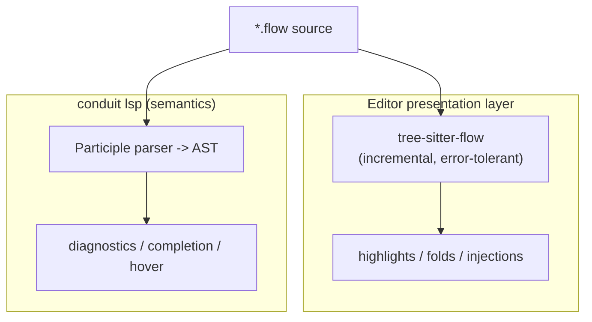

# Conduit — Tree-sitter Grammar (tree-sitter-flow)

> Document ID: `58-tree-sitter-grammar`
> Status: Draft (v0.1.0)
> Owner: Principal Developer-Experience Architect
> Last updated: 2026-07-02

Related documents:
- [57-vscode-extension.md](./57-vscode-extension.md) — VS Code extension architecture
- [56-lsp-architecture.md](./56-lsp-architecture.md) — `conduit lsp` semantic server
- [55-intellisense.md](./55-intellisense.md) — IntelliSense feature surface
- [20-dsl-grammar.md](./20-dsl-grammar.md) — FlowDSL grammar reference
- [25-expression-engine.md](./25-expression-engine.md) — Expression (CEL) engine

---

## 1. Overview: why Tree-sitter, and the two-parser design

Conduit deliberately maintains **two parsers for FlowDSL**:

1. **The semantic parser** — a [Participle](https://github.com/alecthomas/participle)
   grammar inside the `conduit` binary. It produces the authoritative AST used
   for validation, evaluation, and every LSP feature (completion, diagnostics,
   hover, rename). This is the source of truth. See
   [56-lsp-architecture.md](./56-lsp-architecture.md) and
   [20-dsl-grammar.md](./20-dsl-grammar.md).

2. **The highlighting parser** — `tree-sitter-flow`, a Tree-sitter grammar
   compiled to native/WASM and consumed by editors. It exists purely for the
   *editor presentation layer*: fast incremental syntax highlighting, code
   folding, selection ranges, and language injection.

This is intentional. Tree-sitter is **error-tolerant and incremental**: it
re-parses only the edited region on every keystroke in sub-millisecond time,
which is exactly what a highlighter needs but is a different optimization target
than a semantic analyzer. Keeping the two separate means the editor stays
buttery even on huge files, while semantics remain centralized in one Go
implementation. The two parsers are reconciled by a shared conformance corpus
(see [20-dsl-grammar.md](./20-dsl-grammar.md)) so they never drift on real
syntax.



---

## 2. Repository & package: `tree-sitter-flow`

The grammar lives in its own repo, published to npm as **`tree-sitter-flow`**.
It follows the conventional Tree-sitter layout:

```
tree-sitter-flow/
├── grammar.js               # grammar definition (source of truth)
├── src/
│   ├── parser.c             # GENERATED by `tree-sitter generate`
│   ├── scanner.c            # hand-written external scanner (C)
│   ├── grammar.json         # generated
│   └── node-types.json      # generated
├── queries/
│   ├── highlights.scm
│   ├── injections.scm
│   ├── locals.scm
│   └── folds.scm
├── test/corpus/*.txt        # corpus tests
├── bindings/                # node, rust
├── tree-sitter-flow.wasm    # web build artifact
├── binding.gyp
└── package.json
```

`src/parser.c` is generated and committed so downstream consumers can build
without running `tree-sitter generate`. A **WASM build**
(`tree-sitter build --wasm`) ships `tree-sitter-flow.wasm` for the browser —
used by the VS Code *web* host and the online FlowDSL playground.

---

## 3. `grammar.js` structure

```javascript
/// <reference types="tree-sitter-cli/dsl" />
// @ts-check

module.exports = grammar({
  name: 'flow',

  // Token used for keyword-extraction and error recovery.
  word: $ => $.identifier,

  // Whitespace and comments may appear between any tokens.
  extras: $ => [/\s/, $.comment],

  // Tokens produced by the external scanner in src/scanner.c (see §4).
  externals: $ => [
    $._interp_start,       // "${{"
    $._interp_end,         // "}}"
    $._string_content,     // raw text inside a "..." up to interp/quote
    $._heredoc_body,       // <<TAG ... TAG multiline body
    $._error_sentinel,     // never emitted; forces external error recovery
  ],

  conflicts: $ => [
    [$.task, $.step],
  ],

  rules: {
    source_file: $ => repeat($._top_level),

    _top_level: $ => choice($.workflow, $.comment),

    workflow: $ => seq(
      'workflow', field('name', $.identifier),
      '{', optional($.inputs), repeat($.task), '}',
    ),

    inputs: $ => seq(
      'inputs', '{', repeat($.pair), '}',
    ),

    task: $ => seq(
      'task', field('id', $.identifier),
      optional(seq('needs', '(', commaSep($.identifier), ')')),
      '{', repeat(choice($.pair, $.step)), '}',
    ),

    step: $ => seq(
      'step', field('name', $.string),
      '{', repeat($.pair), '}',
    ),

    pair: $ => seq(field('key', $.identifier), ':', field('value', $._value)),

    _value: $ => choice($.string, $.number, $.boolean, $.identifier,
                        $.interpolation, $.array),

    array: $ => seq('[', commaSep($._value), ']'),

    // A double-quoted string may embed ${{ ... }} interpolations.
    string: $ => seq(
      '"',
      repeat(choice($._string_content, $.interpolation, $.escape)),
      '"',
    ),

    // ${{ <cel expression> }} — boundaries produced by the external scanner.
    interpolation: $ => seq(
      $._interp_start,
      field('expression', $.expr),
      $._interp_end,
    ),

    // Opaque CEL expression text; injections.scm re-highlights it as CEL.
    expr: $ => /[^}]+(\}[^}][^}]*)*/,

    escape: _ => token(/\\["\\ntr$]/),
    identifier: _ => /[A-Za-z_][A-Za-z0-9_-]*/,
    number: _ => /-?\d+(\.\d+)?/,
    boolean: _ => choice('true', 'false'),
    comment: _ => token(choice(seq('#', /.*/), seq('/*', /[^*]*\*+([^/*][^*]*\*+)*/, '/'))),
  },
});

function commaSep(rule) { return optional(seq(rule, repeat(seq(',', rule)))); }
```

Highlights of the design:

- `word: $ => $.identifier` enables keyword extraction, so `workflow`, `task`,
  `step`, `needs`, `inputs` are recognized as keywords even though they collide
  with identifier shape.
- `extras` lets whitespace and comments float between tokens.
- `interpolation` is bounded by external tokens so the scanner — not the LR
  automaton — decides exactly where `${{` opens and `}}` closes, even with
  nested braces in CEL.

---

## 4. External scanner (`src/scanner.c`)

Some FlowDSL constructs cannot be expressed with regular tokens:

- **`${{ ... }}` interpolation boundaries.** CEL expressions contain `}`
  characters (map/struct literals, `x % 2 == 0`, etc.), so a naive `}}` regex
  mis-terminates. The scanner scans balanced content and only emits
  `_interp_end` on the *real* closing `}}`.
- **Heredoc-style multiline blocks** (`<<TAG ... TAG`): the closing delimiter is
  data-dependent and can't be a static token.
- **String content** up to the next interpolation or closing quote, so the
  grammar can interleave `_string_content` and `interpolation` cleanly.

```c
#include "tree_sitter/parser.h"
#include <wctype.h>
#include <string.h>

enum TokenType {
  INTERP_START,   // ${{
  INTERP_END,     // }}
  STRING_CONTENT, // raw text inside "..."
  HEREDOC_BODY,   // <<TAG ... TAG
  ERROR_SENTINEL,
};

typedef struct { char heredoc_tag[32]; uint8_t tag_len; } Scanner;

void *tree_sitter_flow_external_scanner_create(void) {
  Scanner *s = calloc(1, sizeof(Scanner));
  return s;
}

void tree_sitter_flow_external_scanner_destroy(void *payload) { free(payload); }

unsigned tree_sitter_flow_external_scanner_serialize(void *payload, char *buf) {
  Scanner *s = payload;
  buf[0] = s->tag_len;
  memcpy(buf + 1, s->heredoc_tag, s->tag_len);
  return 1 + s->tag_len;
}

void tree_sitter_flow_external_scanner_deserialize(void *payload, const char *buf, unsigned len) {
  Scanner *s = payload;
  if (len == 0) { s->tag_len = 0; return; }
  s->tag_len = (uint8_t)buf[0];
  memcpy(s->heredoc_tag, buf + 1, s->tag_len);
}

static void advance(TSLexer *l) { l->advance(l, false); }

bool tree_sitter_flow_external_scanner_scan(void *payload, TSLexer *lexer,
                                            const bool *valid_symbols) {
  // Emit "${{"
  if (valid_symbols[INTERP_START] && lexer->lookahead == '$') {
    advance(lexer);
    if (lexer->lookahead != '{') return false;
    advance(lexer);
    if (lexer->lookahead != '{') return false;
    advance(lexer);
    lexer->result_symbol = INTERP_START;
    return true;
  }

  // Emit "}}" only when the two closers are adjacent.
  if (valid_symbols[INTERP_END] && lexer->lookahead == '}') {
    advance(lexer);
    if (lexer->lookahead != '}') return false;
    advance(lexer);
    lexer->result_symbol = INTERP_END;
    return true;
  }

  // Consume string content up to a quote or an interpolation start.
  if (valid_symbols[STRING_CONTENT]) {
    bool consumed = false;
    while (lexer->lookahead != '"' && lexer->lookahead != 0) {
      if (lexer->lookahead == '$') { lexer->mark_end(lexer); break; }
      consumed = true;
      advance(lexer);
      lexer->mark_end(lexer);
    }
    if (consumed) { lexer->result_symbol = STRING_CONTENT; return true; }
  }
  return false;
}
```

The corresponding `externals` array in `grammar.js` (§3) lists these tokens in
the same order the enum declares them.

---

## 5. Query files

### 5.1 `queries/highlights.scm`

```scheme
; Keywords
["workflow" "task" "step" "inputs" "needs"] @keyword

; Literals
(string) @string
(escape) @string.escape
(number) @number
(boolean) @constant.builtin
(comment) @comment

; Structure
(workflow name: (identifier) @function)
(task id: (identifier) @function.method)
(pair key: (identifier) @property)

; Interpolation delimiters
(interpolation (_) @none)
["${{" "}}"] @punctuation.special

; Operators / punctuation
[":" ","] @punctuation.delimiter
["{" "}" "[" "]" "(" ")"] @punctuation.bracket

; Fallback identifiers as variables
(identifier) @variable
```

### 5.2 `queries/injections.scm`

The content of every `${{ ... }}` is a CEL expression
([25-expression-engine.md](./25-expression-engine.md)); inject the `cel`
language so editors highlight it with CEL rules:

```scheme
; Inject CEL into interpolation expressions.
(interpolation
  expression: (expr) @injection.content
  (#set! injection.language "cel"))
```

### 5.3 `queries/locals.scm`

Scopes and definitions/references let editors resolve `task` ids and `inputs`
locally (used by highlight disambiguation and simple navigation):

```scheme
(workflow) @local.scope

; task <id> { } defines a symbol
(task id: (identifier) @local.definition.function)

; inputs { key: ... } define input names
(inputs (pair key: (identifier) @local.definition.parameter))

; identifiers elsewhere are references
(identifier) @local.reference
```

### 5.4 `queries/folds.scm`

```scheme
(workflow) @fold
(task) @fold
(step) @fold
(inputs) @fold
```

---

## 6. Testing (corpus)

Tree-sitter corpus tests live under `test/corpus/*.txt` and use the standard
`====` header / `---` divider format. `tree-sitter test` parses the input and
asserts the printed S-expression matches.

`test/corpus/workflow.txt`:

```
==================
Simple workflow with an interpolated task
==================

workflow deploy {
  task build {
    step "compile" {
      run: "go build ${{ inputs.target }}"
    }
  }
}

---

(source_file
  (workflow
    name: (identifier)
    (task
      id: (identifier)
      (step
        name: (string)
        (pair
          key: (identifier)
          value: (string
            (string_content)
            (interpolation
              expression: (expr))))))))
```

Run the suite:

```bash
tree-sitter generate      # regenerate parser.c from grammar.js
tree-sitter test          # run all corpus files
tree-sitter test -f "interpolated"   # filter by test name
```

---

## 7. Build & publish

```bash
# 1. Regenerate the parser from grammar.js (+ scanner.c is picked up)
tree-sitter generate

# 2. Verify against the corpus
tree-sitter test

# 3. Native build (node/rust bindings compile parser.c + scanner.c)
tree-sitter build

# 4. WASM artifact for the browser / VS Code web
tree-sitter build --wasm            # -> tree-sitter-flow.wasm

# 5. Publish to npm (ships grammar.js, src/*, queries/, wasm)
npm publish --access public
```

`package.json` declares the entry points and bindings:

```jsonc
{
  "name": "tree-sitter-flow",
  "version": "0.1.0",
  "main": "bindings/node",
  "files": ["grammar.js", "src/**", "queries/**", "bindings/**", "tree-sitter-flow.wasm"],
  "tree-sitter": [{
    "scope": "source.flow",
    "file-types": ["flow"],
    "injection-regex": "^flow$",
    "highlights": ["queries/highlights.scm"],
    "injections": ["queries/injections.scm"],
    "locals": ["queries/locals.scm"]
  }],
  "dependencies": { "node-addon-api": "^8.0.0", "node-gyp-build": "^4.8.0" },
  "peerDependencies": { "tree-sitter": "^0.21.0" }
}
```

Bindings: **node** (the default, for VS Code/electron and Node tooling) and an
optional **rust** binding (`bindings/rust`, `Cargo.toml`) for Rust-based
consumers. A WASM artifact covers browser use.

---

## 8. Integration

### 8.1 Neovim (`nvim-treesitter`)

Register the parser and install it:

```lua
local parser_config = require('nvim-treesitter.parsers').get_parser_configs()
parser_config.flow = {
  install_info = {
    url = 'https://github.com/conduit-io/tree-sitter-flow',
    files = { 'src/parser.c', 'src/scanner.c' },
    branch = 'main',
  },
  filetype = 'flow',
}
```

Then `:TSInstall flow` and copy the `queries/*.scm` into
`~/.config/nvim/queries/flow/`. Neovim now highlights, folds, and — thanks to
`injections.scm` — highlights CEL inside `${{ }}` automatically. This pairs with
the Neovim LSP setup in [57-vscode-extension.md](./57-vscode-extension.md) §10.

### 8.2 VS Code

VS Code ships baseline highlighting via the TextMate grammar (`source.flow`,
[57-vscode-extension.md](./57-vscode-extension.md) §4.2). For richer,
incremental highlighting the extension can optionally load
`tree-sitter-flow.wasm` and apply the queries — an **experimental** path,
particularly for the web host where the WASM build is required. The TextMate
grammar remains the always-on fallback so highlighting never depends on the
experimental layer.

### 8.3 CEL injection end-to-end

Because `injections.scm` marks `(expr)` inside `interpolation` as
`injection.language = "cel"`, any Tree-sitter-aware editor that has a `cel`
grammar installed will highlight the embedded expression with full CEL syntax
coloring — operators, function calls, member access — while the surrounding
FlowDSL keeps its own theme. This is the visual counterpart to the semantics in
[25-expression-engine.md](./25-expression-engine.md).

---

## 9. Cross-references

- [57-vscode-extension.md](./57-vscode-extension.md) — how VS Code and Neovim
  consume this grammar; TextMate fallback vs experimental Tree-sitter.
- [56-lsp-architecture.md](./56-lsp-architecture.md) — the *semantic* parser
  (Participle) this grammar is deliberately separate from.
- [55-intellisense.md](./55-intellisense.md) — features served by the semantic
  layer, not this highlighting layer.
- [20-dsl-grammar.md](./20-dsl-grammar.md) — the authoritative FlowDSL grammar
  and shared conformance corpus.
- [25-expression-engine.md](./25-expression-engine.md) — the CEL expression
  language injected into `${{ }}`.
