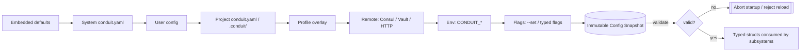

# Conduit — Configuration Architecture

> Document ID: `60-configuration`
> Status: Draft (v0.1.0)
> Owner: Principal Platform Architect
> Last updated: 2026-07-02

Related documents:
- [Platform Architecture](10-platform-architecture.md)
- [Component Architecture](11-component-architecture.md)
- [Secrets Management](61-secrets-management.md)
- [Authentication](62-authentication.md)
- [Authorization](63-authorization.md)
- [Observability](64-observability.md)
- [Logging](65-logging.md)
- [Threat Model](69-threat-model.md)
- [Security Requirements](05-security-requirements.md)

---

## 1. Overview

Conduit configuration is built on **[Koanf](https://github.com/knadh/koanf)** as a *layered, precedence-ordered* provider stack. Configuration is resolved once at startup into an immutable, validated, strongly-typed `*conduit.Config` snapshot, and may be *hot-reloaded* into a new snapshot when watched sources change. No component reads raw config keys directly at runtime; they consume typed structs from the current snapshot.

Design goals (mapped to [NFRs](04-non-functional-requirements.md) / [SEC requirements](05-security-requirements.md)):

- **Deterministic precedence.** Every value has exactly one winning source, and Conduit can explain *why* (`conduit config get --explain`).
- **Fail-closed validation.** An invalid config aborts startup; the daemon never runs on a partially-parsed config.
- **Secret-safe.** Config carries *secret references*, never plaintext secrets. Resolution is deferred to the [secrets subsystem](61-secrets-management.md).
- **Hot-reloadable.** File and remote providers can be watched; a reload produces a new snapshot atomically or is rejected wholesale.
- **Explainable + typed.** Config binds into Go structs with `koanf` tags, validated by struct tags + custom validators.

---

## 2. Precedence Model

Later sources override earlier ones. This is the **authoritative precedence order** for Conduit:

```
(lowest)  1. Embedded defaults        (compiled-in, struct defaults)
          2. System config            (/etc/conduit/conduit.yaml, %ProgramData%\Conduit)
          3. User config              (~/.config/conduit/config.yaml, %APPDATA%\Conduit)
          4. Project config           (./conduit.yaml, then ./.conduit/config.yaml)
          5. Profile overlay          (selected profile/environment block)
          6. Remote providers         (Consul, Vault, HTTP) — if enabled
          7. Environment variables    (CONDUIT_*)
(highest) 8. Command-line flags        (Cobra flags, incl. --set key=value)
```

Notes:
- **Remote below env/flags on purpose.** A remote control plane sets org baselines, but an operator on the box (env/flags) can always override locally for break-glass. Remote sources that must *not* be overridable are marked `enforced: true` and re-applied last (see §9).
- **Per-workflow overrides** (§8) are applied *within* the run context on top of the resolved global snapshot, not into the global snapshot.



---

## 3. Configuration Sources

| # | Source | Koanf provider | Parser | Watchable | Notes |
|---|--------|----------------|--------|-----------|-------|
| 1 | Embedded defaults | `structs`/`confmap` | — | No | Defaults defined on Go structs + a shipped `defaults.yaml` embedded via `embed.FS`. |
| 2 | System config | `file` | `yaml` | Yes | `/etc/conduit/conduit.yaml` (Linux/macOS), `%ProgramData%\Conduit\conduit.yaml` (Windows). |
| 3 | User config | `file` | `yaml` | Yes | XDG: `$XDG_CONFIG_HOME/conduit/config.yaml`; Windows `%APPDATA%\Conduit\config.yaml`. |
| 4 | Project config | `file` | `yaml` | Yes | `./conduit.yaml`, then merged with `./.conduit/config.yaml`. Discovered by walking up from CWD to repo root. |
| 5 | Profile overlay | `confmap` | — | n/a | Extracted `profiles.<name>` block from any file layer (§7). |
| 6 | Remote | custom (`consul`, `vault`, `http`) | `yaml`/`json` | Yes (long-poll/watch) | Opt-in; requires auth. See §9. |
| 7 | Environment | `env` | — | No (snapshot at load) | Prefix `CONDUIT_`, `__` nesting delimiter. |
| 8 | Flags | `posflag` | — | No | Bound to Cobra `*pflag.FlagSet`; includes generic `--set a.b=c`. |

### 3.1 Environment variable mapping

- Prefix: `CONDUIT_`
- Nesting delimiter: `__` (double underscore) → `.`
- Case: uppercased key path.

Examples:

```
CONDUIT_LOG__LEVEL=debug            -> log.level = "debug"
CONDUIT_RUNTIME__MAX_PARALLEL=8     -> runtime.maxParallel = 8
CONDUIT_REMOTE__CONSUL__ADDR=...    -> remote.consul.addr = "..."
CONDUIT_SECRETS__PROVIDER=vault     -> secrets.provider = "vault"
```

Secret *values* are never sourced from generic env this way — secret *references* are (see §10 and [Secrets Management](61-secrets-management.md)).

---

## 4. Canonical `conduit.yaml`

```yaml
# conduit.yaml — project configuration
version: 1                      # config schema version (see §6.3)

log:
  level: info                   # trace|debug|info|warn|error
  format: auto                  # auto|text|json
  redaction: true

runtime:
  maxParallel: 4                # DAG scheduler width
  defaultTimeout: 30m
  failFast: true

state:
  backend: local                # local|s3|remote
  dir: .conduit/state
  encryptAtRest: true           # see 61-secrets-management.md §8
  encryptionKeyRef: ${{ secret.CONDUIT_STATE_KEY }}

observability:
  otel:
    enabled: true
    endpoint: ${env.OTEL_EXPORTER_OTLP_ENDPOINT}
    sampleRatio: 0.1
  telemetry:                    # product telemetry — OFF by default (66-telemetry.md)
    enabled: false

secrets:
  provider: env                 # env|file|keychain|vault|kms|plugin
  cacheTTL: 5m

auth:                           # server/daemon & registry auth (62-authentication.md)
  mode: local                   # local|oidc|mtls|token
  registry:
    url: https://registry.conduit.internal

plugins:
  trust: verified-only          # any|verified-only|pinned
  config:
    cloud-aws:
      region: us-east-1
      roleArnRef: ${{ secret.AWS_ROLE_ARN }}

remote:
  enabled: false
  consul:
    addr: http://consul.internal:8500
    prefix: conduit/config
    enforced: false

# Environment/profile overlays (§7)
profiles:
  prod:
    log: { level: warn }
    runtime: { maxParallel: 16 }
    auth: { mode: oidc }
  ci:
    log: { format: json }
    observability: { telemetry: { enabled: false } }
```

---

## 5. Provider Stack — Go Implementation

The loader assembles the Koanf instance in precedence order. Each layer is loaded into the *same* `*koanf.Koanf` with `koanf.WithMergeFunc`, so later `Load` calls override earlier keys.

```go
// Package config assembles the layered Koanf provider stack for Conduit.
package config

import (
	"context"
	"embed"
	"fmt"
	"os"
	"path/filepath"
	"strings"

	"github.com/knadh/koanf/v2"
	"github.com/knadh/koanf/parsers/yaml"
	kenv "github.com/knadh/koanf/providers/env"
	kfile "github.com/knadh/koanf/providers/file"
	kfs "github.com/knadh/koanf/providers/fs"
	kposflag "github.com/knadh/koanf/providers/posflag"
	"github.com/knadh/koanf/providers/confmap"
	"github.com/spf13/pflag"
)

//go:embed defaults.yaml
var embeddedDefaults embed.FS

const (
	EnvPrefix    = "CONDUIT_"
	EnvDelimiter = "__"
	KeyDelimiter = "."
)

// Loader builds and validates immutable config snapshots.
type Loader struct {
	flags      *pflag.FlagSet
	profile    string
	remote     RemoteConfig
	discovered DiscoveredPaths // system/user/project file paths
}

// Load resolves all layers in precedence order into a validated Snapshot.
func (l *Loader) Load(ctx context.Context) (*Snapshot, error) {
	k := koanf.NewWithConf(koanf.Conf{Delim: KeyDelimiter, StrictMerge: false})

	// 1. Embedded defaults (lowest precedence).
	if err := k.Load(kfs.Provider(embeddedDefaults, "defaults.yaml"), yaml.Parser()); err != nil {
		return nil, fmt.Errorf("load defaults: %w", err)
	}

	// 2..4. File layers: system -> user -> project (+ .conduit/config.yaml).
	for _, p := range l.discovered.Ordered() {
		if p == "" {
			continue
		}
		if err := k.Load(kfile.Provider(p), yaml.Parser()); err != nil {
			if os.IsNotExist(err) {
				continue // optional layer
			}
			return nil, fmt.Errorf("load %s: %w", p, err)
		}
	}

	// 5. Profile overlay: promote profiles.<name>.* to top level.
	if l.profile != "" {
		if err := applyProfile(k, l.profile); err != nil {
			return nil, err
		}
	}

	// 6. Remote providers (Consul/Vault/HTTP), if enabled.
	if l.remote.Enabled {
		if err := l.loadRemote(ctx, k); err != nil {
			return nil, fmt.Errorf("load remote: %w", err)
		}
	}

	// 7. Environment variables: CONDUIT_FOO__BAR -> foo.bar
	envCb := func(key string) string {
		key = strings.TrimPrefix(key, EnvPrefix)
		key = strings.ReplaceAll(strings.ToLower(key), EnvDelimiter, KeyDelimiter)
		return key
	}
	if err := k.Load(kenv.Provider(EnvPrefix, KeyDelimiter, envCb), nil); err != nil {
		return nil, fmt.Errorf("load env: %w", err)
	}

	// 8. Flags (highest precedence). Only changed flags override.
	if l.flags != nil {
		if err := k.Load(kposflag.Provider(l.flags, KeyDelimiter, k), nil); err != nil {
			return nil, fmt.Errorf("load flags: %w", err)
		}
		if err := applySetOverrides(k, l.flags); err != nil { // --set a.b=c
			return nil, err
		}
	}

	// 9. Re-apply enforced remote keys so they win even over local overrides.
	if l.remote.Enabled {
		if err := l.reapplyEnforced(ctx, k); err != nil {
			return nil, err
		}
	}

	return newSnapshot(k) // unmarshal + validate (§6)
}

// applyProfile merges profiles.<name> onto the root, then deletes the profiles tree.
func applyProfile(k *koanf.Koanf, name string) error {
	sub := k.Cut("profiles." + name)
	if len(sub.Keys()) == 0 {
		return fmt.Errorf("profile %q not found", name)
	}
	if err := k.Load(confmap.Provider(sub.All(), KeyDelimiter), nil); err != nil {
		return err
	}
	k.Delete("profiles")
	return nil
}

// DiscoveredPaths returns file layers in precedence order (system -> user -> project).
type DiscoveredPaths struct {
	System  string
	User    string
	Project []string // conduit.yaml, .conduit/config.yaml
}

func (d DiscoveredPaths) Ordered() []string {
	out := []string{d.System, d.User}
	return append(out, d.Project...)
}

// discoverProject walks up from cwd to the repo/filesystem root.
func discoverProject(start string) []string {
	var found []string
	dir := start
	for {
		for _, name := range []string{"conduit.yaml", filepath.Join(".conduit", "config.yaml")} {
			p := filepath.Join(dir, name)
			if _, err := os.Stat(p); err == nil {
				found = append(found, p)
			}
		}
		parent := filepath.Dir(dir)
		if parent == dir {
			break
		}
		dir = parent
	}
	return found
}
```

---

## 6. Typed Config, Schema & Validation

### 6.1 Typed structs

Config unmarshals into strongly-typed structs. `koanf` tags map keys; `validate` tags drive validation via [`go-playground/validator`](https://github.com/go-playground/validator); custom `Validate()` methods handle cross-field rules.

```go
// Config is the fully-resolved, immutable configuration.
type Config struct {
	Version       int                 `koanf:"version" validate:"required,eq=1"`
	Log           LogConfig           `koanf:"log"`
	Runtime       RuntimeConfig       `koanf:"runtime"`
	State         StateConfig         `koanf:"state"`
	Observability ObservabilityConfig `koanf:"observability"`
	Secrets       SecretsConfig       `koanf:"secrets"`
	Auth          AuthConfig          `koanf:"auth"`
	Plugins       PluginsConfig       `koanf:"plugins"`
	Remote        RemoteConfig        `koanf:"remote"`
}

type LogConfig struct {
	Level     string `koanf:"level"     validate:"oneof=trace debug info warn error"`
	Format    string `koanf:"format"    validate:"oneof=auto text json"`
	Redaction bool   `koanf:"redaction"`
}

type RuntimeConfig struct {
	MaxParallel    int           `koanf:"maxParallel"    validate:"gte=1,lte=1024"`
	DefaultTimeout time.Duration `koanf:"defaultTimeout" validate:"gt=0"`
	FailFast       bool          `koanf:"failFast"`
}

type StateConfig struct {
	Backend          string    `koanf:"backend"          validate:"oneof=local s3 remote"`
	Dir              string    `koanf:"dir"`
	EncryptAtRest    bool      `koanf:"encryptAtRest"`
	EncryptionKeyRef SecretRef `koanf:"encryptionKeyRef"` // see 61-secrets-management.md
}

type SecretsConfig struct {
	Provider string        `koanf:"provider" validate:"oneof=env file keychain vault kms plugin"`
	CacheTTL time.Duration `koanf:"cacheTTL" validate:"gte=0"`
}
```

### 6.2 Snapshot + validation

```go
// Snapshot is an immutable, validated view of resolved config.
type Snapshot struct {
	cfg    Config
	k      *koanf.Koanf // retained for --explain / provenance
	loaded time.Time
}

var validate = validator.New(validator.WithRequiredStructEnabled())

func newSnapshot(k *koanf.Koanf) (*Snapshot, error) {
	var cfg Config
	// Unmarshal with weakly-typed decode hooks (durations, string->slice, etc.).
	if err := k.UnmarshalWithConf("", &cfg, koanf.UnmarshalConf{
		Tag: "koanf",
		DecoderConfig: &mapstructure.DecoderConfig{
			DecodeHook: mapstructure.ComposeDecodeHookFunc(
				mapstructure.StringToTimeDurationHookFunc(),
				mapstructure.StringToSliceHookFunc(","),
			),
			WeaklyTypedInput: true,
			Result:           &cfg,
			ErrorUnused:      true, // reject unknown keys -> fail-closed
		},
	}); err != nil {
		return nil, fmt.Errorf("unmarshal config: %w", err)
	}

	if err := validate.Struct(cfg); err != nil {
		return nil, asFieldErrors(err) // human-readable "log.level must be one of ..."
	}
	if err := cfg.crossValidate(); err != nil { // custom cross-field rules
		return nil, err
	}
	return &Snapshot{cfg: cfg, k: k, loaded: time.Now()}, nil
}

// crossValidate enforces rules that span fields.
func (c Config) crossValidate() error {
	var errs []error
	if c.State.EncryptAtRest && c.State.EncryptionKeyRef.IsZero() {
		errs = append(errs, errors.New("state.encryptionKeyRef required when state.encryptAtRest=true"))
	}
	if c.Auth.Mode == "oidc" && c.Auth.OIDC.Issuer == "" {
		errs = append(errs, errors.New("auth.oidc.issuer required when auth.mode=oidc"))
	}
	if c.Remote.Enabled && c.Remote.Consul.Addr == "" && c.Remote.HTTP.URL == "" {
		errs = append(errs, errors.New("remote.enabled=true requires a consul or http provider"))
	}
	return errors.Join(errs...)
}
```

### 6.3 Schema versioning & migration

- Every config carries `version:`. The loader knows the current schema version and applies **forward migrations** for older versions (e.g., `v0 -> v1` renames), emitting a deprecation warning. Unknown/newer versions fail-closed.
- A JSON Schema (`schemas/conduit-config.schema.json`) is generated from the Go structs and published for editor validation (used by the [LSP](56-lsp-architecture.md) / [VS Code extension](57-vscode-extension.md)).

---

## 7. Profiles & Environments

Profiles are named overlays under `profiles.<name>` that are merged onto the root when selected. Selection precedence (first non-empty wins):

1. `--profile <name>` flag
2. `CONDUIT_PROFILE` env
3. `defaults.activeProfile` in a file layer

```yaml
profiles:
  prod:
    log: { level: warn }
    runtime: { maxParallel: 16 }
    auth: { mode: oidc }
  local:
    auth: { mode: local }
```

```bash
conduit --profile prod run deploy.flow
CONDUIT_PROFILE=ci conduit run pipeline.flow
```

Profiles compose with all other layers: env/flags still override a profile's values.

---

## 8. Per-Workflow Overrides

A `.flow` file may declare a `config:` block that overlays the global snapshot **only for that run's context**. This never mutates the global snapshot; it produces a *run-scoped* derived config.

```hcl
# deploy.flow
config {
  runtime { maxParallel = 2 }   # this flow serializes more aggressively
  log     { level = "debug" }
}

task "apply" {
  uses = "cloud-aws:apply"
}
```

```go
// DeriveForRun overlays a flow-scoped config block onto the base snapshot.
func (s *Snapshot) DeriveForRun(overlay map[string]any) (*Snapshot, error) {
	k := s.k.Copy()
	if err := k.Load(confmap.Provider(overlay, KeyDelimiter), nil); err != nil {
		return nil, err
	}
	return newSnapshot(k) // re-validated; run-scoped, immutable
}
```

Precedence within a run: `global snapshot < flow config block < run-time --set flags`. Security-sensitive keys (`auth.*`, `plugins.trust`, `state.encrypt*`) are **not** overridable from a `.flow` file (enforced by an allowlist in `DeriveForRun`) to prevent a malicious flow from weakening posture — see [Threat Model THREAT-014](69-threat-model.md).

---

## 9. Remote Providers (Consul / Vault / HTTP)

Remote providers implement a small interface and are polled/watched. They sit *below* env/flags for local override, except `enforced` keys which are re-applied last.

```go
// RemoteProvider supplies a flat key/value map plus change notifications.
type RemoteProvider interface {
	Name() string
	Read(ctx context.Context) (map[string]any, error)
	// Watch pushes a new map whenever the remote source changes.
	Watch(ctx context.Context, onChange func(map[string]any)) error
}
```

- **Consul** (`consul` provider): reads a KV prefix (`conduit/config`), parses YAML/JSON values, long-polls the KV index for changes.
- **Vault** (`vault` provider): reads a KV-v2 path; primarily used for *secret references*, not general config (see [Secrets Management](61-secrets-management.md)). Vault access itself is authenticated via the [auth subsystem](62-authentication.md).
- **HTTP** (`http` provider): GETs a signed config document (ETag-based polling); the document MUST be signed (cosign/JWS) and the signature verified before merge — prevents a compromised endpoint from injecting config ([THREAT-011](69-threat-model.md)).

`enforced: true` keys are org-level guardrails (e.g., forcing `plugins.trust=verified-only`, `observability.telemetry.enabled=false`) that cannot be overridden locally.

---

## 10. Secret References in Config

Config never contains plaintext secrets. It contains **references** resolved lazily by the [secrets subsystem](61-secrets-management.md):

- `${{ secret.NAME }}` — resolve via the active secret provider.
- `${env.NAME}` — non-secret environment interpolation (still redacted if it matches a secret pattern).
- `${file:/path}` — read a file's contents (e.g., a mounted secret).

```yaml
state:
  encryptionKeyRef: ${{ secret.CONDUIT_STATE_KEY }}
plugins:
  config:
    cloud-aws:
      roleArnRef: ${{ secret.AWS_ROLE_ARN }}
```

The config loader parses these into `SecretRef` values (typed, opaque). Resolution happens at point-of-use, results are cached per `secrets.cacheTTL`, and resolved values are registered with the [redaction pipeline](61-secrets-management.md#5-redaction-pipeline). A `SecretRef`'s `String()` returns `***` so it can never be accidentally logged.

---

## 11. Hot-Reload & Watch

File and remote layers are watched. A reload rebuilds the *entire* snapshot through the same pipeline; if the new config fails validation, the reload is **rejected** and the previous snapshot stays live (fail-closed, no partial application).

```go
// Store holds the current snapshot behind an atomic pointer and notifies subscribers.
type Store struct {
	current atomic.Pointer[Snapshot]
	subs    []chan<- *Snapshot
	loader  *Loader
	log     *slog.Logger
}

func (s *Store) Current() *Snapshot { return s.current.Load() }

// Watch reloads on file/remote changes, validating before swap.
func (s *Store) Watch(ctx context.Context) error {
	onChange := func() {
		next, err := s.loader.Load(ctx)
		if err != nil {
			s.log.Error("config reload rejected; keeping previous snapshot", "err", err)
			return // fail-closed: previous snapshot remains active
		}
		prev := s.current.Swap(next)
		s.log.Info("config reloaded",
			"changed", diffKeys(prev, next),
			"loaded_at", next.loaded)
		for _, ch := range s.subs {
			select {
			case ch <- next:
			default:
			}
		}
	}
	return s.loader.watchAll(ctx, onChange) // koanf file.Provider watch + remote Watch
}
```

Reload semantics: some keys are **reload-safe** (log level, sample ratios); others are **restart-required** (auth mode, state backend). Restart-required changes emit a warning and are *not* live-applied to avoid inconsistent state. Each subsystem declares which keys it can hot-apply.

---

## 12. `conduit config` Commands

| Command | Description |
|---------|-------------|
| `conduit config get <key>` | Print the resolved value for a key. `--explain` shows the winning source and the full override chain. |
| `conduit config list` | Dump the fully-resolved config (secrets redacted). `--format yaml\|json`. |
| `conduit config sources` | List every active layer in precedence order with file paths / remote endpoints. |
| `conduit config validate [file]` | Validate a config (or the resolved stack) against the schema; non-zero exit on failure. |
| `conduit config set <key> <val>` | Write to the *user* config layer (never secrets). |
| `conduit config edit` | Open the appropriate config file in `$EDITOR`, then validate on save. |
| `conduit config schema` | Emit the JSON Schema for editor integration. |
| `conduit config diff --profile prod` | Show what a profile changes vs. the base. |

Example `--explain` output:

```text
$ conduit config get runtime.maxParallel --explain
runtime.maxParallel = 16

resolved from (lowest -> highest):
  defaults            = 4
  user config         = 4        (~/.config/conduit/config.yaml)
  profile:prod        = 16       <- winner
  env CONDUIT_*       = (unset)
  flags               = (unset)
```

---

## 13. Config for Plugins

Plugins receive a **scoped, filtered** view of config, never the whole snapshot:

- Each plugin gets `plugins.config.<plugin-id>` as its namespace.
- Secret references in a plugin's config block are resolved and injected over the [plugin gRPC boundary](40-plugin-architecture.md) only if the plugin holds the corresponding [capability grant](63-authorization.md) (`secret:read:<name>`).
- Plugin config is validated against a schema the plugin advertises in its manifest (see [Extension SDK](41-extension-sdk.md)); Conduit rejects a plugin whose config fails its own declared schema.

```go
// ScopedFor returns the config subtree a plugin is allowed to see, with
// secret refs resolved subject to the plugin's granted capabilities.
func (s *Snapshot) ScopedFor(pluginID string, grants CapabilitySet) (map[string]any, error) {
	sub := s.k.Cut("plugins.config." + pluginID).All()
	return resolveRefs(sub, grants) // 61-secrets-management.md
}
```

See [Plugin Architecture](40-plugin-architecture.md) and [Authorization](63-authorization.md) for the capability model.

---

## 14. Security Considerations (summary)

| Concern | Control | Reference |
|---------|---------|-----------|
| Plaintext secrets in config files | Only `SecretRef` allowed; loader rejects raw high-entropy values in known secret keys (lint) | [61](61-secrets-management.md) |
| Malicious remote config injection | Signed HTTP config docs; authenticated Consul/Vault; `enforced` guardrails | [69](69-threat-model.md) THREAT-011 |
| Flow weakening posture via `config{}` | Allowlist blocks `auth.*`, `plugins.trust`, `state.encrypt*` in flow overrides | [69](69-threat-model.md) THREAT-014 |
| Unknown/typo keys silently ignored | `ErrorUnused: true` — unknown keys fail-closed | this doc §6.2 |
| Config leaking via `config list` | Redaction integration; `SecretRef.String()` returns `***` | [61](61-secrets-management.md) §5 |

---

## 15. Cross-References

- Secret reference resolution & redaction: [61 — Secrets Management](61-secrets-management.md)
- Auth config (`auth.*`): [62 — Authentication](62-authentication.md)
- Capability-scoped plugin config: [63 — Authorization](63-authorization.md), [40 — Plugin Architecture](40-plugin-architecture.md)
- Observability config (`observability.otel.*`): [64 — Observability](64-observability.md)
- Product telemetry config (`observability.telemetry.*`): [66 — Telemetry](66-telemetry.md)
- Threats to configuration: [69 — Threat Model](69-threat-model.md)
