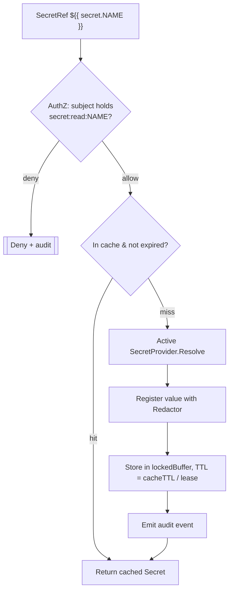
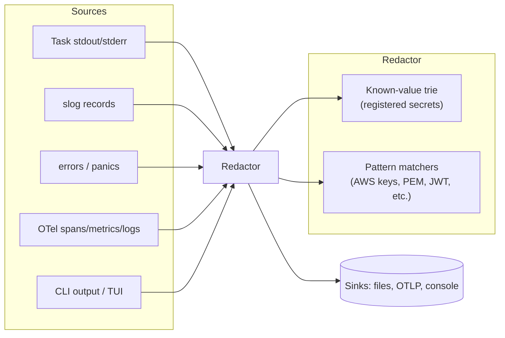

# Conduit — Secrets Management Design

> Document ID: `61-secrets-management`
> Status: Draft (v0.1.0)
> Owner: Principal Security Architect
> Last updated: 2026-07-02

Related documents:
- [Configuration](60-configuration.md)
- [Authentication](62-authentication.md)
- [Authorization](63-authorization.md)
- [Observability](64-observability.md)
- [Logging](65-logging.md)
- [Telemetry](66-telemetry.md)
- [State Management](32-state-management.md)
- [Plugin Architecture](40-plugin-architecture.md)
- [Threat Model](69-threat-model.md)
- [Security Requirements](05-security-requirements.md)

---

## 1. Overview & Principles

Conduit treats secrets as first-class, *never-persisted*, provider-backed values that are resolved late, cached briefly, redacted everywhere, and zeroed after use.

Governing principles (`SEC-` requirements from [05](05-security-requirements.md)):

- **Never persist plaintext.** Secrets are never written to config, state, logs, telemetry, checkpoints, or the plugin registry.
- **Reference, don't embed.** Config/flows carry `${{ secret.NAME }}` references. Values are resolved at point-of-use.
- **Least privilege.** A secret is resolved only for a subject (command/plugin/flow) that holds the `secret:read:<name>` [capability](63-authorization.md).
- **Redact by default.** All resolved secret values are registered with a global redaction pipeline that scrubs logs, telemetry, errors, and command output.
- **Memory hygiene.** Secrets live in locked, zeroable buffers where the OS permits; they are wiped on release.
- **Auditable.** Every resolution emits an audit event (who, which secret, which provider, allowed/denied) to the [audit log stream](65-logging.md#8-audit-log-stream).

---

## 2. Secret Reference Syntax

| Form | Meaning |
|------|---------|
| `${{ secret.NAME }}` | Resolve `NAME` via the active [`SecretProvider`](#3-provider-interface). |
| `${{ secret.NAME @provider }}` | Force a specific provider (e.g., `@vault`). |
| `${{ secret.NAME \| default("") }}` | Optional with default (still redacted). |
| `${file:/run/secrets/x}` | Read a file (e.g., mounted k8s secret); registered as secret. |

References may appear in `conduit.yaml`, `.flow` files, and plugin config. They are parsed into an opaque `SecretRef` at config load ([60 §10](60-configuration.md#10-secret-references-in-config)) and resolved lazily.

---

## 3. Provider Interface

```go
// Package secrets defines the provider abstraction and resolver.
package secrets

import (
	"context"
	"time"
)

// SecretRef is an opaque, non-printable reference to a secret.
type SecretRef struct {
	Name     string // e.g. "AWS_ROLE_ARN"
	Provider string // "" = active provider
	Optional bool
	def      string // default when Optional
}

// String never reveals anything, even in %v / %+v formatting.
func (r SecretRef) String() string  { return "SecretRef(" + r.Name + ")" }
func (r SecretRef) IsZero() bool     { return r.Name == "" }

// Secret is a resolved value held in a zeroable buffer.
type Secret struct {
	buf     *lockedBuffer // mlock'd where supported (§6)
	name    string
	source  string
	expires time.Time
}

// Reveal exposes the plaintext for the shortest possible time. Callers MUST NOT
// copy the result into long-lived storage. Prefer Use() for scoped access.
func (s *Secret) Reveal() []byte { return s.buf.Bytes() }

// Use runs fn with the plaintext and guarantees the reference is not retained.
func (s *Secret) Use(fn func([]byte) error) error { return fn(s.buf.Bytes()) }

// Destroy zeroes and unlocks the buffer.
func (s *Secret) Destroy() { s.buf.Destroy() }

// SecretProvider resolves references to values. Implementations MUST be safe
// for concurrent use and MUST NOT log secret values.
type SecretProvider interface {
	Name() string
	// Resolve returns the secret for ref, or ErrNotFound.
	Resolve(ctx context.Context, ref SecretRef) (*Secret, error)
	// Capabilities advertises features (rotation, versioning, write).
	Capabilities() ProviderCapabilities
	// Close releases provider resources (open handles, sessions).
	Close() error
}

type ProviderCapabilities struct {
	Rotation  bool
	Versioned bool
	Writable  bool
}

var ErrNotFound = errors.New("secret not found")
```

### 3.1 Built-in providers

| Provider | ID | Backing store | Notes |
|----------|----|---------------|-------|
| Environment | `env` | `CONDUIT_SECRET_*` env vars | Dev/CI default; values redacted, never echoed. |
| File | `file` | Files under a secrets dir | Supports `${file:...}`; permissions checked (0400/0600). |
| OS Keychain | `keychain` | macOS Keychain / Windows Credential Manager / libsecret | Used for CLI login tokens ([62](62-authentication.md)). |
| Vault | `vault` | HashiCorp Vault (KV-v2, dynamic) | Authenticated via [auth subsystem](62-authentication.md); leases tracked for rotation. |
| Cloud KMS | `kms` | AWS KMS / GCP KMS / Azure Key Vault | Envelope decryption; also backs [state encryption](#8-encryption-at-rest-for-state). |
| Plugin-provided | `plugin` | Any `go-plugin` secret plugin | Exposed via gRPC `SecretProvider` service; capability-gated. |

---

## 4. Resolution & Caching



```go
// Resolver orchestrates authz, caching, redaction registration, and audit.
type Resolver struct {
	provider SecretProvider
	cache    *ttlCache // keyed by ref; entries are *Secret with expiry
	redactor *Redactor
	authz    authz.Enforcer
	audit    audit.Sink
}

func (r *Resolver) Resolve(ctx context.Context, ref SecretRef) (*Secret, error) {
	subj := authz.SubjectFrom(ctx)

	if err := r.authz.Require(ctx, subj, "secret:read:"+ref.Name); err != nil {
		r.audit.Emit(ctx, audit.Event{Action: "secret.read", Object: ref.Name, Result: "deny", Subject: subj.ID})
		return nil, fmt.Errorf("secret %q: %w", ref.Name, err)
	}

	if s, ok := r.cache.Get(ref); ok {
		return s, nil
	}

	s, err := r.provider.Resolve(ctx, ref)
	if err != nil {
		if errors.Is(err, ErrNotFound) && ref.Optional {
			return literalSecret(ref.def), nil
		}
		r.audit.Emit(ctx, audit.Event{Action: "secret.read", Object: ref.Name, Result: "error", Subject: subj.ID})
		return nil, err
	}

	r.redactor.Register(s.Reveal()) // scrub this value everywhere from now on
	r.cache.Set(ref, s, cacheTTL(s))
	r.audit.Emit(ctx, audit.Event{Action: "secret.read", Object: ref.Name, Result: "allow", Subject: subj.ID, Provider: r.provider.Name()})
	return s, nil
}
```

Caching notes:
- TTL is `min(secrets.cacheTTL, lease TTL)`; Vault dynamic secrets use the lease.
- The cache is **in-memory only**, holds `lockedBuffer`s, and is flushed on reload, on `conduit secret flush`, and on process exit.
- Cache entries are keyed by the reference, never the value.

---

## 5. Redaction Pipeline

All output paths (slog handler, OTel exporters, error formatting, command stdout/stderr capture, TUI) pass through a shared `Redactor`. The redactor maintains a set of *known secret values* plus *pattern matchers* (tokens, private keys, cloud credentials).



```go
// Redactor replaces registered secret values and pattern matches with a marker.
type Redactor struct {
	mu       sync.RWMutex
	values   *ahocorasick.Matcher // exact registered secret bytes
	patterns []*regexp.Regexp     // AWS_, ghp_, PEM blocks, JWTs, etc.
	marker   []byte               // e.g. "***REDACTED***"
}

func (r *Redactor) Register(value []byte) {
	if len(value) < 4 { // don't register trivially short values (over-redaction)
		return
	}
	r.mu.Lock()
	defer r.mu.Unlock()
	r.values.Add(value)
}

// Scrub returns b with all known values and pattern matches replaced.
func (r *Redactor) Scrub(b []byte) []byte {
	r.mu.RLock()
	defer r.mu.RUnlock()
	b = r.values.ReplaceAll(b, r.marker)
	for _, p := range r.patterns {
		b = p.ReplaceAll(b, r.marker)
	}
	return b
}

// io.Writer wrapper for streaming task output.
type redactWriter struct {
	w io.Writer
	r *Redactor
}

func (rw redactWriter) Write(p []byte) (int, error) {
	// buffer to line boundaries so a secret split across writes is still caught
	scrubbed := rw.r.Scrub(p)
	if _, err := rw.w.Write(scrubbed); err != nil {
		return 0, err
	}
	return len(p), nil
}
```

Integration points:
- **slog:** a redaction `slog.Handler` wraps the base handler — see [Logging §6](65-logging.md#6-redaction-handler).
- **OTel:** a span/log processor scrubs attributes and bodies before export — see [Observability §9](64-observability.md).
- **Telemetry:** product telemetry *never* includes free-text fields that could carry secrets; the redactor is a defense-in-depth backstop — see [66](66-telemetry.md).
- **Errors:** a `%w`-aware formatter scrubs error strings before they reach any sink.

Built-in pattern matchers include: AWS access keys (`AKIA...`), GitHub tokens (`ghp_`, `gho_`), Slack (`xox[baprs]-`), PEM private-key blocks, JWTs, and generic high-entropy base64 near keywords like `token`/`secret`/`password`.

---

## 6. Memory Hygiene

```go
// lockedBuffer holds secret bytes in memory that is (best-effort) locked out of
// swap and zeroed on Destroy.
type lockedBuffer struct {
	b      []byte
	locked bool
}

func newLockedBuffer(n int) *lockedBuffer {
	b := make([]byte, n)
	lb := &lockedBuffer{b: b}
	if err := mlock(b); err == nil { // unix.Mlock / VirtualLock on Windows
		lb.locked = true
	}
	runtime.SetFinalizer(lb, (*lockedBuffer).Destroy) // safety net
	return lb
}

func (lb *lockedBuffer) Bytes() []byte { return lb.b }

func (lb *lockedBuffer) Destroy() {
	if lb.b == nil {
		return
	}
	for i := range lb.b { // zero before free
		lb.b[i] = 0
	}
	if lb.locked {
		_ = munlock(lb.b)
	}
	lb.b = nil
	runtime.SetFinalizer(lb, nil)
}
```

Controls:
- **No swap where possible.** `mlock`/`VirtualLock` on the secret buffer; failure is non-fatal but logged (some environments disallow it).
- **Zero on release.** Buffers are overwritten with zeros in `Destroy()`; `Secret.Use()` scopes lifetime.
- **Avoid `string`.** Secret values are handled as `[]byte`, never immutable `string` (which cannot be zeroed). `SecretRef`/`Secret` intentionally implement `String()` to return a marker so `fmt` never leaks bytes.
- **Core dumps disabled.** In server/daemon mode Conduit sets `RLIMIT_CORE=0` (unix) to avoid secrets in crash dumps ([THREAT-021](69-threat-model.md)).
- **GC caveat (documented).** Go's GC may copy heap memory; `mlock` + zeroing are best-effort defense-in-depth, not a guarantee. This limitation is recorded in the [Threat Model residual risk](69-threat-model.md#12-residual-risk).

---

## 7. Never-Persist Policy

| Sink | Policy |
|------|--------|
| Config files | Only `SecretRef`; loader lints for raw high-entropy values in secret keys. |
| State / checkpoints | Secrets excluded; if a task output contains a registered value it is scrubbed before persistence. State itself is [encrypted at rest](#8-encryption-at-rest-for-state). |
| Logs (app & audit) | Redacted via the pipeline; audit logs record secret *names*, never values. |
| Telemetry | No free-text/args/paths collected at all ([66](66-telemetry.md)). |
| Plugin registry / manifests | Never contain secrets; only capability requirements. |
| Env passed to tasks | Injected only for the specific task, wiped after; not inherited by unrelated child processes. |

A CI/pre-commit lint (`conduit secret scan`) statically checks flows/config for accidental plaintext.

---

## 8. Encryption at Rest for State

When `state.encryptAtRest: true`, the [state store](32-state-management.md) is encrypted with envelope encryption:

- **DEK:** a random 256-bit data encryption key encrypts each state blob with AES-256-GCM.
- **KEK:** the DEK is wrapped by a key encryption key referenced by `state.encryptionKeyRef` (`${{ secret.CONDUIT_STATE_KEY }}`), typically backed by the `kms` provider (AWS/GCP/Azure) so the raw KEK never leaves the HSM/KMS.
- **AAD:** the run ID and state schema version are used as additional authenticated data, binding ciphertext to its context.

```go
// SealState encrypts a state blob using a KMS-wrapped DEK (envelope encryption).
func (e *Envelope) SealState(ctx context.Context, runID string, plaintext []byte) (Sealed, error) {
	dek := make([]byte, 32)
	if _, err := rand.Read(dek); err != nil {
		return Sealed{}, err
	}
	defer zero(dek)

	aead, err := aesgcm(dek)
	if err != nil {
		return Sealed{}, err
	}
	nonce := randNonce(aead.NonceSize())
	aad := []byte("conduit-state|" + runID + "|v1")
	ct := aead.Seal(nil, nonce, plaintext, aad)

	wrapped, err := e.kms.WrapKey(ctx, e.keyRef, dek) // KEK stays in KMS
	if err != nil {
		return Sealed{}, err
	}
	return Sealed{Ciphertext: ct, Nonce: nonce, WrappedDEK: wrapped, AAD: aad}, nil
}
```

---

## 9. Rotation

- **Vault dynamic secrets:** the resolver tracks lease IDs; a background renewer renews within the lease, and re-resolves on revocation. Consumers holding a `*Secret` are notified via a `Rotated` channel to refresh downstream sessions.
- **Static secrets:** cache TTL bounds staleness; `conduit secret refresh <name>` forces re-resolution.
- **State KEK rotation:** `conduit state rekey` re-wraps DEKs under a new KEK version without re-encrypting all data (envelope scheme).
- **Login tokens:** refreshed by the [auth subsystem](62-authentication.md#7-token-storage--refresh).

---

## 10. Audit

Every resolution, denial, rotation, and flush emits a structured audit event to the dedicated [audit stream](65-logging.md#8-audit-log-stream):

```json
{
  "ts": "2026-07-02T14:03:11Z",
  "stream": "audit",
  "action": "secret.read",
  "object": "AWS_ROLE_ARN",
  "provider": "vault",
  "subject": "svc:agent-deployer",
  "run_id": "run_01J...",
  "result": "allow",
  "trace_id": "4bf92f3577b34da6a3ce929d0e0e4736"
}
```

Audit events carry secret *names* and *provider*, never values, and are correlated by `run_id`/`trace_id` with [observability](64-observability.md).

---

## 11. `conduit secret` Commands

| Command | Description |
|---------|-------------|
| `conduit secret list` | List known reference *names* (never values), grouped by provider. |
| `conduit secret get <name>` | Reveal a value — **only** with `secret:read:<name>` and interactive confirmation; audited. |
| `conduit secret set <name>` | Write to a writable provider (keychain/vault/file), value read from stdin (not argv). |
| `conduit secret refresh <name>` | Force re-resolution / rotation. |
| `conduit secret flush` | Clear the in-memory cache and zero buffers. |
| `conduit secret scan [path]` | Static scan of config/flows for accidental plaintext secrets. |
| `conduit secret providers` | Show configured providers and capabilities. |

Values are never accepted on the command line (would leak into shell history / process listings); `set` reads from stdin or a prompt.

---

## 12. Security Considerations (summary)

| Concern | Control | Reference |
|---------|---------|-----------|
| Secret exfiltration via logs/output | Redaction pipeline (known-value + patterns) | §5, [THREAT-020](69-threat-model.md) |
| Malicious plugin harvesting secrets | Capability-gated resolution; plugins get only granted secrets over gRPC | [63](63-authorization.md), [THREAT-002](69-threat-model.md) |
| Secrets in swap / core dumps | `mlock`/`VirtualLock`, `RLIMIT_CORE=0`, zeroing | §6, [THREAT-021](69-threat-model.md) |
| Secrets persisted in state | Excluded + scrubbed; state encrypted at rest | §7, §8 |
| Stale/leaked credentials | Rotation, lease tracking, short cache TTL | §9 |
| Value on command line | stdin-only `set`/`get` | §11 |

---

## 13. Cross-References

- Secret references in config: [60 — Configuration §10](60-configuration.md#10-secret-references-in-config)
- Provider authentication (Vault/KMS): [62 — Authentication](62-authentication.md)
- `secret:read:<name>` capabilities: [63 — Authorization](63-authorization.md)
- Redaction in logs: [65 — Logging §6](65-logging.md#6-redaction-handler)
- Redaction in telemetry export: [64 — Observability §9](64-observability.md)
- State encryption: [32 — State Management](32-state-management.md)
- Threats: [69 — Threat Model](69-threat-model.md)
