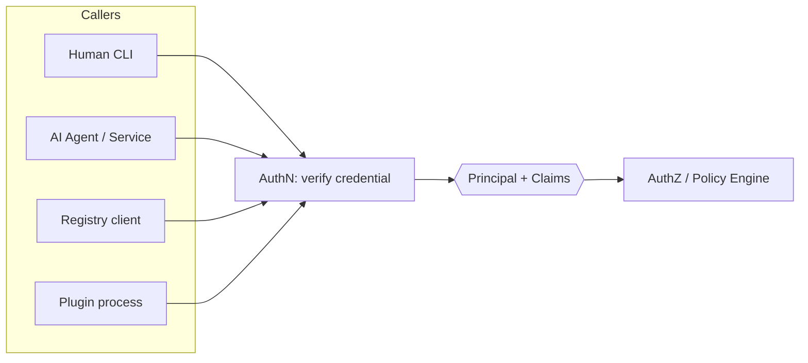
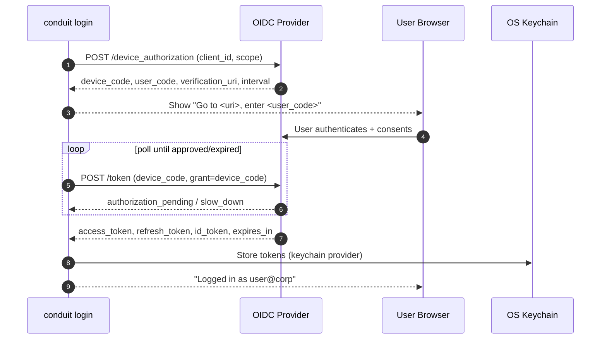
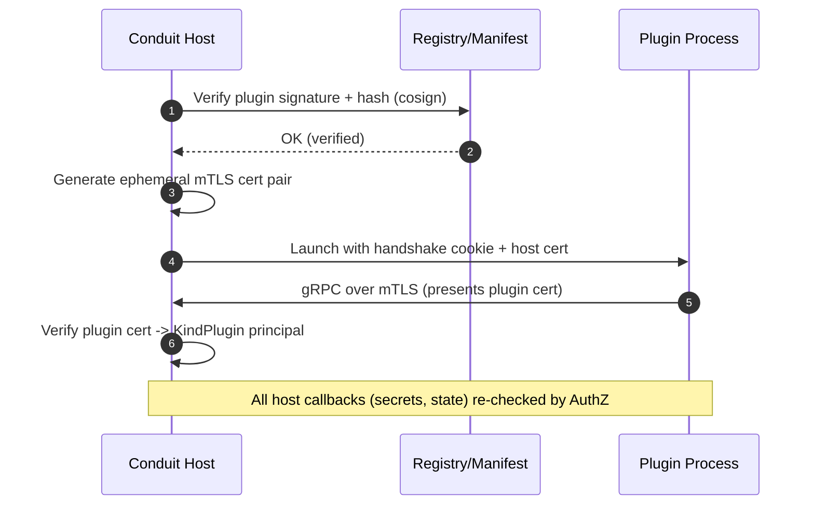

# Conduit — Authentication Architecture

> Document ID: `62-authentication`
> Status: Draft (v0.1.0)
> Owner: Principal Security Architect
> Last updated: 2026-07-02

Related documents:
- [Configuration](60-configuration.md)
- [Secrets Management](61-secrets-management.md)
- [Authorization](63-authorization.md)
- [Logging](65-logging.md)
- [Observability](64-observability.md)
- [Plugin Architecture](40-plugin-architecture.md)
- [Threat Model](69-threat-model.md)
- [Security Requirements](05-security-requirements.md)

---

## 1. Overview

Authentication (**AuthN**) answers *who is calling*. Conduit runs in two trust modes:

- **Local mode** (default for a laptop): no network AuthN; trust derives from OS process/user identity.
- **Server/daemon mode** and **registry access**: full AuthN via OIDC, mTLS, PATs/API tokens, and service accounts, producing a verified `Principal`.

AuthN produces a `Principal` that the [authorization layer](63-authorization.md) then evaluates. AuthN never makes allow/deny *policy* decisions — it only establishes identity and its claims.



---

## 2. Principal Model

```go
// Package auth establishes verified identity.
package auth

// PrincipalKind distinguishes identity types.
type PrincipalKind string

const (
	KindUser    PrincipalKind = "user"    // human, OIDC/device flow
	KindService PrincipalKind = "service" // service account / AI agent
	KindMachine PrincipalKind = "machine" // mTLS node identity
	KindPlugin  PrincipalKind = "plugin"  // authenticated plugin process
	KindLocal   PrincipalKind = "local"   // local-mode OS user
)

// Principal is the verified identity for a request.
type Principal struct {
	Kind       PrincipalKind
	Subject    string            // stable ID (OIDC sub, SPIFFE ID, token ID)
	Issuer     string            // idp / CA / token authority
	Claims     map[string]any    // groups, email, roles, scopes
	Scopes     []string          // token/OIDC scopes
	Groups     []string
	AuthMethod string            // "oidc" | "mtls" | "token" | "device" | "local"
	ExpiresAt  time.Time
}

// Authenticator verifies a credential from the transport and returns a Principal.
type Authenticator interface {
	Method() string
	Authenticate(ctx context.Context, cred Credential) (*Principal, error)
}
```

The active authenticator is selected by `auth.mode` in [config](60-configuration.md); server mode may enable a **chain** (e.g., try mTLS, then bearer token).

---

## 3. Authentication Methods

| Method | Config `auth.mode` | Used for | Credential |
|--------|--------------------|----------|-----------|
| Local (no-auth) | `local` | Laptop CLI | OS process/user |
| OIDC | `oidc` | Human login, agents via IdP | ID/access token (JWT) |
| mTLS | `mtls` | Machine/node identity, daemon peers | Client certificate (SPIFFE SVID) |
| PAT / API token | `token` | CI, scripts, agents | Bearer token (`conduit_pat_...`) |
| Device flow | (login UX) | Headless CLI login | OAuth 2.0 Device Authorization Grant |

### 3.1 OIDC

- Standard OIDC/OAuth2. Conduit validates JWTs against the issuer's JWKS (cached, rotated), checks `iss`, `aud`, `exp`, `nbf`, and required claims.
- Groups/roles claims flow into `Principal.Groups`/`Claims` for [RBAC/ABAC](63-authorization.md).

```go
type OIDCAuthenticator struct {
	verifier *oidc.IDTokenVerifier // coreos/go-oidc, JWKS-backed
	issuer   string
	audience string
}

func (a *OIDCAuthenticator) Authenticate(ctx context.Context, cred Credential) (*Principal, error) {
	tok, err := a.verifier.Verify(ctx, cred.Bearer)
	if err != nil {
		return nil, fmt.Errorf("oidc verify: %w", err)
	}
	var claims struct {
		Sub    string   `json:"sub"`
		Email  string   `json:"email"`
		Groups []string `json:"groups"`
		Scope  string   `json:"scope"`
	}
	if err := tok.Claims(&claims); err != nil {
		return nil, err
	}
	return &Principal{
		Kind: KindUser, Subject: claims.Sub, Issuer: a.issuer,
		Groups: claims.Groups, Scopes: strings.Fields(claims.Scope),
		Claims: map[string]any{"email": claims.Email},
		AuthMethod: "oidc", ExpiresAt: tok.Expiry,
	}, nil
}
```

### 3.2 mTLS & Machine Identity

- Daemon peers and machines authenticate with X.509 client certs, ideally **SPIFFE SVIDs** (`spiffe://conduit.internal/node/...`).
- The gRPC server enforces `tls.RequireAndVerifyClientCert`; the SPIFFE ID becomes `Principal.Subject` with `Kind=KindMachine`.
- CA trust bundle is provided via config/SPIRE; short-lived SVIDs are auto-rotated by the workload API.

### 3.3 PAT / API Tokens

- Format: `conduit_pat_<base62>`; only a salted hash (argon2id) is stored server-side. The raw token is shown once at creation.
- Tokens carry scopes and an expiry; revocation is immediate (deny-list + short cache).
- Presented as `Authorization: Bearer` (HTTP) or gRPC metadata `authorization`.

### 3.4 Service Accounts (AI Agents)

AI agents authenticate as **service accounts** — a first-class `KindService` principal — never as a human:

- Backed by OIDC client-credentials *or* a scoped PAT.
- Bound to a narrow set of [scopes/capabilities](63-authorization.md) (e.g., `run:execute`, specific `secret:read:*`).
- Every agent call is attributable via `subject` in [audit logs](65-logging.md#8-audit-log-stream) and [traces](64-observability.md).
- Recommended: short-lived tokens + workload identity so a leaked token expires quickly.

---

## 4. `conduit login` — Device Flow

Headless-friendly OAuth 2.0 Device Authorization Grant. The CLI never handles the user's password.



```go
// deviceLogin runs the device authorization grant and persists tokens.
func (c *LoginCmd) deviceLogin(ctx context.Context) error {
	da, err := c.oauth.DeviceAuth(ctx) // requests device_code + user_code
	if err != nil {
		return err
	}
	fmt.Printf("Open %s and enter code: %s\n", da.VerificationURI, da.UserCode)
	_ = browser.Open(da.VerificationURIComplete) // best-effort

	tok, err := c.oauth.DeviceAccessToken(ctx, da) // polls with backoff
	if err != nil {
		return fmt.Errorf("device flow: %w", err)
	}
	return c.store.Save(ctx, "default", tok) // OS keychain (§7)
}
```

---

## 5. Registry Authentication

Access to the [plugin registry](40-plugin-architecture.md) reuses the same principals:

- `conduit plugin install <ref>` uses the stored login token (OIDC/PAT) as a bearer credential.
- Publishing requires `registry:publish` scope; artifacts are signed with cosign and the signature verified on install (supply-chain — see [THREAT-030](69-threat-model.md)).
- Anonymous read may be allowed for public registries; writes always require auth.

---

## 6. Plugin Authentication

Plugins run out-of-process over [go-plugin/gRPC](40-plugin-architecture.md). Mutual authentication of the *plugin process itself*:

- **Handshake secret + mTLS:** go-plugin's magic-cookie handshake plus an ephemeral, per-launch mTLS pair generated by the host. The plugin proves it holds the host-issued cert; the host verifies the plugin binary's cosign signature and hash against its manifest before launch.
- The plugin becomes a `KindPlugin` principal; its granted [capabilities](63-authorization.md) bound its calls back into the host (e.g., requesting a secret triggers `secret:read` authz).



---

## 7. Token Storage & Refresh

- **Storage:** tokens live in the OS keychain via the [`keychain` secret provider](61-secrets-management.md#31-built-in-providers) (macOS Keychain, Windows Credential Manager, libsecret). Never plaintext on disk. On systems without a keychain, a file fallback with 0600 perms + KMS/age encryption is used, with a warning.
- **Refresh:** access tokens are refreshed transparently using the stored refresh token before expiry; refresh failures trigger re-login.
- **Multiple contexts:** `conduit login --context prod` stores per-context tokens; `conduit auth status` lists them.
- **Logout:** `conduit logout` revokes (best-effort) and deletes stored tokens.

```go
// TokenStore persists/retrieves tokens from the OS keychain.
type TokenStore interface {
	Save(ctx context.Context, name string, tok *oauth2.Token) error
	Load(ctx context.Context, name string) (*oauth2.Token, error)
	Delete(ctx context.Context, name string) error
}

// refreshingSource wraps oauth2 to auto-refresh and persist rotated tokens.
func (s *keychainStore) TokenSource(ctx context.Context, name string, cfg *oauth2.Config) oauth2.TokenSource {
	base, _ := s.Load(ctx, name)
	return oauth2.ReuseTokenSource(base, &persistingSource{
		inner: cfg.TokenSource(ctx, base),
		save:  func(t *oauth2.Token) { _ = s.Save(ctx, name, t) },
	})
}
```

---

## 8. Local Mode Trust Model

Local mode (`auth.mode: local`) is the default single-user experience:

- **Identity = OS user.** The `Principal` is `KindLocal` with `Subject` = OS username/UID; no network AuthN.
- **Trust boundary = the machine.** Conduit trusts the local user to the extent the OS does; file permissions on `conduit.yaml`, state dir, and the keychain enforce isolation.
- **No implicit privilege escalation.** Even locally, plugins are sandboxed and secrets are capability-gated; local mode relaxes *network* AuthN, not the [plugin](40-plugin-architecture.md)/[secrets](61-secrets-management.md) trust boundaries.
- **Upgrading to authenticated mode** (talking to a daemon/registry) requires `conduit login`; local mode alone cannot access remote-protected resources.

The distinction matters in the [threat model](69-threat-model.md): local mode's adversary is malicious *flows/plugins* on a trusted machine, not remote attackers; server mode adds the network attacker.

---

## 9. `conduit auth` / login commands

| Command | Description |
|---------|-------------|
| `conduit login [--context <name>]` | Device-flow (or browser) OIDC login; stores tokens in keychain. |
| `conduit logout` | Revoke + delete stored tokens. |
| `conduit auth status` | Show current principal(s), method, scopes, expiry. |
| `conduit auth token create --scope run:execute` | Mint a PAT (shown once). |
| `conduit auth token revoke <id>` | Revoke a PAT. |
| `conduit auth whoami` | Print the resolved principal for the active context. |

(Authorization/policy commands live under `conduit auth policy ...` — see [63](63-authorization.md).)

---

## 10. Security Considerations (summary)

| Concern | Control | Reference |
|---------|---------|-----------|
| Token theft | Keychain storage, short-lived + refresh, argon2id hashing server-side | §7, [THREAT-012](69-threat-model.md) |
| Agent impersonating a human | Distinct `KindService`, narrow scopes, attributable audit | §3.4, [63](63-authorization.md) |
| Malicious/forged plugin | Signature+hash verification pre-launch, ephemeral mTLS | §6, [THREAT-001](69-threat-model.md) |
| Compromised registry artifact | cosign verification on install; `plugins.trust=verified-only` | §5, [THREAT-030](69-threat-model.md) |
| Replay / stale creds | `exp`/`nbf` checks, JWKS rotation, revocation deny-list | §3 |

---

## 11. Cross-References

- Policy decisions on identities: [63 — Authorization](63-authorization.md)
- Token/keychain storage: [61 — Secrets Management §7](61-secrets-management.md)
- `auth.*` config: [60 — Configuration §6](60-configuration.md)
- Plugin launch/verification: [40 — Plugin Architecture](40-plugin-architecture.md)
- Audit of auth events: [65 — Logging §8](65-logging.md#8-audit-log-stream)
- Threats: [69 — Threat Model](69-threat-model.md)
