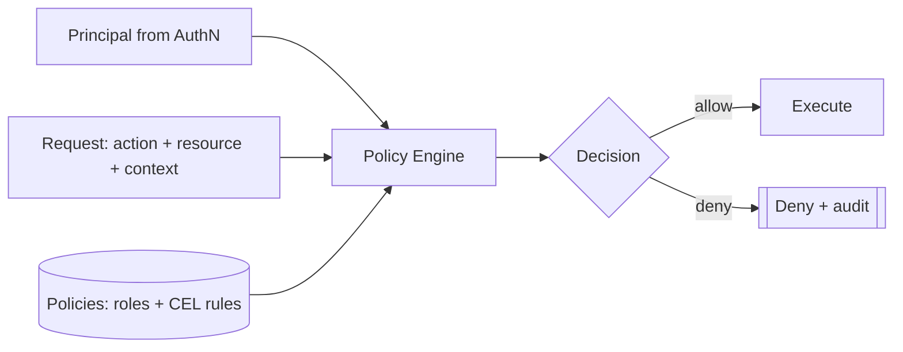

# Conduit — Authorization Architecture

> Document ID: `63-authorization`
> Status: Draft (v0.1.0)
> Owner: Principal Security Architect
> Last updated: 2026-07-02

Related documents:
- [Authentication](62-authentication.md)
- [Configuration](60-configuration.md)
- [Secrets Management](61-secrets-management.md)
- [Command Metadata Model](42-command-metadata.md)
- [Plugin Architecture](40-plugin-architecture.md)
- [Expression Engine (CEL)](25-expression-engine.md)
- [Logging](65-logging.md)
- [Threat Model](69-threat-model.md)
- [Security Requirements](05-security-requirements.md)

---

## 1. Overview

Authorization (**AuthZ**) answers *is this principal allowed to do this action on this resource*. Conduit uses a **default-deny**, **RBAC + ABAC** hybrid model evaluated by a **CEL-Go** policy engine, with policies expressed as **policy-as-code**.

- **RBAC** provides the coarse grain: roles bundle scopes.
- **ABAC** provides the fine grain: CEL conditions over principal/resource/environment attributes.
- **Default-deny:** absent an explicit `allow`, the answer is deny.
- **Ties to command metadata:** each command/flow declares its **required scopes** ([42](42-command-metadata.md)); the engine checks them automatically.



---

## 2. Resource & Action Model

Resources are addressed by a typed URN-like key: `conduit:<type>:<id>`.

| Resource type | Example | Actions |
|---------------|---------|---------|
| `workflow` | `conduit:workflow:deploy` | `read`, `execute`, `write`, `delete` |
| `run` | `conduit:run:run_01J...` | `read`, `cancel`, `retry` |
| `plugin` | `conduit:plugin:cloud-aws` | `install`, `invoke`, `publish` |
| `secret` | `conduit:secret:AWS_ROLE_ARN` | `read`, `write`, `rotate` |
| `config` | `conduit:config:auth` | `read`, `write` |
| `registry` | `conduit:registry:*` | `read`, `publish` |

**Scopes** are `action:resourceType[:id]`, e.g. `run:execute`, `secret:read:AWS_ROLE_ARN`, `plugin:invoke:cloud-aws`, `workflow:read:*`.

---

## 3. RBAC — Roles & Scopes

```yaml
# policy: roles.yaml (policy-as-code, versioned in git)
roles:
  viewer:
    scopes: [ "workflow:read:*", "run:read:*" ]
  operator:
    inherits: [ viewer ]
    scopes: [ "run:execute:*", "run:cancel:*", "run:retry:*" ]
  deployer:
    inherits: [ operator ]
    scopes:
      - "workflow:execute:deploy"
      - "secret:read:AWS_ROLE_ARN"
      - "plugin:invoke:cloud-aws"
  admin:
    scopes: [ "*" ]        # full — grant sparingly

bindings:
  - role: deployer
    subjects: [ "group:sre", "svc:agent-deployer" ]  # groups + service accounts
  - role: viewer
    subjects: [ "group:engineering" ]
```

Role bindings map principals (users, groups, service accounts from [AuthN](62-authentication.md)) to roles. Role inheritance flattens to a scope set at load time.

---

## 4. ABAC — CEL Policies

Fine-grained conditions are expressed in **CEL** ([same engine as FlowDSL expressions](25-expression-engine.md)), evaluated against an input document of `principal`, `action`, `resource`, and `env`.

```yaml
# policy: rules.yaml
policies:
  - id: prod-deploy-business-hours
    effect: allow
    when: |
      request.action == "run:execute" &&
      resource.attrs.env == "prod" &&
      "group:sre" in principal.groups &&
      env.time.getHours() >= 8 && env.time.getHours() < 20

  - id: deny-agent-secret-write
    effect: deny            # explicit deny overrides allow
    when: |
      principal.kind == "service" &&
      request.action.startsWith("secret:write")

  - id: mfa-required-for-prod
    effect: deny
    when: |
      resource.attrs.env == "prod" &&
      request.action == "run:execute" &&
      !principal.claims.exists(c, c == "amr" && principal.claims.amr.exists(m, m == "mfa"))
```

Evaluation order: **explicit deny wins**, then explicit allow, else default-deny.

---

## 5. Policy Engine — Go Interfaces

```go
// Package authz provides default-deny RBAC+ABAC over a CEL engine.
package authz

// Request is the AuthZ query.
type Request struct {
	Action   string // "run:execute"
	Resource Resource
	Context  map[string]any // extra env attrs
}

type Resource struct {
	Type  string            // "workflow", "run", "secret", ...
	ID    string
	Attrs map[string]any    // env, owner, sensitivity, ...
}

type Decision struct {
	Allow  bool
	Effect string // "allow" | "deny" | "default-deny"
	RuleID string // which policy decided
	Reason string
}

// Enforcer is the entry point used across the codebase.
type Enforcer interface {
	// Decide evaluates policy; never returns allow unless explicitly permitted.
	Decide(ctx context.Context, p *auth.Principal, req Request) (Decision, error)
	// Require is a convenience: returns an error if the action is denied.
	Require(ctx context.Context, p *auth.Principal, scope string) error
}

// celEnforcer is the reference implementation.
type celEnforcer struct {
	roles    RoleSet             // flattened role -> scopes
	bindings []Binding
	programs []compiledPolicy    // CEL programs with effect
	audit    audit.Sink
}

func (e *celEnforcer) Decide(ctx context.Context, p *auth.Principal, req Request) (Decision, error) {
	input := map[string]any{
		"principal": principalMap(p),
		"request":   map[string]any{"action": req.Action, "resource": req.Resource.Type},
		"resource":  map[string]any{"type": req.Resource.Type, "id": req.Resource.ID, "attrs": req.Resource.Attrs},
		"env":       envMap(req.Context),
	}

	// 1) Explicit deny wins.
	for _, pol := range e.programs {
		if pol.effect == "deny" && pol.eval(input) {
			return e.decided(ctx, p, req, Decision{Allow: false, Effect: "deny", RuleID: pol.id})
		}
	}
	// 2) RBAC scope match (role grants).
	if e.rbacAllows(p, req.Action, req.Resource) {
		return e.decided(ctx, p, req, Decision{Allow: true, Effect: "allow", RuleID: "rbac"})
	}
	// 3) Explicit ABAC allow.
	for _, pol := range e.programs {
		if pol.effect == "allow" && pol.eval(input) {
			return e.decided(ctx, p, req, Decision{Allow: true, Effect: "allow", RuleID: pol.id})
		}
	}
	// 4) Default deny.
	return e.decided(ctx, p, req, Decision{Allow: false, Effect: "default-deny", RuleID: "default"})
}

func (e *celEnforcer) Require(ctx context.Context, p *auth.Principal, scope string) error {
	action, resType, resID := parseScope(scope) // "secret:read:NAME"
	d, err := e.Decide(ctx, p, Request{Action: action, Resource: Resource{Type: resType, ID: resID}})
	if err != nil {
		return err
	}
	if !d.Allow {
		return &DeniedError{Scope: scope, Rule: d.RuleID}
	}
	return nil
}
```

CEL programs are compiled once at policy load with a restricted environment (no I/O, cost limits) — the same sandboxing posture as [25 — Expression Engine](25-expression-engine.md).

---

## 6. Per-Command Required Scopes (Command Metadata)

Every command and flow task declares required scopes in its [command metadata](42-command-metadata.md). A middleware enforces them before execution, so authorization is declarative and consistent.

```go
// CommandMeta (excerpt) — see 42-command-metadata.md
type CommandMeta struct {
	Name           string
	RequiredScopes []string // e.g. []{"run:execute:{{flow}}", "secret:read:AWS_ROLE_ARN"}
	// ...
}

// AuthZMiddleware enforces a command's declared scopes before it runs.
func AuthZMiddleware(enf authz.Enforcer) Middleware {
	return func(next Handler) Handler {
		return func(ctx context.Context, cmd *Command) error {
			p := auth.PrincipalFrom(ctx)
			for _, scope := range cmd.Meta.RequiredScopes {
				scope = expandTemplate(scope, cmd) // fill {{flow}}, {{run}}
				if err := enf.Require(ctx, p, scope); err != nil {
					return err // denied -> command aborts, audited
				}
			}
			return next(ctx, cmd)
		}
	}
}
```

Example flow declaring scopes:

```hcl
task "apply" {
  uses = "cloud-aws:apply"
  # requires: plugin:invoke:cloud-aws, secret:read:AWS_ROLE_ARN
}
```

---

## 7. Plugin Capability Grants

Plugins are least-privilege: a plugin's manifest declares the capabilities it *requests*; the operator grants a subset. At runtime every host callback from a plugin is authorized against its **granted** capability set, not the caller's full rights.

```yaml
# plugin manifest (excerpt)
capabilities:
  request:
    - "secret:read:AWS_ROLE_ARN"
    - "network:egress:*.amazonaws.com"
    - "run:read:{{current}}"
```

```yaml
# operator grant in conduit.yaml
plugins:
  grants:
    cloud-aws:
      - "secret:read:AWS_ROLE_ARN"
      - "network:egress:*.amazonaws.com"   # network:egress:* denied
```

```go
// CapabilitySet is the granted-capability set for a plugin principal.
type CapabilitySet map[string]bool

// Host callback guard: a plugin asking for a secret is authorized as itself.
func (h *HostBridge) OnSecretRequest(ctx context.Context, pluginID, name string) (*secrets.Secret, error) {
	p := &auth.Principal{Kind: auth.KindPlugin, Subject: pluginID}
	if err := h.enf.Require(ctx, p, "secret:read:"+name); err != nil {
		return nil, err // grant not present -> denied + audited
	}
	return h.secrets.Resolve(ctx, secrets.SecretRef{Name: name})
}
```

This confines a [malicious plugin](69-threat-model.md#attack-tree--malicious-plugin) to exactly what was granted, independent of the invoking user's broader rights.

---

## 8. Policy-as-Code & Default-Deny

- Policies (`roles.yaml`, `rules.yaml`) are versioned in git, reviewed via PR, and validated by `conduit auth policy validate` in CI.
- Policies may be loaded locally or pushed via the [remote config provider](60-configuration.md#9-remote-providers-consul--vault--http) with `enforced: true` so org guardrails cannot be locally weakened.
- **Default-deny** is structural: the engine only returns `allow` on an explicit match; an empty policy set denies everything except local-mode self-actions.
- **Local mode** ([62 §8](62-authentication.md#8-local-mode-trust-model)) grants the local user a permissive default role for *their own* laptop resources, but plugin capability grants and secret scopes still apply.

---

## 9. `conduit auth` (policy) Commands

| Command | Description |
|---------|-------------|
| `conduit auth can <action> <resource>` | Test a decision for the current principal; `--explain` shows the deciding rule. |
| `conduit auth policy validate [dir]` | Lint/compile policies (CEL type-check, cost check). |
| `conduit auth policy test` | Run policy unit tests (given/when/then fixtures). |
| `conduit auth roles list` | Show roles, inherited scopes, and bindings. |
| `conduit auth grants <plugin>` | Show requested vs. granted plugin capabilities. |
| `conduit auth simulate --as <subject>` | Dry-run decisions as another principal (admin only). |

Example:

```text
$ conduit auth can run:execute conduit:workflow:deploy --explain
DENY (rule: mfa-required-for-prod)
  resource.attrs.env == "prod" and principal lacks amr=mfa
```

Policy tests as code:

```yaml
# policy_test.yaml
tests:
  - name: sre can deploy in hours
    principal: { kind: user, groups: [ "group:sre" ], claims: { amr: [ "mfa" ] } }
    request:  { action: "run:execute", resource: { attrs: { env: prod } } }
    env:      { time: "2026-07-02T10:00:00Z" }
    expect: allow
  - name: agent cannot write secrets
    principal: { kind: service }
    request:  { action: "secret:write:X" }
    expect: deny
```

---

## 10. Security Considerations (summary)

| Concern | Control | Reference |
|---------|---------|-----------|
| Privilege escalation | Default-deny, explicit-deny-wins, no `*` by default | §5, §8 |
| Confused deputy (plugin uses caller rights) | Plugin authorized as its own capability set | §7, [THREAT-002](69-threat-model.md) |
| Policy tampering | Policy-as-code in git, signed remote push, `enforced` | §8, [THREAT-011](69-threat-model.md) |
| Agent over-privilege | Narrow service-account scopes + deny rules | §4, [62 §3.4](62-authentication.md) |
| CEL policy abuse | Cost limits, no I/O, compile-time type check | [25](25-expression-engine.md), [THREAT-004](69-threat-model.md) |

---

## 11. Cross-References

- Principals evaluated here: [62 — Authentication](62-authentication.md)
- Required-scope declarations: [42 — Command Metadata](42-command-metadata.md)
- CEL sandbox: [25 — Expression Engine](25-expression-engine.md)
- Secret scope enforcement: [61 — Secrets Management §4](61-secrets-management.md)
- Plugin capability model: [40 — Plugin Architecture](40-plugin-architecture.md)
- Decision auditing: [65 — Logging §8](65-logging.md#8-audit-log-stream)
- Threats: [69 — Threat Model](69-threat-model.md)
