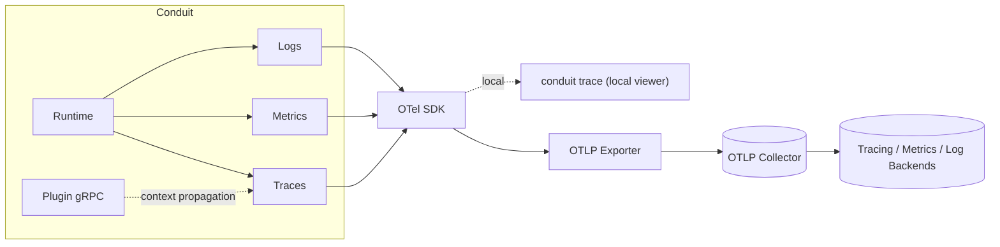

# Conduit — Observability Architecture

> Document ID: `64-observability`
> Status: Draft (v0.1.0)
> Owner: Principal Observability Architect
> Last updated: 2026-07-02

Related documents:
- [Logging](65-logging.md)
- [Telemetry](66-telemetry.md)
- [Configuration](60-configuration.md)
- [Secrets Management](61-secrets-management.md)
- [Execution Runtime](31-execution-runtime.md)
- [Workflow DAG](30-workflow-dag.md)
- [Plugin Architecture](40-plugin-architecture.md)
- [Internal Message Bus](68-message-bus.md)
- [Threat Model](69-threat-model.md)

---

## 1. Overview

Conduit's observability is built on **OpenTelemetry (OTel)** for the three signals — **traces**, **metrics**, and **logs** — unified by a shared correlation identity (`run_id`, `task_id`, `trace_id`, `span_id`). Every run is fully traceable from parse → plan → execute → task → plugin-call, with metrics for rate/errors/duration and utilization, and logs correlated into the same trace context.

Observability (operational, for the *operator*) is distinct from [product telemetry](66-telemetry.md) (anonymous usage, for the *maintainers*, opt-in). This document covers the former.



---

## 2. Configuration

Driven by `observability.otel.*` ([60 §4](60-configuration.md)) and standard OTel env vars (`OTEL_EXPORTER_OTLP_ENDPOINT`, `OTEL_SERVICE_NAME`, etc.).

```yaml
observability:
  otel:
    enabled: true
    endpoint: ${env.OTEL_EXPORTER_OTLP_ENDPOINT}   # e.g. http://localhost:4317
    protocol: grpc              # grpc|http/protobuf
    sampleRatio: 0.1            # parent-based ratio sampler
    resourceAttributes:
      service.name: conduit
      service.version: ${env.CONDUIT_VERSION}
```

---

## 3. OTel SDK Setup (Go)

```go
// Package observability wires the OTel SDK (traces, metrics, logs) with OTLP.
package observability

import (
	"context"

	"go.opentelemetry.io/otel"
	"go.opentelemetry.io/otel/exporters/otlp/otlptrace/otlptracegrpc"
	"go.opentelemetry.io/otel/exporters/otlp/otlpmetric/otlpmetricgrpc"
	"go.opentelemetry.io/otel/propagation"
	"go.opentelemetry.io/otel/sdk/metric"
	"go.opentelemetry.io/otel/sdk/resource"
	sdktrace "go.opentelemetry.io/otel/sdk/trace"
	semconv "go.opentelemetry.io/otel/semconv/v1.26.0"
)

type Providers struct {
	Tracer   *sdktrace.TracerProvider
	Meter    *metric.MeterProvider
	shutdown []func(context.Context) error
}

func Setup(ctx context.Context, cfg Config) (*Providers, error) {
	res, err := resource.New(ctx,
		resource.WithAttributes(
			semconv.ServiceName("conduit"),
			semconv.ServiceVersion(cfg.Version),
		),
		resource.WithFromEnv(), // OTEL_RESOURCE_ATTRIBUTES
	)
	if err != nil {
		return nil, err
	}

	// Traces.
	texp, err := otlptracegrpc.New(ctx, otlptracegrpc.WithEndpointURL(cfg.Endpoint))
	if err != nil {
		return nil, err
	}
	tp := sdktrace.NewTracerProvider(
		sdktrace.WithResource(res),
		sdktrace.WithSampler(sdktrace.ParentBased(sdktrace.TraceIDRatioBased(cfg.SampleRatio))),
		sdktrace.WithSpanProcessor(sdktrace.NewBatchSpanProcessor(texp)),
		sdktrace.WithSpanProcessor(redactionProcessor{}), // scrub attrs (61 §5)
	)

	// Metrics.
	mexp, err := otlpmetricgrpc.New(ctx, otlpmetricgrpc.WithEndpointURL(cfg.Endpoint))
	if err != nil {
		return nil, err
	}
	mp := metric.NewMeterProvider(
		metric.WithResource(res),
		metric.WithReader(metric.NewPeriodicReader(mexp)),
	)

	otel.SetTracerProvider(tp)
	otel.SetMeterProvider(mp)
	otel.SetTextMapPropagator(propagation.NewCompositeTextMapPropagator(
		propagation.TraceContext{}, propagation.Baggage{}, // W3C traceparent + baggage
	))

	return &Providers{Tracer: tp, Meter: mp,
		shutdown: []func(context.Context) error{tp.Shutdown, mp.Shutdown, texp.Shutdown, mexp.Shutdown},
	}, nil
}

func (p *Providers) Shutdown(ctx context.Context) error {
	var err error
	for _, fn := range p.shutdown {
		err = errors.Join(err, fn(ctx))
	}
	return err
}
```

Logs are emitted via [slog](65-logging.md) with an OTel bridge handler that attaches `trace_id`/`span_id` and (optionally) exports log records over OTLP.

---

## 4. Trace Model — Span Catalog

A run is one trace. Spans nest: `run` → `parse` → `plan` → `execute` → `task` → `plugin.call`.

| Span name | Parent | Key attributes | Emitted by |
|-----------|--------|----------------|-----------|
| `conduit.run` | root | `run.id`, `flow.name`, `flow.hash`, `dry_run` | Runtime |
| `conduit.parse` | run | `flow.file`, `ast.nodes`, `parse.errors` | [Parser](22-parser-design.md) |
| `conduit.plan` | run | `dag.nodes`, `dag.edges`, `dag.max_width` | [DAG Planner](30-workflow-dag.md) |
| `conduit.execute` | run | `tasks.total`, `max_parallel` | Runtime |
| `conduit.task` | execute | `task.id`, `task.name`, `task.uses`, `task.attempt`, `task.status` | Runtime |
| `conduit.cel.eval` | task/plan | `cel.expr_hash`, `cel.cost` | [CEL engine](25-expression-engine.md) |
| `conduit.plugin.call` | task | `plugin.id`, `rpc.method`, `plugin.version` | [Plugin bridge](40-plugin-architecture.md) |
| `conduit.state.write` | task/run | `state.backend`, `bytes` | [State store](32-state-management.md) |
| `conduit.secret.resolve` | task | `secret.name`, `provider`, `cache.hit` (no value) | [Secrets](61-secrets-management.md) |

```go
// Runtime creates the run span; each task nests under it.
func (r *Runtime) runTask(ctx context.Context, t *Task) error {
	ctx, span := r.tracer.Start(ctx, "conduit.task",
		trace.WithAttributes(
			attribute.String("task.id", t.ID),
			attribute.String("task.name", t.Name),
			attribute.String("task.uses", t.Uses),
			attribute.Int("task.attempt", t.Attempt),
		))
	defer span.End()

	start := time.Now()
	err := t.Execute(ctx)
	r.metrics.taskDuration.Record(ctx, time.Since(start).Seconds(),
		metric.WithAttributes(attribute.String("task.name", t.Name), statusAttr(err)))
	r.metrics.taskCount.Add(ctx, 1, metric.WithAttributes(statusAttr(err)))

	if err != nil {
		span.RecordError(err)
		span.SetStatus(codes.Error, "task failed")
	}
	return err
}
```

---

## 5. Metrics Catalog (RED / USE)

RED (Rate, Errors, Duration) for request-like operations; USE (Utilization, Saturation, Errors) for resources.

| Metric | Instrument | Unit | Labels | Signal |
|--------|-----------|------|--------|--------|
| `conduit.runs.total` | Counter | runs | `flow`, `status` | RED-rate/errors |
| `conduit.run.duration` | Histogram | s | `flow`, `status` | RED-duration |
| `conduit.tasks.total` | Counter | tasks | `task`, `status` | RED-rate/errors |
| `conduit.task.duration` | Histogram | s | `task`, `status` | RED-duration |
| `conduit.plugin.calls.total` | Counter | calls | `plugin`, `method`, `status` | RED |
| `conduit.plugin.call.duration` | Histogram | s | `plugin`, `method` | RED |
| `conduit.scheduler.queue_depth` | UpDownCounter | tasks | — | USE-saturation |
| `conduit.scheduler.active` | UpDownCounter | tasks | — | USE-utilization |
| `conduit.cel.eval.cost` | Histogram | cost | — | budget |
| `conduit.secret.resolve.total` | Counter | ops | `provider`, `result` | audit/RED |
| `conduit.errors.total` | Counter | errors | `class` | errors |
| `process.runtime.go.*` | (runtime) | — | — | USE (host) |

```go
type Metrics struct {
	runCount     metric.Int64Counter
	runDuration  metric.Float64Histogram
	taskCount    metric.Int64Counter
	taskDuration metric.Float64Histogram
	queueDepth   metric.Int64UpDownCounter
	active       metric.Int64UpDownCounter
}

func NewMetrics(m metric.Meter) (*Metrics, error) {
	runCount, _ := m.Int64Counter("conduit.runs.total")
	runDur, _ := m.Float64Histogram("conduit.run.duration", metric.WithUnit("s"))
	taskCount, _ := m.Int64Counter("conduit.tasks.total")
	taskDur, _ := m.Float64Histogram("conduit.task.duration", metric.WithUnit("s"))
	qd, _ := m.Int64UpDownCounter("conduit.scheduler.queue_depth")
	act, _ := m.Int64UpDownCounter("conduit.scheduler.active")
	return &Metrics{runCount, runDur, taskCount, taskDur, qd, act}, nil
}
```

---

## 6. Logs Correlation

Every log record carries `run_id`, `task_id`, `trace_id`, and `span_id`, so logs join to traces and metrics. The [slog handler](65-logging.md#3-handler-architecture) reads the OTel span from context and injects these fields. See [65 — Logging](65-logging.md) for the full logging architecture; this doc only covers the correlation contract.

```go
// otelCorrelation enriches a slog record with trace context.
func withTraceContext(ctx context.Context, r *slog.Record) {
	if sc := trace.SpanContextFromContext(ctx); sc.IsValid() {
		r.AddAttrs(
			slog.String("trace_id", sc.TraceID().String()),
			slog.String("span_id", sc.SpanID().String()),
		)
	}
}
```

---

## 7. Context Propagation Across Plugin gRPC

Trace context crosses the [plugin process boundary](40-plugin-architecture.md) via W3C `traceparent` injected into gRPC metadata, so a plugin's spans nest under the host task span.

```go
// Host side: inject context into outbound gRPC metadata.
func (b *PluginBridge) Call(ctx context.Context, method string, req proto.Message) (proto.Message, error) {
	ctx, span := b.tracer.Start(ctx, "conduit.plugin.call",
		trace.WithAttributes(attribute.String("plugin.id", b.id), attribute.String("rpc.method", method)))
	defer span.End()

	// otelgrpc client interceptor injects traceparent automatically; explicit for clarity:
	md := metadata.MD{}
	otel.GetTextMapPropagator().Inject(ctx, propagation.HeaderCarrier(md))
	ctx = metadata.NewOutgoingContext(ctx, md)

	return b.client.Invoke(ctx, method, req)
}
```

Plugins built with the [Extension SDK](41-extension-sdk.md) get the `otelgrpc` server interceptor pre-wired, so propagation is automatic and consistent.

---

## 8. Exporters & Backends

- **OTLP** (gRPC or `http/protobuf`) is the sole first-party export protocol — vendor-neutral, works with any OTel-compatible backend (Tempo/Jaeger, Prometheus-via-collector, Loki, Datadog, Honeycomb, etc.).
- Batch span processor + periodic metric reader; graceful `Shutdown` flushes on exit so short-lived CLI runs still export.
- In server/daemon mode OTLP is authenticated (mTLS/headers) — see [THREAT-022](69-threat-model.md).

---

## 9. Redaction of Telemetry

Before export, spans/logs pass through a redaction span-processor and log-processor that scrub attribute values and bodies against the [redaction pipeline](61-secrets-management.md#5-redaction-pipeline). Span *names* and attribute *keys* are from a fixed catalog (never user data); only values are scrubbed, as a backstop against accidental secret inclusion ([THREAT-005](69-threat-model.md)).

---

## 10. Local Dev Observability — `conduit trace`

For laptop workflows without a collector, Conduit provides an in-process viewer.

| Command | Description |
|---------|-------------|
| `conduit trace <run-id>` | Render the trace tree (spans, durations) for a completed/live run in the terminal. |
| `conduit trace --live` | Stream spans of the current run as a live waterfall (Bubble Tea TUI). |
| `conduit trace export <run-id> --otlp <endpoint>` | Replay a captured run's spans to an OTLP endpoint. |
| `conduit metrics` | Print a snapshot of current metric values. |

Local traces are stored alongside [run state](32-state-management.md) (redacted) so `conduit trace` works offline.

---

## 11. Dashboards & SLOs

Reference dashboards (shipped as JSON for Grafana):

- **Run health:** run rate, error rate, p50/p95/p99 run duration by flow (RED).
- **Task/plugin latency:** heatmaps by `task`/`plugin`.
- **Scheduler:** queue depth, active tasks, saturation (USE).

**SLOs** (server/daemon mode):

| SLO | Target | Indicator |
|-----|--------|-----------|
| Run success rate (non-user-error) | ≥ 99.9% | `runs.total{status!=user_error}` |
| Run start latency (enqueue→first task) | p95 < 500ms | span timing |
| Plugin call latency | p95 < 250ms | `plugin.call.duration` |
| Trace export success | ≥ 99.5% | exporter metrics |

Error budgets are derived from these; burn alerts fire on the collector/backend.

---

## 12. Cross-References

- Structured logging & correlation IDs: [65 — Logging](65-logging.md)
- Product telemetry (contrast): [66 — Telemetry](66-telemetry.md)
- Redaction before export: [61 — Secrets Management §5](61-secrets-management.md)
- OTel config keys: [60 — Configuration §4](60-configuration.md)
- Plugin propagation: [40 — Plugin Architecture](40-plugin-architecture.md), [41 — Extension SDK](41-extension-sdk.md)
- Threats to telemetry: [69 — Threat Model](69-threat-model.md)
