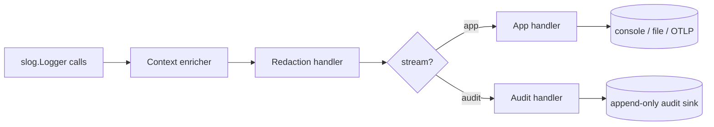

# Conduit — Logging Architecture

> Document ID: `65-logging`
> Status: Draft (v0.1.0)
> Owner: Principal Observability Architect
> Last updated: 2026-07-02

Related documents:
- [Observability](64-observability.md)
- [Telemetry](66-telemetry.md)
- [Secrets Management](61-secrets-management.md)
- [Configuration](60-configuration.md)
- [Authorization](63-authorization.md)
- [Execution Runtime](31-execution-runtime.md)
- [Threat Model](69-threat-model.md)

---

## 1. Overview

Conduit logging is built on Go's standard **`log/slog`** for structured logging. There are **two logically distinct streams** sharing the same handler chain:

- **Application log stream** — operational diagnostics for humans/operators (`-v/-vv`, text or JSON).
- **Audit log stream** — security-relevant, tamper-evident events (auth, authz, secret access) for compliance/non-repudiation ([THREAT-009](69-threat-model.md)).

Both streams: are **redaction-integrated** ([61 §5](61-secrets-management.md)), carry **correlation IDs** (`run_id`/`task_id`/`trace_id`/`span_id`), and can be captured per-run and streamed live.



---

## 2. Levels & Verbosity

`slog` levels, with custom `TRACE` below `DEBUG`:

| Level | slog value | CLI flag | Use |
|-------|-----------|----------|-----|
| TRACE | -8 | `-vvv` | Fine-grained internal steps |
| DEBUG | -4 | `-vv` | Developer diagnostics |
| INFO | 0 | `-v` / default(server) | Normal operational events |
| WARN | 4 | (default CLI) | Recoverable issues |
| ERROR | 8 | — | Failures |

Verbosity resolution: `-v/-vv/-vvv` flags > `CONDUIT_LOG__LEVEL` env > `log.level` config ([60](60-configuration.md)). Default is `warn` for interactive CLI (quiet), `info` for daemon.

---

## 3. Handler Architecture

The logger is a chain of `slog.Handler` decorators around a base text/JSON handler:

```
slog.Logger
  └─ contextHandler   (injects run_id/task_id/trace_id/span_id)
      └─ redactHandler  (scrubs secret values — 61 §5)
          └─ routingHandler (splits app vs audit by attr "stream")
              ├─ base app handler   (slog.TextHandler | slog.JSONHandler)
              └─ audit handler       (append-only, signed)
```

```go
// NewLogger builds the Conduit slog logger with the full handler chain.
func NewLogger(cfg LogConfig, red *secrets.Redactor, auditSink AuditSink) *slog.Logger {
	var base slog.Handler
	opts := &slog.HandlerOptions{
		Level:     levelVar(cfg.Level),
		AddSource: cfg.Level <= slog.LevelDebug,
	}
	switch resolveFormat(cfg.Format) { // auto: json if !isatty else text
	case "json":
		base = slog.NewJSONHandler(os.Stderr, opts)
	default:
		base = slog.NewTextHandler(os.Stderr, opts)
	}

	h := &routingHandler{app: base, audit: newAuditHandler(auditSink)}
	if cfg.Redaction {
		h2 := &redactHandler{next: h, red: red}
		return slog.New(&contextHandler{next: h2})
	}
	return slog.New(&contextHandler{next: h})
}
```

---

## 4. Correlation IDs (context handler)

Every record is enriched from `context.Context`: the run/task identity and the OTel span context (shared with [observability](64-observability.md#6-logs-correlation)).

```go
type contextHandler struct{ next slog.Handler }

type ctxKey int
const (
	runIDKey ctxKey = iota
	taskIDKey
)

func WithRun(ctx context.Context, runID string) context.Context { return context.WithValue(ctx, runIDKey, runID) }
func WithTask(ctx context.Context, taskID string) context.Context { return context.WithValue(ctx, taskIDKey, taskID) }

func (h *contextHandler) Handle(ctx context.Context, r slog.Record) error {
	if v, ok := ctx.Value(runIDKey).(string); ok {
		r.AddAttrs(slog.String("run_id", v))
	}
	if v, ok := ctx.Value(taskIDKey).(string); ok {
		r.AddAttrs(slog.String("task_id", v))
	}
	if sc := trace.SpanContextFromContext(ctx); sc.IsValid() {
		r.AddAttrs(
			slog.String("trace_id", sc.TraceID().String()),
			slog.String("span_id", sc.SpanID().String()),
		)
	}
	return h.next.Handle(ctx, r)
}

func (h *contextHandler) Enabled(ctx context.Context, l slog.Level) bool { return h.next.Enabled(ctx, l) }
func (h *contextHandler) WithAttrs(a []slog.Attr) slog.Handler { return &contextHandler{h.next.WithAttrs(a)} }
func (h *contextHandler) WithGroup(n string) slog.Handler      { return &contextHandler{h.next.WithGroup(n)} }
```

---

## 5. Formats

- **text** — human-friendly, colorized when TTY (via a lipgloss-aware writer); default for interactive CLI.
- **json** — one JSON object per line; default in CI/daemon and when stdout is not a TTY (`format: auto`).

Example JSON app record:

```json
{
  "time": "2026-07-02T14:03:11.221Z",
  "level": "INFO",
  "msg": "task completed",
  "stream": "app",
  "run_id": "run_01J...",
  "task_id": "apply",
  "trace_id": "4bf92f3577b34da6a3ce929d0e0e4736",
  "span_id": "00f067aa0ba902b7",
  "duration_ms": 812,
  "status": "success"
}
```

---

## 6. Redaction Handler

The redaction handler scrubs every attribute value (and message) against the shared [`Redactor`](61-secrets-management.md#5-redaction-pipeline) before it reaches any sink. This is the log-side integration point of the platform-wide redaction pipeline.

```go
type redactHandler struct {
	next slog.Handler
	red  *secrets.Redactor
}

func (h *redactHandler) Handle(ctx context.Context, r slog.Record) error {
	r.Message = string(h.red.Scrub([]byte(r.Message)))
	scrubbed := slog.Record{Time: r.Time, Level: r.Level, Message: r.Message, PC: r.PC}
	r.Attrs(func(a slog.Attr) bool {
		scrubbed.AddAttrs(h.redactAttr(a))
		return true
	})
	return h.next.Handle(ctx, scrubbed)
}

func (h *redactHandler) redactAttr(a slog.Attr) slog.Attr {
	switch a.Value.Kind() {
	case slog.KindString:
		return slog.String(a.Key, string(h.red.Scrub([]byte(a.Value.String()))))
	case slog.KindAny:
		if _, ok := a.Value.Any().(secrets.SecretRef); ok {
			return slog.String(a.Key, "***") // SecretRef never renders
		}
	}
	return a
}
```

---

## 7. Per-Run Log Capture & Streaming

Each run captures its logs into a run-scoped buffer/sink so they can be inspected offline (`conduit logs <run-id>`) and streamed live to a TUI or an API consumer.

```go
// runSink fans a run's log records to: the console handler, a per-run file
// (redacted), and any live subscribers (WebSocket/gRPC stream, TUI).
type runSink struct {
	runID   string
	file    io.WriteCloser        // .conduit/runs/<id>/log.jsonl (redacted)
	subs    []chan<- []byte       // live streamers
}

func (s *runSink) Write(record []byte) (int, error) {
	_, _ = s.file.Write(record)
	for _, ch := range s.subs {
		select {
		case ch <- record:
		default: // drop for slow consumers; never block the run
		}
	}
	return len(record), nil
}
```

- Task stdout/stderr is captured through a [`redactWriter`](61-secrets-management.md#5-redaction-pipeline) and attached to the run's log with `task_id`.
- Live streaming powers `conduit run --follow`, the TUI, and the [agent API](11-component-architecture.md).

---

## 8. Audit Log Stream

The audit stream is separate, append-only, and tamper-evident. It records security-relevant events from [AuthN](62-authentication.md), [AuthZ](63-authorization.md), and [secret access](61-secrets-management.md#10-audit).

Properties:
- **Separate sink** (`stream: "audit"`), not mixed into app logs; may target a different destination (SIEM, dedicated file, OTLP logs).
- **Append-only + hash-chained:** each record includes a hash of the previous record (`prev_hash`) so gaps/tampering are detectable; optionally signed. Addresses [THREAT-009](69-threat-model.md).
- **Never redacted away:** audit records carry *identifiers* (subject, object name, result) but never secret values, so redaction does not remove needed evidence.

```go
type AuditEvent struct {
	TS       time.Time `json:"ts"`
	Stream   string    `json:"stream"`   // "audit"
	Action   string    `json:"action"`   // "secret.read", "authz.decide", "login"
	Subject  string    `json:"subject"`
	Object   string    `json:"object"`
	Result   string    `json:"result"`   // "allow" | "deny" | "error"
	Rule     string    `json:"rule,omitempty"`
	RunID    string    `json:"run_id,omitempty"`
	TraceID  string    `json:"trace_id,omitempty"`
	PrevHash string    `json:"prev_hash"`
	Hash     string    `json:"hash"`
}

// auditHandler chains hashes for tamper-evidence.
func (h *auditHandler) emit(e AuditEvent) error {
	e.PrevHash = h.last
	e.Hash = sha256Hex(canonicalJSON(e)) // over all fields except Hash
	h.last = e.Hash
	return h.sink.Append(e)
}
```

---

## 9. Sinks & Sampling

| Sink | Stream | Notes |
|------|--------|-------|
| Console (stderr) | app | Text/JSON; TTY-aware |
| Per-run file | app | `.conduit/runs/<id>/log.jsonl`, redacted |
| OTLP logs | app | Bridged to [OTel](64-observability.md), correlated by trace |
| Audit sink | audit | Append-only file / SIEM / OTLP logs |

**Sampling** applies only to high-volume app logs (e.g., per-line task output at TRACE): a rate-limiting sampler drops repetitive records with a `dropped` counter. Audit logs are **never sampled or dropped**. Sampling never applies below WARN for correctness-relevant events.

```go
// samplingHandler drops high-frequency low-severity duplicates (app stream only).
type samplingHandler struct {
	next    slog.Handler
	limiter *rate.Limiter
}

func (h *samplingHandler) Handle(ctx context.Context, r slog.Record) error {
	if r.Level < slog.LevelWarn && !h.limiter.Allow() {
		return nil // sampled out
	}
	return h.next.Handle(ctx, r)
}
```

---

## 10. Verbosity Flags

| Flag | Effect |
|------|--------|
| (none) | WARN (interactive), INFO (daemon) |
| `-v` | INFO |
| `-vv` | DEBUG + source locations |
| `-vvv` | TRACE (very verbose, per-line task output) |
| `--log-format text\|json` | Override format |
| `--quiet` | ERROR only |
| `--no-redact` | **Disabled in server mode**; local-only, prints a warning; still redacts pattern matches |

---

## 11. Security Considerations (summary)

| Concern | Control | Reference |
|---------|---------|-----------|
| Secrets in logs | Redaction handler + `SecretRef` marker | §6, [61 §5](61-secrets-management.md) |
| Audit tampering/repudiation | Hash-chained append-only audit stream | §8, [THREAT-009](69-threat-model.md) |
| Log flooding / DoS | Sampling of low-severity app logs (never audit) | §9, [THREAT-013](69-threat-model.md) |
| `--no-redact` misuse | Blocked in server mode; warns; patterns still applied | §10 |

---

## 12. Cross-References

- Signal correlation & OTel export: [64 — Observability](64-observability.md)
- Redaction pipeline: [61 — Secrets Management §5](61-secrets-management.md)
- Audited auth/authz events: [62 — Authentication](62-authentication.md), [63 — Authorization](63-authorization.md)
- Log config keys (`log.*`): [60 — Configuration](60-configuration.md)
- Product telemetry (separate concern): [66 — Telemetry](66-telemetry.md)
- Threats: [69 — Threat Model](69-threat-model.md)
