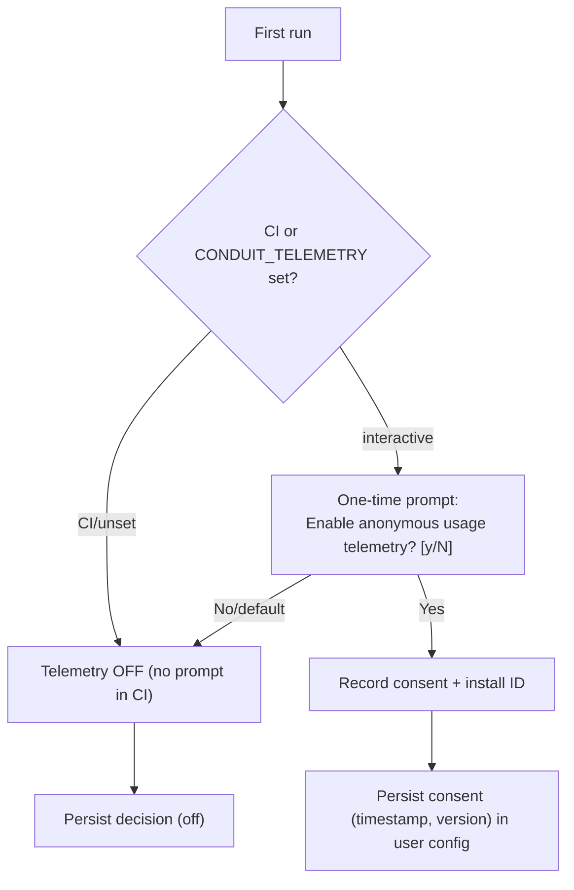

# Conduit — Product Telemetry Architecture

> Document ID: `66-telemetry`
> Status: Draft (v0.1.0)
> Owner: Principal Observability Architect
> Last updated: 2026-07-02

Related documents:
- [Observability](64-observability.md)
- [Logging](65-logging.md)
- [Secrets Management](61-secrets-management.md)
- [Configuration](60-configuration.md)
- [Threat Model](69-threat-model.md)
- [Security Requirements](05-security-requirements.md)

---

## 1. Overview & Contrast with Observability

**Product telemetry** is anonymous, aggregate *usage* data collected to help Conduit's maintainers understand feature adoption and prioritize work. It is fundamentally different from [operational observability](64-observability.md):

| Dimension | Observability ([64](64-observability.md)) | Product Telemetry (this doc) |
|-----------|-------------------------------------------|------------------------------|
| Audience | The operator running Conduit | Conduit's maintainers |
| Data | Traces/metrics/logs of *their* runs | Anonymous usage of the *tool* |
| Destination | Operator's own collector | Conduit project endpoint |
| Default | On (if `otel.enabled`) | **Off** — explicit opt-in required |
| Content | Rich, correlated, operator-owned | Minimal, anonymized, aggregate |
| Consent | Operator configures | Explicit, first-run prompt |

**Privacy-first, off by default.** No product telemetry is ever sent without explicit, recorded consent.

---

## 2. Consent Model (opt-in)



- Off by default; the prompt defaults to **No**.
- **Never prompts in CI** or non-interactive sessions (detected via env/TTY) — silently off.
- `observability.telemetry.enabled` in [config](60-configuration.md) is authoritative; can be `enforced: false` org-wide via [remote config](60-configuration.md#9-remote-providers-consul--vault--http).
- `DO_NOT_TRACK=1` and `CONDUIT_TELEMETRY=off` env vars force off, honoring the [Console Do Not Track](https://consoledonottrack.com/) convention.

---

## 3. What IS and IS NOT Collected

**Collected (anonymous, aggregate):**
- Anonymous, randomly-generated **install ID** (rotatable; not tied to user/machine identity).
- **Command names** invoked (e.g., `run`, `plugin install`) — the *command path only*, no arguments.
- **Feature flags** used (e.g., which providers/exporters enabled — booleans, not values).
- **Error classes** (typed error codes like `CONFIG_INVALID`, `PLUGIN_VERIFY_FAILED`) — never messages.
- Coarse **environment**: OS, arch, Conduit version, Go version.
- Aggregate **counts/durations** bucketed (e.g., run duration histogram bucket).

**NEVER collected (hard rule):**
- Command **arguments**, flag **values**, or free-text.
- **File paths**, flow names, file contents, or `.flow` bodies.
- **Secrets** or any resolved values.
- **Env variable values**, hostnames, usernames, IPs, or any PII.
- Anything from the [redaction pipeline](61-secrets-management.md#5-redaction-pipeline)'s scope — telemetry has *no* free-text fields, so there is nothing to redact by construction.

This constraint is enforced structurally (§5): the event schema has no free-form fields.

---

## 4. Event Schema

Events are a closed, typed set (allowlist). There are no open string fields.

```go
// Package telemetry emits anonymous, structured usage events (opt-in).
package telemetry

// Event is a closed union — only enumerable fields, no free text.
type Event struct {
	Schema    int       `json:"schema"`     // schema version
	InstallID string    `json:"install_id"` // random, rotatable
	TS        time.Time `json:"ts"`
	Kind      EventKind `json:"kind"`       // enum
	Command   string    `json:"command,omitempty"`    // allowlisted command path only
	ErrorClass string   `json:"error_class,omitempty"`// typed code, never a message
	DurationBucket string `json:"duration_bucket,omitempty"` // "lt1s","1-10s","10-60s",...
	Env       EnvInfo   `json:"env"`
}

type EventKind string
const (
	EventCommand   EventKind = "command_invoked"
	EventError     EventKind = "error"
	EventFeature   EventKind = "feature_used"
	EventLifecycle EventKind = "lifecycle" // install/upgrade
)

type EnvInfo struct {
	OS      string `json:"os"`      // "linux","darwin","windows"
	Arch    string `json:"arch"`    // "amd64","arm64"
	Version string `json:"version"` // conduit semver
	GoVer   string `json:"go"`      // go runtime version
}

// allowlist of commands that may be reported; anything else -> "" (unknown).
var commandAllowlist = map[string]bool{
	"run": true, "plugin install": true, "plugin list": true,
	"config get": true, "login": true, "trace": true, /* ... */
}

func sanitizeCommand(path string) string {
	if commandAllowlist[path] {
		return path
	}
	return "" // never report a command not on the allowlist
}
```

Example event:

```json
{
  "schema": 1,
  "install_id": "a1b2c3d4-...",
  "ts": "2026-07-02T14:03:11Z",
  "kind": "command_invoked",
  "command": "run",
  "duration_bucket": "10-60s",
  "env": { "os": "linux", "arch": "amd64", "version": "1.0.0", "go": "go1.24" }
}
```

---

## 5. Structural Privacy Guarantees

Privacy is enforced by construction, not by filtering:

- **No free-text fields** in `Event` — impossible to attach args/paths/messages.
- **Allowlisted commands** — unknown commands report empty, so custom/plugin command names (which could be sensitive) never leak.
- **Typed error classes** — errors map to an enum before emission; raw error strings are dropped.
- **Redaction backstop** — as defense-in-depth, the serialized event still passes through the [redactor](61-secrets-management.md#5-redaction-pipeline) before transport, though by design there is nothing to catch.

```go
// Emit records an event only if consent is granted; sanitizes then buffers.
func (t *Telemetry) Emit(ev Event) {
	if !t.enabled { // consent gate — hard stop
		return
	}
	ev.Command = sanitizeCommand(ev.Command)
	ev.InstallID = t.installID
	t.buffer.Add(ev) // local buffer, flushed async (§6)
}
```

---

## 6. Transport, Sampling & Local Buffering

- **Local buffering:** events are written to a small local buffer (`.conduit/telemetry/queue`) and flushed asynchronously in batches. A failed CLI run still never blocks on telemetry.
- **Non-blocking:** emission and flush happen off the hot path; if the endpoint is unreachable, events are dropped after a bounded retry — never queued indefinitely, never persisted long-term.
- **Sampling:** high-frequency events (e.g., completion invocations) are sampled; lifecycle/error events are not.
- **Transport:** batched HTTPS POST to the project telemetry endpoint (TLS, no auth token that identifies a user). No cookies, no fingerprinting.
- **Fail-open silence:** telemetry failures are logged at DEBUG only and never surfaced to the user.

```go
func (t *Telemetry) flush(ctx context.Context) {
	batch := t.buffer.Drain(maxBatch)
	if len(batch) == 0 {
		return
	}
	body, _ := json.Marshal(batch)
	body = t.redactor.Scrub(body) // defense-in-depth
	req, _ := http.NewRequestWithContext(ctx, http.MethodPost, t.endpoint, bytes.NewReader(body))
	req.Header.Set("Content-Type", "application/json")
	if _, err := t.client.Do(req); err != nil {
		t.log.Debug("telemetry flush failed (ignored)", "err", err) // never user-facing
	}
}
```

---

## 7. GDPR / Privacy & Data Governance

- **Lawful basis:** consent (opt-in), recorded with timestamp and version.
- **Data minimization:** only the closed schema above; no PII, so most GDPR obligations are inapplicable by design.
- **Anonymous by design:** the install ID is random and not linkable to a person; it is rotatable (`conduit telemetry reset-id`).
- **Right to erasure / withdrawal:** `conduit telemetry off` stops collection immediately and clears the local queue; users may request deletion of aggregate install-ID data via a published contact.
- **Retention:** aggregate data retained for a bounded window (e.g., 13 months), then aggregated/discarded per the published policy.
- **Transparency:** `conduit telemetry preview` shows exactly what *would* be sent for the current session before any transmission.
- **Governance:** schema changes require privacy review; the schema is versioned and published.

---

## 8. `conduit telemetry` Commands

| Command | Description |
|---------|-------------|
| `conduit telemetry status` | Show whether telemetry is on/off, consent date, install ID. |
| `conduit telemetry on` / `off` | Enable/disable; `off` clears the local queue. |
| `conduit telemetry preview` | Print the exact events that would be sent this session (dry-run). |
| `conduit telemetry reset-id` | Rotate the anonymous install ID. |
| `conduit telemetry flush` | Force-flush the local buffer now. |

---

## 9. Security & Privacy Considerations (summary)

| Concern | Control | Reference |
|---------|---------|-----------|
| Accidental PII/secret collection | Closed schema, no free-text, command allowlist, redaction backstop | §3–§5, [THREAT-016](69-threat-model.md) |
| Collection without consent | Off by default, explicit opt-in, `DO_NOT_TRACK`, never in CI | §2 |
| Fingerprinting / re-identification | Random rotatable install ID, no IP/host/user | §3, §7 |
| Endpoint spoofing capturing data | TLS; only anonymous data at risk (low impact) | §6 |
| Blocking/leaking on failure | Async, non-blocking, DEBUG-only errors | §6 |

---

## 10. Cross-References

- Operational observability (the contrast): [64 — Observability](64-observability.md)
- Redaction backstop: [61 — Secrets Management §5](61-secrets-management.md)
- Logging (separate stream): [65 — Logging](65-logging.md)
- Telemetry config (`observability.telemetry.*`): [60 — Configuration §4](60-configuration.md)
- Privacy threats: [69 — Threat Model](69-threat-model.md) THREAT-016
