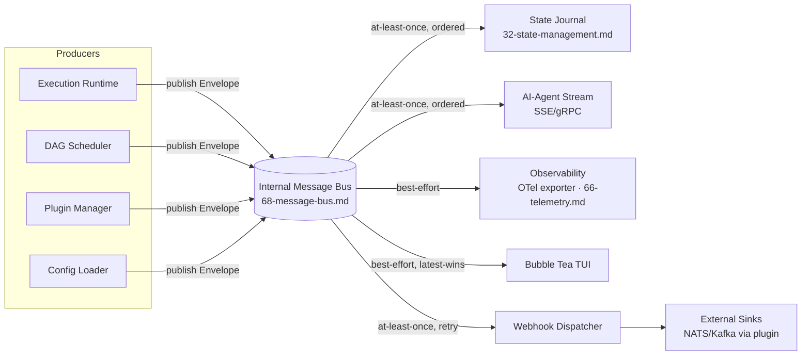

# Conduit — Event Model

> Document ID: `67-event-model`
> Status: Draft (v0.1.0)
> Owner: Platform Architecture — Observability & Messaging
> Last updated: 2026-07-02

Related documents:
- [Internal Message Bus](68-message-bus.md) — transport that carries these events
- [Observability Architecture](64-observability.md) — metrics/traces derived from events
- [Logging Architecture](65-logging.md) — `step.log` events feed the log pipeline
- [Telemetry Architecture](66-telemetry.md) — OTel export
- [State Management Design](32-state-management.md) — the state journal is an event subscriber
- [Execution Runtime Design](31-execution-runtime.md) — primary event producer
- [Workflow DAG Design](30-workflow-dag.md) — run/task/step topology
- [Error Handling Strategy](70-error-handling.md) — `error.raised` payloads
- [Recovery Strategy](71-recovery-strategy.md) — checkpoint events

---

## 1. Purpose & Scope

The **Event Model** defines the *canonical, versioned vocabulary* of things that happen inside a
Conduit process, independent of how they are transported or consumed. Every observable state
transition — a run starting, a task changing state, a plugin loading, an error being raised — is
represented as an immutable **event** with a stable schema.

Events are the single source of truth that fan out to many **subscribers**: the observability
pipeline, the durable state journal, the Bubble Tea TUI, outbound webhooks, and the AI-agent stream.
Producers never call subscribers directly; they publish events to the
[Internal Message Bus](68-message-bus.md).

Design goals:

- **One vocabulary, many consumers.** Define an event once; every surface consumes the same shape.
- **CloudEvents-aligned.** The envelope maps 1:1 to [CloudEvents 1.0](https://cloudevents.io) so
  external sinks (webhooks, NATS, Kafka) receive a standard structure.
- **Versioned & backward-compatible.** Event types are versioned; consumers tolerate additive change.
- **Trace-correlated.** Every event carries W3C trace context so events, logs, metrics, and spans
  stitch together in any backend.
- **Deterministic identity.** Stable `run`, `task`, and `step` IDs make events joinable and replayable.

---

## 2. Event Taxonomy

Event **types** use a dotted, hierarchical, lowercase namespace: `<domain>.<subject>[.<action>]`.
The reverse-DNS `type` field in the envelope prefixes these with `io.conduit.` (CloudEvents best
practice), e.g. `io.conduit.run.started`.

### 2.1 Canonical event catalog

| Type (short) | Domain | Emitted when | Key payload fields |
|---|---|---|---|
| `run.started` | run | A flow run begins | `flow`, `flow_version`, `inputs`, `dry_run` |
| `run.completed` | run | A run finishes successfully | `duration_ms`, `task_count`, `outputs` |
| `run.failed` | run | A run terminates with error | `error`, `failed_tasks[]` |
| `run.canceled` | run | A run is canceled (signal/ctx) | `reason`, `at_task` |
| `run.checkpointed` | run | Runtime persists a checkpoint | `checkpoint_id`, `completed_tasks[]` |
| `run.resumed` | run | A run resumes from checkpoint | `checkpoint_id` |
| `task.scheduled` | task | Scheduler enqueues a ready task | `task`, `depends_on[]` |
| `task.started` | task | A task begins executing | `task`, `attempt` |
| `task.state_changed` | task | Any task lifecycle transition | `task`, `from`, `to`, `attempt` |
| `task.retrying` | task | A task is scheduled for retry | `task`, `attempt`, `backoff_ms`, `cause` |
| `task.succeeded` | task | A task completes successfully | `task`, `duration_ms`, `outputs` |
| `task.failed` | task | A task exhausts retries / hard-fails | `task`, `error`, `attempts` |
| `task.skipped` | task | A task is skipped (`when` false / upstream fail) | `task`, `reason` |
| `task.compensated` | task | An `on_error`/rollback handler ran | `task`, `handler`, `outcome` |
| `step.started` | step | A step within a task begins | `task`, `step`, `kind` |
| `step.log` | step | A step emits a log line | `task`, `step`, `level`, `message`, `stream` |
| `step.progress` | step | A step reports progress | `task`, `step`, `pct`, `detail` |
| `step.finished` | step | A step within a task ends | `task`, `step`, `exit_code`, `duration_ms` |
| `plugin.loaded` | plugin | A plugin process starts & handshakes | `plugin`, `version`, `protocol`, `pid` |
| `plugin.unloaded` | plugin | A plugin is stopped/drained | `plugin`, `reason` |
| `plugin.crashed` | plugin | A plugin process exits abnormally | `plugin`, `signal`, `restart` |
| `plugin.health_changed` | plugin | Circuit breaker / health transition | `plugin`, `from`, `to` |
| `error.raised` | error | A structured error is surfaced | `code`, `category`, `message`, `remediation` |
| `expr.evaluated` | expr | A CEL expression is evaluated (debug) | `expr`, `cost`, `result_type` |
| `config.loaded` | config | Effective config is resolved | `sources[]`, `profile` |
| `secret.accessed` | secret | A secret is read (audit) | `provider`, `key_ref` (never value) |

> **Task lifecycle states** referenced by `task.state_changed` are:
> `pending → scheduled → running → (retrying) → succeeded | failed | skipped | canceled`.
> The authoritative state machine lives in [Workflow DAG Design](30-workflow-dag.md); this event is
> the wire representation of each transition.

### 2.2 Type constants (Go)

```go
// Package events defines the canonical Conduit event vocabulary.
package events

// Type is a CloudEvents "type" value. Always reverse-DNS, lowercase, dotted.
type Type string

const (
	TypeRunStarted       Type = "io.conduit.run.started"
	TypeRunCompleted     Type = "io.conduit.run.completed"
	TypeRunFailed        Type = "io.conduit.run.failed"
	TypeRunCanceled      Type = "io.conduit.run.canceled"
	TypeRunCheckpointed  Type = "io.conduit.run.checkpointed"
	TypeRunResumed       Type = "io.conduit.run.resumed"

	TypeTaskScheduled    Type = "io.conduit.task.scheduled"
	TypeTaskStarted      Type = "io.conduit.task.started"
	TypeTaskStateChanged Type = "io.conduit.task.state_changed"
	TypeTaskRetrying     Type = "io.conduit.task.retrying"
	TypeTaskSucceeded    Type = "io.conduit.task.succeeded"
	TypeTaskFailed       Type = "io.conduit.task.failed"
	TypeTaskSkipped      Type = "io.conduit.task.skipped"
	TypeTaskCompensated  Type = "io.conduit.task.compensated"

	TypeStepStarted   Type = "io.conduit.step.started"
	TypeStepLog       Type = "io.conduit.step.log"
	TypeStepProgress  Type = "io.conduit.step.progress"
	TypeStepFinished  Type = "io.conduit.step.finished"

	TypePluginLoaded        Type = "io.conduit.plugin.loaded"
	TypePluginUnloaded      Type = "io.conduit.plugin.unloaded"
	TypePluginCrashed       Type = "io.conduit.plugin.crashed"
	TypePluginHealthChanged Type = "io.conduit.plugin.health_changed"

	TypeErrorRaised   Type = "io.conduit.error.raised"
	TypeExprEvaluated Type = "io.conduit.expr.evaluated"
	TypeConfigLoaded  Type = "io.conduit.config.loaded"
	TypeSecretAccessed Type = "io.conduit.secret.accessed"
)

// Domain extracts the top-level domain ("run", "task", "step", ...) from a Type,
// which the message bus uses for topic routing (see 68-message-bus.md).
func (t Type) Domain() string {
	s := strings.TrimPrefix(string(t), "io.conduit.")
	if i := strings.IndexByte(s, '.'); i >= 0 {
		return s[:i]
	}
	return s
}
```

---

## 3. Event Envelope Schema (CloudEvents-aligned)

Every event shares one envelope. The field names map directly onto CloudEvents 1.0 core attributes;
Conduit-specific correlation lives under the `io.conduit.*` extension attributes and the `data`
payload.

### 3.1 Field reference

| Envelope field | CloudEvents attr | Type | Required | Notes |
|---|---|---|---|---|
| `id` | `id` | string (UUIDv7) | yes | Unique per event; UUIDv7 so it is time-ordered. |
| `type` | `type` | string | yes | One of §2 constants. |
| `specversion` | `specversion` | string | yes | Always `"1.0"`. |
| `source` | `source` | URI-ref | yes | Producer, e.g. `/conduit/runtime` or `/conduit/plugin/git`. |
| `time` | `time` | RFC3339 | yes | Event timestamp (UTC, ns precision truncated to µs). |
| `subject` | `subject` | string | no | The most-specific entity, e.g. `run/<id>/task/<name>`. |
| `datacontenttype` | `datacontenttype` | string | no | Always `application/json`. |
| `dataschema` | `dataschema` | URI | no | Versioned payload schema URL (see §4). |
| `runid` | ext `runid` | string (ULID) | when in-run | Correlates all events of one run. |
| `taskid` | ext `taskid` | string | when task-scoped | Task node id within the run. |
| `stepid` | ext `stepid` | string | when step-scoped | Step id within the task. |
| `traceparent` | ext `traceparent` | string | yes | W3C trace context (`00-<trace>-<span>-<flags>`). |
| `tracestate` | ext `tracestate` | string | no | W3C tracestate vendor data. |
| `sequence` | ext `sequence` | uint64 | yes | Monotonic per-`runid` ordering counter (see §5). |
| `data` | `data` | object | yes* | Type-specific payload (§2). Absent for pure signals. |

### 3.2 Go envelope struct

```go
package events

import "time"

// Envelope is the CloudEvents-aligned wrapper carried by every Conduit event.
type Envelope struct {
	ID              string          `json:"id"`
	Type            Type            `json:"type"`
	SpecVersion     string          `json:"specversion"`     // always "1.0"
	Source          string          `json:"source"`
	Time            time.Time       `json:"time"`
	Subject         string          `json:"subject,omitempty"`
	DataContentType string          `json:"datacontenttype,omitempty"`
	DataSchema      string          `json:"dataschema,omitempty"`

	// Conduit correlation extensions (CloudEvents extension attributes).
	RunID    string `json:"runid,omitempty"`
	TaskID   string `json:"taskid,omitempty"`
	StepID   string `json:"stepid,omitempty"`

	// Trace propagation (W3C).
	TraceParent string `json:"traceparent"`
	TraceState  string `json:"tracestate,omitempty"`

	// Ordering (see §5).
	Sequence uint64 `json:"sequence"`

	// Payload. Kept as raw JSON on the wire so subscribers decode lazily
	// only the types they care about.
	Data json.RawMessage `json:"data,omitempty"`
}

// Event is an Envelope with a strongly-typed, already-decoded payload,
// used in-process before serialization. Payload implements Payload.
type Event struct {
	Envelope
	Payload Payload `json:"-"`
}

// Payload is implemented by every typed event body.
type Payload interface {
	EventType() Type
}
```

### 3.3 Typed payloads (examples)

```go
// RunStarted is the data for io.conduit.run.started.
type RunStarted struct {
	Flow        string            `json:"flow"`
	FlowVersion string            `json:"flow_version"`
	Inputs      map[string]any    `json:"inputs,omitempty"`
	DryRun      bool              `json:"dry_run"`
}

func (RunStarted) EventType() Type { return TypeRunStarted }

// TaskStateChanged is the data for io.conduit.task.state_changed.
type TaskStateChanged struct {
	Task    string `json:"task"`
	From    string `json:"from"`
	To      string `json:"to"`
	Attempt int    `json:"attempt"`
	Reason  string `json:"reason,omitempty"`
}

func (TaskStateChanged) EventType() Type { return TypeTaskStateChanged }

// StepLog is the data for io.conduit.step.log.
type StepLog struct {
	Task    string `json:"task"`
	Step    string `json:"step"`
	Level   string `json:"level"`   // debug|info|warn|error
	Stream  string `json:"stream"`  // stdout|stderr|conduit
	Message string `json:"message"`
}

func (StepLog) EventType() Type { return TypeStepLog }

// ErrorRaised is the data for io.conduit.error.raised.
// Fields mirror the diagnostic structure in 70-error-handling.md.
type ErrorRaised struct {
	Code        string `json:"code"`        // e.g. CONDUIT-E1004
	Category    string `json:"category"`    // user|config|dsl|plugin|system|transient
	Message     string `json:"message"`
	Remediation string `json:"remediation,omitempty"`
	Retryable   bool   `json:"retryable"`
}

func (ErrorRaised) EventType() Type { return TypeErrorRaised }

// PluginLoaded is the data for io.conduit.plugin.loaded.
type PluginLoaded struct {
	Plugin   string `json:"plugin"`
	Version  string `json:"version"`
	Protocol int    `json:"protocol"` // go-plugin protocol version
	PID      int    `json:"pid"`
}

func (PluginLoaded) EventType() Type { return TypePluginLoaded }
```

### 3.4 JSON on the wire

A `task.state_changed` event, fully rendered as a CloudEvents JSON object:

```json
{
  "id": "018f3a2c-7e10-7b3a-9c4d-2f9a1b6e0c11",
  "type": "io.conduit.task.state_changed",
  "specversion": "1.0",
  "source": "/conduit/runtime",
  "time": "2026-07-02T14:03:11.482913Z",
  "subject": "run/01J2ABCXYZ/task/build",
  "datacontenttype": "application/json",
  "dataschema": "https://schemas.conduit.io/events/task.state_changed/v1.json",
  "runid": "01J2ABCXYZ8QF3G7K5N9M2P0RT",
  "taskid": "build",
  "traceparent": "00-4bf92f3577b34da6a3ce929d0e0e4736-00f067aa0ba902b7-01",
  "sequence": 42,
  "data": {
    "task": "build",
    "from": "scheduled",
    "to": "running",
    "attempt": 1
  }
}
```

A `step.log` event:

```json
{
  "id": "018f3a2c-8a44-7f01-b210-6d0e9f1122aa",
  "type": "io.conduit.step.log",
  "specversion": "1.0",
  "source": "/conduit/plugin/shell",
  "time": "2026-07-02T14:03:12.001004Z",
  "subject": "run/01J2ABCXYZ/task/build/step/compile",
  "runid": "01J2ABCXYZ8QF3G7K5N9M2P0RT",
  "taskid": "build",
  "stepid": "compile",
  "traceparent": "00-4bf92f3577b34da6a3ce929d0e0e4736-a1b2c3d4e5f60718-01",
  "sequence": 57,
  "data": {
    "task": "build",
    "step": "compile",
    "level": "info",
    "stream": "stdout",
    "message": "compiled 128 packages in 3.2s"
  }
}
```

---

## 4. Event Versioning

Events evolve under **SemVer-for-schemas** rules so that a v1 subscriber never breaks on a v1.x
producer.

### 4.1 Rules

1. **Additive-only within a major.** New optional fields MAY be added to a payload without a
   version bump. Consumers MUST ignore unknown fields (`json` decoding tolerates extras by default;
   we never use `DisallowUnknownFields` on the ingest path).
2. **Breaking change = new type.** Removing/renaming a field or changing its meaning creates a *new
   type suffix*, e.g. `io.conduit.task.state_changed` → `io.conduit.task.state_changed.v2`. The
   original type keeps flowing during a deprecation window. The unsuffixed type is implicitly `v1`.
3. **`dataschema` is authoritative.** The envelope's `dataschema` URL is versioned
   (`.../v1.json`, `.../v2.json`) and is the machine-checkable contract published in the schema
   registry.
4. **Deprecation window.** A superseded event type is emitted alongside its successor for at least
   one minor Conduit release, then removed at the next major per SemVer 2.0.0.

### 4.2 Compatibility contract

```go
// Registry maps a Type to its current schema URL and Go payload constructor.
// Producers resolve dataschema from here so envelopes never hardcode versions.
type Registry struct {
	mu      sync.RWMutex
	schemas map[Type]string
	newFn   map[Type]func() Payload
}

func (r *Registry) SchemaURL(t Type) string {
	r.mu.RLock()
	defer r.mu.RUnlock()
	return r.schemas[t] // "" if unknown; envelope omits dataschema
}
```

---

## 5. Ordering & Delivery Guarantees

Ordering and delivery are defined *per topic* and *per run*; the enforcing mechanism is the
[Internal Message Bus](68-message-bus.md). This section states the guarantees the event model
promises to subscribers.

### 5.1 Ordering

- **Per-run total order.** Every event carries a monotonic `sequence` scoped to its `runid`. The
  runtime assigns `sequence` from a single per-run atomic counter at publish time, so consumers can
  reconstruct exact causal order for one run even if the transport reorders across runs.
- **No cross-run ordering guarantee.** Events from different runs are independent; interleave freely.
- **UUIDv7 `id` + `time`** provide a coarse global order for archival/replay, but `sequence` is the
  authority within a run.

```go
// Sequencer hands out per-run monotonic sequence numbers.
type Sequencer struct{ counters sync.Map } // runID -> *atomic.Uint64

func (s *Sequencer) Next(runID string) uint64 {
	v, _ := s.counters.LoadOrStore(runID, new(atomic.Uint64))
	return v.(*atomic.Uint64).Add(1)
}
```

### 5.2 Delivery

Delivery semantics are chosen **per subscriber class**, because a dropped TUI frame is fine but a
dropped state-journal record is not:

| Subscriber | Delivery | Rationale |
|---|---|---|
| State journal | **at-least-once**, ordered per run | Durability; drives resume/checkpoint. Idempotent by `(runid, sequence)`. |
| Webhooks / external sinks | **at-least-once**, unordered ok | Network sinks retry; receivers dedupe by envelope `id`. |
| AI-agent stream | **at-least-once**, ordered per run | Agents need faithful causal history. |
| Observability (metrics/traces) | **best-effort** | Aggregated; occasional loss is statistically tolerable. |
| TUI | **best-effort, latest-wins** | Rendering; drop under backpressure is acceptable. |

De-duplication is the consumer's responsibility for at-least-once subscribers: dedupe on
`(runid, sequence)` for run-scoped events, or on `id` for global events. Because `id` is UUIDv7 and
`sequence` is monotonic, both dedup keys are cheap and index-friendly.

---

## 6. Subscribers



### 6.1 Subscriber interface

```go
// Subscriber consumes events. Handle MUST be non-blocking-friendly:
// the bus delivers on a bounded worker; a slow subscriber triggers the
// backpressure policy defined in 68-message-bus.md.
type Subscriber interface {
	// Interest declares which event types/domains to receive.
	Interest() []Type
	// Handle processes one event. Returning an error signals the bus to
	// apply the subscriber's retry policy (at-least-once classes only).
	Handle(ctx context.Context, e Event) error
}
```

### 6.2 Subscriber responsibilities

- **State journal** — persists an append-only, per-run ordered log keyed by `(runid, sequence)`.
  Enables checkpoint/resume ([Recovery Strategy](71-recovery-strategy.md)) and is the durable
  system-of-record. Idempotent writes make redelivery safe.
- **Observability** — translates events into OTel spans/metrics: `task.started`/`task.succeeded`
  bound a span; `step.log` becomes a log record; `task.retrying` increments a counter. See
  [Telemetry Architecture](66-telemetry.md).
- **TUI** — renders live run progress from `task.state_changed`, `step.progress`, and `step.log`.
  Best-effort; coalesces bursts and drops stale frames.
- **Webhooks** — serializes the CloudEvents envelope and POSTs it (CloudEvents HTTP binding) to
  configured endpoints with retry + HMAC signing.
- **AI-agent stream** — exposes an ordered, resumable event stream (SSE or gRPC server-stream) so an
  LLM agent can watch a run it invoked. Resumption uses `Last-Event-ID = sequence`.

### 6.3 Redaction

Before any event leaves the process (webhooks, agent stream, external sinks), payloads pass through
the secrets redactor from [Secrets Management](61-secrets-management.md). `secret.accessed` events
carry only a `key_ref`, never a value; `step.log` messages are scrubbed against the active secret set.

---

## 7. Cross-References

- Transport, topics, backpressure, and the reference bus implementation: [68 — Internal Message Bus](68-message-bus.md).
- How `error.raised` payloads are constructed and coded: [70 — Error Handling Strategy](70-error-handling.md).
- How `run.checkpointed`/`run.resumed` drive durability: [71 — Recovery Strategy](71-recovery-strategy.md) and [32 — State Management](32-state-management.md).
- OTel export of events: [66 — Telemetry Architecture](66-telemetry.md).
