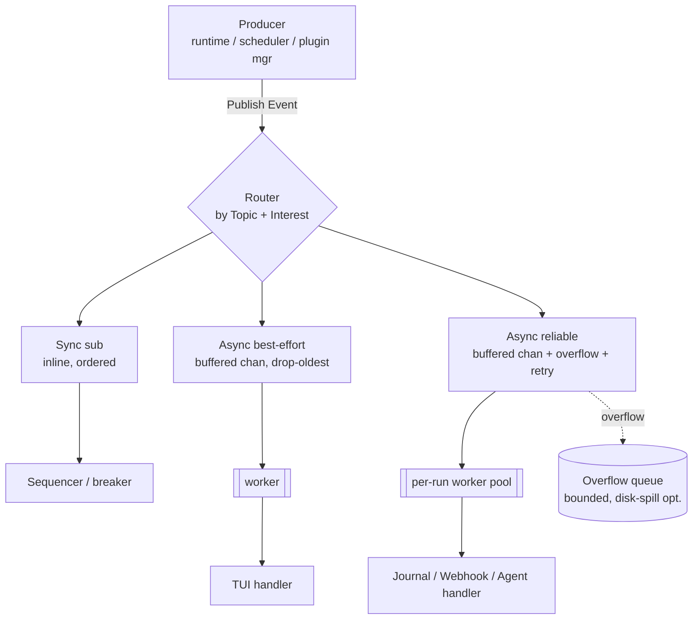

# Conduit — Internal Message Bus

> Document ID: `68-message-bus`
> Status: Draft (v0.1.0)
> Owner: Platform Architecture — Observability & Messaging
> Last updated: 2026-07-02

Related documents:
- [Event Model](67-event-model.md) — the payloads this bus transports
- [Observability Architecture](64-observability.md)
- [Telemetry Architecture](66-telemetry.md)
- [Execution Runtime Design](31-execution-runtime.md) — primary publisher
- [State Management Design](32-state-management.md) — durable subscriber
- [Plugin Architecture](40-plugin-architecture.md) — external-sink bridge plugins
- [Recovery Strategy](71-recovery-strategy.md) — graceful drain on shutdown
- [Error Handling Strategy](70-error-handling.md) — subscriber error handling

---

## 1. Purpose & Scope

The **Internal Message Bus** is Conduit's in-process publish/subscribe fabric. It decouples event
**producers** (runtime, scheduler, plugin manager, config loader) from **consumers** (state journal,
TUI, observability, webhooks, AI-agent stream) so neither knows about the other. Producers publish
[Envelopes](67-event-model.md) to **topics**; the bus fans them out to interested **subscriptions**
with per-topic delivery semantics.

The bus is deliberately **in-process and single-node** (matching Conduit's single-binary thesis in
[00 — Executive Summary](00-executive-summary.md)). Cross-process/cross-host distribution is achieved
by **bridging** selected topics to external systems (NATS, Kafka, webhooks) via a sink plugin — not
by making the core bus distributed.

Design goals:

- **Decoupling.** Producers depend only on `Publisher`; subscribers only on `Bus.Subscribe`.
- **Ordering per run.** Preserve the per-`runid` total order established in the event model.
- **Selectable reliability.** Best-effort for TUI/metrics; at-least-once for journal/webhooks/agent.
- **Backpressure without deadlock.** A slow consumer must never stall the runtime.
- **Graceful shutdown.** Drain in-flight events before exit so nothing durable is lost.

---

## 2. Concepts & Interfaces

### 2.1 Topics

A **topic** is a string routing key derived from an event's [`Type.Domain()`](67-event-model.md)
plus optional finer scoping. Standard topics:

| Topic | Carries | Typical subscribers |
|---|---|---|
| `run` | `run.*` events | journal, TUI, agent, webhooks |
| `task` | `task.*` events | journal, TUI, agent, observability |
| `step` | `step.*` events | TUI, logs pipeline, agent |
| `plugin` | `plugin.*` events | observability, breaker, journal |
| `error` | `error.raised` | journal, TUI, agent, webhooks |
| `audit` | `secret.accessed`, `config.loaded` | audit log, webhooks |

Subscribers may also filter by **event type** within a topic (`Interest() []events.Type`), so a
subscriber can take `task` but only `task.failed`.

### 2.2 Core interfaces

```go
package bus

import (
	"context"

	"github.com/conduit-io/conduit/internal/events"
)

// Topic is a routing key. Derived from events.Type.Domain() by default.
type Topic string

// Publisher is the producer-facing surface. This is all the runtime depends on.
type Publisher interface {
	// Publish routes an event to its topic. It never blocks indefinitely:
	// delivery to each subscription follows that subscription's mode (§4).
	// Returns an error only for a closed bus or a rejected publish under
	// a fail-closed backpressure policy.
	Publish(ctx context.Context, e events.Event) error
}

// Subscriber is the consumer-facing handler (defined in 67-event-model.md,
// re-exported here for the bus wiring).
type Subscriber = events.Subscriber

// Subscription is a live registration; cancel it to unsubscribe.
type Subscription interface {
	// Topic returns the subscribed topic.
	Topic() Topic
	// Unsubscribe detaches and drains the subscription.
	Unsubscribe()
}

// Bus is the full pub/sub fabric.
type Bus interface {
	Publisher

	// Subscribe registers s on topic with the given delivery options.
	Subscribe(topic Topic, s Subscriber, opts ...SubOption) (Subscription, error)

	// Close stops accepting publishes and drains in-flight events,
	// blocking until drained or ctx is done (graceful shutdown, §6).
	Close(ctx context.Context) error
}
```

### 2.3 Subscription options

```go
// DeliveryMode selects sync vs async and the reliability class.
type DeliveryMode int

const (
	// Async best-effort: buffered channel, drop-oldest on overflow. TUI/metrics.
	AsyncBestEffort DeliveryMode = iota
	// Async reliable: buffered channel, block-with-timeout then spill to
	// overflow queue; at-least-once with per-subscriber retry. Journal/webhooks/agent.
	AsyncReliable
	// Sync: delivered inline on the publisher goroutine, in order, no buffer.
	// Used only for correctness-critical, fast handlers (e.g. the sequencer).
	Sync
)

type SubOption func(*subConfig)

func WithMode(m DeliveryMode) SubOption      { return func(c *subConfig) { c.mode = m } }
func WithBuffer(n int) SubOption             { return func(c *subConfig) { c.buffer = n } }
func WithInterest(t ...events.Type) SubOption { return func(c *subConfig) { c.interest = t } }
func WithRetry(p RetryPolicy) SubOption      { return func(c *subConfig) { c.retry = p } }
// WithOrdered forces per-runid ordered delivery (single worker per run key).
func WithOrdered() SubOption                 { return func(c *subConfig) { c.ordered = true } }
```

---

## 3. Delivery Model: Sync vs Async, Fan-out, Buffering



- **Fan-out.** One `Publish` delivers a *copy of the envelope* (events are immutable, so this is a
  cheap struct copy sharing the `json.RawMessage` payload) to every matching subscription.
- **Sync delivery** runs the handler inline on the publishing goroutine, preserving strict order and
  applying backpressure directly to the producer. Reserved for tiny, fast, correctness-critical
  handlers (the per-run sequencer, the plugin circuit-breaker state machine).
- **Async delivery** hands the envelope to the subscription's buffered channel; a dedicated worker
  (or per-run worker for ordered subscriptions) drains it. This isolates slow consumers from
  producers.
- **Buffering.** Each async subscription owns a bounded channel (`WithBuffer`, default 1024). The
  bound is what makes backpressure decidable (§4).

---

## 4. Backpressure

The bus never lets a slow consumer deadlock the runtime. Policy is per delivery mode:

| Mode | On full buffer |
|---|---|
| `AsyncBestEffort` | **Drop-oldest** (ring semantics) and increment a `dropped_total` metric. Latest-wins for the TUI. |
| `AsyncReliable` | **Block up to `publishTimeout`** (default 250ms). If still full, **spill to the overflow queue** (bounded; optional disk spill). If overflow is also full → apply `OverflowPolicy` (default: block the *publisher* for reliable topics — correctness over throughput). |
| `Sync` | Natural backpressure: the producer waits for the handler. |

```go
type OverflowPolicy int

const (
	OverflowBlock  OverflowPolicy = iota // block producer (reliable default)
	OverflowSpill                        // spill to disk-backed queue
	OverflowReject                       // Publish returns ErrOverflow (fail-closed)
)

var ErrOverflow = errors.New("bus: subscription overflow")
```

Publishers on hot paths call `Publish` with a `ctx` whose deadline bounds any blocking, so a
misbehaving reliable subscriber degrades to a bounded stall, never a hang. Metrics
`bus.published_total`, `bus.dropped_total`, `bus.overflow_total`, and `bus.queue_depth` are exported
via [Telemetry](66-telemetry.md) so operators see pressure.

---

## 5. Ordering, Reliability & the External Bridge

### 5.1 Ordering per run

Ordered subscriptions (`WithOrdered`) route by `runid` to a **stable worker**, guaranteeing that all
events for one run are handled in `sequence` order (the counter assigned in
[67 — Event Model §5](67-event-model.md)). Different runs are sharded across workers for parallelism.
Best-effort subscriptions do not guarantee order.

```go
// orderedRouter maps runID -> a single-goroutine worker so per-run order holds
// while distinct runs execute concurrently.
func (s *subscription) route(e events.Event) {
	key := e.RunID
	w := s.workerFor(key) // consistent hash runID -> worker
	select {
	case w.ch <- e:
	default:
		s.applyBackpressure(w, e) // §4
	}
}
```

### 5.2 At-least-once vs best-effort per topic

Reliability is a property of the **subscription**, not the topic, but Conduit ships opinionated
defaults matching [67 — Event Model §5](67-event-model.md): journal/webhooks/agent subscribe
`AsyncReliable` (at-least-once, de-duped by `(runid,sequence)`), while TUI/observability subscribe
`AsyncBestEffort`.

### 5.3 Bridging to external sinks

Cross-process distribution is a **bridge subscription** that re-publishes selected topics to an
external system through a sink plugin ([go-plugin/gRPC](40-plugin-architecture.md)). This keeps the
core bus in-process while enabling fleet-scale fan-out.

```go
// SinkPlugin is the gRPC contract a bridge implements (NATS, Kafka, webhook).
type SinkPlugin interface {
	// Emit sends one CloudEvents envelope to the external system.
	// It MUST be idempotent-friendly (receivers dedupe on envelope.id).
	Emit(ctx context.Context, cloudEvent []byte) error
}

// BridgeSubscriber adapts a SinkPlugin into a bus Subscriber.
type BridgeSubscriber struct {
	sink   SinkPlugin
	topics []Topic
}

func (b *BridgeSubscriber) Interest() []events.Type { return nil /* all types on bound topics */ }

func (b *BridgeSubscriber) Handle(ctx context.Context, e events.Event) error {
	raw, err := json.Marshal(e.Envelope) // CloudEvents JSON (67-event-model §3)
	if err != nil {
		return fmt.Errorf("bridge marshal: %w", err)
	}
	return b.sink.Emit(ctx, raw) // retried by AsyncReliable policy on error
}
```

Bridge subscriptions are always `AsyncReliable` with retry, and payloads pass the secrets redactor
before `Emit` (see [67 §6.3](67-event-model.md)).

---

## 6. Graceful Shutdown & Draining

On `SIGINT`/`SIGTERM` or normal completion, the runtime calls `Bus.Close(ctx)`:

1. **Seal** the bus: further `Publish` calls return `ErrBusClosed` (producers are already stopping).
2. **Drain** each subscription's buffer *and* overflow queue, delivering remaining events in order.
3. **Flush reliable sinks**: wait for in-flight `AsyncReliable` handlers (journal, webhook bridge)
   to acknowledge, honoring the shutdown deadline in `ctx`.
4. **Abort best-effort** immediately (TUI/metrics loss is acceptable).
5. Return once drained or `ctx` expires; the caller then finalizes the state journal checkpoint
   (see [71 — Recovery Strategy](71-recovery-strategy.md)).

```go
func (b *channelBus) Close(ctx context.Context) error {
	b.sealOnce.Do(func() { close(b.publishGate) }) // reject new publishes
	var wg sync.WaitGroup
	for _, s := range b.subs() {
		wg.Add(1)
		go func(s *subscription) {
			defer wg.Done()
			s.drain(ctx) // deliver buffered+overflow; best-effort subs skip on ctx done
		}(s)
	}
	done := make(chan struct{})
	go func() { wg.Wait(); close(done) }()
	select {
	case <-done:
		return nil
	case <-ctx.Done():
		return fmt.Errorf("bus close: drain deadline exceeded: %w", ctx.Err())
	}
}
```

---

## 7. Channel-Based Reference Implementation

A compact, production-shaped core. Real code adds metrics/tracing hooks and the overflow queue; the
shape below is complete for best-effort and reliable async delivery with per-run ordering.

```go
package bus

type channelBus struct {
	mu          sync.RWMutex
	subs        map[Topic][]*subscription
	publishGate chan struct{} // closed on seal
	sealOnce    sync.Once
	seq         *events.Sequencer
}

func New(seq *events.Sequencer) *channelBus {
	return &channelBus{
		subs:        make(map[Topic][]*subscription),
		publishGate: make(chan struct{}),
		seq:         seq,
	}
}

type subscription struct {
	topic    Topic
	sub      Subscriber
	cfg      subConfig
	workers  []*worker // 1 for best-effort; N sharded for ordered reliable
	interest map[events.Type]bool
}

type worker struct {
	ch   chan events.Event
	done chan struct{}
}

func (b *channelBus) Publish(ctx context.Context, e events.Event) error {
	select {
	case <-b.publishGate:
		return ErrBusClosed
	default:
	}
	// Stamp per-run ordering if not already set.
	if e.Sequence == 0 && e.RunID != "" {
		e.Sequence = b.seq.Next(e.RunID)
	}
	topic := Topic(e.Type.Domain())

	b.mu.RLock()
	subs := b.subs[topic]
	b.mu.RUnlock()

	for _, s := range subs {
		if s.interest != nil && !s.interest[e.Type] {
			continue
		}
		if err := s.deliver(ctx, e); err != nil {
			return err // only fail-closed reliable subs surface an error
		}
	}
	return nil
}

func (b *channelBus) Subscribe(topic Topic, sub Subscriber, opts ...SubOption) (Subscription, error) {
	cfg := defaultSubConfig()
	for _, o := range opts {
		o(&cfg)
	}
	s := newSubscription(topic, sub, cfg) // starts worker goroutines
	b.mu.Lock()
	b.subs[topic] = append(b.subs[topic], s)
	b.mu.Unlock()
	return s, nil
}

// deliver applies the subscription's DeliveryMode (§3, §4).
func (s *subscription) deliver(ctx context.Context, e events.Event) error {
	switch s.cfg.mode {
	case Sync:
		return s.sub.Handle(ctx, e) // inline, ordered, backpressuring

	case AsyncBestEffort:
		w := s.workerFor(e.RunID)
		select {
		case w.ch <- e:
		default: // drop-oldest ring behavior
			select {
			case <-w.ch: // evict oldest
			default:
			}
			select {
			case w.ch <- e:
			default:
			}
		}
		return nil

	case AsyncReliable:
		w := s.workerFor(e.RunID)
		t := time.NewTimer(s.cfg.publishTimeout)
		defer t.Stop()
		select {
		case w.ch <- e:
			return nil
		case <-t.C:
			return s.spillOrPolicy(ctx, e) // overflow queue / OverflowPolicy (§4)
		case <-ctx.Done():
			return ctx.Err()
		}
	}
	return nil
}

// worker loop: drains channel, invokes handler, applies retry for reliable mode.
func (w *worker) run(s *subscription) {
	defer close(w.done)
	for e := range w.ch {
		ctx := context.Background()
		err := s.sub.Handle(ctx, e)
		if err != nil && s.cfg.mode == AsyncReliable {
			s.cfg.retry.Do(ctx, func() error { return s.sub.Handle(ctx, e) })
		}
	}
}
```

---

## 8. Cross-References

- Event vocabulary, envelope, versioning, and delivery-guarantee matrix: [67 — Event Model](67-event-model.md).
- Sink plugin contract and isolation: [40 — Plugin Architecture](40-plugin-architecture.md).
- Retry policy (`RetryPolicy`, backoff, jitter) reused here: [71 — Recovery Strategy §2](71-recovery-strategy.md).
- Metrics emitted by the bus: [66 — Telemetry Architecture](66-telemetry.md).
- Drain-before-checkpoint interaction: [32 — State Management](32-state-management.md) and [71 — Recovery Strategy §5](71-recovery-strategy.md).
