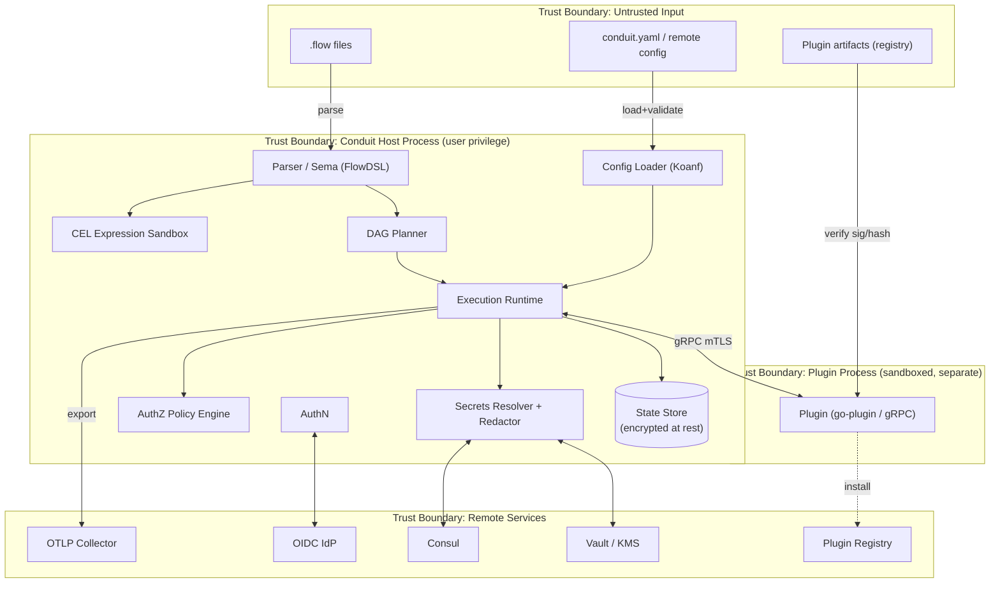
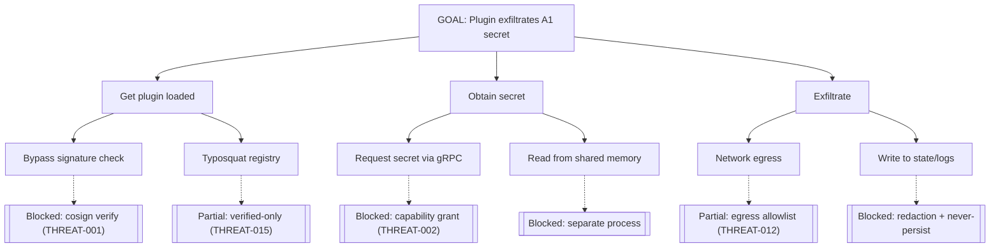
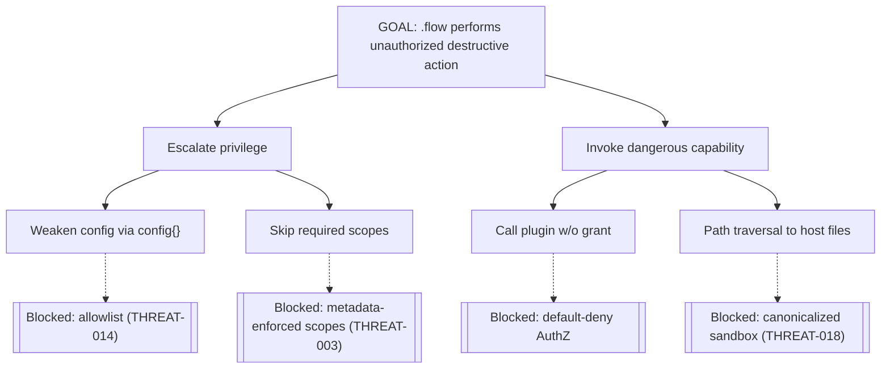
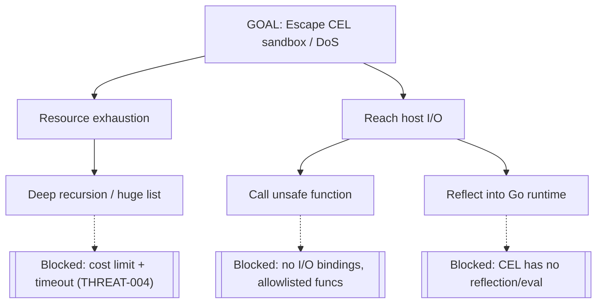
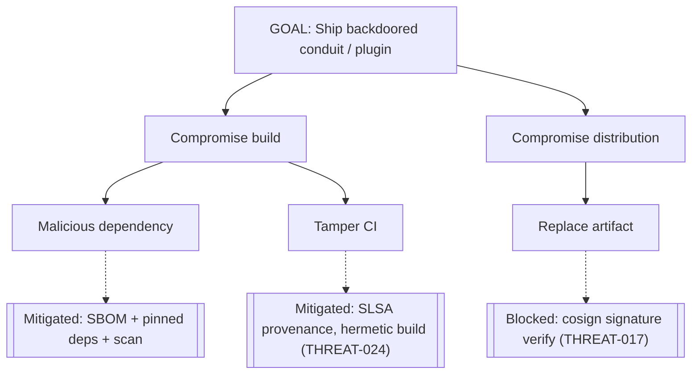

# Conduit — Threat Model (STRIDE)

> Document ID: `69-threat-model`
> Status: Draft (v0.1.0)
> Owner: Principal Security Architect
> Last updated: 2026-07-02

Related documents:
- [Security Requirements](05-security-requirements.md)
- [Configuration](60-configuration.md)
- [Secrets Management](61-secrets-management.md)
- [Authentication](62-authentication.md)
- [Authorization](63-authorization.md)
- [Plugin Architecture](40-plugin-architecture.md)
- [Expression Engine (CEL)](25-expression-engine.md)
- [Execution Runtime](31-execution-runtime.md)
- [Logging](65-logging.md)
- [Observability](64-observability.md)
- [Build / Release / CI-CD](81-build-release-cicd.md)

---

## 1. Scope & Methodology

This document is a **STRIDE** threat model of the Conduit platform. It decomposes the system, identifies trust boundaries and assets, enumerates threats (`THREAT-###`) classified by STRIDE with likelihood/impact/mitigation/status, provides attack trees for high-value scenarios, lists abuse cases, maps security controls, and records residual risk.

STRIDE categories: **S**poofing, **T**ampering, **R**epudiation, **I**nformation Disclosure, **D**enial of Service, **E**levation of Privilege.

Risk rating: Likelihood × Impact on a Low/Med/High scale; **Risk = ** the higher-weighted combination.

---

## 2. System Decomposition & Trust Boundaries (DFD)

**Trust boundaries crossed:**
1. Untrusted input (flows/config/plugin artifacts) → host process.
2. Host process ↔ plugin process (separate OS process, gRPC/mTLS).
3. Host process ↔ remote services (network, authenticated).
4. Host process ↔ local OS (filesystem, keychain, memory).

---

## 3. Asset Inventory

| Asset ID | Asset | Sensitivity | Notes |
|----------|-------|-------------|-------|
| A1 | Secrets (credentials, keys, tokens) | Critical | Resolved via [61](61-secrets-management.md); never persisted. |
| A2 | Run state & checkpoints | High | Encrypted at rest; may reference sensitive outputs. |
| A3 | Login tokens / refresh tokens | Critical | OS keychain ([62](62-authentication.md)). |
| A4 | State encryption keys (KEK/DEK) | Critical | KMS-backed. |
| A5 | Policies (roles/rules) | High | Integrity-critical; tampering = privilege escalation. |
| A6 | Plugin artifacts & manifests | High | Supply-chain; must be signed/verified. |
| A7 | Audit log stream | High | Integrity for non-repudiation. |
| A8 | Config (guardrails) | High | `enforced` keys must resist tampering. |
| A9 | Host process memory | Critical | Contains A1/A4 transiently. |
| A10 | Telemetry data | Low/Med | Privacy — must contain no PII/secrets ([66](66-telemetry.md)). |

---

## 4. Threat Register (STRIDE)

| THREAT | STRIDE | Asset | Description | Likelihood | Impact | Mitigation | Status |
|--------|--------|-------|-------------|-----------|--------|------------|--------|
| THREAT-001 | S/T/E | A6 | Malicious or forged plugin executes arbitrary code in host context | Med | High | Signature+hash verification pre-launch; `plugins.trust=verified-only`; out-of-process sandbox; capability grants | Mitigated |
| THREAT-002 | E/I | A1 | Plugin (confused deputy) requests secrets/actions beyond its grant | Med | High | Plugin authorized as its own [capability set](63-authorization.md); default-deny | Mitigated |
| THREAT-003 | T/E | A2 | Malicious `.flow` performs destructive/unauthorized actions | Med | High | Per-command [required scopes](63-authorization.md); dry-run; flow can't weaken posture ([60 §8](60-configuration.md)) | Mitigated |
| THREAT-004 | D/E | A9 | CEL expression sandbox escape or resource exhaustion | Low | High | CEL cost limits, timeouts, no I/O bindings, memory bounds ([25](25-expression-engine.md)) | Mitigated |
| THREAT-005 | I | A1 | Secret leaked into logs / stdout / telemetry | Med | Critical | [Redaction pipeline](61-secrets-management.md#5-redaction-pipeline) across all sinks; no free-text telemetry | Mitigated |
| THREAT-006 | I | A9 | Secret recovered from swap / core dump / heap | Low | High | `mlock`/`VirtualLock`, zeroing, `RLIMIT_CORE=0` | Partial (GC caveat) |
| THREAT-007 | S | A3 | Stolen login/refresh token replayed | Med | High | Keychain storage, short-lived tokens+refresh, revocation, `exp/nbf` | Mitigated |
| THREAT-008 | E | A5 | Policy tampering to escalate privilege | Low | High | Policy-as-code in git, PR review, signed remote push, `enforced` guardrails | Mitigated |
| THREAT-009 | R | A7 | Actor denies performing an action (repudiation) | Low | Med | Signed/append-only [audit stream](65-logging.md#8-audit-log-stream) with subject+trace correlation | Mitigated |
| THREAT-010 | T | A2/A4 | State tampering / rollback | Low | High | AEAD (AES-256-GCM) with run-ID AAD; integrity check on load | Mitigated |
| THREAT-011 | T/S | A8 | Malicious remote config injection weakens posture | Low | High | Signed HTTP config (JWS/cosign), authenticated Consul/Vault, `enforced` re-apply last | Mitigated |
| THREAT-012 | I | A1 | Secret exfiltration by task via network egress | Med | High | Plugin/task network capability grants; egress allowlist | Partial |
| THREAT-013 | D | — | Fork-bomb / resource exhaustion from runaway flow | Med | Med | Runtime resource limits, `maxParallel`, timeouts, cgroup where available | Mitigated |
| THREAT-014 | E | A8 | Flow `config{}` block disables security controls | Med | High | Allowlist blocks `auth.*`, `plugins.trust`, `state.encrypt*` ([60 §8](60-configuration.md)) | Mitigated |
| THREAT-015 | S | A6 | Typosquatting / dependency confusion in plugin registry | Med | Med | Namespaced verified publishers, pinning, `plugins.trust` | Partial |
| THREAT-016 | I | A10 | Telemetry inadvertently collects PII/paths/args | Low | Med | Off-by-default, schema allowlist (no args/paths/free-text), redaction backstop ([66](66-telemetry.md)) | Mitigated |
| THREAT-017 | T | A6 | MITM on plugin download / registry | Low | High | TLS + cosign verification of artifact independent of transport | Mitigated |
| THREAT-018 | E | A9 | Path traversal / symlink attack via flow file paths | Med | Med | Path canonicalization, sandboxed workdir, deny `..` escapes | Mitigated |
| THREAT-019 | D | A9 | Zip-bomb / billion-laughs in parsed inputs | Low | Med | Input size limits, depth limits, no entity expansion | Mitigated |
| THREAT-020 | I | A1 | Secret exfiltration via error messages / stack traces | Med | High | Redaction-aware error formatter ([61 §5](61-secrets-management.md)) | Mitigated |
| THREAT-021 | I | A9 | Secrets in crash dumps | Low | High | `RLIMIT_CORE=0`, no swap for secret buffers | Mitigated |
| THREAT-022 | S | A9 | Spoofed OTLP/collector endpoint captures telemetry | Low | Med | mTLS/OTLP auth, endpoint pinning | Partial |
| THREAT-023 | E | A9 | Malicious LSP/editor input drives host to execute | Low | Med | LSP is read-only analysis; no execution from editor path | Mitigated |
| THREAT-024 | T | A6 | Compromised build pipeline injects backdoor | Low | Critical | SLSA provenance, reproducible builds, SBOM, signed releases ([81](81-build-release-cicd.md)) | Mitigated |

---

## 5. Attack Trees

### 5.1 Malicious plugin → secret exfiltration

### 5.2 Malicious `.flow` → destructive action

### 5.3 CEL sandbox escape

### 5.4 Supply-chain compromise

---

## 6. Abuse Cases

| ID | Abuse case | Actor | Countermeasure |
|----|------------|-------|----------------|
| AB-1 | An AI agent uses its token to run unintended prod deploys | Compromised/misaligned agent | Narrow service-account scopes, deny rules, MFA-required-for-prod, audit ([63](63-authorization.md)) |
| AB-2 | Insider adds a plugin grant to harvest secrets | Malicious operator | Grants are policy-as-code (PR review), audited, `enforced` guardrails |
| AB-3 | Developer pastes a secret into a `.flow` | Careless user | `conduit secret scan` lint, config linter rejects raw high-entropy in secret keys |
| AB-4 | Attacker floods daemon with runs to exhaust resources | Remote attacker | AuthN required, rate limits, resource caps (THREAT-013) |
| AB-5 | Agent attempts to read logs to recover a secret | Agent | Redaction + `run:read` scope; audit stream separate |

---

## 7. Security Controls Mapping

| Control | Implements | Docs |
|---------|-----------|------|
| Signature/hash plugin verification | THREAT-001/017/024 | [40](40-plugin-architecture.md), [81](81-build-release-cicd.md) |
| Out-of-process plugin sandbox + mTLS | THREAT-001/006 | [40](40-plugin-architecture.md), [62 §6](62-authentication.md) |
| Capability grants (least privilege) | THREAT-002/012 | [63 §7](63-authorization.md) |
| Default-deny RBAC+ABAC | THREAT-003/008/014 | [63](63-authorization.md) |
| CEL cost/time/memory limits | THREAT-004/013/019 | [25](25-expression-engine.md) |
| Redaction pipeline | THREAT-005/020 | [61 §5](61-secrets-management.md) |
| Memory hygiene (mlock/zero/no-core) | THREAT-006/021 | [61 §6](61-secrets-management.md) |
| Keychain token storage + refresh | THREAT-007 | [62 §7](62-authentication.md) |
| Encrypted state (AEAD + KMS) | THREAT-010 | [61 §8](61-secrets-management.md), [32](32-state-management.md) |
| Signed/enforced remote config | THREAT-011 | [60 §9](60-configuration.md) |
| Signed append-only audit stream | THREAT-009 | [65 §8](65-logging.md) |
| SLSA/SBOM/reproducible builds | THREAT-024 | [81](81-build-release-cicd.md) |
| Off-by-default privacy-first telemetry | THREAT-016 | [66](66-telemetry.md) |

---

## 8. Residual Risk

| ID | Residual risk | Rationale | Owner action |
|----|---------------|-----------|--------------|
| RR-1 | Go GC may copy secret bytes on the heap despite `mlock`/zeroing (THREAT-006) | Language limitation; best-effort only | Track; consider off-heap secret store; document to users |
| RR-2 | Network egress exfiltration (THREAT-012) not fully preventable without host firewalling | Egress allowlist is advisory in local mode | Recommend OS/network-level egress controls in server mode |
| RR-3 | Typosquatting (THREAT-015) mitigated but not eliminated for public registries | Human trust decision remains | Encourage pinning + verified-only |
| RR-4 | OTLP collector trust (THREAT-022) depends on deployment | mTLS optional in local dev | Require OTLP auth in server mode |

Residual risks are tracked in the [Risk Register](97-risk-register.md).

---

## 9. Review Cadence

This model is reviewed at each minor release, on any new trust boundary (new provider, new plugin capability, new transport), and after any security incident. Threats trace to [SEC- requirements](05-security-requirements.md) and controls above.

---

## 10. Cross-References

- Security requirements: [05 — Security Requirements](05-security-requirements.md)
- Controls detail: [60](60-configuration.md), [61](61-secrets-management.md), [62](62-authentication.md), [63](63-authorization.md)
- Plugin isolation: [40 — Plugin Architecture](40-plugin-architecture.md)
- CEL sandbox: [25 — Expression Engine](25-expression-engine.md)
- Supply-chain: [81 — Build / Release / CI-CD](81-build-release-cicd.md)
- Risk register: [97 — Risk Register](97-risk-register.md)
