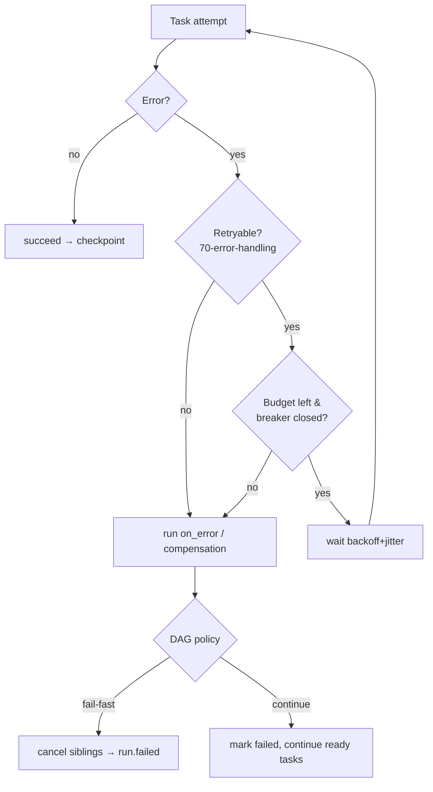

# Conduit — Recovery & Resilience Strategy

> Document ID: `71-recovery-strategy`
> Status: Draft (v0.1.0)
> Owner: Platform Architecture — Reliability & Quality
> Last updated: 2026-07-02

Related documents:
- [Error Handling Strategy](70-error-handling.md) — the taxonomy this document *acts on*
- [State Management Design](32-state-management.md) — checkpoint store & journal (tightly coupled)
- [Execution Runtime Design](31-execution-runtime.md) — where retries/timeouts live
- [Workflow DAG Design](30-workflow-dag.md) — fail-fast vs continue-on-error
- [Plugin Architecture](40-plugin-architecture.md) — plugin crash/restart
- [Event Model](67-event-model.md) — `run.checkpointed`, `task.retrying`, `plugin.crashed`
- [Internal Message Bus](68-message-bus.md) — drain-before-checkpoint

---

## 1. Overview

Where [70 — Error Handling](70-error-handling.md) *classifies* failures, this document defines how
Conduit *survives* them. The strategy layers: bounded **retries** with backoff/jitter, **circuit
breakers** protecting flaky plugins, **timeouts/deadlines** everywhere, durable **checkpoint/resume**
of runs, **idempotency keys**, saga-style **compensation/rollback**, **graceful degradation**,
**plugin crash recovery**, DAG **partial-failure** policy, **self-healing**, and **disaster
recovery** of the state store.

All resilience mechanisms key off the error taxonomy: only `CategoryTransient` (and explicitly
`Retryable` errors) are retried; everything else fails fast with its exit code.



---

## 2. Retries: Policy, Backoff, Jitter, Budgets

Retries are declared in FlowDSL per task and defaulted globally. The engine only retries errors for
which `IsRetryable()` (see [70 §3](70-error-handling.md)) is true.

```go
package resilience

// RetryPolicy governs how a unit of work is retried.
type RetryPolicy struct {
	MaxAttempts int           // total attempts incl. first (1 = no retry)
	BaseDelay   time.Duration // initial backoff
	MaxDelay    time.Duration // cap
	Multiplier  float64       // exponential factor, e.g. 2.0
	Jitter      JitterMode    // None | Full | Equal (AWS-style)
	Budget      *Budget       // optional shared retry budget (§2.2)
	RetryIf     func(error) bool // defaults to cerr.IsRetryable
}

type JitterMode int

const (
	JitterNone JitterMode = iota
	JitterFull            // sleep in [0, backoff)
	JitterEqual           // backoff/2 + rand[0, backoff/2)
)

// Backoff computes the delay before attempt n (1-based), applying jitter.
func (p RetryPolicy) Backoff(attempt int) time.Duration {
	d := float64(p.BaseDelay) * math.Pow(p.Multiplier, float64(attempt-1))
	d = math.Min(d, float64(p.MaxDelay))
	switch p.Jitter {
	case JitterFull:
		return time.Duration(rand.Int63n(int64(d) + 1))
	case JitterEqual:
		half := int64(d) / 2
		return time.Duration(half + rand.Int63n(half+1))
	default:
		return time.Duration(d)
	}
}
```

### 2.1 The retry driver

```go
// Do runs fn under the policy, honoring ctx cancellation/deadline and budget.
// It emits a task.retrying event (67-event-model) before each wait.
func (p RetryPolicy) Do(ctx context.Context, fn func() error) error {
	retryIf := p.RetryIf
	if retryIf == nil {
		retryIf = func(err error) bool { var ce *cerr.ConduitError; return errors.As(err, &ce) && ce.IsRetryable() }
	}
	var err error
	for attempt := 1; attempt <= p.MaxAttempts; attempt++ {
		if err = fn(); err == nil {
			return nil
		}
		if !retryIf(err) || attempt == p.MaxAttempts {
			return err
		}
		if p.Budget != nil && !p.Budget.Allow() {
			return fmt.Errorf("retry budget exhausted: %w", err)
		}
		delay := p.Backoff(attempt)
		select {
		case <-time.After(delay):
		case <-ctx.Done():
			return errors.Join(err, ctx.Err())
		}
	}
	return err
}
```

### 2.2 Retry budgets

Unbounded retries amplify outages (retry storms). A **budget** is a token bucket capping the *rate*
of retries relative to successful work (e.g. "retries ≤ 20% of requests"), shared across all tasks in
a run so one flaky dependency can't saturate the system.

```go
type Budget struct {
	mu       sync.Mutex
	tokens   float64
	ratio    float64 // retries permitted per success, e.g. 0.2
	max      float64
}

func (b *Budget) OnSuccess() { b.mu.Lock(); b.tokens = math.Min(b.max, b.tokens+b.ratio); b.mu.Unlock() }
func (b *Budget) Allow() bool {
	b.mu.Lock(); defer b.mu.Unlock()
	if b.tokens >= 1 { b.tokens--; return true }
	return false
}
```

---

## 3. Circuit Breakers for Plugins

Each plugin instance is fronted by a circuit breaker so a persistently failing plugin is quarantined
instead of retried into the ground. Breaker transitions publish `plugin.health_changed`
([67 — Event Model](67-event-model.md)).

```go
type BreakerState int

const (
	Closed   BreakerState = iota // normal
	Open                         // fail fast, no calls
	HalfOpen                     // probe with limited calls
)

type CircuitBreaker struct {
	mu               sync.Mutex
	state            BreakerState
	failures         int
	failureThreshold int           // consecutive failures → Open
	openTimeout      time.Duration // Open → HalfOpen after this
	halfOpenMax      int           // probes allowed in HalfOpen
	openedAt         time.Time
}

// Call runs fn unless the breaker is Open. Returns cerr.ErrBreakerOpen when tripped.
func (cb *CircuitBreaker) Call(ctx context.Context, fn func() error) error {
	if !cb.allow() {
		return cerr.ErrBreakerOpen // transient → not retried while open
	}
	err := fn()
	cb.record(err == nil)
	return err
}

func (cb *CircuitBreaker) allow() bool {
	cb.mu.Lock(); defer cb.mu.Unlock()
	if cb.state == Open && time.Since(cb.openedAt) > cb.openTimeout {
		cb.state = HalfOpen // probe
	}
	return cb.state != Open
}
```

`ErrBreakerOpen` is transient but *not immediately retried* — the breaker's `openTimeout` is the
backoff. Only after `HalfOpen` probes succeed does traffic resume (`Open → HalfOpen → Closed`).

---

## 4. Timeouts & Deadlines

Every layer is bounded by a `context.Context` deadline; there are **no unbounded waits** on the
execution path.

| Scope | Default | Source |
|---|---|---|
| Whole run | none (opt-in) | `flow.timeout` |
| Per task | 5m | `task.timeout`, overridable |
| Per step | inherits task | step exec |
| Plugin RPC call | 30s | plugin client config |
| State store op | 10s | store client |

```go
// withDeadline derives the effective deadline as the min of run/task/step budgets.
func withDeadline(ctx context.Context, budgets ...time.Duration) (context.Context, context.CancelFunc) {
	d := time.Duration(math.MaxInt64)
	for _, b := range budgets {
		if b > 0 && b < d {
			d = b
		}
	}
	return context.WithTimeout(ctx, d)
}
```

A deadline breach produces `cerr.ErrTimeout` (`CONDUIT-E7501`, transient), which flows into the retry
driver (§2). Cancellation propagates down the DAG so no orphaned goroutines linger.

---

## 5. Checkpoint / Resume of Workflow Runs

Durability is delegated to the [State Management](32-state-management.md) store; this section defines
*when* and *what* we checkpoint. A checkpoint captures the run's completed-task set, their outputs,
and the scheduler frontier, keyed by `runid`. Resume replays from the last checkpoint, re-executing
only unfinished tasks.

```go
// Checkpointer persists and restores run progress. Backed by the state store
// (32-state-management.md); the event journal is the write-ahead log.
type Checkpointer interface {
	// Save records a consistent snapshot after a task settles. Idempotent by
	// (runID, sequence) so a redelivered event never double-writes.
	Save(ctx context.Context, cp Checkpoint) error
	// Load returns the latest checkpoint for a run, or ErrNotFound.
	Load(ctx context.Context, runID string) (Checkpoint, error)
}

type Checkpoint struct {
	RunID          string
	Sequence       uint64            // last applied event sequence (67-event-model §5)
	CompletedTasks map[string]TaskResult
	Frontier       []string          // ready-but-not-started task ids
	CreatedAt      time.Time
}
```

**Ordering with the bus.** On shutdown the runtime first drains the message bus
([68 §6](68-message-bus.md)) so the state journal has consumed every emitted event, *then* writes the
final checkpoint. This guarantees the checkpoint's `Sequence` never precedes durably-journaled
events. On restart, `conduit run --resume <runID>` loads the checkpoint, emits `run.resumed`, and the
scheduler seeds itself from `CompletedTasks` + `Frontier`.

---

## 6. Idempotency Keys

To make retries and resume safe against side-effecting steps, each task attempt carries a stable
**idempotency key** `= hash(runID, taskID, attemptInputsDigest)`. Plugins receive it and MAY use it
to dedupe external effects (e.g. "create resource" is a no-op if the key was already processed).

```go
// IdempotencyKey is deterministic for a given (run, task, inputs) so a retried
// or resumed attempt reuses the same key and downstream systems can dedupe.
func IdempotencyKey(runID, taskID string, inputs map[string]any) string {
	h := sha256.New()
	io.WriteString(h, runID+"\x00"+taskID+"\x00")
	_ = json.NewEncoder(h).Encode(canonicalize(inputs)) // stable field order
	return "idem_" + hex.EncodeToString(h.Sum(nil))[:24]
}
```

The key is passed to plugins via request metadata and recorded in the checkpoint so resume reuses it.

---

## 7. Compensation / Rollback (`on_error`, Saga)

FlowDSL supports `on_error` handlers and saga-style compensation: when a task fails and cannot be
retried, previously-succeeded tasks in the same *saga scope* run their compensating actions in
reverse dependency order, achieving eventual consistency without distributed transactions.

```go
// Compensable pairs a forward action with its compensation.
type Compensable struct {
	Task       string
	Compensate func(ctx context.Context) error // undo the forward effect
}

// Saga executes compensations in reverse order of completion.
type Saga struct{ done []Compensable } // pushed as forward tasks succeed

func (s *Saga) Push(c Compensable) { s.done = append(s.done, c) }

func (s *Saga) Rollback(ctx context.Context) error {
	var errs []error
	for i := len(s.done) - 1; i >= 0; i-- {
		if err := s.done[i].Compensate(ctx); err != nil {
			errs = append(errs, fmt.Errorf("compensate %s: %w", s.done[i].Task, err))
			// continue rolling back best-effort; aggregate failures
		}
	}
	return errors.Join(errs...)
}
```

Each compensation emits `task.compensated` ([67 — Event Model](67-event-model.md)). Compensations
should themselves be idempotent (they reuse §6 keys) since rollback may itself be retried.

---

## 8. Graceful Degradation

When a non-critical dependency is unavailable, Conduit degrades rather than aborts:

- **Optional tasks** (`continue_on_error: true` / `optional: true`) fail soft; downstream tasks that
  don't depend on their outputs proceed.
- **Fallback values** via CEL `default(...)` let a flow substitute a cached/last-known value when a
  provider is down.
- **Feature de-scoping**: observability export failures never fail a run — telemetry is best-effort
  ([68 §5.2](68-message-bus.md)); the run continues and logs a warning.

---

## 9. Plugin Crash Recovery & Restart

Plugins run out-of-process ([go-plugin/gRPC](40-plugin-architecture.md)), so a plugin crash is a
contained, observable event, not a process death. The plugin manager supervises with a restart policy
guarded by the §3 circuit breaker.

```go
// PluginSupervisor restarts crashed plugins with capped, backed-off restarts.
type PluginSupervisor struct {
	restart RetryPolicy      // capped restart attempts with backoff
	breaker *CircuitBreaker  // trips on repeated crashes → surface ErrBreakerOpen
}

func (s *PluginSupervisor) Ensure(ctx context.Context, p PluginRef) (Client, error) {
	var client Client
	err := s.restart.Do(ctx, func() error {
		return s.breaker.Call(ctx, func() error {
			c, err := dial(ctx, p) // handshake; emits plugin.loaded on success
			if err != nil {
				return fmt.Errorf("%w: %v", cerr.ErrPluginCrashed, err)
			}
			client = c
			return nil
		})
	})
	return client, err
}
```

On crash mid-task, the in-flight task fails with `ErrPluginCrashed` (transient) and is retried per
§2; because plugins receive an idempotency key (§6), a re-executed effect is deduped. A crash emits
`plugin.crashed`, restart emits `plugin.loaded`.

---

## 10. Partial-Failure Handling in DAG Runs

The DAG scheduler ([30 — Workflow DAG](30-workflow-dag.md)) supports two failure policies, selectable
per flow and per subgraph:

| Policy | Behavior on a task's terminal failure |
|---|---|
| **Fail-fast** (default) | Cancel in-flight siblings (ctx cancel), skip un-started tasks, run compensations, emit `run.failed`. |
| **Continue-on-error** | Mark the task failed, skip only its dependents, keep scheduling independent ready tasks; aggregate into a `RunError` ([70 §9](70-error-handling.md)). |

```go
type FailurePolicy int

const (
	FailFast FailurePolicy = iota
	ContinueOnError
)

// onTaskFailed applies the policy and returns whether scheduling continues.
func (r *Run) onTaskFailed(t *Task, err *cerr.ConduitError) (keepGoing bool) {
	r.runErr.Add(TaskFailure{Task: t.Name, Err: err})
	switch r.policy {
	case FailFast:
		r.cancel() // cancels sibling contexts
		return false
	case ContinueOnError:
		r.skipDependents(t) // only downstream of t is skipped
		return true
	}
	return false
}
```

---

## 11. Self-Healing

- **Automatic plugin restart** (§9) with breaker-protected backoff.
- **Retry with budgets** (§2) recovers from transient blips without human action.
- **Health probes**: the supervisor periodically pings plugins; an unhealthy plugin is drained and
  respawned before the next task needs it.
- **Checkpoint auto-resume**: server mode ([73 — Performance & Scalability](73-performance-scalability.md))
  can auto-resume interrupted runs from their last checkpoint on process restart.

---

## 12. Disaster Recovery of the State Store

The state store is the durability root; its DR is defined jointly with
[32 — State Management](32-state-management.md).

- **Write-ahead journal.** The event journal ([67 — Event Model](67-event-model.md)) is append-only
  and is the WAL: a checkpoint can always be *reconstructed* by replaying journaled events up to a
  `sequence`, so a corrupted checkpoint is recoverable.
- **Backups & snapshots.** Pluggable backends (embedded BoltDB local; SQL/object-store in server
  mode) support periodic snapshots + journal shipping to a durable object store.
- **RPO/RTO targets.** Local: RPO = last settled task (checkpoint-per-task); RTO = process restart +
  resume. Server: RPO ≤ journal-ship interval (default 60s); RTO = failover to standby + replay.
- **Integrity.** Journal records are checksummed; on load, a checksum mismatch triggers replay from
  the last verified checkpoint rather than trusting corrupt state.

```go
// Recover rebuilds a checkpoint by replaying the journal from the last good snapshot.
func Recover(ctx context.Context, j Journal, store CheckpointStore, runID string) (Checkpoint, error) {
	base, err := store.LastGood(ctx, runID) // last checksum-verified checkpoint
	if err != nil {
		return Checkpoint{}, err
	}
	cp := base
	err = j.Replay(ctx, runID, base.Sequence, func(e events.Event) error {
		apply(&cp, e) // deterministic fold of events into checkpoint state
		return nil
	})
	return cp, err
}
```

---

## 13. Cross-References

- Error classification & `IsRetryable`: [70 — Error Handling Strategy](70-error-handling.md).
- Checkpoint store, journal, backends, snapshots: [32 — State Management](32-state-management.md).
- Where retries/timeouts execute: [31 — Execution Runtime](31-execution-runtime.md).
- DAG scheduling & policies: [30 — Workflow DAG](30-workflow-dag.md).
- Plugin isolation & lifecycle: [40 — Plugin Architecture](40-plugin-architecture.md).
- Resilience events: [67 — Event Model](67-event-model.md); drain ordering: [68 — Message Bus §6](68-message-bus.md).
