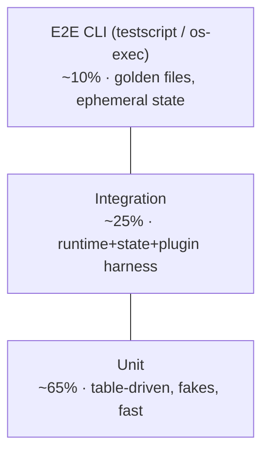

# Conduit — Testing Strategy (Unit / Integration / Plugin / DSL)

> Document ID: `72-testing-strategy`
> Status: Draft (v0.1.0)
> Owner: Platform Architecture — Reliability & Quality
> Last updated: 2026-07-02

Related documents:
- [Error Handling Strategy](70-error-handling.md) · [Recovery Strategy](71-recovery-strategy.md)
- [DSL Grammar](20-dsl-grammar.md) · [Parser Design](22-parser-design.md) · [AST Design](23-ast-design.md) · [Semantic Analysis](24-semantic-analysis.md) · [Expression Engine (CEL)](25-expression-engine.md)
- [Plugin Architecture](40-plugin-architecture.md) · [Extension SDK](41-extension-sdk.md)
- [Build / Release / CI-CD](81-build-release-cicd.md)
- [Repository Structure](80-repository-structure.md)
- [Performance & Scalability](73-performance-scalability.md) — benchmarks are a test class

Toolchain (canonical): Go 1.24 stdlib `testing` + **testify** (assert/require/mock) + **gotestsum**
(readable output, JUnit XML for CI), native fuzzing (`go test -fuzz`), `-race`, `testscript` for CLI
E2E, `benchstat` for benchmarks.

---

## H2 sections at a glance

This document covers, in order: the **Testing** pyramid & coverage gates, **Unit** strategy,
**Integration** strategy, **Plugin** strategy, **DSL** strategy, then property-based testing,
mutation testing, fuzzing, the race detector, CI gates, and the flaky-test policy.

---

## 1. Testing Pyramid & Coverage Targets



| Layer | Share | Speed | Runs on |
|---|---|---|---|
| Unit | ~65% | ms | every push, pre-commit |
| Integration | ~25% | 100ms–1s | every push |
| E2E / CLI | ~10% | 1–10s | every push (nightly full matrix) |

**Coverage targets** (enforced in CI, §10):

| Scope | Line coverage gate |
|---|---|
| Overall module | ≥ 80% |
| DSL front-end (`internal/dsl/...`) | ≥ 90% |
| Runtime & state (`internal/runtime`, `internal/state`) | ≥ 85% |
| Error/recovery (`internal/cerr`, `internal/resilience`) | ≥ 90% |
| Plugin protocol (`internal/plugin`) | ≥ 85% |

Coverage is a *floor with a diff-gate*: a PR may not lower package coverage. We measure with
`go test -covermode=atomic -coverpkg=./...` and report via `go tool cover` + Codecov.

---

## 2. UNIT Test Strategy

Unit tests are **table-driven**, **fast**, **deterministic**, and use **fakes** (hand-written) over
heavyweight mocks where practical. Every exported behavior and every error branch is covered.

### 2.1 Table-driven pattern

```go
func TestCategory_Retryable(t *testing.T) {
	tests := []struct {
		name string
		cat  cerr.Category
		want bool
	}{
		{"transient is retryable", cerr.CategoryTransient, true},
		{"user is not", cerr.CategoryUser, false},
		{"plugin is not by default", cerr.CategoryPlugin, false},
	}
	for _, tt := range tests {
		t.Run(tt.name, func(t *testing.T) {
			t.Parallel()
			require.Equal(t, tt.want, tt.cat.Retryable())
		})
	}
}
```

### 2.2 Fakes over mocks

Prefer small hand-written fakes that satisfy an interface. Reserve testify mocks for verifying
interaction ordering.

```go
// fakeCheckpointer is an in-memory Checkpointer for runtime unit tests.
type fakeCheckpointer struct {
	mu    sync.Mutex
	saved map[string]resilience.Checkpoint
}

func (f *fakeCheckpointer) Save(_ context.Context, cp resilience.Checkpoint) error {
	f.mu.Lock(); defer f.mu.Unlock()
	f.saved[cp.RunID] = cp
	return nil
}
func (f *fakeCheckpointer) Load(_ context.Context, runID string) (resilience.Checkpoint, error) {
	f.mu.Lock(); defer f.mu.Unlock()
	cp, ok := f.saved[runID]
	if !ok { return resilience.Checkpoint{}, cerr.ErrNotFound }
	return cp, nil
}
```

### 2.3 Testing error branches with `errors.Is/As`

```go
func TestRetry_StopsOnNonRetryable(t *testing.T) {
	p := resilience.RetryPolicy{MaxAttempts: 5, BaseDelay: time.Millisecond}
	calls := 0
	err := p.Do(context.Background(), func() error {
		calls++
		return cerr.ErrInvalidInput // user category, not retryable
	})
	require.ErrorIs(t, err, cerr.ErrInvalidInput)
	require.Equal(t, 1, calls, "must not retry non-retryable errors")
}
```

**Coverage gate for unit** is enforced per-package (§1). Unit tests MUST run under `-race` (§9) and
MUST be `t.Parallel()`-safe.

---

## 3. INTEGRATION Test Strategy

Integration tests exercise real component wiring — runtime + state + message bus + in-process plugin
harness — but stay in-process where possible, and drive the CLI end-to-end via `testscript` and
`os/exec` where full-binary behavior matters. State is **ephemeral** (temp dir per test) and outputs
compare against **golden files**.

### 3.1 End-to-end CLI via `testscript`

`rogpeppe/go-internal/testscript` runs table-of-contents `.txtar` scripts that invoke the real
`conduit` binary in a sandboxed temp dir — ideal for exit codes, stdout/stderr, and file effects.

```go
func TestMain(m *testing.M) {
	os.Exit(testscript.RunMain(m, map[string]func() int{
		"conduit": func() int { return cmd.Main() }, // in-proc entrypoint
	}))
}

func TestCLIScripts(t *testing.T) {
	testscript.Run(t, testscript.Params{
		Dir:         "testdata/scripts", // *.txtar
		UpdateScripts: *update,          // -update regenerates golden output
	})
}
```

`testdata/scripts/run_ok.txtar`:

```txt
# a successful flow run exits 0 and writes an artifact
exec conduit run hello.flow --output json
stdout '"status":"succeeded"'
! stderr .
exists out/result.txt

-- hello.flow --
flow "hello" {
  task "greet" { run = "echo hi > out/result.txt" }
}
```

### 3.2 Golden files

```go
func TestRender_Golden(t *testing.T) {
	got := renderDiagnostic(sampleDiag())
	golden := filepath.Join("testdata", t.Name()+".golden")
	if *update {
		require.NoError(t, os.WriteFile(golden, []byte(got), 0o644))
	}
	want, err := os.ReadFile(golden)
	require.NoError(t, err)
	require.Equal(t, string(want), got)
}
```

### 3.3 Ephemeral state

```go
func newEphemeralState(t *testing.T) state.Store {
	t.Helper()
	dir := t.TempDir() // auto-cleaned
	s, err := state.OpenBolt(filepath.Join(dir, "state.db"))
	require.NoError(t, err)
	t.Cleanup(func() { _ = s.Close() })
	return s
}
```

Integration tests assert cross-cutting behavior from [71 — Recovery Strategy](71-recovery-strategy.md):
checkpoint/resume round-trips, retry-then-succeed, continue-on-error aggregation.

---

## 4. PLUGIN Test Strategy

Plugins ([go-plugin/gRPC](40-plugin-architecture.md)) are tested three ways: an **in-process
harness** (fast), **contract tests** against the gRPC protocol (correctness), and a
**version-compatibility matrix** (interop over time).

### 4.1 In-process test harness

The harness serves the plugin's gRPC implementation over an in-memory `bufconn` listener, so tests
exercise the real protocol without spawning a subprocess.

```go
// serveInProc wires a plugin impl to an in-memory gRPC channel for testing.
func serveInProc(t *testing.T, impl plugin.ActionServer) plugin.ActionClient {
	t.Helper()
	lis := bufconn.Listen(1 << 20)
	srv := grpc.NewServer()
	plugin.RegisterActionServer(srv, impl)
	go func() { _ = srv.Serve(lis) }()
	t.Cleanup(srv.Stop)

	conn, err := grpc.DialContext(context.Background(), "bufnet",
		grpc.WithContextDialer(func(context.Context, string) (net.Conn, error) { return lis.Dial() }),
		grpc.WithTransportCredentials(insecure.NewCredentials()))
	require.NoError(t, err)
	t.Cleanup(func() { _ = conn.Close() })
	return plugin.NewActionClient(conn)
}
```

### 4.2 Contract tests (shared conformance suite)

A single exported suite runs against *any* plugin implementation to prove protocol conformance —
handshake, idempotency-key echo, error mapping, streaming logs, cancellation.

```go
// PluginContract runs the shared conformance suite against a client.
// First-party and third-party plugins import and call this.
func PluginContract(t *testing.T, client plugin.ActionClient) {
	t.Run("handshake reports version", func(t *testing.T) {
		info, err := client.Info(context.Background(), &plugin.Empty{})
		require.NoError(t, err)
		require.NotEmpty(t, info.Version)
		require.GreaterOrEqual(t, int(info.Protocol), plugin.MinProtocol)
	})
	t.Run("honors idempotency key", func(t *testing.T) { /* call twice, assert single effect */ })
	t.Run("maps failure to CONDUIT-Exxxx", func(t *testing.T) {
		_, err := client.Execute(context.Background(), &plugin.Request{Input: badInput()})
		st, _ := status.FromError(err)
		require.Contains(t, st.Message(), "CONDUIT-E") // 70-error-handling mapping
	})
	t.Run("cancellation is prompt", func(t *testing.T) { /* ctx cancel → Canceled within budget */ })
}
```

### 4.3 Version-compatibility matrix

A matrix test asserts each supported protocol version handshakes and rejects unsupported ones with
`CONDUIT-E5004`.

```go
func TestProtocolMatrix(t *testing.T) {
	for _, proto := range []int{plugin.MinProtocol, plugin.MinProtocol + 1, plugin.CurrentProtocol} {
		t.Run(fmt.Sprintf("proto_%d", proto), func(t *testing.T) {
			c := serveInProc(t, fakePlugin{protocol: proto})
			PluginContract(t, c)
		})
	}
	t.Run("rejects too-old", func(t *testing.T) {
		_, err := plugin.Negotiate(context.Background(), fakePlugin{protocol: plugin.MinProtocol - 1})
		require.ErrorContains(t, err, "CONDUIT-E5004")
	})
}
```

---

## 5. DSL Test Strategy

The FlowDSL front-end is the highest-coverage area (≥90%). It is tested with a **grammar corpus**,
**parser fuzzing**, **golden diagnostics** for semantic analysis, **CEL evaluation** tests, and
**round-trip formatter/snapshot** tests.

### 5.1 Grammar corpus tests

A directory of `.flow` files (valid and intentionally invalid) is parsed; valid files must parse
clean, invalid files must produce the expected `CONDUIT-Exxxx` code.

```go
func TestGrammarCorpus(t *testing.T) {
	files, _ := filepath.Glob("testdata/corpus/*.flow")
	for _, f := range files {
		f := f
		t.Run(filepath.Base(f), func(t *testing.T) {
			t.Parallel()
			src, _ := os.ReadFile(f)
			_, diags := dsl.Parse(f, src)
			wantErr := strings.HasPrefix(filepath.Base(f), "invalid_")
			require.Equal(t, wantErr, diags.HasErrors(), "corpus expectation mismatch")
		})
	}
}
```

### 5.2 Parser fuzzing (native `go test -fuzz`)

Fuzzing hardens the [parser](22-parser-design.md) against panics on arbitrary input. The invariant:
the parser must return diagnostics, never panic, on any byte sequence.

```go
func FuzzParse(f *testing.F) {
	for _, seed := range mustGlob("testdata/corpus/*.flow") {
		b, _ := os.ReadFile(seed)
		f.Add(string(b)) // seed corpus
	}
	f.Fuzz(func(t *testing.T, src string) {
		// Must not panic; result may be errors. Round-trip: re-parsing the
		// formatted output of a successful parse must be stable (§5.5).
		_, _ = dsl.Parse("fuzz.flow", []byte(src))
	})
}
```

Run in CI with a time budget: `go test -run=^$ -fuzz=FuzzParse -fuzztime=60s ./internal/dsl/...`;
regressions are committed to `testdata/fuzz/`.

### 5.3 Semantic-analysis golden diagnostics

[Semantic analysis](24-semantic-analysis.md) output (typed diagnostics with spans, §5 of
[70](70-error-handling.md)) is snapshotted so any change in wording/span is a reviewed diff.

```go
func TestSemaDiagnostics_Golden(t *testing.T) {
	files, _ := filepath.Glob("testdata/sema/*.flow")
	for _, f := range files {
		t.Run(filepath.Base(f), func(t *testing.T) {
			src, _ := os.ReadFile(f)
			ast, _ := dsl.Parse(f, src)
			diags := dsl.Analyze(ast)
			assertGolden(t, f+".diags.golden", diags.Render()) // -update to refresh
		})
	}
}
```

### 5.4 CEL evaluation tests

[CEL-Go expressions](25-expression-engine.md) are tested for value correctness, type errors, and
**cost/sandbox limits** (a guard against resource-exhaustion, per the threat model).

```go
func TestCEL_Eval(t *testing.T) {
	tests := []struct {
		expr string
		env  map[string]any
		want any
		err  string
	}{
		{`inputs.n * 2`, map[string]any{"inputs": map[string]any{"n": 21}}, int64(42), ""},
		{`default(inputs.missing, "fallback")`, map[string]any{"inputs": map[string]any{}}, "fallback", ""},
		{`1 / 0`, nil, nil, "division by zero"},
	}
	for _, tt := range tests {
		t.Run(tt.expr, func(t *testing.T) {
			got, err := cel.Eval(tt.expr, tt.env)
			if tt.err != "" { require.ErrorContains(t, err, tt.err); return }
			require.NoError(t, err)
			require.Equal(t, tt.want, got)
		})
	}
}

func TestCEL_CostLimitEnforced(t *testing.T) {
	_, err := cel.EvalWithLimit(`[0,1,2].map(x, [0,1,2].map(y, x*y))`, nil, cel.CostLimit(10))
	require.ErrorContains(t, err, "cost limit") // sandbox guard
}
```

### 5.5 Snapshot / round-trip formatter tests

The formatter must be idempotent: `format(format(x)) == format(x)`, and parsing formatted output must
reproduce an equivalent AST.

```go
func TestFormatter_RoundTrip(t *testing.T) {
	files, _ := filepath.Glob("testdata/corpus/valid_*.flow")
	for _, f := range files {
		t.Run(filepath.Base(f), func(t *testing.T) {
			src, _ := os.ReadFile(f)
			once := dsl.Format(src)
			twice := dsl.Format(once)
			require.Equal(t, string(once), string(twice), "formatter must be idempotent")

			a1, _ := dsl.Parse(f, once)
			a2, _ := dsl.Parse(f, src)
			require.True(t, dsl.ASTEqual(a1, a2), "format must preserve semantics")
		})
	}
}
```

---

## 6. Property-Based Testing

For algorithmic cores (DAG toposort, backoff monotonicity, canonical JSON) we assert *properties*
over generated inputs using `testing/quick` (or `pgregory.net/rapid` for richer generators).

```go
func TestToposort_RespectsDependencies(t *testing.T) {
	f := func(seed int64) bool {
		g := randDAG(seed)               // generated acyclic graph
		order, err := dag.Toposort(g)
		if err != nil { return false }
		return dag.IsValidOrder(g, order) // every dep precedes its dependent
	}
	require.NoError(t, quick.Check(f, &quick.Config{MaxCount: 500}))
}

func TestBackoff_MonotonicUntilCap(t *testing.T) {
	f := func(a uint8) bool {
		p := resilience.RetryPolicy{BaseDelay: time.Millisecond, MaxDelay: time.Second, Multiplier: 2}
		n := int(a%10) + 1
		return p.Backoff(n) <= p.MaxDelay // capped; with JitterNone also non-decreasing
	}
	require.NoError(t, quick.Check(f, nil))
}
```

---

## 7. Mutation Testing

We run **mutation testing** (`go-mutesting` / `gremlins`) on the highest-value packages (cerr,
resilience, dsl/sema) to detect assertions that pass regardless of the code. A minimum **mutation
score** (killed / total) of **70%** is tracked (advisory gate initially, blocking for
`internal/resilience`). Run on a nightly job, not per-PR, because it is expensive.

```bash
gremlins unleash ./internal/resilience/... --threshold-efficacy 70
```

---

## 8. Fuzzing (beyond the parser)

Native fuzzing also targets: the CEL parser/evaluator (`FuzzCEL`), the event envelope
JSON round-trip (`FuzzEnvelope` — marshal∘unmarshal is identity), and the config loader
(`FuzzConfigMerge`). All fuzz targets run a short budget per-PR and a long budget nightly; crashers
are auto-committed to `testdata/fuzz/` and become permanent regression cases.

```go
func FuzzEnvelope(f *testing.F) {
	f.Fuzz(func(t *testing.T, b []byte) {
		var e events.Envelope
		if json.Unmarshal(b, &e) != nil { return }
		out, err := json.Marshal(e)
		require.NoError(t, err)
		var back events.Envelope
		require.NoError(t, json.Unmarshal(out, &back))
		require.Equal(t, e, back) // round-trip identity
	})
}
```

---

## 9. Race Detector

**All** unit and integration tests run under `-race` in CI. The runtime, message bus
([68 — Message Bus](68-message-bus.md)), and plugin manager are concurrency-heavy, so the race
detector is a first-class gate, not an afterthought.

```bash
gotestsum --format testname -- -race -count=1 ./...
```

Concurrency-focused tests deliberately stress fan-out and shutdown:

```go
func TestBus_ConcurrentPublishDrain(t *testing.T) {
	b := bus.New(events.NewSequencer())
	var got atomic.Int64
	_, _ = b.Subscribe("task", subFunc(func(context.Context, events.Event) error {
		got.Add(1); return nil
	}), bus.WithMode(bus.AsyncReliable))

	var wg sync.WaitGroup
	for i := 0; i < 100; i++ {
		wg.Add(1)
		go func(i int) { defer wg.Done(); _ = b.Publish(context.Background(), taskEvent(i)) }(i)
	}
	wg.Wait()
	require.NoError(t, b.Close(context.Background())) // drains
	require.Equal(t, int64(100), got.Load())
}
```

---

## 10. CI Gates

The [CI pipeline](81-build-release-cicd.md) enforces, in order, and **blocks merge** on failure:

1. `gofmt`/`goimports` clean, `go vet`, `staticcheck`, `golangci-lint`.
2. `go build ./...` on the OS/arch matrix (linux/macos/windows × amd64/arm64).
3. **Unit + integration under `-race`** via `gotestsum` (JUnit XML uploaded).
4. **Coverage gate**: overall ≥ 80%, per-package floors (§1), no diff-decrease.
5. **Plugin contract + protocol matrix** (§4).
6. **DSL corpus + golden diagnostics + round-trip** (§5); short fuzz budget (§2.2, §8).
7. **Benchmark regression check** via `benchstat` against baseline (see
   [73 — Performance & Scalability](73-performance-scalability.md)); >10% regression fails.
8. E2E `testscript` suite.

Nightly (non-blocking-but-tracked): long fuzz, mutation testing, full OS/arch E2E matrix,
soak/load tests.

---

## 11. Flaky-Test Policy

- **Zero-tolerance for silent flakes.** A test that fails intermittently is quarantined within one
  business day via a `//go:build flaky` tag / `t.Skip` with a tracking issue (`TD-###`, see
  [98 — Tech Debt Register](98-tech-debt-register.md)) — never left to erode trust in CI.
- **Detection.** CI runs `-count=2` on a random 10% subset and a nightly `-count=10` stress job;
  tests failing non-deterministically are auto-flagged.
- **Root-cause required.** Quarantine is temporary; the owning team must fix (usually: unsynchronized
  goroutines, real clocks, ordering assumptions on best-effort delivery) and de-quarantine within the
  sprint. Repeated re-quarantine escalates.
- **No `time.Sleep` for synchronization.** Tests use channels, `sync.WaitGroup`, or fake clocks;
  wall-clock sleeps are a review-blocker.

---

## 12. Cross-References

- Error taxonomy and codes asserted in tests: [70 — Error Handling](70-error-handling.md).
- Resilience behaviors under integration test: [71 — Recovery Strategy](71-recovery-strategy.md).
- DSL components under test: [20](20-dsl-grammar.md)–[25](25-expression-engine.md).
- Plugin protocol under contract test: [40 — Plugin Architecture](40-plugin-architecture.md).
- Benchmarking as a test class + regression gate: [73 — Performance & Scalability](73-performance-scalability.md).
