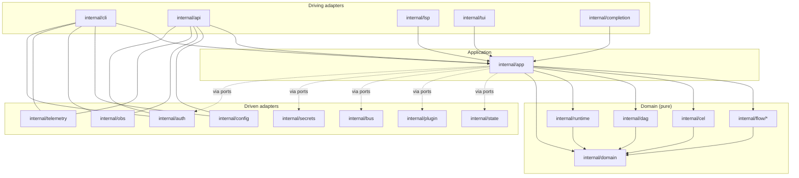

# 80 — Reference Repository Structure / Module / Package Layout

> **Platform:** Conduit · **Binary:** `conduit` (alias `cdt`) · **Module:** `github.com/conduit-io/conduit`
> **Go:** 1.24+ · **Status:** Architecture Baseline v1.0 · **Owner:** Platform Architecture · **Date:** 2026-07-02

**Related documents:** [10 — Platform Architecture](10-platform-architecture.md) · [11 — Component Architecture](11-component-architecture.md) · [40 — Plugin Architecture](40-plugin-architecture.md) · [41 — Extension SDK](41-extension-sdk.md) · [44 — Public SDK](44-public-sdk.md) · [58 — Tree-sitter Grammar](58-tree-sitter-grammar.md) · [57 — VS Code Extension](57-vscode-extension.md) · [81 — Build/Release/CI-CD](81-build-release-cicd.md) · [82 — Developer Experience](82-developer-experience.md) · [83 — API Standards & Versioning](83-api-standards-versioning.md) · [99 — ADRs](99-adrs.md)

---

## 1. Purpose & Scope

This document is the **authoritative reference** for how the Conduit repository is laid out at three levels:

1. **Repository structure** — the top-level directory tree and what each directory is for.
2. **Module layout** — how Go modules are drawn (single vs multi-module) and why.
3. **Package layout** — the internal package graph, import boundaries, and naming conventions.

It adapts [`golang-standards/project-layout`](https://github.com/golang-standards/project-layout) to Conduit's hexagonal architecture ([10 — Platform Architecture §2](10-platform-architecture.md)). Directory boundaries here **mirror** the Ports & Adapters boundaries defined there: `internal/domain`-style purity is enforced by import rules in §7.

**Normative language** follows RFC 2119 / RFC 8174 (MUST / SHOULD / MAY).

---

## 2. Top-Level Directory Tree (annotated)

```text
conduit/                                  # repo root == primary Go module root
├── go.mod                                # module github.com/conduit-io/conduit (Go 1.24)
├── go.sum
├── go.work                               # dev-time workspace stitching root + sdk + plugins (git-ignored optional)
├── Taskfile.yml                          # task runner entrypoint (see 82-developer-experience)
├── Makefile                              # thin wrapper delegating to `task` for non-Task users
├── .goreleaser.yaml                      # release pipeline (see 81-build-release-cicd)
├── .golangci.yml                         # lint config: gofumpt, gci, depguard, revive, etc.
├── .pre-commit-config.yaml               # pre-commit hooks (see 82-developer-experience)
├── .editorconfig
├── .gitignore
├── .gitattributes                        # linguist + text=auto; vendored grammar marked generated
├── LICENSE                               # Apache-2.0
├── NOTICE
├── README.md
├── CHANGELOG.md                          # generated by GoReleaser + git-chglog; SemVer sections
├── CONTRIBUTING.md
├── CODE_OF_CONDUCT.md
├── SECURITY.md                           # coordinated disclosure; links 05/69
├── CODEOWNERS
│
├── cmd/                                  # main packages (binaries). Thin; wire deps, call internal.
│   └── conduit/                          # the `conduit`/`cdt` binary
│       ├── main.go                       # func main(): build info, root cmd, os.Exit(code)
│       └── main_test.go                  # smoke/exit-code tests
│
├── internal/                            # PRIVATE. Not importable outside this module. Core lives here.
│   ├── cli/                              # Cobra command tree (driving adapter)
│   ├── config/                          # Koanf loading, precedence, schema, migration
│   ├── flow/                            # FlowDSL front-end (pure)
│   │   ├── lexer/                        # Participle lexer / token defs
│   │   ├── parser/                       # Participle grammar → parse
│   │   ├── ast/                          # typed AST nodes + visitors
│   │   └── sema/                         # semantic analysis / type-check / diagnostics
│   ├── cel/                             # CEL-Go environment, functions, type provider
│   ├── dag/                             # DAG build, cycle check, topo levelization (pure)
│   ├── runtime/                         # scheduler, worker pool, executor (side-effecting)
│   ├── state/                           # StateStore adapters (bolt, postgres, memory)
│   ├── plugin/                          # go-plugin host: handshake, manager, gRPC clients
│   ├── bus/                             # internal event bus (in-proc / NATS adapter)
│   ├── lsp/                             # LSP server: JSON-RPC, diagnostics, completion, hover
│   ├── completion/                      # shell completion generation (bash/zsh/fish/pwsh)
│   ├── secrets/                         # SecretResolver adapters (env/Vault/keychain)
│   ├── auth/                            # AuthN/AuthZ (OIDC, RBAC policy)
│   ├── obs/                             # observability wiring: tracer/meter/logger providers
│   ├── telemetry/                       # anonymous usage telemetry (opt-in) + redaction
│   ├── api/                             # AI-agent HTTP/gRPC gateway (driving adapter)
│   ├── app/                             # application services (use-cases): Compile/Plan/Run/Query
│   ├── domain/                          # pure domain entities, ports (interfaces), invariants
│   ├── tui/                             # Bubble Tea models/views (driving adapter)
│   ├── buildinfo/                       # version/commit/date vars set via -ldflags
│   ├── doctor/                          # `conduit doctor` diagnostics checks
│   └── version/                         # SemVer parsing + four version streams (see 83)
│
├── pkg/                                 # PUBLIC, stable SDK for embedders (importable, SemVer'd)
│   ├── conduit/                          # facade: embed & run flows programmatically
│   ├── flowapi/                          # public compiled-flow / diagnostic types
│   └── events/                           # public event schema types
│
├── sdk/                                 # PLUGIN SDK (separate module) — authors import this
│   ├── go.mod                            # module github.com/conduit-io/conduit/sdk
│   ├── plugin/                           # CapabilityProvider interface, Serve(), handshake
│   ├── proto/                            # generated protobuf/gRPC stubs (plugin protocol)
│   ├── schema/                           # capability input/output JSON schema helpers
│   └── testkit/                          # harness to unit-test plugins in-proc
│
├── plugins/                             # FIRST-PARTY plugins (each its own main package)
│   ├── http/                             # HTTP capability plugin
│   ├── git/                              # git capability plugin
│   ├── shell/                            # local shell/exec plugin
│   ├── k8s/                              # kubernetes plugin
│   └── cloud/                            # cloud (aws/gcp/azure) plugin
│
├── grammar/                             # language tooling (non-Go / generated)
│   └── tree-sitter-flow/                 # Tree-sitter grammar for .flow
│       ├── grammar.js
│       ├── package.json
│       ├── src/                          # generated parser.c / scanner
│       ├── queries/                      # highlights.scm, folds.scm, locals.scm, injections.scm
│       ├── bindings/                     # go/, node/, rust/ bindings
│       └── test/corpus/                  # grammar corpus tests
│
├── editors/                             # editor integrations
│   └── vscode/                           # VS Code extension (TypeScript)
│       ├── package.json
│       ├── src/extension.ts              # activates, spawns `conduit lsp`
│       ├── syntaxes/                     # TextMate fallback grammar
│       └── language-configuration.json
│
├── docs/                                # this documentation set (Markdown + Mermaid)
├── examples/                            # runnable example .flow files + sample plugins
│   ├── hello/
│   ├── ci-pipeline/
│   └── plugins/
├── test/                                # black-box / e2e / golden / fixtures (no internal import)
│   ├── e2e/
│   ├── golden/
│   ├── fixtures/
│   └── integration/
├── tools/                               # build/dev tooling & code generators
│   ├── tools.go                          # //go:build tools — pins generator deps
│   ├── gen/                              # code generation entrypoints (docs, completions, mocks)
│   └── licensecheck/
└── .github/                             # CI/CD, templates, policies (see 81)
    ├── workflows/                        # ci.yml, release.yml, codeql.yml, fuzz.yml, nightly.yml
    ├── ISSUE_TEMPLATE/
    ├── PULL_REQUEST_TEMPLATE.md
    ├── dependabot.yml
    └── renovate.json
```

---

## 3. Directory Reference — Purpose & Key Files

### 3.1 `cmd/conduit/` — the binary

| Aspect | Detail |
|---|---|
| Purpose | The **only** `package main`. Wires dependencies, constructs the Cobra root, maps errors → exit codes, calls `os.Exit`. Contains **no business logic**. |
| Key files | `main.go` (build-info injection, root command, signal handling), `main_test.go`. |
| Rule | `main` MUST NOT be imported. All real work delegates to `internal/cli` and `internal/app`. Keep < ~100 LOC. |

The short alias `cdt` is produced at release time via GoReleaser (symlink/hardlink + winget/scoop shims), not a second `main` — see [81 §Release](81-build-release-cicd.md).

### 3.2 `internal/` — private core

Everything under `internal/` is **unimportable by other modules** (Go's `internal` rule), which is the coarse-grained trust boundary. Fine-grained boundaries are enforced by depguard (§7).

| Package | Purpose | Key files | Layer (per [10 §2](10-platform-architecture.md)) |
|---|---|---|---|
| `internal/cli` | Cobra command tree; flag parsing; output rendering; maps `app` results to exit codes. | `root.go`, `run.go`, `lint.go`, `fmt.go`, `plugin.go`, `serve.go`, `lsp.go`, `completion.go`, `render/`. | Driving adapter |
| `internal/config` | Koanf providers/parsers, precedence (defaults→file→env→flags), schema validation, `conduit.yaml` loading, config migration. | `loader.go`, `schema.go`, `precedence.go`, `migrate.go`. | Adapter |
| `internal/flow` | FlowDSL front-end umbrella; `Compile()` orchestration. **Pure, no I/O.** | `compile.go`, `errors.go`. | Domain (front-end) |
| `internal/flow/lexer` | Token definitions + Participle stateful lexer. | `tokens.go`, `lexer.go`. | Domain |
| `internal/flow/parser` | Participle v2 grammar structs → parse tree. | `grammar.go`, `parser.go`. | Domain |
| `internal/flow/ast` | Typed AST node structs, positions, visitor/walk. | `nodes.go`, `visitor.go`, `pos.go`. | Domain |
| `internal/flow/sema` | Scope/type resolution, CEL type-check hook, diagnostics with codes. | `resolve.go`, `typecheck.go`, `diagnostics.go`. | Domain |
| `internal/cel` | CEL-Go env construction, custom functions, type provider bridging AST types. | `env.go`, `funcs.go`, `provider.go`. | Domain |
| `internal/dag` | Build DAG from compiled flow, detect cycles, topo-levelize into ready-sets. **Pure graph math.** | `graph.go`, `cycle.go`, `levelize.go`. | Domain |
| `internal/runtime` | Scheduler, bounded worker pool, task executor, retry/failure policy. **Only side-effecting core.** | `scheduler.go`, `executor.go`, `pool.go`, `retry.go`. | Domain/app boundary |
| `internal/state` | `StateStore` port implementations: runs, checkpoints, resume. | `store.go` (iface), `bolt/`, `postgres/`, `memory/`. | Driven adapter |
| `internal/plugin` | go-plugin host side: handshake, protocol negotiation, manager, gRPC client wrappers, supervision. | `manager.go`, `handshake.go`, `client.go`, `supervisor.go`. | Driven adapter |
| `internal/bus` | Internal event bus: publish/subscribe, backpressure. | `bus.go`, `inproc.go`, `nats/`. | Driven adapter |
| `internal/lsp` | LSP server: JSON-RPC transport, diagnostics, completion, hover, formatting — reuses `internal/flow`. | `server.go`, `handlers.go`, `diagnostics.go`, `completion.go`. | Driving adapter |
| `internal/completion` | Shell completion scripts + dynamic completion callbacks. | `bash.go`, `zsh.go`, `fish.go`, `powershell.go`. | Adapter |
| `internal/secrets` | `SecretResolver` adapters + redaction. | `resolver.go`, `env.go`, `vault/`, `keychain/`. | Driven adapter |
| `internal/auth` | `Authenticator`/`Authorizer`: OIDC device flow, token cache, RBAC policy. | `authn.go`, `authz.go`, `oidc/`, `rbac/`. | Driven adapter |
| `internal/obs` | Provider wiring for tracer/meter/logger; OTLP exporters; slog bridge. | `providers.go`, `otel.go`, `slog.go`. | Adapter |
| `internal/telemetry` | Opt-in anonymous usage stats, PII redaction, transmit/queue. | `collector.go`, `redact.go`, `consent.go`. | Adapter |
| `internal/api` | AI-agent gateway: HTTP + gRPC handlers over `app` use-cases; machine-mode JSON. | `http.go`, `grpc.go`, `handlers.go`. | Driving adapter |
| `internal/app` | Application services (use-cases). Orchestrates domain; depends only on ports. | `compile.go`, `plan.go`, `run.go`, `query.go`, `services.go`. | Application |
| `internal/domain` | Entities, value objects, invariants, **port interfaces**. No I/O, no framework imports. | `flow.go`, `run.go`, `task.go`, `ports.go`, `errors.go`. | Domain |
| `internal/tui` | Bubble Tea models, update loops, views for `conduit tui`. | `model.go`, `views/`, `keys.go`. | Driving adapter |
| `internal/buildinfo` | `Version/Commit/Date/BuiltBy` vars set via `-ldflags` (see [81 §Build](81-build-release-cicd.md)). | `buildinfo.go`. | Support |
| `internal/doctor` | `conduit doctor` environment/health checks. | `checks.go`, `report.go`. | Support |
| `internal/version` | SemVer parsing + the four independent version streams (CLI/DSL/plugin-proto/SDK) — see [83](83-api-standards-versioning.md). | `version.go`, `streams.go`. | Support |

> `internal/app` and `internal/domain` are shown for completeness because the hexagonal model in [10](10-platform-architecture.md) requires them, even though the task brief listed the outer packages. They are the innermost rings.

### 3.3 `pkg/` — public SDK for embedders

Stable, importable, SemVer'd surface for teams that embed Conduit as a library (e.g. build a custom binary or run flows in-process).

| Package | Purpose |
|---|---|
| `pkg/conduit` | Facade: `New()`, `CompileFile()`, `Run()`. Hides `internal`. |
| `pkg/flowapi` | Public representations of compiled flows and diagnostics (decoupled from internal AST). |
| `pkg/events` | Public event schema for consumers of the bus/gateway. |

Anything in `pkg/` is a **public API surface** governed by the SDK version stream ([83](83-api-standards-versioning.md)). Breaking it requires a major bump.

### 3.4 `sdk/` — plugin SDK (separate module)

Authors of capability plugins import **only** `sdk/`, never `internal/` or the root module. See [41 — Extension SDK](41-extension-sdk.md).

| Package | Purpose |
|---|---|
| `sdk/plugin` | `CapabilityProvider` interface, `Serve()`, handshake constants, protocol version. |
| `sdk/proto` | Generated gRPC/protobuf stubs — the wire contract (plugin-protocol version stream). |
| `sdk/schema` | Helpers to declare/validate capability input & output JSON schemas. |
| `sdk/testkit` | In-process harness so plugins are unit-testable without a running host. |

### 3.5 `plugins/` — first-party plugins

Each subdirectory is an independent `package main` producing a plugin binary, importing `sdk/`. Built and released as separate artifacts ([81](81-build-release-cicd.md)). `http`, `git`, `shell`, `k8s`, `cloud` ship in the box. Sample/reference implementations live in [92 — Sample Plugins](92-sample-plugins.md).

### 3.6 `grammar/tree-sitter-flow/` — grammar tooling

Non-Go, JS-authored Tree-sitter grammar with generated C parser. `queries/*.scm` power editor highlighting; `bindings/go` is consumed by `internal/lsp`/`internal/completion` for incremental parsing. Corpus tests in `test/corpus/`. Full spec: [58 — Tree-sitter Grammar](58-tree-sitter-grammar.md). CGO implications of the generated `parser.c` are covered in [81 §Build/CGO](81-build-release-cicd.md).

### 3.7 `editors/vscode/` — VS Code extension

TypeScript client that launches `conduit lsp`, contributes the `.flow` language, and bundles the Tree-sitter grammar + TextMate fallback. Detailed in [57 — VS Code Extension](57-vscode-extension.md). Packaged/published independently of the Go binaries.

### 3.8 `docs/`, `examples/`, `test/`, `tools/`, `.github/`

| Dir | Purpose | Notes |
|---|---|---|
| `docs/` | This numbered documentation set. Second working root. | Mermaid diagrams; index in [README](README.md). |
| `examples/` | Runnable `.flow` samples + sample plugins used in tutorials and as golden inputs. | Kept compilable in CI. |
| `test/` | Black-box e2e, integration, and golden tests. **MUST NOT import `internal/`** — exercises via the compiled binary or `pkg/`. | Golden files under `test/golden`. |
| `tools/` | Generators + pinned tool deps via `tools.go` (`//go:build tools`). Docs, completions, mocks, license checks. | Invoked by `task gen`. |
| `.github/` | Workflows (ci/release/codeql/fuzz/nightly), issue/PR templates, `dependabot.yml`, `renovate.json`, `CODEOWNERS`. | See [81](81-build-release-cicd.md). |

---

## 4. `internal/` vs `pkg/` vs `sdk/` decision matrix

| Question | `internal/` | `pkg/` | `sdk/` |
|---|---|---|---|
| Importable by third parties? | No (Go internal rule) | Yes | Yes (separate module) |
| Stability guarantee? | None (change freely) | SDK SemVer stream | Plugin-protocol + SDK streams |
| Who consumes it? | Conduit itself | Embedders of the CLI as a library | Plugin authors |
| Contains business logic? | Yes (all of it) | Thin facade only | Contract + helpers only |

**Rule of thumb:** default new code to `internal/`. Promote to `pkg/`/`sdk/` **only** when an external consumer is committed to and the API is ready to be versioned.

---

## 5. Module Layout — Single vs Multi-Module

### 5.1 Options considered

| Option | Description | Pros | Cons |
|---|---|---|---|
| **A. Single module** | One `go.mod` at root; everything shares one version. | Simplest; atomic refactors; one `go get`. | Plugin authors pull the entire core + heavy deps (Bubble Tea, Postgres driver, OTel) transitively. Independent versioning impossible. |
| **B. Full multi-module** | `go.mod` per component (`cli`, `flow`, `runtime`, each plugin…). | Maximal isolation. | `replace`/tag hell; painful cross-cutting changes; slow CI graph. |
| **C. Hybrid (recommended)** | Root module for the app + `pkg/`; **separate `sdk/` module**; **each `plugins/*` its own module**; grammar/editor are non-Go. | SDK has a small dependency surface & its own version stream; plugins version independently; core stays a single cohesive module. | A `go.work` file is needed for local cross-module dev. |

### 5.2 Decision — **Adopt Option C (Hybrid)**

- **Root module** `github.com/conduit-io/conduit` owns `cmd/`, `internal/`, `pkg/`. One version = the **CLI version stream**.
- **SDK module** `github.com/conduit-io/conduit/sdk` is separate so plugin authors get a **minimal** dependency footprint and the SDK/plugin-protocol streams version independently of the CLI ([83 §Versioning](83-api-standards-versioning.md)).
- **Each `plugins/*`** is its own module (own `go.mod`, own tags like `plugins/git/v1.4.0`), depending only on `sdk/`. First-party plugins release independently.
- **`grammar/tree-sitter-flow`** and **`editors/vscode`** are non-Go and versioned by their own ecosystems (npm/VSIX), aligned to the DSL version stream.

Rationale mirrors [10 §11 Technology Decisions](10-platform-architecture.md) and is recorded as an ADR ([99](99-adrs.md)).

### 5.3 `go.work` (developer-only)

```go
// go.work — NOT committed as the source of truth for releases; used for local cross-module editing.
go 1.24

use (
	.
	./sdk
	./plugins/http
	./plugins/git
	./plugins/shell
	./plugins/k8s
	./plugins/cloud
)
```

Releases build each module from its **tagged** `go.mod` (workspace disabled via `GOWORK=off` in CI) so published artifacts never depend on local `replace` directives — see [81 §CI](81-build-release-cicd.md).

### 5.4 Module ↔ version-stream mapping

| Module / artifact | Version stream ([83](83-api-standards-versioning.md)) | Example tag |
|---|---|---|
| root (`cmd`, `internal`, `pkg`) | **CLI** | `v2.3.1` |
| `sdk/` | **SDK** + **plugin-protocol** | `sdk/v1.2.0` |
| `plugins/git` | plugin's own SemVer | `plugins/git/v1.4.0` |
| `grammar/tree-sitter-flow`, `editors/vscode` | **DSL** | `flow/v1.1.0`, VSIX `1.1.0` |

---

## 6. Package Layout — the internal dependency graph

Packages are grouped by hexagonal ring. Arrows = "may import".



**Key facts**

- `internal/domain` is the sink of the graph: it imports **no other `internal/*` package** and no framework/I-O library. It declares the port interfaces everyone else satisfies.
- `internal/flow/*`, `internal/cel`, `internal/dag` are pure and depend only on `internal/domain` (and stdlib + Participle/CEL).
- Driven adapters (`state`, `plugin`, `bus`, …) implement domain ports and are wired in `cmd/conduit` / `internal/app` — they are **never** imported by the domain.
- `internal/lsp` reuses `internal/flow` directly so editor diagnostics == runtime semantics ([10 §5](10-platform-architecture.md)).

---

## 7. Import Boundaries & Enforcement (depguard / `go vet`)

Boundaries are **compiled in CI**, not left to convention. Enforcement stack:

1. **Go `internal/` rule** — nothing outside the root module imports `internal/`.
2. **depguard** (via golangci-lint) — layered rules below.
3. **`go vet` + custom analyzer** — flags `context.Context` misuse and forbidden imports in the domain.
4. **`go-arch-lint`** (optional, hexagonal ring check) — same rules expressed as an architecture manifest.

### 7.1 Rules table

| Rule | Packages | MUST NOT import |
|---|---|---|
| Domain purity | `internal/domain/**`, `internal/flow/**`, `internal/dag/**`, `internal/cel/**` | `spf13/cobra`, `google.golang.org/grpc`, `knadh/koanf`, `go.etcd.io/bbolt`, `database/sql`, `go.opentelemetry.io/**`, `charmbracelet/**` |
| App independence | `internal/app/**` | concrete adapters (`internal/state`, `internal/plugin`, `internal/bus`, `internal/secrets`), `cobra`, `grpc` |
| No adapter→adapter | `internal/state/**`, `internal/plugin/**`, `internal/bus/**` | each other |
| Front-end→CLI ban | `internal/flow/**` | `internal/cli`, `internal/api`, `internal/tui` |
| `cmd` thinness | `cmd/**` | anything except `internal/cli`, `internal/app` wiring, `internal/buildinfo` |
| `test/` black-box | `test/**` | any `internal/**` |
| SDK isolation | `sdk/**` | root module `internal/**`, `pkg/**` |

### 7.2 `.golangci.yml` depguard excerpt

```yaml
linters-settings:
  depguard:
    rules:
      domain-purity:
        files:
          - "**/internal/domain/**"
          - "**/internal/flow/**"
          - "**/internal/dag/**"
          - "**/internal/cel/**"
        deny:
          - pkg: "github.com/spf13/cobra"
            desc: "domain must not depend on the CLI framework"
          - pkg: "google.golang.org/grpc"
            desc: "domain must not depend on transport"
          - pkg: "github.com/knadh/koanf"
            desc: "domain must not depend on config loading"
          - pkg: "go.etcd.io/bbolt"
            desc: "domain must not depend on a storage engine"
          - pkg: "go.opentelemetry.io"
            desc: "domain talks to obs via the Logger/Tracer/Meter ports only"
          - pkg: "github.com/charmbracelet"
            desc: "domain must not depend on the TUI"
      app-independence:
        files:
          - "**/internal/app/**"
        deny:
          - pkg: "github.com/conduit-io/conduit/internal/state"
          - pkg: "github.com/conduit-io/conduit/internal/plugin"
          - pkg: "github.com/conduit-io/conduit/internal/bus"
      test-blackbox:
        files:
          - "**/test/**"
        deny:
          - pkg: "github.com/conduit-io/conduit/internal"
            desc: "e2e/integration tests exercise the binary or pkg/, not internals"
```

The exact adapter/port interfaces enforced here are specified in [11 — Component Architecture](11-component-architecture.md) and [10 §9 Ports Catalog](10-platform-architecture.md).

---

## 8. Naming Conventions

### 8.1 Packages & directories

| Item | Convention | Example |
|---|---|---|
| Package name | short, lower-case, no underscores/camelCase, singular | `runtime`, `sema`, `plugin` |
| Dir == package | directory name matches its package | `internal/dag` → `package dag` |
| No `util`/`common`/`helpers` | forbidden grab-bag names; name by responsibility | use `internal/obs`, not `internal/util` |
| Adapter subpackages | backend name under the port package | `internal/state/bolt`, `internal/secrets/vault` |
| Test-only support | `internal/<x>/xtest` or `sdk/testkit` | `sdk/testkit` |

### 8.2 Files

| Item | Convention |
|---|---|
| Interfaces / ports | `ports.go` in domain; one concern per file (`scheduler.go`) |
| Generated code | suffix `_gen.go` or `.pb.go`; marked `// Code generated … DO NOT EDIT.` |
| Tests | `_test.go`; black-box tests use `package x_test` |
| Build-tagged | `//go:build` tag + suffix (`store_linux.go`, `tools.go`) |
| Golden fixtures | under `test/golden/<case>/…`, updated via `task test:update-golden` |

### 8.3 Identifiers

- Exported error sentinels: `ErrXxx`; typed errors: `XxxError` implementing the `ConduitError` contract ([70](70-error-handling.md)).
- Context keys: unexported `type ctxKey int` — never bare strings.
- Constructors: `NewXxx(...) (*Xxx, error)`; functional options `WithXxx(...)`.
- gRPC/proto naming follows the proto style guide in [83 §gRPC/proto](83-api-standards-versioning.md).

### 8.4 Modules & tags

- Root tags: `vMAJOR.MINOR.PATCH`.
- Sub-module tags: `<path>/vX.Y.Z` (e.g. `sdk/v1.2.0`, `plugins/git/v1.4.0`) per Go's sub-module tagging rules.

---

## 9. How this maps to the architecture

| Doc-80 construct | Architecture concept ([10](10-platform-architecture.md)) |
|---|---|
| `internal/domain`, `internal/flow`, `internal/dag`, `internal/cel` | Domain core (pure) |
| `internal/app` | Inbound ports / application services |
| `internal/cli`, `internal/api`, `internal/lsp`, `internal/tui`, `internal/completion` | Driving adapters |
| `internal/state`, `internal/plugin`, `internal/bus`, `internal/secrets`, `internal/auth`, `internal/obs` | Driven adapters (outbound ports) |
| `sdk/` + `plugins/*` | Extensibility ring ([40](40-plugin-architecture.md), [41](41-extension-sdk.md)) |
| depguard rules (§7) | The layer dependency rule of [10 §2.1](10-platform-architecture.md) |

---

## 10. Cross-References

- Macro-architecture & ports catalog → [10 — Platform Architecture](10-platform-architecture.md)
- Concrete interfaces per package → [11 — Component Architecture](11-component-architecture.md)
- Plugin contract, SDK & samples → [40](40-plugin-architecture.md) · [41](41-extension-sdk.md) · [44](44-public-sdk.md) · [92](92-sample-plugins.md)
- Grammar & editor packages → [57](57-vscode-extension.md) · [58](58-tree-sitter-grammar.md)
- Build/version stamping/CGO for `grammar` → [81 — Build/Release/CI-CD](81-build-release-cicd.md)
- Contributor workflow over this layout → [82 — Developer Experience](82-developer-experience.md)
- Version streams & compatibility per module → [83 — API Standards & Versioning](83-api-standards-versioning.md)
- Testing strategy per ring → [72 — Testing Strategy](72-testing-strategy.md)
