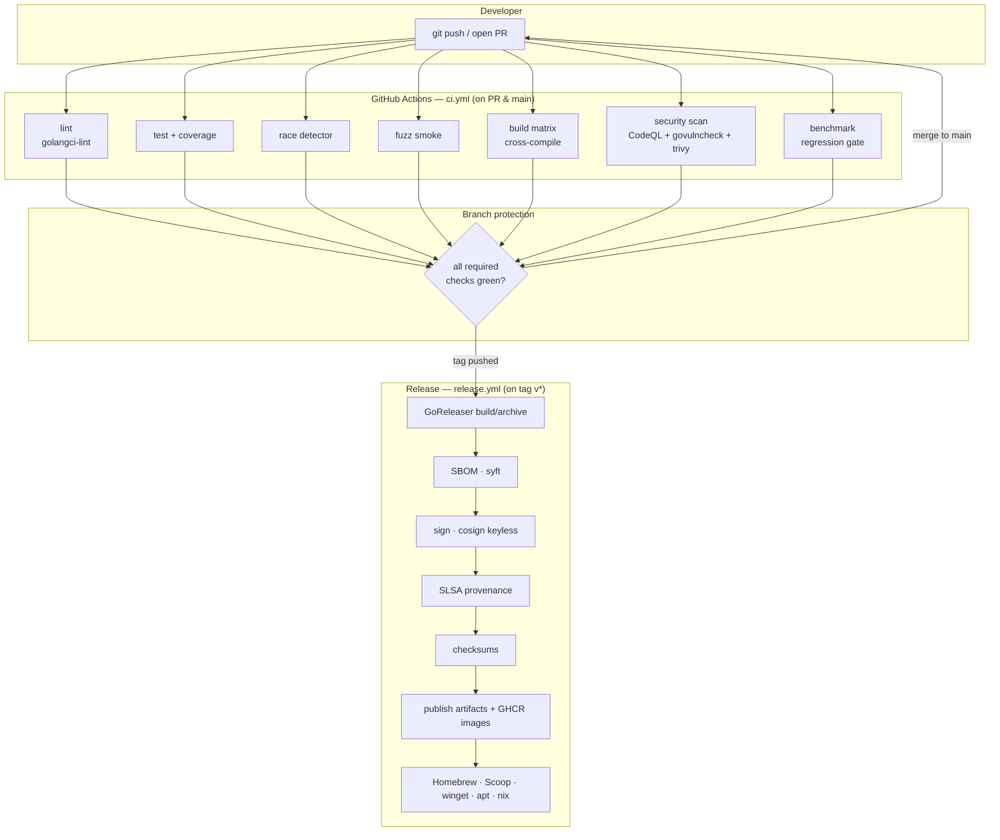
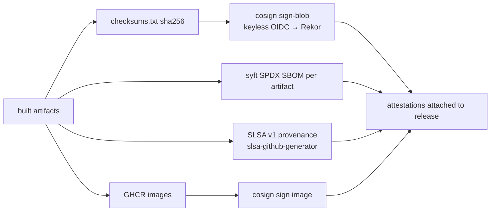

# 81 — Build / Release / CI-CD Pipeline

> **Platform:** Conduit · **Binary:** `conduit` (alias `cdt`) · **Module:** `github.com/conduit-io/conduit`
> **Go:** 1.24+ · **Status:** Architecture Baseline v1.0 · **Owner:** Platform Architecture / Release Engineering · **Date:** 2026-07-02

**Related documents:** [80 — Repository Structure](80-repository-structure.md) · [82 — Developer Experience](82-developer-experience.md) · [83 — API Standards & Versioning](83-api-standards-versioning.md) · [05 — Security Requirements](05-security-requirements.md) · [58 — Tree-sitter Grammar](58-tree-sitter-grammar.md) · [72 — Testing Strategy](72-testing-strategy.md) · [73 — Performance & Scalability](73-performance-scalability.md) · [99 — ADRs](99-adrs.md)

---

## 1. Purpose & Scope

This document specifies how Conduit is **built**, **released**, and **continuously integrated/delivered**. It covers:

- **Build** — reproducible builds, version stamping, the cross-compilation matrix, CGO concerns from the Tree-sitter grammar, and embedded assets.
- **Release** — GoReleaser configuration, changelogs, signing (cosign), SBOM (syft), SLSA provenance, package-manager distribution, container images, checksums.
- **CI/CD** — GitHub Actions workflows (lint, test, race, fuzz, build, security scan, benchmark, release), branch protection, required checks, caching, and matrices.

Toolchain: **standard Go toolchain + Task** (task runner, see [82](82-developer-experience.md)), **GoReleaser** for release, **GitHub Actions** for CI, **cosign** for signing, **syft** for SBOMs, **SLSA** provenance generators. Versioning is **SemVer 2.0.0** across four streams ([83](83-api-standards-versioning.md)).

---

## 2. Pipeline Overview (Mermaid)



---

## 3. Build Pipeline

### 3.1 Reproducible builds

Requirements (recorded in [99 ADRs](99-adrs.md)):

- **Pinned toolchain** via the `go` and `toolchain` directives in `go.mod` (Go 1.24+); CI uses the exact patch version.
- **Trimmed paths**: `-trimpath` removes local filesystem paths from the binary.
- **Static builds** where possible (`CGO_ENABLED=0`) — see §3.4 for the Tree-sitter exception.
- **Deterministic ldflags**: version metadata comes from git, not the clock, so the same tag rebuilds bit-identically. `SOURCE_DATE_EPOCH` is derived from the tag's commit date for any embedded timestamps.
- **Verified deps**: `GOFLAGS=-mod=readonly`, `go mod verify`, `GONOSUMCHECK` unset (checksum DB enforced).

```bash
# task build:release (invoked by GoReleaser hooks / CI)
CGO_ENABLED=0 GOFLAGS=-mod=readonly \
go build -trimpath \
  -ldflags "$(task -s ldflags)" \
  -o dist/conduit ./cmd/conduit
```

### 3.2 ldflags version stamping

Build metadata is injected into `internal/buildinfo` (see [80 §3.2](80-repository-structure.md)) — never hard-coded.

```go
// internal/buildinfo/buildinfo.go
package buildinfo

var (
	Version   = "dev"     // -X ...Version=<git tag>
	Commit    = "none"    // -X ...Commit=<short sha>
	Date      = "unknown" // -X ...Date=<RFC3339, from tag commit>
	BuiltBy   = "local"   // -X ...BuiltBy=goreleaser
	// Independent surface versions (see 83):
	DSLVersion      = "0.0.0" // -X ...DSLVersion=<flow stream>
	PluginProtocol  = "0"     // -X ...PluginProtocol=<proto major>
	SDKVersion      = "0.0.0" // -X ...SDKVersion=<sdk stream>
)
```

```makefile
# `task ldflags` prints:
-X github.com/conduit-io/conduit/internal/buildinfo.Version={{.VERSION}}
-X github.com/conduit-io/conduit/internal/buildinfo.Commit={{.COMMIT}}
-X github.com/conduit-io/conduit/internal/buildinfo.Date={{.DATE}}
-X github.com/conduit-io/conduit/internal/buildinfo.BuiltBy=goreleaser
-X github.com/conduit-io/conduit/internal/buildinfo.DSLVersion={{.DSL_VERSION}}
-X github.com/conduit-io/conduit/internal/buildinfo.PluginProtocol={{.PROTO_MAJOR}}
-X github.com/conduit-io/conduit/internal/buildinfo.SDKVersion={{.SDK_VERSION}}
-s -w
```

`conduit --version` and `conduit version --output json` render all four streams — see [83 §Capabilities](83-api-standards-versioning.md).

### 3.3 Cross-compilation matrix

| GOOS | GOARCH | Artifact | CGO | Notes |
|---|---|---|---|---|
| linux | amd64 | `conduit_linux_amd64` | off (pure) / on (tree-sitter build) | primary CI target |
| linux | arm64 | `conduit_linux_arm64` | off / on | servers, Apple-silicon containers |
| darwin | amd64 | `conduit_darwin_amd64` | off / on | Intel macs |
| darwin | arm64 | `conduit_darwin_arm64` | off / on | Apple silicon |
| windows | amd64 | `conduit_windows_amd64.exe` | off / on | named-pipe plugin transport |
| windows | arm64 | `conduit_windows_arm64.exe` | off / on | Windows on ARM |

Pure-Go targets (`CGO_ENABLED=0`) cross-compile trivially with `GOOS`/`GOARCH`. CGO-enabled targets (Tree-sitter, §3.4) require per-target C toolchains and are built with **Zig as the cross C compiler** or in native runners.

### 3.4 CGO concerns for Tree-sitter

The Tree-sitter grammar ships a generated `parser.c`/`scanner.c` ([80 §3.6](80-repository-structure.md), [58](58-tree-sitter-grammar.md)) consumed via `bindings/go`, which is **cgo**. This complicates the "single static binary" goal. Strategy:

| Concern | Mitigation |
|---|---|
| CGO breaks trivial cross-compile | Use **Zig** as the C compiler (`CC="zig cc -target <triple>"`) so one Linux runner cross-builds all CGO targets; or fan out to native runners per OS. |
| Static binary / no libc dependency | Link statically: `CGO_ENABLED=1 CGO_CFLAGS`/`-extldflags "-static"` on Linux (musl via Zig); macOS/Windows use their platform C runtime. |
| Grammar not needed at runtime for `run`/`serve` | Tree-sitter is only used by `lsp`/`completion`/highlighting. Gate it behind a **build tag** `//go:build treesitter` so headless CI/server builds stay **pure `CGO_ENABLED=0`**. |
| Two build flavors | Ship a **default (pure)** binary and a **`+ts` full** binary; LSP editor packages consume the full one. Documented in release notes. |

```bash
# Full (with Tree-sitter) using Zig for cross-compile:
CGO_ENABLED=1 CC="zig cc -target aarch64-linux-musl" \
GOOS=linux GOARCH=arm64 \
go build -tags treesitter -trimpath -ldflags "$(task -s ldflags)" \
  -o dist/conduit_full_linux_arm64 ./cmd/conduit
```

### 3.5 Embedded assets

Assets are compiled in with `//go:embed`, so the binary is self-contained (no runtime file lookups):

| Asset | Package | Purpose |
|---|---|---|
| Default `conduit.yaml` template, `conduit init` scaffolds | `internal/config` | first-run experience ([82](82-developer-experience.md)) |
| Shell completion templates | `internal/completion` | bash/zsh/fish/pwsh |
| JSON schemas (config, capability I/O) | `internal/config`, `sdk/schema` | validation ([83](83-api-standards-versioning.md)) |
| Example flows | `internal/cli` (for `conduit examples`) | discoverability |
| Tree-sitter `queries/*.scm` | `internal/lsp` (behind `treesitter` tag) | highlighting |

Embedded content participates in reproducibility (byte-stable) and in the SBOM as first-party sources.

---

## 4. Release Pipeline

### 4.1 GoReleaser configuration

`.goreleaser.yaml` (root) — abbreviated but representative:

```yaml
version: 2
project_name: conduit

before:
  hooks:
    - go mod tidy
    - task gen:check       # ensure generated code is committed
    - task proto:verify    # plugin-protocol proto is in sync

builds:
  - id: conduit
    main: ./cmd/conduit
    binary: conduit
    env:
      - CGO_ENABLED=0
    flags:
      - -trimpath
    mod_timestamp: "{{ .CommitTimestamp }}"   # reproducibility
    ldflags:
      - -s -w
      - -X github.com/conduit-io/conduit/internal/buildinfo.Version={{.Version}}
      - -X github.com/conduit-io/conduit/internal/buildinfo.Commit={{.ShortCommit}}
      - -X github.com/conduit-io/conduit/internal/buildinfo.Date={{.CommitDate}}
      - -X github.com/conduit-io/conduit/internal/buildinfo.BuiltBy=goreleaser
      - -X github.com/conduit-io/conduit/internal/buildinfo.DSLVersion={{.Env.DSL_VERSION}}
      - -X github.com/conduit-io/conduit/internal/buildinfo.PluginProtocol={{.Env.PROTO_MAJOR}}
      - -X github.com/conduit-io/conduit/internal/buildinfo.SDKVersion={{.Env.SDK_VERSION}}
    goos: [linux, darwin, windows]
    goarch: [amd64, arm64]

archives:
  - id: conduit
    formats: [tar.gz]
    format_overrides:
      - goos: windows
        formats: [zip]
    name_template: "conduit_{{ .Version }}_{{ .Os }}_{{ .Arch }}"
    files:
      - LICENSE
      - README.md
      - completions/*
      - manpages/*

checksum:
  name_template: "checksums.txt"
  algorithm: sha256

sboms:
  - id: archive-sbom
    artifacts: archive
    documents: ["{{ .ArtifactName }}.spdx.sbom.json"]
    # syft invoked by GoReleaser

signs:
  - id: cosign-checksums
    cmd: cosign
    signature: "${artifact}.sig"
    certificate: "${artifact}.pem"
    args:
      - sign-blob
      - "--yes"
      - "--output-signature=${signature}"
      - "--output-certificate=${certificate}"
      - "${artifact}"
    artifacts: checksum          # sign the checksums file (covers all artifacts)
    output: true

docker_signs:
  - cmd: cosign
    args: ["sign", "--yes", "${artifact}"]
    artifacts: all

dockers:
  - image_templates:
      - "ghcr.io/conduit-io/conduit:{{ .Version }}-amd64"
    dockerfile: Dockerfile
    use: buildx
    goos: linux
    goarch: amd64
    build_flag_templates:
      - "--platform=linux/amd64"
      - "--label=org.opencontainers.image.source=https://github.com/conduit-io/conduit"
      - "--label=org.opencontainers.image.version={{ .Version }}"
  - image_templates:
      - "ghcr.io/conduit-io/conduit:{{ .Version }}-arm64"
    use: buildx
    goos: linux
    goarch: arm64
    build_flag_templates: ["--platform=linux/arm64"]

docker_manifests:
  - name_template: "ghcr.io/conduit-io/conduit:{{ .Version }}"
    image_templates:
      - "ghcr.io/conduit-io/conduit:{{ .Version }}-amd64"
      - "ghcr.io/conduit-io/conduit:{{ .Version }}-arm64"
  - name_template: "ghcr.io/conduit-io/conduit:latest"
    image_templates:
      - "ghcr.io/conduit-io/conduit:{{ .Version }}-amd64"
      - "ghcr.io/conduit-io/conduit:{{ .Version }}-arm64"

nfpms:
  - id: linux-packages
    formats: [deb, rpm, apk]
    maintainer: "Conduit Release Eng <release@conduit-io.dev>"
    description: "Conduit — enterprise CLI & automation platform"
    license: Apache-2.0
    contents:
      - src: ./completions/conduit.bash
        dst: /usr/share/bash-completion/completions/conduit
      - src: ./manpages/conduit.1.gz
        dst: /usr/share/man/man1/conduit.1.gz

brews:
  - repository: { owner: conduit-io, name: homebrew-tap }
    homepage: "https://conduit-io.dev"
    description: "Conduit CLI & automation platform"
    install: |
      bin.install "conduit"
      bin.install_symlink "conduit" => "cdt"
      generate_completions_from_executable(bin/"conduit", "completion")

scoops:
  - repository: { owner: conduit-io, name: scoop-bucket }
    homepage: "https://conduit-io.dev"
    description: "Conduit CLI & automation platform"
    license: Apache-2.0

winget:
  - name: Conduit
    publisher: conduit-io
    license: Apache-2.0
    homepage: "https://conduit-io.dev"
    repository: { owner: conduit-io, name: winget-pkgs-fork, branch: "conduit-{{ .Version }}" }

nix:
  - name: conduit
    repository: { owner: conduit-io, name: nur-packages }
    homepage: "https://conduit-io.dev"
    license: asl20

changelog:
  use: github-native
  sort: asc
  groups:
    - { title: "Features", regexp: "^feat", order: 0 }
    - { title: "Fixes", regexp: "^fix", order: 1 }
    - { title: "Security", regexp: "^sec", order: 2 }
    - { title: "Other", order: 99 }

release:
  github: { owner: conduit-io, name: conduit }
  prerelease: auto        # rc/beta tags → GitHub pre-release
  footer: |
    **Verify**: `cosign verify-blob --certificate checksums.txt.pem \
    --signature checksums.txt.sig checksums.txt` then check your artifact's sha256.
```

> First-party **plugins** (`plugins/*`) and the **`sdk/`** module each have their own `.goreleaser.yaml` (separate modules per [80 §5](80-repository-structure.md)); they are released on their own tags and version streams.

### 4.2 Changelogs

- Conventional-Commit prefixes (`feat`, `fix`, `sec`, `perf`, `docs`, `refactor`) drive grouping.
- GoReleaser's `github-native` changelog + a curated `CHANGELOG.md` (git-chglog) maintained per release.
- Breaking changes flagged with `!`/`BREAKING CHANGE:` footer → surfaced in a dedicated section and cross-checked against the compatibility policy ([83 §Backward Compatibility](83-api-standards-versioning.md)).

### 4.3 Supply-chain security (cosign + syft + SLSA)



| Control | Tool | Output | Verify |
|---|---|---|---|
| Checksums | GoReleaser | `checksums.txt` (sha256) | compare `sha256sum` |
| Signing (keyless) | **cosign** + Sigstore/Fulcio/Rekor | `.sig` + `.pem` (OIDC identity) | `cosign verify-blob` |
| Image signing | cosign | image signature in Rekor | `cosign verify ghcr.io/...` |
| **SBOM** | **syft** (SPDX JSON) | `*.spdx.sbom.json` per archive + image | `grype`/`trivy` scan |
| **SLSA provenance** | `slsa-framework/slsa-github-generator` | provenance attestation (build L3) | `slsa-verifier verify-artifact` |

Meets the supply-chain requirements in [05 — Security Requirements](05-security-requirements.md).

### 4.4 Distribution channels

| Channel | Mechanism | Notes |
|---|---|---|
| GitHub Releases | GoReleaser | archives, checksums, SBOMs, signatures, provenance |
| **Homebrew** | `brews:` → `conduit-io/homebrew-tap` | installs `conduit` + `cdt` symlink + completions |
| **Scoop** | `scoops:` → `conduit-io/scoop-bucket` | Windows |
| **winget** | `winget:` → PR to winget-pkgs | Windows |
| **apt/rpm/apk** | `nfpms:` `.deb/.rpm/.apk` | Linux distros; man pages + completions |
| **Nix** | `nix:` → NUR | Nix/NixOS users |
| **Containers** | GHCR multi-arch manifest | `ghcr.io/conduit-io/conduit:<ver>` + `:latest`, signed |
| **`conduit self-update`** | in-CLI updater (see [82 §self-update](82-developer-experience.md)) | verifies cosign signature before swap |

---

## 5. CI/CD — GitHub Actions

### 5.1 Workflow inventory (`.github/workflows/`)

| Workflow | Trigger | Jobs |
|---|---|---|
| `ci.yml` | PR, push to `main` | lint, test (+coverage), race, build-matrix, security-scan |
| `fuzz.yml` | PR (smoke) + nightly (long) | fuzz corpus for lexer/parser/CEL/DSL ([72](72-testing-strategy.md)) |
| `benchmark.yml` | PR + main | `benchstat` regression gate ([73](73-performance-scalability.md)) |
| `codeql.yml` | PR + schedule | CodeQL (Go, TypeScript for VS Code ext) |
| `release.yml` | tag `v*` | GoReleaser + sign + SBOM + provenance + publish |
| `nightly.yml` | cron | full CGO/Tree-sitter build matrix, extended fuzz, dependency audit |

### 5.2 `ci.yml` (representative)

```yaml
name: ci
on:
  pull_request:
  push:
    branches: [main]

permissions:
  contents: read

concurrency:
  group: ci-${{ github.ref }}
  cancel-in-progress: true

jobs:
  lint:
    runs-on: ubuntu-latest
    steps:
      - uses: actions/checkout@v4
      - uses: actions/setup-go@v5
        with: { go-version: '1.24', cache: true }
      - uses: golangci/golangci-lint-action@v6
        with: { version: v1.60 }   # runs gofumpt, gci, depguard, revive, etc.
      - run: task gen:check          # generated code committed
      - run: task proto:verify       # plugin-protocol proto in sync

  test:
    runs-on: ubuntu-latest
    steps:
      - uses: actions/checkout@v4
      - uses: actions/setup-go@v5
        with: { go-version: '1.24', cache: true }
      - run: go test ./... -coverprofile=cover.out -covermode=atomic
      - run: go tool cover -func=cover.out
      - uses: codecov/codecov-action@v4
        with: { files: cover.out }

  race:
    runs-on: ubuntu-latest
    steps:
      - uses: actions/checkout@v4
      - uses: actions/setup-go@v5
        with: { go-version: '1.24', cache: true }
      - run: go test -race -count=1 ./internal/runtime/... ./internal/bus/... ./internal/state/...

  fuzz-smoke:
    runs-on: ubuntu-latest
    steps:
      - uses: actions/checkout@v4
      - uses: actions/setup-go@v5
        with: { go-version: '1.24', cache: true }
      - run: |
          for pkg in ./internal/flow/lexer ./internal/flow/parser ./internal/cel; do
            go test -run '^$' -fuzz . -fuzztime=30s "$pkg"
          done

  build:
    strategy:
      fail-fast: false
      matrix:
        goos: [linux, darwin, windows]
        goarch: [amd64, arm64]
    runs-on: ubuntu-latest
    env: { CGO_ENABLED: '0' }
    steps:
      - uses: actions/checkout@v4
      - uses: actions/setup-go@v5
        with: { go-version: '1.24', cache: true }
      - run: GOOS=${{ matrix.goos }} GOARCH=${{ matrix.goarch }} go build -trimpath ./cmd/conduit

  security-scan:
    runs-on: ubuntu-latest
    permissions: { security-events: write }
    steps:
      - uses: actions/checkout@v4
      - uses: actions/setup-go@v5
        with: { go-version: '1.24', cache: true }
      - run: go run golang.org/x/vuln/cmd/govulncheck@latest ./...
      - uses: aquasecurity/trivy-action@0.24.0
        with: { scan-type: fs, scanners: 'vuln,secret,misconfig', exit-code: '1' }
```

### 5.3 `release.yml` (representative)

```yaml
name: release
on:
  push:
    tags: ['v*']

permissions:
  contents: write     # create GitHub release
  packages: write     # push GHCR images
  id-token: write     # cosign keyless OIDC + SLSA

jobs:
  goreleaser:
    runs-on: ubuntu-latest
    outputs:
      hashes: ${{ steps.hash.outputs.hashes }}
    steps:
      - uses: actions/checkout@v4
        with: { fetch-depth: 0 }   # full history for changelog
      - uses: actions/setup-go@v5
        with: { go-version: '1.24', cache: true }
      - uses: sigstore/cosign-installer@v3
      - uses: anchore/sbom-action/download-syft@v0
      - uses: docker/login-action@v3
        with:
          registry: ghcr.io
          username: ${{ github.actor }}
          password: ${{ secrets.GITHUB_TOKEN }}
      - uses: goreleaser/goreleaser-action@v6
        with: { version: '~> v2', args: release --clean }
        env:
          GITHUB_TOKEN: ${{ secrets.GITHUB_TOKEN }}
          GOWORK: 'off'          # never build from workspace replaces
          DSL_VERSION: ${{ vars.DSL_VERSION }}
          PROTO_MAJOR: ${{ vars.PROTO_MAJOR }}
          SDK_VERSION: ${{ vars.SDK_VERSION }}
      - id: hash
        run: echo "hashes=$(sha256sum dist/checksums.txt | base64 -w0)" >> "$GITHUB_OUTPUT"

  provenance:
    needs: goreleaser
    permissions: { id-token: write, contents: write, actions: read }
    uses: slsa-framework/slsa-github-generator/.github/workflows/generator_generic_slsa3.yml@v2.0.0
    with:
      base64-subjects: ${{ needs.goreleaser.outputs.hashes }}
      upload-assets: true
```

### 5.4 Branch protection & required checks

| Setting | Value |
|---|---|
| Protected branch | `main` (and `release/*` LTS branches — see [83 §LTS](83-api-standards-versioning.md)) |
| Required status checks | `lint`, `test`, `race`, `fuzz-smoke`, `build (all matrix legs)`, `security-scan`, `benchmark`, `codeql` |
| Require branches up to date | yes |
| Required reviews | ≥ 1 (CODEOWNERS-gated for `internal/domain`, `sdk/proto`, `.goreleaser.yaml`) |
| Linear history / signed commits | required |
| Dismiss stale approvals | on |
| No direct pushes / no force-push | enforced |
| Tag protection | only maintainers may push `v*`, `sdk/*`, `plugins/*/*`, `flow/*` tags |

### 5.5 Caching

| Cache | Key | Effect |
|---|---|---|
| Go build/module cache | `actions/setup-go` `cache: true` keyed on `go.sum` | fast rebuilds |
| golangci-lint cache | action-managed | fast lint |
| Docker buildx layers | GHA cache backend | fast image builds |
| Fuzz corpus | `actions/cache` keyed on package | seed regression corpus |

### 5.6 Matrices

- **Build matrix**: `{linux,darwin,windows} × {amd64,arm64}` = 6 legs (pure Go, fast, on every PR).
- **Nightly full matrix**: same 6 legs with `CGO_ENABLED=1 -tags treesitter` via Zig/native runners (slower; catches CGO regressions, §3.4).
- **Go-version matrix** (nightly): current `1.24` + `1.x-rc` tip to catch upcoming-toolchain breakage.

---

## 6. Quality Gates Summary

| Gate | Tool | Blocks merge? | Blocks release? |
|---|---|---|---|
| Formatting/lint | golangci-lint (gofumpt, gci, depguard, revive) | yes | yes |
| Unit tests + coverage | `go test` + Codecov threshold | yes | yes |
| Race | `go test -race` | yes | yes |
| Fuzz smoke | `go test -fuzz` (30s) | yes | — |
| Cross-build | build matrix | yes | yes |
| Vulnerabilities | govulncheck + trivy + CodeQL | yes | yes |
| Benchmarks | benchstat regression | warn/yes* | — |
| Generated-code drift | `task gen:check`, `task proto:verify` | yes | yes |
| Signing/SBOM/provenance | cosign/syft/SLSA | — | yes |

\* Benchmark gate is advisory on PRs, blocking on a sustained regression per [73](73-performance-scalability.md).

---

## 7. Cross-References

- Repo/module layout that these pipelines build → [80 — Repository Structure](80-repository-structure.md)
- Local `task` targets mirrored by CI → [82 — Developer Experience](82-developer-experience.md)
- Version streams stamped into builds → [83 — API Standards & Versioning](83-api-standards-versioning.md)
- Supply-chain & signing requirements → [05 — Security Requirements](05-security-requirements.md)
- Tree-sitter/CGO grammar build → [58 — Tree-sitter Grammar](58-tree-sitter-grammar.md)
- Test types run in CI → [72 — Testing Strategy](72-testing-strategy.md)
- Benchmark regression policy → [73 — Performance & Scalability](73-performance-scalability.md)
