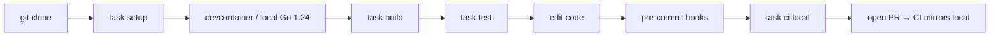
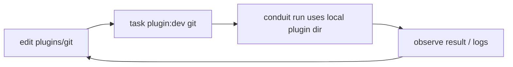
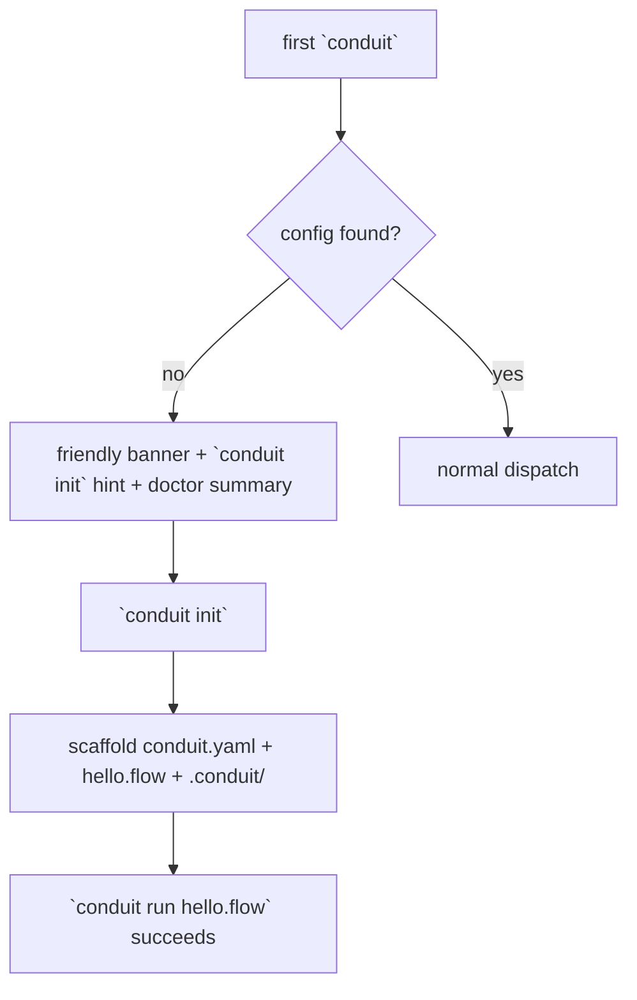

# 82 — Developer Experience Design

> **Platform:** Conduit · **Binary:** `conduit` (alias `cdt`) · **Module:** `github.com/conduit-io/conduit`
> **Go:** 1.24+ · **Status:** Architecture Baseline v1.0 · **Owner:** Developer Experience · **Date:** 2026-07-02

**Related documents:** [80 — Repository Structure](80-repository-structure.md) · [81 — Build/Release/CI-CD](81-build-release-cicd.md) · [83 — API Standards & Versioning](83-api-standards-versioning.md) · [40 — Plugin Architecture](40-plugin-architecture.md) · [41 — Extension SDK](41-extension-sdk.md) · [56 — LSP Architecture](56-lsp-architecture.md) · [57 — VS Code Extension](57-vscode-extension.md) · [60 — Configuration](60-configuration.md) · [70 — Error Handling](70-error-handling.md) · [72 — Testing Strategy](72-testing-strategy.md)

---

## 1. Purpose & Scope

This document defines the **developer experience (DX)** for two audiences:

1. **Contributors** to the Conduit codebase (onboarding, task runner, devcontainer, hooks, debugging, plugin/LSP dev loops).
2. **End users** of the `conduit` CLI (first-run experience, `conduit init`, TUI, help/discoverability, shell integration, self-update, `conduit doctor`).

DX is a first-class quality attribute: the golden-path from `git clone` to a green build, and from install to a first successful `conduit run`, MUST each be achievable in minutes with clear, actionable feedback. Error-message quality is held to the bar in §9.

---

## 2. Contributor Onboarding — the golden path



**Two commands to productive:**

```bash
git clone https://github.com/conduit-io/conduit && cd conduit
task setup      # installs pinned tools, git hooks, go.work, verifies toolchain
task            # default target: fmt + lint + test + build → ./bin/conduit
```

`task setup` is idempotent: it installs pinned tool versions (from `tools/tools.go`, [80 §3.8](80-repository-structure.md)), wires `.pre-commit-config.yaml`, creates the `go.work` ([80 §5.3](80-repository-structure.md)), and runs `conduit doctor --contributor` to confirm the environment. `CONTRIBUTING.md` links here.

---

## 3. Task Runner Targets

Conduit uses **Task** (`Taskfile.yml`) as the canonical runner; a thin `Makefile` proxies for `make`-only environments. CI ([81 §5](81-build-release-cicd.md)) invokes the **same** targets so "works locally" == "passes CI".

| Target | Purpose |
|---|---|
| `task setup` | one-time contributor bootstrap (tools, hooks, workspace, doctor) |
| `task` (default) | `fmt` → `lint` → `test` → `build` |
| `task build` | build `./bin/conduit` with dev ldflags |
| `task build:release` | reproducible build flags ([81 §3](81-build-release-cicd.md)) |
| `task fmt` | gofumpt + gci import ordering |
| `task lint` | golangci-lint (gofumpt, gci, depguard, revive) |
| `task test` | `go test ./...` |
| `task test:race` | `go test -race` on concurrency-sensitive packages |
| `task test:fuzz` | short fuzz smoke on lexer/parser/CEL ([72](72-testing-strategy.md)) |
| `task test:update-golden` | regenerate golden fixtures |
| `task bench` | benchmarks + benchstat vs baseline ([73](73-performance-scalability.md)) |
| `task gen` | run all code generators (mocks, docs, completions, proto) |
| `task gen:check` | fail if generated code is stale (CI gate) |
| `task proto` / `proto:verify` | regenerate / verify plugin-protocol stubs ([41](41-extension-sdk.md)) |
| `task plugin:dev` | build first-party plugins & wire the local plugin dir (see §6) |
| `task lsp:dev` | run the LSP with hot-reload (see §7) |
| `task tui` | run `conduit tui` against sample flows |
| `task ci-local` | run the full CI gate set locally before pushing |
| `task docs:serve` | preview `docs/` with Mermaid rendering |
| `task clean` | remove `bin/`, `dist/`, caches |

---

## 4. Devcontainer

A committed `.devcontainer/devcontainer.json` gives Codespaces/VS Code Remote a reproducible environment matching CI's Go patch version.

```jsonc
{
  "name": "conduit-dev",
  "image": "mcr.microsoft.com/devcontainers/go:1.24",
  "features": {
    "ghcr.io/devcontainers/features/node:1": {},           // VS Code ext + tree-sitter
    "ghcr.io/devcontainers/features/docker-in-docker:2": {} // GoReleaser/image builds
  },
  "postCreateCommand": "task setup",
  "customizations": {
    "vscode": {
      "extensions": ["golang.go", "conduit-io.conduit-flow"],
      "settings": {
        "go.lintTool": "golangci-lint",
        "editor.formatOnSave": true,
        "[go]": { "editor.defaultFormatter": "golang.go" }
      }
    }
  },
  "remoteEnv": { "GOFLAGS": "-mod=readonly" }
}
```

The devcontainer preinstalls the Conduit VS Code extension ([57](57-vscode-extension.md)) so `.flow` files light up with the LSP immediately.

---

## 5. Pre-commit Hooks

`.pre-commit-config.yaml` runs fast, deterministic checks before every commit; the same tools run in CI as the source of truth.

```yaml
repos:
  - repo: local
    hooks:
      - id: gofumpt
        name: gofumpt
        entry: gofumpt -l -w
        language: system
        types: [go]
      - id: gci
        name: gci (import order)
        entry: gci write --skip-generated -s standard -s default -s "prefix(github.com/conduit-io/conduit)"
        language: system
        types: [go]
      - id: golangci-lint
        name: golangci-lint
        entry: golangci-lint run --fix
        language: system
        pass_filenames: false
        types: [go]
      - id: gen-check
        name: generated code up to date
        entry: task gen:check
        language: system
        pass_filenames: false
  - repo: https://github.com/gitleaks/gitleaks
    rev: v8.18.0
    hooks: [{ id: gitleaks }]   # secret scanning
```

Import ordering is standardized: **standard → third-party → `github.com/conduit-io/conduit`** via gci, matching the golangci-lint config in [81 §5](81-build-release-cicd.md).

---

## 6. Local Plugin Dev Loop

Because plugins are separate modules/processes ([80 §5](80-repository-structure.md), [40](40-plugin-architecture.md)), the loop is optimized to avoid reinstalling:



```bash
# Build one plugin and point Conduit at the local build dir:
task plugin:dev -- git
conduit run examples/ci-pipeline/deploy.flow \
  --plugin-dir ./bin/plugins --log-level debug
```

- `--plugin-dir` overrides the resolved plugin path so an uninstalled, freshly built binary is used (handshake/protocol version still negotiated per [40](40-plugin-architecture.md)).
- `sdk/testkit` ([80 §3.4](80-repository-structure.md)) lets authors unit-test a `CapabilityProvider` **in-process**, no host spawn, for the tightest inner loop.
- `conduit plugin doctor <name>` validates handshake, protocol compatibility ([83 §Plugin protocol](83-api-standards-versioning.md)), and declared capability schemas.

---

## 7. Hot-reload for LSP Dev

The LSP ([56](56-lsp-architecture.md)) is the tightest editor-facing loop. `task lsp:dev` runs the server under a file watcher that rebuilds and restarts on change while the editor auto-reconnects.

```bash
task lsp:dev            # watch internal/lsp + internal/flow, rebuild, restart `conduit lsp`
```

- Uses `air`/`watchexec` to rebuild on save; the VS Code extension is configured (dev mode) to relaunch the server binary and replay `didOpen`.
- Because the LSP **reuses `internal/flow`** ([10 §5](10-platform-architecture.md)), a grammar/sema change is reflected in both diagnostics and `conduit run` from one rebuild — no divergence.
- `conduit lsp --stdio --log-file lsp.log` for verbose JSON-RPC tracing during debugging.

---

## 8. Debugging

| Need | Tool / flow |
|---|---|
| Step-debug CLI | Delve: `dlv debug ./cmd/conduit -- run x.flow`; VS Code `launch.json` presets committed |
| Step-debug a plugin subprocess | `CONDUIT_PLUGIN_DEBUG=git` makes the host wait for a debugger to attach to the plugin before handshake |
| Trace execution | `--log-level debug` + OTel spans to a local collector ([64](64-observability.md)) |
| Inspect a run | `conduit run --inspect` dumps the compiled flow, DAG, and plan without executing |
| Machine-readable errors | `--output json` returns structured `ConduitError` codes ([70](70-error-handling.md)) |
| Reproduce CI locally | `task ci-local` |

---

## 9. Error Message Quality Bar

Every user-facing error MUST meet this bar (enforced in review; typed via `ConduitError`, [70](70-error-handling.md)):

1. **What happened** — plain-language summary, no stack traces by default.
2. **Where** — file, line/column, and a source snippet with a caret for `.flow` diagnostics (LSP-grade).
3. **Why** — the violated rule/invariant.
4. **Fix** — a concrete, copy-pasteable next step.
5. **Code** — a stable `CDT####` error code for docs/search and `--output json`.
6. **More** — a docs URL and `conduit explain CDT####`.

```text
Error [CDT1042]: unknown capability "gti.clone" in task "checkout"
  ┌─ deploy.flow:12:5
  │
12│     uses: gti.clone
  │           ^^^^^^^^^ no plugin provides this capability
  │
  = help: did you mean "git.clone"? (from plugin `git` v1.4.0)
  = run:  conduit plugin list --capabilities
  = docs: https://conduit-io.dev/errors/CDT1042
```

Anti-patterns that fail review: bare Go error strings, leaked internal paths, panics reaching the user, non-actionable "invalid input".

---

## 10. First-Run Experience & `conduit init`

On a machine with no config, the **first invocation** is welcoming, not punishing:



- `conduit init` scaffolds `conduit.yaml`, a `.conduit/` dir, and a runnable `hello.flow` from **embedded templates** ([81 §3.5](81-build-release-cicd.md)); `--template ci|k8s|minimal` selects a starter; `--no-input` produces defaults non-interactively ([83 §CLI UX](83-api-standards-versioning.md)).
- First run auto-offers shell completion install and telemetry consent (opt-in, [66](66-telemetry.md)) — both skippable and non-blocking.
- `conduit examples` lists embedded runnable samples so a new user has something to run in one command.

---

## 11. TUI — `conduit tui`

A Bubble Tea TUI ([10 §10](10-platform-architecture.md)) for browsing and running workflows interactively.

```text
┌ Conduit ───────────────────────────────────────────────┐
│ Flows                    │ deploy.flow                  │
│ > deploy.flow            │ tasks: 6  ·  DAG levels: 3   │
│   ci-pipeline.flow       │ ┌─ build ──► test ──► deploy │
│   nightly.flow           │ │  lint ───►                 │
│                          │ status: ● ready              │
│ [enter] run  [/] filter  │ [r] run  [i] inspect  [l] logs
└──────────────────────────┴──────────────────────────────┘
```

- Browse discovered `.flow` files, preview the DAG, inspect tasks, run, and stream live logs/status from the event bus ([68](68-message-bus.md)).
- Fully keyboard-driven; degrades to `--no-input`/non-TTY (CI) by refusing to launch and printing the equivalent non-interactive command.
- Shares the same `app` use-cases as the CLI — the TUI is a driving adapter, not a fork of logic.

---

## 12. Help & Discoverability

| Mechanism | Behavior |
|---|---|
| `conduit help [cmd]` / `-h` | Cobra help with examples, grouped flags, and "See also" |
| `conduit <cmd> --help` | per-command usage + machine-mode note |
| `conduit explain CDT####` | expand an error code with cause & fix |
| `conduit doctor` | environment diagnostics (§13) |
| `conduit examples` | list & run embedded examples |
| Did-you-mean | typo suggestions for commands, flags, and capabilities |
| man pages + completions | shipped in packages ([81 §4.4](81-build-release-cicd.md)) |
| `--output json` help | `conduit help --output json` emits the command tree for AI agents ([83 §Machine mode](83-api-standards-versioning.md)) |

---

## 13. `conduit doctor`

Diagnoses the environment and prints a prioritized, fixable report ([80 §3.2](80-repository-structure.md), `internal/doctor`).

```text
$ conduit doctor
Conduit doctor — 8 checks

  ✔ conduit v2.3.1 (dsl 1.1, proto 3, sdk 1.2)
  ✔ config: ./conduit.yaml valid (schema 2)
  ✔ state store: ~/.conduit/state (bolt) writable
  ✔ plugins: git v1.4.0, http v2.1.0 (protocol 3 ✓)
  ⚠ shell completion: zsh not installed → run `conduit completion zsh --install`
  ✔ PATH: conduit + cdt resolve
  ✔ network: plugin registry reachable
  ✖ auth: token expired → run `conduit auth login`

2 issues found. Run `conduit doctor --fix` to auto-remediate the ⚠ items.
```

- `--contributor` mode adds toolchain, hooks, `go.work`, and generator checks (used by `task setup`).
- `--output json` for CI/agents; non-zero exit if any `✖` remains ([83 §Exit codes](83-api-standards-versioning.md)).

---

## 14. Shell Integration

- Completions for **bash / zsh / fish / PowerShell** generated by Cobra ([80 §3.2 completion](80-repository-structure.md); details in [51–54]).
- `conduit completion <shell> --install` writes to the correct per-shell location; packages preinstall bash completion ([81 §4.4](81-build-release-cicd.md)).
- **Dynamic completion**: flow names, task names, plugin capabilities, and config keys complete from live state (`ValidArgsFunction` callbacks).
- Optional shell prompt hook shows the active `conduit` context/profile.

```bash
conduit completion zsh --install     # writes to $fpath, prints activation note
cdt run <TAB>                         # completes discovered .flow files
```

---

## 15. Self-Update

```bash
conduit self-update            # checks latest, verifies cosign signature, swaps binary
conduit self-update --check    # report only; used by a soft update-available nudge
conduit self-update --to v2.4  # pin to a specific version
```

- Downloads from GitHub Releases, **verifies the cosign signature and checksum** ([81 §4.3](81-build-release-cicd.md)) before atomically replacing the binary; refuses on verification failure.
- Package-manager installs (brew/scoop/apt/nix) defer to the package manager and print the right upgrade command instead of self-replacing.
- Respects the four version streams — warns if a new CLI would change the negotiated plugin protocol or DSL version ([83](83-api-standards-versioning.md)).

---

## 16. Golden-Path Walkthrough (end user)

```bash
# 1. Install
brew install conduit-io/tap/conduit        # or scoop/winget/apt/nix ([81 §4.4])

# 2. Verify environment
conduit doctor                              # ✔ everything green

# 3. Scaffold a project
conduit init --template minimal
#   creates conduit.yaml, .conduit/, hello.flow

# 4. Edit with full IDE support (LSP + highlighting)
code hello.flow                             # VS Code ext auto-activates ([57])

# 5. Inspect before running
conduit run hello.flow --inspect            # shows compiled flow + DAG, no side effects

# 6. Run it
conduit run hello.flow
#   ✔ build → ✔ test → ✔ greet   (streamed status)

# 7. Explore interactively
conduit tui                                 # browse & run flows

# 8. Go machine-mode (CI / AI agent)
conduit run hello.flow --output json --no-input
```

This is the loop DX optimizes: **install → doctor → init → edit (IDE) → inspect → run → tui → machine-mode**, each step giving actionable feedback that meets §9.

---

## 17. Cross-References

- Repo layout & task/tool sources → [80 — Repository Structure](80-repository-structure.md)
- CI mirrors these task targets → [81 — Build/Release/CI-CD](81-build-release-cicd.md)
- CLI UX / machine mode / exit codes referenced here → [83 — API Standards & Versioning](83-api-standards-versioning.md)
- Plugin dev contract & SDK → [40](40-plugin-architecture.md) · [41](41-extension-sdk.md)
- LSP & editor integration → [56](56-lsp-architecture.md) · [57](57-vscode-extension.md)
- Error typing behind the quality bar → [70 — Error Handling](70-error-handling.md)
- Telemetry consent & config → [60](60-configuration.md) · [66](66-telemetry.md)
