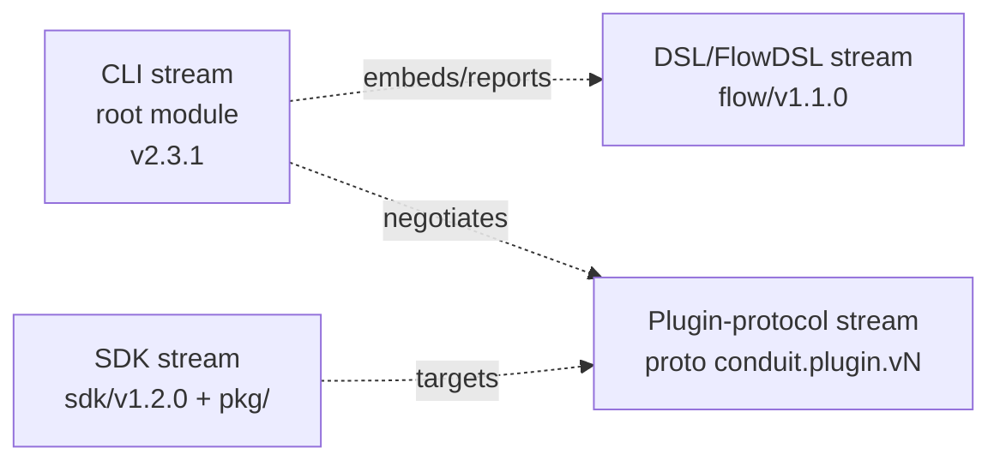
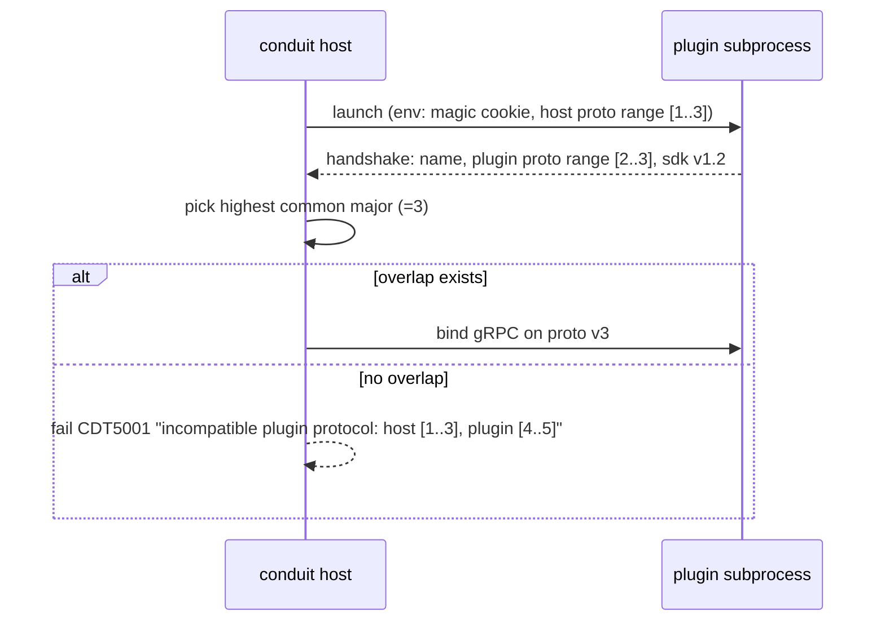
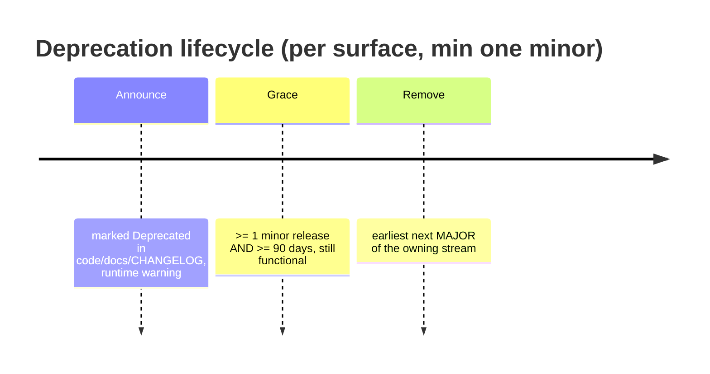
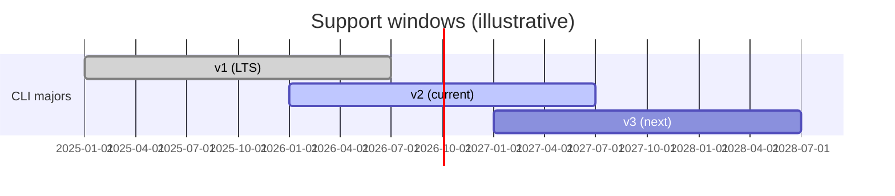

# 83 — API Standards / Versioning / Compatibility / Migration

> **Platform:** Conduit · **Binary:** `conduit` (alias `cdt`) · **Module:** `github.com/conduit-io/conduit`
> **Go:** 1.24+ · **Status:** Architecture Baseline v1.0 · **Owner:** Platform Architecture / API Governance · **Date:** 2026-07-02

**Related documents:** [80 — Repository Structure](80-repository-structure.md) · [81 — Build/Release/CI-CD](81-build-release-cicd.md) · [82 — Developer Experience](82-developer-experience.md) · [40 — Plugin Architecture](40-plugin-architecture.md) · [41 — Extension SDK](41-extension-sdk.md) · [44 — Public SDK](44-public-sdk.md) · [20 — DSL Grammar](20-dsl-grammar.md) · [60 — Configuration](60-configuration.md) · [70 — Error Handling](70-error-handling.md) · [99 — ADRs](99-adrs.md)

---

## 1. Purpose & Scope

This document defines the **contracts** Conduit exposes and how they evolve:

1. **API standards** — CLI UX standards, Go API design, gRPC/proto style, JSON schemas.
2. **Versioning strategy** — SemVer 2.0.0 across **four independent version streams**, the DSL `flowVersion` pragma, and plugin-protocol negotiation.
3. **Backward-compatibility strategy** — guarantees per surface, deprecation policy/timeline, feature flags, capability reporting.
4. **Migration strategy** — config/state/DSL migrations, `conduit migrate`, upgrade guides, and the LTS policy.

**Normative language** per RFC 2119 / RFC 8174.

---

## 2. API Standards

### 2.1 CLI UX standards

Conduit's CLI is designed to be **equally good for humans and machines (AI agents, CI)**.

#### Flag naming

| Rule | Standard | Example |
|---|---|---|
| Long flags | `--kebab-case`, GNU-style | `--plugin-dir`, `--dry-run` |
| Short flags | single letter, common set only | `-o` (output), `-v` (verbose), `-q` (quiet) |
| Booleans | affirmative + `--no-` negation | `--color` / `--no-color`, `--input` / `--no-input` |
| Repeatable | plural or repeated flag | `--var k=v --var k2=v2` |
| Env fallback | `CONDUIT_<FLAG>` per Koanf precedence ([60](60-configuration.md)) | `CONDUIT_OUTPUT=json` |
| Consistency | same flag means same thing across commands | `--output` everywhere |

#### Output formats

`--output` (alias `-o`) selects the rendering; default is `table` on a TTY, `json` is the machine default under `--no-input`/non-TTY where noted.

| Value | Use | Notes |
|---|---|---|
| `table` | human default | aligned, colorized; auto-plain on non-TTY |
| `json` | machines/agents | stable schema, versioned (§2.4); newline-delimited (`jsonl`) available for streams |
| `yaml` | human-readable structured | same schema as json |

**Streaming**: long runs emit newline-delimited JSON events (`--output json` + `--stream`) mapped to the event model ([67](67-event-model.md)).

#### Exit codes

Stable, documented, testable ([72](72-testing-strategy.md)):

| Code | Meaning |
|---|---|
| `0` | success |
| `1` | generic runtime failure (task/flow failed) |
| `2` | usage error (bad flags/args) |
| `3` | configuration error |
| `4` | compile/validation error (`.flow` invalid) |
| `5` | plugin error (handshake/protocol/capability) |
| `6` | authentication/authorization failure |
| `7` | not found (flow/run/resource) |
| `8` | precondition/state conflict (e.g. resume mismatch) |
| `124` | timeout/deadline exceeded |
| `130` | interrupted (SIGINT) |

Each maps to a `ConduitError` code family ([70](70-error-handling.md)).

#### Verbosity, quiet, no-input, machine mode

| Flag | Effect |
|---|---|
| `-v/--verbose` (repeatable `-vv`) | increases log detail on **stderr** (never pollutes stdout data) |
| `-q/--quiet` | suppress non-essential output; errors still on stderr |
| `--no-input` | never prompt; fail (or use defaults) instead of blocking — required for CI/agents |
| `--no-color` / `NO_COLOR` | disable ANSI (honors the `NO_COLOR` convention) |
| `--machine` | **AI-agent machine mode**: implies `--no-input --output json`, stable schema, no spinners/animations, deterministic ordering, and errors as structured JSON on stdout |

**stdout/stderr contract**: machine-consumable **data** goes to **stdout**; **diagnostics/logs/progress** go to **stderr**. This lets `conduit ... --machine | jq` work cleanly.

**Machine mode for AI agents** additionally guarantees: self-describing command tree via `conduit help --output json`; every error carries a stable `CDT####` code and `fix` field; capability discovery via `conduit capabilities --output json` (§4.5).

### 2.2 Go API design guidelines (`pkg/`, `sdk/`)

Applies to public surfaces in `pkg/` and `sdk/` ([80 §3.3–3.4](80-repository-structure.md), [44](44-public-sdk.md)).

- **Accept interfaces, return structs.** Keep public interfaces small.
- **`context.Context` first** on any call that does I/O or can block/cancel.
- **Errors**: return typed, wrappable errors; export sentinel `ErrXxx`; never panic across the API boundary.
- **Functional options** (`WithXxx`) for extensible constructors — additive without breaking.
- **No breaking changes without a major bump** on the owning stream (§3). Additive only within a minor.
- **Zero values usable**; avoid required init where possible.
- **Stability tiers**: `// Stable`, `// Experimental` (may change in minor), `// Deprecated:` (with removal target). `internal/` has no guarantee ([80 §4](80-repository-structure.md)).

### 2.3 gRPC / proto style (plugin protocol)

The plugin wire contract lives in `sdk/proto` ([80 §3.4](80-repository-structure.md), [40](40-plugin-architecture.md)).

| Rule | Standard |
|---|---|
| Package | `conduit.plugin.v1` — **major version in the proto package** |
| Files | `plugin.proto`, `capability.proto`; `snake_case` fields, `PascalCase` messages/services |
| Evolution | **only additive** within a major: new fields with new numbers, never reuse/renumber; removed fields `reserved` |
| Enums | `UNSPECIFIED = 0` default; append new values |
| Streaming | server-streaming for task logs/progress |
| Breaking change | new proto package `...v2`, negotiated at handshake (§3.4) |
| Lint | `buf lint` + `buf breaking` in CI ([81 §5](81-build-release-cicd.md)) |

### 2.4 JSON schemas

Every machine-facing structure is schema-governed and embedded ([81 §3.5](81-build-release-cicd.md)):

| Schema | Governs | Version |
|---|---|---|
| `conduit.config.schema.json` | `conduit.yaml` | `schemaVersion` field, config stream |
| `conduit.output.*.schema.json` | `--output json` payloads (run summary, run status, plugin list…) | CLI stream |
| `capability.io.schema.json` | plugin capability input/output ([41](41-extension-sdk.md)) | plugin-protocol stream |
| `event.schema.json` | streamed events ([67](67-event-model.md)) | CLI stream |

Schemas are published, referenced by `$id` URLs, and validated in CI so `--output json` never silently drifts.

---

## 3. Versioning Strategy — Four Independent Streams

Conduit versions **four surfaces independently**, each SemVer 2.0.0, each with its own tag namespace ([80 §5.4](80-repository-structure.md)) and its own compatibility guarantees. Coupling them would force needless major bumps.



| Stream | Owns | Tag namespace | Bump triggers |
|---|---|---|---|
| **CLI** | binary UX, flags, output schemas, exit codes | `vX.Y.Z` | flag/output/exit-code breaks → major |
| **DSL (FlowDSL)** | `.flow` grammar & semantics, `flowVersion` | `flow/vX.Y.Z` | grammar/semantic breaks → major |
| **Plugin protocol** | `sdk/proto` gRPC contract | proto package `conduit.plugin.vN` (+ `sdk/` tag) | wire break → new proto major |
| **SDK** | `pkg/` embed API + `sdk/` plugin API | `sdk/vX.Y.Z`, `pkg` under root tag | exported Go API break → major |

`conduit --version` reports **all four** (§4.5).

### 3.1 CLI stream

Root module version ([80 §5.2](80-repository-structure.md)). Major bump for: removing/renaming a flag or command, changing an exit code's meaning, or a breaking change to an `--output json` schema. Adding flags/commands/output fields is minor.

### 3.2 DSL stream & the `flowVersion` pragma

Each `.flow` declares the DSL version it targets so old files keep working when the language evolves ([20](20-dsl-grammar.md)):

```flow
flowVersion "1.0"      # this file targets FlowDSL 1.x semantics

flow "deploy" {
  task "build" { uses: shell.run, args: { cmd: "make build" } }
}
```

- The compiler selects the semantics matching the declared `flowVersion`; a newer engine still compiles older files.
- Missing pragma → defaults to a configured baseline with a **warning** and a `conduit migrate flow` hint.
- A file requiring a **newer** DSL than the engine supports fails fast with `CDT` code + minimum-version guidance (§5).

### 3.3 Plugin-protocol stream

The gRPC contract (§2.3). Major only for wire-incompatible changes; the major lives in the proto package name (`conduit.plugin.v1` → `v2`).

### 3.4 Plugin protocol negotiation (handshake)

go-plugin handshake ([40](40-plugin-architecture.md)) negotiates a mutually supported protocol version:



- The host advertises a **range** of supported majors and picks the highest common one → old plugins keep working across CLI upgrades.
- Mismatch is a clear error with the exact ranges and the remediation (`conduit plugin update <name>`).

### 3.5 SDK stream

`pkg/` (embed API) and `sdk/` (plugin author API). Independent so plugin authors aren't forced to re-release on every CLI bump. A plugin declares the SDK it built against; the host checks it against the negotiated protocol.

---

## 4. Backward-Compatibility Strategy

### 4.1 Guarantees per surface

| Surface | Guarantee within a major | Breaking change requires |
|---|---|---|
| CLI flags/commands | existing flags keep meaning; additive only | CLI major |
| `--output json/yaml` schema | fields never removed/retyped; additive only | CLI major (or opt-in `--output json@v2`) |
| Exit codes | code→meaning stable | CLI major |
| FlowDSL grammar/semantics | `flowVersion`-tagged files keep compiling | DSL major (old `flowVersion` still supported per policy) |
| Plugin protocol | negotiated majors coexist; additive proto | new proto major |
| SDK Go API (`pkg/`,`sdk/`) | source-compatible additive changes | SDK major |
| Config `conduit.yaml` | old keys honored or auto-migrated | config-schema major + migration |
| State store format | resumable/readable across minors | major + `conduit migrate state` |

### 4.2 Deprecation policy & timeline



- **Announce**: `// Deprecated:` (Go), `Deprecated:` in `--help`, a `CDT` warning at runtime naming the replacement and removal target, CHANGELOG "Deprecations" section.
- **Grace period**: MUST remain functional for **at least one minor release and at least 90 days**.
- **Removal**: only at the next **major** of the owning stream; never in a minor/patch.
- Deprecation warnings are suppressible (`--no-deprecation-warnings`) but on by default.

### 4.3 Feature flags

Pre-stable functionality ships behind flags so it can evolve without breaking guarantees:

| Mechanism | Example |
|---|---|
| CLI experimental flag | `--experimental-<feature>` (hidden from default help) |
| Config gate | `experimental: { <feature>: true }` in `conduit.yaml` |
| DSL gate | features requiring a higher `flowVersion` are inert in older-tagged files |
| Env | `CONDUIT_EXPERIMENTAL=<feature>` |

Experimental surfaces are explicitly **exempt** from compatibility guarantees until promoted (announced in CHANGELOG).

### 4.4 `conduit --version` / version reporting

```bash
$ conduit --version
conduit 2.3.1 (cdt)
  dsl-version:      1.1 (supports 1.0, 1.1)
  plugin-protocol:  3 (supports 1..3)
  sdk-version:      1.2
  commit:           a1b2c3d  date: 2026-07-02  built-by: goreleaser
```

Backed by `internal/buildinfo` ([81 §3.2](81-build-release-cicd.md)).

### 4.5 Capabilities reporting

Machine-readable capability/version discovery for agents and compatibility checks:

```bash
$ conduit capabilities --output json
{
  "cli": "2.3.1",
  "dsl": { "current": "1.1", "supported": ["1.0", "1.1"] },
  "pluginProtocol": { "current": 3, "supported": [1, 2, 3] },
  "sdk": "1.2",
  "outputSchemas": ["run.summary@1", "run.status@1", "plugin.list@1"],
  "features": { "experimental": ["parallel-matrix"] },
  "plugins": [
    { "name": "git", "version": "1.4.0", "protocol": 3 },
    { "name": "http", "version": "2.1.0", "protocol": 3 }
  ]
}
```

An AI agent or CI gate reads this to decide whether its expectations are satisfied before running.

---

## 5. Migration Strategy

### 5.1 `conduit migrate`

One command, several targets; each is **idempotent**, **backs up first**, supports `--dry-run`, and reports a diff.

| Subcommand | Migrates | Backup |
|---|---|---|
| `conduit migrate config` | `conduit.yaml` to the current `schemaVersion` | `conduit.yaml.bak` |
| `conduit migrate state` | on-disk state store to the current format | snapshot copy |
| `conduit migrate flow [path...]` | `.flow` files to a newer `flowVersion` (mechanical rewrites) | `.flow.bak` |
| `conduit migrate all` | runs all applicable migrations in order | all of the above |

```bash
conduit migrate config --dry-run     # show what would change, no writes
conduit migrate all                  # apply, with backups + summary
```

### 5.2 Config migrations

- `conduit.yaml` carries `schemaVersion`. On load, if it lags the binary's expected version, Conduit runs a **chained** migration (v1→v2→v3) and warns; `--strict` fails instead of auto-migrating ([60](60-configuration.md)).
- Renamed keys are aliased during the grace window (§4.2) before removal.

### 5.3 State migrations

- State format is versioned; the runtime refuses to operate on a **newer** state than it understands (prevents corruption) and auto-migrates **older** state forward after snapshotting.
- Resume checks compatibility of a run's recorded versions against the current engine (exit `8` on mismatch, §2.1) with a `conduit migrate state` remedy.

### 5.4 DSL migrations

- `conduit migrate flow` applies deterministic codemods to bump a file's `flowVersion`, reporting anything requiring human judgment.
- The LSP surfaces "this file targets an outdated FlowDSL; run `conduit migrate flow`" as a diagnostic with a quick-fix ([56](56-lsp-architecture.md)).

### 5.5 Upgrade guides

- Every **major** on any stream ships an `UPGRADING.md` section: what broke, the mechanical migration command, and manual steps.
- CHANGELOG "Breaking Changes" entries link to the relevant upgrade section ([81 §4.2](81-build-release-cicd.md)).

### 5.6 LTS policy



| Policy | Value |
|---|---|
| Current major | full support (features + fixes) |
| Previous major | security + critical fixes for **≥ 12 months** after the next major GAs |
| **LTS majors** | designated releases supported **24 months**, maintained on a `release/vX` branch ([81 §5.4](81-build-release-cicd.md)) |
| DSL versions | a `flowVersion` remains accepted for **≥ 2 DSL majors** before removal |
| Plugin protocol | a negotiated major is supported for **≥ 2 CLI majors** |
| EOL notice | announced **≥ 90 days** before end-of-support |

---

## 6. Standards Compliance Checklist (review gate)

| Check | Where enforced |
|---|---|
| New flag follows naming + has env fallback + help example | code review + `conduit help --output json` snapshot test |
| `--output json` change is additive or bumps CLI major | JSON schema diff test ([81 §5](81-build-release-cicd.md)) |
| New exit code documented + tested | golden exit-code tests ([72](72-testing-strategy.md)) |
| Proto change passes `buf breaking` | CI |
| Public Go API change reviewed by CODEOWNERS | branch protection ([81 §5.4](81-build-release-cicd.md)) |
| Deprecation has warning + removal target + CHANGELOG entry | review |
| DSL change bumps `flowVersion` + migration codemod | review + LSP diagnostic |

---

## 7. Cross-References

- Module/tag namespaces per stream → [80 — Repository Structure §5](80-repository-structure.md)
- Version stamping & `buf`/schema CI gates → [81 — Build/Release/CI-CD](81-build-release-cicd.md)
- CLI UX in practice (machine mode, doctor, help) → [82 — Developer Experience](82-developer-experience.md)
- Plugin protocol & handshake internals → [40 — Plugin Architecture](40-plugin-architecture.md) · [41 — Extension SDK](41-extension-sdk.md)
- Public embed SDK → [44 — Public SDK](44-public-sdk.md)
- FlowDSL grammar & `flowVersion` → [20 — DSL Grammar](20-dsl-grammar.md)
- Config schema & precedence → [60 — Configuration](60-configuration.md)
- Error codes behind exit codes → [70 — Error Handling](70-error-handling.md)
