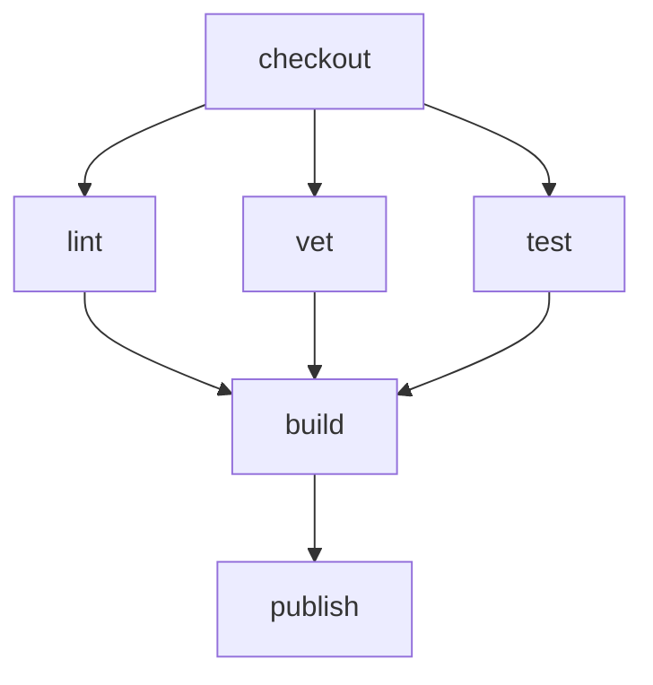
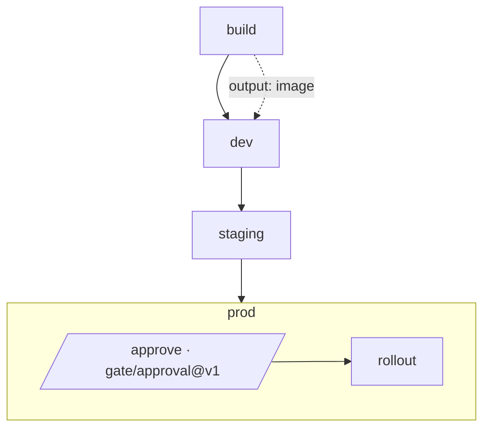
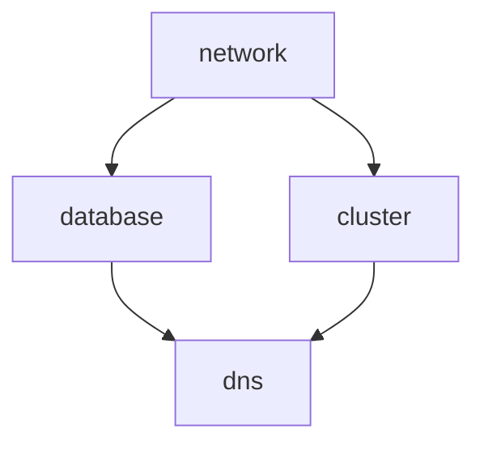
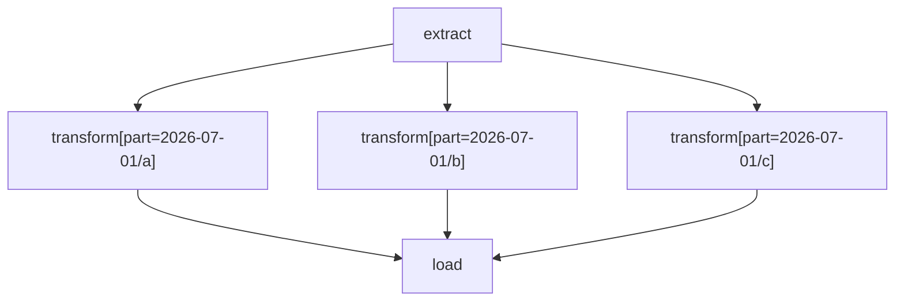
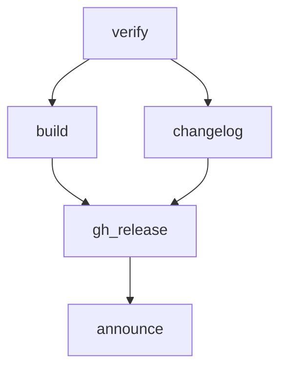
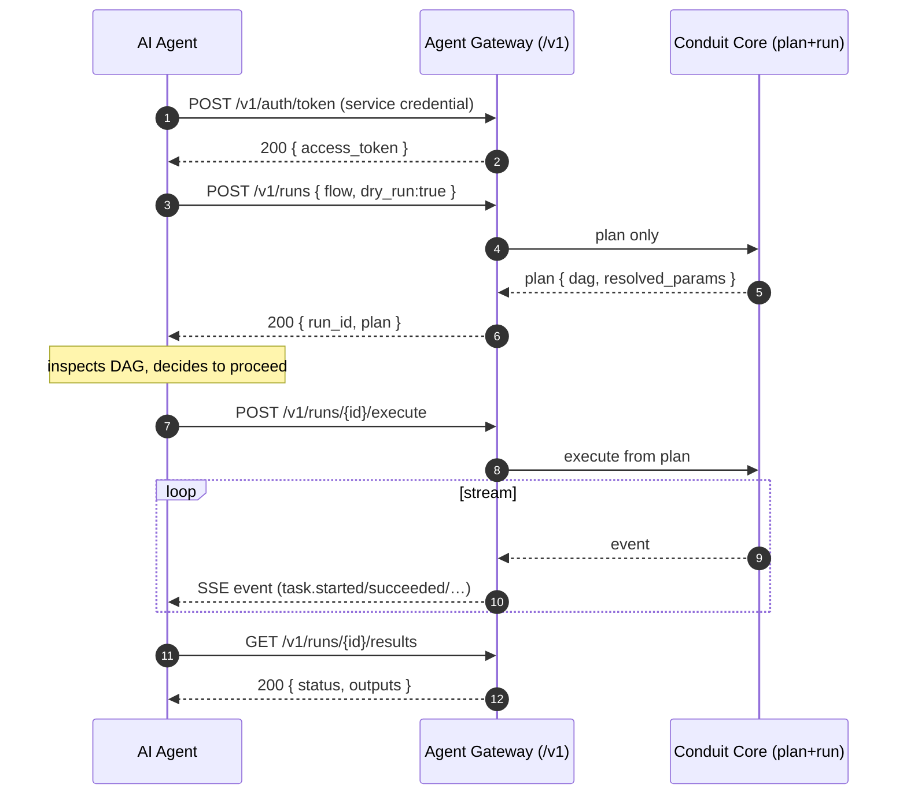

# 90 — Sample Workflows (End-to-End Scenarios)

> **Codename:** Conduit · **Binary:** `conduit` (alias `cdt`) · **Module:** `github.com/conduit-io/conduit`
> **DSL:** FlowDSL (`*.flow`) · **Go:** 1.24+
> **Status:** Samples v1.0 · **Owner:** Developer Experience · **Date:** 2026-07-02

This document walks through **complete, realistic scenarios**. Each includes: a narrative, the `.flow` program,
the exact `conduit` commands, expected human + JSON output, and a **Mermaid DAG** of the plan. Where relevant it
shows `--dry-run`, `--output json`, `conduit graph`, and **resume-after-failure**.

**Related documents**
- [91 — Sample DSL Files](91-sample-dsl-files.md) — construct-by-construct reference for the syntax used here.
- [20 — DSL Grammar](20-dsl-grammar.md) · [25 — Expression Engine](25-expression-engine.md)
- [31 — Execution Runtime](31-execution-runtime.md) · [32 — State Management](32-state-management.md) — checkpoints & resume.
- [40 — Plugin Architecture](40-plugin-architecture.md) · [92 — Sample Plugins](92-sample-plugins.md)
- [44 — Public SDK](44-public-sdk.md) · [62 — Authentication](62-authentication.md) — the AI-agent machine API.

> **CLI surface used below**
> | Command | Purpose |
> |---|---|
> | `conduit run <file>` | Plan + execute a workflow. |
> | `conduit run --dry-run` | Plan only; print the DAG & resolved values, execute nothing. |
> | `conduit run --output json` | Machine-readable event/result stream (also `--json`). |
> | `conduit graph <file>` | Emit the plan DAG (Mermaid/DOT) without running. |
> | `conduit resume <run-id>` | Re-plan from the last checkpoint and continue past a failure. |
> | `conduit runs inspect <run-id>` | Show status, timings, outputs, and failure detail. |

---

## Scenario index

1. [CI Pipeline](#1-ci-pipeline)
2. [Multi-Environment Deployment with Approvals](#2-multi-environment-deployment-with-approvals)
3. [Infrastructure Provisioning](#3-infrastructure-provisioning)
4. [Data ETL Pipeline](#4-data-etl-pipeline)
5. [Release Automation](#5-release-automation)
6. [AI-Agent-Driven Workflow (machine API)](#6-ai-agent-driven-workflow-machine-api)

---

## 1. CI Pipeline

**Narrative.** On every push, check out code, then fan out lint/vet/unit-test in parallel, build once they pass,
and publish a build artifact. This is the canonical "CI as a thin invoker of `conduit run`" pattern.

`ci.flow`:

```flow
flow "1.0"

input commit: string { required = true }

workflow ci {
  description = "Lint + vet + test in parallel, then build & publish."

  task checkout { step { run "git checkout ${{ inputs.commit }}" } }

  task lint { depends_on checkout, step { run "golangci-lint run ./..." } }
  task vet  { depends_on checkout, step { run "go vet ./..." } }
  task test { depends_on checkout, step { run "go test ./... -race -cover" } }

  task build {
    depends_on (lint, vet, test)
    step { run "go build -o bin/app ./cmd/app" }
    output artifact: string = "bin/app"
  }

  task publish {
    depends_on build
    step { uses: oci/push@v2 with { artifact = "${{ tasks.build.outputs.artifact }}", tag = "app:${{ inputs.commit }}" } }
  }
}
```

**DAG:**



**Dry run** (plan only, resolve values, no side effects):

```console
$ conduit run ci.flow --input commit=9f3a1c --dry-run
PLAN r-ci01 (dry-run) — 6 tasks, 4 max-parallel
  checkout            run: git checkout 9f3a1c
  lint     ⇠ checkout run: golangci-lint run ./...
  vet      ⇠ checkout run: go vet ./...
  test     ⇠ checkout run: go test ./... -race -cover
  build    ⇠ lint,vet,test  run: go build -o bin/app ./cmd/app
  publish  ⇠ build     uses: oci/push@v2 { tag=app:9f3a1c }
No steps executed (dry-run).
```

**Headless JSON run** (what a CI system consumes):

```console
$ conduit run ci.flow --input commit=9f3a1c --headless --output json
```
```json
{"event":"run.started","run_id":"r-ci01","workflow":"ci","ts":"2026-07-02T14:00:00Z"}
{"event":"task.started","run_id":"r-ci01","task":"checkout"}
{"event":"task.succeeded","run_id":"r-ci01","task":"checkout","dur_ms":410}
{"event":"task.started","run_id":"r-ci01","task":"lint"}
{"event":"task.started","run_id":"r-ci01","task":"vet"}
{"event":"task.started","run_id":"r-ci01","task":"test"}
{"event":"task.succeeded","run_id":"r-ci01","task":"vet","dur_ms":2300}
{"event":"task.succeeded","run_id":"r-ci01","task":"lint","dur_ms":12100}
{"event":"task.succeeded","run_id":"r-ci01","task":"test","dur_ms":18700}
{"event":"task.succeeded","run_id":"r-ci01","task":"build","dur_ms":2950,"outputs":{"artifact":"bin/app"}}
{"event":"task.succeeded","run_id":"r-ci01","task":"publish","dur_ms":9800}
{"event":"run.succeeded","run_id":"r-ci01","status":"succeeded","dur_ms":33110,"exit_code":0}
```

The final `run.succeeded` event carries the process `exit_code`, so a pipeline gate is just:
`conduit run ci.flow --headless || exit 1`.

---

## 2. Multi-Environment Deployment with Approvals

**Narrative.** Build once, promote the *same* artifact through dev → staging → prod. Staging auto-deploys; prod
requires a human approval gate. Guards (`when:`) make prod conditional on the branch and tag.

`promote.flow`:

```flow
flow "1.0"

input version: string { required = true }
param branch: string = "main"

workflow promote {
  task build {
    step { run "go build -o bin/app ./cmd/app" }
    output image: string = "app:${{ inputs.version }}"
  }

  task dev {
    depends_on build
    step { uses: k8s/apply@v3 with { manifest = "deploy/dev.yaml", image = "${{ tasks.build.outputs.image }}" } }
  }

  task staging {
    depends_on dev
    step { uses: k8s/apply@v3 with { manifest = "deploy/staging.yaml", image = "${{ tasks.build.outputs.image }}" } }
  }

  task prod {
    depends_on staging
    when params.branch == "main" && !inputs.version.contains("-rc")
    step approve { uses: gate/approval@v1 with { approvers = ["sre", "release-mgr"], timeout = "4h" } }
    step rollout {
      depends_on approve
      uses: k8s/apply@v3 with { manifest = "deploy/prod.yaml", image = "${{ tasks.build.outputs.image }}" }
    }
  }
}
```

**DAG:**



**Run** (blocks at the approval gate, then continues):

```console
$ conduit run promote.flow --input version=1.4.0
✔ build     → image=app:1.4.0        (3.0s)
✔ dev                                 (6.2s)
✔ staging                             (7.1s)
⏸ prod · approve   waiting for approval by sre|release-mgr  (run id r-pr42)
```

An approver acts out-of-band (`conduit approvals grant r-pr42 --by sre`), and the run proceeds:

```console
✔ prod · approve   granted by sre    (waited 12m)
✔ prod · rollout                      (21.4s)
Run r-pr42 succeeded in 12m 39s
```

A pre-release tag skips prod entirely:

```console
$ conduit run promote.flow --input version=1.5.0-rc1
✔ build ✔ dev ✔ staging
⊘ prod   skipped (when=false)
```

---

## 3. Infrastructure Provisioning

**Narrative.** Provision a network, then a database and a cluster in parallel (both depend only on the network),
then wire DNS once both are up. Uses `retry`/`timeout` because cloud APIs are flaky, and `on_error` to tear down
partial infra.

`infra.flow`:

```flow
flow "1.0"

param region: string = "us-east-1"

workflow infra {
  secret { CLOUD_API_KEY = ref("vault://kv/infra/cloud#api_key") }

  task network {
    timeout 10m
    retry { max = 3, delay = 5s, backoff = "exponential", when = error.transient }
    step { uses: cloud/network@v4 with { cidr = "10.0.0.0/16", region = "${{ params.region }}", api_key = "${{ secrets.CLOUD_API_KEY }}" } }
    output vpc_id: string = "${{ steps[0].outputs.vpc_id }}"
  }

  task database {
    depends_on network
    step { uses: cloud/rds@v4 with { vpc = "${{ tasks.network.outputs.vpc_id }}", size = "db.r6g.large", api_key = "${{ secrets.CLOUD_API_KEY }}" } }
    on_error { step { uses: cloud/rds@v4 with { destroy = true, api_key = "${{ secrets.CLOUD_API_KEY }}" } } }
  }

  task cluster {
    depends_on network
    step { uses: cloud/eks@v4 with { vpc = "${{ tasks.network.outputs.vpc_id }}", nodes = 3, api_key = "${{ secrets.CLOUD_API_KEY }}" } }
  }

  task dns {
    depends_on (database, cluster)
    step { uses: cloud/dns@v4 with { record = "app.example.com", target = "${{ tasks.cluster.outputs.endpoint }}", api_key = "${{ secrets.CLOUD_API_KEY }}" } }
  }
}
```

**DAG:**



**Graph command** (emit the plan as Mermaid without running):

```console
$ conduit graph infra.flow --format mermaid
flowchart TD
  network --> database
  network --> cluster
  database --> dns
  cluster --> dns
```

---

## 4. Data ETL Pipeline

**Narrative.** Extract from a source, discover partitions from a plugin, transform each partition in parallel
via `for_each`, then load the merged result. Demonstrates dynamic fan-out and JSON output aggregation.

`etl.flow`:

```flow
flow "1.0"

param date: string = "${{ ctx.today }}"

workflow etl {
  task extract {
    step { uses: warehouse/extract@v2 with { source = "orders", date = "${{ params.date }}" } }
    output partitions: list<string> = "${{ steps[0].outputs.partitions }}"
  }

  task transform {
    depends_on extract
    for_each ${{ tasks.extract.outputs.partitions }} as part {
      step { uses: spark/submit@v1 with { job = "clean_orders", partition = "${{ part }}" } }
    }
  }

  task load {
    depends_on transform
    step { uses: warehouse/load@v2 with { target = "analytics.orders", date = "${{ params.date }}" } }
    output rows: int = "${{ steps[0].outputs.rows_loaded }}"
  }
}
```

**DAG** (transform fans out over runtime-discovered partitions):



**JSON run** (note aggregated outputs on the final event):

```console
$ conduit run etl.flow --var date=2026-07-01 --output json | tail -3
```
```json
{"event":"task.succeeded","run_id":"r-etl9","task":"transform","fanout":3,"dur_ms":48200}
{"event":"task.succeeded","run_id":"r-etl9","task":"load","dur_ms":9100,"outputs":{"rows":1284551}}
{"event":"run.succeeded","run_id":"r-etl9","status":"succeeded","dur_ms":61540,"outputs":{"load.rows":1284551}}
```

---

## 5. Release Automation

**Narrative.** Cut a release: verify the tag, build a cross-platform matrix, generate a changelog, create the
GitHub release, and announce. Shows **resume-after-failure** when the announce step fails on a flaky webhook.

`release.flow`:

```flow
flow "1.0"

input tag: string { required = true }

workflow release {
  task verify { step { run "git rev-parse ${{ inputs.tag }}" } }

  task build {
    depends_on verify
    matrix { os = ["linux", "darwin", "windows"], arch = ["amd64", "arm64"] }
    step { run "GOOS=${{ matrix.os }} GOARCH=${{ matrix.arch }} go build -o dist/app-${{ matrix.os }}-${{ matrix.arch }} ./cmd/app" }
  }

  task changelog {
    depends_on verify
    step { uses: git/changelog@v1 with { since = "last-tag", to = "${{ inputs.tag }}" } }
    output notes: string = "${{ steps[0].outputs.markdown }}"
  }

  task gh_release {
    depends_on (build, changelog)
    step { uses: github/release@v2 with { tag = "${{ inputs.tag }}", notes = "${{ tasks.changelog.outputs.notes }}", assets = "dist/*" } }
  }

  task announce {
    depends_on gh_release
    step { uses: slack/post@v1 with { channel = "#releases", text = "Released ${{ inputs.tag }} :rocket:" } }
  }
}
```

**DAG:**



**Run fails at `announce`** (webhook 503). The runtime checkpoints every completed task, so the GitHub release
is *not* recreated on resume:

```console
$ conduit run release.flow --input tag=v1.4.0
✔ verify ✔ build ✔ changelog ✔ gh_release
✘ announce   slack/post@v1: 503 Service Unavailable
Run r-rel7 FAILED at task 'announce' (5/5). Checkpoint saved.
Hint: fix the issue and run  conduit resume r-rel7

$ conduit resume r-rel7
↻ Resuming r-rel7 from checkpoint — 4/5 tasks already complete (skipped).
⊘ verify (cached) ⊘ build (cached) ⊘ changelog (cached) ⊘ gh_release (cached)
✔ announce                          (0.6s)
Run r-rel7 succeeded in 0.7s (resumed)
```

**Inspect** the run's recorded state:

```console
$ conduit runs inspect r-rel7 --output json
```
```json
{
  "run_id": "r-rel7", "workflow": "release", "status": "succeeded", "resumed_from": "checkpoint@4",
  "tasks": [
    {"task":"verify","status":"succeeded","cached":true},
    {"task":"build","status":"succeeded","cached":true,"fanout":6},
    {"task":"changelog","status":"succeeded","cached":true},
    {"task":"gh_release","status":"succeeded","cached":true},
    {"task":"announce","status":"succeeded","attempts":2}
  ]
}
```

See [32 — State Management](32-state-management.md) for the checkpoint format and cache-key derivation, and
[71 — Recovery Strategy](71-recovery-strategy.md) for resume semantics.

---

## 6. AI-Agent-Driven Workflow (machine API)

**Narrative.** An autonomous agent uses Conduit's **machine API** (the Agent Gateway, `POST /v1/runs`, see
[10 §Agent Gateway](10-platform-architecture.md) and [44 — Public SDK](44-public-sdk.md)) to: authenticate,
**plan** a workflow (dry-run to inspect the DAG), **run** it, **stream events**, and **fetch results** — all
without a human at a terminal. The agent chooses next actions based on the plan and streamed events.

**Interaction:**



**1) Authenticate** (service credential → short-lived token; see [62 — Authentication](62-authentication.md)):

```console
$ curl -s -X POST https://conduit.example.com/v1/auth/token \
    -d '{"grant_type":"client_credentials","client_id":"agent-7","client_secret":"…"}'
```
```json
{"access_token":"eyJ…","token_type":"Bearer","expires_in":900,"scope":"runs:write runs:read"}
```

**2) Submit a plan (dry-run)** — the agent inspects the DAG before committing:

```console
$ curl -s -X POST https://conduit.example.com/v1/runs \
    -H "Authorization: Bearer eyJ…" \
    -d @- <<'JSON'
{ "flow_ref": "etl.flow", "params": {"date":"2026-07-01"}, "dry_run": true }
JSON
```
```json
{
  "run_id": "r-ag55",
  "status": "planned",
  "plan": {
    "tasks": ["extract","transform","load"],
    "edges": [["extract","transform"],["transform","load"]],
    "resolved_params": {"date":"2026-07-01"}
  }
}
```

**3) Execute + stream events** (Server-Sent Events; one JSON object per event):

```console
$ curl -sN -X POST https://conduit.example.com/v1/runs/r-ag55/execute \
    -H "Authorization: Bearer eyJ…" -H "Accept: text/event-stream"
event: task.started   data: {"task":"extract"}
event: task.succeeded data: {"task":"extract","outputs":{"partitions":["a","b","c"]}}
event: task.started   data: {"task":"transform","fanout":3}
event: task.succeeded data: {"task":"transform"}
event: task.succeeded data: {"task":"load","outputs":{"rows":1284551}}
event: run.succeeded  data: {"status":"succeeded","dur_ms":61540}
```

**4) Fetch results:**

```console
$ curl -s https://conduit.example.com/v1/runs/r-ag55/results -H "Authorization: Bearer eyJ…"
```
```json
{ "run_id":"r-ag55", "status":"succeeded", "outputs": { "load.rows": 1284551 }, "dur_ms": 61540 }
```

The same surface is available in-process via the Go SDK (`sdk.Client.Runs.Plan/Execute/Stream/Results`, see
[44 — Public SDK](44-public-sdk.md)). The full authenticate → submit → stream → fetch sequence is diagrammed in
[93 §7 AI agent flow](93-sequence-diagrams.md#7-ai-agent-authenticate--submit--stream--fetch).

---

## Cross-references

- Syntax reference for every construct → [91 — Sample DSL Files](91-sample-dsl-files.md), [20 — DSL Grammar](20-dsl-grammar.md)
- Checkpoints, caching, resume → [32 — State Management](32-state-management.md), [71 — Recovery Strategy](71-recovery-strategy.md)
- Plugin actions (`oci`, `k8s`, `cloud`, `git`, `vault`, …) → [92 — Sample Plugins](92-sample-plugins.md), [40 — Plugin Architecture](40-plugin-architecture.md)
- Agent machine API & SDK → [44 — Public SDK](44-public-sdk.md), [62 — Authentication](62-authentication.md)
- Sequence diagrams for these flows → [93 — Sequence Diagrams](93-sequence-diagrams.md)
