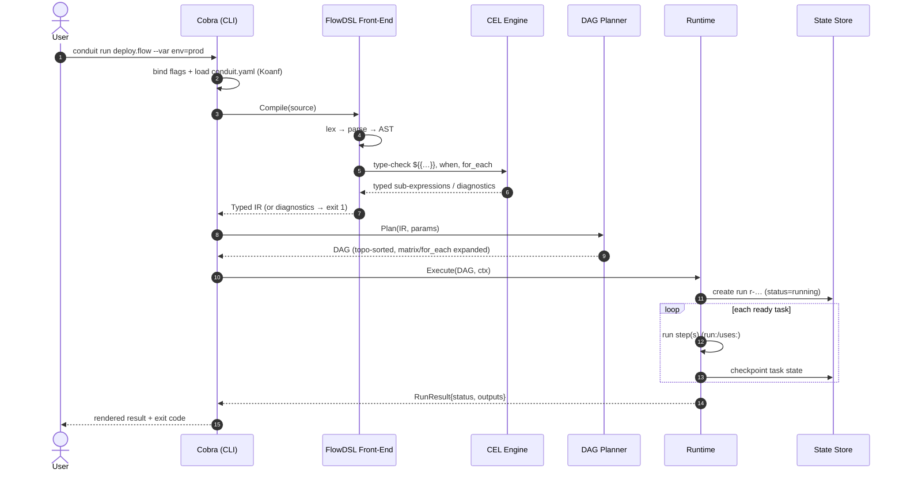
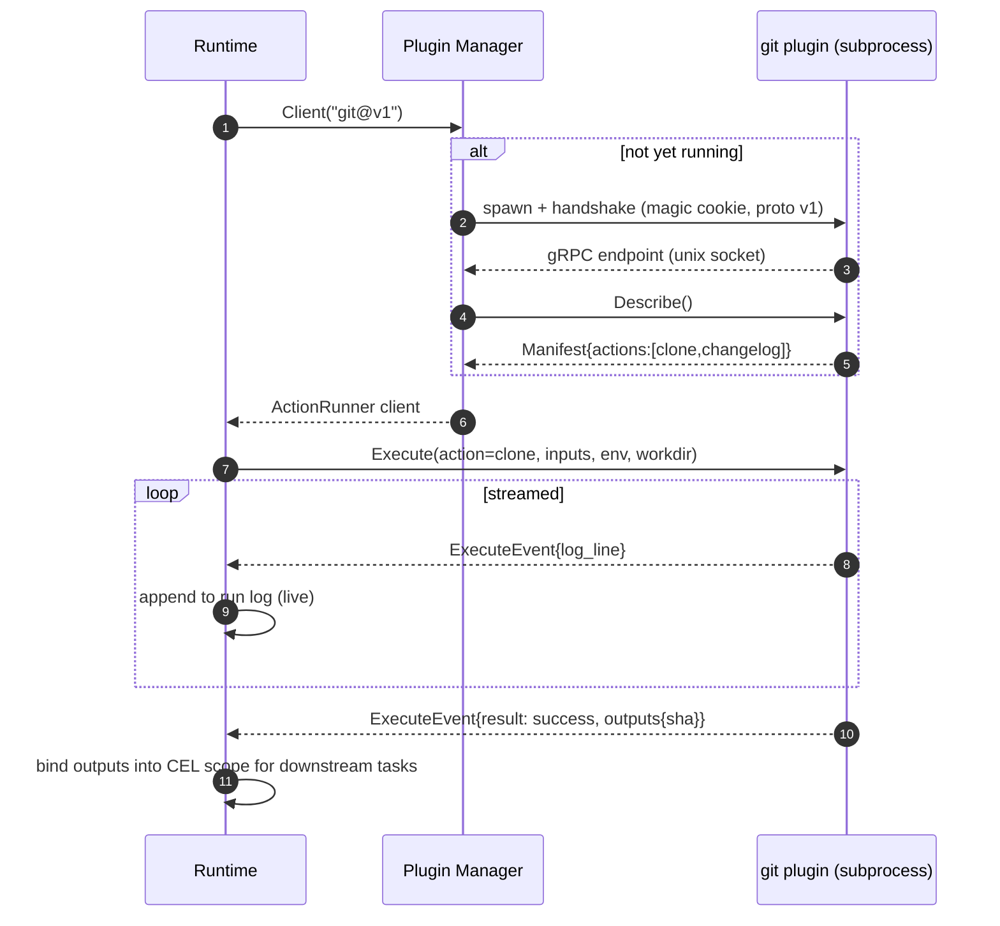
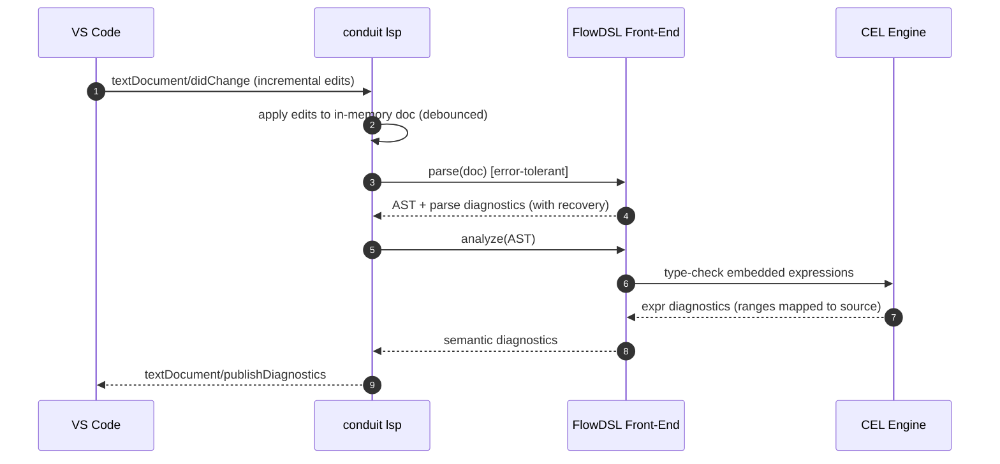
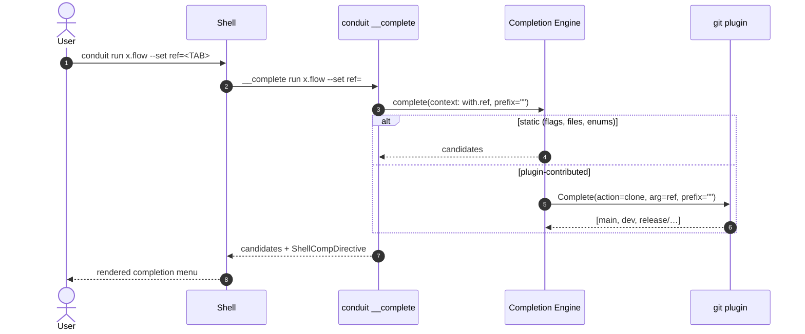
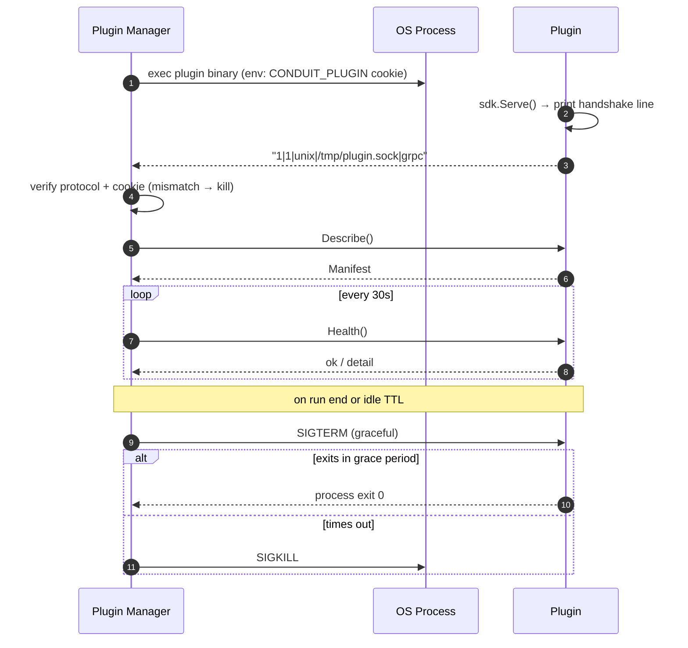
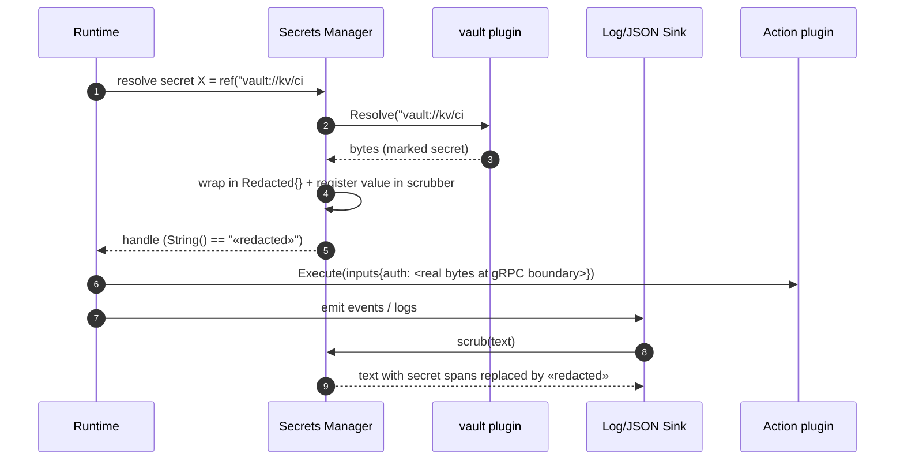
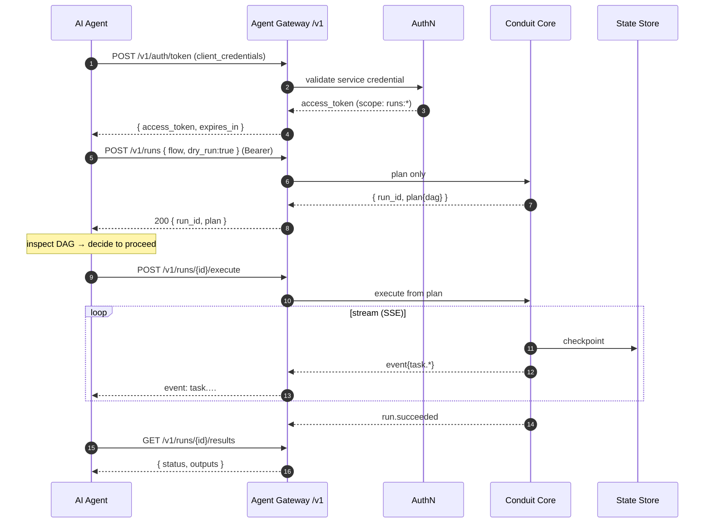
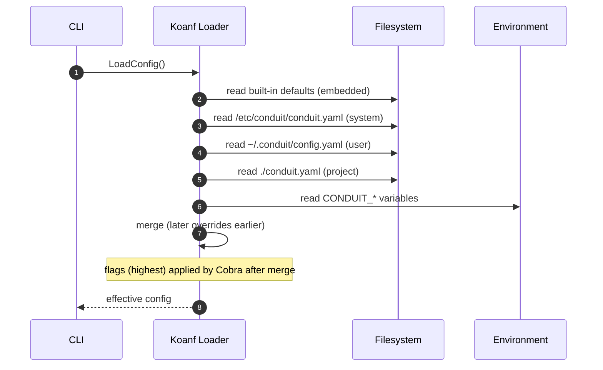
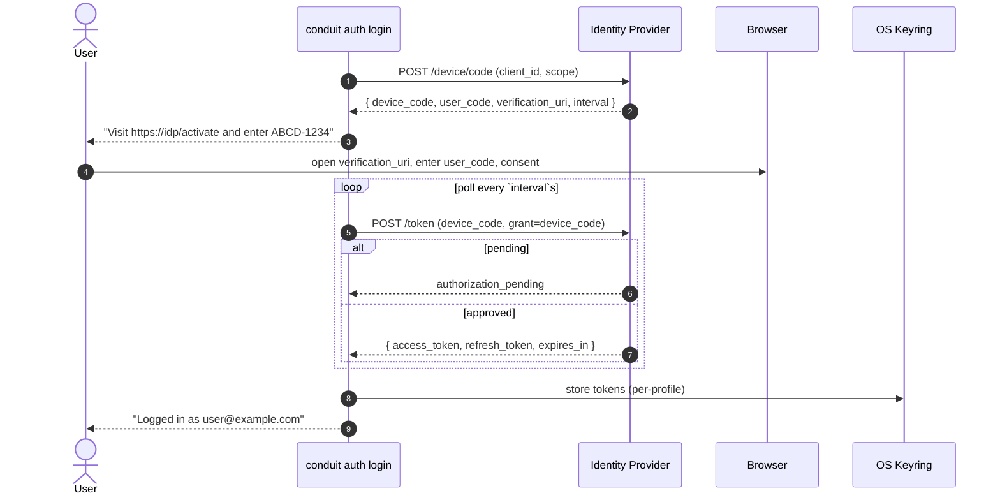

# 93 — Sequence Diagrams Catalog

> **Codename:** Conduit · **Binary:** `conduit` (alias `cdt`) · **Module:** `github.com/conduit-io/conduit`
> **DSL:** FlowDSL (`*.flow`) · **Plugins:** go-plugin/gRPC · **Go:** 1.24+
> **Status:** Samples v1.0 · **Owner:** Platform Architecture · **Date:** 2026-07-02

A catalog of **Mermaid sequence diagrams** for the platform's most important flows. Each diagram is paired with a
short explanation and links to the authoritative design doc for that subsystem. All diagrams render in
GitHub/VS Code per the [diagram convention](README.md#diagram-convention).

**Related documents**
- [10 — Platform Architecture](10-platform-architecture.md) · [11 — Component Architecture](11-component-architecture.md)
- [20 — DSL Grammar](20-dsl-grammar.md) · [31 — Execution Runtime](31-execution-runtime.md) · [32 — State Management](32-state-management.md)
- [40 — Plugin Architecture](40-plugin-architecture.md) · [50 — Completion Engine](50-completion-engine.md) · [56 — LSP Architecture](56-lsp-architecture.md)
- [60 — Configuration](60-configuration.md) · [61 — Secrets Management](61-secrets-management.md) · [62 — Authentication](62-authentication.md)
- [90 — Sample Workflows](90-sample-workflows.md) · [92 — Sample Plugins](92-sample-plugins.md)

## Catalog

| # | Flow | Doc |
|---|---|---|
| 1 | [CLI invocation → parse → plan → execute](#1-cli-invocation--parse--plan--execute) | [31](31-execution-runtime.md) |
| 2 | [FlowDSL run with plugin action call over gRPC](#2-flowdsl-run-with-plugin-action-over-grpc) | [40](40-plugin-architecture.md) |
| 3 | [LSP didChange → parse → diagnostics](#3-lsp-didchange--parse--diagnostics) | [56](56-lsp-architecture.md) |
| 4 | [Shell dynamic completion via `__complete`](#4-shell-dynamic-completion-via-__complete) | [50](50-completion-engine.md) |
| 5 | [Plugin load / handshake / health / shutdown](#5-plugin-load--handshake--health--shutdown) | [40](40-plugin-architecture.md) |
| 6 | [Secret resolution + redaction](#6-secret-resolution--redaction) | [61](61-secrets-management.md) |
| 7 | [AI agent: authenticate → submit → stream → fetch](#7-ai-agent-authenticate--submit--stream--fetch) | [44](44-public-sdk.md) |
| 8 | [Checkpoint + resume after crash](#8-checkpoint--resume-after-crash) | [32](32-state-management.md) |
| 9 | [Config load precedence](#9-config-load-precedence) | [60](60-configuration.md) |
| 10 | [Auth login device flow](#10-auth-login-device-flow) | [62](62-authentication.md) |

---

## 1. CLI invocation → parse → plan → execute

The end-to-end happy path of `conduit run`. Cobra parses flags, the FlowDSL front-end lexes/parses/analyzes the
source (with CEL type-checking), the planner builds the DAG, and the runtime executes it, checkpointing state.



**Explanation.** Parsing and planning have **no side effects** — only the runtime does. Diagnostics from either
the FlowDSL front-end or CEL short-circuit before any task runs. Every task transition is checkpointed, enabling
diagram [§8](#8-checkpoint--resume-after-crash). See [31 — Execution Runtime](31-execution-runtime.md).

---

## 2. FlowDSL run with plugin action over gRPC

What happens when a step is `uses: git/clone@v1`. The runtime asks the Plugin Manager for a client, which
ensures the plugin subprocess is running, then invokes the streaming `Execute` RPC.



**Explanation.** The plugin is a **separate process**; the task `context.Context` is threaded into the gRPC call
so cancellation (Ctrl-C, timeout, policy) aborts the RPC and signals the plugin. Log lines stream in real time
via a server-streaming RPC. The `transient` flag on the result feeds `retry { when = error.transient }`. See
[40 — Plugin Architecture](40-plugin-architecture.md) and [92 — Sample Plugins](92-sample-plugins.md).

---

## 3. LSP didChange → parse → diagnostics

The editor sends incremental edits; the LSP server re-runs the **same** front-end used at runtime and publishes
diagnostics. Error-tolerant parsing means a syntax error yields diagnostics, not a crash.



**Explanation.** Because the LSP shares the front-end with `conduit run`, editor squiggles and runtime errors
never diverge. CEL diagnostics carry byte offsets back to the original `${{ … }}` span. Parsing recovers at
block boundaries (see [20 §13](20-dsl-grammar.md#13-grammar-versioning)). See [56 — LSP Architecture](56-lsp-architecture.md).

---

## 4. Shell dynamic completion via `__complete`

Cobra's hidden `__complete` command powers shell completion. When the completion is a plugin-contributed value
(e.g. a git branch), the request is routed to the plugin's `Complete` RPC.



**Explanation.** The `ShellCompDirective` tells the shell whether to add a space, filter further, etc. Plugin
completions fail **soft** — an error yields no candidates rather than breaking the shell. The same code path
serves LSP completion. See [50 — Completion Engine](50-completion-engine.md) and the `git` plugin in
[92 (b)](92-sample-plugins.md#b-git--actions--completions-plugin).

---

## 5. Plugin load / handshake / health / shutdown

The full lifecycle of a plugin subprocess: spawn, magic-cookie handshake, capability discovery, periodic health
checks, and graceful shutdown (with a kill fallback).



**Explanation.** The handshake line negotiates transport (unix socket / named pipe) and protocol version before
any RPC. Health checks detect hung plugins; a failed health check quarantines the plugin and fails in-flight
tasks with a retryable error. Idle plugins are reaped after a TTL. See [40 — Plugin Architecture](40-plugin-architecture.md).

---

## 6. Secret resolution + redaction

A `secret { X = ref("vault://…") }` binding is resolved lazily by a secret-provider plugin, wrapped in a
redacting type, injected into the action, and scrubbed from all logs/output.



**Explanation.** The plaintext exists only inside the Secrets Manager and at the gRPC boundary of the consuming
plugin; everywhere else it is a `Redacted` handle. The scrubber registers each resolved value so even accidental
interpolation into a log line is masked. See [61 — Secrets Management](61-secrets-management.md) and the `vault`
plugin in [92 (c)](92-sample-plugins.md#c-vault--secret-provider-plugin).

---

## 7. AI agent: authenticate → submit → stream → fetch

An autonomous agent drives Conduit through the machine API: get a token, submit a plan (dry-run), execute it,
stream events, and fetch results. Mirrors [90 §6](90-sample-workflows.md#6-ai-agent-driven-workflow-machine-api).



**Explanation.** `dry_run:true` returns the plan without side effects so the agent can reason about the DAG
before committing. Execution streams the same events humans see, over SSE (or gRPC stream). All calls are scoped
by the bearer token. See [44 — Public SDK](44-public-sdk.md) and [62 — Authentication](62-authentication.md).

---

## 8. Checkpoint + resume after crash

Every completed task is checkpointed to the State Store. After a crash, `conduit resume <run-id>` re-plans and
skips already-completed tasks, continuing from the failure boundary.

```mermaid
sequenceDiagram
  autonumber
  actor User
  participant RT as Runtime
  participant ST as State Store (BoltDB)
  Note over RT: initial run
  RT->>ST: checkpoint verify=ok, build=ok, gh_release=ok
  RT--xRT: crash / failure at 'announce'
  Note over User: later
  User->>RT: conduit resume r-rel7
  RT->>ST: load run r-rel7 + checkpoints
  ST-->>RT: completed={verify,build,changelog,gh_release}
  RT->>RT: re-plan; mark completed tasks cached (skip)
  loop remaining tasks
    RT->>RT: execute 'announce'
    RT->>ST: checkpoint announce=ok
  end
  RT-->>User: run succeeded (resumed)
```

**Explanation.** Cache keys are derived from task inputs, so a completed side-effecting task (e.g. a GitHub
release) is **not** re-executed on resume. This is the mechanism behind [90 §5](90-sample-workflows.md#5-release-automation).
See [32 — State Management](32-state-management.md) and [71 — Recovery Strategy](71-recovery-strategy.md).

---

## 9. Config load precedence

Koanf merges configuration from multiple sources into a single view. Later sources override earlier ones; the
final effective config drives CLI defaults, plugin sources, and runtime tuning.



**Explanation.** Precedence (lowest→highest): **defaults → system → user → project → env → flags**. `${VAR}`
expansion in `conduit.yaml` happens during load. The resolved config is immutable for the process lifetime. See
[60 — Configuration](60-configuration.md).

---

## 10. Auth login device flow

`conduit auth login` uses the OAuth 2.0 **device authorization grant** so a headless CLI can authenticate via a
browser on any device, then stores the resulting token in the OS keyring.



**Explanation.** No client secret is needed on the CLI; the user authorizes in a browser while the CLI polls at
the server-specified `interval` (honoring `slow_down`). Tokens are stored in the OS keyring and auto-refreshed;
the same tokens authorize the machine API in [§7](#7-ai-agent-authenticate--submit--stream--fetch). See
[62 — Authentication](62-authentication.md).

---

## Cross-references

- Runtime execution & cancellation → [31 — Execution Runtime](31-execution-runtime.md)
- Plugin lifecycle & gRPC transport → [40 — Plugin Architecture](40-plugin-architecture.md), [92 — Sample Plugins](92-sample-plugins.md)
- LSP & completion → [56 — LSP Architecture](56-lsp-architecture.md), [50 — Completion Engine](50-completion-engine.md)
- Secrets, config, auth → [61](61-secrets-management.md), [60](60-configuration.md), [62](62-authentication.md)
- State, checkpoints, recovery → [32 — State Management](32-state-management.md), [71 — Recovery Strategy](71-recovery-strategy.md)
- End-to-end scenarios these diagrams support → [90 — Sample Workflows](90-sample-workflows.md)
