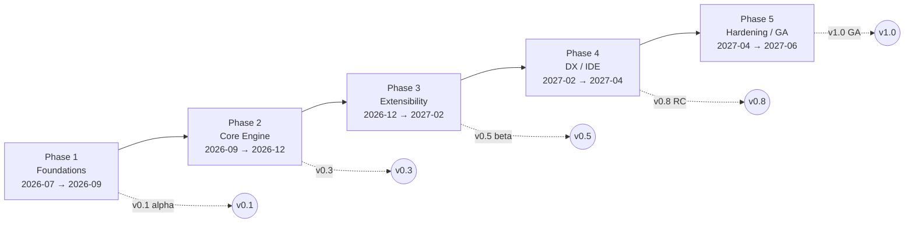
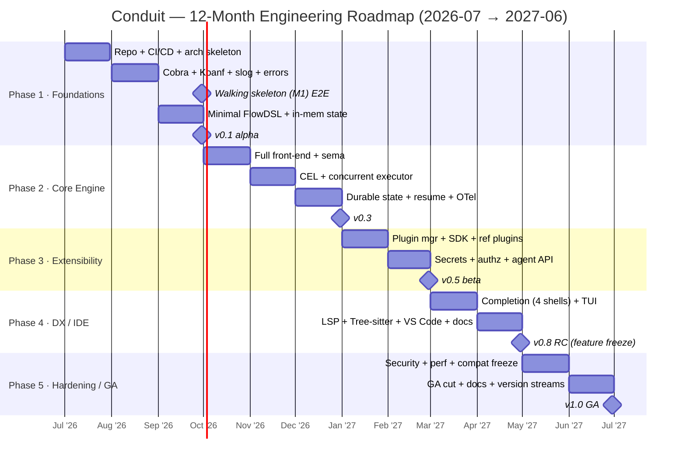
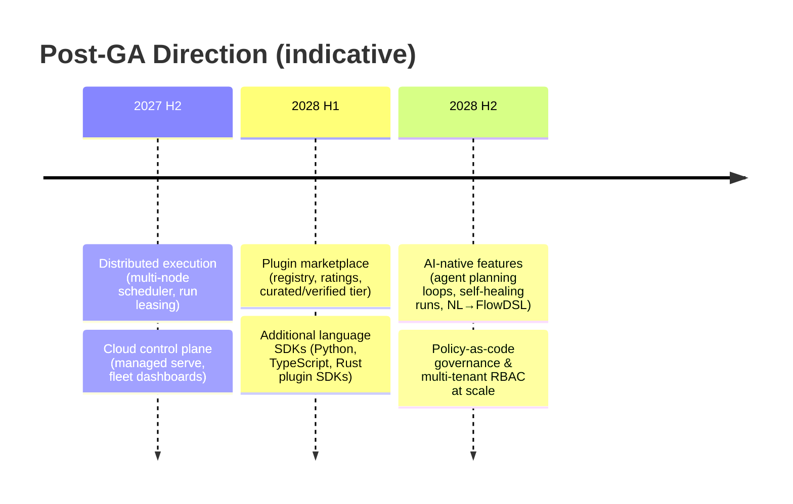

# 95 — 12-Month Engineering Roadmap

> **Platform:** Conduit · **Binary:** `conduit` (alias `cdt`) · **Module:** `github.com/conduit-io/conduit`
> **Go:** 1.24+ · **Status:** Program Baseline v1.0 · **Owner:** TPM / Platform Architecture · **Date:** 2026-07-02
> **Horizon:** 2026-07 → 2027-06 (12 months) · **Release train:** v0.1 alpha → v0.5 beta → v1.0 GA

**Related documents:** [96 — Milestone Plan](96-milestone-plan.md) · [97 — Risk Register](97-risk-register.md) · [98 — Tech Debt Register](98-tech-debt-register.md) · [99 — ADRs](99-adrs.md) · [00 — Executive Summary](00-executive-summary.md) · [03 — Functional Requirements](03-functional-requirements.md) · [04 — Non-Functional Requirements](04-non-functional-requirements.md) · [05 — Security Requirements](05-security-requirements.md) · [10 — Platform Architecture](10-platform-architecture.md)

---

## 1. Purpose & how to read this roadmap

This document is the **outcome-oriented, time-boxed plan** for taking Conduit from an empty repository to a supportable **v1.0 GA** in twelve months. It is organized into **five phases** delivered across **four quarters**, decomposed into **months**. Each period declares:

- **Themes** — the strategic intent for the period.
- **Epics** — coarse bodies of work (each maps to milestones in [96 — Milestone Plan](96-milestone-plan.md)).
- **Deliverables** — concrete, demoable artifacts.
- **Exit criteria** — the objective, checkable gate to leave the period.
- **Requirement coverage** — the FR/NFR/SEC IDs advanced (see [03](03-functional-requirements.md) / [04](04-non-functional-requirements.md) / [05](05-security-requirements.md)).
- **Staffing** — which of the ~8 engineers are on point.

> **Golden rule:** dates are *targets*, exit criteria are *contracts*. A phase does not "end" on its calendar date; it ends when its exit criteria are met. Slippage is absorbed by the buffer built into Hardening (Q4), never by skipping exit gates.

---

## 2. Phase model

| Phase | Window | Theme | Release exit | Milestones |
|---|---|---|---|---|
| **1 · Foundations** | 2026-07 → 2026-09 | Walking skeleton: repo, CI, hexagonal skeleton, CLI + minimal DSL end-to-end | **v0.1 alpha** | M0, M1 |
| **2 · Core Engine** | 2026-09 → 2026-12 | Real compiler, DAG planner, executor, state persistence, expressions | **v0.3** | M2, M3, M4 |
| **3 · Extensibility** | 2026-12 → 2027-02 | Plugins over gRPC, SDK, secrets, config, agent API | **v0.5 beta** | M5, M6 |
| **4 · DX / IDE** | 2027-02 → 2027-04 | Completion, LSP, Tree-sitter, TUI, docs-gen, VS Code | **v0.8 RC** | M7, M8 |
| **5 · Hardening / GA** | 2027-04 → 2027-06 | Security review, perf, compat freeze, docs, GA | **v1.0 GA** | M9 |

---

## 3. Team & staffing assumptions

Team of **~8 engineers** plus a TPM. Squads are stable; people flex across squads as phases shift load.

| Role / squad | Count | Primary ownership | Peak-load phases |
|---|---|---|---|
| **Platform** (runtime, DAG, state, concurrency) | 2 | [10](10-platform-architecture.md), [30](30-workflow-dag.md), [31](31-execution-runtime.md), [32](32-state-management.md) | P1, P2 |
| **Language / DSL** (lexer, parser, AST, sema, CEL) | 2 | [20](20-dsl-grammar.md)–[25](25-expression-engine.md) | P2, P4 |
| **DX / IDE** (completion, LSP, TUI, tree-sitter, docs-gen) | 2 | [50](50-completion-engine.md)–[58](58-tree-sitter-grammar.md), [82](82-developer-experience.md) | P4 |
| **Security** (secrets, authn/authz, supply chain, threat model) | 1 | [61](61-secrets-management.md)–[63](63-authorization.md), [69](69-threat-model.md) | P3, P5 |
| **PM / TPM + Eng lead** | 1 | roadmap, milestones, risk, release train | all |

**Cross-cutting on-call:** each squad owns test coverage for its surface per [72 — Testing Strategy](72-testing-strategy.md). One "release engineer of the week" rotation owns the CI/CD pipeline ([81](81-build-release-cicd.md)) from M1 onward.

**Capacity model:** ~8 engineers × ~65% focus factor ≈ **5.2 effective eng-months/month**. Q4 reserves ~25% of capacity as hardening/bug buffer.

---

## 4. Quarter & month detail

### 4.1 Quarter 1 (2026-07 → 2026-09) — **Foundations**

**Themes:** stand up the engineering system; prove the architecture end-to-end with a **walking skeleton** (M1) that lexes a trivial `.flow`, plans a 2-node DAG, and "executes" via a null capability — no plugins, in-memory state.

| Month | Epics | Deliverables | Requirement coverage |
|---|---|---|---|
| **2026-07** | Repo bootstrap; hexagonal skeleton; CI/CD; ADR ratification | Monorepo single-module layout ([80](80-repository-structure.md)); `conduit version`; GitHub Actions matrix build (linux/macos/windows) with lint+test+`go vet`+depguard arch rule; ADR-0001–0016 ratified ([99](99-adrs.md)) | NFR (portability, build), foundation for all FR |
| **2026-08** | Minimal Cobra tree; Koanf config; slog logging; error taxonomy | `conduit run/plan/version/config` skeleton; `conduit.yaml` load with defaults→file→env→flag precedence ([60](60-configuration.md)); structured `slog` logs ([65](65-logging.md)); typed `ConduitError` ([70](70-error-handling.md)) | FR (CLI framework), NFR (config, observability) |
| **2026-09** | Walking skeleton E2E; minimal FlowDSL; in-memory state | Participle grammar for `workflow{task{}}` subset ([20](20-dsl-grammar.md),[22](22-parser-design.md)); DAG build + topo sort + cycle check ([30](30-workflow-dag.md)); in-memory `StateStore`; **`conduit run hello.flow` runs 2 tasks end-to-end** | FR (compile, plan, run), NFR (testability) |

**Exit criteria (→ v0.1 alpha):**
1. `conduit run` compiles a minimal `.flow`, builds a DAG, executes serially, prints a run summary and correct exit code.
2. CI is green on all three OSes; arch-lint rule enforces domain purity ([10 §2.1](10-platform-architecture.md)).
3. ADRs 0001–0016 are **Accepted**; [99](99-adrs.md) published.
4. Test coverage ≥ 60% on domain packages; `Clock`/`FS` ports fake-able ([72](72-testing-strategy.md)).

**Staffing:** Platform ×2 (skeleton, DAG), Language ×2 (minimal grammar), Security ×1 (supply-chain CI baseline: pinned deps, `govulncheck`), DX ×2 ramp on completion/LSP research spikes.

---

### 4.2 Quarter 2 (2026-09 → 2026-12) — **Core Engine**

**Themes:** replace every skeleton stub with the real thing. Full FlowDSL front-end, CEL expression engine, concurrent DAG executor, and **durable state** (BoltDB) with checkpoint/resume.

| Month | Epics | Deliverables | Requirement coverage |
|---|---|---|---|
| **2026-10** | Full FlowDSL front-end; semantic analysis | Complete lexer with interpolation states ([21](21-lexer-design.md)); full Participle grammar + error-tolerant recovery ([22](22-parser-design.md)); AST + visitor + `conduit fmt` ([23](23-ast-design.md)); name resolution + typing diagnostics ([24](24-semantic-analysis.md)) | FR (DSL compile, diagnostics) |
| **2026-11** | CEL engine; concurrent executor; failure policy | CEL-Go embedding, function library, sandbox limits ([25](25-expression-engine.md)); `when`/`for_each`/`matrix` semantics; bounded worker-pool scheduler with `errgroup`/semaphore ([31](31-execution-runtime.md)); fail-fast vs continue policy | FR (expressions, parallelism), NFR (performance), SEC (expression sandbox) |
| **2026-12** | Durable state; checkpoint/resume; recovery | BoltDB `StateStore` adapter ([32](32-state-management.md), ADR-0012); event-sourced run log (ADR-0011); `conduit run --resume`; retries/backoff ([71](71-recovery-strategy.md)); OTel traces/metrics wiring ([64](64-observability.md), ADR-0013) | FR (state, resume, retry), NFR (reliability, observability) |

**Exit criteria (→ v0.3):**
1. A realistic multi-step `.flow` (fan-out/fan-in, `when` guards, `for_each`) compiles and runs concurrently with correct DAG ordering.
2. A killed run **resumes** from the last checkpoint with no duplicate side effects on idempotent tasks.
3. CEL expressions are type-checked at compile time; a sandbox-limit test suite passes (no unbounded loops/regex, cost limits enforced) — see [RISK-001](97-risk-register.md).
4. Traces/metrics export over OTLP; coverage ≥ 70% engine-wide.

**Staffing:** Language ×2 (front-end, CEL), Platform ×2 (executor, state), Security ×1 (CEL sandbox hardening + tests), DX ×2 begin completion engine ([50](50-completion-engine.md)) and LSP scaffolding.

---

### 4.3 Quarter 3 (2026-12 → 2027-02) — **Extensibility**

**Themes:** open the platform. Plugins over go-plugin/gRPC with process isolation and signature verification; the public **Extension SDK**; secrets/auth; and the **AI-agent API** surface.

| Month | Epics | Deliverables | Requirement coverage |
|---|---|---|---|
| **2027-01** | Plugin manager; capability contract; SDK | go-plugin handshake + gRPC `CapabilityProvider` ([40](40-plugin-architecture.md), ADR-0006); plugin lifecycle/health/restart supervision; Go Extension SDK v0 ([41](41-extension-sdk.md),[44](44-public-sdk.md)); command metadata model ([42](42-command-metadata.md)); 2 reference plugins (`http`, `git`) ([92](92-sample-plugins.md)) | FR (plugins, capabilities, extension) |
| **2027-02** | Secrets & authz; supply chain; agent API | `SecretResolver` (env/keychain/Vault) ([61](61-secrets-management.md), ADR-0018); cosign plugin signing + verify on load ([69](69-threat-model.md)); CEL-based authz policies ([63](63-authorization.md), ADR-0019); AI-agent JSON/gRPC gateway (`/v1/*`) with machine-readable capability catalog ([44](44-public-sdk.md), ADR-0017) | FR (secrets, agent API), SEC (signing, authz, least-privilege) |

**Exit criteria (→ v0.5 beta):**
1. A third-party plugin can be built with the SDK, **signed**, distributed, verified on load, and invoked — with a crashing plugin isolated and restarted, not corrupting the host ([RISK-002](97-risk-register.md), [RISK-007](97-risk-register.md)).
2. Secrets resolve from at least env + one real backend; secrets never appear in logs/state (redaction test passes).
3. An AI agent can query the capability catalog and execute a workflow through the gateway with authz enforced.
4. Beta docs + `conduit init` scaffolding published; external design-partner onboarding begins.

**Staffing:** Platform ×2 (plugin manager, gateway), Security ×1 (signing, authz, secrets — peak load), Language ×2 (SDK codegen, metadata), DX ×2 (continue LSP/completion).

---

### 4.4 Quarter 4a (2027-02 → 2027-04) — **DX / IDE**

**Themes:** make Conduit delightful. Shell completion across all four shells, a real LSP reusing the compiler, Tree-sitter highlighting, the Bubble Tea TUI, docs generation, and a VS Code extension.

| Month | Epics | Deliverables | Requirement coverage |
|---|---|---|---|
| **2027-03** | Completion engine; all shells; TUI | Dynamic completion engine ([50](50-completion-engine.md)); bash/zsh/fish/PowerShell scripts + edge-case matrix ([51](51-bash-completion.md)–[54](54-powershell-completion.md), [RISK-005](97-risk-register.md)); Bubble Tea TUI for run monitoring ([82](82-developer-experience.md), ADR-0007) | FR (completion, TUI), NFR (usability) |
| **2027-04** | LSP; Tree-sitter; VS Code; docs-gen | Custom LSP (diagnostics/hover/completion/go-to-def) reusing front-end ([55](55-intellisense.md),[56](56-lsp-architecture.md), ADR-0008); `tree-sitter-flow` grammar ([58](58-tree-sitter-grammar.md), ADR-0009); VS Code extension ([57](57-vscode-extension.md)); `conduit docs` generation framework ([43](43-documentation-generation.md)) | FR (IDE, highlighting, docs), NFR (LSP latency) |

**Exit criteria (→ v0.8 RC):**
1. Completion works correctly in bash/zsh/fish/PowerShell for commands, flags, and dynamic values on all three OSes ([RISK-005](97-risk-register.md)).
2. LSP delivers diagnostics that **match** `conduit run` exactly, with p95 completion latency within [04 NFR](04-non-functional-requirements.md) budget ([RISK-006](97-risk-register.md)).
3. VS Code extension installs, highlights `.flow`, and drives the LSP.
4. Feature freeze declared; only bugfixes + hardening thereafter.

**Staffing:** DX ×2 (peak load — all IDE surfaces), Language ×2 (Tree-sitter grammar mirrors Participle grammar, LSP semantics), Platform ×2 (TUI runtime hooks, docs-gen from metadata), Security ×1 (begin GA threat-model re-review).

---

### 4.5 Quarter 4b (2027-04 → 2027-06) — **Hardening / GA**

**Themes:** earn the 1.0. Independent security review, performance/scale validation, API/compat freeze, complete docs, and the GA cutover with the four-stream version policy live.

| Month | Epics | Deliverables | Requirement coverage |
|---|---|---|---|
| **2027-05** | Security & perf hardening; compat freeze | Full threat-model closure ([69](69-threat-model.md)); external pen-test of CEL/plugin/secret surfaces; perf/scale benchmarks vs NFR budgets ([73](73-performance-scalability.md)); API compatibility freeze + migration guide ([83](83-api-standards-versioning.md), ADR-0015) | NFR (perf, scale), SEC (all) |
| **2027-06** | GA release; docs complete; version streams | v1.0 GA cut; complete docs site; four independent version streams (CLI / FlowDSL grammar / plugin protocol / config schema) published (ADR-0015); deprecation & support policy ([83](83-api-standards-versioning.md)) | all FR/NFR/SEC baseline |

**Exit criteria (→ v1.0 GA):**
1. Zero open **critical/high** security findings; threat model fully mitigated or accepted with owner sign-off ([97](97-risk-register.md)).
2. Performance budgets met on reference workloads; no P1 defects open for 2 weeks.
3. Backward-compatibility guarantees documented per version stream; migration guide published.
4. Tech-debt register shows **no GA-blocking debt** open ([98](98-tech-debt-register.md)); documented alpha shortcuts either resolved or formally accepted.
5. All FR marked *Met*; NFR/SEC verified by test evidence.

**Staffing:** Security ×1 (peak — review/pen-test coordination), all squads on bug burn-down + docs; TPM drives GA readiness review.

---

## 5. Master Gantt

---

## 6. Release train

| Release | Target | Gate | Audience | Compat guarantee |
|---|---|---|---|---|
| **v0.1 alpha** | 2026-09-30 | Phase 1 exit | Internal only | None — anything can change |
| **v0.3** | 2026-12-31 | Phase 2 exit | Internal + trusted early users | Best-effort; breaking changes announced |
| **v0.5 beta** | 2027-02-28 | Phase 3 exit | Design partners | FlowDSL grammar `flow/1.0` frozen for beta; plugin proto beta-stable |
| **v0.8 RC** | 2027-04-30 | Phase 4 exit (feature freeze) | Broader beta | API surface frozen; only bugfixes |
| **v1.0 GA** | 2027-06-30 | Phase 5 exit | General availability | Full SemVer guarantees per [83](83-api-standards-versioning.md); four version streams (ADR-0015) |

Release engineering, signing, and channel policy: [81 — Build/Release/CI-CD](81-build-release-cicd.md).

---

## 7. Requirement traceability (roadmap → requirements)

| Requirement group | First advanced | Substantially complete | Verified (GA) |
|---|---|---|---|
| **FR — CLI framework, config** | 2026-08 (P1) | 2026-09 (v0.1) | v1.0 |
| **FR — DSL compile/plan/run** | 2026-09 (P1) | 2026-12 (v0.3) | v1.0 |
| **FR — expressions (CEL)** | 2026-11 (P2) | 2026-11 (v0.3) | v1.0 |
| **FR — state/resume/retry** | 2026-12 (P2) | 2026-12 (v0.3) | v1.0 |
| **FR — plugins/SDK/agent API** | 2027-01 (P3) | 2027-02 (v0.5) | v1.0 |
| **FR — completion/LSP/IDE/docs** | 2027-03 (P4) | 2027-04 (v0.8) | v1.0 |
| **NFR — reliability, perf, portability** | 2026-07 (P1) | ongoing | 2027-05 (P5) |
| **SEC — sandbox, signing, secrets, authz** | 2026-11 (P2) | 2027-02 (v0.5) | 2027-05 (P5) |

See [03](03-functional-requirements.md) / [04](04-non-functional-requirements.md) / [05](05-security-requirements.md) for the authoritative requirement text, and [96 — Milestone Plan](96-milestone-plan.md) for milestone-level DoD.

---

## 8. Post-GA outlook / future roadmap (2027-07+)

Beyond v1.0, Conduit evolves from a single-node CLI into a distributed automation substrate. These are **direction, not commitments**; each becomes its own program with its own ADRs.

| Theme | What it adds | Foundations already in place |
|---|---|---|
| **Distributed execution** | Multi-node scheduler, work-stealing, run leasing across daemons | `conduit serve` topology + Postgres state ([10 §10](10-platform-architecture.md)), event-sourced state (ADR-0011) |
| **Cloud control plane** | Managed hosting, fleet-wide run history, dashboards, quotas | Agent API gateway (ADR-0017), OTel telemetry (ADR-0013) |
| **Plugin marketplace** | Registry, discovery, ratings, verified/curated trust tier | Signed plugins + go-plugin proto (ADR-0006), supply-chain controls ([69](69-threat-model.md)) |
| **More language SDKs** | Python/TS/Rust plugin SDKs (gRPC is language-neutral) | gRPC capability contract already language-agnostic (ADR-0006) |
| **AI-native features** | Agentic planning loops, self-healing/retry policies, NL→FlowDSL generation | Machine-readable capability catalog + agent API (ADR-0017), sandboxed CEL (ADR-0005) |

**Explicitly deferred past GA** (see [98 — Tech Debt](98-tech-debt-register.md)): multi-node scheduling, WASM plugin sandbox, hosted control plane, and non-Go plugin SDKs are **out of scope for v1.0** and tracked as planned debt, not gaps.
