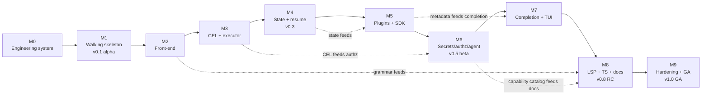

# 96 — Milestone Plan

> **Platform:** Conduit · **Binary:** `conduit` (alias `cdt`) · **Module:** `github.com/conduit-io/conduit`
> **Go:** 1.24+ · **Status:** Program Baseline v1.0 · **Owner:** TPM / Platform Architecture · **Date:** 2026-07-02
> **Horizon:** 2026-07 → 2027-06 · **Milestones:** M0 … M9

**Related documents:** [95 — Roadmap](95-roadmap.md) · [97 — Risk Register](97-risk-register.md) · [98 — Tech Debt Register](98-tech-debt-register.md) · [99 — ADRs](99-adrs.md) · [03 — Functional Requirements](03-functional-requirements.md) · [04 — Non-Functional Requirements](04-non-functional-requirements.md) · [05 — Security Requirements](05-security-requirements.md) · [72 — Testing Strategy](72-testing-strategy.md) · [81 — Build/Release/CI-CD](81-build-release-cicd.md)

---

## 1. Purpose

This document defines the **milestone-level plan** that operationalizes the phased [95 — Roadmap](95-roadmap.md). Where the roadmap describes *themes and quarters*, this document defines **checkable milestones (M0–M9)** with objectives, scope, **entry/exit criteria**, deliverables, dependencies, target dates, and a **demo/acceptance definition** per milestone.

Each milestone is a **potentially shippable increment** with an explicit **Definition of Done (DoD)**. Milestones are numbered; **M1 is the "walking skeleton"** — the thinnest possible end-to-end slice that exercises every architectural layer.

**Milestone contract:** a milestone is *Done* only when (a) all exit criteria pass, (b) the acceptance demo runs on a clean checkout on all three OSes, and (c) the per-milestone DoD checklist is fully green.

---

## 2. Milestone → phase → release map

| Milestone | Phase ([95](95-roadmap.md)) | Target date | Release train |
|---|---|---|---|
| **M0** — Inception & engineering system | 1 · Foundations | 2026-07-31 | (pre-alpha) |
| **M1** — Walking skeleton (E2E) | 1 · Foundations | 2026-09-30 | **v0.1 alpha** |
| **M2** — FlowDSL front-end complete | 2 · Core Engine | 2026-10-31 | v0.2 |
| **M3** — Expressions + concurrent executor | 2 · Core Engine | 2026-11-30 | v0.2 |
| **M4** — Durable state + resume + telemetry | 2 · Core Engine | 2026-12-31 | **v0.3** |
| **M5** — Plugin system + Extension SDK | 3 · Extensibility | 2027-01-31 | v0.4 |
| **M6** — Secrets, authz, agent API | 3 · Extensibility | 2027-02-28 | **v0.5 beta** |
| **M7** — Completion (4 shells) + TUI | 4 · DX/IDE | 2027-03-31 | v0.7 |
| **M8** — LSP + Tree-sitter + VS Code + docs-gen | 4 · DX/IDE | 2027-04-30 | **v0.8 RC** |
| **M9** — Hardening + GA | 5 · Hardening/GA | 2027-06-30 | **v1.0 GA** |

---

## 3. Milestone dependency graph

---

## 4. Milestone specifications

### M0 — Inception & Engineering System

- **Phase / release:** Foundations · pre-alpha · **Target: 2026-07-31**
- **Objective:** Make the project *buildable, testable, and decision-recorded* before feature work begins.
- **Scope (in):** Repo (monorepo, single module, ADR-0016); package layout ([80](80-repository-structure.md)); CI/CD matrix (linux/macos/windows) with build+test+lint+`go vet`+`govulncheck`+depguard arch rule; ADR set 0001–0016 ratified ([99](99-adrs.md)); branch/PR/release conventions ([81](81-build-release-cicd.md)); test strategy baseline ([72](72-testing-strategy.md)).
- **Scope (out):** Any FlowDSL parsing; any execution.
- **Entry criteria:** Architecture baseline ([10](10-platform-architecture.md)) and requirements ([03](03-functional-requirements.md)–[05](05-security-requirements.md)) approved.
- **Exit criteria:** (1) `go build ./...` + `go test ./...` green on 3 OSes in CI; (2) arch-lint enforces `internal/domain` purity; (3) ADR-0001–0016 **Accepted**; (4) `conduit version` prints build metadata.
- **Key deliverables:** repo skeleton, CI pipeline, ADR document, CONTRIBUTING/DoD checklist.
- **Dependencies:** none (project start).
- **Demo / acceptance:** open a PR; show green CI on all OSes; show a domain package failing to compile when it imports `cobra` (arch rule proves itself).
- **DoD:** CI required-checks configured; coverage gate wired (informational at M0).

---

### M1 — Walking Skeleton (thinnest end-to-end slice) ⭐

- **Phase / release:** Foundations · **v0.1 alpha** · **Target: 2026-09-30**
- **Objective:** Prove the **entire hexagonal path** with the smallest real feature: parse a trivial `.flow`, plan a DAG, execute tasks against a **null capability**, persist to **in-memory** state, print a summary. This is the **walking skeleton** — every layer present, none deep.
- **Scope (in):** Cobra command tree (`run/plan/version/config`); Koanf config load ([60](60-configuration.md)); slog logging ([65](65-logging.md)); typed errors ([70](70-error-handling.md)); minimal Participle grammar for `workflow{ task { run: "..." } }` ([20](20-dsl-grammar.md),[22](22-parser-design.md)); DAG build + topo-sort + cycle detection ([30](30-workflow-dag.md)); serial executor; in-memory `StateStore`; `Clock`/`FS` ports fakeable.
- **Scope (out):** CEL, plugins, persistence, concurrency, completion, LSP.
- **Entry criteria:** M0 exit met.
- **Exit criteria:** (1) `conduit run hello.flow` executes ≥2 dependent tasks in correct order and returns correct exit code; (2) `conduit plan hello.flow` prints the DAG; (3) a cyclic flow fails fast with a clear diagnostic; (4) domain coverage ≥ 60% ([72](72-testing-strategy.md)); (5) CI green on 3 OSes.
- **Key deliverables:** working `conduit` alpha binary; `hello.flow` sample ([91](91-sample-dsl-files.md)); end-to-end test harness.
- **Dependencies:** M0.
- **Demo / acceptance:** live-run `hello.flow`; show run summary + exit code; introduce a cycle and show the fast, readable failure.
- **DoD:** v0.1 alpha tagged; roadmap Phase 1 exit criteria ([95 §4.1](95-roadmap.md)) all green; FR (compile/plan/run) marked *Partial*.

---

### M2 — FlowDSL Front-End Complete

- **Phase / release:** Core Engine · v0.2 · **Target: 2026-10-31**
- **Objective:** Full, production-grade compiler front-end with error-tolerant diagnostics.
- **Scope (in):** Full lexer with interpolation states ([21](21-lexer-design.md)); complete Participle v2 grammar + resynchronization ([22](22-parser-design.md)); AST taxonomy + visitor + IR lowering + `conduit fmt` ([23](23-ast-design.md)); semantic analysis: name resolution, typing, diagnostics ([24](24-semantic-analysis.md)).
- **Scope (out):** CEL evaluation (typecheck stubs only), execution changes.
- **Entry criteria:** M1 exit met.
- **Exit criteria:** (1) full `flow/1.0` grammar parses the sample corpus ([91](91-sample-dsl-files.md)); (2) malformed files produce precise, recoverable diagnostics (error-tolerant parse); (3) `conduit fmt` is idempotent; (4) front-end coverage ≥ 75%.
- **Key deliverables:** compiler front-end; diagnostic catalog; `conduit fmt`.
- **Dependencies:** M1; feeds **M8** (LSP + Tree-sitter reuse the grammar).
- **Demo / acceptance:** compile the sample corpus; show a deliberately broken file yielding multiple accurate diagnostics without crashing.
- **DoD:** FR (DSL compile/diagnostics) *Met*; grammar version pinned `flow/1.0`.

---

### M3 — Expressions (CEL) + Concurrent Executor

- **Phase / release:** Core Engine · v0.2 · **Target: 2026-11-30**
- **Objective:** Real computed values/guards via CEL and a **bounded, cancellable, concurrent** executor.
- **Scope (in):** CEL-Go embedding, function library, **sandbox limits** (cost, no unbounded loops/regex) ([25](25-expression-engine.md), ADR-0005); `when`/`for_each`/`matrix` semantics; bounded worker-pool scheduler (`errgroup`+semaphore) with `context` cancellation ([31](31-execution-runtime.md)); fail-fast vs continue failure policy.
- **Scope (out):** Persistence (still in-memory), plugins.
- **Entry criteria:** M2 exit met.
- **Exit criteria:** (1) `when`/`for_each`/`matrix` produce correct DAG expansion; (2) fan-out/fan-in runs concurrently and respects `maxParallel`; (3) Ctrl-C/deadline cancels in-flight tasks cleanly; (4) **CEL sandbox test suite passes** (cost limits, no escapes — [RISK-001](97-risk-register.md)); (5) coverage ≥ 75%.
- **Key deliverables:** CEL engine; concurrent scheduler; sandbox test suite.
- **Dependencies:** M2; CEL feeds **M6** (CEL-based authz, ADR-0019).
- **Demo / acceptance:** run a `for_each` fan-out with a `when` guard; show concurrent execution + clean cancellation; run the sandbox red-team tests.
- **DoD:** FR (expressions, parallelism) *Met*; NFR (performance) baseline captured; SEC (expression sandbox) partial.

---

### M4 — Durable State + Resume + Telemetry

- **Phase / release:** Core Engine · **v0.3** · **Target: 2026-12-31**
- **Objective:** Make runs **durable and resumable**, with observability.
- **Scope (in):** BoltDB `StateStore` adapter ([32](32-state-management.md), ADR-0012); event-sourced run log (ADR-0011); checkpoint/resume (`conduit run --resume`); retries/backoff + recovery ([71](71-recovery-strategy.md)); OTel traces/metrics/logs bridge ([64](64-observability.md), ADR-0013); slog→OTel ([65](65-logging.md), ADR-0014).
- **Scope (out):** Postgres/server mode (deferred — planned debt [TD](98-tech-debt-register.md)), plugins.
- **Entry criteria:** M3 exit met.
- **Exit criteria:** (1) a run killed mid-flight **resumes** from last checkpoint with no duplicate side effects on idempotent tasks; (2) retries/backoff honored per policy; (3) traces/metrics export over OTLP; (4) state file survives crash without corruption (fault-injection test — [RISK-011](97-risk-register.md)); (5) coverage ≥ 75%.
- **Key deliverables:** BoltDB adapter; resume; OTel wiring.
- **Dependencies:** M3; state feeds **M5**.
- **Demo / acceptance:** start a long run, `kill -9`, `conduit run --resume`, show it completes with no duplicate effects; view the trace in an OTLP backend.
- **DoD:** FR (state/resume/retry) *Met*; NFR (reliability, observability) partial; **v0.3 tagged**; roadmap Phase 2 exit met.

---

### M5 — Plugin System + Extension SDK

- **Phase / release:** Extensibility · v0.4 · **Target: 2027-01-31**
- **Objective:** Open the platform to isolated, multi-language capability plugins.
- **Scope (in):** go-plugin handshake + gRPC `CapabilityProvider` ([40](40-plugin-architecture.md), ADR-0006); lifecycle/health/restart supervision; Go Extension SDK v0 ([41](41-extension-sdk.md),[44](44-public-sdk.md)); command metadata model ([42](42-command-metadata.md)); reference plugins `http`, `git` ([92](92-sample-plugins.md)).
- **Scope (out):** Signing/authz (M6), non-Go SDKs (post-GA).
- **Entry criteria:** M4 exit met.
- **Exit criteria:** (1) a plugin built with the SDK is discovered, launched, invoked, and torn down; (2) a **crashing plugin is isolated and restarted** without corrupting the host ([RISK-002](97-risk-register.md)); (3) plugin gRPC calls are cancellable; (4) 2 reference plugins pass conformance tests; (5) coverage ≥ 75%.
- **Key deliverables:** plugin manager; SDK v0; 2 reference plugins.
- **Dependencies:** M4 (state), M2 (metadata); metadata feeds **M7** completion, **M8** docs-gen.
- **Demo / acceptance:** build+load a fresh plugin; invoke it from a `.flow`; crash it mid-call and show host survival + supervised restart.
- **DoD:** FR (plugins/SDK) *Met*; plugin protocol beta-versioned (ADR-0015).

---

### M6 — Secrets, Authorization, Agent API

- **Phase / release:** Extensibility · **v0.5 beta** · **Target: 2027-02-28**
- **Objective:** Make the platform **safe to extend and expose** — signed plugins, secrets, authz, and the AI-agent surface.
- **Scope (in):** `SecretResolver` (env/keychain/Vault) ([61](61-secrets-management.md), ADR-0018) with log/state redaction; cosign plugin signing + verify-on-load ([69](69-threat-model.md), [RISK-007](97-risk-register.md)); CEL-based authz policies ([63](63-authorization.md), ADR-0019); AuthN ([62](62-authentication.md)); AI-agent JSON/gRPC gateway `/v1/*` + machine-readable capability catalog ([44](44-public-sdk.md), ADR-0017).
- **Scope (out):** Multi-tenant RBAC at scale (post-GA).
- **Entry criteria:** M5 exit met.
- **Exit criteria:** (1) secrets resolve from env + one real backend and **never appear** in logs/state (redaction test); (2) an unsigned/tampered plugin is **rejected on load**; (3) an AI agent queries the catalog and runs a workflow with authz enforced; (4) coverage ≥ 75%.
- **Key deliverables:** secrets, signing/verify, authz policies, agent gateway.
- **Dependencies:** M5 (plugins), M3 (CEL for authz); catalog feeds **M8** docs.
- **Demo / acceptance:** attempt to load a tampered plugin (rejected); resolve a Vault secret used in a task with redacted logs; drive a run via the agent API with an authz denial demonstrated.
- **DoD:** FR (secrets/agent API) *Met*; SEC (signing/authz/least-privilege) *Met*; **v0.5 beta tagged**; design-partner onboarding starts; roadmap Phase 3 exit met.

---

### M7 — Completion (4 shells) + TUI

- **Phase / release:** DX/IDE · v0.7 · **Target: 2027-03-31**
- **Objective:** First-class command-line ergonomics.
- **Scope (in):** dynamic completion engine ([50](50-completion-engine.md)); bash/zsh/fish/PowerShell scripts + cross-platform edge-case matrix ([51](51-bash-completion.md)–[54](54-powershell-completion.md), [RISK-005](97-risk-register.md)); Bubble Tea run-monitoring TUI (ADR-0007).
- **Scope (out):** LSP/editor (M8).
- **Entry criteria:** M6 exit met.
- **Exit criteria:** (1) completion works for commands/flags/dynamic values in all 4 shells on 3 OSes; (2) TUI renders live run progress and is unit-tested (Elm-model); (3) coverage ≥ 75%.
- **Key deliverables:** completion engine + 4 shell integrations; TUI.
- **Dependencies:** M5 (command/plugin metadata drives dynamic completion).
- **Demo / acceptance:** tab-complete a plugin capability and a dynamic value in each shell; watch a run in the TUI.
- **DoD:** FR (completion, TUI) *Met*; NFR (usability) partial.

---

### M8 — LSP + Tree-sitter + VS Code + Docs-Gen

- **Phase / release:** DX/IDE · **v0.8 RC** · **Target: 2027-04-30**
- **Objective:** Editor-grade authoring that **reuses the compiler**, plus generated docs.
- **Scope (in):** custom LSP (diagnostics/hover/completion/go-to-def) reusing the front-end ([55](55-intellisense.md),[56](56-lsp-architecture.md), ADR-0008); `tree-sitter-flow` grammar ([58](58-tree-sitter-grammar.md), ADR-0009); VS Code extension ([57](57-vscode-extension.md)); `conduit docs` generation from metadata + catalog ([43](43-documentation-generation.md)).
- **Scope (out):** New features (feature freeze at M8 exit).
- **Entry criteria:** M7 exit met.
- **Exit criteria:** (1) LSP diagnostics **exactly match** `conduit run` (shared front-end); (2) p95 completion latency within [04 NFR](04-non-functional-requirements.md) budget ([RISK-006](97-risk-register.md)); (3) VS Code extension installs, highlights `.flow`, drives LSP; (4) `conduit docs` generates the reference; (5) coverage ≥ 78%.
- **Key deliverables:** LSP server; Tree-sitter grammar; VS Code extension; docs-gen.
- **Dependencies:** M2 (grammar), M6 (catalog for docs).
- **Demo / acceptance:** edit a `.flow` in VS Code — highlight, hover, live diagnostics, go-to-def; regenerate docs.
- **DoD:** FR (IDE/highlight/docs) *Met*; **feature freeze declared**; **v0.8 RC tagged**; roadmap Phase 4 exit met.

---

### M9 — Hardening + GA

- **Phase / release:** Hardening/GA · **v1.0 GA** · **Target: 2027-06-30**
- **Objective:** Earn 1.0 — security, performance, compatibility, docs.
- **Scope (in):** threat-model closure ([69](69-threat-model.md)); external pen-test (CEL/plugin/secret surfaces); perf/scale benchmarks vs NFR ([73](73-performance-scalability.md)); API/compat freeze + migration guide ([83](83-api-standards-versioning.md), ADR-0015); complete docs; four version streams; tech-debt burn-down ([98](98-tech-debt-register.md)).
- **Scope (out):** distributed execution, marketplace, cloud control plane (post-GA — [95 §8](95-roadmap.md)).
- **Entry criteria:** M8 exit met (feature freeze).
- **Exit criteria:** (1) zero open critical/high security findings; (2) perf budgets met on reference workloads; (3) no P1 defects open ≥2 weeks; (4) compatibility documented per version stream; (5) **no GA-blocking tech debt open** ([98](98-tech-debt-register.md)); (6) all FR *Met*, NFR/SEC verified.
- **Key deliverables:** v1.0 GA binary; complete docs site; version/support policy.
- **Dependencies:** M8.
- **Demo / acceptance:** GA readiness review — walk the requirement traceability matrix ([95 §7](95-roadmap.md)); show clean security + perf reports; cut and verify the signed GA release.
- **DoD:** **v1.0 GA tagged & signed**; roadmap Phase 5 exit met; risk register has no open GA-blockers ([97](97-risk-register.md)).

---

## 5. Cross-milestone Definition of Done (applies to every milestone)

A milestone increment is *Done* only when all of the following hold (see [72 — Testing Strategy](72-testing-strategy.md), [81 — CI/CD](81-build-release-cicd.md)):

1. **Green CI** on linux/macOS/windows: build, unit, integration, lint, `go vet`, `govulncheck`, arch-lint.
2. **Coverage gate** met for the milestone (≥60% at M1 ramping to ≥78% by M8).
3. **Docs updated** for any new surface; cross-links from/to affected architecture docs added.
4. **ADRs** recorded/updated for any decision that changed ([99](99-adrs.md)).
5. **Risk & debt registers** reviewed; new items filed ([97](97-risk-register.md), [98](98-tech-debt-register.md)).
6. **Acceptance demo** runs from a clean checkout; recorded.
7. **Requirement traceability** updated ([03](03-functional-requirements.md)–[05](05-security-requirements.md)).
8. **Release tagged** (SemVer) where the milestone maps to a release-train stop.
