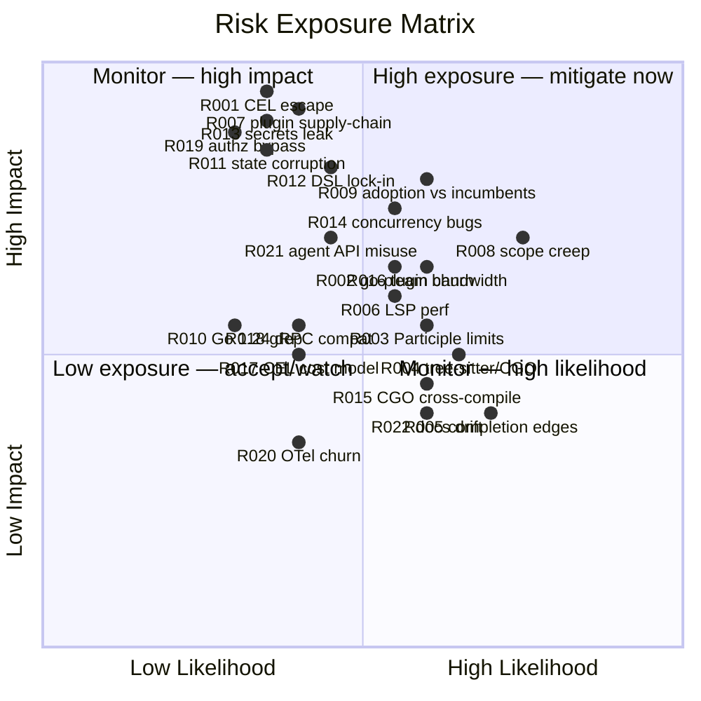

# 97 — Risk Register

> **Platform:** Conduit · **Binary:** `conduit` (alias `cdt`) · **Module:** `github.com/conduit-io/conduit`
> **Go:** 1.24+ · **Status:** Program Baseline v1.0 · **Owner:** TPM / Platform Architecture · **Date:** 2026-07-02

**Related documents:** [95 — Roadmap](95-roadmap.md) · [96 — Milestone Plan](96-milestone-plan.md) · [98 — Tech Debt Register](98-tech-debt-register.md) · [99 — ADRs](99-adrs.md) · [05 — Security Requirements](05-security-requirements.md) · [69 — Threat Model](69-threat-model.md) · [04 — Non-Functional Requirements](04-non-functional-requirements.md)

---

## 1. Scoring model

- **Likelihood (L):** 1 Rare · 2 Unlikely · 3 Possible · 4 Likely · 5 Almost certain
- **Impact (I):** 1 Negligible · 2 Minor · 3 Moderate · 4 Major · 5 Severe
- **Exposure = L × I** (1–25). Bands: **Low 1–6** · **Medium 8–12** · **High 15–19** · **Critical 20–25**.
- **Status:** Open · Mitigating · Monitoring · Accepted · Closed.

Review cadence: reviewed at every milestone gate ([96](96-milestone-plan.md)) and monthly by the TPM. Each risk has a **single accountable owner**.

---

## 2. Risk matrix (likelihood × impact)

---

## 3. Register

| ID | Category | Description | L | I | Exp | Band | Owner | Mitigation | Contingency | Trigger / early warning | Status |
|---|---|---|---|---|---|---|---|---|---|---|---|
| **RISK-001** | security | **CEL sandbox escape / resource exhaustion** — a crafted expression escapes CEL-Go limits or DoS-es the host. | 2 | 5 | 10 | Med | Security | Enforce CEL cost limits, disable macros/regex where unbounded, no host FFI; red-team test suite at [M3](96-milestone-plan.md); pen-test at [M9](96-milestone-plan.md). See ADR-0005, [25](25-expression-engine.md), [69](69-threat-model.md). | Kill-switch to disable dynamic expression features; hotfix cost caps; per-run CPU/time budget. | Expression eval latency spikes; fuzzers find non-terminating inputs. | Mitigating |
| **RISK-002** | dependency | **go-plugin protocol churn** — HashiCorp go-plugin/gRPC breaking changes across versions. | 3 | 3 | 9 | Med | Platform | Pin version; wrap in our own `CapabilityInvoker` port (ADR-0006) so churn is isolated to one adapter; contract tests. | Vendor/fork the pinned version; swap adapter behind the port. | Upstream release notes flag proto/handshake changes; CI dep-update PR fails contract tests. | Monitoring |
| **RISK-003** | technical | **Participle v2 limitations** — grammar constructs (context-sensitivity, error recovery) exceed Participle's PEG/LL(k) model. | 3 | 3 | 9 | Med | Language | Keyword-headed, non-left-recursive grammar by design ([20](20-dsl-grammar.md)); spike hard cases early ([M2](96-milestone-plan.md)); escape hatch to custom lexer states. | Hand-write the problematic sub-parser; keep AST contract stable behind the parser (ADR-0004). | A required construct cannot be expressed; error-tolerant parse regresses. | Mitigating |
| **RISK-004** | technical | **Tree-sitter / CGO build complexity** — CGO grammar complicates cross-platform builds and distribution. | 3 | 3 | 9 | Med | DX/IDE | Isolate tree-sitter in the editor/tooling path only, **not** the core runtime (ADR-0009); precompiled grammar artifacts; keep core CGO-free. | Ship highlighting via LSP semantic tokens if native grammar build blocks a platform. | Windows/macOS grammar build breaks in CI; binary size/portability regressions. | Monitoring |
| **RISK-005** | technical | **Cross-platform completion edge cases** — bash/zsh/fish/PowerShell quoting/escaping/dynamic-value differences. | 4 | 2 | 8 | Med | DX/IDE | Shared completion engine ([50](50-completion-engine.md)) with per-shell adapters; edge-case test matrix across 3 OSes at [M7](96-milestone-plan.md). | Ship static completion for a shell if dynamic path is flaky; document known gaps. | Completion mis-quotes paths/values; shell-specific bug reports. | Open |
| **RISK-006** | technical | **LSP performance** — diagnostics/completion exceed latency budget on large `.flow` files. | 3 | 3 | 9 | Med | DX/IDE | Reuse incremental compiler; debounce; cache ASTs; p95 latency budget in [04 NFR](04-non-functional-requirements.md); profile at [M8](96-milestone-plan.md). | Degrade to on-save diagnostics; cap file size for live analysis. | p95 completion latency breaches budget; editor jank reports. | Open |
| **RISK-007** | security | **Plugin trust / supply-chain compromise** — malicious or tampered plugin executes with host privileges. | 2 | 5 | 10 | Med | Security | cosign signing + verify-on-load (ADR-0006, [69](69-threat-model.md)); process isolation; least-privilege; SBOM; pinned registry. Enforced at [M6](96-milestone-plan.md). | Revoke keys; block registry; emergency allowlist-only mode. | Signature verification failure; unexpected plugin network/FS activity. | Mitigating |
| **RISK-008** | schedule | **Scope creep** — feature demands (distributed exec, marketplace) pull work forward of GA. | 4 | 4 | 16 | High | TPM | Firm phase exit gates ([95](95-roadmap.md)); post-GA outlook parks big items ([95 §8](95-roadmap.md)); change-control on scope; feature freeze at [M8](96-milestone-plan.md). | Cut non-GA-critical scope; re-baseline dates before quality. | Backlog grows faster than burn-down; "just one more thing" in reviews. | Mitigating |
| **RISK-009** | adoption | **Adoption vs incumbents** — teams stay on Make/just/Taskfile/Temporal/Airflow. | 3 | 4 | 12 | Med | PM | Clear differentiators ([00](00-executive-summary.md)); design-partner program from [M6 beta](96-milestone-plan.md); migration guides; single-binary/no-server advantage. | Narrow ICP to highest-pain segment; invest in migration tooling. | Low design-partner engagement; churn after trial. | Monitoring |
| **RISK-010** | dependency | **Go 1.24 dependency** — reliance on Go 1.24+ features narrows the install base / delays enterprise adoption. | 2 | 3 | 6 | Low | Platform | Static single-binary distribution means end users need no Go toolchain; document toolchain floor; CI on the pinned Go line (ADR-0001). | Backport-compatible code paths; raise floor only when justified. | Enterprise users blocked by toolchain policy; CI breaks on Go update. | Accepted |
| **RISK-011** | operational | **State-store corruption** — BoltDB file corruption on crash/power loss breaks resume. | 2 | 4 | 8 | Med | Platform | Event-sourced append log (ADR-0011); atomic writes; checksums; fault-injection tests at [M4](96-milestone-plan.md); `conduit state repair`. See [32](32-state-management.md). | Rebuild state from event log; export/reimport; ephemeral fallback. | Resume fails; checksum mismatch; corruption reports. | Mitigating |
| **RISK-012** | technical | **DSL design lock-in** — early FlowDSL choices become hard to change after users write `.flow` files. | 3 | 4 | 12 | Med | Language | Grammar versioning (`flow/1.0`, [20](20-dsl-grammar.md)); freeze grammar only at beta; independent grammar version stream (ADR-0015); deprecation policy ([83](83-api-standards-versioning.md)). | Migration tooling / `conduit migrate`; support multiple grammar versions. | Requested change would break existing `.flow` corpus. | Mitigating |
| **RISK-013** | security | **Secrets leakage** — secrets surface in logs, state, traces, or error messages. | 2 | 5 | 10 | Med | Security | `SecretResolver` abstraction (ADR-0018); typed secret values with redaction; log/state/trace scrubbers; redaction test at [M6](96-milestone-plan.md). See [61](61-secrets-management.md). | Rotate exposed secrets; purge affected state/logs; incident runbook. | Secret pattern detected in log/state fixtures; scanning alerts. | Mitigating |
| **RISK-014** | technical | **Concurrency correctness bugs** — data races/deadlocks in the worker-pool scheduler. | 3 | 4 | 12 | Med | Platform | Structured concurrency + single-writer state boundary ([10 §7](10-platform-architecture.md)); `-race` in CI; deterministic `Clock`; stress/soak tests. | Reduce `maxParallel` default; serialize hot paths; hotfix. | `-race` failures; intermittent CI flakes; hung runs. | Monitoring |
| **RISK-015** | technical | **CGO cross-compilation friction** — any CGO dependency (e.g. SQLite/tree-sitter) complicates static cross-compiles. | 3 | 3 | 9 | Med | Platform | Prefer pure-Go (BoltDB over SQLite for local, ADR-0012); confine CGO to tooling; per-OS release runners ([81](81-build-release-cicd.md)). | Drop/replace CGO dep; ship platform-specific artifacts. | Cross-compile fails; CGO-enabled binary bloats or won't statically link. | Monitoring |
| **RISK-016** | schedule | **Team bandwidth / key-person risk** — ~8 engineers across many surfaces; single-owner squads create bus-factor risk. | 3 | 3 | 9 | Med | TPM | Pairing on critical paths; ADRs + docs capture knowledge; rotation for release engineering; buffer in Q4 ([95 §4.5](95-roadmap.md)). | Re-sequence phases; pull in contractors for well-bounded work. | Milestone velocity drops; one person is sole owner of a critical area. | Monitoring |
| **RISK-017** | technical | **CEL cost model mis-tuning** — cost limits too tight (breaks valid flows) or too loose (DoS). | 2 | 3 | 6 | Low | Language | Empirical cost calibration on sample corpus; configurable budget; telemetry on eval cost. | Ship conservative default; tune via config; per-workflow override. | Valid flows rejected by cost cap, or eval times climb. | Open |
| **RISK-018** | dependency | **gRPC / protobuf compatibility** — proto evolution breaks host↔plugin contract across versions. | 2 | 3 | 6 | Low | Platform | Backward-compatible proto rules (add-only fields); plugin protocol version stream (ADR-0015); contract tests. | Version negotiation + shim; support N-1 proto. | Contract tests fail on proto change; older plugins reject handshake. | Monitoring |
| **RISK-019** | security | **Authorization bypass** — CEL authz policy gap lets an agent/user run a forbidden capability. | 2 | 4 | 8 | Med | Security | Deny-by-default authz (ADR-0019, [63](63-authorization.md)); policy test suite; audit logging; pen-test at [M9](96-milestone-plan.md). | Tighten default policy; disable agent API surface; audit + revoke. | Authz test coverage gap; audit shows unexpected allow. | Open |
| **RISK-020** | dependency | **OpenTelemetry API churn** — OTel Go SDK instability breaks observability wiring. | 2 | 2 | 4 | Low | Platform | Isolate behind `Logger/Tracer/Meter` ports (ADR-0013); pin SDK; thin adapter. | Swap adapter; degrade to slog-only. | OTel SDK breaking release; telemetry export errors. | Accepted |
| **RISK-021** | security | **AI-agent API misuse** — agents trigger unsafe/destructive capabilities at scale via `/v1/*`. | 3 | 4 | 12 | Med | Security | Typed capability catalog + authz + rate limits + dry-run (ADR-0017, [44](44-public-sdk.md)); audit trail; human-in-loop for destructive ops. | Disable gateway; capability allowlist per agent identity. | Spike in destructive capability calls; audit anomalies. | Mitigating |
| **RISK-022** | operational | **Documentation drift** — 30+ architecture docs diverge from code as it evolves. | 3 | 2 | 6 | Low | PM | `conduit docs` generation from metadata ([43](43-documentation-generation.md)); cross-link discipline; docs in DoD ([96 §5](96-milestone-plan.md)). | Docs sprint before GA; deprecate stale docs. | PRs land without doc updates; stale cross-links. | Monitoring |

---

## 4. Top risks (exposure-ranked watchlist)

| Rank | ID | Exp | Band | Why it leads |
|---|---|---|---|---|
| 1 | RISK-008 | 16 | High | Scope creep threatens the entire GA date; guarded by hard phase gates. |
| 2 | RISK-009 | 12 | Med | Without adoption, GA success is hollow; design-partner program is the lever. |
| 3 | RISK-012 | 12 | Med | DSL lock-in is hard to unwind once users author `.flow` corpora. |
| 4 | RISK-014 | 12 | Med | Concurrency bugs are subtle and erode reliability trust. |
| 5 | RISK-021 | 12 | Med | Agent misuse is a novel, high-blast-radius surface. |
| 6 | RISK-001 / 007 / 013 | 10 | Med | Security triad (sandbox, supply chain, secrets) — low likelihood, severe impact; heavily mitigated. |

**Security note:** RISK-001, 007, 013, 019 are all owned by Security and converge at [M6](96-milestone-plan.md) (controls) and [M9](96-milestone-plan.md) (pen-test verification). They score Medium only because of layered mitigation; their raw impact is Severe/Major. See [69 — Threat Model](69-threat-model.md).
